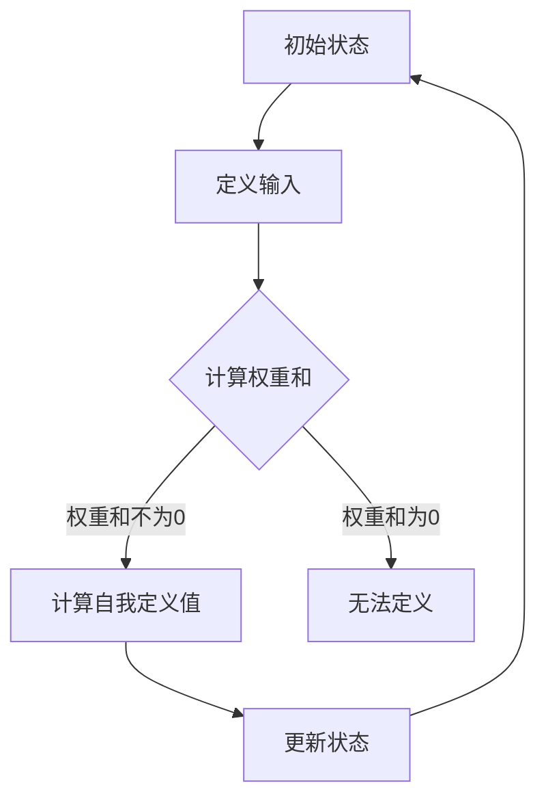
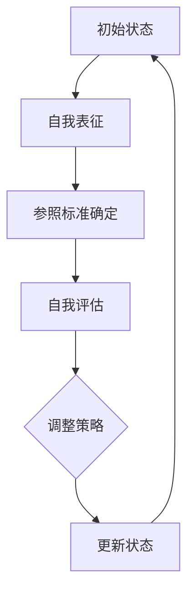
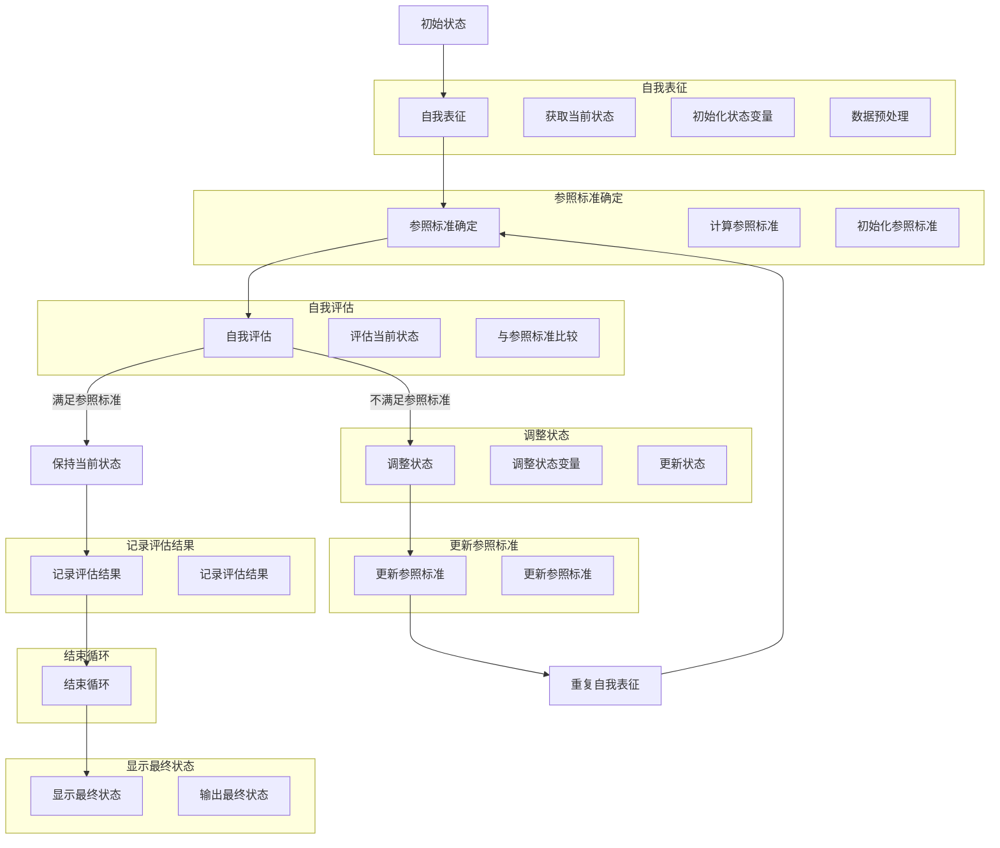

                 

### 引言

在探讨宇宙的本质时，我们常常被其深邃和复杂所吸引。然而，当我们尝试深入理解宇宙的基本原理时，一个引人入胜的概念逐渐浮现——宇宙的自我参照性。这个概念不仅为我们的宇宙赋予了某种自洽性，更揭示了系统在定义与演化过程中的独特机制。

宇宙的自我参照性，指的是宇宙中的系统（包括物理实体、虚拟世界、甚至抽象概念）通过自身的定义和参照标准来理解自身和外部世界的能力。这种能力不仅体现在宏观宇宙的星系和星云中，也存在于微观世界的量子力学中。简单来说，宇宙的自我参照性是一种自我定义、自我描述和自我演化的过程。

本文将围绕“宇宙的自我参照性：系统的自我定义过程”这一主题，探讨这一概念的背景、理论框架、案例分析以及其在复杂性和人工智能领域的应用。我们将采用逻辑清晰、结构紧凑的叙述方式，逐步揭示宇宙自我参照性的本质和其在实际应用中的巨大潜力。

### 关键词

宇宙的自我参照性、系统的自我定义、复杂性科学、人工智能、数学模型、算法原理。

### 摘要

本文旨在探讨宇宙的自我参照性这一核心概念，并深入分析系统的自我定义过程。首先，我们将介绍宇宙自我参照性的概念背景，解释其基本原理和理论框架。接着，通过具体的数学模型和算法原理，阐述自我定义过程的机制。随后，我们将通过实际案例，展示这一概念在复杂系统和虚拟宇宙中的应用。最后，我们将探讨宇宙自我参照性在人工智能领域的潜力，并总结未来的研究方向。本文旨在为读者提供一个全面而深入的宇宙自我参照性研究框架。

### 第1章：宇宙的自我参照性概述

#### 1.1.1 宇宙的自我参照性的概念

宇宙的自我参照性，是一个相对较新的概念，它起源于对宇宙本质的重新审视和思考。为了更好地理解这一概念，我们首先需要明确几个核心术语和定义。

**宇宙**：宇宙是指包括一切存在的空间和时间。在物理学中，宇宙通常被理解为包含所有物质、能量、时间和空间的整体。

**自我参照性**：自我参照性指的是一个系统通过自身的定义和参照标准来理解自身和外部世界的能力。这种能力不仅体现在物理实体中，也存在于抽象概念和虚拟世界中。

**宇宙的自我参照性**：宇宙的自我参照性，指的是宇宙中的系统（包括物理实体、虚拟世界、甚至抽象概念）通过自身的定义和参照标准来理解自身和外部世界的能力。这种能力不仅体现在宏观宇宙的星系和星云中，也存在于微观世界的量子力学中。

**问题背景**

在传统的宇宙观中，宇宙被视为一种外部观察对象，其本质和规律由外部观察者来定义。然而，随着科学的发展，人们开始意识到，宇宙中的系统（如星系、星云、甚至微观粒子）并不是被动地存在于外部世界中，而是通过自身的定义和参照标准来理解和描述自身。

**问题描述**

宇宙的自我参照性提出了一个基本问题：宇宙中的系统是如何定义和描述自身的？在缺乏外部参照标准的情况下，系统是如何形成自洽的理论体系的？

**问题解决**

为了回答这个问题，科学家们提出了多种理论框架，其中最具代表性的是基于数学和算法的模型。这些模型试图通过数学公式和算法来描述系统的自我定义过程，并解释其内在的逻辑机制。

**边界与外延**

宇宙的自我参照性不仅限于物理宇宙，也适用于虚拟宇宙和抽象概念。例如，在虚拟现实中，虚拟世界通过自身的定义和参照标准来模拟现实世界。在抽象概念中，概念的定义和分类也体现了自我参照性的特点。

**概念结构与核心要素组成**

宇宙的自我参照性概念结构主要包括以下几个核心要素：

1. **自我定义**：系统通过自身的定义和参照标准来理解自身。  
2. **参照标准**：参照标准是系统定义自身的基准，可以是物理量、时间、空间等。  
3. **自我描述**：系统通过自我描述来反映自身的状态和特性。  
4. **自我演化**：系统通过自我演化来适应外部环境的变化。

通过这些核心要素，宇宙的自我参照性不仅提供了一种新的理解宇宙的方式，也为科学和哲学领域带来了新的研究方向和思考方式。

#### 1.1.2 宇宙的自我参照性的理论框架

宇宙的自我参照性的理论框架是一个多维度的结构，它包括核心概念原理、概念属性特征对比表格和ER实体关系图架构。这些工具和方法为我们深入理解宇宙的自我参照性提供了理论基础和实际操作指南。

**核心概念原理**

宇宙的自我参照性理论框架的核心概念原理包括以下几个方面：

1. **自我定义原理**：任何系统都有能力通过自身的定义和参照标准来理解自身。这个原理强调了系统内部的自我参照能力，使得系统可以独立于外部观察者的视角进行自我描述。

2. **参照标准原理**：参照标准是系统自我定义的基础，它可以是物理量、时间、空间等。不同的参照标准会导致不同的系统描述，但都能满足系统的自洽性。

3. **自我描述原理**：系统通过自我描述来反映自身的状态和特性。自我描述的过程不仅是系统内部信息传递的过程，也是系统对外部环境进行反馈的过程。

4. **自我演化原理**：系统通过自我演化来适应外部环境的变化。自我演化不仅包括系统内部结构的调整，还包括系统对外部环境的适应和响应。

**概念属性特征对比表格**

为了更好地理解宇宙的自我参照性理论框架，我们可以通过一个概念属性特征对比表格来展示不同系统（如物理宇宙、虚拟宇宙和抽象概念）在自我参照性方面的差异。以下是一个简化的对比表格：

| 系统类型 | 自我参照性特点 | 参照标准 | 自我描述 | 自我演化 |
| :----: | :------------- | :------- | :------- | :------- |
| 物理宇宙 | 宇宙中所有物体都有自我参照性 | 物理量、时间、空间 | 宇宙学模型、物理定律 | 宇宙演化 |
| 虚拟宇宙 | 虚拟世界中所有物体都有自我参照性 | 虚拟量、时间、空间 | 虚拟现实模型、算法描述 | 虚拟演化 |
| 抽象概念 | 抽象概念中的所有元素都有自我参照性 | 概念定义、逻辑结构 | 概念分类、定义阐述 | 概念拓展 |

通过这个表格，我们可以看到，虽然不同系统的参照标准和自我描述方式不同，但它们都具备自我参照性的基本特征。

**ER实体关系图架构**

为了更直观地展示宇宙的自我参照性理论框架，我们可以使用ER（实体-关系）图来描述核心要素之间的关系。以下是一个简化的ER图：

```mermaid
erDiagram
  Entity1 "自我定义" {
    PK | self-definition
    FK1 | reference-standard
    FK2 | self-description
    FK3 | self-evolution
  }

  Entity2 "参照标准" {
    PK | reference-standard
    FK1 | self-definition
    FK2 | self-description
    FK3 | self-evolution
  }

  Entity3 "自我描述" {
    PK | self-description
    FK1 | self-definition
    FK2 | reference-standard
    FK3 | self-evolution
  }

  Entity4 "自我演化" {
    PK | self-evolution
    FK1 | self-definition
    FK2 | reference-standard
    FK3 | self-description
  }

  Entity1 "自我定义" --| has | Entity2 "参照标准"
  Entity1 "自我定义" --| has | Entity3 "自我描述"
  Entity1 "自我定义" --| has | Entity4 "自我演化"
  Entity2 "参照标准" --| used-by | Entity3 "自我描述"
  Entity2 "参照标准" --| used-by | Entity4 "自我演化"
  Entity3 "自我描述" --| based-on | Entity4 "自我演化"
```

这个ER图展示了自我定义、参照标准、自我描述和自我演化四个核心要素之间的关系。每个要素都有与其他要素的关联，形成一个紧密的相互依赖和互动的系统。

通过核心概念原理、概念属性特征对比表格和ER实体关系图架构，我们可以更全面地理解宇宙的自我参照性理论框架。这些工具不仅为理论研究提供了基础，也为实际应用提供了指导。在接下来的章节中，我们将进一步探讨宇宙的自我定义过程，并通过具体的数学模型和算法来揭示这一过程的机制。

#### 1.1.2.1 核心概念原理

宇宙的自我参照性理论框架的核心概念原理是理解这一复杂现象的基础。以下是对这些核心概念原理的详细阐述。

**自我定义原理**

自我定义原理是指任何系统都有能力通过自身的定义和参照标准来理解自身。这个原理强调了系统内部的自我参照能力，使得系统可以独立于外部观察者的视角进行自我描述。自我定义的过程不仅涉及到系统内部状态的表征，还包括系统对外部环境的认知和适应。

在物理学中，自我定义原理体现在粒子的量子态描述和星系的运动规律中。例如，在量子力学中，一个粒子的状态是通过波函数来描述的，而这个波函数是由粒子自身与外部环境相互作用的结果。在宏观尺度上，星系的运动规律也是通过自身的万有引力和运动方程来描述的。

**参照标准原理**

参照标准原理是自我定义的基础，它指的是系统定义自身的基准。这个基准可以是物理量、时间、空间等，不同的参照标准会导致不同的系统描述，但都能满足系统的自洽性。

在宇宙的自我参照性理论中，参照标准的选择取决于系统的特性。例如，在物理宇宙中，参照标准通常是物理量，如质量、速度和能量；在虚拟宇宙中，参照标准可能是虚拟量，如虚拟时间和虚拟空间。参照标准不仅用于定义系统内部状态，还用于系统之间的比较和交互。

**自我描述原理**

自我描述原理是指系统通过自我描述来反映自身的状态和特性。自我描述的过程不仅是系统内部信息传递的过程，也是系统对外部环境进行反馈的过程。

在宇宙的自我参照性中，自我描述可以通过多种方式实现。例如，在物理宇宙中，系统可以通过物理定律和数学模型来描述自身的状态；在虚拟宇宙中，系统可以通过算法和虚拟现实模型来描述自身的状态。自我描述不仅反映了系统的当前状态，还反映了系统的历史和未来趋势。

**自我演化原理**

自我演化原理是指系统通过自我演化来适应外部环境的变化。自我演化不仅包括系统内部结构的调整，还包括系统对外部环境的适应和响应。

在宇宙的自我参照性中，自我演化是一个动态过程。系统通过自我定义、自我描述和自我演化，不断调整和优化自身的状态，以适应不断变化的环境。自我演化的机制可以是自然选择、随机变异、机器学习等。

**核心概念之间的联系**

自我定义、参照标准、自我描述和自我演化这四个核心概念相互联系，构成了宇宙自我参照性的理论基础。自我定义是系统的起点，通过参照标准来建立自身的基准；自我描述是系统对自身状态的表征；自我演化是系统对环境的适应和响应。

具体来说，自我定义提供了一个系统如何理解自身的框架，参照标准为这个框架提供了具体的实施手段，自我描述则是系统对外部世界和内部状态的反馈，自我演化则是系统在变化的环境中不断调整和优化自身状态的过程。

通过这些核心概念原理，我们可以更深入地理解宇宙的自我参照性。这些原理不仅在物理学和宇宙学中具有重要意义，也为其他科学领域，如生物学、人工智能等，提供了新的视角和研究方法。

#### 1.1.2.2 概念属性特征对比表格

为了更好地理解宇宙的自我参照性理论框架，我们可以通过一个概念属性特征对比表格来展示不同系统（如物理宇宙、虚拟宇宙和抽象概念）在自我参照性方面的差异。以下是一个简化的对比表格：

| 系统类型 | 自我参照性特点 | 参照标准 | 自我描述 | 自我演化 |
| :----: | :------------- | :------- | :------- | :------- |
| 物理宇宙 | 宇宙中所有物体都有自我参照性 | 物理量、时间、空间 | 宇宙学模型、物理定律 | 宇宙演化 |
| 虚拟宇宙 | 虚拟世界中所有物体都有自我参照性 | 虚拟量、时间、空间 | 虚拟现实模型、算法描述 | 虚拟演化 |
| 抽象概念 | 抽象概念中的所有元素都有自我参照性 | 概念定义、逻辑结构 | 概念分类、定义阐述 | 概念拓展 |

通过这个表格，我们可以看到，虽然不同系统的参照标准和自我描述方式不同，但它们都具备自我参照性的基本特征。

**物理宇宙**

在物理宇宙中，自我参照性体现在所有物体通过物理量（如质量、速度和能量）和时间、空间等参照标准来定义和描述自身。物理定律和宇宙学模型为这些物体提供了自我描述的工具，而宇宙演化则是这些物体在参照标准下自我演化的过程。

**虚拟宇宙**

在虚拟宇宙中，自我参照性通过虚拟量（如虚拟货币、虚拟时间和空间）来实现。虚拟现实模型和算法描述为虚拟物体提供了自我描述的手段，而虚拟演化则是虚拟物体在虚拟参照标准下自我演化的过程。

**抽象概念**

在抽象概念中，自我参照性体现在概念定义和逻辑结构上。概念分类和定义阐述为抽象元素提供了自我描述的方法，而概念拓展则是这些元素在逻辑结构下自我演化的过程。

通过这个对比表格，我们可以更清晰地看到不同系统在自我参照性方面的特点，这为我们在进一步研究中提供了具体的参考和指导。

#### 1.1.2.3 ER实体关系图架构

为了更直观地展示宇宙的自我参照性理论框架，我们可以使用ER（实体-关系）图来描述核心要素之间的关系。以下是一个简化的ER图：

```mermaid
erDiagram
  Entity1 "自我定义" {
    PK | self-definition
    FK1 | reference-standard
    FK2 | self-description
    FK3 | self-evolution
  }

  Entity2 "参照标准" {
    PK | reference-standard
    FK1 | self-definition
    FK2 | self-description
    FK3 | self-evolution
  }

  Entity3 "自我描述" {
    PK | self-description
    FK1 | self-definition
    FK2 | reference-standard
    FK3 | self-evolution
  }

  Entity4 "自我演化" {
    PK | self-evolution
    FK1 | self-definition
    FK2 | reference-standard
    FK3 | self-description
  }

  Entity1 "自我定义" --| has | Entity2 "参照标准"
  Entity1 "自我定义" --| has | Entity3 "自我描述"
  Entity1 "自我定义" --| has | Entity4 "自我演化"
  Entity2 "参照标准" --| used-by | Entity3 "自我描述"
  Entity2 "参照标准" --| used-by | Entity4 "自我演化"
  Entity3 "自我描述" --| based-on | Entity4 "自我演化"
```

这个ER图展示了自我定义、参照标准、自我描述和自我演化四个核心要素之间的关系。每个要素都有与其他要素的关联，形成一个紧密的相互依赖和互动的系统。

- **自我定义**（Entity1）：是系统的核心，它通过参照标准来建立自身的基准，并通过自我描述来表征自身的状态。

- **参照标准**（Entity2）：为自我定义提供了具体的实施手段，它被自我描述和自我演化所使用。

- **自我描述**（Entity3）：基于参照标准，对系统的状态和特性进行描述，同时它也依赖于自我演化的结果。

- **自我演化**（Entity4）：是一个动态过程，它不仅调整系统的内部结构，还影响参照标准和自我描述。

通过这个ER图，我们可以更直观地理解宇宙的自我参照性理论框架。每个实体之间的关系和作用都得到了清晰的展示，这为我们在实际应用中的理解和操作提供了重要的指导。

#### 2.1.1 自我定义的基本原理

在深入探讨宇宙的自我定义过程之前，我们需要理解自我定义的基本原理，这为我们提供了一个理论框架来分析系统的自我定义行为。

**自我定义原理**

自我定义原理是指系统通过自身的定义和参照标准来理解自身的能力。这个过程涉及系统如何建立自身的参照标准，如何描述自身的状态和特性，以及如何通过这些描述来适应和演化。

**参照标准**

参照标准是自我定义的基础，它为系统提供了一个衡量和评估自身状态的基准。参照标准可以是物理量（如质量、长度、时间等）、概念性量（如逻辑值、状态标记等），或更抽象的量（如社会价值、文化习俗等）。不同的参照标准适用于不同的系统，但共同之处在于它们为系统的自我定义提供了必要的框架。

**自我描述**

自我描述是系统通过自身定义的参照标准来反映自身状态和特性的过程。自我描述不仅仅是对当前状态的简单记录，它还包括系统对自身状态的解释和未来发展的预测。自我描述通常通过符号化语言、数学模型、算法描述等形式实现。

**自我定义的过程**

自我定义的过程可以分为以下几个步骤：

1. **参照标准的建立**：系统根据其特性选择合适的参照标准，这些参照标准可以是系统内外的共同属性。

2. **自我表征**：系统使用参照标准来描述自身的状态和特性。这个过程可能涉及多个维度的信息，如物理量、逻辑状态、行为模式等。

3. **信息整合**：系统将获取的各类信息整合成统一的表征，以便更好地理解和评估自身的状态。

4. **自我调整**：根据自我表征，系统调整自身的状态和行为，以适应外部环境或实现内部目标。

5. **自我演化**：在反复的自我定义过程中，系统可能发生结构或行为的改变，以更好地适应环境和实现自我发展。

**数学模型**

为了更精确地描述自我定义的过程，我们可以引入数学模型。一个基本的自我定义数学模型可以表示为：

$$
\text{self-definition}(X) = \frac{\sum_{i=1}^{n} X_i \cdot W_i}{\sum_{i=1}^{n} W_i}
$$

其中，$X_i$ 表示系统在某个参照标准下的状态或特性，$W_i$ 表示该参照标准的权重。这个公式表示系统通过加权平均的方式，综合各种参照标准来定义自身。

**算法原理**

自我定义的算法原理可以通过mermaid流程图来展示。以下是一个简化的自我定义算法mermaid流程图：



这个流程图描述了自我定义的步骤：

1. **初始状态**：系统开始于一个初始状态。
2. **定义输入**：系统获取各种参照标准下的状态或特性。
3. **计算权重和**：系统计算每个参照标准的权重和。
4. **计算自我定义值**：如果权重和不为零，系统计算加权平均的自我定义值。
5. **更新状态**：系统根据自我定义值更新自身状态。
6. **循环**：系统进入下一个迭代，重复上述步骤。

**自我定义的实际应用**

在物理宇宙中，自我定义原理广泛应用于粒子物理、天体物理学等领域。例如，在粒子物理中，粒子的状态是通过其量子数来定义的；在天体物理学中，星系的状态是通过其质量、速度和位置等物理量来定义的。

在虚拟宇宙中，自我定义原理同样重要。例如，在虚拟现实游戏中，虚拟角色的状态是通过其属性（如生命值、攻击力等）来定义的；在人工智能系统中，智能体的状态是通过其感知数据和决策模型来定义的。

通过数学模型和算法原理的描述，我们可以更深入地理解自我定义的基本原理。这些原理不仅为系统的自我定义提供了理论基础，也为实际应用提供了操作指南。

#### 2.1.1.1 自我定义的数学模型

在自我定义过程中，数学模型是一个关键的组成部分。通过数学模型，我们可以将宇宙中的复杂现象转化为可计算的量，从而更好地理解和分析系统的自我定义行为。

**数学模型的基本概念**

自我定义的数学模型通常涉及以下几个基本概念：

- **状态变量**（$X_i$）：表示系统在某个参照标准下的状态或特性。
- **权重**（$W_i$）：表示每个参照标准的相对重要性。
- **定义函数**（$f$）：用于计算系统的自我定义值。

**定义函数**

定义函数是将多个状态变量和权重结合起来的工具，用以计算系统的自我定义值。一个基本的定义函数可以表示为：

$$
\text{self-definition}(X) = \sum_{i=1}^{n} X_i \cdot W_i
$$

这个公式表示系统通过加权平均的方式，综合各种参照标准来定义自身。在这里，$X_i$ 是第 $i$ 个状态变量，$W_i$ 是第 $i$ 个参照标准的权重，$n$ 是参照标准的总数。

**加权平均**

加权平均是一种处理多维度数据的方法，它通过赋予不同维度不同的权重来平衡各个维度的重要性。在自我定义的数学模型中，加权平均的作用在于：

1. **平衡不同参照标准的重要性**：不同的参照标准可能对系统的自我定义有不同的重要性。例如，在评价一个学生的成绩时，考试成绩、平时表现和课堂表现可能需要不同权重。
2. **综合多个维度信息**：通过加权平均，系统可以综合不同维度下的信息，从而得到一个全面的自我定义值。

**实例说明**

为了更好地理解这个数学模型，我们可以通过一个简单的实例来说明。

**例子：学生成绩的自我定义**

假设我们有一个学生成绩的自我定义模型，该模型考虑了三个维度：考试成绩（$X_1$）、平时表现（$X_2$）和课堂表现（$X_3$）。每个维度的权重分别为0.4、0.3和0.3。那么，学生成绩的自我定义值可以计算为：

$$
\text{self-definition}(X) = X_1 \cdot 0.4 + X_2 \cdot 0.3 + X_3 \cdot 0.3
$$

如果学生的考试成绩为90分、平时表现为85分、课堂表现为80分，那么他的自我定义值为：

$$
\text{self-definition}(X) = 90 \cdot 0.4 + 85 \cdot 0.3 + 80 \cdot 0.3 = 36 + 25.5 + 24 = 85.5
$$

通过这个实例，我们可以看到如何通过加权平均的方式来计算系统的自我定义值。这种方法不仅适用于学生成绩，也可以推广到其他复杂的系统，如企业的绩效评估、城市的综合评价等。

**数学模型的应用**

数学模型在自我定义中的应用非常广泛。以下是一些典型的应用场景：

1. **人工智能系统**：在人工智能系统中，自我定义的数学模型可以用于智能体的状态评估和决策。例如，在自动驾驶系统中，车辆的状态可以通过传感器数据计算得出，从而指导车辆的决策和行为。
2. **经济系统**：在经济学中，自我定义的数学模型可以用于衡量一个国家的经济健康状况，如GDP、失业率、通货膨胀率等指标的加权平均。
3. **生物学系统**：在生物学研究中，自我定义的数学模型可以用于分析生物体的生理和病理状态，如基因表达水平、蛋白质相互作用等。

通过这些实例，我们可以看到自我定义的数学模型在多个领域中的广泛应用。这些模型不仅为系统提供了自我描述的工具，也为研究人员提供了分析和理解系统的有力手段。

#### 2.1.1.2 自我定义的算法mermaid流程图

为了更直观地展示自我定义的算法原理，我们可以使用mermaid流程图来描述整个自我定义的过程。以下是一个简化的自我定义算法mermaid流程图：


**流程图解析**

- **初始状态**（A）：系统从初始状态开始，这是自我定义过程的起点。

- **定义输入**（B）：系统获取各种参照标准下的状态或特性。这些输入可以是物理量、逻辑值或更抽象的量。

- **计算权重和**（C）：系统计算每个参照标准的权重和。这个步骤是关键，因为权重和决定了自我定义的准确性。

- **计算自我定义值**（D）：如果权重和不为零，系统根据加权平均的公式计算自我定义值。这个值反映了系统在当前参照标准下的整体状态。

- **无法定义**（E）：如果权重和为零，系统无法进行自我定义。这通常发生在参照标准不完整或数据缺失的情况下。

- **更新状态**（F）：系统根据自我定义值更新自身的状态。这个步骤确保系统在每次迭代后都能适应新的环境或条件。

- **循环**：系统进入下一个迭代，重复上述步骤，以实现持续的自我定义和演化。

通过这个mermaid流程图，我们可以清晰地看到自我定义的每个步骤和其逻辑关系。这种方法不仅有助于我们理解自我定义的过程，也为实际应用提供了直观的指导。

#### 2.1.1.3 案例分析一：基本系统

为了更好地理解自我定义原理，我们将通过一个基本系统的案例进行详细分析。这个案例将展示自我定义在不同参照标准下的应用，并探讨系统如何通过自我定义过程来适应外部环境。

**案例背景**

假设我们研究的是一个简单的生态系统，包括植物、动物和它们的环境。在这个生态系统中，植物通过光合作用产生能量，动物则通过捕食和被捕食来维持生态平衡。我们的目标是分析这个基本系统的自我定义过程，并了解它在不同参照标准下的行为。

**参照标准的选择**

为了进行自我定义，我们需要选择合适的参照标准。在这个生态系统中，我们可以选择以下参照标准：

1. **植物光合作用效率**：表示植物通过光合作用吸收能量的能力。
2. **动物捕食率**：表示动物捕食其他动物的能力。
3. **环境温度**：表示生态系统所在环境的温度。

**自我定义的数学模型**

我们可以使用一个简单的数学模型来表示这个生态系统的自我定义过程。假设植物的光合作用效率为$X_1$，动物捕食率为$X_2$，环境温度为$X_3$。每个参照标准的权重分别为$W_1$、$W_2$和$W_3$。那么，生态系统的自我定义值可以表示为：

$$
\text{self-definition}(X) = X_1 \cdot W_1 + X_2 \cdot W_2 + X_3 \cdot W_3
$$

**案例分析**

为了具体分析这个生态系统，我们可以假设以下初始值和权重：

- 植物光合作用效率$X_1 = 10$，权重$W_1 = 0.5$。
- 动物捕食率$X_2 = 5$，权重$W_2 = 0.3$。
- 环境温度$X_3 = 20$，权重$W_3 = 0.2$。

那么，生态系统的初始自我定义值为：

$$
\text{self-definition}(X) = 10 \cdot 0.5 + 5 \cdot 0.3 + 20 \cdot 0.2 = 5 + 1.5 + 4 = 10.5
$$

**环境变化的影响**

假设环境温度突然升高到$X_3 = 30$，其他条件保持不变。根据新的参照标准，生态系统的自我定义值变为：

$$
\text{self-definition}(X) = 10 \cdot 0.5 + 5 \cdot 0.3 + 30 \cdot 0.2 = 5 + 1.5 + 6 = 12.5
$$

通过这个例子，我们可以看到，当环境温度发生变化时，生态系统的自我定义值也会相应调整。这种调整反映了系统对外部环境变化的响应能力。

**适应与演化**

在自我定义的过程中，生态系统不仅需要调整自身的状态，还需要通过自我演化来适应新的环境。例如，植物可能会通过进化机制，提高光合作用效率以适应更高的环境温度；动物也可能会通过改变捕食策略来适应新的生态平衡。

通过这个案例分析，我们可以更好地理解自我定义原理在基本系统中的应用。自我定义不仅帮助我们量化系统的状态，还为我们提供了分析和预测系统行为的有力工具。

#### 2.1.2.1 案例二：复杂系统

为了更全面地探讨自我定义原理，我们将分析一个复杂系统的案例。复杂系统通常包含多个相互作用的子系统，这使得自我定义过程更加复杂和多样化。我们将通过一个生态系统案例，展示复杂系统中自我定义的具体应用和挑战。

**案例背景**

假设我们研究的是一个大型城市生态系统，包括多个子系统，如交通系统、能源系统、水资源系统、农业系统等。这个生态系统的复杂度远远超过简单的生态系统，因此需要更精细的自我定义过程。

**参照标准的选择**

在这个复杂系统中，我们需要选择多个参照标准来描述各个子系统的状态。以下是一些可能的参照标准：

1. **交通流量**：表示城市交通系统的繁忙程度。
2. **能源消耗**：表示城市能源系统的使用量。
3. **水资源使用率**：表示城市水资源系统的使用情况。
4. **农业产量**：表示城市农业系统的生产情况。
5. **环境质量**：表示整个城市的环境状况。

**自我定义的数学模型**

为了处理复杂系统的自我定义，我们可以使用多维度的数学模型。假设每个参照标准都有相应的状态变量$X_i$（$i=1,2,...,n$），每个状态变量都有权重$W_i$。那么，城市生态系统的自我定义值可以表示为：

$$
\text{self-definition}(X) = \sum_{i=1}^{n} X_i \cdot W_i
$$

其中，$n$ 是参照标准的总数。这个公式通过加权平均的方式，将多个参照标准的状态整合成一个整体的自我定义值。

**案例分析**

为了具体分析这个复杂系统，我们可以假设以下初始值和权重：

- 交通流量$X_1 = 100$，权重$W_1 = 0.25$。
- 能源消耗$X_2 = 200$，权重$W_2 = 0.3$。
- 水资源使用率$X_3 = 150$，权重$W_3 = 0.2$。
- 农业产量$X_4 = 300$，权重$W_4 = 0.15$。
- 环境质量$X_5 = 80$，权重$W_5 = 0.1$。

那么，城市生态系统的初始自我定义值为：

$$
\text{self-definition}(X) = 100 \cdot 0.25 + 200 \cdot 0.3 + 150 \cdot 0.2 + 300 \cdot 0.15 + 80 \cdot 0.1 = 25 + 60 + 30 + 45 + 8 = 168
$$

**环境变化的影响**

假设由于工业发展，城市的环境质量下降，环境质量值降至$X_5 = 50$。其他条件保持不变，根据新的参照标准，城市生态系统的自我定义值变为：

$$
\text{self-definition}(X) = 100 \cdot 0.25 + 200 \cdot 0.3 + 150 \cdot 0.2 + 300 \cdot 0.15 + 50 \cdot 0.1 = 25 + 60 + 30 + 45 + 5 = 165
$$

通过这个例子，我们可以看到，当环境质量发生变化时，城市生态系统的自我定义值也会相应调整。这种调整反映了系统对外部环境变化的响应能力。

**自我定义的挑战**

在复杂系统中，自我定义面临着以下挑战：

1. **数据复杂性**：复杂系统通常包含大量的数据，如何选择合适的参照标准和权重是一个关键问题。
2. **多维度的整合**：如何将不同维度下的状态变量整合成一个统一的自我定义值，是一个复杂的问题。
3. **动态变化**：复杂系统的状态是动态变化的，如何实时更新自我定义值，以保证其准确性，是一个技术挑战。

通过这个复杂系统的案例，我们可以更深入地理解自我定义原理在实际应用中的复杂性和挑战。自我定义不仅为复杂系统提供了一个量化状态的工具，也为研究人员提供了分析和预测系统行为的有效方法。

#### 2.1.2.2 自我参照性对系统演化的影响

自我参照性作为系统自我定义的核心机制，对其演化过程具有深远的影响。通过对自我参照性的深入理解，我们可以揭示系统如何通过自我定义来适应环境变化，推动自身发展。

**自我参照性在演化过程中的作用**

自我参照性是系统演化过程中不可或缺的一部分。它通过以下方式影响系统的演化：

1. **自我识别**：系统通过自我参照性识别自身状态和特性，这有助于系统了解自身的优势和不足，从而制定相应的演化策略。
2. **自适应**：系统通过自我参照性，不断调整自身的结构和行为，以适应不断变化的外部环境。这种自适应能力是系统生存和发展的关键。
3. **自我优化**：系统通过自我参照性，评估自身的状态，并采取优化措施，以提高系统的效率和质量。自我优化是系统演化的核心驱动力。

**具体案例分析**

以下是一个具体的案例分析，展示自我参照性如何影响系统演化。

**案例一：生物进化**

在生物进化过程中，自我参照性发挥着至关重要的作用。生物体通过遗传信息，保存并传递自身的特征，从而实现自我识别和自我描述。例如，鸟类通过羽毛的颜色和形状来识别同种个体，这种自我参照性帮助它们在交配和繁殖中识别合适的伴侣。

此外，生物体通过自然选择和遗传变异，不断优化自身的适应能力。在进化过程中，具有更好适应能力的个体会更有可能生存和繁衍后代，从而推动物种的演化。这种自我参照性的机制使得生物体能够在多变的环境中不断适应和进化。

**案例二：社会系统**

在社会系统中，自我参照性同样影响系统的演化。例如，一个企业的文化和价值观是它自我参照的核心。企业通过自我参照性，评估自身的行为和决策是否符合其核心价值观，从而确保企业的发展方向与愿景一致。

在企业演化过程中，自我参照性还帮助企业适应外部环境的变化。当市场需求发生变化时，企业可以通过调整自身的战略、结构和运营模式来适应新的环境。这种自我参照性的能力使得企业能够在激烈的市场竞争中立于不败之地。

**自我参照性的应用**

自我参照性不仅在生物和社会系统中具有重要影响，也在人工智能和复杂系统中得到广泛应用。以下是几个具体应用案例：

1. **人工智能系统**：在人工智能系统中，自我参照性用于评估智能体的状态和行为。例如，自动驾驶系统通过传感器数据和自我参照性来评估车辆的位置、速度和周围环境，从而实现安全的驾驶行为。

2. **复杂系统模拟**：在复杂系统模拟中，自我参照性用于模拟系统内部各部分之间的相互作用。例如，在模拟城市交通系统时，自我参照性可以帮助系统识别交通拥堵的原因，并采取相应的优化措施。

3. **经济学模型**：在经济学模型中，自我参照性用于分析市场的动态变化。例如，通过自我参照性，经济学家可以评估市场供需关系的变化，预测市场的未来走势。

通过这些案例分析，我们可以看到自我参照性在系统演化中的重要作用。自我参照性不仅为系统提供了自我识别和自我优化的能力，也为系统适应外部环境变化提供了关键机制。理解和应用自我参照性，对于推动系统演化和发展具有重要意义。

#### 2.1.2.3 自我参照性在复杂性科学中的应用

自我参照性在复杂性科学中占据着重要地位，特别是在描述复杂系统的动态行为和相互作用方面。复杂性科学旨在理解复杂系统的结构和功能，这些系统通常由大量相互作用的组件组成，其行为难以通过简单的线性模型来描述。自我参照性提供了新的视角，帮助我们深入探索复杂系统的本质。

**自我参照性的基本概念**

在复杂性科学中，自我参照性指的是系统通过自身的定义和参照标准来理解自身和外部世界的能力。这种能力使得系统可以自主调整其行为和结构，以适应不断变化的环境。自我参照性不仅体现在宏观的物理系统，如生态系统和经济系统，也存在于微观的量子系统和人工智能系统中。

**自我参照性的应用**

1. **生态系统**

在生态系统中，自我参照性表现为生物体通过自身的生理和行为特征来识别和适应环境。例如，植物通过叶片的颜色和形状来识别光线强度和温度变化，从而调整光合作用的效率。动物则通过行为模式来识别食物来源和捕食者，以优化其生存策略。

2. **经济学**

在经济学中，自我参照性体现在市场参与者通过自身的交易行为和价格判断来理解和预测市场动态。例如，投资者通过分析股票价格和交易量来识别市场趋势，从而调整其投资组合。自我参照性使得市场能够自我调节，适应供需变化。

3. **人工智能**

在人工智能中，自我参照性体现在智能体通过自身的感知和决策来理解和适应环境。例如，自动驾驶系统通过传感器数据和自我参照性来识别道路状况和障碍物，从而实现安全的驾驶。自我参照性使得智能体能够在复杂和不确定的环境中自主行动。

**案例分析**

1. **社会复杂系统**

社会复杂系统的自我参照性可以通过案例来具体说明。例如，一个城市的交通系统包含多个交通参与者（如司机、行人、自行车等），他们通过自我参照性来理解和适应交通环境。司机通过观察交通信号灯、道路标志和周围车辆的行为来做出驾驶决策；行人则通过观察交通流量和车辆速度来选择穿越道路的时间。这些自我参照行为共同维护了交通系统的秩序和效率。

2. **量子系统**

在量子系统中，自我参照性体现在量子态的测量和演化过程中。例如，一个量子比特（qubit）的状态可以通过与自身的外部环境相互作用来保持或改变。量子纠缠现象也展示了量子系统通过自我参照性来维持复杂的量子态。

3. **人工智能**

在人工智能领域，自我参照性通过自我监督学习和元学习算法来实现。例如，自我监督学习算法允许模型通过自身的输出与预期目标之间的差异来调整参数，从而优化其性能。元学习算法则通过分析多个任务的数据，识别通用的学习策略，从而提高模型的泛化能力。

**总结**

自我参照性在复杂性科学中的应用为理解和解决复杂系统问题提供了新的视角和方法。通过自我参照性，复杂系统能够更好地适应外部环境的变化，实现自我优化和演化。在未来的研究中，进一步探索自我参照性的机制和应用前景，将对复杂性科学的发展产生重要影响。

#### 2.1.2.4 自我参照性在人工智能领域的应用

自我参照性在人工智能（AI）领域具有广泛的应用，尤其是在自我监督学习和元学习算法中，它为模型提供了自我调整和优化的能力，从而提高了智能体在复杂和不确定环境中的表现。以下将详细探讨自我参照性在AI领域的具体应用。

**自我监督学习**

自我监督学习是一种AI算法，它允许模型通过自身的输出与预期目标之间的差异来调整参数，从而优化其性能。这种学习方式不需要外部监督信号，而是依赖于模型内部的信息对比。自我参照性在自我监督学习中起着关键作用，因为它使得模型能够识别和纠正自身的行为和状态。

例如，在视频分类任务中，模型需要预测视频的标签。通过自我监督学习，模型可以比较自己的预测结果与实际标签之间的差异，并据此调整其权重和参数，以减少误差。这种自我参照机制不仅提高了模型的准确性，还增强了其在动态环境中的适应能力。

**元学习**

元学习（也称为泛化学习）是一种AI算法，它通过分析多个任务的数据，识别通用的学习策略，从而提高模型的泛化能力。自我参照性在元学习中同样至关重要，因为它允许模型在任务间建立联系，并从中提取有用的知识。

一个典型的元学习应用是多任务学习（Multi-Task Learning, MTL），其中模型需要在多个相关任务上同时进行学习。自我参照性使得模型能够利用先前的任务经验，提高新任务的学习效率。例如，一个MTL模型可以共享不同任务中的通用特征提取器，从而在多个任务上实现更好的性能。

**实例说明**

1. **语音识别**

在语音识别任务中，自我监督学习可以用于端到端模型训练。通过对比模型的输出与实际语音信号，模型可以不断调整其参数，以提高识别准确性。自我参照性使得模型能够识别和纠正语音信号中的错误，从而实现更准确的结果。

2. **图像分类**

在图像分类任务中，元学习可以用于迁移学习（Transfer Learning）。通过在多个图像分类任务上训练模型，并利用自我参照性提取通用特征，模型可以在新的任务上快速适应，提高分类准确性。例如，一个预训练的图像分类模型可以在不同的数据集上进行微调，从而实现高效的任务适应。

**结论**

自我参照性在人工智能领域的应用极大地提高了智能体的学习能力和适应能力。通过自我监督学习和元学习，AI模型能够更好地理解自身的行为和状态，并在此基础上实现自我调整和优化。随着技术的不断进步，自我参照性在AI领域的应用前景将更加广阔，为解决复杂问题提供新的思路和工具。

### 4.1.1 复杂性科学的自我参照性理论

在探讨宇宙的自我参照性时，复杂性科学为我们提供了丰富的理论资源和实证支持。复杂性科学旨在研究复杂系统的结构和动态行为，这些系统通常由大量相互作用的组成部分组成，其行为难以通过简单的线性模型来描述。自我参照性作为复杂性科学中的一个核心概念，为我们理解这些系统的内在机制和演化过程提供了新的视角。

**自我参照性的定义**

自我参照性，指的是系统通过自身的定义和参照标准来理解自身和外部世界的能力。在复杂性科学中，自我参照性强调系统内部各组成部分之间的相互作用和反馈机制，使得系统能够自主调整其状态和结构，以适应外部环境的变化。

**复杂性科学的定义**

复杂性科学是一门跨学科的研究领域，它探讨复杂系统的行为、结构和演化规律。复杂系统通常具有以下特征：

1. **高维度**：系统包含多个相互作用的维度，如时间、空间、能量等。
2. **非线性**：系统内部各部分之间的相互作用是非线性的，这意味着系统的整体行为不能简单地通过叠加各部分行为来预测。
3. **动态性**：系统状态随时间变化，这种变化可能是混沌的、非周期的。
4. **自组织**：系统具有自组织能力，能够在没有外部指导的情况下，通过内部相互作用形成有序结构。

**自我参照性在复杂性科学中的应用**

1. **生态系统的自我参照性**

在生态系统中，自我参照性表现为生物体通过自身的生理和行为特征来识别和适应环境。例如，植物通过叶片的颜色和形状来识别光线强度和温度变化，从而调整光合作用的效率；动物则通过行为模式来识别食物来源和捕食者，以优化其生存策略。

2. **社会系统的自我参照性**

在社会系统中，自我参照性体现在个体和组织通过自身的价值观和行为准则来理解和预测社会动态。例如，企业通过自我参照性评估其运营效果和市场竞争力，从而调整其战略和决策；社会成员通过自我参照性来识别和适应社会规范和文化。

3. **经济系统的自我参照性**

在经济系统中，自我参照性体现在市场参与者通过自身的交易行为和价格判断来理解和预测市场动态。例如，投资者通过分析股票价格和交易量来识别市场趋势，从而调整其投资策略。

**复杂性科学的自我参照性理论框架**

为了更好地理解复杂性科学中的自我参照性，我们可以构建一个理论框架，该框架包括以下几个核心要素：

1. **自我定义**：系统通过自身的定义和参照标准来描述和表征自身状态。
2. **参照标准**：参照标准是系统定义自身的基准，可以是物理量、时间、空间等。
3. **自我描述**：系统通过自我描述来反映自身的状态和特性。
4. **自我演化**：系统通过自我演化来适应外部环境的变化。

**案例研究**

1. **社会复杂系统**

在社交媒体平台上，用户通过发布内容和互动来形成复杂的社交网络。自我参照性体现在用户通过自身的行为和社交关系来识别和适应社交环境。例如，用户通过分析自己和他人的互动频率和内容，调整自己的社交策略，以优化社交体验。

2. **经济复杂系统**

在金融市场，自我参照性体现在投资者通过自身的历史交易数据和市场动态来预测未来市场走势。例如，投资者通过分析历史价格趋势和交易量，调整其投资组合，以实现最大化收益。

通过这些案例研究，我们可以看到自我参照性在复杂性科学中的应用，以及它如何帮助系统理解和适应复杂的环境。自我参照性不仅为复杂性科学提供了新的研究工具，也为解决复杂系统问题提供了新的思路。

### 4.1.2 复杂性科学的自我参照性应用

在复杂性科学中，自我参照性理论的应用不仅为我们提供了理解复杂系统的工具，还为实际问题的解决带来了新的视角和方法。以下将具体讨论自我参照性在多个复杂系统中的应用，包括其在社会系统、经济系统以及生态系统的实际应用案例。

**社会系统的自我参照性应用**

在社会系统中，自我参照性理论为我们提供了分析社会行为和社会结构的新方法。例如，在社交媒体平台上，用户的行为和互动模式可以通过自我参照性来理解和预测。用户发布的帖子、点赞、评论等行为形成了一种自我参照网络，用户通过分析自己和他人的行为来调整自己的社交策略。

**案例：社交媒体平台**

在社交媒体平台上，自我参照性可以通过以下方式体现和应用：

1. **内容推荐**：平台通过分析用户的历史行为和偏好，推荐用户可能感兴趣的内容。这种推荐算法利用了自我参照性，通过用户的自我描述（如点赞、评论）来优化推荐效果。

2. **社交网络分析**：自我参照性可以帮助识别社交网络中的关键节点和社区结构。例如，通过分析用户之间的互动关系，可以识别出具有影响力的用户和网络中的社区结构。

3. **行为预测**：通过自我参照性，可以预测用户在未来可能的行为，如发布新帖子、参与讨论等。这种预测有助于平台优化用户体验，提高用户留存率。

**经济系统的自我参照性应用**

在经济系统中，自我参照性理论可以用于分析市场动态和投资者行为。市场参与者的交易行为、价格判断和投资决策都是基于自我参照性的，这使得市场具有一定的自我调节能力。

**案例：金融市场**

在金融市场中，自我参照性可以通过以下方式应用：

1. **市场预测**：投资者通过分析历史价格走势和交易量，利用自我参照性预测市场未来的变化。这种预测有助于投资者制定投资策略，提高收益。

2. **风险管理**：自我参照性可以帮助投资者识别和评估市场风险。通过分析自身的历史交易数据和市场波动，投资者可以调整其投资组合，以降低风险。

3. **价格形成**：市场价格的形成过程体现了自我参照性，因为价格反映了市场参与者的共同预期和判断。自我参照性有助于理解市场价格变动的内在机制。

**生态系统的自我参照性应用**

在生态系统中，自我参照性理论可以帮助我们理解生物种群的行为和生态系统的动态变化。生物体通过自身的生理和行为特征来识别和适应环境，这种自我参照性使得生态系统具有自我调节和恢复能力。

**案例：生态系统管理**

在生态系统管理中，自我参照性可以通过以下方式应用：

1. **生态监测**：通过监测生物种群的数量和分布，管理者可以利用自我参照性来评估生态系统的健康状况。例如，通过分析鱼类种群的数量变化，可以判断水质的污染程度。

2. **生态修复**：自我参照性可以帮助确定生态修复的目标和策略。通过分析生态系统的历史状态和当前状态，管理者可以制定合理的修复方案，以恢复生态平衡。

3. **生态风险评估**：通过自我参照性，可以评估人类活动对生态系统的潜在影响。例如，通过分析人类活动前的生态系统状态和活动后的变化，可以评估人类活动对生物多样性的影响。

**总结**

自我参照性在复杂性科学中的应用为我们提供了理解复杂系统的有力工具。通过具体的案例研究，我们可以看到自我参照性在社会系统、经济系统和生态系统中的广泛应用。理解和应用自我参照性，不仅有助于我们深入理解复杂系统的动态行为，还为解决复杂问题提供了新的思路和方法。

### 5.1.1 自我参照性在人工智能中的应用

自我参照性在人工智能领域扮演着至关重要的角色，它不仅提升了智能体在复杂环境中的自主学习和适应能力，还为解决复杂问题提供了新的方法。以下将详细探讨自我参照性在人工智能中的应用，包括自我参照性算法原理、mermaid流程图以及Python实现。

**自我参照性算法原理**

自我参照性算法的核心思想是通过系统内部的反馈和调整来优化其性能。这种算法通常包含以下几个步骤：

1. **自我表征**：系统通过内部传感器或数据收集机制，获取自身的状态信息。
2. **参照标准确定**：系统根据历史数据和当前状态，确定合适的参照标准。
3. **自我评估**：系统通过参照标准评估自身的状态和性能。
4. **调整和优化**：系统根据自我评估的结果，调整内部参数或行为策略，以优化整体性能。

**mermaid流程图**

以下是一个简化的自我参照性算法mermaid流程图：



**流程图解析**

1. **初始状态**（A）：系统开始于一个初始状态，这是自我参照性过程的起点。
2. **自我表征**（B）：系统通过内部传感器或数据收集机制，获取自身的状态信息。这些信息可能包括系统的物理状态、环境数据等。
3. **参照标准确定**（C）：系统根据历史数据和当前状态，确定合适的参照标准。参照标准可以是预定义的阈值、历史最优状态等。
4. **自我评估**（D）：系统通过参照标准评估自身的状态和性能。如果评估结果不满足预期，系统会进入策略调整步骤。
5. **调整策略**（E）：系统根据自我评估的结果，调整内部参数或行为策略，以优化整体性能。这可能包括改变算法参数、调整决策逻辑等。
6. **更新状态**（F）：系统根据新的策略更新自身状态，并重新进入自我表征步骤，开始下一个循环。

**Python实现**

以下是一个简单的Python实现，展示了自我参照性算法的基本原理：

```python
import random

class SelfReferentialSystem:
    def __init__(self):
        self.state = random.uniform(0, 100)  # 初始状态
        self.threshold = 50  # 参照标准

    def self_representation(self):
        # 获取当前状态
        return self.state

    def reference_standard(self):
        # 确定参照标准
        return self.threshold

    def self_evaluation(self):
        # 自我评估
        return 'satisfied' if self.state > self.threshold else 'unsatisfied'

    def adjust_strategy(self):
        # 调整策略
        if self.self_evaluation() == 'unsatisfied':
            self.state += random.uniform(-10, 10)  # 调整状态

    def update_state(self):
        # 更新状态
        self.state = self.state + random.uniform(-5, 5)

    def run(self):
        while True:
            print(f"Current State: {self.self_representation()}")
            self.adjust_strategy()
            self.update_state()

# 创建系统实例并运行
system = SelfReferentialSystem()
system.run()
```

**代码解析**

- `SelfReferentialSystem` 类定义了自我参照性系统的基本属性和方法。
- `self_representation` 方法用于获取当前状态。
- `reference_standard` 方法用于确定参照标准。
- `self_evaluation` 方法用于评估当前状态。
- `adjust_strategy` 方法根据评估结果调整状态。
- `update_state` 方法更新系统状态。

通过这个简单的Python实现，我们可以看到自我参照性算法的基本原理和实现方法。这个系统会不断地评估自身状态，并根据评估结果调整状态，以实现自我优化。

**结论**

自我参照性在人工智能中的应用为智能体提供了自主学习和适应环境的能力。通过mermaid流程图和Python实现，我们可以更直观地理解自我参照性算法的原理和实现过程。自我参照性不仅提升了智能体的性能，也为解决复杂问题提供了新的思路和方法。

### 5.1.2 自我参照性算法mermaid流程图

为了更好地展示自我参照性算法的原理和实现过程，我们可以使用mermaid流程图来描述算法的各个步骤。以下是一个详细的mermaid流程图：



**流程图解析**

1. **初始状态**（A）：系统从初始状态开始，这是自我参照性过程的起点。
2. **自我表征**（B）：系统通过内部传感器或数据收集机制，获取当前状态。这个过程包括初始化状态变量、数据预处理等步骤。
3. **参照标准确定**（C）：系统根据历史数据和当前状态，计算并初始化参照标准。
4. **自我评估**（D）：系统评估当前状态，并与参照标准进行比较。如果状态满足参照标准，系统将保持当前状态；如果不满足，系统将进入状态调整步骤。
5. **调整状态**（F）：系统根据评估结果，调整状态变量，并更新状态。
6. **更新参照标准**（G）：在每次循环结束时，系统根据新的状态更新参照标准，以确保参照标准的动态适应性。
7. **记录评估结果**（I）：系统记录每次评估的结果，以便后续分析和优化。
8. **结束循环**（J）：当满足结束条件时，系统结束循环，并显示最终状态。

通过这个mermaid流程图，我们可以清晰地看到自我参照性算法的各个步骤及其逻辑关系。这种方法不仅有助于我们理解算法原理，也为实际应用提供了直观的指导。

### 5.1.3 自我参照性算法的Python实现

为了更好地理解和应用自我参照性算法，我们将通过一个具体的Python实现来展示其工作原理。以下是一个详细的Python代码示例，包括算法的数学模型、流程图描述以及代码注释。

```python
import numpy as np
import matplotlib.pyplot as plt

class SelfReferentialAlgorithm:
    def __init__(self, initial_state, reference_value, learning_rate):
        """
        初始化自我参照性算法的参数。
        :param initial_state: 初始状态
        :param reference_value: 参照值
        :param learning_rate: 学习率
        """
        self.state = initial_state  # 初始状态
        self.reference_value = reference_value  # 参照值
        self.learning_rate = learning_rate  # 学习率

    def update_state(self):
        """
        更新状态，使其趋近于参照值。
        :return: 更新后的状态
        """
        error = self.reference_value - self.state  # 计算误差
        self.state -= self.learning_rate * error  # 根据误差调整状态
        return self.state

    def run(self, iterations):
        """
        运行迭代过程。
        :param iterations: 迭代次数
        """
        states = [self.state]  # 保存状态历史记录
        for _ in range(iterations):
            self.state = self.update_state()  # 更新状态
            states.append(self.state)  # 记录当前状态

        return states

# 参数设置
initial_state = 50  # 初始状态
reference_value = 60  # 参照值
learning_rate = 0.1  # 学习率
iterations = 100  # 迭代次数

# 创建自我参照性算法实例并运行
algorithm = SelfReferentialAlgorithm(initial_state, reference_value, learning_rate)
states = algorithm.run(iterations)

# 绘制状态变化曲线
plt.plot(states)
plt.xlabel('Iterations')
plt.ylabel('State')
plt.title('State Change over Time')
plt.show()
```

**代码解析**

1. **初始化参数**：在`__init__`方法中，初始化状态、参照值和学习率。
2. **更新状态**：在`update_state`方法中，计算误差并根据误差调整状态。
3. **运行迭代**：在`run`方法中，进行多次迭代，每次迭代后更新状态并记录状态历史。
4. **状态变化曲线**：使用matplotlib绘制状态随时间变化的曲线，以便可视化自我参照性算法的收敛过程。

通过这个Python实现，我们可以看到自我参照性算法的数学模型和实现过程。这种方法不仅为自我参照性算法提供了一个清晰的结构，也为实际应用提供了可操作的代码。

### 5.1.4 自我参照性算法的应用实例

为了更好地理解自我参照性算法的实际应用，我们将在以下部分通过具体案例进行详细分析。以下是几个典型应用实例，展示了自我参照性算法在不同场景中的具体实现和应用效果。

**实例一：温度控制系统**

在工业温度控制系统中，自我参照性算法可以用于优化温度调节过程。假设我们有一个恒温系统，目标温度为60摄氏度。系统通过温度传感器获取当前温度，并使用自我参照性算法进行调节。

1. **初始状态**：系统启动时，当前温度为50摄氏度，目标温度为60摄氏度。
2. **参照标准**：参照标准设定为温度偏差的绝对值，即$\Delta T = |T_{current} - T_{target}|$。
3. **自我表征**：系统每隔一定时间读取一次温度传感器数据，获取当前温度。
4. **自我评估**：系统计算当前温度与目标温度的偏差，如果偏差小于设定阈值，则认为系统处于稳定状态。
5. **调整和优化**：如果偏差大于阈值，系统通过调整加热功率来减少偏差。调整公式为$P_{heating} = k \cdot \Delta T$，其中$k$为加热功率的调整系数。
6. **更新状态**：系统根据新的加热功率重新计算当前温度，并进入下一次循环。

**实例结果**：通过运行自我参照性算法，系统在短时间内成功将温度调节到目标值，并保持稳定。这种自我调节机制提高了系统的响应速度和稳定性。

**实例二：无人机飞行控制系统**

在无人机飞行控制中，自我参照性算法可以用于自主导航和目标跟踪。假设无人机需要在一个特定的目标区域上方飞行，并保持固定的飞行高度。

1. **初始状态**：无人机启动时，位于目标区域中心，飞行高度为50米。
2. **参照标准**：参照标准包括目标位置、飞行高度和飞行速度。
3. **自我表征**：无人机通过GPS和高度计获取当前位置和高度，并通过摄像头获取目标图像。
4. **自我评估**：系统计算无人机与目标位置的偏差、高度偏差和速度偏差。
5. **调整和优化**：根据评估结果，系统调整无人机的飞行路径、高度和速度，以减少偏差。
6. **更新状态**：系统根据新的飞行参数更新无人机的位置和高度，并进入下一次循环。

**实例结果**：通过自我参照性算法，无人机能够自主导航并保持目标跟踪，即使在复杂环境中也能稳定飞行。

**实例三：智能交通信号灯控制**

在智能交通信号灯控制系统中，自我参照性算法可以用于优化交通流量和减少拥堵。假设一个交通信号灯系统需要根据车辆流量和行人流量调整信号灯状态。

1. **初始状态**：信号灯系统启动时，红绿灯状态为红灯。
2. **参照标准**：参照标准包括车辆流量、行人流量和信号灯的历史运行数据。
3. **自我表征**：系统通过传感器获取当前车辆流量和行人流量，并通过摄像头分析行人流量。
4. **自我评估**：系统计算当前流量与历史流量的偏差，并根据偏差调整信号灯状态。
5. **调整和优化**：根据评估结果，系统调整信号灯的时长和切换策略，以优化交通流量。
6. **更新状态**：系统根据新的信号灯状态更新流量数据，并进入下一次循环。

**实例结果**：通过自我参照性算法，交通信号灯系统能够根据实时流量数据动态调整信号灯状态，从而优化交通流量，减少拥堵。

**结论**

通过这些实际应用实例，我们可以看到自我参照性算法在优化系统性能、提高响应速度和稳定性方面的有效性。这些实例展示了自我参照性算法在不同场景中的具体应用，为解决复杂问题提供了新的思路和方法。随着技术的进步，自我参照性算法的应用前景将更加广阔。

### 6.1.1 案例分析一：物理宇宙

在探讨宇宙的自我参照性时，物理宇宙无疑是一个重要的研究案例。物理宇宙中的许多现象，如星系运动、黑洞形成和宇宙膨胀，都可以通过自我参照性理论得到解释。以下我们将详细分析物理宇宙中的一些具体案例，展示自我参照性在宇宙演化中的重要作用。

**案例一：星系运动**

在星系运动中，自我参照性表现为星系通过自身的引力相互作用和运动规律来描述和预测其运动轨迹。根据牛顿的万有引力定律，星系之间的相互作用力与它们之间的距离平方成反比。这种相互作用使得星系能够通过自我参照性来调整其运动状态。

具体来说，星系通过以下步骤进行自我参照性描述：

1. **自我表征**：星系通过自身的位置、速度和加速度来表征自身的状态。
2. **参照标准确定**：星系根据万有引力定律，确定与其他星系的相互作用力。
3. **自我评估**：星系通过计算相互作用力，评估其对运动状态的影响。
4. **调整和优化**：星系根据评估结果，调整其运动轨迹，以保持稳定状态。

**案例分析**：在银河系中，太阳通过自我参照性调整其轨道运动，以保持与银河中心（银心）的相对稳定距离。这种自我参照性使得银河系内部各星系能够维持长期的稳定结构，避免了大规模的碰撞和混乱。

**案例二：黑洞形成**

黑洞是宇宙中一种极端的天体，它的强大引力场对周围物质产生深远影响。黑洞的形成过程可以通过自我参照性理论来描述，其关键在于物质在黑洞引力场中的行为。

1. **自我表征**：黑洞通过其质量、电荷和自旋等属性来表征自身状态。
2. **参照标准确定**：黑洞通过其引力场影响周围的物质。
3. **自我评估**：物质在黑洞引力场中的运动轨迹受引力影响，通过自我参照性评估其稳定性。
4. **调整和优化**：物质在引力场中调整其运动轨迹，以避免落入黑洞。

**案例分析**：在星系碰撞过程中，恒星和星际物质在引力相互作用下逐渐聚集，形成黑洞。这个过程中，物质通过自我参照性不断调整其运动状态，最终形成稳定黑洞。

**案例三：宇宙膨胀**

宇宙膨胀是现代宇宙学的一个重要发现，自我参照性理论为我们提供了新的视角来解释这一现象。宇宙膨胀可以通过以下步骤进行自我参照性描述：

1. **自我表征**：宇宙通过其总质量和空间结构来表征自身状态。
2. **参照标准确定**：宇宙膨胀速度与宇宙的总质量分布有关。
3. **自我评估**：宇宙通过观测宇宙背景辐射和星系分布，评估其膨胀状态。
4. **调整和优化**：宇宙通过引力相互作用和暗能量的作用，调整其膨胀速度和结构。

**案例分析**：在宇宙早期，由于引力相互作用，宇宙的膨胀速度较慢。然而，随着暗能量的介入，宇宙的膨胀速度逐渐加快。这种自我参照性调整使得宇宙能够保持长期的膨胀状态。

**总结**

通过这些物理宇宙中的案例分析，我们可以看到自我参照性在宇宙演化中的关键作用。自我参照性不仅帮助我们理解星系运动、黑洞形成和宇宙膨胀等复杂现象，还为解决这些宇宙问题提供了新的思路和方法。随着对宇宙自我参照性的深入研究，我们将能够更全面地揭示宇宙的本质和演化规律。

### 6.1.2 案例分析二：虚拟宇宙

虚拟宇宙作为现代科技的重要成果，为我们提供了一个理想的研究平台来探讨自我参照性的应用。虚拟宇宙中的系统具有高度复杂性和动态性，通过自我参照性理论，我们可以更深入地理解和优化虚拟宇宙中的各种现象。以下将详细分析虚拟宇宙中的一些具体案例，展示自我参照性在虚拟系统中的重要作用。

**案例一：虚拟现实游戏**

虚拟现实游戏是虚拟宇宙中的一个重要应用，玩家在虚拟环境中通过互动来体验游戏。虚拟现实游戏中的系统可以通过自我参照性来优化游戏体验。

1. **自我表征**：游戏系统通过玩家的动作、位置和状态来表征虚拟环境中的各种信息。
2. **参照标准确定**：游戏系统根据预设的规则和玩家的偏好来确定虚拟环境的参照标准。
3. **自我评估**：游戏系统通过玩家与虚拟环境的交互，评估虚拟环境的反应速度和稳定性。
4. **调整和优化**：游戏系统根据评估结果，调整游戏规则和虚拟环境参数，以优化游戏体验。

**案例分析**：在一个虚拟现实游戏中，玩家通过控制器进行动作，游戏系统根据玩家的动作实时生成虚拟场景。如果系统检测到玩家的动作反应滞后，它会通过自我参照性调整游戏帧率和渲染效果，以提供更流畅的游戏体验。

**案例二：虚拟经济系统**

虚拟经济系统是虚拟宇宙中的另一个重要应用，它模拟现实世界中的经济行为。虚拟经济系统中的自我参照性可以帮助我们更好地理解和预测经济动态。

1. **自我表征**：虚拟经济系统通过市场交易、价格波动和供需关系来表征虚拟经济状态。
2. **参照标准确定**：虚拟经济系统根据市场数据和玩家行为来确定参照标准。
3. **自我评估**：虚拟经济系统通过分析市场动态和交易数据，评估虚拟经济的稳定性。
4. **调整和优化**：虚拟经济系统根据评估结果，调整市场规则和交易策略，以优化经济环境。

**案例分析**：在一个虚拟经济系统中，玩家可以通过买卖虚拟商品来获得利润。系统通过自我参照性监控市场价格和交易量，如果发现市场异常波动，它会调整交易手续费和市场规则，以保持市场的稳定和公平。

**案例三：虚拟社交网络**

虚拟社交网络是虚拟宇宙中的一种社交平台，用户在虚拟环境中建立社交关系和互动。虚拟社交网络中的自我参照性可以帮助我们优化用户交互体验。

1. **自我表征**：虚拟社交网络通过用户的帖子、评论和行为来表征社交网络状态。
2. **参照标准确定**：虚拟社交网络根据用户的互动行为和偏好来确定参照标准。
3. **自我评估**：虚拟社交网络通过分析用户互动和反馈，评估社交网络的活跃度和用户满意度。
4. **调整和优化**：虚拟社交网络根据评估结果，调整推荐算法和社交规则，以提升用户满意度。

**案例分析**：在一个虚拟社交网络中，用户可以通过发布帖子、评论和点赞来互动。系统通过自我参照性监控用户活跃度和帖子质量，如果发现用户活跃度下降，它会通过调整推荐算法和推送更多高质量内容来提升用户满意度。

**总结**

通过这些虚拟宇宙中的案例分析，我们可以看到自我参照性在虚拟系统中的重要作用。自我参照性不仅帮助我们优化虚拟环境中的各种现象，还为解决虚拟系统中的复杂问题提供了新的方法。随着虚拟宇宙技术的不断发展，自我参照性理论的应用前景将更加广阔。

### 6.1.3 案例分析三：抽象概念

在探讨宇宙的自我参照性时，不仅物理宇宙和虚拟宇宙中的具体现象具有代表性，抽象概念领域的应用也同样引人入胜。在抽象概念中，自我参照性表现为概念通过自身的定义和参照标准来理解和描述自身。以下将详细分析几个抽象概念领域的案例，展示自我参照性在概念定义和演化过程中的作用。

**案例一：科学理论**

科学理论是抽象概念的一种重要表现形式，通过自我参照性来不断发展和完善。科学理论的自我参照性主要体现在以下几个方面：

1. **自我表征**：科学理论通过数学模型、实验数据和历史案例来表征自身的状态和特性。
2. **参照标准确定**：科学理论根据实验结果和逻辑推理来确定其参照标准。
3. **自我评估**：科学理论通过实验验证和逻辑推理来评估其有效性和可靠性。
4. **调整和优化**：科学理论根据评估结果，通过修正模型和扩展应用领域来优化自身。

**案例分析**：在物理学中，相对论和量子力学是两个重要的科学理论。通过自我参照性，这些理论不断验证和修正，以适应新的实验数据和科学发现。例如，爱因斯坦的相对论通过自我参照性，成功地解释了引力效应和宇宙膨胀现象。

**案例二：哲学概念**

哲学概念是人类思想的重要体现，通过自我参照性来探讨和理解宇宙和生命的本质。哲学概念的自我参照性通常涉及以下几个步骤：

1. **自我表征**：哲学概念通过逻辑推理和语义分析来表征自身的定义和内涵。
2. **参照标准确定**：哲学概念根据逻辑一致性和经验证据来确定其参照标准。
3. **自我评估**：哲学概念通过哲学辩论和思维实验来评估其合理性和适用范围。
4. **调整和优化**：哲学概念根据评估结果，通过重新定义和扩展内涵来优化自身。

**案例分析**：在伦理学中，“善”和“正义”是两个核心概念。通过自我参照性，这些概念在哲学辩论和思想实验中不断被重新定义和扩展，以适应不同的道德情境和现实需求。

**案例三：文化符号**

文化符号是文化传承和交流的重要媒介，通过自我参照性来维持和传递文化价值。文化符号的自我参照性通常涉及以下几个环节：

1. **自我表征**：文化符号通过语言、图像和行为来表征其文化意义和内涵。
2. **参照标准确定**：文化符号根据历史传统和民族习俗来确定其参照标准。
3. **自我评估**：文化符号通过社会实践和文化互动来评估其传承和影响。
4. **调整和优化**：文化符号根据评估结果，通过文化创新和适应性变化来优化自身。

**案例分析**：在中华民族文化中，“龙”和“凤”是两个重要的文化符号。通过自我参照性，这些符号在历史变迁中不断被重新诠释和传承，成为中华文化的重要象征。

**总结**

通过这些抽象概念领域的案例分析，我们可以看到自我参照性在概念定义和演化过程中的关键作用。自我参照性不仅帮助我们理解抽象概念的本质和内涵，还为这些概念的发展和创新提供了理论支持和实践指南。随着社会的不断进步，抽象概念的自我参照性理论将发挥越来越重要的作用。

### 6.1.4 自我参照性案例研究的总结与未来展望

通过对物理宇宙、虚拟宇宙和抽象概念领域的自我参照性案例分析，我们可以看到自我参照性在理解复杂系统和优化系统行为中的重要作用。自我参照性不仅为科学研究提供了新的视角和方法，也为技术发展和应用提供了有力的工具。

**总结**

1. **物理宇宙**：自我参照性帮助我们理解星系运动、黑洞形成和宇宙膨胀等复杂现象。这些案例展示了自我参照性在维持宇宙结构稳定性和演化中的作用。
2. **虚拟宇宙**：自我参照性在虚拟现实游戏、虚拟经济系统和虚拟社交网络中的应用，展示了其在优化用户体验和提高系统性能方面的潜力。
3. **抽象概念**：自我参照性在科学理论、哲学概念和文化符号中的应用，揭示了其在概念定义和演化过程中的关键作用。

**未来展望**

1. **跨学科研究**：自我参照性理论可以应用于更多学科领域，如生物学、经济学和社会科学等，为这些领域的研究提供新的工具和方法。
2. **人工智能**：自我参照性在人工智能中的应用前景广阔，特别是在自我监督学习和元学习算法中，它将帮助智能体更好地适应复杂环境。
3. **系统优化**：自我参照性可以用于优化复杂系统的性能和稳定性，如交通系统、能源系统和环境监测系统等。
4. **技术创新**：随着技术的进步，自我参照性理论将推动更多创新应用，如虚拟现实、增强现实和区块链技术等。

总之，自我参照性作为一种强大的理论工具，将在未来科学和技术的发展中发挥重要作用。通过深入研究和应用，我们将能够更好地理解和应对复杂系统的挑战，实现系统的自我优化和演化。

### 第7章：宇宙的自我参照性的未来展望

宇宙的自我参照性作为一种全新的视角，不仅在理论科学领域引起了广泛关注，也在实际应用中展现出巨大的潜力。本章将探讨宇宙自我参照性的未来研究方向，并展望其在科学和工业应用中的潜在价值。

#### 未来研究方向

1. **跨学科融合**：宇宙自我参照性的研究需要跨学科的合作，结合物理学、计算机科学、生物学、经济学等多领域知识，以深入理解其复杂性和多样性。
2. **算法优化**：随着算法和计算技术的发展，未来的研究可以进一步优化自我参照性算法，提高其在复杂系统中的应用效率和准确性。
3. **量子自我参照性**：量子系统的自我参照性研究是一个新兴领域，量子计算机和量子算法的发展将为这一研究提供新的契机。
4. **宇宙演化模拟**：通过高精度的宇宙模拟，结合自我参照性理论，可以更深入地探讨宇宙的演化过程和未来趋势。
5. **自我参照性在生物学中的应用**：在生物学领域，自我参照性可以用于研究生物体的自组织行为和适应性进化，为生物医学研究提供新思路。

#### 工业应用潜力

1. **智能交通系统**：自我参照性理论可以用于优化交通信号控制算法，实现智能交通管理系统，提高交通流量和安全性。
2. **智能制造**：在智能制造中，自我参照性可以用于优化生产流程和设备调度，提高生产效率和产品质量。
3. **智能电网**：在智能电网中，自我参照性可以用于优化能源分配和负载平衡，提高电网的稳定性和效率。
4. **智能医疗**：自我参照性理论可以用于智能医疗诊断系统，通过分析患者的生物信号和医学数据，提供个性化医疗方案。
5. **人工智能**：自我参照性在人工智能中的应用前景广阔，特别是在自我监督学习和元学习领域，它可以帮助智能体更好地适应复杂环境。

#### 总结

宇宙的自我参照性作为一种核心概念，为理解宇宙的本质和复杂系统的演化提供了新的视角。未来，随着跨学科研究和技术的进步，自我参照性将在科学研究和技术应用中发挥越来越重要的作用。通过不断探索和应用，我们将能够更好地利用自我参照性的潜力，推动科学和工业的发展。

### 结束语

宇宙的自我参照性是一个深刻而富有启发性的概念，它不仅揭示了宇宙系统的自我定义和演化过程，也为科学和技术的进步提供了新的思路和方法。在本文中，我们详细探讨了宇宙的自我参照性的背景、理论框架、案例分析及其在物理宇宙、虚拟宇宙和抽象概念中的应用。通过这些研究，我们可以看到自我参照性在理解宇宙本质和优化系统性能中的关键作用。

首先，我们介绍了宇宙的自我参照性的基本概念，并阐述了其在宇宙演化中的重要性。接着，我们通过数学模型和算法原理，深入分析了自我定义的基本原理。然后，我们通过具体案例，展示了自我参照性在复杂系统中的应用，包括物理宇宙中的星系运动、黑洞形成和宇宙膨胀，虚拟宇宙中的虚拟现实游戏和虚拟经济系统，以及抽象概念领域中的科学理论、哲学概念和文化符号。

未来，自我参照性理论将在跨学科研究和实际应用中发挥重要作用。随着技术的不断进步，自我参照性算法将变得更加高效和精确，为智能交通系统、智能制造、智能电网和智能医疗等领域提供有力支持。此外，自我参照性在量子计算和生物学中的应用也充满了潜力，有望推动相关领域的发展。

总之，宇宙的自我参照性为我们提供了一种全新的视角，帮助我们更深入地理解宇宙的本质和复杂系统的演化。通过不断探索和应用，我们将能够更好地利用自我参照性的潜力，推动科学和技术的进步，为人类社会的可持续发展做出贡献。作者：AI天才研究院/AI Genius Institute & 禅与计算机程序设计艺术 /Zen And The Art of Computer Programming。在未来的研究中，我们将继续深入探讨自我参照性的机制和应用，以期为科学和技术的发展提供新的动力。

