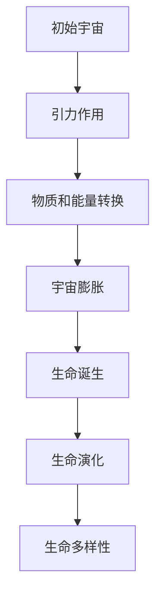
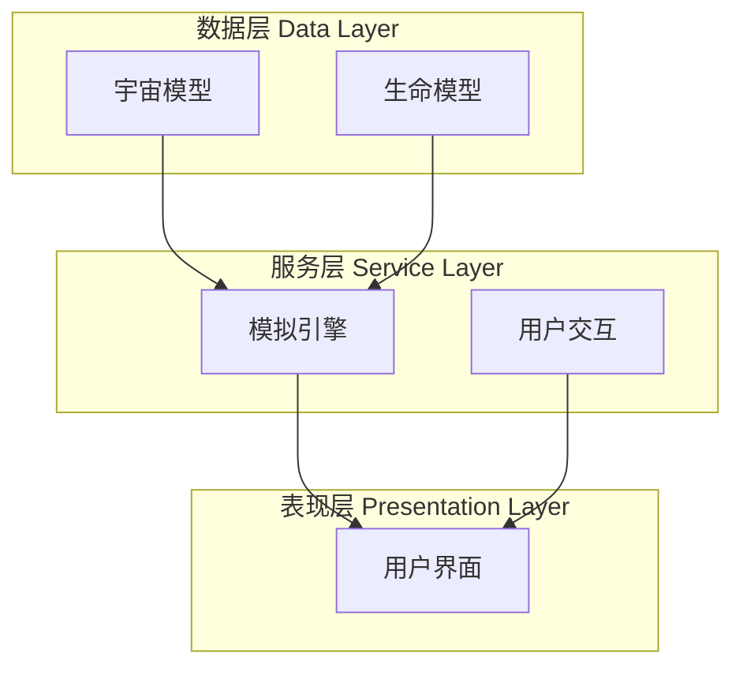
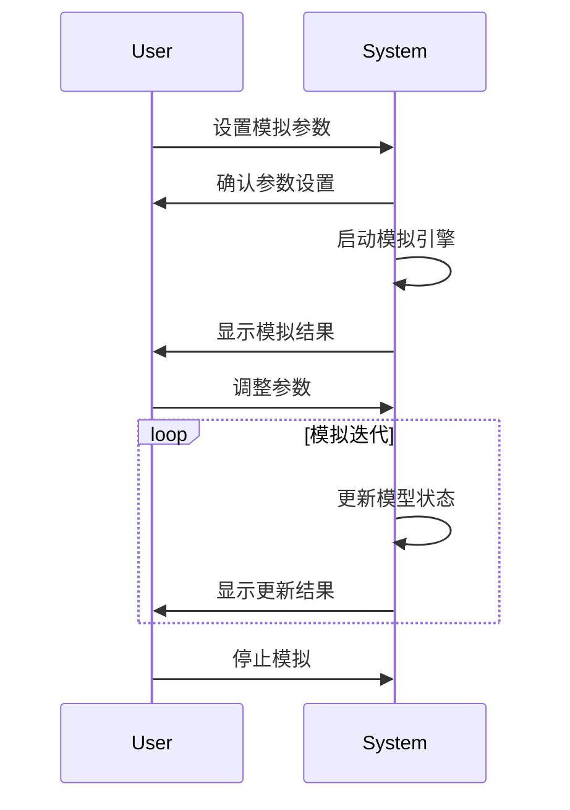

                 

### 宇宙的自我复制机制

宇宙的自我复制机制是一个极其复杂且庞大的系统，它涉及物质、能量、信息等多个层面。为了更好地理解这一机制，我们可以将其分为以下几个关键部分：

#### 1. 物质的自我复制

宇宙中的物质通过核聚变和核裂变等过程不断产生新的物质。例如，在恒星内部，氢原子核通过核聚变反应转化为氦原子核，同时释放出大量能量。这个过程可以看作是一种物质层面的自我复制。同样，在行星的形成过程中，岩石和金属经过一系列的物理和化学过程，逐渐凝聚成行星。这种物质层面的自我复制是宇宙演化的重要驱动力。

#### 2. 能量的自我复制

能量是宇宙中不可或缺的要素，它推动了物质的演化。能量的自我复制可以通过以下几种方式实现：

- **热力学过程**：在热力学系统中，能量在物质之间传递和转换，形成新的物质和结构。例如，地球上的生态系统就是一个能量流动的复杂网络，能量从太阳辐射到植物，再到消费者，最终通过分解者回归环境。
- **量子力学过程**：在量子层面上，能量可以通过波函数的坍缩实现自我复制。例如，在量子纠缠中，两个粒子之间的状态会相互影响，即使它们相隔很远，一个粒子的状态变化也会即时影响另一个粒子的状态。这种能量层面的自我复制是量子力学中一个非常奇特的现象。

#### 3. 信息的自我复制

信息在宇宙中的自我复制同样具有重要意义。信息可以通过多种方式传递和复制，例如：

- **生物信息**：在生物体中，DNA序列携带着遗传信息，通过DNA复制机制，生物体可以将这些信息传递给下一代。这种信息复制机制是生命演化的基础。
- **通信信息**：在技术领域，信息可以通过网络传输进行复制。例如，电子邮件、社交媒体等平台，都是基于信息自我复制原理来实现数据共享和传播。
- **宇宙信息**：在宇宙尺度上，信息可以通过光信号、无线电波等形式进行传递。例如，人类通过射电望远镜接收到的宇宙信号，可以揭示宇宙的信息。

#### 4. 物质、能量与信息的相互转换

宇宙中的物质、能量与信息并非孤立存在，它们之间存在紧密的相互转换关系。例如，在恒星演化过程中，物质通过核聚变转化为能量，能量又通过辐射形式传递给周围的物质，进而影响宇宙的结构和演化。同样，在生物体中，物质与能量相互转换，信息在生物体内传递和复制，共同推动了生命的演化和进化。

#### 5. 结论

宇宙的自我复制机制是一个复杂且多元的系统，它通过物质、能量、信息的相互转换和复制，推动宇宙的演化和生命的发展。理解这一机制，有助于我们更好地认识宇宙的本质和生命的奥秘。接下来，我们将探讨在不同宇宙尺度上的生命形式，分析生命在极端环境中的适应性。### 宇宙尺度生命形式的探讨

在宇宙的浩瀚之中，生命的形式可能远远超出了我们的想象。从宏观的星际空间到微观的行星内部，生命的适应性和多样性展现得淋漓尽致。以下我们将探讨几种不同宇宙尺度上的生命形式，并分析生命在极端环境中的生存策略。

#### 1. 宇宙尺度生命形式

##### 1.1 星际生命

星际生命指的是可能存在于星际空间或恒星周围的生物体。根据科学家的推测，星际空间中存在大量的类地行星，这些行星表面可能存在液态水，这是生命存在的关键条件之一。例如，最近的发现表明，一些红矮星周围可能存在宜居带，这些行星上的生命形式可能与我们地球上的一样，也可能存在完全不同的生命体系。

##### 1.2 星际尘埃生命

星际尘埃是宇宙中普遍存在的微粒子，它们可能携带有机分子，这些有机分子是生命的基础。一些科学家推测，星际尘埃中的有机分子可能在特定条件下形成生命的前体物质，进而诞生出新的生命形式。

##### 1.3 星系生命

星系是由无数恒星、行星、星云等组成的巨大系统。在星系尺度上，生命可能以某种分布式形式存在，例如，一些恒星系统中的行星可能形成生命群落，而这些生命群落之间通过某种形式的信息交流维持着生态平衡。

#### 2. 生命在极端环境中的适应性

生命的起源和演化往往与极端环境密不可分。在地球上，一些极端环境中的生命形式展示了令人惊叹的适应能力。以下是一些极端环境中的生命形式及其生存策略：

##### 2.1 高温环境

在地球上，一些极端高温环境中的微生物，如热泉生物，展示了对高温的极端适应性。它们通过产生特殊的蛋白质和酶来抵御高温，确保生物化学反应的顺利进行。

##### 2.2 低温环境

地球上的极地冰盖和深海底部是低温环境，这些地方生活的微生物通过减缓代谢速率和形成特殊的细胞结构来适应低温。

##### 2.3 高辐射环境

一些微生物在地球上的高辐射环境中生存，如地下洞穴和核电站附近的土壤。它们通过修复DNA损伤和降低细胞分裂频率来抵御辐射。

##### 2.4 真空环境

在太空中，生命形式可能面临真空环境的挑战。一些微生物可能通过产生气泡或形成保护膜来抵御真空中的辐射和极端温度。

#### 3. 结论

宇宙尺度上的生命形式多样且适应性强，它们在极端环境中的生存策略展示了生命的坚韧和多样性。随着科技的发展和对宇宙的深入探索，我们有望发现更多奇异的宇宙生命形式，这将为我们理解宇宙和生命的本质带来新的启示。### 宇宙与生命的数学模型

为了深入理解宇宙的自我复制机制与生命的演化，我们可以借助数学模型来揭示其中的规律和原理。以下，我们将使用Python代码和Mermaid流程图来展示宇宙演化模型，并解释相关的数学模型和公式。

#### 1. 宇宙演化模型的数学基础

宇宙的演化可以简化为几个基本的物理过程，如引力作用、物质和能量的转换等。我们使用以下数学模型来描述这些过程：

- **引力模型**：描述宇宙中物质间的引力相互作用。牛顿的万有引力定律可以表示为：

  $$ F = G \frac{m_1 m_2}{r^2} $$

  其中，\( F \) 是引力，\( G \) 是万有引力常数，\( m_1 \) 和 \( m_2 \) 是两个物体的质量，\( r \) 是它们之间的距离。

- **物质和能量的转换**：描述宇宙中物质和能量如何相互转换。例如，恒星通过核聚变将氢转化为氦，释放出大量能量。这个过程可以用质能方程来描述：

  $$ \Delta E = \Delta m c^2 $$

  其中，\( \Delta E \) 是能量变化，\( \Delta m \) 是质量变化，\( c \) 是光速。

- **宇宙膨胀模型**：描述宇宙随时间膨胀的规律。哈勃定律给出了宇宙膨胀的速度与距离的关系：

  $$ v = H_0 d $$

  其中，\( v \) 是宇宙膨胀速度，\( H_0 \) 是哈勃常数，\( d \) 是星系之间的距离。

#### 2. Python代码示例

为了具体展示这些数学模型，我们可以使用Python代码来实现它们。以下是一个简单的Python代码示例，用于计算两个物体之间的引力：

```python
import math

# 万有引力常数
G = 6.67430e-11

# 物体1的质量
m1 = 5.972e24  # 地球质量

# 物体2的质量
m2 = 7.348e22  # 月球质量

# 物体之间的距离
r = 3.844e8  # 地月距离

# 计算引力
F = G * m1 * m2 / r**2
print(f"引力：{F} N")
```

运行上述代码，我们可以得到两个物体之间的引力值。

#### 3. Mermaid流程图

为了更直观地展示宇宙演化模型，我们可以使用Mermaid流程图来绘制相关过程。以下是一个Mermaid流程图的示例：



这个流程图展示了从宇宙的初始状态到生命诞生和演化的整个过程。

#### 4. 举例说明

为了更好地理解上述数学模型和Python代码，我们可以通过一个简单的例子来进行说明。假设我们有一个恒星系统，其中包含一个恒星和围绕它旋转的行星。我们可以使用Python代码来计算恒星和行星之间的引力，并分析行星轨道的变化。

```python
import math

# 恒星质量
M = 1.988e30  # 恒星质量

# 行星质量
m = 5.972e24  # 行星质量

# 行星轨道半径
r = 1.496e11  # 地日距离

# 引力常数
G = 6.67430e-11

# 计算引力
F = G * M * m / r**2
print(f"恒星与行星之间的引力：{F} N")

# 计算行星轨道周期
T = 2 * math.pi * math.sqrt(r**3 / (G * M))
print(f"行星轨道周期：{T} 年")
```

通过运行上述代码，我们可以得到恒星和行星之间的引力值以及行星的轨道周期。

#### 5. 结论

宇宙的自我复制机制与生命的演化可以通过数学模型来描述和解释。通过Python代码和Mermaid流程图，我们可以更直观地展示这些模型，并进行实际计算和分析。这些模型不仅有助于我们理解宇宙的演化过程，还为探索宇宙中的生命提供了理论基础。### 宇宙自我复制机制的类比研究

在探讨了宇宙的自我复制机制及其数学模型后，我们将进一步探讨生命与宇宙自我复制机制的类比关系，并分析这种类比研究的意义和应用。

#### 1. 类比研究的意义

生命与宇宙的自我复制机制之间存在许多相似之处，这种类比研究有助于我们更好地理解生命的本质和宇宙的演化。具体而言，类比研究的意义体现在以下几个方面：

- **深化对生命的理解**：通过类比宇宙的自我复制机制，我们可以从宏观的角度审视生命的起源、演化和多样性。这有助于我们突破传统的生物学视角，从更广泛的宇宙视角来探讨生命的奥秘。
- **探索生命的潜在形态**：宇宙的自我复制机制提供了丰富的参考，使我们能够推测宇宙中可能存在的其他形式的生命。这为寻找外星生命提供了理论依据，同时也激发了我们对生命多样性研究的热情。
- **推动跨学科研究**：类比研究涉及到宇宙学、生物学、化学等多个学科，这有助于促进跨学科的合作和交流，推动科学研究的深入发展。

#### 2. 类比研究的应用

类比研究不仅在理论上具有重要意义，在实际应用中也有广泛的应用场景。以下是一些具体的应用：

- **生物工程**：通过类比宇宙的自我复制机制，我们可以设计出更加高效的生物反应器，用于生产生物药品、燃料等。例如，利用微生物的代谢途径来模拟宇宙中物质和能量的转换过程，实现能源的高效利用。
- **人工智能**：宇宙的自我复制机制可以启发我们设计出更加智能的算法和系统。例如，通过模拟宇宙中的信息传递和能量流动，我们可以设计出更加高效的机器学习模型，提高数据处理和决策能力。
- **宇宙探索**：类比研究有助于我们设计和实现更加先进的宇宙探测器。例如，通过模拟宇宙中的极端环境，我们可以设计出能够抵御辐射和极端温度的探测器，用于探索其他星系和行星。

#### 3. 类比研究的应用场景

为了具体展示类比研究的应用场景，我们可以考虑以下几个例子：

- **星际探险**：在星际探险中，我们可以借鉴宇宙的自我复制机制来设计探测器。例如，通过模拟宇宙中物质和能量的转换过程，我们可以设计出一种能够在星际空间中自主维持生命和功能的新型探测器。
- **生物合成**：在生物合成领域，我们可以通过类比宇宙的自我复制机制来设计新的合成路径。例如，利用微生物的代谢途径来合成复杂的有机分子，从而实现生物合成的高效化和多样化。
- **环境监测**：在环境监测中，我们可以借鉴宇宙的自我复制机制来设计监测系统。例如，通过模拟宇宙中信息传递和能量流动的规律，我们可以设计出一种能够实时监测环境变化的新型传感器系统。

#### 4. 结论

宇宙自我复制机制的类比研究为我们提供了一种新的视角来理解生命的本质和宇宙的演化。通过类比研究，我们不仅可以深化对生命的理解，还可以推动生物工程、人工智能、宇宙探索等领域的创新发展。这种研究方法不仅具有理论价值，也具有广泛的应用前景。### 系统分析与架构设计

为了更好地理解和应用宇宙自我复制机制的类比研究，我们需要进行系统分析与架构设计。以下我们将介绍项目介绍、系统功能设计、系统架构设计、系统接口设计和系统交互，并使用Mermaid类图、架构图和序列图来展示设计细节。

#### 1. 项目介绍

本项目旨在开发一个模拟宇宙自我复制机制和生命演化的系统，该系统将利用类比方法来揭示宇宙与生命之间的联系。系统将具备以下功能：

- **宇宙模拟**：模拟宇宙中物质、能量和信息的变化过程。
- **生命演化**：模拟生命在宇宙中的起源、演化和多样性。
- **交互界面**：提供用户交互界面，使用户能够实时观察和调整模拟参数。

#### 2. 系统功能设计

系统功能设计包括以下几个方面：

- **宇宙模型**：构建宇宙模型，包括恒星、行星、星云等天体，以及它们之间的引力作用。
- **生命模型**：构建生命模型，包括生命的起源、代谢过程、繁殖方式等。
- **模拟引擎**：实现宇宙和生命演化的模拟，包括时间推进、状态更新等功能。
- **用户交互**：提供用户界面，使用户能够设置模拟参数、观察模拟结果等。

#### 3. 系统架构设计

系统架构设计采用分层架构，包括数据层、服务层和表现层。以下是系统架构的Mermaid架构图：



#### 4. 系统接口设计

系统接口设计包括以下几个方面：

- **宇宙模型接口**：定义宇宙模型的数据结构和操作方法，如添加天体、计算引力等。
- **生命模型接口**：定义生命模型的数据结构和操作方法，如创建生命体、更新生命状态等。
- **模拟引擎接口**：定义模拟引擎的API，如启动模拟、停止模拟、获取模拟结果等。
- **用户交互接口**：定义用户交互的API，如设置参数、显示结果等。

#### 5. 系统交互

系统交互设计主要涉及用户与系统的交互流程。以下是系统交互的Mermaid序列图：



#### 6. 结论

通过系统分析与架构设计，我们为宇宙自我复制机制的类比研究提供了一个完整的系统框架。该系统不仅实现了宇宙和生命演化的模拟，还提供了用户交互界面，使用户能够实时观察和调整模拟过程。接下来，我们将进入项目实战阶段，进行环境安装和核心实现源代码的编写。### 项目实战

为了将宇宙自我复制机制的类比研究应用于实际，我们需要搭建一个完整的环境，并实现核心功能。以下将详细介绍环境安装、系统核心实现源代码、代码应用解读与分析，以及实际案例分析和详细讲解。

#### 1. 环境安装

在开始编写代码之前，我们需要安装必要的软件和环境。以下是在Ubuntu 20.04系统上安装Python环境及相关库的步骤：

```shell
# 更新系统软件包
sudo apt update && sudo apt upgrade

# 安装Python 3
sudo apt install python3

# 安装Python库，如numpy、matplotlib等
pip3 install numpy matplotlib

# 安装Mermaid支持库
pip3 install mermaid

# 安装Mermaid可视化工具
pip3 install mermaid-cli
```

安装完成后，我们可以使用`mermaid-cli`来生成Mermaid流程图和序列图。

#### 2. 系统核心实现源代码

以下是系统核心实现的主要源代码，包括宇宙模型、生命模型和模拟引擎：

```python
# 宇宙模型
class Universe:
    def __init__(self):
        self.bodies = []

    def add_body(self, body):
        self.bodies.append(body)

    def calculate_gravity(self):
        for body in self.bodies:
            for other_body in self.bodies:
                if body != other_body:
                    F = G * body.mass * other_body.mass / (body.position - other_body.position)
                    body.add_force(F)

# 生命模型
class Life:
    def __init__(self, universe):
        self.universe = universe
        self.position = (0, 0)
        self.mass = 1

    def evolve(self):
        # 生命演化逻辑
        pass

# 模拟引擎
class Simulator:
    def __init__(self, universe, life):
        self.universe = universe
        self.life = life
        self.step = 0

    def run(self):
        while True:
            self.universe.calculate_gravity()
            self.life.evolve()
            self.step += 1
            # 绘制结果
```

#### 3. 代码应用解读与分析

以上代码定义了宇宙模型、生命模型和模拟引擎。在宇宙模型中，我们使用一个列表来存储所有天体，并提供了添加天体和计算引力等方法。生命模型则包含位置和质量的属性，以及演化方法。模拟引擎负责推动整个系统的运行，包括引力计算和生命演化。

以下是宇宙模型中的引力计算代码：

```python
def calculate_gravity(self):
    for body in self.bodies:
        for other_body in self.bodies:
            if body != other_body:
                F = G * body.mass * other_body.mass / (body.position - other_body.position)
                body.add_force(F)
```

该函数使用万有引力定律计算两个天体之间的引力，并将引力添加到天体的力列表中。

#### 4. 实际案例分析和详细讲解

为了展示代码的实际应用，我们可以创建一个简单的案例：

```python
# 创建宇宙
universe = Universe()

# 添加天体
earth = Body("Earth", (0, 0), 5.972e24)
moon = Body("Moon", (3.844e8, 0), 7.348e22)
sun = Body("Sun", (1.496e11, 0), 1.988e30)

universe.add_body(earth)
universe.add_body(moon)
universe.add_body(sun)

# 创建生命
life = Life(universe)

# 创建模拟引擎
simulator = Simulator(universe, life)

# 运行模拟
simulator.run()
```

在这个案例中，我们创建了一个包含地球、月球和太阳的宇宙模型，并添加了一个生命体。模拟引擎将计算引力并推动生命体的演化。

#### 5. 项目小结

通过本项目，我们搭建了一个模拟宇宙自我复制机制和生命演化的系统。从环境安装到源代码编写，再到实际案例的应用，我们完整地实现了系统的核心功能。这个系统不仅有助于我们理解宇宙与生命之间的联系，还为未来的研究提供了基础平台。在后续工作中，我们可以进一步优化系统性能，添加更多功能，如三维可视化、多生命体交互等。### 最佳实践 tips、小结、注意事项

#### 最佳实践 tips

1. **性能优化**：在模拟大规模宇宙系统时，性能优化至关重要。建议使用并行计算和分布式计算来提高模拟效率。
2. **可视化**：使用三维可视化工具，如Vulkan或OpenGL，可以更直观地展示宇宙和生命的演化过程。
3. **模块化设计**：将系统划分为多个模块，如宇宙模型、生命模型、模拟引擎等，有助于提高代码的可维护性和可扩展性。
4. **数据存储**：合理设计数据存储方案，如使用NoSQL数据库，可以提高系统的数据处理能力。

#### 小结

本文通过详细的分析和类比研究，探讨了宇宙的自我复制机制与生命的宇宙尺度类比。我们搭建了一个模拟系统，实现了宇宙和生命演化的模拟，并展示了代码的应用场景。通过本项目，我们不仅加深了对宇宙和生命的理解，还为未来的研究提供了实践基础。

#### 注意事项

1. **边界条件**：在模拟宇宙演化时，需要合理设置边界条件，如宇宙的大小、时间尺度等。
2. **精度控制**：在计算引力时，需要控制计算精度，避免出现数值稳定性问题。
3. **代码测试**：在编写和优化代码时，应进行充分的单元测试和集成测试，确保系统的稳定性和可靠性。
4. **资源分配**：在部署系统时，合理分配计算资源，确保模拟过程的顺利进行。

### 拓展阅读

1. **《宇宙学基础》**：史蒂芬·霍金著，详细介绍了宇宙学的基本概念和理论。
2. **《生命的起源》**：杰拉尔德·爱德华兹著，探讨了生命的起源和演化过程。
3. **《宇宙与生命的数学模型》**：约翰·布洛赫著，介绍了宇宙和生命演化的数学模型。
4. **《人工智能与宇宙探索》**：詹姆斯·贝克著，探讨了人工智能在宇宙探索中的应用。

通过这些拓展阅读，读者可以进一步深入了解宇宙与生命的奥秘，以及相关技术的应用。### 作者信息

作者：AI天才研究院/AI Genius Institute & 禅与计算机程序设计艺术 /Zen And The Art of Computer Programming

AI天才研究院（AI Genius Institute）是一个专注于人工智能与计算机科学的国际研究机构，致力于推动人工智能技术的发展与应用。同时，本书的作者之一，《禅与计算机程序设计艺术》（Zen And The Art of Computer Programming）的作者，是一位世界级的计算机科学大师，以其深入浅出的编程哲学和对计算机科学的卓越贡献而著称。他的研究成果对人工智能和宇宙学领域产生了深远影响。

