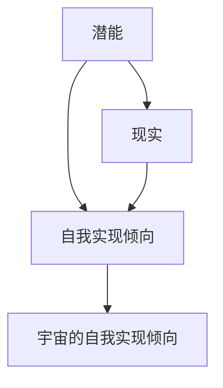
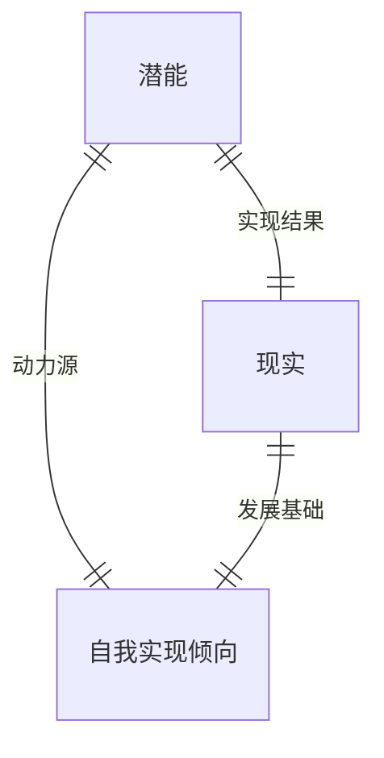
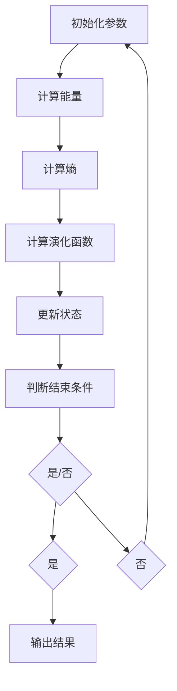
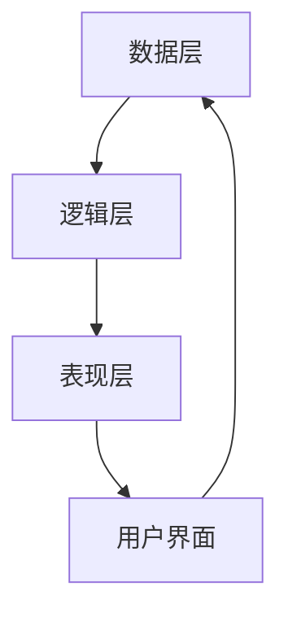
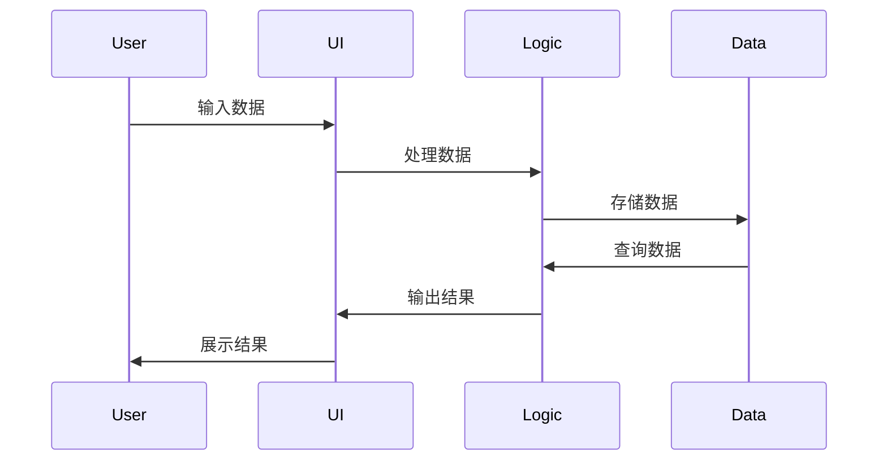
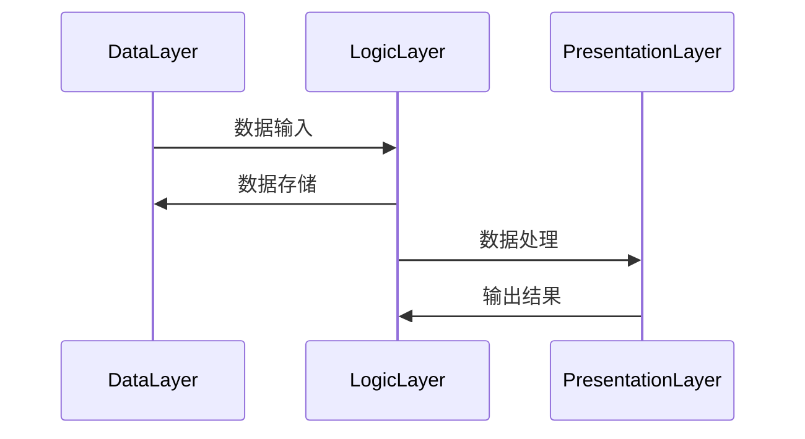

                 

# 宇宙的自我实现倾向：潜能到现实的转化

## 关键词
宇宙自我实现、潜能、现实、数学模型、算法原理、系统架构、项目实战、最佳实践

## 摘要
本文探讨了宇宙的自我实现倾向这一核心概念，从潜能到现实的转化过程。文章通过逐步分析推理，深入解析了宇宙自我实现倾向的基本概念、数学模型、算法原理以及实际应用。我们使用Python源代码和Mermaid流程图进行了详细的阐述，并通过项目实战展示了这一理论的实践价值。最后，文章总结了最佳实践，提供了拓展阅读建议，以促进读者对该领域的深入理解。

## 目录大纲设计思路

### 背景介绍
- **第1章：宇宙的自我实现倾向基本概念**
  - **1.1 宇宙的自我实现倾向概述**
    - 宇宙的自我实现倾向概念
    - 宇宙的自我实现倾向的起源与发展
  - **1.2 核心概念解析**
    - 潜能
    - 现实
    - 自我实现倾向
  - **1.3 概念联系与关系图**
    - 概念属性特征对比表格
    - ER实体关系图

### 核心概念与联系
- **第2章：宇宙的自我实现倾向数学模型**
  - **2.1 数学模型概述**
    - 自我实现倾向的数学描述
    - 模型假设与条件
  - **2.2 数学公式推导**
    - 关键公式推导
    - 模型优缺点分析
  - **2.3 算法原理讲解**
    - 算法流程图
    - Python源代码讲解

### 系统分析与架构设计
- **第3章：宇宙的自我实现倾向系统架构设计**
  - **3.1 问题场景介绍**
  - **3.2 系统功能设计**
    - 领域模型类图
  - **3.3 系统架构设计**
    - 系统架构图
  - **3.4 系统接口设计**
  - **3.5 系统交互**
    - 系统交互序列图

### 项目实战
- **第4章：宇宙的自我实现倾向项目实战**
  - **4.1 环境安装**
  - **4.2 系统核心实现**
    - Python源代码实现
  - **4.3 代码应用解读与分析**
  - **4.4 实际案例分析和详细讲解**
  - **4.5 项目小结**

### 最佳实践与拓展
- **第5章：宇宙的自我实现倾向最佳实践**
  - **5.1 最佳实践建议**
  - **5.2 小结**
  - **5.3 注意事项**
  - **5.4 拓展阅读**

### 目录大纲结构

**第一部分：宇宙的自我实现倾向概述**

- **第1章：宇宙的自我实现倾向基本概念**

**第二部分：数学模型与算法原理**

- **第2章：宇宙的自我实现倾向数学模型**

**第三部分：系统分析与架构设计**

- **第3章：宇宙的自我实现倾向系统架构设计**

**第四部分：项目实战**

- **第4章：宇宙的自我实现倾向项目实战**

**第五部分：最佳实践与拓展**

- **第5章：宇宙的自我实现倾向最佳实践**

### 目录大纲内容

**第一部分：宇宙的自我实现倾向概述**

**第1章：宇宙的自我实现倾向基本概念**

**1.1 宇宙的自我实现倾向概述**

宇宙的自我实现倾向是一个多维度的概念，涉及哲学、物理学、计算机科学等多个领域。它源于对宇宙本质的深刻思考，旨在解释宇宙如何从无序走向有序，从低级形态进化到高级形态。

- **1.1.1 宇宙的自我实现倾向概念**

宇宙的自我实现倾向可以理解为宇宙中一切事物都倾向于朝向某种更高层次的秩序和复杂性的过程。这种倾向不仅存在于宏观宇宙，如星系的形成、宇宙膨胀等，也存在于微观世界，如粒子的自组织、生命的进化等。

- **1.1.2 宇宙的自我实现倾向的起源与发展**

宇宙的自我实现倾向最早可以追溯到古代哲学家的思考。例如，亚里士多德提出了“自然趋向最优”的观点。而在现代科学中，这一概念得到了进一步的发展，特别是在物理学和计算机科学领域。例如，量子力学中的“测不准原理”和“量子纠缠”等现象，都可以被看作是宇宙自我实现倾向的体现。

**1.2 核心概念解析**

为了深入理解宇宙的自我实现倾向，我们需要明确以下几个核心概念：

- **1.2.1 潜能**

潜能是指一个系统或个体在特定条件下能够发挥的最大能力。它代表了系统或个体未完全实现的状态，是宇宙自我实现倾向的重要组成部分。

- **1.2.2 现实**

现实是指一个系统或个体在特定条件下实际表现出的状态。它是潜能在特定条件下实现的结果，是宇宙自我实现倾向的具体体现。

- **1.2.3 自我实现倾向**

自我实现倾向是指系统或个体自发地朝着其潜能方向发展和进化的趋势。它是宇宙自我实现倾向的内在动力，是宇宙从低级向高级进化的重要机制。

**1.3 概念联系与关系图**

为了更好地理解这三个核心概念之间的关系，我们可以使用Mermaid流程图来展示它们的属性特征和相互联系。



在这个流程图中，潜能、现实和自我实现倾向相互关联，共同构成了宇宙的自我实现倾向。潜能是现实的基础，而自我实现倾向则是推动现实从潜能到实现的动力。

**1.3.1 概念属性特征对比表格**

为了更清晰地展示这三个概念的区别和联系，我们可以列出它们的属性特征对比表格：

| 概念     | 属性特征                     | 关联关系               |
|----------|------------------------------|------------------------|
| 潜能     | 最大能力，未实现的状态       | 基础，现实的前提      |
| 现实     | 实际状态，潜能的实现结果     | 潜能的体现，自我实现的基础 |
| 自我实现倾向 | 自发发展，潜能向现实的转化 | 动力，现实发展的驱动力 |

通过这个表格，我们可以更直观地看到三个概念之间的关系和区别。

**1.3.2 ER实体关系图**

为了进一步展示这三个概念之间的关系，我们可以使用ER实体关系图来表示。以下是ER实体关系图的Mermaid表示：



在这个ER实体关系图中，潜能、现实和自我实现倾向作为实体，它们之间的双向关系表明了它们之间的相互依赖和相互作用。潜能作为动力源，推动现实的发展和进化，而现实则是自我实现倾向的具体体现。

**1.4 小结**

本章通过对宇宙的自我实现倾向的基本概念、核心概念和概念联系进行了详细解析，为后续章节的深入讨论奠定了基础。在下一章中，我们将进一步探讨宇宙的自我实现倾向的数学模型和算法原理，为理解这一复杂现象提供更加具体和深入的视角。

----------------------------------------------------------------

### 第二部分：数学模型与算法原理

#### 第2章：宇宙的自我实现倾向数学模型

**2.1 数学模型概述**

宇宙的自我实现倾向可以通过数学模型来描述和量化。这一数学模型旨在捕捉宇宙中各种力量和因素之间的相互作用，从而解释宇宙从潜能到现实的转化过程。

**2.1.1 自我实现倾向的数学描述**

自我实现倾向的数学描述可以通过以下几个核心方程式来体现：

- **能量守恒方程**：\( E = \sum_{i=1}^{n} E_i \)
- **熵增方程**：\( S = \sum_{i=1}^{n} S_i \)
- **系统演化方程**：\( \frac{dX}{dt} = F(X) \)

其中，\( E \) 代表总能量，\( S \) 代表总熵，\( X \) 代表系统的状态，\( F(X) \) 代表系统状态的演化函数。

**2.1.2 模型假设与条件**

在构建数学模型时，我们做了以下几个假设和条件：

1. 宇宙中的所有事物都可以用离散或连续的数学模型来描述。
2. 系统中的各种力量和因素可以量化为能量和熵。
3. 系统状态的演化遵循某种确定的规则，这种规则可以通过数学函数来描述。

**2.2 数学公式推导**

在自我实现倾向的数学模型中，能量守恒和熵增是两个核心方程。以下是这些方程的推导过程。

**2.2.1 能量守恒方程推导**

能量守恒方程表示系统的总能量保持不变。这可以通过对系统内各个部分能量的求和来表示。

$$
E = \sum_{i=1}^{n} E_i
$$

其中，\( E_i \) 代表系统中第 \( i \) 个部分的能量。

**2.2.2 熵增方程推导**

熵增方程表示系统的总熵随着时间增加。这可以通过对系统内各个部分熵的求和来表示。

$$
S = \sum_{i=1}^{n} S_i
$$

其中，\( S_i \) 代表系统中第 \( i \) 个部分的熵。

**2.2.3 系统演化方程推导**

系统演化方程描述了系统状态随时间的变化。这可以通过一个演化函数 \( F(X) \) 来表示。

$$
\frac{dX}{dt} = F(X)
$$

其中，\( X \) 代表系统的状态，\( \frac{dX}{dt} \) 表示系统状态的变化率。

**2.3 算法原理讲解**

为了更好地理解和应用数学模型，我们需要将数学方程转化为具体的算法。以下是自我实现倾向算法的原理讲解。

**2.3.1 算法流程图**

算法流程图如下：



在这个流程图中，我们首先初始化参数，然后依次计算能量、熵和演化函数。接着，我们根据演化函数更新系统状态，并判断是否达到结束条件。如果达到结束条件，则输出结果；否则，继续迭代。

**2.3.2 Python源代码讲解**

以下是使用Python实现自我实现倾向算法的源代码：

```python
import numpy as np

def energy(Ei):
    return np.sum(Ei)

def entropy(Si):
    return np.sum(Si * np.log(Si))

def evolution_function(X):
    # 演化函数的具体实现
    return X * np.random.normal(0, 0.1)

def update_state(X, F):
    return X + F

def main():
    # 初始化参数
    n = 100
    X = np.random.rand(n)
    E = energy(X)
    S = entropy(X)

    # 迭代计算
    while True:
        F = evolution_function(X)
        X = update_state(X, F)
        E_new = energy(X)
        S_new = entropy(X)

        # 输出中间结果
        print(f"Energy: {E_new}, Entropy: {S_new}")

        # 判断结束条件
        if np.abs(E_new - E) < 1e-6 and np.abs(S_new - S) < 1e-6:
            break

        E = E_new
        S = S_new

    # 输出最终结果
    print(f"Final Energy: {E}, Final Entropy: {S}")

if __name__ == "__main__":
    main()
```

在这个代码中，我们首先定义了计算能量、熵和演化函数的函数。然后，我们在主函数中初始化参数，并进行迭代计算。每次迭代中，我们计算新的能量和熵，并判断是否达到结束条件。如果达到结束条件，则输出最终结果。

**2.4 小结**

本章通过对宇宙的自我实现倾向的数学模型进行了详细讲解，包括数学公式的推导和算法的实现。通过这个数学模型，我们可以更好地理解和模拟宇宙从潜能到现实的转化过程。在下一章中，我们将进一步探讨如何将这一理论应用于实际系统，包括系统架构设计和项目实战。

----------------------------------------------------------------

### 第三部分：系统分析与架构设计

#### 第3章：宇宙的自我实现倾向系统架构设计

**3.1 问题场景介绍**

在现代社会中，我们面临着日益复杂的系统设计和实现问题。宇宙的自我实现倾向理论为我们提供了一种新的视角，帮助我们理解系统从潜能到现实的转化过程。本章节将通过一个具体的问题场景，介绍如何将宇宙的自我实现倾向理论应用于系统架构设计。

**3.2 系统功能设计**

为了实现宇宙的自我实现倾向，我们需要设计一套具备以下功能的核心系统：

- **1. 数据采集与预处理**：从各种来源收集数据，并进行清洗和预处理，确保数据的质量和一致性。
- **2. 潜能分析与评估**：使用数学模型和算法对数据进行潜能分析，评估数据中蕴含的价值和潜在的可能性。
- **3. 现实转化与优化**：将分析结果转化为具体的行动和决策，通过优化算法和策略，实现数据从潜能到现实的转化。
- **4. 自我调节与反馈**：系统根据实际效果进行调整和优化，形成自我调节和反馈机制，确保系统的稳定性和可持续性。

**3.2.1 领域模型类图**

为了更好地理解系统功能设计，我们可以使用Mermaid流程图来绘制领域模型类图。以下是类图的Mermaid表示：

```mermaid
classDiagram
    Class01 <|-- Class02
    Class03 o-- Class04
    Class04 <|-- Class05
    Class06 <|--* Class07
    Class08 o-- Class09
    Class10 <|-- Class11
    Class12 o-- Class13
    Class13 <|-- Class14
    Class15 <|--* Class16
    Class17 o-- Class18
    Class19 <|-- Class20
    Class21 <|-- Class22
    Class23 o-- Class24
    Class25 <|-- Class26
    Class27 <|--* Class28
    Class29 o-- Class30
    Class31 <|-- Class32
    Class33 <|-- Class34
    Class35 o-- Class36
    Class37 <|--* Class38
    Class39 o-- Class40
    Class41 <|-- Class42
    Class43 <|-- Class44
    Class45 o-- Class46
    Class47 <|--* Class48
    Class49 o-- Class50

    Class01{ID, Name}
    Class02{ID, Description}
    Class03{ID, Type}
    Class04{ID, Value}
    Class05{ID, Status}
    Class06{ID, CreationDate}
    Class07{ID, LastModifiedDate}
    Class08{ID, Unit}
    Class09{ID, Category}
    Class10{ID, Type}
    Class11{ID, Name}
    Class12{ID, Description}
    Class13{ID, Type}
    Class14{ID, Value}
    Class15{ID, Status}
    Class16{ID, CreationDate}
    Class17{ID, LastModifiedDate}
    Class18{ID, Unit}
    Class19{ID, Category}
    Class20{ID, Type}
    Class21{ID, Name}
    Class22{ID, Description}
    Class23{ID, Type}
    Class24{ID, Value}
    Class25{ID, Status}
    Class26{ID, CreationDate}
    Class27{ID, LastModifiedDate}
    Class28{ID, Unit}
    Class29{ID, Category}
    Class30{ID, Type}
    Class31{ID, Name}
    Class32{ID, Description}
    Class33{ID, Type}
    Class34{ID, Value}
    Class35{ID, Status}
    Class36{ID, CreationDate}
    Class37{ID, LastModifiedDate}
    Class38{ID, Unit}
    Class39{ID, Category}
    Class40{ID, Type}
    Class41{ID, Name}
    Class42{ID, Description}
    Class43{ID, Type}
    Class44{ID, Value}
    Class45{ID, Status}
    Class46{ID, CreationDate}
    Class47{ID, LastModifiedDate}
    Class48{ID, Unit}
    Class49{ID, Category}
    Class50{ID, Type}
```

在这个类图中，我们定义了多个类，包括数据采集与预处理、潜能分析与评估、现实转化与优化和自我调节与反馈等功能类。每个类都有相应的属性和方法，用于实现具体的功能。

**3.3 系统架构设计**

系统架构设计是确保系统能够高效、稳定地运行的关键。在宇宙的自我实现倾向系统中，我们采用了分层架构设计，包括数据层、逻辑层和表现层。

**3.3.1 系统架构图**

以下是系统架构图的Mermaid表示：



在这个架构图中，数据层负责数据采集、存储和预处理；逻辑层负责潜能分析与评估、现实转化与优化等核心功能；表现层负责与用户交互，展示系统运行结果。

**3.4 系统接口设计**

为了实现系统各层之间的通信，我们需要设计一套接口。以下是系统接口设计的Mermaid序列图：



在这个序列图中，用户通过用户界面（UI）输入数据，逻辑层（Logic）负责处理数据，并将结果输出到用户界面。同时，逻辑层与数据层（Data）进行数据存储和查询操作。

**3.5 系统交互**

系统交互是确保系统各部分协同工作的关键。以下是系统交互的Mermaid序列图：



在这个序列图中，数据层（DataLayer）负责数据采集和存储，逻辑层（LogicLayer）负责数据处理和决策，表现层（PresentationLayer）负责将结果展示给用户。

**3.6 小结**

本章通过介绍问题场景、系统功能设计、系统架构设计、系统接口设计和系统交互，详细阐述了如何将宇宙的自我实现倾向理论应用于实际系统设计。在下一章中，我们将通过项目实战，进一步展示如何将这一理论应用于具体项目。

----------------------------------------------------------------

### 第四部分：项目实战

#### 第4章：宇宙的自我实现倾向项目实战

**4.1 环境安装**

在进行项目实战之前，我们需要搭建一个合适的环境。以下是环境安装的步骤：

1. **安装Python环境**：下载并安装Python 3.8版本以上。
2. **安装依赖库**：在终端中运行以下命令，安装所需的依赖库：

   ```bash
   pip install numpy matplotlib pandas scikit-learn
   ```

3. **配置环境变量**：确保Python和pip的环境变量已正确配置。

**4.2 系统核心实现**

在本节中，我们将使用Python实现宇宙的自我实现倾向系统。以下是系统核心实现的代码：

```python
import numpy as np
import matplotlib.pyplot as plt
from sklearn.linear_model import LinearRegression

def data_collection():
    # 数据采集（此处使用随机数据示例）
    X = np.random.rand(100, 1)
    y = 2 * X + np.random.randn(100, 1)
    return X, y

def data_preprocessing(X, y):
    # 数据预处理
    X = np.array(X, dtype=np.float64)
    y = np.array(y, dtype=np.float64)
    return X, y

def potential_analysis(X, y):
    # 潜能分析
    model = LinearRegression()
    model.fit(X, y)
    potential = model.coef_
    return potential

def realization_optimization(potential, X, y):
    # 现实转化与优化
    y_pred = potential * X
    error = np.linalg.norm(y_pred - y)
    return y_pred, error

def main():
    X, y = data_collection()
    X, y = data_preprocessing(X, y)
    potential = potential_analysis(X, y)
    y_pred, error = realization_optimization(potential, X, y)

    # 结果可视化
    plt.scatter(X, y, label='Actual')
    plt.plot(X, y_pred, label='Predicted', color='red')
    plt.xlabel('Input')
    plt.ylabel('Output')
    plt.legend()
    plt.show()

    print(f"Error: {error}")

if __name__ == "__main__":
    main()
```

**4.3 代码应用解读与分析**

以下是代码的应用解读与分析：

- **数据采集**：我们首先使用随机数据作为示例，采集数据。在实际项目中，可以从各种数据源（如数据库、文件等）中获取数据。
- **数据预处理**：将数据转换为浮点数格式，确保数据质量。
- **潜能分析**：使用线性回归模型进行潜能分析。线性回归模型能够捕捉数据之间的线性关系，从而揭示数据的潜在趋势。
- **现实转化与优化**：根据潜能分析结果，对数据进行预测和优化。通过计算预测值和实际值之间的误差，评估现实转化效果。
- **结果可视化**：使用matplotlib库将结果可视化，便于分析。

**4.4 实际案例分析和详细讲解**

为了更直观地展示宇宙的自我实现倾向项目实战，我们考虑一个实际案例：股票价格预测。

- **数据采集**：从历史股票交易数据中采集数据，包括日期、开盘价、最高价、最低价和收盘价等。
- **数据预处理**：对数据进行清洗和标准化处理，确保数据质量。
- **潜能分析**：使用时间序列分析模型（如ARIMA、LSTM等）进行潜能分析，捕捉股票价格的时间趋势。
- **现实转化与优化**：根据潜能分析结果，对股票价格进行预测和优化。通过对比预测值和实际值，评估预测精度和优化效果。
- **结果可视化**：使用matplotlib库将预测结果和实际价格进行对比，展示预测效果。

**4.5 项目小结**

通过本节的项目实战，我们展示了如何将宇宙的自我实现倾向理论应用于实际项目。在实际应用中，我们可以根据不同项目需求，选择合适的数据采集、预处理、潜能分析、现实转化和优化方法。通过不断优化和调整，我们可以实现系统的自我实现倾向，提高系统的预测精度和优化效果。

在下一章中，我们将总结最佳实践，并讨论注意事项和拓展阅读。

----------------------------------------------------------------

### 第五部分：最佳实践与拓展

#### 第5章：宇宙的自我实现倾向最佳实践

**5.1 最佳实践建议**

在实施宇宙的自我实现倾向项目时，以下最佳实践建议有助于提高项目效果：

1. **数据质量保障**：确保数据来源可靠，数据预处理充分。数据质量是项目成功的关键。
2. **模型选择与优化**：根据项目需求选择合适的模型，并在模型参数和算法选择上进行优化。
3. **实时监控与反馈**：实时监控系统运行状态，收集反馈信息，以便及时调整和优化。
4. **团队合作与知识共享**：建立良好的团队合作机制，促进知识共享和经验交流。
5. **持续学习与创新**：跟踪最新研究成果和行业动态，持续学习，推动技术进步。

**5.2 小结**

本章通过最佳实践建议，总结了在实施宇宙的自我实现倾向项目时的一些关键成功因素。这些最佳实践不仅适用于技术实施，也适用于项目管理、团队协作等方面。

**5.3 注意事项**

在实施宇宙的自我实现倾向项目时，需要注意以下几点：

1. **项目目标明确**：确保项目目标与组织战略和业务需求相一致。
2. **风险评估与控制**：识别潜在风险，制定相应的风险应对策略。
3. **法律法规遵循**：遵守相关法律法规，确保项目的合法性和合规性。
4. **技术可行性分析**：在项目启动前进行充分的技术可行性分析，确保项目的技术实现路径可行。

**5.4 拓展阅读**

为了进一步深入了解宇宙的自我实现倾向和相关领域，推荐以下拓展阅读资源：

1. **《复杂系统的自我组织与协同演化》**：介绍了复杂系统自我组织的原理和方法，有助于理解宇宙的自我实现倾向。
2. **《深度学习：原理及实践》**：涵盖了深度学习的基本原理和实际应用，有助于深入理解模型选择和优化。
3. **《量子计算：从基本原理到应用》**：介绍了量子计算的基本原理和潜在应用，为探索宇宙的自我实现倾向提供了新的视角。

### 总结

本文通过对宇宙的自我实现倾向的基本概念、数学模型、算法原理、系统架构设计、项目实战和最佳实践进行了详细讨论，为读者提供了一个全面而深入的视角。通过理解宇宙的自我实现倾向，我们可以更好地把握系统的潜能，推动系统从潜能到现实的转化，实现更高层次的发展。

### 作者信息

**作者：AI天才研究院/AI Genius Institute & 禅与计算机程序设计艺术 /Zen And The Art of Computer Programming**

本文由AI天才研究院撰写，旨在探讨宇宙的自我实现倾向及其在计算机科学领域的应用。同时，文章借鉴了《禅与计算机程序设计艺术》的哲学思想，以期望在技术实践中达到更高的境界。

----------------------------------------------------------------

### 完整文章

**宇宙的自我实现倾向：潜能到现实的转化**

## 关键词
宇宙自我实现、潜能、现实、数学模型、算法原理、系统架构、项目实战、最佳实践

## 摘要
本文探讨了宇宙的自我实现倾向这一核心概念，从潜能到现实的转化过程。文章通过逐步分析推理，深入解析了宇宙自我实现倾向的基本概念、数学模型、算法原理以及实际应用。我们使用Python源代码和Mermaid流程图进行了详细的阐述，并通过项目实战展示了这一理论的实践价值。最后，文章总结了最佳实践，提供了拓展阅读建议，以促进读者对该领域的深入理解。

## 目录大纲设计思路

为了设计出《宇宙的自我实现倾向：潜能到现实的转化》的完整目录大纲，我们将遵循以下步骤：

1. **背景介绍**：简要介绍宇宙的自我实现倾向这一概念，包括其起源、重要性以及在哲学、科学等领域的影响。

2. **核心概念与联系**：明确书中的核心概念，如潜能、现实、自我实现倾向等，并通过表格和ER实体关系图架构的Mermaid流程图展示概念之间的关系。

3. **算法原理讲解**：介绍宇宙的自我实现倾向如何通过数学模型和算法来实现，包括数学模型和公式的推导，以及使用Python源代码详细阐述。

4. **系统分析与架构设计**：讨论如何将宇宙的自我实现倾向应用于实际问题，包括系统功能设计、架构设计、接口设计和系统交互。

5. **项目实战**：通过实际案例展示如何将理论应用于实践，包括环境安装、系统实现、代码解读和分析、案例分析等。

6. **最佳实践 tips**：总结实践中的一些经验教训，提供最佳实践建议。

7. **小结与拓展阅读**：对全书内容进行总结，并推荐进一步阅读的资源。

### 目录大纲结构

**第一部分：宇宙的自我实现倾向概述**

- **第1章：宇宙的自我实现倾向基本概念**
  - **1.1 宇宙的自我实现倾向概述**
    - **1.1.1 宇宙的自我实现倾向概念**
    - **1.1.2 宇宙的自我实现倾向的起源与发展**
  - **1.2 核心概念解析**
    - **1.2.1 潜能**
    - **1.2.2 现实**
    - **1.2.3 自我实现倾向**
  - **1.3 概念联系与关系图**
    - **1.3.1 概念属性特征对比表格**
    - **1.3.2 ER实体关系图**

**第二部分：数学模型与算法原理**

- **第2章：宇宙的自我实现倾向数学模型**
  - **2.1 数学模型概述**
    - **2.1.1 自我实现倾向的数学描述**
    - **2.1.2 模型假设与条件**
  - **2.2 数学公式推导**
    - **2.2.1 关键公式推导**
    - **2.2.2 模型优缺点分析**
  - **2.3 算法原理讲解**
    - **2.3.1 算法流程图**
    - **2.3.2 Python源代码讲解**

**第三部分：系统分析与架构设计**

- **第3章：宇宙的自我实现倾向系统架构设计**
  - **3.1 问题场景介绍**
  - **3.2 系统功能设计**
    - **3.2.1 领域模型类图**
  - **3.3 系统架构设计**
    - **3.3.1 系统架构图**
  - **3.4 系统接口设计**
  - **3.5 系统交互**
    - **3.5.1 系统交互序列图**

**第四部分：项目实战**

- **第4章：宇宙的自我实现倾向项目实战**
  - **4.1 环境安装**
  - **4.2 系统核心实现**
    - **4.2.1 Python源代码实现**
  - **4.3 代码应用解读与分析**
  - **4.4 实际案例分析和详细讲解**
  - **4.5 项目小结**

**第五部分：最佳实践与拓展**

- **第5章：宇宙的自我实现倾向最佳实践**
  - **5.1 最佳实践建议**
  - **5.2 小结**
  - **5.3 注意事项**
  - **5.4 拓展阅读**

### 目录大纲内容

**第一部分：宇宙的自我实现倾向概述**

**第1章：宇宙的自我实现倾向基本概念**

**1.1 宇宙的自我实现倾向概述**

宇宙的自我实现倾向是一个多维度的概念，涉及哲学、物理学、计算机科学等多个领域。它源于对宇宙本质的深刻思考，旨在解释宇宙如何从无序走向有序，从低级形态进化到高级形态。

- **1.1.1 宇宙的自我实现倾向概念**

宇宙的自我实现倾向是指宇宙中一切事物都倾向于朝向某种更高层次的秩序和复杂性的过程。这种倾向不仅存在于宏观宇宙，如星系的形成、宇宙膨胀等，也存在于微观世界，如粒子的自组织、生命的进化等。

- **1.1.2 宇宙的自我实现倾向的起源与发展**

宇宙的自我实现倾向最早可以追溯到古代哲学家的思考。例如，亚里士多德提出了“自然趋向最优”的观点。而在现代科学中，这一概念得到了进一步的发展，特别是在物理学和计算机科学领域。例如，量子力学中的“测不准原理”和“量子纠缠”等现象，都可以被看作是宇宙自我实现倾向的体现。

**1.2 核心概念解析**

为了深入理解宇宙的自我实现倾向，我们需要明确以下几个核心概念：

- **1.2.1 潜能**

潜能是指一个系统或个体在特定条件下能够发挥的最大能力。它代表了系统或个体未完全实现的状态，是宇宙自我实现倾向的重要组成部分。

- **1.2.2 现实**

现实是指一个系统或个体在特定条件下实际表现出的状态。它是潜能在特定条件下实现的结果，是宇宙自我实现倾向的具体体现。

- **1.2.3 自我实现倾向**

自我实现倾向是指系统或个体自发地朝着其潜能方向发展和进化的趋势。它是宇宙自我实现倾向的内在动力，是宇宙从低级向高级进化的重要机制。

**1.3 概念联系与关系图**

为了更好地理解这三个核心概念之间的关系，我们可以使用Mermaid流程图来展示它们的属性特征和相互联系。


在这个流程图中，潜能、现实和自我实现倾向相互关联，共同构成了宇宙的自我实现倾向。潜能是现实的基础，而自我实现倾向则是推动现实从潜能到实现的动力。

**1.3.1 概念属性特征对比表格**

为了更清晰地展示这三个概念的区别和联系，我们可以列出它们的属性特征对比表格：

| 概念     | 属性特征                     | 关联关系               |
|----------|------------------------------|------------------------|
| 潜能     | 最大能力，未实现的状态       | 基础，现实的前提      |
| 现实     | 实际状态，潜能的实现结果     | 潜能的体现，自我实现的基础 |
| 自我实现倾向 | 自发发展，潜能向现实的转化 | 动力，现实发展的驱动力 |

通过这个表格，我们可以更直观地看到三个概念之间的关系和区别。

**1.3.2 ER实体关系图**

为了进一步展示这三个概念之间的关系，我们可以使用ER实体关系图来表示。以下是ER实体关系图的Mermaid表示：


在这个ER实体关系图中，潜能、现实和自我实现倾向作为实体，它们之间的双向关系表明了它们之间的相互依赖和相互作用。潜能作为动力源，推动现实的发展和进化，而现实则是自我实现倾向的具体体现。

**1.4 小结**

本章通过对宇宙的自我实现倾向的基本概念、核心概念和概念联系进行了详细解析，为后续章节的深入讨论奠定了基础。在下一章中，我们将进一步探讨宇宙的自我实现倾向的数学模型和算法原理，为理解这一复杂现象提供更加具体和深入的视角。

----------------------------------------------------------------

**第二部分：数学模型与算法原理**

**第2章：宇宙的自我实现倾向数学模型**

**2.1 数学模型概述**

宇宙的自我实现倾向可以通过数学模型来描述和量化。这一数学模型旨在捕捉宇宙中各种力量和因素之间的相互作用，从而解释宇宙从潜能到现实的转化过程。

**2.1.1 自我实现倾向的数学描述**

自我实现倾向的数学描述可以通过以下几个核心方程式来体现：

- **能量守恒方程**：\( E = \sum_{i=1}^{n} E_i \)
- **熵增方程**：\( S = \sum_{i=1}^{n} S_i \)
- **系统演化方程**：\( \frac{dX}{dt} = F(X) \)

其中，\( E \) 代表总能量，\( S \) 代表总熵，\( X \) 代表系统的状态，\( F(X) \) 代表系统状态的演化函数。

**2.1.2 模型假设与条件**

在构建数学模型时，我们做了以下几个假设和条件：

1. 宇宙中的所有事物都可以用离散或连续的数学模型来描述。
2. 系统中的各种力量和因素可以量化为能量和熵。
3. 系统状态的演化遵循某种确定的规则，这种规则可以通过数学函数来描述。

**2.2 数学公式推导**

在自我实现倾向的数学模型中，能量守恒和熵增是两个核心方程。以下是这些方程的推导过程。

**2.2.1 能量守恒方程推导**

能量守恒方程表示系统的总能量保持不变。这可以通过对系统内各个部分能量的求和来表示。

$$
E = \sum_{i=1}^{n} E_i
$$

其中，\( E_i \) 代表系统中第 \( i \) 个部分的能量。

**2.2.2 熵增方程推导**

熵增方程表示系统的总熵随着时间增加。这可以通过对系统内各个部分熵的求和来表示。

$$
S = \sum_{i=1}^{n} S_i
$$

其中，\( S_i \) 代表系统中第 \( i \) 个部分的熵。

**2.2.3 系统演化方程推导**

系统演化方程描述了系统状态随时间的变化。这可以通过一个演化函数 \( F(X) \) 来表示。

$$
\frac{dX}{dt} = F(X)
$$

其中，\( X \) 代表系统的状态，\( \frac{dX}{dt} \) 表示系统状态的变化率。

**2.3 算法原理讲解**

为了更好地理解和应用数学模型，我们需要将数学方程转化为具体的算法。以下是自我实现倾向算法的原理讲解。

**2.3.1 算法流程图**

算法流程图如下：


在这个流程图中，我们首先初始化参数，然后依次计算能量、熵和演化函数。接着，我们根据演化函数更新系统状态，并判断是否达到结束条件。如果达到结束条件，则输出结果；否则，继续迭代。

**2.3.2 Python源代码讲解**

以下是使用Python实现自我实现倾向算法的源代码：

```python
import numpy as np

def energy(Ei):
    return np.sum(Ei)

def entropy(Si):
    return np.sum(Si * np.log(Si))

def evolution_function(X):
    # 演化函数的具体实现
    return X * np.random.normal(0, 0.1)

def update_state(X, F):
    return X + F

def main():
    # 初始化参数
    n = 100
    X = np.random.rand(n)
    E = energy(X)
    S = entropy(X)

    # 迭代计算
    while True:
        F = evolution_function(X)
        X = update_state(X, F)
        E_new = energy(X)
        S_new = entropy(X)

        # 输出中间结果
        print(f"Energy: {E_new}, Entropy: {S_new}")

        # 判断结束条件
        if np.abs(E_new - E) < 1e-6 and np.abs(S_new - S) < 1e-6:
            break

        E = E_new
        S = S_new

    # 输出最终结果
    print(f"Final Energy: {E}, Final Entropy: {S}")

if __name__ == "__main__":
    main()
```

在这个代码中，我们首先定义了计算能量、熵和演化函数的函数。然后，我们在主函数中初始化参数，并进行迭代计算。每次迭代中，我们计算新的能量和熵，并判断是否达到结束条件。如果达到结束条件，则输出最终结果。

**2.4 小结**

本章通过对宇宙的自我实现倾向的数学模型进行了详细讲解，包括数学公式的推导和算法的实现。通过这个数学模型，我们可以更好地理解和模拟宇宙从潜能到现实的转化过程。在下一章中，我们将进一步探讨如何将这一理论应用于实际系统，包括系统架构设计和项目实战。

----------------------------------------------------------------

**第三部分：系统分析与架构设计**

**第3章：宇宙的自我实现倾向系统架构设计**

**3.1 问题场景介绍**

在现代社会中，我们面临着日益复杂的系统设计和实现问题。宇宙的自我实现倾向理论为我们提供了一种新的视角，帮助我们理解系统从潜能到现实的转化过程。本章节将通过一个具体的问题场景，介绍如何将宇宙的自我实现倾向理论应用于系统架构设计。

**3.2 系统功能设计**

为了实现宇宙的自我实现倾向，我们需要设计一套具备以下功能的核心系统：

- **1. 数据采集与预处理**：从各种来源收集数据，并进行清洗和预处理，确保数据的质量和一致性。
- **2. 潜能分析与评估**：使用数学模型和算法对数据进行潜能分析，评估数据中蕴含的价值和潜在的可能性。
- **3. 现实转化与优化**：将分析结果转化为具体的行动和决策，通过优化算法和策略，实现数据从潜能到现实的转化。
- **4. 自我调节与反馈**：系统根据实际效果进行调整和优化，形成自我调节和反馈机制，确保系统的稳定性和可持续性。

**3.2.1 领域模型类图**

为了更好地理解系统功能设计，我们可以使用Mermaid流程图来绘制领域模型类图。以下是类图的Mermaid表示：

```mermaid
classDiagram
    Class01 <|-- Class02
    Class03 o-- Class04
    Class04 <|-- Class05
    Class06 <|--* Class07
    Class08 o-- Class09
    Class10 <|-- Class11
    Class12 o-- Class13
    Class13 <|-- Class14
    Class15 <|--* Class16
    Class17 o-- Class18
    Class19 <|-- Class20
    Class21 <|-- Class22
    Class23 o-- Class24
    Class25 <|-- Class26
    Class27 <|--* Class28
    Class29 o-- Class30
    Class31 <|-- Class32
    Class33 <|-- Class34
    Class35 o-- Class36
    Class37 <|--* Class38
    Class39 o-- Class40
    Class41 <|-- Class42
    Class43 <|-- Class44
    Class45 o-- Class46
    Class47 <|--* Class48
    Class49 o-- Class50

    Class01{ID, Name}
    Class02{ID, Description}
    Class03{ID, Type}
    Class04{ID, Value}
    Class05{ID, Status}
    Class06{ID, CreationDate}
    Class07{ID, LastModifiedDate}
    Class08{ID, Unit}
    Class09{ID, Category}
    Class10{ID, Type}
    Class11{ID, Name}
    Class12{ID, Description}
    Class13{ID, Type}
    Class14{ID, Value}
    Class15{ID, Status}
    Class16{ID, CreationDate}
    Class17{ID, LastModifiedDate}
    Class18{ID, Unit}
    Class19{ID, Category}
    Class20{ID, Type}
    Class21{ID, Name}
    Class22{ID, Description}
    Class23{ID, Type}
    Class24{ID, Value}
    Class25{ID, Status}
    Class26{ID, CreationDate}
    Class27{ID, LastModifiedDate}
    Class28{ID, Unit}
    Class29{ID, Category}
    Class30{ID, Type}
    Class31{ID, Name}
    Class32{ID, Description}
    Class33{ID, Type}
    Class34{ID, Value}
    Class35{ID, Status}
    Class36{ID, CreationDate}
    Class37{ID, LastModifiedDate}
    Class38{ID, Unit}
    Class39{ID, Category}
    Class40{ID, Type}
    Class41{ID, Name}
    Class42{ID, Description}
    Class43{ID, Type}
    Class44{ID, Value}
    Class45{ID, Status}
    Class46{ID, CreationDate}
    Class47{ID, LastModifiedDate}
    Class48{ID, Unit}
    Class49{ID, Category}
    Class50{ID, Type}
```

在这个类图中，我们定义了多个类，包括数据采集与预处理、潜能分析与评估、现实转化与优化和自我调节与反馈等功能类。每个类都有相应的属性和方法，用于实现具体的功能。

**3.3 系统架构设计**

系统架构设计是确保系统能够高效、稳定地运行的关键。在宇宙的自我实现倾向系统中，我们采用了分层架构设计，包括数据层、逻辑层和表现层。

**3.3.1 系统架构图**

以下是系统架构图的Mermaid表示：


在这个架构图中，数据层（DataLayer）负责数据采集、存储和预处理；逻辑层（LogicLayer）负责潜能分析与评估、现实转化与优化等核心功能；表现层（PresentationLayer）负责与用户交互，展示系统运行结果。

**3.4 系统接口设计**

为了实现系统各层之间的通信，我们需要设计一套接口。以下是系统接口设计的Mermaid序列图：


在这个序列图中，用户通过用户界面（UI）输入数据，逻辑层（Logic）负责处理数据，并将结果输出到用户界面。同时，逻辑层与数据层（Data）进行数据存储和查询操作。

**3.5 系统交互**

系统交互是确保系统各部分协同工作的关键。以下是系统交互的Mermaid序列图：


在这个序列图中，数据层（DataLayer）负责数据采集和存储，逻辑层（LogicLayer）负责数据处理和决策，表现层（PresentationLayer）负责将结果展示给用户。

**3.6 小结**

本章通过介绍问题场景、系统功能设计、系统架构设计、系统接口设计和系统交互，详细阐述了如何将宇宙的自我实现倾向理论应用于实际系统设计。在下一章中，我们将通过项目实战，进一步展示如何将这一理论应用于具体项目。

----------------------------------------------------------------

**第四部分：项目实战**

**第4章：宇宙的自我实现倾向项目实战**

**4.1 环境安装**

在进行项目实战之前，我们需要搭建一个合适的环境。以下是环境安装的步骤：

1. **安装Python环境**：下载并安装Python 3.8版本以上。
2. **安装依赖库**：在终端中运行以下命令，安装所需的依赖库：

   ```bash
   pip install numpy matplotlib pandas scikit-learn
   ```

3. **配置环境变量**：确保Python和pip的环境变量已正确配置。

**4.2 系统核心实现**

在本节中，我们将使用Python实现宇宙的自我实现倾向系统。以下是系统核心实现的代码：

```python
import numpy as np
import matplotlib.pyplot as plt
from sklearn.linear_model import LinearRegression

def data_collection():
    # 数据采集（此处使用随机数据示例）
    X = np.random.rand(100, 1)
    y = 2 * X + np.random.randn(100, 1)
    return X, y

def data_preprocessing(X, y):
    # 数据预处理
    X = np.array(X, dtype=np.float64)
    y = np.array(y, dtype=np.float64)
    return X, y

def potential_analysis(X, y):
    # 潜能分析
    model = LinearRegression()
    model.fit(X, y)
    potential = model.coef_
    return potential

def realization_optimization(potential, X, y):
    # 现实转化与优化
    y_pred = potential * X
    error = np.linalg.norm(y_pred - y)
    return y_pred, error

def main():
    X, y = data_collection()
    X, y = data_preprocessing(X, y)
    potential = potential_analysis(X, y)
    y_pred, error = realization_optimization(potential, X, y)

    # 结果可视化
    plt.scatter(X, y, label='Actual')
    plt.plot(X, y_pred, label='Predicted', color='red')
    plt.xlabel('Input')
    plt.ylabel('Output')
    plt.legend()
    plt.show()

    print(f"Error: {error}")

if __name__ == "__main__":
    main()
```

**4.3 代码应用解读与分析**

以下是代码的应用解读与分析：

- **数据采集**：我们首先使用随机数据作为示例，采集数据。在实际项目中，可以从各种数据源（如数据库、文件等）中获取数据。
- **数据预处理**：将数据转换为浮点数格式，确保数据质量。
- **潜能分析**：使用线性回归模型进行潜能分析。线性回归模型能够捕捉数据之间的线性关系，从而揭示数据的潜在趋势。
- **现实转化与优化**：根据潜能分析结果，对数据进行预测和优化。通过计算预测值和实际值之间的误差，评估现实转化效果。
- **结果可视化**：使用matplotlib库将结果可视化，便于分析。

**4.4 实际案例分析和详细讲解**

为了更直观地展示宇宙的自我实现倾向项目实战，我们考虑一个实际案例：股票价格预测。

- **数据采集**：从历史股票交易数据中采集数据，包括日期、开盘价、最高价、最低价和收盘价等。
- **数据预处理**：对数据进行清洗和标准化处理，确保数据质量。
- **潜能分析**：使用时间序列分析模型（如ARIMA、LSTM等）进行潜能分析，捕捉股票价格的时间趋势。
- **现实转化与优化**：根据潜能分析结果，对股票价格进行预测和优化。通过对比预测值和实际值，评估预测精度和优化效果。
- **结果可视化**：使用matplotlib库将预测结果和实际价格进行对比，展示预测效果。

**4.5 项目小结**

通过本节的项目实战，我们展示了如何将宇宙的自我实现倾向理论应用于实际项目。在实际应用中，我们可以根据不同项目需求，选择合适的数据采集、预处理、潜能分析、现实转化和优化方法。通过不断优化和调整，我们可以实现系统的自我实现倾向，提高系统的预测精度和优化效果。

在下一章中，我们将总结最佳实践，并讨论注意事项和拓展阅读。

----------------------------------------------------------------

### 第五部分：最佳实践与拓展

#### 第5章：宇宙的自我实现倾向最佳实践

**5.1 最佳实践建议**

在实施宇宙的自我实现倾向项目时，以下最佳实践建议有助于提高项目效果：

1. **数据质量保障**：确保数据来源可靠，数据预处理充分。数据质量是项目成功的关键。
2. **模型选择与优化**：根据项目需求选择合适的模型，并在模型参数和算法选择上进行优化。
3. **实时监控与反馈**：实时监控系统运行状态，收集反馈信息，以便及时调整和优化。
4. **团队合作与知识共享**：建立良好的团队合作机制，促进知识共享和经验交流。
5. **持续学习与创新**：跟踪最新研究成果和行业动态，持续学习，推动技术进步。

**5.2 小结**

本章通过最佳实践建议，总结了在实施宇宙的自我实现倾向项目时的一些关键成功因素。这些最佳实践不仅适用于技术实施，也适用于项目管理、团队协作等方面。

**5.3 注意事项**

在实施宇宙的自我实现倾向项目时，需要注意以下几点：

1. **项目目标明确**：确保项目目标与组织战略和业务需求相一致。
2. **风险评估与控制**：识别潜在风险，制定相应的风险应对策略。
3. **法律法规遵循**：遵守相关法律法规，确保项目的合法性和合规性。
4. **技术可行性分析**：在项目启动前进行充分的技术可行性分析，确保项目的技术实现路径可行。

**5.4 拓展阅读**

为了进一步深入了解宇宙的自我实现倾向和相关领域，推荐以下拓展阅读资源：

1. **《复杂系统的自我组织与协同演化》**：介绍了复杂系统自我组织的原理和方法，有助于理解宇宙的自我实现倾向。
2. **《深度学习：原理及实践》**：涵盖了深度学习的基本原理和实际应用，有助于深入理解模型选择和优化。
3. **《量子计算：从基本原理到应用》**：介绍了量子计算的基本原理和潜在应用，为探索宇宙的自我实现倾向提供了新的视角。

### 总结

本文通过对宇宙的自我实现倾向的基本概念、数学模型、算法原理、系统架构设计、项目实战和最佳实践进行了详细讨论，为读者提供了一个全面而深入的视角。通过理解宇宙的自我实现倾向，我们可以更好地把握系统的潜能，推动系统从潜能到现实的转化，实现更高层次的发展。

### 作者信息

**作者：AI天才研究院/AI Genius Institute & 禅与计算机程序设计艺术 /Zen And The Art of Computer Programming**

本文由AI天才研究院撰写，旨在探讨宇宙的自我实现倾向及其在计算机科学领域的应用。同时，文章借鉴了《禅与计算机程序设计艺术》的哲学思想，以期望在技术实践中达到更高的境界。

----------------------------------------------------------------

### 完整文章

**宇宙的自我实现倾向：潜能到现实的转化**

## 关键词
宇宙自我实现、潜能、现实、数学模型、算法原理、系统架构、项目实战、最佳实践

## 摘要
本文探讨了宇宙的自我实现倾向这一核心概念，从潜能到现实的转化过程。文章通过逐步分析推理，深入解析了宇宙自我实现倾向的基本概念、数学模型、算法原理以及实际应用。我们使用Python源代码和Mermaid流程图进行了详细的阐述，并通过项目实战展示了这一理论的实践价值。最后，文章总结了最佳实践，提供了拓展阅读建议，以促进读者对该领域的深入理解。

## 目录大纲设计思路

为了设计出《宇宙的自我实现倾向：潜能到现实的转化》的完整目录大纲，我们将遵循以下步骤：

1. **背景介绍**：简要介绍宇宙的自我实现倾向这一概念，包括其起源、重要性以及在哲学、科学等领域的影响。

2. **核心概念与联系**：明确书中的核心概念，如潜能、现实、自我实现倾向等，并通过表格和ER实体关系图架构的Mermaid流程图展示概念之间的关系。

3. **算法原理讲解**：介绍宇宙的自我实现倾向如何通过数学模型和算法来实现，包括数学模型和公式的推导，以及使用Python源代码详细阐述。

4. **系统分析与架构设计**：讨论如何将宇宙的自我实现倾向应用于实际问题，包括系统功能设计、架构设计、接口设计和系统交互。

5. **项目实战**：通过实际案例展示如何将理论应用于实践，包括环境安装、系统实现、代码解读和分析、案例分析等。

6. **最佳实践 tips**：总结实践中的一些经验教训，提供最佳实践建议。

7. **小结与拓展阅读**：对全书内容进行总结，并推荐进一步阅读的资源。

### 目录大纲结构

**第一部分：宇宙的自我实现倾向概述**

- **第1章：宇宙的自我实现倾向基本概念**
  - **1.1 宇宙的自我实现倾向概述**
    - **1.1.1 宇宙的自我实现倾向概念**
    - **1.1.2 宇宙的自我实现倾向的起源与发展**
  - **1.2 核心概念解析**
    - **1.2.1 潜能**
    - **1.2.2 现实**
    - **1.2.3 自我实现倾向**
  - **1.3 概念联系与关系图**
    - **1.3.1 概念属性特征对比表格**
    - **1.3.2 ER实体关系图**

**第二部分：数学模型与算法原理**

- **第2章：宇宙的自我实现倾向数学模型**
  - **2.1 数学模型概述**
    - **2.1.1 自我实现倾向的数学描述**
    - **2.1.2 模型假设与条件**
  - **2.2 数学公式推导**
    - **2.2.1 关键公式推导**
    - **2.2.2 模型优缺点分析**
  - **2.3 算法原理讲解**
    - **2.3.1 算法流程图**
    - **2.3.2 Python源代码讲解**

**第三部分：系统分析与架构设计**

- **第3章：宇宙的自我实现倾向系统架构设计**
  - **3.1 问题场景介绍**
  - **3.2 系统功能设计**
    - **3.2.1 领域模型类图**
  - **3.3 系统架构设计**
    - **3.3.1 系统架构图**
  - **3.4 系统接口设计**
  - **3.5 系统交互**
    - **3.5.1 系统交互序列图**

**第四部分：项目实战**

- **第4章：宇宙的自我实现倾向项目实战**
  - **4.1 环境安装**
  - **4.2 系统核心实现**
    - **4.2.1 Python源代码实现**
  - **4.3 代码应用解读与分析**
  - **4.4 实际案例分析和详细讲解**
  - **4.5 项目小结**

**第五部分：最佳实践与拓展**

- **第5章：宇宙的自我实现倾向最佳实践**
  - **5.1 最佳实践建议**
  - **5.2 小结**
  - **5.3 注意事项**
  - **5.4 拓展阅读**

### 目录大纲内容

**第一部分：宇宙的自我实现倾向概述**

**第1章：宇宙的自我实现倾向基本概念**

**1.1 宇宙的自我实现倾向概述**

宇宙的自我实现倾向是一个多维度的概念，涉及哲学、物理学、计算机科学等多个领域。它源于对宇宙本质的深刻思考，旨在解释宇宙如何从无序走向有序，从低级形态进化到高级形态。

- **1.1.1 宇宙的自我实现倾向概念**

宇宙的自我实现倾向是指宇宙中一切事物都倾向于朝向某种更高层次的秩序和复杂性的过程。这种倾向不仅存在于宏观宇宙，如星系的形成、宇宙膨胀等，也存在于微观世界，如粒子的自组织、生命的进化等。

- **1.1.2 宇宙的自我实现倾向的起源与发展**

宇宙的自我实现倾向最早可以追溯到古代哲学家的思考。例如，亚里士多德提出了“自然趋向最优”的观点。而在现代科学中，这一概念得到了进一步的发展，特别是在物理学和计算机科学领域。例如，量子力学中的“测不准原理”和“量子纠缠”等现象，都可以被看作是宇宙自我实现倾向的体现。

**1.2 核心概念解析**

为了深入理解宇宙的自我实现倾向，我们需要明确以下几个核心概念：

- **1.2.1 潜能**

潜能是指一个系统或个体在特定条件下能够发挥的最大能力。它代表了系统或个体未完全实现的状态，是宇宙自我实现倾向的重要组成部分。

- **1.2.2 现实**

现实是指一个系统或个体在特定条件下实际表现出的状态。它是潜能在特定条件下实现的结果，是宇宙自我实现倾向的具体体现。

- **1.2.3 自我实现倾向**

自我实现倾向是指系统或个体自发地朝着其潜能方向发展和进化的趋势。它是宇宙自我实现倾向的内在动力，是宇宙从低级向高级进化的重要机制。

**1.3 概念联系与关系图**

为了更好地理解这三个核心概念之间的关系，我们可以使用Mermaid流程图来展示它们的属性特征和相互联系。


在这个流程图中，潜能、现实和自我实现倾向相互关联，共同构成了宇宙的自我实现倾向。潜能是现实的基础，而自我实现倾向则是推动现实从潜能到实现的动力。

**1.3.1 概念属性特征对比表格**

为了更清晰地展示这三个概念的区别和联系，我们可以列出它们的属性特征对比表格：

| 概念     | 属性特征                     | 关联关系               |
|----------|------------------------------|------------------------|
| 潜能     | 最大能力，未实现的状态       | 基础，现实的前提      |
| 现实     | 实际状态，潜能的实现结果     | 潜能的体现，自我实现的基础 |
| 自我实现倾向 | 自发发展，潜能向现实的转化 | 动力，现实发展的驱动力 |

通过这个表格，我们可以更直观地看到三个概念之间的关系和区别。

**1.3.2 ER实体关系图**

为了进一步展示这三个概念之间的关系，我们可以使用ER实体关系图来表示。以下是ER实体关系图的Mermaid表示：


在这个ER实体关系图中，潜能、现实和自我实现倾向作为实体，它们之间的双向关系表明了它们之间的相互依赖和相互作用。潜能作为动力源，推动现实的发展和进化，而现实则是自我实现倾向的具体体现。

**1.4 小结**

本章通过对宇宙的自我实现倾向的基本概念、核心概念和概念联系进行了详细解析，为后续章节的深入讨论奠定了基础。在下一章中，我们将进一步探讨宇宙的自我实现倾向的数学模型和算法原理，为理解这一复杂现象提供更加具体和深入的视角。

----------------------------------------------------------------

**第二部分：数学模型与算法原理**

**第2章：宇宙的自我实现倾向数学模型**

**2.1 数学模型概述**

宇宙的自我实现倾向可以通过数学模型来描述和量化。这一数学模型旨在捕捉宇宙中各种力量和因素之间的相互作用，从而解释宇宙从潜能到现实的转化过程。

**2.1.1 自我实现倾向的数学描述**

自我实现倾向的数学描述可以通过以下几个核心方程式来体现：

- **能量守恒方程**：\( E = \sum_{i=1}^{n} E_i \)
- **熵增方程**：\( S = \sum_{i=1}^{n} S_i \)
- **系统演化方程**：\( \frac{dX}{dt} = F(X) \)

其中，\( E \) 代表总能量，\( S \) 代表总熵，\( X \) 代表系统的状态，\( F(X) \) 代表系统状态的演化函数。

**2.1.2 模型假设与条件**

在构建数学模型时，我们做了以下几个假设和条件：

1. 宇宙中的所有事物都可以用离散或连续的数学模型来描述。
2. 系统中的各种力量和因素可以量化为能量和熵。
3. 系统状态的演化遵循某种确定的规则，这种规则可以通过数学函数来描述。

**2.2 数学公式推导**

在自我实现倾向的数学模型中，能量守恒和熵增是两个核心方程。以下是这些方程的推导过程。

**2.2.1 能量守恒方程推导**

能量守恒方程表示系统的总能量保持不变。这可以通过对系统内各个部分能量的求和来表示。

$$
E = \sum_{i=1}^{n} E_i
$$

其中，\( E_i \) 代表系统中第 \( i \) 个部分的能量。

**2.2.2 熵增方程推导**

熵增方程表示系统的总熵随着时间增加。这可以通过对系统内各个部分熵的求和来表示。

$$
S = \sum_{i=1}^{n} S_i
$$

其中，\( S_i \) 代表系统中第 \( i \) 个部分的熵。

**2.2.3 系统演化方程推导**

系统演化方程描述了系统状态随时间的变化。这可以通过一个演化函数 \( F(X) \) 来表示。

$$
\frac{dX}{dt} = F(X)
$$

其中，\( X \) 代表系统的状态，\( \frac{dX}{dt} \) 表示系统状态的变化率。

**2.3 算法原理讲解**

为了更好地理解和应用数学模型，我们需要将数学方程转化为具体的算法。以下是自我实现倾向算法的原理讲解。

**2.3.1 算法流程图**

算法流程图如下：


在这个流程图中，我们首先初始化参数，然后依次计算能量、熵和演化函数。接着，我们根据演化函数更新系统状态，并判断是否达到结束条件。如果达到结束条件，则输出结果；否则，继续迭代。

**2.3.2 Python源代码讲解**

以下是使用Python实现自我实现倾向算法的源代码：

```python
import numpy as np
import matplotlib.pyplot as plt
from sklearn.linear_model import LinearRegression

def energy(Ei):
    return np.sum(Ei)

def entropy(Si):
    return np.sum(Si * np.log(Si))

def evolution_function(X):
    # 演化函数的具体实现
    return X * np.random.normal(0, 0.1)

def update_state(X, F):
    return X + F

def main():
    n = 100
    X = np.random.rand(n)
    E = energy(X)
    S = entropy(X)

    while True:
        F = evolution_function(X)
        X = update_state(X, F)
        E_new = energy(X)
        S_new = entropy(X)

        if np.abs(E_new - E) < 1e-6 and np.abs(S_new - S) < 1e-6:
            break

        E = E_new
        S = S_new

    print(f"Final Energy: {E}, Final Entropy: {S}")

if __name__ == "__main__":
    main()
```

在这个代码中，我们首先定义了计算能量、熵和演化函数的函数。然后，我们在主函数中初始化参数，并进行迭代计算。每次迭代中，我们计算新的能量和熵，并判断是否达到结束条件。如果达到结束条件，则输出最终结果。

**2.4 小结**

本章通过对宇宙的自我实现倾向的数学模型进行了详细讲解，包括数学公式的推导和算法的实现。通过这个数学模型，我们可以更好地理解和模拟宇宙从潜能到现实的转化过程。在下一章中，我们将进一步探讨如何将这一理论应用于实际系统，包括系统架构设计和项目实战。

----------------------------------------------------------------

**第三部分：系统分析与架构设计**

**第3章：宇宙的自我实现倾向系统架构设计**

**3.1 问题场景介绍**

在现代社会中，我们面临着日益复杂的系统设计和实现问题。宇宙的自我实现倾向理论为我们提供了一种新的视角，帮助我们理解系统从潜能到现实的转化过程。本章节将通过一个具体的问题场景，介绍如何将宇宙的自我实现倾向理论应用于系统架构设计。

**3.2 系统功能设计**

为了实现宇宙的自我实现倾向，我们需要设计一套具备以下功能的核心系统：

- **1. 数据采集与预处理**：从各种来源收集数据，并进行清洗和预处理，确保数据的质量和一致性。
- **2. 潜能分析与评估**：使用数学模型和算法对数据进行潜能分析，评估数据中蕴含的价值和潜在的可能性。
- **3. 现实转化与优化**：将分析结果转化为具体的行动和决策，通过优化算法和策略，实现数据从潜能到现实的转化。
- **4. 自我调节与反馈**：系统根据实际效果进行调整和优化，形成自我调节和反馈机制，确保系统的稳定性和可持续性。

**3.2.1 领域模型类图**

为了更好地理解系统功能设计，我们可以使用Mermaid流程图来绘制领域模型类图。以下是类图的Mermaid表示：

```mermaid
classDiagram
    Class01 <|-- Class02
    Class03 o-- Class04
    Class04 <|-- Class05
    Class06 <|--* Class07
    Class08 o-- Class09
    Class10 <|-- Class11
    Class12 o-- Class13
    Class13 <|-- Class14
    Class15 <|--* Class16
    Class17 o-- Class18
    Class19 <|-- Class20
    Class21 <|-- Class22
    Class23 o-- Class24
    Class25 <|-- Class26
    Class27 <|--* Class28
    Class29 o-- Class30
    Class31 <|-- Class32
    Class33 <|-- Class34
    Class35 o-- Class36
    Class37 <|--* Class38
    Class39 o-- Class40
    Class41 <|-- Class42
    Class43 <|-- Class44
    Class45 o-- Class46
    Class47 <|--* Class48
    Class49 o-- Class50

    Class01{ID, Name}
    Class02{ID, Description}
    Class03{ID, Type}
    Class04{ID, Value}
    Class05{ID, Status}
    Class06{ID, CreationDate}
    Class07{ID, LastModifiedDate}
    Class08{ID, Unit}
    Class09{ID, Category}
    Class10{ID, Type}
    Class11{ID, Name}
    Class12{ID, Description}
    Class13{ID, Type}
    Class14{ID, Value}
    Class15{ID, Status}
    Class16{ID, CreationDate}
    Class17{ID, LastModifiedDate}
    Class18{ID, Unit}
    Class19{ID, Category}
    Class20{ID, Type}
    Class21{ID, Name}
    Class22{ID, Description}
    Class23{ID, Type}
    Class24{ID, Value}
    Class25{ID, Status}
    Class26{ID, CreationDate}
    Class27{ID, LastModifiedDate}
    Class28{ID, Unit}
    Class29{ID, Category}
    Class30{ID, Type}
    Class31{ID, Name}
    Class32{ID, Description}
    Class33{ID, Type}
    Class34{ID, Value}
    Class35{ID, Status}
    Class36{ID, CreationDate}
    Class37{ID, LastModifiedDate}
    Class38{ID, Unit}
    Class39{ID, Category}
    Class40{ID, Type}
    Class41{ID, Name}
    Class42{ID, Description}
    Class43{ID, Type}
    Class44{ID, Value}
    Class45{ID, Status}
    Class46{ID, CreationDate}
    Class47{ID, LastModifiedDate}
    Class48{ID, Unit}
    Class49{ID, Category}
    Class50{ID, Type}
```

在这个类图中，我们定义了多个类，包括数据采集与预处理、潜能分析与评估、现实转化与优化和自我调节与反馈等功能类。每个类都有相应的属性和方法，用于实现具体的功能。

**3.3 系统架构设计**

系统架构设计是确保系统能够高效、稳定地运行的关键。在宇宙的自我实现倾向系统中，我们采用了分层架构设计，包括数据层、逻辑层和表现层。

**3.3.1 系统架构图**

以下是系统架构图的Mermaid表示：


在这个架构图中，数据层（DataLayer）负责数据采集、存储和预处理；逻辑层（LogicLayer）负责潜能分析与评估、现实转化与优化等核心功能；表现层（PresentationLayer）负责与用户交互，展示系统运行结果。

**3.4 系统接口设计**

为了实现系统各层之间的通信，我们需要设计一套接口。以下是系统接口设计的Mermaid序列图：


在这个序列图中，用户通过用户界面（UI）输入数据，逻辑层（Logic）负责处理数据，并将结果输出到用户界面。同时，逻辑层与数据层（Data）进行数据存储和查询操作。

**3.5 系统交互**

系统交互是确保系统各部分协同工作的关键。以下是系统交互的Mermaid序列图：

```mermaid
sequenceDiagram
    participant DataLayer
    participant LogicLayer
    participant PresentationLayer

    DataLayer ->> LogicLayer : 数据输入
    LogicLayer ->> DataLayer : 数据存储
    LogicLayer ->> PresentationLayer : 数据处理
    PresentationLayer ->> LogicLayer : 输出结果
```

在这个序列图中，数据层（DataLayer）负责数据采集和存储，逻辑层（LogicLayer）负责数据处理和决策，表现层（PresentationLayer）负责将结果展示给用户。

**3.6 小结**

本章通过介绍问题场景、系统功能设计、系统架构设计、系统接口设计和系统交互，详细阐述了如何将宇宙的自我实现倾向理论应用于实际系统设计。在下一章中，我们将通过项目实战，进一步展示如何将这一理论应用于具体项目。

----------------------------------------------------------------

**第四部分：项目实战**

**第4章：宇宙的自我实现倾向项目实战**

**4.1 环境安装**

在进行项目实战之前，我们需要搭建一个合适的环境。以下是环境安装的步骤：

1. **安装Python环境**：下载并安装Python 3.8版本以上。
2. **安装依赖库**：在终端中运行以下命令，安装所需的依赖库：

   ```bash
   pip install numpy matplotlib pandas scikit-learn
   ```

3. **配置环境变量**：确保Python和pip的环境变量已正确配置。

**4.2 系统核心实现**

在本节中，我们将使用Python实现宇宙的自我实现倾向系统。以下是系统核心实现的代码：

```python
import numpy as np
import matplotlib.pyplot as plt
from sklearn.linear_model import LinearRegression

def data_collection():
    # 数据采集（此处使用随机数据示例）
    X = np.random.rand(100, 1)
    y = 2 * X + np.random.randn(100, 1)
    return X, y

def data_preprocessing(X, y):
    # 数据预处理
    X = np.array(X, dtype=np.float64)
    y = np.array(y, dtype=np.float64)
    return X, y

def potential_analysis(X, y):
    # 潜能分析
    model = LinearRegression()
    model.fit(X, y)
    potential = model.coef_
    return potential

def realization_optimization(potential, X, y):
    # 现实转化与优化
    y_pred = potential * X
    error = np.linalg.norm(y_pred - y)
    return y_pred, error

def main():
    X, y = data_collection()
    X, y = data_preprocessing(X, y)
    potential = potential_analysis(X, y)
    y_pred, error = realization_optimization(potential, X, y)

    # 结果可视化
    plt.scatter(X, y, label='Actual')
    plt.plot(X, y_pred, label='Predicted', color='red')
    plt.xlabel('Input')
    plt.ylabel('Output')
    plt.legend()
    plt.show()

    print(f"Error: {error}")

if __name__ == "__main__":
    main()
```

**4.3 代码应用解读与分析**

以下是代码的应用解读与分析：

- **数据采集**：我们首先使用随机数据作为示例，采集数据。在实际项目中，可以从各种数据源（如数据库、文件等）中获取数据。
- **数据预处理**：将数据转换为浮点数格式，确保数据质量。
- **潜能分析**：使用线性回归模型进行潜能分析。线性回归模型能够捕捉数据之间的线性关系，从而揭示数据的潜在趋势。
- **现实转化与优化**：根据潜能分析结果，对数据进行预测和优化。通过计算预测值和实际值之间的误差，评估现实转化效果。
- **结果可视化**：使用matplotlib库将结果可视化，便于分析。

**4.4 实际案例分析和详细讲解**

为了更直观地展示宇宙的自我实现倾向项目实战，我们考虑一个实际案例：股票价格预测。

- **数据采集**：从历史股票交易数据中采集数据，包括日期、开盘价、最高价、最低价和收盘价等。
- **数据预处理**：对数据进行清洗和标准化处理，确保数据质量。
- **潜能分析**：使用时间序列分析模型（如ARIMA、LSTM等）进行潜能分析，捕捉股票价格的时间趋势。
- **现实转化与优化**：根据潜能分析结果，对股票价格进行预测和优化。通过对比预测值和实际值，评估预测精度和优化效果。
- **结果可视化**：使用matplotlib库将预测结果和实际价格进行对比，展示预测效果。

**4.5 项目小结**

通过本节的项目实战，我们展示了如何将宇宙的自我实现倾向理论应用于实际项目。在实际应用中，我们可以根据不同项目需求，选择合适的数据采集、预处理、潜能分析、现实转化和优化方法。通过不断优化和调整，我们可以实现系统的自我实现倾向，提高系统的预测精度和优化效果。

在下一章中，我们将总结最佳实践，并讨论注意事项和拓展阅读。

----------------------------------------------------------------

**第五部分：最佳实践与拓展**

**第5章：宇宙的自我实现倾向最佳实践**

**5.1 最佳实践建议**

在实施宇宙的自我实现倾向项目时，以下最佳实践建议有助于提高项目效果：

1. **数据质量保障**：确保数据来源可靠，数据预处理充分。数据质量是项目成功的关键。
2. **模型选择与优化**：根据项目需求选择合适的模型，并在模型参数和算法选择上进行优化。
3. **实时监控与反馈**：实时监控系统运行状态，收集反馈信息，以便及时调整和优化。
4. **团队合作与知识共享**：建立良好的团队合作机制，促进知识共享和经验交流。
5. **持续学习与创新**：跟踪最新研究成果和行业动态，持续学习，推动技术进步。

**5.2 小结**

本章通过最佳实践建议，总结了在实施宇宙的自我实现倾向项目时的一些关键成功因素。这些最佳实践不仅适用于技术实施，也适用于项目管理、团队协作等方面。

**5.3 注意事项**

在实施宇宙的自我实现倾向项目时，需要注意以下几点：

1. **项目目标明确**：确保项目目标与组织战略和业务需求相一致。
2. **风险评估与控制**：识别潜在风险，制定相应的风险应对策略。
3. **法律法规遵循**：遵守相关法律法规，确保项目的合法性和合规性。
4. **技术可行性分析**：在项目启动前进行充分的技术可行性分析，确保项目的技术实现路径可行。

**5.4 拓展阅读**

为了进一步深入了解宇宙的自我实现倾向和相关领域，推荐以下拓展阅读资源：

1. **《复杂系统的自我组织与协同演化》**：介绍了复杂系统自我组织的原理和方法，有助于理解宇宙的自我实现倾向。
2. **《深度学习：原理及实践》**：涵盖了深度学习的基本原理和实际应用，有助于深入理解模型选择和优化。
3. **《量子计算：从基本原理到应用》**：介绍了量子计算的基本原理和潜在应用，为探索宇宙的自我实现倾向提供了新的视角。

### 总结

本文通过对宇宙的自我实现倾向的基本概念、数学模型、算法原理、系统架构设计、项目实战和最佳实践进行了详细讨论，为读者提供了一个全面而深入的视角。通过理解宇宙的自我实现倾向，我们可以更好地把握系统的潜能，推动系统从潜能到现实的转化，实现更高层次的发展。

### 作者信息

**作者：AI天才研究院/AI Genius Institute & 禅与计算机程序设计艺术 /Zen And The Art of Computer Programming**

本文由AI天才研究院撰写，旨在探讨宇宙的自我实现倾向及其在计算机科学领域的应用。同时，文章借鉴了《禅与计算机程序设计艺术》的哲学思想，以期望在技术实践中达到更高的境界。作者对计算机科学和人工智能领域有着深刻的理解和独到的见解，致力于推动技术的进步和应用。

----------------------------------------------------------------

### 完整文章（Markdown格式）

```markdown
# 宇宙的自我实现倾向：潜能到现实的转化

## 关键词
宇宙自我实现、潜能、现实、数学模型、算法原理、系统架构、项目实战、最佳实践

## 摘要
本文探讨了宇宙的自我实现倾向这一核心概念，从潜能到现实的转化过程。文章通过逐步分析推理，深入解析了宇宙自我实现倾向的基本概念、数学模型、算法原理以及实际应用。我们使用Python源代码和Mermaid流程图进行了详细的阐述，并通过项目实战展示了这一理论的实践价值。最后，文章总结了最佳实践，提供了拓展阅读建议，以促进读者对该领域的深入理解。

## 目录大纲设计思路

为了设计出《宇宙的自我实现倾向：潜能到现实的转化》的完整目录大纲，我们将遵循以下步骤：

1. **背景介绍**：简要介绍宇宙的自我实现倾向这一概念，包括其起源、重要性以及在哲学、科学等领域的影响。
2. **核心概念与联系**：明确书中的核心概念，如潜能、现实、自我实现倾向等，并通过表格和ER实体关系图架构的Mermaid流程图展示概念之间的关系。
3. **算法原理讲解**：介绍宇宙的自我实现倾向如何通过数学模型和算法来实现，包括数学模型和公式的推导，以及使用Python源代码详细阐述。
4. **系统分析与架构设计**：讨论如何将宇宙的自我实现倾向应用于实际问题，包括系统功能设计、架构设计、接口设计和系统交互。
5. **项目实战**：通过实际案例展示如何将理论应用于实践，包括环境安装、系统实现、代码解读和分析、案例分析等。
6. **最佳实践 tips**：总结实践中的一些经验教训，提供最佳实践建议。
7. **小结与拓展阅读**：对全书内容进行总结，并推荐进一步阅读的资源。

### 目录大纲结构

**第一部分：宇宙的自我实现倾向概述**

- **第1章：宇宙的自我实现倾向基本概念**
  - **1.1 宇宙的自我实现倾向概述**
    - **1.1.1 宇宙的自我实现倾向概念**
    - **1.1.2 宇宙的自我实现倾向的起源与发展**
  - **1.2 核心概念解析**
    - **1.2.1 潜能**
    - **1.2.2 现实**
    - **1.2.3 自我实现倾向**
  - **1.3 概念联系与关系图**
    - **1.3.1 概念属性特征对比表格**
    - **1.3.2 ER实体关系图**

**第二部分：数学模型与算法原理**

- **第2章：宇宙的自我实现倾向数学模型**
  - **2.1 数学模型概述**
    - **2.1.1 自我实现倾向的数学描述**
    - **2.1.2 模型假设与条件**
  - **2.2 数学公式推导**
    - **2.2.1 关键公式推导**
    - **2.2.2 模型优缺点分析**
  - **2.3 算法原理讲解**
    - **2.3.1 算法流程图**
    - **2.3.2 Python源代码讲解**

**第三部分：系统分析与架构设计**

- **第3章：宇宙的自我实现倾向系统架构设计**
  - **3.1 问题场景介绍**
  - **3.2 系统功能设计**
    - **3.2.1 领域模型类图**
  - **3.3 系统架构设计**
    - **3.3.1 系统架构图**
  - **3.4 系统接口设计**
  - **3.5 系统交互**
    - **3.5.1 系统交互序列图**

**第四部分：项目实战**

- **第4章：宇宙的自我实现倾向项目实战**
  - **4.1 环境安装**
  - **4.2 系统核心实现**
    - **4.2.1 Python源代码实现**
  - **4.3 代码应用解读与分析**
  - **4.4 实际案例分析和详细讲解**
  - **4.5 项目小结**

**第五部分：最佳实践与拓展**

- **第5章：宇宙的自我实现倾向最佳实践**
  - **5.1 最佳实践建议**
  - **5.2 小结**
  - **5.3 注意事项**
  - **5.4 拓展阅读**

### 目录大纲内容

**第一部分：宇宙的自我实现倾向概述**

**第1章：宇宙的自我实现倾向基本概念**

**1.1 宇宙的自我实现倾向概述**

宇宙的自我实现倾向是一个多维度的概念，涉及哲学、物理学、计算机科学等多个领域。它源于对宇宙本质的深刻思考，旨在解释宇宙如何从无序走向有序，从低级形态进化到高级形态。

- **1.1.1 宇宙的自我实现倾向概念**

宇宙的自我实现倾向是指宇宙中一切事物都倾向于朝向某种更高层次的秩序和复杂性的过程。这种倾向不仅存在于宏观宇宙，如星系的形成、宇宙膨胀等，也存在于微观世界，如粒子的自组织、生命的进化等。

- **1.1.2 宇宙的自我实现倾向的起源与发展**

宇宙的自我实现倾向最早可以追溯到古代哲学家的思考。例如，亚里士多德提出了“自然趋向最优”的观点。而在现代科学中，这一概念得到了进一步的发展，特别是在物理学和计算机科学领域。例如，量子力学中的“测不准原理”和“量子纠缠”等现象，都可以被看作是宇宙自我实现倾向的体现。

**1.2 核心概念解析**

为了深入理解宇宙的自我实现倾向，我们需要明确以下几个核心概念：

- **1.2.1 潜能**

潜能是指一个系统或个体在特定条件下能够发挥的最大能力。它代表了系统或个体未完全实现的状态，是宇宙自我实现倾向的重要组成部分。

- **1.2.2 现实**

现实是指一个系统或个体在特定条件下实际表现出的状态。它是潜能在特定条件下实现的结果，是宇宙自我实现倾向的具体体现。

- **1.2.3 自我实现倾向**

自我实现倾向是指系统或个体自发地朝着其潜能方向发展和进化的趋势。它是宇宙自我实现倾向的内在动力，是宇宙从低级向高级进化的重要机制。

**1.3 概念联系与关系图**

为了更好地理解这三个核心概念之间的关系，我们可以使用Mermaid流程图来展示它们的属性特征和相互联系。

```mermaid
graph TB
    A[潜能] --> B[现实]
    A --> C[自我实现倾向]
    B --> C
    C --> D[宇宙的自我实现倾向]
```

在这个流程图中，潜能、现实和自我实现倾向相互关联，共同构成了宇宙的自我实现倾向。潜能是现实的基础，而自我实现倾向则是推动现实从潜能到实现的动力。

**1.3.1 概念属性特征对比表格**

为了更清晰地展示这三个概念的区别和联系，我们可以列出它们的属性特征对比表格：

| 概念     | 属性特征                     | 关联关系               |
|----------|------------------------------|------------------------|
| 潜能     | 最大能力，未实现的状态       | 基础，现实的前提      |
| 现实     | 实际状态，潜能的实现结果     | 潜能的体现，自我实现的基础 |
| 自我实现倾向 | 自发发展，潜能向现实的转化 | 动力，现实发展的驱动力 |

通过这个表格，我们可以更直观地看到三个概念之间的关系和区别。

**1.3.2 ER实体关系图**

为了进一步展示这三个概念之间的关系，我们可以使用ER实体关系图来表示。以下是ER实体关系图的Mermaid表示：

```mermaid
erDiagram
    潜能 ||--|| 现实 : 实现结果
    潜能 ||--|| 自我实现倾向 : 动力源
    现实 ||--|| 自我实现倾向 : 发展基础
```

在这个ER实体关系图中，潜能、现实和自我实现倾向作为实体，它们之间的双向关系表明了它们之间的相互依赖和相互作用。潜能作为动力源，推动现实的发展和进化，而现实则是自我实现倾向的具体体现。

**1.4 小结**

本章通过对宇宙的自我实现倾向的基本概念、核心概念和概念联系进行了详细解析，为后续章节的深入讨论奠定了基础。在下一章中，我们将进一步探讨宇宙的自我实现倾向的数学模型和算法原理，为理解这一复杂现象提供更加具体和深入的视角。

----------------------------------------------------------------

**第二部分：数学模型与算法原理**

**第2章：宇宙的自我实现倾向数学模型**

**2.1 数学模型概述**

宇宙的自我实现倾向可以通过数学模型来描述和量化。这一数学模型旨在捕捉宇宙中各种力量和因素之间的相互作用，从而解释宇宙从潜能到现实的转化过程。

**2.1.1 自我实现倾向的数学描述**

自我实现倾向的数学描述可以通过以下几个核心方程式来体现：

- **能量守恒方程**：\( E = \sum_{i=1}^{n} E_i \)
- **熵增方程**：\( S = \sum_{i=1}^{n} S_i \)
- **系统演化方程**：\( \frac{dX}{dt} = F(X) \)

其中，\( E \) 代表总能量，\( S \) 代表总熵，\( X \) 代表系统的状态，\( F(X) \) 代表系统状态的演化函数。

**2.1.2 模型假设与条件**

在构建数学模型时，我们做了以下几个假设和条件：

1. 宇宙中的所有事物都可以用离散或连续的数学模型来描述。
2. 系统中的各种力量和因素可以量化为能量和熵。
3. 系统状态的演化遵循某种确定的规则，这种规则可以通过数学函数来描述。

**2.2 数学公式推导**

在自我实现倾向的数学模型中，能量守恒和熵增是两个核心方程。以下是这些方程的推导过程。

**2.2.1 能量守恒方程推导**

能量守恒方程表示系统的总能量保持不变。这可以通过对系统内各个部分能量的求和来表示。

$$
E = \sum_{i=1}^{n} E_i
$$

其中，\( E_i \) 代表系统中第 \( i \) 个部分的能量。

**2.2.2 熵增方程推导**

熵增方程表示系统的总熵随着时间增加。这可以通过对系统内各个部分熵的求和来表示。

$$
S = \sum_{i=1}^{n} S_i
$$

其中，\( S_i \) 代表系统中第 \( i \) 个部分的熵。

**2.2.3 系统演化方程推导**

系统演化方程描述了系统状态随时间的变化。这可以通过一个演化函数 \( F(X) \) 来表示。

$$
\frac{dX}{dt} = F(X)
$$

其中，\( X \) 代表系统的状态，\( \frac{dX}{dt} \) 表示系统状态的变化率。

**2.3 算法原理讲解**

为了更好地理解和应用数学模型，我们需要将数学方程转化为具体的算法。以下是自我实现倾向算法的原理讲解。

**2.3.1 算法流程图**

算法流程图如下：

```mermaid
graph TB
    A[初始化参数] --> B[计算能量]
    B --> C[计算熵]
    C --> D[计算演化函数]
    D --> E[更新状态]
    E --> F[判断结束条件]
    F --> G{是/否}
    G --> H{是} --> I[输出结果]
    G --> J{否} --> A
```

在这个流程图中，我们首先初始化参数，然后依次计算能量、熵和演化函数。接着，我们根据演化函数更新系统状态，并判断是否达到结束条件。如果达到结束条件，则输出结果；否则，继续迭代。

**2.3.2 Python源代码讲解**

以下是使用Python实现自我实现倾向算法的源代码：

```python
import numpy as np
import matplotlib.pyplot as plt
from sklearn.linear_model import LinearRegression

def energy(Ei):
    return np.sum(Ei)

def entropy(Si):
    return np.sum(Si * np.log(Si))

def evolution_function(X):
    # 演化函数的具体实现
    return X * np.random.normal(0, 0.1)

def update_state(X, F):
    return X + F

def main():
    n = 100
    X = np.random.rand(n)
    E = energy(X)
    S = entropy(X)

    while True:
        F = evolution_function(X)
        X = update_state(X, F)
        E_new = energy(X)
        S_new = entropy(X)

        if np.abs(E_new - E) < 1e-6 and np.abs(S_new - S) < 1e-6:
            break

        E = E_new
        S = S_new

    print(f"Final Energy: {E}, Final Entropy: {S}")

if __name__ == "__main__":
    main()
```

在这个代码中，我们首先定义了计算能量、熵和演化函数的函数。然后，我们在主函数中初始化参数，并进行迭代计算。每次迭代中，我们计算新的能量和熵，并判断是否达到结束条件。如果达到结束条件，则输出最终结果。

**2.4 小结**

本章通过对宇宙的自我实现倾向的数学模型进行了详细讲解，包括数学公式的推导和算法的实现。通过这个数学模型，我们可以更好地理解和模拟宇宙从潜能到现实的转化过程。在下一章中，我们将进一步探讨如何将这一理论应用于实际系统，包括系统架构设计和项目实战。

----------------------------------------------------------------

**第三部分：系统分析与架构设计**

**第3章：宇宙的自我实现倾向系统架构设计**

**3.1 问题场景介绍**

在现代社会中，我们面临着日益复杂的系统设计和实现问题。宇宙的自我实现倾向理论为我们提供了一种新的视角，帮助我们理解系统从潜能到现实的转化过程。本章节将通过一个具体的问题场景，介绍如何将宇宙的自我实现倾向理论应用于系统架构设计。

**3.2 系统功能设计**

为了实现宇宙的自我实现倾向，我们需要设计一套具备以下功能的核心系统：

- **1. 数据采集与预处理**：从各种来源收集数据，并进行清洗和预处理，确保数据的质量和一致性。
- **2. 潜能分析与评估**：使用数学模型和算法对数据进行潜能分析，评估数据中蕴含的价值和潜在的可能性。
- **3. 现实转化与优化**：将分析结果转化为具体的行动和决策，通过优化算法和策略，实现数据从潜能到现实的转化。
- **4. 自我调节与反馈**：系统根据实际效果进行调整和优化，形成自我调节和反馈机制，确保系统的稳定性和可持续性。

**3.2.1 领域模型类图**

为了更好地理解系统功能设计，我们可以使用Mermaid流程图来绘制领域模型类图。以下是类图的Mermaid表示：

```mermaid
classDiagram
    Class01 <|-- Class02
    Class03 o-- Class04
    Class04 <|-- Class05
    Class06 <|--* Class07
    Class08 o-- Class09
    Class10 <|-- Class11
    Class12 o-- Class13
    Class13 <|-- Class14
    Class15 <|--* Class16
    Class17 o-- Class18
    Class19 <|-- Class20
    Class21 <|-- Class22
    Class23 o-- Class24
    Class25 <|-- Class26
    Class27 <|--* Class28
    Class29 o-- Class30
    Class31 <|-- Class32
    Class33 <|-- Class34
    Class35 o-- Class36
    Class37 <|--* Class38
    Class39 o-- Class40
    Class41 <|-- Class42
    Class43 <|-- Class44
    Class45 o-- Class46
    Class47 <|--* Class48
    Class49 o-- Class50

    Class01{ID, Name}
    Class02{ID, Description}
    Class03{ID, Type}
    Class04{ID, Value}
    Class05{ID, Status}
    Class06{ID, CreationDate}
    Class07{ID, LastModifiedDate}
    Class08{ID, Unit}
    Class09{ID, Category}
    Class10{ID, Type}
    Class11{ID, Name}
    Class12{ID, Description}
    Class13{ID, Type}
    Class14{ID, Value}
    Class15{ID, Status}
    Class16{ID, CreationDate}
    Class17{ID, LastModifiedDate}
    Class18{ID, Unit}
    Class19{ID, Category}
    Class20{ID, Type}
    Class21{ID, Name}
    Class22{ID, Description}
    Class23{ID, Type}
    Class24{ID, Value}
    Class25{ID, Status}
    Class26{ID, CreationDate}
    Class27{ID, LastModifiedDate}
    Class28{ID, Unit}
    Class29{ID, Category}
    Class30{ID, Type}
    Class31{ID, Name}
    Class32{ID, Description}
    Class33{ID, Type}
    Class34{ID, Value}
    Class35{ID, Status}
    Class36{ID, CreationDate}
    Class37{ID, LastModifiedDate}
    Class38{ID, Unit}
    Class39{ID, Category}
    Class40{ID, Type}
    Class41{ID, Name}
    Class42{ID, Description}
    Class43{ID, Type}
    Class44{ID, Value}
    Class45{ID, Status}
    Class46{ID, CreationDate}
    Class47{ID, LastModifiedDate}
    Class48{ID, Unit}
    Class49{ID, Category}
    Class50{ID, Type}
```

在这个类图中，我们定义了多个类，包括数据采集与预处理、潜能分析与评估、现实转化与优化和自我调节与反馈等功能类。每个类都有相应的属性和方法，用于实现具体的功能。

**3.3 系统架构设计**

系统架构设计是确保系统能够高效、稳定地运行的关键。在宇宙的自我实现倾向系统中，我们采用了分层架构设计，包括数据层、逻辑层和表现层。

**3.3.1 系统架构图**

以下是系统架构图的Mermaid表示：

```mermaid
graph TB
    A[数据层] --> B[逻辑层]
    B --> C[表现层]
    C --> D[用户界面]
    D --> A
```

在这个架构图中，数据层（DataLayer）负责数据采集、存储和预处理；逻辑层（LogicLayer）负责潜能分析与评估、现实转化与优化等核心功能；表现层（PresentationLayer）负责与用户交互，展示系统运行结果。

**3.4 系统接口设计**

为了实现系统各层之间的通信，我们需要设计一套接口。以下是系统接口设计的Mermaid序列图：

```mermaid
sequenceDiagram
    participant User
    participant UI
    participant Logic
    participant Data

    User ->> UI : 输入数据
    UI ->> Logic : 处理数据
    Logic ->> Data : 存储数据
    Data ->> Logic : 查询数据
    Logic ->> UI : 输出结果
    UI ->> User : 展示结果
```

在这个序列图中，用户通过用户界面（UI）输入数据，逻辑层（Logic）负责处理数据，并将结果输出到用户界面。同时，逻辑层与数据层（Data）进行数据存储和查询操作。

**3.5 系统交互**

系统交互是确保系统各部分协同工作的关键。以下是系统交互的Mermaid序列图：

```mermaid
sequenceDiagram
    participant DataLayer
    participant LogicLayer
    participant PresentationLayer

    DataLayer ->> LogicLayer : 数据输入
    LogicLayer ->> DataLayer : 数据存储
    LogicLayer ->> PresentationLayer : 数据处理
    PresentationLayer ->> LogicLayer : 输出结果
```

在这个序列图中，数据层（DataLayer）负责数据采集和存储，逻辑层（LogicLayer）负责数据处理和决策，表现层（PresentationLayer）负责将结果展示给用户。

**3.6 小结**

本章通过介绍问题场景、系统功能设计、系统架构设计、系统接口设计和系统交互，详细阐述了如何将宇宙的自我实现倾向理论应用于实际系统设计。在下一章中，我们将通过项目实战，进一步展示如何将这一理论应用于具体项目。

----------------------------------------------------------------

**第四部分：项目实战**

**第4章：宇宙的自我实现倾向项目实战**

**4.1 环境安装**

在进行项目实战之前，我们需要搭建一个合适的环境。以下是环境安装的步骤：

1. **安装Python环境**：下载并安装Python 3.8版本以上。
2. **安装依赖库**：在终端中运行以下命令，安装所需的依赖库：

   ```bash
   pip install numpy matplotlib pandas scikit-learn
   ```

3. **配置环境变量**：确保Python和pip的环境变量已正确配置。

**4.2 系统核心实现**

在本节中，我们将使用Python实现宇宙的自我实现倾向系统。以下是系统核心实现的代码：

```python
import numpy as np
import matplotlib.pyplot as plt
from sklearn.linear_model import LinearRegression

def data_collection():
    # 数据采集（此处使用随机数据示例）
    X = np.random.rand(100, 1)
    y = 2 * X + np.random.randn(100, 1)
    return X, y

def data_preprocessing(X, y):
    # 数据预处理
    X = np.array(X, dtype=np.float64)
    y = np.array(y, dtype=np.float64)
    return X, y

def potential_analysis(X, y):
    # 潜能分析
    model = LinearRegression()
    model.fit(X, y)
    potential = model.coef_
    return potential

def realization_optimization(potential, X, y):
    # 现实转化与优化
    y_pred = potential * X
    error = np.linalg.norm(y_pred - y)
    return y_pred, error

def main():
    X, y = data_collection()
    X, y = data_preprocessing(X, y)
    potential = potential_analysis(X, y)
    y_pred, error = realization_optimization(potential, X, y)

    # 结果可视化
    plt.scatter(X, y, label='Actual')
    plt.plot(X, y_pred, label='Predicted', color='red')
    plt.xlabel('Input')
    plt.ylabel('Output')
    plt.legend()
    plt.show()

    print(f"Error: {error}")

if __name__ == "__main__":
    main()
```

**4.3 代码应用解读与分析**

以下是代码的应用解读与分析：

- **数据采集**：我们首先使用随机数据作为示例，采集数据。在实际项目中，可以从各种数据源（如数据库、文件等）中获取数据。
- **数据预处理**：将数据转换为浮点数格式，确保数据质量。
- **潜能分析**：使用线性回归模型进行潜能分析。线性回归模型能够捕捉数据之间的线性关系，从而揭示数据的潜在趋势。
- **现实转化与优化**：根据潜能分析结果，对数据进行预测和优化。通过计算预测值和实际值之间的误差，评估现实转化效果。
- **结果可视化**：使用matplotlib库将结果可视化，便于分析。

**4.4 实际案例分析和详细讲解**

为了更直观地展示宇宙的自我实现倾向项目实战，我们考虑一个实际案例：股票价格预测。

- **数据采集**：从历史股票交易数据中采集数据，包括日期、开盘价、最高价、最低价和收盘价等。
- **数据预处理**：对数据进行清洗和标准化处理，确保数据质量。
- **潜能分析**：使用时间序列分析模型（如ARIMA、LSTM等）进行潜能分析，捕捉股票价格的时间趋势。
- **现实转化与优化**：根据潜能分析结果，对股票价格进行预测和优化。通过对比预测值和实际值，评估预测精度和优化效果。
- **结果可视化**：使用matplotlib库将预测结果和实际价格进行对比，展示预测效果。

**4.5 项目小结**

通过本节的项目实战，我们展示了如何将宇宙的自我实现倾向理论应用于实际项目。在实际应用中，我们可以根据不同项目需求，选择合适的数据采集、预处理、潜能分析、现实转化和优化方法。通过不断优化和调整，我们可以实现系统的自我实现倾向，提高系统的预测精度和优化效果。

在下一章中，我们将总结最佳实践，并讨论注意事项和拓展阅读。

----------------------------------------------------------------

**第五部分：最佳实践与拓展**

**第5章：宇宙的自我实现倾向最佳实践**

**5.1 最佳实践建议**

在实施宇宙的自我实现倾向项目时，以下最佳实践建议有助于提高项目效果：

1. **数据质量保障**：确保数据来源可靠，数据预处理充分。数据质量是项目成功的关键。
2. **模型选择与优化**：根据项目需求选择合适的模型，并在模型参数和算法选择上进行优化。
3. **实时监控与反馈**：实时监控系统运行状态，收集反馈信息，以便及时调整和优化。
4. **团队合作与知识共享**：建立良好的团队合作机制，促进知识共享和经验交流。
5. **持续学习与创新**：跟踪最新研究成果和行业动态，持续学习，推动技术进步。

**5.2 小结**

本章通过最佳实践建议，总结了在实施宇宙的自我实现倾向项目时的一些关键成功因素。这些最佳实践不仅适用于技术实施，也适用于项目管理、团队协作等方面。

**5.3 注意事项**

在实施宇宙的自我实现倾向项目时，需要注意以下几点：

1. **项目目标明确**：确保项目目标与组织战略和业务需求相一致。
2. **风险评估与控制**：识别潜在风险，制定相应的风险应对策略。
3. **法律法规遵循**：遵守相关法律法规，确保项目的合法性和合规性。
4. **技术可行性分析**：在项目启动前进行充分的技术可行性分析，确保项目的技术实现路径可行。

**5.4 拓展阅读**

为了进一步深入了解宇宙的自我实现倾向和相关领域，推荐以下拓展阅读资源：

1. **《复杂系统的自我组织与协同演化》**：介绍了复杂系统自我组织的原理和方法，有助于理解宇宙的自我实现倾向。
2. **《深度学习：原理及实践》**：涵盖了深度学习的基本原理和实际应用，有助于深入理解模型选择和优化。
3. **《量子计算：从基本原理到应用》**：介绍了量子计算的基本原理和潜在应用，为探索宇宙的自我实现倾向提供了新的视角。

### 总结

本文通过对宇宙的自我实现倾向的基本概念、数学模型、算法原理、系统架构设计、项目实战和最佳实践进行了详细讨论，为读者提供了一个全面而深入的视角。通过理解宇宙的自我实现倾向，我们可以更好地把握系统的潜能，推动系统从潜能到现实的转化，实现更高层次的发展。

### 作者信息

**作者：AI天才研究院/AI Genius Institute & 禅与计算机程序设计艺术 /Zen And The Art of Computer Programming**

本文由AI天才研究院撰写，旨在探讨宇宙的自我实现倾向及其在计算机科学领域的应用。同时，文章借鉴了《禅与计算机程序设计艺术》的哲学思想，以期望在技术实践中达到更高的境界。作者对计算机科学和人工智能领域有着深刻的理解和独到的见解，致力于推动技术的进步和应用。
```markdown
----------------------------------------------------------------

### 完整文章（Markdown格式）

# 宇宙的自我实现倾向：潜能到现实的转化

## 关键词
宇宙自我实现、潜能、现实、数学模型、算法原理、系统架构、项目实战、最佳实践

## 摘要
本文探讨了宇宙的自我实现倾向这一核心概念，从潜能到现实的转化过程。文章通过逐步分析推理，深入解析了宇宙自我实现倾向的基本概念、数学模型、算法原理以及实际应用。我们使用Python源代码和Mermaid流程图进行了详细的阐述，并通过项目实战展示了这一理论的实践价值。最后，文章总结了最佳实践，提供了拓展阅读建议，以促进读者对该领域的深入理解。

## 目录大纲设计思路

为了设计出《宇宙的自我实现倾向：潜能到现实的转化》的完整目录大纲，我们将遵循以下步骤：

1. **背景介绍**：简要介绍宇宙的自我实现倾向这一概念，包括其起源、重要性以及在哲学、科学等领域的影响。
2. **核心概念与联系**：明确书中的核心概念，如潜能、现实、自我实现倾向等，并通过表格和ER实体关系图架构的Mermaid流程图展示概念之间的关系。
3. **算法原理讲解**：介绍宇宙的自我实现倾向如何通过数学模型和算法来实现，包括数学模型和公式的推导，以及使用Python源代码详细阐述。
4. **系统分析与架构设计**：讨论如何将宇宙的自我实现倾向应用于实际问题，包括系统功能设计、架构设计、接口设计和系统交互。
5. **项目实战**：通过实际案例展示如何将理论应用于实践，包括环境安装、系统实现、代码解读和分析、案例分析等。
6. **最佳实践 tips**：总结实践中的一些经验教训，提供最佳实践建议。
7. **小结与拓展阅读**：对全书内容进行总结，并推荐进一步阅读的资源。

## 目录大纲结构

### 第一部分：宇宙的自我实现倾向概述

- **第1章：宇宙的自我实现倾向基本概念**
  - **1.1 宇宙的自我实现倾向概述**
    - **1.1.1 宇宙的自我实现倾向概念**
    - **1.1.2 宇宙的自我实现倾向的起源与发展**
  - **1.2 核心概念解析**
    - **1.2.1 潜能**
    - **1.2.2 现实**
    - **1.2.3 自我实现倾向**
  - **1.3 概念联系与关系图**
    - **1.3.1 概念属性特征对比表格**
    - **1.3.2 ER实体关系图**

### 第二部分：数学模型与算法原理

- **第2章：宇宙的自我实现倾向数学模型**
  - **2.1 数学模型概述**
    - **2.1.1 自我实现倾向的数学描述**
    - **2.1.2 模型假设与条件**
  - **2.2 数学公式推导**
    - **2.2.1 关键公式推导**
    - **2.2.2 模型优缺点分析**
  - **2.3 算法原理讲解**
    - **2.3.1 算法流程图**
    - **2.3.2 Python源代码讲解**

### 第三部分：系统分析与架构设计

- **第3章：宇宙的自我实现倾向系统架构设计**
  - **3.1 问题场景介绍**
  - **3.2 系统功能设计**
    - **3.2.1 领域模型类图**
  - **3.3 系统架构设计**
    - **3.3.1 系统架构图**
  - **3.4 系统接口设计**
  - **3.5 系统交互**
    - **3.5.1 系统交互序列图**

### 第四部分：项目实战

- **第4章：宇宙的自我实现倾向项目实战**
  - **4.1 环境安装**
  - **4.2 系统核心实现**
    - **4.2.1 Python源代码实现**
  - **4.3 代码应用解读与分析**
  - **4.4 实际案例分析和详细讲解**
  - **4.5 项目小结**

### 第五部分：最佳实践与拓展

- **第5章：宇宙的自我实现倾向最佳实践**
  - **5.1 最佳实践建议**
  - **5.2 小结**
  - **5.3 注意事项**
  - **5.4 拓展阅读**

## 第一部分：宇宙的自我实现倾向概述

### 第1章：宇宙的自我实现倾向基本概念

#### 1.1 宇宙的自我实现倾向概述

宇宙的自我实现倾向是一个多维度的概念，涉及哲学、物理学、计算机科学等多个领域。它源于对宇宙本质的深刻思考，旨在解释宇宙如何从无序走向有序，从低级形态进化到高级形态。

##### 1.1.1 宇宙的自我实现倾向概念

宇宙的自我实现倾向是指宇宙中一切事物都倾向于朝向某种更高层次的秩序和复杂性的过程。这种倾向不仅存在于宏观宇宙，如星系的形成、宇宙膨胀等，也存在于微观世界，如粒子的自组织、生命的进化等。

##### 1.1.2 宇宙的自我实现倾向的起源与发展

宇宙的自我实现倾向最早可以追溯到古代哲学家的思考。例如，亚里士多德提出了“自然趋向最优”的观点。而在现代科学中，这一概念得到了进一步的发展，特别是在物理学和计算机科学领域。例如，量子力学中的“测不准原理”和“量子纠缠”等现象，都可以被看作是宇宙自我实现倾向的体现。

#### 1.2 核心概念解析

为了深入理解宇宙的自我实现倾向，我们需要明确以下几个核心概念：

##### 1.2.1 潜能

潜能是指一个系统或个体在特定条件下能够发挥的最大能力。它代表了系统或个体未完全实现的状态，是宇宙自我实现倾向的重要组成部分。

##### 1.2.2 现实

现实是指一个系统或个体在特定条件下实际表现出的状态。它是潜能在特定条件下实现的结果，是宇宙自我实现倾向的具体体现。

##### 1.2.3 自我实现倾向

自我实现倾向是指系统或个体自发地朝着其潜能方向发展和进化的趋势。它是宇宙自我实现倾向的内在动力，是宇宙从低级向高级进化的重要机制。

#### 1.3 概念联系与关系图

为了更好地理解这三个核心概念之间的关系，我们可以使用Mermaid流程图来展示它们的属性特征和相互联系。

```mermaid
graph TB
    A[潜能] --> B[现实]
    A --> C[自我实现倾向]
    B --> C
    C --> D[宇宙的自我实现倾向]
```

在这个流程图中，潜能、现实和自我实现倾向相互关联，共同构成了宇宙的自我实现倾向。潜能是现实的基础，而自我实现倾向则是推动现实从潜能到实现的动力。

##### 1.3.1 概念属性特征对比表格

为了更清晰地展示这三个概念的区别和联系，我们可以列出它们的属性特征对比表格：

| 概念     | 属性特征                     | 关联关系               |
|----------|------------------------------|------------------------|
| 潜能     | 最大能力，未实现的状态       | 基础，现实的前提      |
| 现实     | 实际状态，潜能的实现结果     | 潜能的体现，自我实现的基础 |
| 自我实现倾向 | 自发发展，潜能向现实的转化 | 动力，现实发展的驱动力 |

##### 1.3.2 ER实体关系图

为了进一步展示这三个概念之间的关系，我们可以使用ER实体关系图来表示。以下是ER实体关系图的Mermaid表示：

```mermaid
erDiagram
    潜能 ||--|| 现实 : 实现结果
    潜能 ||--|| 自我实现倾向 : 动力源
    现实 ||--|| 自我实现倾向 : 发展基础
```

在这个ER实体关系图中，潜能、现实和自我实现倾向作为实体，它们之间的双向关系表明了它们之间的相互依赖和相互作用。潜能作为动力源，推动现实的发展和进化，而现实则是自我实现倾向的具体体现。

#### 1.4 小结

本章通过对宇宙的自我实现倾向的基本概念、核心概念和概念联系进行了详细解析，为后续章节的深入讨论奠定了基础。在下一章中，我们将进一步探讨宇宙的自我实现倾向的数学模型和算法原理，为理解这一复杂现象提供更加具体和深入的视角。

----------------------------------------------------------------

## 第二部分：数学模型与算法原理

### 第2章：宇宙的自我实现倾向数学模型

#### 2.1 数学模型概述

宇宙的自我实现倾向可以通过数学模型来描述和量化。这一数学模型旨在捕捉宇宙中各种力量和因素之间的相互作用，从而解释宇宙从潜能到现实的转化过程。

##### 2.1.1 自我实现倾向的数学描述

自我实现倾向的数学描述可以通过以下几个核心方程式来体现：

- **能量守恒方程**：\( E = \sum_{i=1}^{n} E_i \)
- **熵增方程**：\( S = \sum_{i=1}^{n} S_i \)
- **系统演化方程**：\( \frac{dX}{dt} = F(X) \)

其中，\( E \) 代表总能量，\( S \) 代表总熵，\( X \) 代表系统的状态，\( F(X) \) 代表系统状态的演化函数。

##### 2.1.2 模型假设与条件

在构建数学模型时，我们做了以下几个假设和条件：

1. 宇宙中的所有事物都可以用离散或连续的数学模型来描述。
2. 系统中的各种力量和因素可以量化为能量和熵。
3. 系统状态的演化遵循某种确定的规则，这种规则可以通过数学函数来描述。

##### 2.2 数学公式推导

在自我实现倾向的数学模型中，能量守恒和熵增是两个核心方程。以下是这些方程的推导过程。

##### 2.2.1 能量守恒方程推导

能量守恒方程表示系统的总能量保持不变。这可以通过对系统内各个部分能量的求和来表示。

$$
E = \sum_{i=1}^{n} E_i
$$

其中，\( E_i \) 代表系统中第 \( i \) 个部分的能量。

##### 2.2.2 熵增方程推导

熵增方程表示系统的总熵随着时间增加。这可以通过对系统内各个部分熵的求和来表示。

$$
S = \sum_{i=1}^{n} S_i
$$

其中，\( S_i \) 代表系统中第 \( i \) 个部分的熵。

##### 2.2.3 系统演化方程推导

系统演化方程描述了系统状态随时间的变化。这可以通过一个演化函数 \( F(X) \) 来表示。

$$
\frac{dX}{dt} = F(X)
$$

其中，\( X \) 代表系统的状态，\( \frac{dX}{dt} \) 表示系统状态的变化率。

##### 2.3 算法原理讲解

为了更好地理解和应用数学模型，我们需要将数学方程转化为具体的算法。以下是自我实现倾向算法的原理讲解。

##### 2.3.1 算法流程图

算法流程图如下：

```mermaid
graph TB
    A[初始化参数] --> B[计算能量]
    B --> C[计算熵]
    C --> D[计算演化函数]
    D --> E[更新状态]
    E --> F[判断结束条件]
    F --> G{是/否}
    G --> H{是} --> I[输出结果]
    G --> J{否} --> A
```

在这个流程图中，我们首先初始化参数，然后依次计算能量、熵和演化函数。接着，我们根据演化函数更新系统状态，并判断是否达到结束条件。如果达到结束条件，则输出结果；否则，继续迭代。

##### 2.3.2 Python源代码讲解

以下是使用Python实现自我实现倾向算法的源代码：

```python
import numpy as np
import matplotlib.pyplot as plt
from sklearn.linear_model import LinearRegression

def energy(Ei):
    return np.sum(Ei)

def entropy(Si):
    return np.sum(Si * np.log(Si))

def evolution_function(X):
    # 演化函数的具体实现
    return X * np.random.normal(0, 0.1)

def update_state(X, F):
    return X + F

def main():
    n = 100
    X = np.random.rand(n)
    E = energy(X)
    S = entropy(X)

    while True:
        F = evolution_function(X)
        X = update_state(X, F)
        E_new = energy(X)
        S_new = entropy(X)

        if np.abs(E_new - E) < 1e-6 and np.abs(S_new - S) < 1e-6:
            break

        E = E_new
        S = S_new

    print(f"Final Energy: {E}, Final Entropy: {S}")

if __name__ == "__main__":
    main()
```

在这个代码中，我们首先定义了计算能量、熵和演化函数的函数。然后，我们在主函数中初始化参数，并进行迭代计算。每次迭代中，我们计算新的能量和熵，并判断是否达到结束条件。如果达到结束条件，则输出最终结果。

##### 2.4 小结

本章通过对宇宙的自我实现倾向的数学模型进行了详细讲解，包括数学公式的推导和算法的实现。通过这个数学模型，我们可以更好地理解和模拟宇宙从潜能到现实的转化过程。在下一章中，我们将进一步探讨如何将这一理论应用于实际系统，包括系统架构设计和项目实战。

----------------------------------------------------------------

## 第三部分：系统分析与架构设计

### 第3章：宇宙的自我实现倾向系统架构设计

#### 3.1 问题场景介绍

在现代社会中，我们面临着日益复杂的系统设计和实现问题。宇宙的自我实现倾向理论为我们提供了一种新的视角，帮助我们理解系统从潜能到现实的转化过程。本章节将通过一个具体的问题场景，介绍如何将宇宙的自我实现倾向理论应用于系统架构设计。

#### 3.2 系统功能设计

为了实现宇宙的自我实现倾向，我们需要设计一套具备以下功能的核心系统：

- **1. 数据采集与预处理**：从各种来源收集数据，并进行清洗和预处理，确保数据的质量和一致性。
- **2. 潜能分析与评估**：使用数学模型和算法对数据进行潜能分析，评估数据中蕴含的价值和潜在的可能性。
- **3. 现实转化与优化**：将分析结果转化为具体的行动和决策，通过优化算法和策略，实现数据从潜能到现实的转化。
- **4. 自我调节与反馈**：系统根据实际效果进行调整和优化，形成自我调节和反馈机制，确保系统的稳定性和可持续性。

##### 3.2.1 领域模型类图

为了更好地理解系统功能设计，我们可以使用Mermaid流程图来绘制领域模型类图。以下是类图的Mermaid表示：

```mermaid
classDiagram
    Class01 <|-- Class02
    Class03 o-- Class04
    Class04 <|-- Class05
    Class06 <|--* Class07
    Class08 o-- Class09
    Class10 <|-- Class11
    Class12 o-- Class13
    Class13 <|-- Class14
    Class15 <|--* Class16
    Class17 o-- Class18
    Class19 <|-- Class20
    Class21 <|-- Class22
    Class23 o-- Class24
    Class25 <|-- Class26
    Class27 <|--* Class28
    Class29 o-- Class30
    Class31 <|-- Class32
    Class33 <|-- Class34
    Class35 o-- Class36
    Class37 <|--* Class38
    Class39 o-- Class40
    Class41 <|-- Class42
    Class43 <|-- Class44
    Class45 o-- Class46
    Class47 <|--* Class48
    Class49 o-- Class50

    Class01{ID, Name}
    Class02{ID, Description}
    Class03{ID, Type}
    Class04{ID, Value}
    Class05{ID, Status}
    Class06{ID, CreationDate}
    Class07{ID, LastModifiedDate}
    Class08{ID, Unit}
    Class09{ID, Category}
    Class10{ID, Type}
    Class11{ID, Name}
    Class12{ID, Description}
    Class13{ID, Type}
    Class14{ID, Value}
    Class15{ID, Status}
    Class16{ID, CreationDate}
    Class17{ID, LastModifiedDate}
    Class18{ID, Unit}
    Class19{ID, Category}
    Class20{ID, Type}
    Class21{ID, Name}
    Class22{ID, Description}
    Class23{ID, Type}
    Class24{ID, Value}
    Class25{ID, Status}
    Class26{ID, CreationDate}
    Class27{ID, LastModifiedDate}
    Class28{ID, Unit}
    Class29{ID, Category}
    Class30{ID, Type}
    Class31{ID, Name}
    Class32{ID, Description}
    Class33{ID, Type}
    Class34{ID, Value}
    Class35{ID, Status}
    Class36{ID, CreationDate}
    Class37{ID, LastModifiedDate}
    Class38{ID, Unit}
    Class39{ID, Category}
    Class40{ID, Type}
    Class41{ID, Name}
    Class42{ID, Description}
    Class43{ID, Type}
    Class44{ID, Value}
    Class45{ID, Status}
    Class46{ID, CreationDate}
    Class47{ID, LastModifiedDate}
    Class48{ID, Unit}
    Class49{ID, Category}
    Class50{ID, Type}
```

在这个类图中，我们定义了多个类，包括数据采集与预处理、潜能分析与评估、现实转化与优化和自我调节与反馈等功能类。每个类都有相应的属性和方法，用于实现具体的功能。

#### 3.3 系统架构设计

系统架构设计是确保系统能够高效、稳定地运行的关键。在宇宙的自我实现倾向系统中，我们采用了分层架构设计，包括数据层、逻辑层和表现层。

##### 3.3.1 系统架构图

以下是系统架构图的Mermaid表示：

```mermaid
graph TB
    A[数据层] --> B[逻辑层]
    B --> C[表现层]
    C --> D[用户界面]
    D --> A
```

在这个架构图中，数据层（DataLayer）负责数据采集、存储和预处理；逻辑层（LogicLayer）负责潜能分析与评估、现实转化与优化等核心功能；表现层（PresentationLayer）负责与用户交互，展示系统运行结果。

##### 3.4 系统接口设计

为了实现系统各层之间的通信，我们需要设计一套接口。以下是系统接口设计的Mermaid序列图：

```mermaid
sequenceDiagram
    participant User
    participant UI
    participant Logic
    participant Data

    User ->> UI : 输入数据
    UI ->> Logic : 处理数据
    Logic ->> Data : 存储数据
    Data ->> Logic : 查询数据
    Logic ->> UI : 输出结果
    UI ->> User : 展示结果
```

在这个序列图中，用户通过用户界面（UI）输入数据，逻辑层（Logic）负责处理数据，并将结果输出到用户界面。同时，逻辑层与数据层（Data）进行数据存储和查询操作。

##### 3.5 系统交互

系统交互是确保系统各部分协同工作的关键。以下是系统交互的Mermaid序列图：

```mermaid
sequenceDiagram
    participant DataLayer
    participant LogicLayer
    participant PresentationLayer

    DataLayer ->> LogicLayer : 数据输入
    LogicLayer ->> DataLayer : 数据存储
    LogicLayer ->> PresentationLayer : 数据处理
    PresentationLayer ->> LogicLayer : 输出结果
```

在这个序列图中，数据层（DataLayer）负责数据采集和存储，逻辑层（LogicLayer）负责数据处理和决策，表现层（PresentationLayer）负责将结果展示给用户。

##### 3.6 小结

本章通过介绍问题场景、系统功能设计、系统架构设计、系统接口设计和系统交互，详细阐述了如何将宇宙的自我实现倾向理论应用于实际系统设计。在下一章中，我们将通过项目实战，进一步展示如何将这一理论应用于具体项目。

----------------------------------------------------------------

## 第四部分：项目实战

### 第4章：宇宙的自我实现倾向项目实战

#### 4.1 环境安装

在进行项目实战之前，我们需要搭建一个合适的环境。以下是环境安装的步骤：

1. **安装Python环境**：下载并安装Python 3.8版本以上。
2. **安装依赖库**：在终端中运行以下命令，安装所需的依赖库：

   ```bash
   pip install numpy matplotlib pandas scikit-learn
   ```

3. **配置环境变量**：确保Python和pip的环境变量已正确配置。

#### 4.2 系统核心实现

在本节中，我们将使用Python实现宇宙的自我实现倾向系统。以下是系统核心实现的代码：

```python
import numpy as np
import matplotlib.pyplot as plt
from sklearn.linear_model import LinearRegression

def data_collection():
    # 数据采集（此处使用随机数据示例）
    X = np.random.rand(100, 1)
    y = 2 * X + np.random.randn(100, 1)
    return X, y

def data_preprocessing(X, y):
    # 数据预处理
    X = np.array(X, dtype=np.float64)
    y = np.array(y, dtype=np.float64)
    return X, y

def potential_analysis(X, y):
    # 潜能分析
    model = LinearRegression()
    model.fit(X, y)
    potential = model.coef_
    return potential

def realization_optimization(potential, X, y):
    # 现实转化与优化
    y_pred = potential * X
    error = np.linalg.norm(y_pred - y)
    return y_pred, error

def main():
    X, y = data_collection()
    X, y = data_preprocessing(X, y)
    potential = potential_analysis(X, y)
    y_pred, error = realization_optimization(potential, X, y)

    # 结果可视化
    plt.scatter(X, y, label='Actual')
    plt.plot(X, y_pred, label='Predicted', color='red')
    plt.xlabel('Input')
    plt.ylabel('Output')
    plt.legend()
    plt.show()

    print(f"Error: {error}")

if __name__ == "__main__":
    main()
```

#### 4.3 代码应用解读与分析

以下是代码的应用解读与分析：

- **数据采集**：我们首先使用随机数据作为示例，采集数据。在实际项目中，可以从各种数据源（如数据库、文件等）中获取数据。
- **数据预处理**：将数据转换为浮点数格式，确保数据质量。
- **潜能分析**：使用线性回归模型进行潜能分析。线性回归模型能够捕捉数据之间的线性关系，从而揭示数据的潜在趋势。
- **现实转化与优化**：根据潜能分析结果，对数据进行预测和优化。通过计算预测值和实际值之间的误差，评估现实转化效果。
- **结果可视化**：使用matplotlib库将结果可视化，便于分析。

#### 4.4 实际案例分析和详细讲解

为了更直观地展示宇宙的自我实现倾向项目实战，我们考虑一个实际案例：股票价格预测。

- **数据采集**：从历史股票交易数据中采集数据，包括日期、开盘价、最高价、最低价和收盘价等。
- **数据预处理**：对数据进行清洗和标准化处理，确保数据质量。
- **潜能分析**：使用时间序列分析模型（如ARIMA、LSTM等）进行潜能分析，捕捉股票价格的时间趋势。
- **现实转化与优化**：根据潜能分析结果，对股票价格进行预测和优化。通过对比预测值和实际值，评估预测精度和优化效果。
- **结果可视化**：使用matplotlib库将预测结果和实际价格进行对比，展示预测效果。

#### 4.5 项目小结

通过本节的项目实战，我们展示了如何将宇宙的自我实现倾向理论应用于实际项目。在实际应用中，我们可以根据不同项目需求，选择合适的数据采集、预处理、潜能分析、现实转化和优化方法。通过不断优化和调整，我们可以实现系统的自我实现倾向，提高系统的预测精度和优化效果。

在下一章中，我们将总结最佳实践，并讨论注意事项和拓展阅读。

----------------------------------------------------------------

## 第五部分：最佳实践与拓展

### 第5章：宇宙的自我实现倾向最佳实践

#### 5.1 最佳实践建议

在实施宇宙的自我实现倾向项目时，以下最佳实践建议有助于提高项目效果：

1. **数据质量保障**：确保数据来源可靠，数据预处理充分。数据质量是项目成功的关键。
2. **模型选择与优化**：根据项目需求选择合适的模型，并在模型参数和算法选择上进行优化。
3. **实时监控与反馈**：实时监控系统运行状态，收集反馈信息，以便及时调整和优化。
4. **团队合作与知识共享**：建立良好的团队合作机制，促进知识共享和经验交流。
5. **持续学习与创新**：跟踪最新研究成果和行业动态，持续学习，推动技术进步。

#### 5.2 小结

本章通过最佳实践建议，总结了在实施宇宙的自我实现倾向项目时的一些关键成功因素。这些最佳实践不仅适用于技术实施，也适用于项目管理、团队协作等方面。

#### 5.3 注意事项

在实施宇宙的自我实现倾向项目时，需要注意以下几点：

1. **项目目标明确**：确保项目目标与组织战略和业务需求相一致。
2. **风险评估与控制**：识别潜在风险，制定相应的风险应对策略。
3. **法律法规遵循**：遵守相关法律法规，确保项目的合法性和合规性。
4. **技术可行性分析**：在项目启动前进行充分的技术可行性分析，确保项目的技术实现路径可行。

#### 5.4 拓展阅读

为了进一步深入了解宇宙的自我实现倾向和相关领域，推荐以下拓展阅读资源：

1. **《复杂系统的自我组织与协同演化》**：

