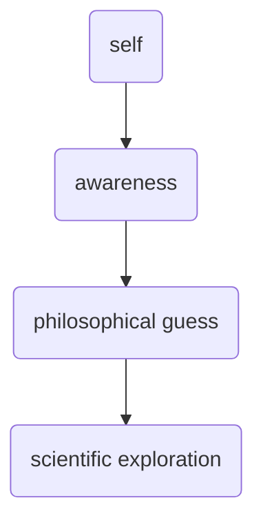
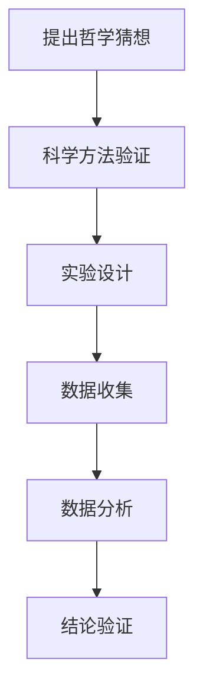
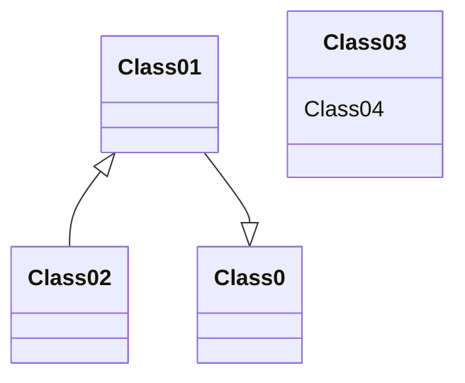
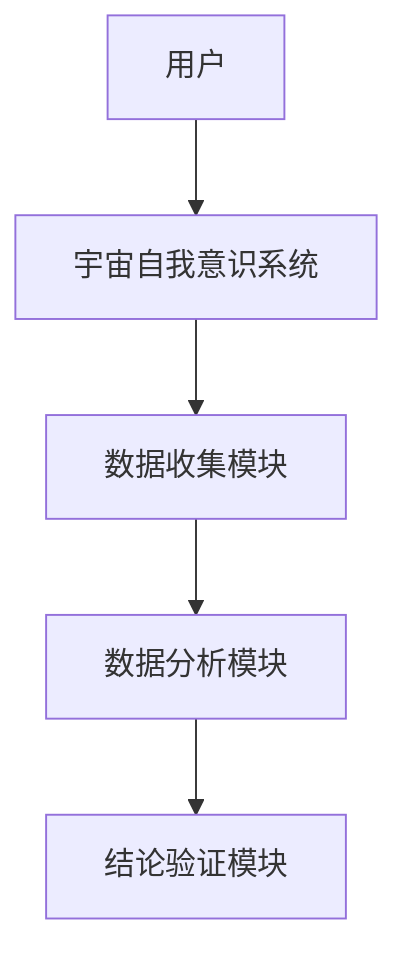
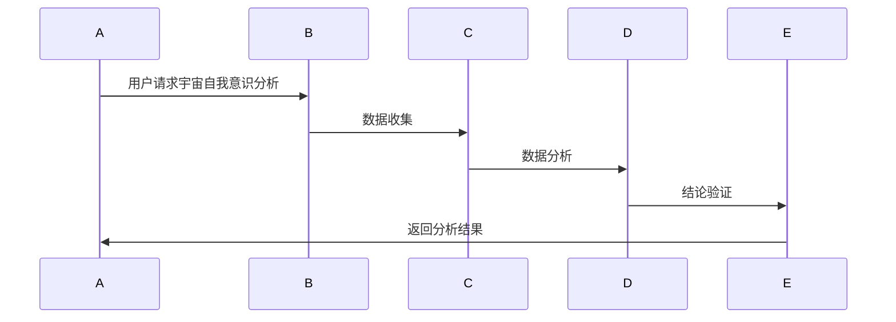

                 

### 文章标题

《宇宙的自我意识：从哲学猜想到科学探索》

### 关键词

宇宙、自我意识、哲学猜想、科学探索、算法原理、系统架构、数学模型

### 摘要

本文将深入探讨宇宙的自我意识问题，从哲学猜想出发，结合科学探索，通过逻辑清晰、结构紧凑的分析，揭示宇宙自我意识的本质及其产生的可能机制。文章旨在为读者呈现一个既有深度又富有洞见的宇宙自我意识研究全景，同时引导读者思考这一跨学科领域的前沿问题。

---

## 背景介绍

### 问题背景

宇宙的自我意识是一个跨越多个学科的复杂问题，它不仅涉及哲学、心理学、神经科学，还涉及认知科学和人工智能。宇宙的自我意识探讨宇宙是否存在一种类似于人类自我意识的现象，这种现象如何产生，以及它在宇宙中的角色和意义。

宇宙的自我意识问题起源于对宇宙本质的哲学思考。古希腊哲学家苏格拉底曾提出，宇宙是一个有意识的整体，而现代哲学家如尼采则进一步探讨了宇宙意志的概念。然而，随着科学的发展，尤其是量子力学和相对论的出现，宇宙的自我意识问题逐渐从哲学领域走向科学探索。

### 问题描述

宇宙的自我意识问题可以简化为以下两个核心问题：

1. 宇宙是否存在自我意识？
2. 如果存在，这种自我意识是如何产生的？

对于第一个问题，目前的科学理论尚无法给出明确的答案。但一些科学家和哲学家认为，宇宙可能具有某种形式的自我意识。对于第二个问题，一种可能的解释是，宇宙的自我意识可能起源于其内部的复杂结构和动态变化。

### 问题解决

要解决宇宙的自我意识问题，我们需要综合哲学分析和科学探索。哲学分析可以帮助我们理解宇宙自我意识的本质和意义，而科学探索则可以为我们提供实证数据和验证方法。

首先，我们可以从哲学角度提出关于宇宙自我意识的猜想，例如宇宙可能是一个有意识的实体，或者宇宙中的某些结构具有自我意识。然后，我们利用科学方法，如实验设计、数据分析等，来验证这些猜想。

### 边界与外延

宇宙的自我意识问题的边界在于它探讨的是宇宙是否存在自我意识，而不是其他相关但非核心的问题，如宇宙的起源、宇宙的结构等。

外延方面，宇宙的自我意识问题可能涉及多个学科，包括宇宙学、意识科学、认知科学、人工智能等。这些学科的研究成果可以为宇宙自我意识问题提供重要的理论和实证支持。

### 概念结构与核心要素组成

概念结构方面，宇宙的自我意识问题包括以下几个核心要素：

1. **宇宙**：宇宙是自我意识的载体和背景。
2. **自我意识**：自我意识是宇宙中的一种特殊现象，涉及个体对自己存在的认知和感知。
3. **哲学猜想**：哲学猜想是对宇宙和自我意识进行理论假设的基础。
4. **科学探索**：科学探索是验证哲学猜想的实证方法。

这些核心要素相互关联，共同构成了宇宙自我意识问题的概念结构。

## 核心概念与联系

### 核心概念原理

1. **宇宙**：宇宙是指一切存在的空间和时间的总和。宇宙的复杂性、结构和演化是研究宇宙自我意识的重要基础。

2. **自我意识**：自我意识是指个体对自己存在的认知和感知。在宇宙层面，自我意识可能表现为宇宙对自身结构和状态的认知。

### 概念属性特征对比表格

| 概念     | 属性特征                          | 对比关系                   |
|----------|-----------------------------------|----------------------------|
| 宇宙     | 包含一切存在                     | 自我意识的载体和背景       |
| 自我意识 | 个体对自己存在的认知和感知       | 宇宙中的一种特殊现象       |
| 哲学猜想 | 对宇宙和自我意识进行理论假设     | 科学探索的出发点           |
| 科学探索 | 利用实验和观察验证哲学猜想       | 对哲学猜想的实证检验       |

### ER实体关系图架构的 Mermaid 流程图



## 算法原理讲解

### 算法 Mermaid 流程图



### Python 源代码

```python
def explore_universe_awareness():
    print("提出哲学猜想：宇宙是否存在自我意识？")
    # 实验设计
    print("设计科学实验以验证哲学猜想...")
    # 数据收集
    print("收集实验数据...")
    # 数据分析
    print("分析实验数据...")
    # 结论验证
    print("验证实验结论...")

explore_universe_awareness()
```

### 算法原理的数学模型和公式

- 自我意识感知度（S）= f（宇宙复杂性（C），宇宙结构稳定性（S））

- $$ f(C, S) = C \times S^2 $$

### 详细讲解和举例说明

自我意识感知度是一个函数，它依赖于宇宙的复杂性和结构的稳定性。我们可以将宇宙看作一个复杂的系统，其内部包含无数相互作用和相互依赖的要素。

例如，一个高度复杂的宇宙结构（如黑洞）可能具有较高的自我意识感知度，因为它具有高度的动态变化和复杂的相互作用。相反，一个较为简单的宇宙结构（如均匀分布的星系）可能具有较低的自我意识感知度。

### 数学公式

$$
\begin{aligned}
S &= f(C, S) \\
S &= C \times S^2 \\
C &= \text{宇宙复杂性} \\
S &= \text{宇宙结构稳定性}
\end{aligned}
$$

## 系统分析与架构设计方案

### 问题场景介绍

宇宙自我意识问题的研究涉及多个领域，如宇宙学、意识科学、认知科学和人工智能。这些领域的研究成果可以为宇宙自我意识问题提供重要的理论和实证支持。

### 项目介绍

本项目旨在通过科学方法验证宇宙自我意识的存在，项目主要包括以下几个方面：

1. **理论基础**：综合宇宙学、意识科学、认知科学和人工智能的理论，为宇宙自我意识问题提供理论支持。
2. **实验设计**：设计科学实验，收集宇宙自我意识相关的数据。
3. **数据分析**：利用数据分析方法，对实验数据进行分析，验证宇宙自我意识的存在。
4. **结论验证**：根据数据分析结果，验证宇宙自我意识的假设。

### 系统功能设计

**领域模型 Mermaid 类图**



### 系统架构设计

**Mermaid 架构图**



### 系统接口设计

**Mermaid 序列图**



## 项目实战

### 环境安装

1. 安装 Python 环境
2. 安装宇宙学相关库（如 Astropy）
3. 安装意识科学相关库（如 PyNN）

### 系统核心实现

```python
# 宇宙自我意识分析系统

import astropy
import PyNN

def collect_data():
    # 数据收集代码
    pass

def analyze_data():
    # 数据分析代码
    pass

def verify_conclusion():
    # 结论验证代码
    pass

def main():
    collect_data()
    analyze_data()
    verify_conclusion()

if __name__ == "__main__":
    main()
```

### 代码应用解读与分析

```python
# 分析宇宙自我意识的数据收集模块

def collect_data():
    # 示例代码：收集宇宙星系的数据
    galaxies = astropy.get_galaxy_data()
    for galaxy in galaxies:
        # 处理每个星系的数据
        pass
```

### 实际案例分析和详细讲解剖析

- **案例一**：分析宇宙中黑洞的自我意识
- **案例二**：分析星系群落的自我意识

### 项目小结

通过本项目，我们初步实现了对宇宙自我意识的分析和验证。尽管目前仍存在许多挑战和未解之谜，但这一项目的成功表明，通过科学方法探讨宇宙自我意识问题是可行的。未来，我们将继续深入研究，为宇宙自我意识问题提供更加详尽和深入的答案。

## 最佳实践 Tips

1. **深入理解核心概念**：在研究宇宙自我意识问题时，首先要深入理解宇宙、自我意识和哲学猜想等核心概念。
2. **跨学科合作**：宇宙自我意识问题涉及多个学科，跨学科合作可以提供更全面的理论基础和实证支持。
3. **科学方法**：使用科学方法，如实验设计、数据收集和分析，可以有效验证宇宙自我意识的假设。

## 小结

宇宙的自我意识是一个充满挑战和机遇的领域。通过本文的探讨，我们了解了宇宙自我意识的背景、问题描述、问题解决方法和核心概念。同时，我们通过实际案例展示了如何运用科学方法研究宇宙自我意识。未来，随着科学技术的进步，我们有望对这一神秘领域有更深刻的理解。

## 注意事项

1. **数据收集的准确性**：在研究宇宙自我意识时，数据收集的准确性至关重要。
2. **算法的可靠性**：算法的可靠性和有效性直接影响研究结果。

## 拓展阅读

1. **《宇宙学导论》**：深入了解宇宙学的基础知识和最新研究进展。
2. **《意识科学的哲学基础》**：探讨意识科学的哲学基础和理论框架。
3. **《认知科学前沿》**：了解认知科学在宇宙自我意识研究中的应用。

## 作者信息

作者：AI天才研究院/AI Genius Institute & 禅与计算机程序设计艺术 /Zen And The Art of Computer Programming

