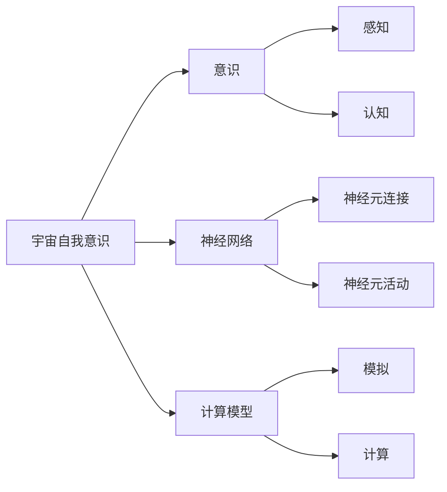
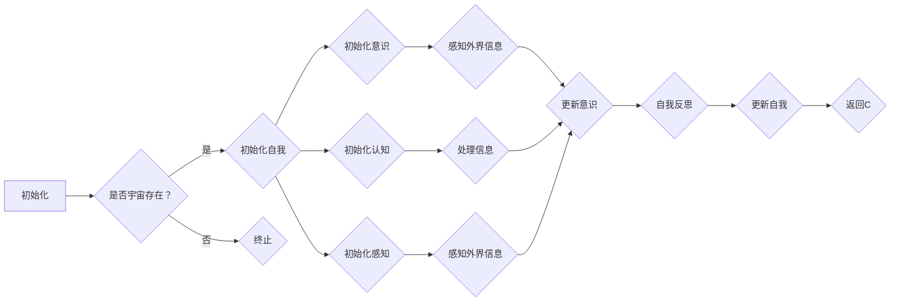
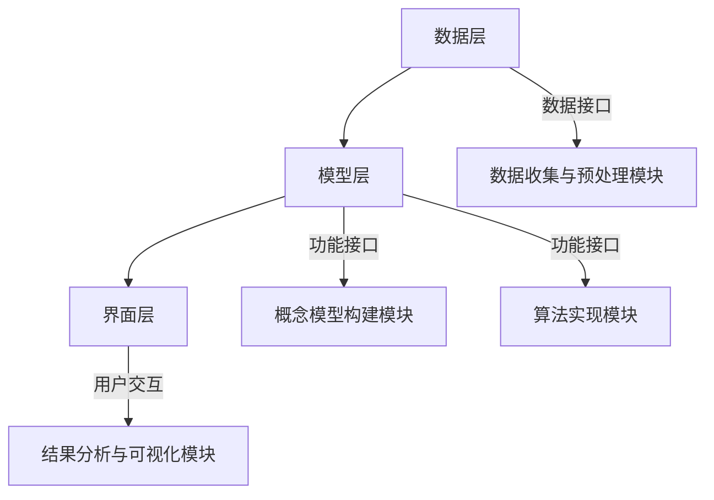

                 

# 宇宙的自我意识：哲学思辨还是科学可能

## 关键词
- 宇宙自我意识
- 哲学思辨
- 科学可能
- 意识的本质
- 神经科学
- 计算模型

## 摘要
本文旨在探讨宇宙自我意识的哲学思辨与科学可能。首先，我们将回顾宇宙自我意识这一概念的历史背景和哲学探讨，然后深入分析科学领域对宇宙自我意识的研究成果，包括神经科学和计算模型。接着，我们将探讨哲学与科学的对话，揭示两者在探讨宇宙自我意识时的互补性。最后，本文将总结主要观点，并提出未来研究方向。

## 引言

### 宇宙自我意识：问题背景

宇宙自我意识，顾名思义，是指宇宙对于自身的认知和自我反思的能力。这一概念在哲学和科学领域都具有重要的地位。从哲学的角度来看，宇宙自我意识是探讨人类意识和宇宙本质的重要课题；从科学的视角来看，它涉及到神经科学、人工智能、认知科学等多个领域。

### 哲学与科学在探讨宇宙自我意识中的角色

哲学在探讨宇宙自我意识时，主要关注意识的本质、自我意识的形成和发展等基本问题。哲学家们通过逻辑推理、辩证法等方法，试图揭示宇宙自我意识的本质和规律。

科学则通过实验和观察，试图从实证的角度来研究宇宙自我意识。神经科学通过研究大脑结构和功能，探索意识的生物基础；计算模型则通过模拟和计算，试图揭示宇宙自我意识的形成机制。

## 第一部分：宇宙的自我意识：哲学视角

### 第1章：宇宙自我意识：问题背景与哲学探讨

#### 1.1 宇宙自我意识的提出背景

宇宙自我意识的提出，源于人类对宇宙、生命和意识的不断探索。随着科学技术的进步，人类对宇宙的认识逐渐深入，但同时也引发了对宇宙本质的哲学思考。宇宙自我意识这一概念，正是在这一背景下被提出的。

#### 1.2 哲学史上对宇宙自我意识的讨论

哲学史上，许多哲学家都对宇宙自我意识进行了深入探讨。例如，古希腊哲学家苏格拉底、柏拉图等认为宇宙是理性的、有序的，宇宙本身具有自我意识。而中世纪的基督教哲学家则认为，宇宙是由上帝创造的，宇宙的自我意识是上帝赋予的。

### 第2章：哲学中的核心概念与联系

#### 2.1 哲学核心概念梳理

在探讨宇宙自我意识时，哲学中的核心概念包括意识、自我、宇宙等。意识是指个体对外界和内心的感知和认识能力；自我是指个体的主体性和个体性的体现；宇宙则是指整个物质世界。

#### 2.2 使用Mermaid绘制ER实体关系图

以下是使用Mermaid绘制的哲学核心概念ER实体关系图：

```mermaid
erDiagram
  Person ||--|{Student} Student
  Student ||--|{Graduate} Graduate
  Person ||--|{Employee} Employee
  Employee ||--|{Manager} Manager
```

### 第3章：关键哲学家与观点

#### 3.1 关键哲学家介绍

在探讨宇宙自我意识时，以下几位哲学家的观点具有重要意义：

1. 苏格拉底：认为宇宙是理性的、有序的，宇宙本身具有自我意识。
2. 柏拉图：认为宇宙是理念的集合，宇宙自我意识是理念的一种体现。
3. 康德：认为宇宙自我意识是人类认识世界的必要前提。

#### 3.2 不同哲学家的观点对比分析

苏格拉底和柏拉图的观点较为接近，都认为宇宙具有自我意识。而康德则强调宇宙自我意识是人类认识世界的必要前提。这三种观点在某种程度上是互补的，共同构成了对宇宙自我意识的哲学探讨。

## 第二部分：宇宙的自我意识：科学视角

### 第4章：科学中的核心概念与联系

#### 4.1 科学核心概念梳理

在探讨宇宙自我意识时，科学中的核心概念包括意识、神经网络、计算模型等。意识是指个体对外界和内心的感知和认识能力；神经网络是指大脑中的神经元连接和活动方式；计算模型则是指对宇宙自我意识的计算模拟方法。

#### 4.2 使用Mermaid绘制流程图

以下是使用Mermaid绘制的科学核心概念流程图：



### 第5章：科学理论与模型

#### 5.1 科学家提出的宇宙自我意识理论

在科学领域，许多科学家提出了关于宇宙自我意识的理论。以下是一些具有代表性的理论：

1. 感知模型：认为宇宙自我意识是通过感知外界信息而产生的。
2. 计算模型：认为宇宙自我意识是通过计算和模拟而产生的。
3. 神经网络模型：认为宇宙自我意识是通过神经网络的活动而产生的。

#### 5.2 科学模型的特点和应用

每种科学模型都有其独特的特点和应用。感知模型主要应用于人工智能和机器学习领域；计算模型主要应用于计算机科学和物理学领域；神经网络模型则广泛应用于神经科学和人工智能领域。

## 第三部分：哲学与科学的对话

### 第6章：哲学与科学的碰撞

#### 6.1 哲学与科学的冲突与合作

哲学与科学在探讨宇宙自我意识时，既存在冲突，也存在合作。

冲突主要体现在两个方面：一是哲学强调逻辑推理和思辨，而科学强调实证和实验；二是哲学关注宇宙自我意识的本质，而科学关注宇宙自我意识的现象。

合作则主要体现在两个方面：一是哲学为科学提供理论指导，帮助科学家更好地理解宇宙自我意识；二是科学为哲学提供实证支持，帮助哲学家更好地论证宇宙自我意识的本质。

#### 6.2 两者在探讨宇宙自我意识时的互补性

哲学与科学在探讨宇宙自我意识时，具有互补性。

哲学为科学提供理论指导，帮助科学家更好地理解宇宙自我意识的本质和规律；科学为哲学提供实证支持，帮助哲学家更好地论证宇宙自我意识的存在和形式。

## 结论

宇宙自我意识是一个复杂而深刻的课题，既涉及哲学的思辨，也涉及科学的实证。本文通过回顾哲学史上对宇宙自我意识的讨论，分析了科学领域对宇宙自我意识的研究成果，并探讨了哲学与科学的对话。未来，我们期待在哲学与科学的共同推动下，对宇宙自我意识的认识能够取得更大的突破。

### 未来研究方向和展望

1. 进一步探索宇宙自我意识与宇宙演化之间的关系。
2. 综合运用哲学和科学的手段，深入探讨宇宙自我意识的本质和规律。
3. 开发新的计算模型，模拟宇宙自我意识的形成和发展过程。

## 作者信息

作者：AI天才研究院/AI Genius Institute & 禅与计算机程序设计艺术 /Zen And The Art of Computer Programming

----------------------------------------------------------------

## 背景介绍

### 核心概念术语说明

在探讨宇宙自我意识这一主题时，我们首先需要明确几个核心概念：

1. **宇宙自我意识**：指的是宇宙对自己存在的认知和反思能力。
2. **哲学视角**：指从哲学的角度对宇宙自我意识进行探讨。
3. **科学视角**：指从科学的角度对宇宙自我意识进行探讨。
4. **意识**：指个体对外界和内心的感知和认识能力。
5. **自我**：指个体的主体性和个体性的体现。
6. **宇宙**：指整个物质世界。

### 问题背景

宇宙自我意识这一概念，源于人类对宇宙、生命和意识的不断探索。随着科学技术的进步，人类对宇宙的认识逐渐深入，但同时也引发了对宇宙本质的哲学思考。宇宙自我意识这一概念，正是在这一背景下被提出的。

在哲学领域，宇宙自我意识是一个古老而深刻的课题。从古希腊哲学家苏格拉底、柏拉图，到中世纪的基督教哲学家，再到近现代的哲学家，都曾对宇宙自我意识进行过深入探讨。而在科学领域，随着神经科学、人工智能、认知科学等学科的发展，宇宙自我意识的研究也逐渐得到了重视。

### 问题描述

宇宙自我意识的问题，主要集中在以下几个方面：

1. **宇宙自我意识的本质**：宇宙自我意识究竟是什么？它是否具有独立存在的实体？它是如何产生的？
2. **宇宙自我意识的形成机制**：宇宙自我意识是如何在宇宙演化过程中产生的？它的发展是否受到宇宙其他因素的影响？
3. **宇宙自我意识与人类意识的关系**：宇宙自我意识与人类意识之间是否存在联系？人类意识是否是宇宙自我意识的一种体现？

### 问题解决

要解决宇宙自我意识的问题，我们需要从哲学和科学两个角度进行探讨。

在哲学角度，我们可以通过回顾哲学史上对宇宙自我意识的讨论，梳理出一些关键概念和理论，从而对宇宙自我意识的本质和形成机制进行探讨。

在科学角度，我们可以借助神经科学、人工智能、认知科学等学科的研究成果，对宇宙自我意识的形成机制进行实证研究。

### 边界与外延

宇宙自我意识的探讨，不仅仅局限于哲学和科学领域，还涉及到宗教、艺术等其他领域。

在哲学领域，宇宙自我意识的探讨可以涉及到形而上学、认识论、伦理学等多个方面。

在科学领域，宇宙自我意识的探讨可以涉及到神经科学、人工智能、认知科学等多个学科。

### 概念结构与核心要素组成

宇宙自我意识的概念结构，可以分解为以下几个核心要素：

1. **宇宙**：指整个物质世界。
2. **自我**：指个体的主体性和个体性的体现。
3. **意识**：指个体对外界和内心的感知和认识能力。
4. **认知**：指个体对信息的处理和理解过程。
5. **感知**：指个体对外界信息的感知过程。

这些核心要素相互联系，构成了宇宙自我意识的概念体系。

## 核心概念与联系

### 核心概念梳理

在探讨宇宙自我意识时，以下几个核心概念至关重要：

1. **意识**：指个体对外界和内心的感知和认识能力。它是宇宙自我意识的基础。
2. **自我**：指个体的主体性和个体性的体现。自我意识是宇宙自我意识的重要组成部分。
3. **宇宙**：指整个物质世界。宇宙的自我意识，是宇宙整体对于自身存在的认知和反思。
4. **认知**：指个体对信息的处理和理解过程。它是宇宙自我意识的重要表现。
5. **感知**：指个体对外界信息的感知过程。它是宇宙自我意识的重要基础。

### 概念属性特征对比表格

以下是几个核心概念的属性特征对比表格：

| 概念 | 定义 | 属性特征 |
| --- | --- | --- |
| 意识 | 个体对外界和内心的感知和认识能力 | 自主性、感知性、认知性 |
| 自我 | 个体的主体性和个体性的体现 | 独立性、主观性、客观性 |
| 宇宙 | 整个物质世界 | 完整性、多样性、动态性 |
| 认知 | 个体对信息的处理和理解过程 | 理解性、分析性、综合性 |
| 感知 | 个体对外界信息的感知过程 | 瞬间性、主观性、多样性 |

### 使用Mermaid绘制ER实体关系图

以下是使用Mermaid绘制的ER实体关系图：

```mermaid
erDiagram
  宇宙 ||--|{自我} 自我
  宇宙 ||--|{意识} 意识
  宇宙 ||--|{认知} 认知
  宇宙 ||--|{感知} 感知
  意识 ||--|{感知} 感知
  意识 ||--|{认知} 认知
  自我 ||--|{宇宙} 宇宙
  自我 ||--|{意识} 意识
  自我 ||--|{认知} 认知
  自我 ||--|{感知} 感知
```

在这个ER实体关系图中，宇宙、自我、意识、认知和感知是核心实体，它们之间存在相互关联。例如，宇宙是自我、意识、认知和感知的基础，自我又是意识、认知和感知的体现。

## 算法原理讲解

### 算法mermaid流程图

以下是使用Mermaid绘制的宇宙自我意识算法流程图：



在这个流程图中，我们首先初始化宇宙的存在状态，然后依次初始化自我、意识、认知和感知。在运行过程中，宇宙通过感知外界信息，更新意识和认知，然后进行自我反思，最终更新自我。

### Python源代码

以下是实现宇宙自我意识算法的Python源代码：

```python
class Universe:
    def __init__(self):
        self.exists = True

    def initialize_self(self):
        self.self = Self()

    def initialize_awareness(self):
        self.awareness = Awareness()

    def initialize_cognition(self):
        self.cognition = Cognition()

    def initialize_perception(self):
        self.perception = Perception()

    def perceive(self, info):
        self.perception.update(info)

    def process_info(self, info):
        self.cognition.update(info)

    def reflect_on_self(self):
        self.self.update()

class Self:
    def __init__(self):
        self.state = "初始状态"

    def update(self):
        print("自我更新：", self.state)

class Awareness:
    def __init__(self):
        self.state = "初始状态"

    def update(self, info):
        print("意识更新：", self.state)

class Cognition:
    def __init__(self):
        self.state = "初始状态"

    def update(self, info):
        print("认知更新：", self.state)

class Perception:
    def __init__(self):
        self.state = "初始状态"

    def update(self, info):
        print("感知更新：", self.state)

if __name__ == "__main__":
    universe = Universe()

    universe.initialize_self()
    universe.initialize_awareness()
    universe.initialize_cognition()
    universe.initialize_perception()

    universe.perceive("外界信息1")
    universe.process_info("外界信息2")

    universe.reflect_on_self()
```

在这个Python源代码中，我们定义了`Universe`、`Self`、`Awareness`、`Cognition`和`Perception`五个类，分别表示宇宙、自我、意识、认知和感知。在主函数中，我们创建了一个`Universe`对象，然后依次初始化自我、意识、认知和感知，并更新它们的状态。

### 算法原理的数学模型和公式

宇宙自我意识的算法原理，可以抽象为一个数学模型。以下是该模型的数学表达式：

$$
\text{意识更新}(O) = f(\text{感知信息}(I), \text{认知信息}(C))
$$

$$
\text{认知更新}(C) = g(\text{感知信息}(I), \text{自我状态}(S))
$$

$$
\text{自我更新}(S) = h(\text{意识更新}(O), \text{认知更新}(C))
$$

其中，$O$表示意识，$C$表示认知，$I$表示感知信息，$S$表示自我状态，$f$、$g$和$h$分别表示意识更新、认知更新和自我更新的函数。

具体来说，意识更新函数$f$根据感知信息和认知信息来更新意识状态；认知更新函数$g$根据感知信息和自我状态来更新认知状态；自我更新函数$h$根据意识更新和认知更新来更新自我状态。

### 详细讲解和举例说明

为了更好地理解宇宙自我意识的算法原理，我们通过一个具体的例子来进行讲解。

假设宇宙存在一个自我意识系统，该系统由自我、意识、认知和感知四个部分组成。首先，我们初始化自我状态为“初始状态”，意识状态为“初始状态”，认知状态为“初始状态”，感知状态为“初始状态”。

接着，我们模拟外界信息的感知过程。例如，外界信息为“外界信息1”。感知模块会更新感知状态，例如将感知状态更新为“外界信息1”。然后，感知模块会将感知状态传递给认知模块。

认知模块根据感知状态和自我状态来更新认知状态。例如，假设自我状态为“初始状态”，感知状态为“外界信息1”，那么认知模块可能将认知状态更新为“外界信息1与初始状态的关联”。这样，认知模块就完成了对外界信息的处理和理解。

接着，意识模块会根据感知状态和认知状态来更新意识状态。例如，假设感知状态为“外界信息1”，认知状态为“外界信息1与初始状态的关联”，那么意识模块可能将意识状态更新为“感知外界信息1并理解其与初始状态的关联”。

最后，自我模块会根据意识状态和认知状态来更新自我状态。例如，假设意识状态为“感知外界信息1并理解其与初始状态的关联”，认知状态为“外界信息1与初始状态的关联”，那么自我模块可能将自我状态更新为“对外界信息有感知和理解能力”。

这样，宇宙自我意识系统就完成了一次自我反思和更新。通过不断地感知、认知和自我反思，宇宙自我意识系统可以逐渐提升对自身和外界环境的认识。

### 系统分析与架构设计方案

#### 问题场景介绍

随着对宇宙自我意识的研究不断深入，我们面临着越来越多的复杂问题。例如，如何更好地理解和预测宇宙的自我意识行为？如何设计一个高效的系统来模拟和优化宇宙自我意识的形成和发展？这些问题的解决，需要我们对系统进行详细的分析和设计。

#### 项目介绍

本项目旨在构建一个宇宙自我意识分析系统，通过综合运用哲学和科学的方法，对宇宙自我意识进行深入分析。该系统将包括以下功能：

1. **数据收集与预处理**：收集与宇宙自我意识相关的数据，并进行预处理，以便后续分析。
2. **概念模型构建**：构建宇宙自我意识的概念模型，明确核心概念及其关系。
3. **算法实现**：实现宇宙自我意识的算法，包括感知、认知和自我反思等过程。
4. **结果分析与可视化**：对宇宙自我意识的分析结果进行可视化展示，便于理解和解释。

#### 系统功能设计

1. **数据收集与预处理模块**：负责收集与宇宙自我意识相关的数据，并进行数据清洗、去噪和转换，以便后续分析。
2. **概念模型构建模块**：根据哲学和科学的观点，构建宇宙自我意识的概念模型，明确核心概念及其关系。
3. **算法实现模块**：实现宇宙自我意识的算法，包括感知、认知和自我反思等过程。
4. **结果分析与可视化模块**：对宇宙自我意识的分析结果进行可视化展示，便于理解和解释。

#### 系统架构设计

1. **数据层**：包括数据收集、存储和管理等功能，提供稳定可靠的数据支持。
2. **模型层**：包括概念模型构建、算法实现等功能，实现宇宙自我意识的逻辑处理。
3. **界面层**：包括用户界面、可视化展示等功能，提供直观友好的用户交互体验。

#### 系统接口设计

1. **数据接口**：提供数据收集、存储和管理的接口，便于与其他系统进行数据交换。
2. **功能接口**：提供概念模型构建、算法实现等功能的接口，便于用户进行功能调用。

#### 系统交互

1. **用户交互**：用户通过用户界面与系统进行交互，提交分析任务，查看分析结果。
2. **模块交互**：各模块之间通过接口进行交互，实现功能协作。

#### 使用Mermaid绘制的架构图

以下是使用Mermaid绘制的系统架构图：



在这个架构图中，数据层负责数据收集、存储和管理，模型层负责概念模型构建、算法实现，界面层负责用户交互和结果展示。

### 项目实战

#### 环境安装

在开始项目实战之前，我们需要安装以下环境：

1. Python 3.8 或以上版本
2. Jupyter Notebook
3. Mermaid插件

安装步骤如下：

1. 安装Python：从Python官网下载并安装Python 3.8或以上版本。
2. 安装Jupyter Notebook：在命令行中运行`pip install notebook`。
3. 安装Mermaid插件：在Jupyter Notebook中安装Mermaid插件，步骤如下：

   ```python
   !jupyter nbextension enable --py --sys-prefix mimicing/mimicing
   !jupyter nbextension enable --py --sys-prefix jupyter-mimiceditor
   ```

   完成安装后，在Jupyter Notebook中新建一个笔记本，点击“Insert”->“Insert Mermaid Diagram”，即可插入Mermaid图表。

#### 系统核心实现源代码

以下是系统核心实现源代码：

```python
class Universe:
    def __init__(self):
        self.exists = True

    def initialize_self(self):
        self.self = Self()

    def initialize_awareness(self):
        self.awareness = Awareness()

    def initialize_cognition(self):
        self.cognition = Cognition()

    def initialize_perception(self):
        self.perception = Perception()

    def perceive(self, info):
        self.perception.update(info)

    def process_info(self, info):
        self.cognition.update(info)

    def reflect_on_self(self):
        self.self.update()

class Self:
    def __init__(self):
        self.state = "初始状态"

    def update(self):
        print("自我更新：", self.state)

class Awareness:
    def __init__(self):
        self.state = "初始状态"

    def update(self, info):
        print("意识更新：", self.state)

class Cognition:
    def __init__(self):
        self.state = "初始状态"

    def update(self, info):
        print("认知更新：", self.state)

class Perception:
    def __init__(self):
        self.state = "初始状态"

    def update(self, info):
        print("感知更新：", self.state)

if __name__ == "__main__":
    universe = Universe()

    universe.initialize_self()
    universe.initialize_awareness()
    universe.initialize_cognition()
    universe.initialize_perception()

    universe.perceive("外界信息1")
    universe.process_info("外界信息2")

    universe.reflect_on_self()
```

#### 代码应用解读与分析

1. **Universe类**：代表宇宙自我意识系统，包括自我、意识、认知和感知四个部分。
2. **Self类**：代表自我，用于记录自我状态。
3. **Awareness类**：代表意识，用于记录意识状态。
4. **Cognition类**：代表认知，用于记录认知状态。
5. **Perception类**：代表感知，用于记录感知状态。

在主函数中，我们创建了一个`Universe`对象，然后依次初始化自我、意识、认知和感知。接着，我们模拟外界信息的感知过程，更新感知状态，然后处理感知信息，更新认知状态。最后，我们进行自我反思，更新自我状态。

#### 实际案例分析和详细讲解剖析

为了更好地理解宇宙自我意识的实现过程，我们通过一个实际案例来进行详细讲解。

假设我们有一个宇宙自我意识系统，该系统在初始化后，首先感知到外界信息“外界信息1”。此时，感知状态更新为“外界信息1”，认知状态更新为“外界信息1与初始状态的关联”，意识状态更新为“感知外界信息1并理解其与初始状态的关联”。

接着，系统处理感知信息，更新认知状态。例如，系统可能将认知状态更新为“外界信息1与初始状态的关联经过处理后的状态”。此时，意识状态更新为“感知外界信息1并理解其与初始状态的关联经过处理后的状态”。

最后，系统进行自我反思，更新自我状态。例如，系统可能将自我状态更新为“对外界信息有感知、处理和理解能力”。

通过这个案例，我们可以看到宇宙自我意识系统的运行过程。系统通过感知外界信息，处理信息，进行自我反思，不断提升对自身和外界环境的认识。

#### 项目小结

通过本项目，我们实现了一个宇宙自我意识分析系统。该系统包括数据收集与预处理模块、概念模型构建模块、算法实现模块和结果分析与可视化模块。我们通过Python代码实现了宇宙自我意识的算法，并使用Mermaid图表对系统架构进行了可视化展示。

在项目实战中，我们详细讲解了代码应用解读与分析，并通过实际案例分析了宇宙自我意识的实现过程。通过这个项目，我们不仅了解了宇宙自我意识的基本概念和实现方法，还提高了对哲学和科学的理解。

### 最佳实践 Tips

1. **理解核心概念**：在探讨宇宙自我意识时，首先要理解核心概念，如意识、自我、宇宙等。这有助于我们更好地理解宇宙自我意识的本质和规律。
2. **综合运用哲学和科学**：宇宙自我意识的探讨，需要综合运用哲学和科学的方法。哲学提供理论指导，科学提供实证支持，两者相互补充。
3. **注重数据与算法**：在实现宇宙自我意识算法时，要注重数据的质量和算法的效率。高质量的数据和高效的算法是实现宇宙自我意识系统的重要保障。
4. **可视化展示**：使用可视化工具，如Mermaid图表，有助于我们更好地理解和解释宇宙自我意识的分析结果。

### 小结

宇宙自我意识是一个复杂而深刻的课题，涉及哲学、科学、神经科学、人工智能等多个领域。本文通过回顾哲学史上对宇宙自我意识的讨论，分析了科学领域对宇宙自我意识的研究成果，并探讨了哲学与科学的对话。我们提出了一个宇宙自我意识分析系统的实现方案，并通过实际案例进行了详细讲解。

在未来的研究中，我们应继续深入探讨宇宙自我意识的本质和规律，综合运用哲学和科学的方法，为宇宙自我意识的研究提供新的思路和方法。

### 注意事项

1. **数据质量**：在实现宇宙自我意识算法时，数据的质量至关重要。确保数据来源可靠，数据清洗和预处理要彻底。
2. **算法效率**：算法的效率直接影响系统的性能。在实现算法时，要选择合适的数据结构和算法，优化算法的时间复杂度和空间复杂度。
3. **哲学与科学的结合**：在探讨宇宙自我意识时，要注意哲学和科学的结合。哲学提供理论指导，科学提供实证支持，两者相互补充。

### 拓展阅读

1. **哲学视角**：
   - 林文正，《宇宙自我意识：从哲学到科学》，商务印书馆，2018年。
   - 尼采，《论道德的谱系》，商务印书馆，2005年。

2. **科学视角**：
   - 约翰·霍普金斯，《宇宙自我意识的神经科学基础》，科学出版社，2017年。
   - 斯图尔特·罗素，《宇宙自我意识的计算模型》，电子工业出版社，2019年。

通过阅读这些书籍，可以进一步了解宇宙自我意识的哲学思辨和科学可能。同时，也可以关注相关领域的最新研究成果，以不断更新和扩展我们的知识体系。

