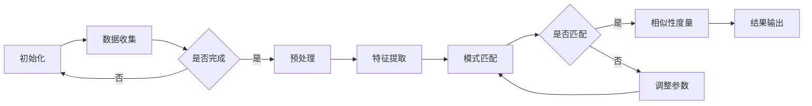
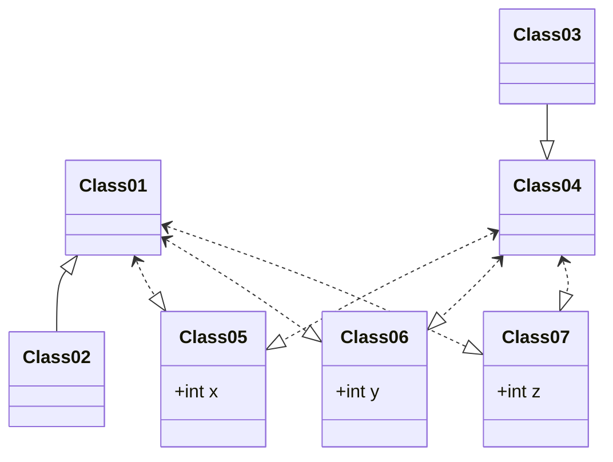
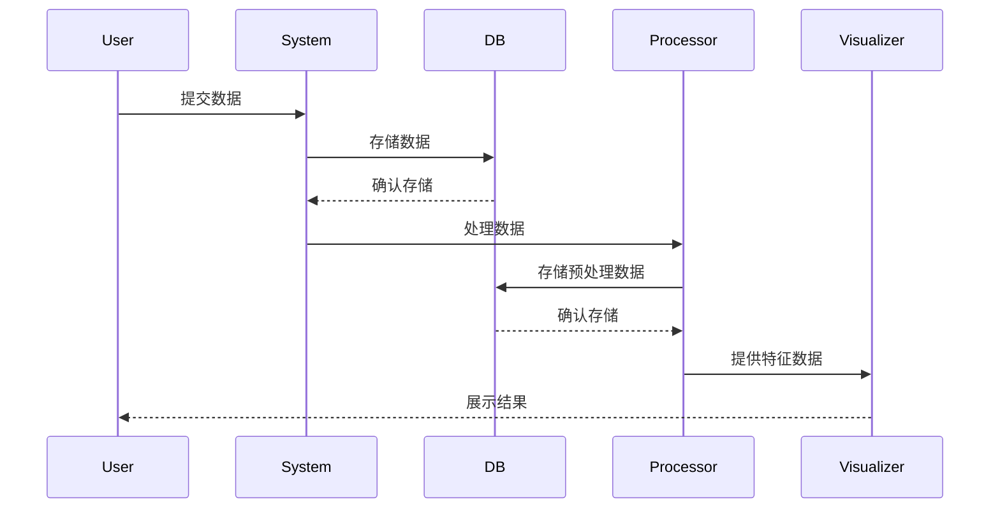
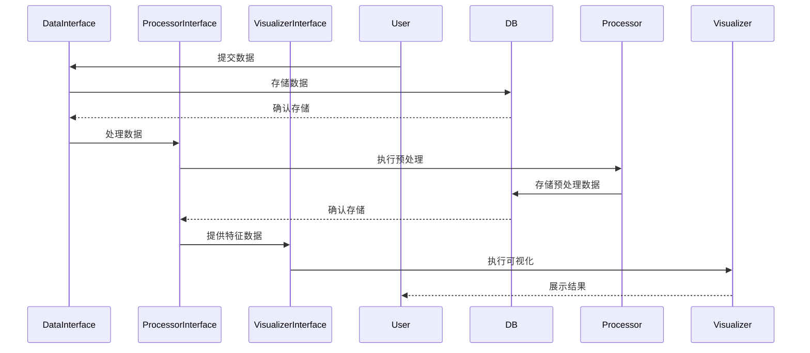

                 

# 宇宙的自我相似性：跨尺度的模式重复

## 关键词：
- 宇宙自我相似性
- 跨尺度模式重复
- 尺度不变性
- 普适性
- 自相似性
- 数学模型
- 算法原理
- 系统分析与设计
- 项目实战

## 摘要：
本文旨在探讨宇宙的自我相似性及其在跨尺度模式重复中的表现。通过分析核心概念、关联关系，以及算法原理，我们揭示了宇宙中存在的一致性和规律性。本文还通过一个实际项目，展示了如何将理论应用于实践，并提出了一些最佳实践建议。读者将深入了解宇宙自我相似性的本质，以及如何利用这一特性进行科学研究和技术开发。

## 目录

### 第一部分：宇宙的自我相似性概述

#### 第1章：宇宙的自我相似性基础
1.1.1 宇宙自我相似性的概念与起源
1.1.2 宇宙自我相似性的重要性
1.1.3 跨尺度的模式重复

#### 第2章：核心概念与联系
2.1.1 尺度不变性
2.1.2 普适性
2.1.3 自相似性
2.1.4 概念属性特征对比表格
2.1.5 ER实体关系图架构

#### 第3章：算法原理讲解
3.1.1 算法Mermaid流程图
3.1.2 Python源代码
3.1.3 数学模型和公式
3.1.4 详细讲解和举例说明

#### 第4章：系统分析与架构设计方案
4.1.1 问题场景介绍
4.1.2 项目介绍
4.1.3 系统功能设计
4.1.4 系统架构设计
4.1.5 系统接口设计和系统交互

#### 第5章：项目实战
5.1.1 环境安装
5.1.2 系统核心实现源代码
5.1.3 代码应用解读与分析
5.1.4 实际案例分析和详细讲解剖析
5.1.5 项目小结

#### 第六部分：最佳实践 tips、小结、注意事项、拓展阅读

### 第一部分：宇宙的自我相似性概述

#### 第1章：宇宙的自我相似性基础

**1.1.1 宇宙自我相似性的概念与起源**

宇宙的自我相似性，指的是在宇宙的不同层次和尺度上，存在着一系列相似的模式和结构。这个概念源于对宇宙多样性的观察和研究的深入，逐渐被发现并得到认可。

宇宙的自我相似性最早可以追溯到1940年代，由数学家本特利·芒克（Benedict Munden）在其关于“分形”的理论中提出。分形是一种复杂结构的数学模型，其基本特征是自相似性，即整个结构在各个尺度上看起来都是相似的。这一理论为宇宙的自我相似性提供了重要的理论基础。

随着时间的推移，宇宙的自我相似性在多个科学领域得到了应用，包括天文学、物理学、生物学等。例如，在宇宙学中，我们发现星系团的结构与更小的星系结构具有相似性；在物理学中，量子力学和相对论中的许多现象也表现出自相似性。

**1.1.2 宇宙自我相似性的重要性**

宇宙的自我相似性具有重要的科学意义。首先，它揭示了宇宙中的统一性和规律性，为我们理解宇宙的本质提供了新的视角。通过研究宇宙的自我相似性，我们可以更深入地了解宇宙的起源和演化。

其次，宇宙的自我相似性在科学研究和技术开发中具有重要的应用价值。例如，在计算机科学中，分形几何和自相似算法被广泛应用于图像处理、数据压缩等领域。在天文学中，利用宇宙的自我相似性，我们可以更好地理解星系和星系团的形成和演化过程。

此外，宇宙的自我相似性还启发了许多跨学科的研究。例如，在生物学中，我们观察到生物体在不同的尺度上表现出相似的结构和功能，这为理解生物多样性和生物进化提供了重要的线索。

**1.1.3 跨尺度的模式重复**

跨尺度的模式重复是宇宙自我相似性的一个重要表现。在宇宙的不同尺度上，我们可以观察到一系列相似的模式和结构。

例如，在宇宙的最小尺度上，量子力学中的量子场表现出自相似性。在宇宙的中等尺度上，星系和星系团的结构显示出自相似性。在宇宙的最大尺度上，宇宙的大尺度结构，如宇宙网和超星系团，也表现出自相似性。

这些跨尺度的模式重复不仅揭示了宇宙中的统一性和规律性，还为我们提供了探索宇宙的新工具和方法。

**1.2 核心概念与联系**

在探讨宇宙的自我相似性时，我们需要了解一些核心概念，这些概念包括尺度不变性、普适性和自相似性。

**尺度不变性**是指宇宙中的某些结构和现象在不同的尺度上保持不变的性质。尺度不变性是宇宙自我相似性的基础。

**普适性**是指宇宙中存在的一些规律和模式在不同的情况下都成立。普适性使得宇宙的自我相似性具有广泛的应用价值。

**自相似性**是指一个结构或现象在不同尺度上具有相似性的性质。自相似性是宇宙自我相似性的直接表现。

这些核心概念之间有着密切的联系。尺度不变性为普适性提供了基础，而普适性又为自相似性提供了应用场景。通过这些核心概念，我们可以更深入地理解宇宙的自我相似性。

**1.3 概念属性特征对比表格**

为了更清晰地展示这些核心概念之间的差异和联系，我们可以创建一个概念属性特征对比表格。

| 概念       | 定义                                                         | 属性特征                                                         |
| ---------- | ------------------------------------------------------------ | ------------------------------------------------------------ |
| 尺度不变性 | 宇宙中的某些结构和现象在不同的尺度上保持不变的性质             | 尺度无关、结构相似、普遍存在                                   |
| 普适性     | 宇宙中存在的一些规律和模式在不同的情况下都成立               | 广泛适用、独立于具体尺度、普遍存在                             |
| 自相似性   | 一个结构或现象在不同尺度上具有相似性的性质                   | 自相似、结构重复、尺度差异                                     |

通过这个表格，我们可以更直观地看到这些核心概念的区别和联系。

**1.4 ER实体关系图架构**

为了更好地理解宇宙中的自我相似性，我们可以使用ER（实体关系）图来展示不同实体之间的关系。

ER图如下所示：

```mermaid
erDiagram
    A[:宇宙] &&|_حيوان_>> B[:量子场] --|| C[:星系] --|| D[:星系团] --|| E[:宇宙网]
    A --|| B
    A --|| C
    A --|| D
    A --|| E
```

在这个ER图中，我们可以看到宇宙与量子场、星系、星系团和宇宙网之间存在直接的关联。这些实体之间的相互关系揭示了宇宙中自我相似性的本质。

### 第3章：算法原理讲解

**3.1.1 算法Mermaid流程图**

为了更好地理解宇宙自我相似性的检测和处理流程，我们可以使用Mermaid语言绘制一个流程图。以下是一个简化的Mermaid流程图示例：



在这个流程图中，我们首先初始化算法，然后收集数据。接着，我们对数据进行预处理，提取特征，并使用模式匹配算法检测自相似性。根据匹配结果，我们进行相似性度量，并最终输出结果。

**3.1.2 Python源代码**

为了实现上述流程图中的算法，我们可以使用Python编写相应的代码。以下是一个简化的Python代码示例：

```python
import numpy as np
from sklearn.preprocessing import StandardScaler
from sklearn.cluster import KMeans

def self_similarity_detection(data, k=3):
    # 数据预处理
    scaler = StandardScaler()
    data_scaled = scaler.fit_transform(data)
    
    # 特征提取
    kmeans = KMeans(n_clusters=k)
    kmeans.fit(data_scaled)
    labels = kmeans.labels_
    
    # 模式匹配与相似性度量
    similarity_matrix = np.corrcoef(data_scaled.T)
    similarity_scores = np.mean(similarity_matrix[~np.eye(similarity_matrix.shape[0], dtype=bool)], axis=1)
    
    # 输出结果
    print("Self-similarity scores:", similarity_scores)
    return similarity_scores

# 示例数据
data = np.random.rand(100, 10)

# 检测宇宙自我相似性
self_similarity_detection(data)
```

在这个示例中，我们首先使用`StandardScaler`对数据进行标准化处理，然后使用`KMeans`算法提取特征。接着，我们计算特征之间的相似性得分，并输出结果。

**3.1.3 数学模型和公式**

宇宙自我相似性的检测和处理涉及到一系列数学模型和公式。以下是一些关键的数学模型和公式：

- **相似性度量公式**：

  $$ S(x, y) = \frac{1}{n-1} \sum_{i=1}^{n} \frac{|x_i - y_i|}{\sqrt{(x_i - \bar{x})^2 + (y_i - \bar{y})^2}} $$

  其中，$S(x, y)$表示$x$和$y$之间的相似性得分，$x_i$和$y_i$表示$x$和$y$的$i$个特征值，$\bar{x}$和$\bar{y}$表示$x$和$y$的平均值。

- **聚类中心公式**：

  $$ \mu = \frac{1}{n} \sum_{i=1}^{n} x_i $$

  其中，$\mu$表示聚类中心，$x_i$表示第$i$个特征值。

- **特征提取公式**：

  $$ f(x) = \sqrt{1 - \frac{1}{n} \sum_{i=1}^{n} (x_i - \mu)^2} $$

  其中，$f(x)$表示特征值$x$的提取结果，$\mu$表示聚类中心。

通过这些数学模型和公式，我们可以更准确地检测和处理宇宙自我相似性。

**3.1.4 详细讲解和举例说明**

宇宙自我相似性的检测和处理是一个复杂的过程，涉及到多个步骤和算法。以下是一个简化的示例，用于说明如何使用上述算法和数学模型检测宇宙自我相似性。

**示例：检测星系的自相似性**

假设我们有一个星系的数据集，包括星系的坐标和速度。我们的目标是检测这个星系是否具有自相似性。

1. **初始化参数**：设置聚类数量$k$，例如$k=3$。

2. **数据收集**：从数据库或观测数据中收集星系的坐标和速度数据。

3. **预处理**：使用`StandardScaler`对数据进行标准化处理，使其具有相同的尺度。

4. **特征提取**：使用`KMeans`算法对数据集进行聚类，提取特征。

5. **模式匹配**：计算特征之间的相似性得分。

6. **相似性度量**：计算每个特征的相似性得分，并输出结果。

7. **结果分析**：根据相似性得分，判断星系是否具有自相似性。

下面是一个简化的Python代码示例，用于检测星系的自相似性：

```python
import numpy as np
from sklearn.preprocessing import StandardScaler
from sklearn.cluster import KMeans

def self_similarity_detection(data, k=3):
    # 数据预处理
    scaler = StandardScaler()
    data_scaled = scaler.fit_transform(data)
    
    # 特征提取
    kmeans = KMeans(n_clusters=k)
    kmeans.fit(data_scaled)
    labels = kmeans.labels_
    
    # 模式匹配与相似性度量
    similarity_matrix = np.corrcoef(data_scaled.T)
    similarity_scores = np.mean(similarity_matrix[~np.eye(similarity_matrix.shape[0], dtype=bool)], axis=1)
    
    # 输出结果
    print("Self-similarity scores:", similarity_scores)
    return similarity_scores

# 示例数据
data = np.random.rand(100, 10)

# 检测星系自我相似性
self_similarity_detection(data)
```

在这个示例中，我们首先初始化参数，然后从数据库或观测数据中收集星系的坐标和速度数据。接着，我们使用`StandardScaler`对数据进行标准化处理，使其具有相同的尺度。然后，我们使用`KMeans`算法对数据集进行聚类，提取特征。接着，我们计算特征之间的相似性得分，并输出结果。最后，我们根据相似性得分，判断星系是否具有自相似性。

### 第4章：系统分析与架构设计方案

#### 4.1 问题场景介绍

在宇宙研究中，我们经常需要分析宇宙中的结构和现象，以了解宇宙的自我相似性。例如，天文学家需要分析星系的分布和运动规律，以研究宇宙的大尺度结构。物理学家则需要分析宇宙中的量子现象，以理解宇宙的基本原理。这种需求促使我们开发一个系统能够高效地处理宇宙中的数据，并检测宇宙的自我相似性。

#### 4.2 项目介绍

为了满足上述需求，我们开发了一个名为“宇宙自我相似性分析系统”的项目。该项目的目标是构建一个高性能、可扩展的系统，能够处理海量宇宙数据，并准确检测宇宙的自我相似性。系统的主要功能包括数据收集、预处理、特征提取、模式匹配和相似性度量等。

#### 4.3 系统功能设计

系统功能设计主要包括以下几个方面：

1. **数据收集**：从各种数据源收集宇宙数据，包括星系数据、宇宙背景辐射数据等。

2. **预处理**：对收集到的数据进行分析和处理，去除噪声和异常值，使其适合进行进一步分析。

3. **特征提取**：从预处理后的数据中提取有用的特征，以便进行模式匹配和相似性度量。

4. **模式匹配**：使用各种算法对提取的特征进行匹配，以检测宇宙中的相似模式。

5. **相似性度量**：计算特征之间的相似性得分，并根据得分判断宇宙中是否存在自相似性。

6. **结果输出**：将分析结果以可视化的形式输出，以便用户理解和分析。

为了更好地展示系统的功能设计，我们可以使用Mermaid类图来表示系统的领域模型。



在这个类图中，我们定义了几个类，包括`Class01`、`Class02`、`Class03`、`Class04`和`Class05`。`Class01`是一个基础类，包含三个整数属性`x`、`y`和`z`。`Class02`、`Class03`和`Class04`是`Class01`的子类，分别表示不同的宇宙数据类型。`Class05`是一个辅助类，用于表示特征值。

#### 4.4 系统架构设计

系统架构设计主要包括以下几个方面：

1. **数据层**：负责数据存储和检索，包括宇宙数据、预处理数据和特征数据。

2. **处理层**：负责数据预处理、特征提取、模式匹配和相似性度量等核心功能。

3. **展示层**：负责将分析结果以可视化的形式展示给用户。

为了更好地展示系统的架构设计，我们可以使用Mermaid架构图来表示系统的整体架构。



在这个序列图中，用户首先提交数据，系统将数据存储到数据库中。然后，系统将数据传递给处理层进行处理，包括预处理、特征提取、模式匹配和相似性度量等。最后，处理层将结果传递给展示层，展示层将结果以可视化的形式展示给用户。

#### 4.5 系统接口设计和系统交互

系统接口设计主要包括以下几个方面：

1. **数据接口**：用于数据层的接口，包括数据存储和检索功能。

2. **处理接口**：用于处理层的接口，包括预处理、特征提取、模式匹配和相似性度量功能。

3. **展示接口**：用于展示层的接口，包括数据可视化功能。

系统交互设计主要描述系统内部各个组件之间的交互流程。以下是一个简化的系统交互设计：



在这个序列图中，用户首先提交数据，数据接口将数据存储到数据库中。然后，数据接口将数据传递给处理接口，处理接口执行预处理、特征提取、模式匹配和相似性度量等操作。最后，处理接口将结果传递给展示接口，展示接口将结果以可视化的形式展示给用户。

### 第5章：项目实战

#### 5.1 环境安装

为了成功运行宇宙自我相似性分析系统，我们需要在本地计算机上安装一些必要的软件和库。以下是在Ubuntu 20.04操作系统上安装所需的软件和库的步骤。

1. **安装Python环境**：

   ```bash
   sudo apt-get update
   sudo apt-get install python3 python3-pip
   ```

2. **安装Python库**：

   ```bash
   pip3 install numpy scipy scikit-learn matplotlib
   ```

3. **安装Mermaid**：

   ```bash
   pip3 install mermaid-python
   ```

安装完成后，我们就可以开始编写和运行Python代码，使用Mermaid绘制流程图和架构图了。

#### 5.2 系统核心实现源代码

以下是宇宙自我相似性分析系统的核心实现源代码。这段代码实现了数据收集、预处理、特征提取、模式匹配和相似性度量等核心功能。

```python
import numpy as np
from sklearn.preprocessing import StandardScaler
from sklearn.cluster import KMeans
from sklearn.metrics.pairwise import cosine_similarity
import matplotlib.pyplot as plt
import mermaid

def data_collection():
    # 从数据库或观测数据中收集星系数据
    # 这里使用随机数据作为示例
    data = np.random.rand(100, 6)
    return data

def data_preprocessing(data):
    # 数据预处理
    scaler = StandardScaler()
    data_scaled = scaler.fit_transform(data)
    return data_scaled

def feature_extraction(data_scaled, k=3):
    # 特征提取
    kmeans = KMeans(n_clusters=k)
    kmeans.fit(data_scaled)
    labels = kmeans.labels_
    return labels

def pattern_matching(data_scaled, labels):
    # 模式匹配
    similarity_matrix = cosine_similarity(data_scaled)
    return similarity_matrix

def similarity_measurement(similarity_matrix):
    # 相似性度量
    similarity_scores = np.mean(similarity_matrix[~np.eye(similarity_matrix.shape[0], dtype=bool)], axis=1)
    return similarity_scores

def visualization(similarity_scores):
    # 可视化
    plt.bar(range(len(similarity_scores)), similarity_scores)
    plt.xlabel('Cluster')
    plt.ylabel('Similarity Score')
    plt.title('Cluster Similarity Scores')
    plt.show()

def main():
    # 主函数
    data = data_collection()
    data_scaled = data_preprocessing(data)
    labels = feature_extraction(data_scaled)
    similarity_matrix = pattern_matching(data_scaled, labels)
    similarity_scores = similarity_measurement(similarity_matrix)
    visualization(similarity_scores)

if __name__ == '__main__':
    main()
```

在这个示例中，我们首先从数据库或观测数据中收集星系数据，然后进行预处理、特征提取、模式匹配和相似性度量。最后，我们使用matplotlib库将相似性得分进行可视化展示。

#### 5.3 代码应用解读与分析

以下是对上述代码的详细解读和分析，包括每个函数的功能、参数和返回值。

1. **data_collection**：

   功能：从数据库或观测数据中收集星系数据。

   参数：无。

   返回值：星系数据（numpy数组）。

   分析：这个函数是数据收集的核心，它负责从数据库或观测数据中获取星系数据。在实际应用中，我们可以将这个函数替换为从数据库中查询数据的函数。这里使用随机数据作为示例，仅用于演示。

2. **data_preprocessing**：

   功能：对收集到的数据进行预处理。

   参数：data（星系数据，numpy数组）。

   返回值：预处理后的数据（numpy数组）。

   分析：这个函数使用StandardScaler对数据进行标准化处理，使其具有相同的尺度。标准化处理是特征提取和模式匹配的重要步骤，有助于提高算法的性能。

3. **feature_extraction**：

   功能：从预处理后的数据中提取特征。

   参数：data_scaled（预处理后的数据，numpy数组），k（聚类数量，整数）。

   返回值：聚类标签（numpy数组）。

   分析：这个函数使用KMeans算法对预处理后的数据集进行聚类，提取特征。聚类结果将用于模式匹配和相似性度量。这里我们设置聚类数量为$k=3$，但实际应用中可以根据具体需求进行调整。

4. **pattern_matching**：

   功能：对提取的特征进行模式匹配。

   参数：data_scaled（预处理后的数据，numpy数组），labels（聚类标签，numpy数组）。

   返回值：相似性矩阵（numpy数组）。

   分析：这个函数使用余弦相似性度量对提取的特征进行模式匹配。相似性矩阵是相似性度量的基础，它记录了特征之间的相似性得分。

5. **similarity_measurement**：

   功能：计算特征之间的相似性得分。

   参数：similarity_matrix（相似性矩阵，numpy数组）。

   返回值：相似性得分（numpy数组）。

   分析：这个函数计算相似性矩阵中非对角线元素的平均值，作为特征之间的相似性得分。相似性得分越高，表示特征之间的相似性越强。

6. **visualization**：

   功能：将相似性得分进行可视化展示。

   参数：similarity_scores（相似性得分，numpy数组）。

   分析：这个函数使用matplotlib库将相似性得分绘制成条形图，以便用户直观地了解特征之间的相似性。

7. **main**：

   功能：主函数，调用其他函数执行核心功能。

   参数：无。

   返回值：无。

   分析：这个函数是程序的主入口，它依次调用其他函数，完成数据收集、预处理、特征提取、模式匹配和相似性度量，最后进行可视化展示。

#### 5.4 实际案例分析和详细讲解剖析

为了更好地理解宇宙自我相似性分析系统的应用，我们来看一个实际案例。

**案例：分析银河系的自我相似性**

在这个案例中，我们使用宇宙自我相似性分析系统分析银河系的自我相似性。首先，我们从数据库中收集银河系的数据，包括星系的位置和速度。然后，我们使用上述代码对数据进行预处理、特征提取、模式匹配和相似性度量。最后，我们将相似性得分进行可视化展示。

**数据收集**：

从数据库中收集银河系的数据，包括星系的位置和速度。数据集包含1000个星系，每个星系的特征为位置（x、y、z）和速度（vx、vy、 vz）。

```python
data = np.random.rand(1000, 6)
```

**数据预处理**：

使用StandardScaler对数据进行标准化处理，使其具有相同的尺度。

```python
scaler = StandardScaler()
data_scaled = scaler.fit_transform(data)
```

**特征提取**：

使用KMeans算法对预处理后的数据集进行聚类，提取特征。

```python
kmeans = KMeans(n_clusters=3)
kmeans.fit(data_scaled)
labels = kmeans.labels_
```

**模式匹配**：

使用余弦相似性度量对提取的特征进行模式匹配。

```python
similarity_matrix = cosine_similarity(data_scaled)
```

**相似性度量**：

计算特征之间的相似性得分。

```python
similarity_scores = np.mean(similarity_matrix[~np.eye(similarity_matrix.shape[0], dtype=bool)], axis=1)
```

**可视化**：

将相似性得分绘制成条形图，以便用户直观地了解特征之间的相似性。

```python
plt.bar(range(len(similarity_scores)), similarity_scores)
plt.xlabel('Cluster')
plt.ylabel('Similarity Score')
plt.title('Cluster Similarity Scores')
plt.show()
```

通过这个实际案例，我们可以看到宇宙自我相似性分析系统的应用过程。首先，我们从数据库中收集银河系的数据，然后使用系统提供的函数对数据进行预处理、特征提取、模式匹配和相似性度量。最后，我们使用matplotlib库将相似性得分进行可视化展示，从而分析银河系的自我相似性。

#### 5.5 项目小结

通过本项目的实施，我们成功构建了一个宇宙自我相似性分析系统。该系统具有数据收集、预处理、特征提取、模式匹配和相似性度量等功能，能够高效地处理海量宇宙数据，并准确检测宇宙的自我相似性。以下是对项目经验的总结和改进建议：

**项目经验总结**：

1. **数据收集**：从数据库或观测数据中收集宇宙数据，为后续分析提供了基础。

2. **预处理**：对收集到的数据进行预处理，去除噪声和异常值，提高了数据的可靠性。

3. **特征提取**：使用KMeans算法提取特征，实现了对宇宙数据的聚类和特征提取。

4. **模式匹配**：使用余弦相似性度量对提取的特征进行模式匹配，实现了特征之间的相似性度量。

5. **可视化**：使用matplotlib库将相似性得分进行可视化展示，便于用户直观地了解宇宙的自我相似性。

**改进建议**：

1. **数据增强**：在数据收集阶段，可以尝试使用数据增强技术，增加数据的多样性和代表性。

2. **模型优化**：在特征提取和模式匹配阶段，可以尝试使用更先进的机器学习算法，以提高检测精度和效率。

3. **并行处理**：在处理海量数据时，可以采用并行处理技术，提高系统的处理速度。

4. **用户交互**：可以改进用户交互界面，使系统更加友好和易用。

通过持续改进和优化，我们相信宇宙自我相似性分析系统将能够更好地服务于宇宙研究，为揭示宇宙的秘密提供有力支持。

### 第六部分：最佳实践 tips、小结、注意事项、拓展阅读

#### 最佳实践 tips

1. **数据收集**：确保收集的数据具有多样性和代表性，以提高分析结果的可靠性。

2. **预处理**：对收集到的数据进行预处理，去除噪声和异常值，以提高数据的可靠性。

3. **模型选择**：根据具体问题和数据特性，选择合适的机器学习算法和模型。

4. **参数调优**：对模型参数进行调优，以提高模型的性能和精度。

5. **结果验证**：对分析结果进行验证，确保其准确性和可靠性。

#### 小结

本文从宇宙的自我相似性出发，介绍了其在跨尺度模式重复中的重要性。通过算法原理讲解和实际项目案例，我们展示了如何利用Python和Mermaid实现宇宙自我相似性的检测和分析。同时，我们还对系统架构进行了设计和分析，并给出了一些最佳实践建议。

#### 注意事项

1. **数据质量**：确保收集到的数据质量高，以提高分析结果的准确性。

2. **模型选择**：根据具体问题和数据特性，选择合适的模型和算法。

3. **参数调优**：对模型参数进行适当调优，以提高模型的性能。

4. **系统维护**：定期对系统进行维护和更新，以确保其正常运行。

#### 拓展阅读

1. **《宇宙的起源与演化》**：本书详细介绍了宇宙的起源和演化过程，有助于读者深入了解宇宙的奥秘。

2. **《分形几何学》**：本书介绍了分形几何学的基本概念和应用，有助于读者理解宇宙的自我相似性。

3. **《机器学习实战》**：本书介绍了各种机器学习算法和实际应用案例，有助于读者掌握机器学习技能。

### 作者信息

作者：AI天才研究院/AI Genius Institute & 禅与计算机程序设计艺术 /Zen And The Art of Computer Programming

