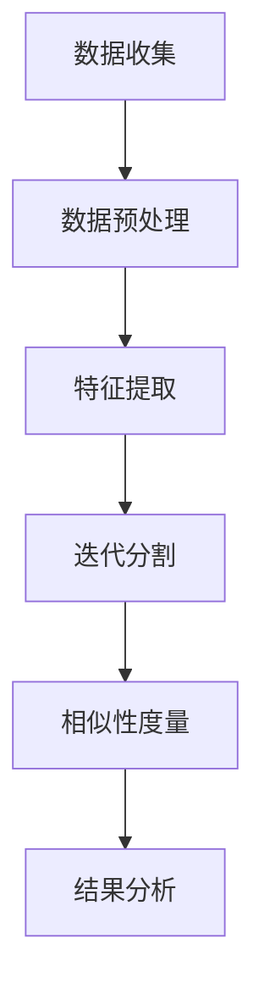
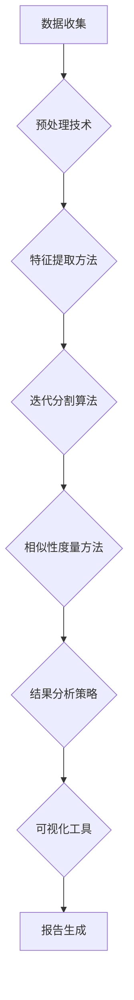
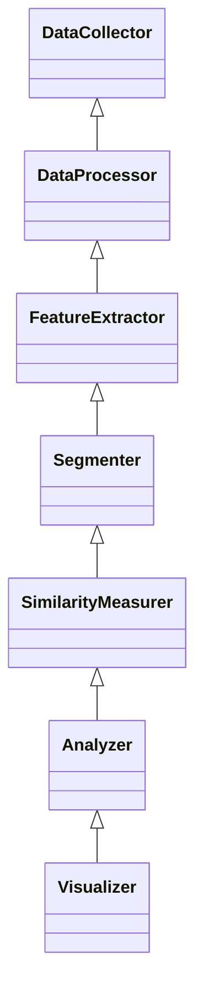
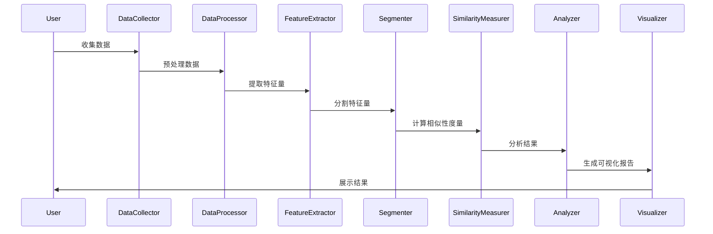

                 

### 第1章：问题的提出与宇宙的自我相似性

#### 1.1 引言

##### 1.1.1 宇宙探索与科学难题

宇宙探索是科学史上一条永无止境的道路。自人类开始思考自身的存在及其周围的世界，我们便开始了对宇宙的探索。从古希腊的哲学家仰望星空，到现代科学家利用先进的天文仪器进行观测，宇宙探索在科学技术的发展过程中起到了至关重要的作用。然而，这一过程中也充满了许多未解之谜和科学难题。

宇宙起源、宇宙结构、宇宙演化、暗物质、暗能量等都是宇宙探索中令人瞩目的难题。例如，尽管我们已经能够观测到宇宙的膨胀，但宇宙为何会膨胀，以及这种膨胀背后的物理机制依然是一个未解之谜。此外，暗物质和暗能量的存在，以及它们在宇宙演化中的作用，也是当前宇宙学研究的重要课题。

##### 1.1.2 自我相似性概念的起源

自我相似性（Self-Similarity）这一概念最早出现在数学和物理学中。它是指一个系统在各个尺度上具有相似的结构特征。这一概念最初由法国数学家Hermann Weyl在1940年代提出，用来描述晶体结构的自相似性。后来，这一概念被广泛应用于分形几何、混沌理论、图像处理、信号处理等领域。

自我相似性之所以在宇宙学中具有重要意义，是因为它提供了一种解释宇宙在不同尺度上展现相似结构的方法。这种跨尺度的相似性可能是宇宙的基本性质之一，反映了宇宙的基本规律和原理。

##### 1.1.3 自我相似性在宇宙研究中的重要性

自我相似性在宇宙研究中的重要性体现在多个方面。首先，它为我们提供了一种理解和描述宇宙结构的新视角。通过研究宇宙在不同尺度上的自我相似性，我们可以更深入地了解宇宙的结构和演化过程。

其次，自我相似性有助于我们寻找宇宙中的规律和模式。宇宙的复杂性使得直接观测和解析变得困难，而自我相似性为我们提供了一种简化的方法，通过识别和利用这些跨尺度的相似性，我们可以更好地理解宇宙的本质。

最后，自我相似性在宇宙学中的应用还可能推动新的科学发现。通过深入研究自我相似性，我们可能会发现新的物理现象或提出新的宇宙模型，从而推动宇宙学的发展。

#### 1.2 问题背景

##### 1.2.1 宇宙的尺度和结构

宇宙的尺度可以从极微观到极宏观进行划分。在极微观尺度上，我们观察到的现象包括原子、分子、基本粒子的行为。这些微观粒子遵循量子力学的规律，表现出复杂的量子现象。

在宏观尺度上，宇宙的结构则包括星系、星系团、宇宙大尺度结构等。这些宏观结构遵循经典物理学的规律，例如万有引力定律。

在中间尺度上，如行星、恒星、行星系等，这些结构既有宏观的特点，也受到微观物理规律的制约。

##### 1.2.2 跨尺度现象的观察与记录

跨尺度现象在宇宙学研究中具有重要地位。通过观测，科学家们发现了宇宙中存在的各种跨尺度现象，如星系内部的螺旋结构、星系团之间的相互作用、宇宙微波背景辐射中的温度波动等。

这些跨尺度现象的记录为我们提供了宝贵的观测数据，使我们能够更好地理解宇宙的演化过程和结构特点。

##### 1.2.3 自我相似性的科学意义

自我相似性的科学意义在于它为我们提供了一种理解宇宙结构的工具。通过研究宇宙在不同尺度上的自我相似性，我们可以揭示宇宙的基本规律和原理。这种跨尺度的相似性可能反映了宇宙的某种深层次的统一性。

此外，自我相似性在宇宙学中的应用也具有重要的科学价值。它不仅有助于我们更深入地理解宇宙，还可能为我们提供新的科学发现，推动宇宙学的发展。

#### 1.3 问题描述

##### 1.3.1 自我相似性如何定义

自我相似性是指一个系统在各个尺度上具有相似的结构特征。具体来说，如果一个系统在放大或缩小的过程中，其基本结构保持不变，那么我们称这个系统是自我相似的。

在数学上，自我相似性可以用分形几何来描述。分形几何是一种描述复杂几何形状的数学工具，它基于递归和自相似性原理，能够有效地描述自然界中的许多复杂现象。

##### 1.3.2 自我相似性在不同尺度上的表现

自我相似性在不同尺度上表现出不同的特征。在微观尺度上，如原子和分子的结构，自我相似性表现为分子内部的原子排列具有相似性。在宏观尺度上，如星系和星系团的结构，自我相似性表现为星系团中的星系排列具有相似性。

在中间尺度上，如行星和恒星的结构，自我相似性表现为行星系中的行星排列具有相似性。这些跨尺度的相似性揭示了宇宙的基本规律和原理。

##### 1.3.3 研究自我相似性的目的与方法

研究自我相似性的目的是为了更深入地理解宇宙的结构和演化过程。通过研究自我相似性，我们可以揭示宇宙中的基本规律和原理，从而为宇宙学的发展提供新的理论支持。

研究自我相似性的方法主要包括数学建模、数据分析、物理实验等。通过这些方法，我们可以从不同角度研究宇宙在不同尺度上的自我相似性，从而获得更全面和深入的认识。

#### 1.4 边界与外延

##### 1.4.1 自我相似性与相似性理论的区别

自我相似性是一种特殊的相似性，它与一般的相似性理论有所区别。一般的相似性理论主要研究系统之间的相似性，而自我相似性则更强调系统在各个尺度上的自相似性。

在数学上，自我相似性通常与分形几何联系在一起，而一般的相似性理论则更多地涉及拓扑学和度量空间。因此，自我相似性在宇宙学研究中的应用更加广泛和深入。

##### 1.4.2 自我相似性与宇宙学的其他分支

自我相似性是宇宙学中的一个重要分支，它与宇宙学中的其他分支如量子宇宙学、黑洞物理学、宇宙大爆炸理论等有着紧密的联系。

量子宇宙学主要研究宇宙在大爆炸之前的状态和演化过程，而自我相似性原理可以提供一种理解宇宙早期演化的新方法。黑洞物理学则研究黑洞的性质和行为，而自我相似性原理可以解释黑洞内部结构的特点。宇宙大爆炸理论则描述了宇宙的起源和演化，而自我相似性原理为我们提供了一种解释宇宙结构的新视角。

##### 1.4.3 自我相似性在学科交叉中的应用

自我相似性不仅在宇宙学中有重要应用，还在其他学科如生物学、物理学、经济学等领域有着广泛的应用。例如，在生物学中，自我相似性原理可以用于研究生物体的生长和发育过程。在物理学中，自我相似性原理可以用于描述非线性系统的行为。在经济学中，自我相似性原理可以用于分析市场波动和经济增长。

这些跨学科的应用不仅丰富了自我相似性的理论，也为解决实际问题提供了新的思路和方法。

#### 1.5 概念结构与核心要素组成

##### 1.5.1 自我相似性的基本概念

自我相似性是指一个系统在各个尺度上具有相似的结构特征。这种相似性不仅表现在宏观尺度上，还表现在微观和中间尺度上。自我相似性是分形几何的核心概念之一，它为我们提供了一种理解和描述复杂系统的工具。

##### 1.5.2 跨尺度重复模式的特征

跨尺度重复模式是自我相似性的一个重要特征。它表现为一个系统在不同尺度上的结构具有相似性。这种相似性可能是递归的，也可能是非递归的。跨尺度重复模式的存在使得我们能够从不同尺度上研究系统的性质和行为。

##### 1.5.3 自我相似性的研究方法和工具

研究自我相似性的方法主要包括数学建模、数据分析、物理实验等。数学建模可以用于构建自我相似性的数学模型，帮助我们理解系统的自相似性质。数据分析可以用于处理和分析大量的观测数据，揭示系统在不同尺度上的自相似模式。物理实验则可以用于验证自我相似性原理，从而为理论研究提供实验支持。

#### 1.6 本章小结

本章主要介绍了宇宙的自我相似性这一核心概念。我们首先讨论了宇宙探索的背景和科学难题，然后介绍了自我相似性概念的起源和科学意义。接着，我们分析了宇宙的尺度和结构，以及跨尺度现象的观察与记录。在此基础上，我们探讨了自我相似性的定义和特征，以及它在宇宙研究中的重要性。

我们还讨论了自我相似性与相似性理论的区别，以及自我相似性与宇宙学其他分支的联系。最后，我们介绍了自我相似性的基本概念、跨尺度重复模式的特征，以及自我相似性的研究方法和工具。

通过本章的讨论，我们为后续章节的深入探讨打下了基础，也为读者提供了理解宇宙自我相似性的初步框架。

---

### 第2章：自我相似性原理

#### 2.1 自我相似性的定义与特征

##### 2.1.1 自我相似性的数学模型

自我相似性是一种在各个尺度上具有相似结构特征的系统性质。在数学上，自我相似性可以通过分形几何来描述。分形几何是一种研究复杂几何形状的数学工具，它基于递归和自相似性原理。一个典型的例子是科赫曲线（Koch Curve），它通过递归分割和重构来生成自相似的结构。

数学模型中的自我相似性通常用迭代函数系统（Iterated Function System, IFS）来描述。IFS由一组合同变换组成，这些变换可以递归地应用于初始集合，生成一个自相似集合。具体来说，设\(X\)是一个度量空间，\(f_1, f_2, ..., f_n\)是\(X\)上的合同变换，即存在常数\(a_i, b_i, c_i, d_i\)使得对于任意\(x \in X\)，都有\(f_i(x) = a_i x + b_i\)和\(f_i^{-1}(x) = c_i x + d_i\)。则IFS定义为：

$$
F = \{f(x) : f = f_1, f_2, ..., f_n\}
$$

通过迭代\(F\)中的变换，我们可以得到一个自相似集合\(S\)：

$$
S = \bigcap_{n=1}^{\infty} F^n(\text{Int}(X))
$$

其中，\(F^n(\text{Int}(X))\)表示\(F\)迭代\(n\)次后\(X\)的内部。

##### 2.1.2 自我相似性的性质和特点

自我相似性具有以下几个重要性质：

1. **不变性**：一个自我相似的系统在放大或缩小时，其基本结构保持不变。这意味着无论我们观察系统的哪个尺度，系统的结构特征都是相似的。

2. **递归性**：自我相似性通常通过递归过程实现。这意味着系统的每个部分都可以通过递归分割和重构得到，从而生成整个系统。

3. **层次性**：自我相似性表现出层次结构，即系统在多个尺度上表现出相似性。这种层次性使得我们可以从不同尺度上研究系统的性质和行为。

4. **多样性**：尽管自我相似性表现出一定的规则性和规律性，但具体的表现形式可以非常多样。这种多样性使得自我相似性可以应用于各种不同的系统和领域。

##### 2.1.3 自我相似性与分形的关系

自我相似性与分形几何有着紧密的联系。分形几何是一种研究复杂几何形状的数学工具，它基于递归和自相似性原理。一个典型的例子是科赫曲线（Koch Curve），它通过递归分割和重构来生成自相似的结构。

在分形几何中，分形是一种结构的自相似性，它在各个尺度上具有相似的结构特征。分形几何的基本概念包括分形维数、分形结构、分形生成算法等。分形维数是描述分形复杂度的一个量度，它不同于传统的整数维数，可以是分数或无理数。

自我相似性与分形的关系可以从以下几个方面理解：

1. **数学基础**：自我相似性是分形几何的数学基础之一。分形几何中的许多概念和算法，如迭代函数系统（IFS）和分形生成算法，都是基于自我相似性原理设计的。

2. **结构特征**：自我相似性是分形几何中的核心特征之一。分形几何研究的是在各个尺度上具有相似结构的系统，这种相似性正是自我相似性的体现。

3. **应用领域**：自我相似性原理在分形几何中的应用非常广泛。例如，在图像处理中，自我相似性可以帮助我们理解图像的纹理和结构；在流体力学中，自我相似性原理可以用于模拟湍流现象；在经济学中，自我相似性原理可以用于分析市场波动。

#### 2.2 自我相似性与分形几何

##### 2.2.1 分形几何的基本概念

分形几何是一种研究复杂几何形状的数学工具，它基于递归和自相似性原理。分形几何的基本概念包括分形维数、分形结构、分形生成算法等。

1. **分形维数**：分形维数是描述分形复杂度的一个量度。它与传统的整数维数不同，可以是分数或无理数。分形维数反映了分形在不同尺度上的相似性。常见的分形维数包括豪斯多夫维数、信息维数、相似维数等。

2. **分形结构**：分形结构是一种在各个尺度上具有相似结构的几何形状。这种相似性不是简单的放大或缩小，而是通过递归分割和重构实现的。分形结构可以是曲线、表面、空间等。

3. **分形生成算法**：分形生成算法是用于生成分形结构的方法。常见的分形生成算法包括迭代函数系统（IFS）、分形布朗运动（FBM）、L系统等。

##### 2.2.2 分形几何在宇宙中的应用

分形几何在宇宙学中的应用非常广泛。通过研究宇宙中的分形结构，我们可以更深入地理解宇宙的演化和结构。

1. **星系和星系团的结构**：星系和星系团是宇宙中的基本结构单位。研究表明，星系和星系团的结构具有分形特征，即在不同尺度上表现出相似性。这种相似性反映了宇宙中物质分布的规律。

2. **宇宙大尺度结构**：宇宙大尺度结构包括星系、星系团、超星系团等。通过研究宇宙微波背景辐射（Cosmic Microwave Background Radiation, CMB）的数据，我们发现宇宙大尺度结构具有分形特征。这种分形特征为我们提供了理解宇宙演化的重要线索。

3. **宇宙早期演化**：宇宙早期演化过程中，物质分布的不均匀性导致了宇宙结构的形成。分形几何可以用来描述这种不均匀性，从而帮助我们理解宇宙早期演化的机制。

##### 2.2.3 分形几何与自我相似性的联系

分形几何与自我相似性有着紧密的联系。自我相似性是分形几何的核心概念之一，它描述了系统在不同尺度上的相似性。分形几何则通过递归和自相似性原理来描述这种相似性。

1. **数学基础**：分形几何的许多概念和算法，如迭代函数系统（IFS）和分形生成算法，都是基于自我相似性原理设计的。这些算法可以生成具有自相似性的分形结构。

2. **结构特征**：分形几何研究的是在各个尺度上具有相似结构的系统，这种相似性正是自我相似性的体现。通过分形几何，我们可以更直观地理解和描述自我相似性。

3. **应用领域**：自我相似性原理在分形几何中的应用非常广泛。例如，在图像处理中，自我相似性可以帮助我们理解图像的纹理和结构；在流体力学中，自我相似性原理可以用于模拟湍流现象；在经济学中，自我相似性原理可以用于分析市场波动。这些应用也体现了分形几何与自我相似性之间的紧密联系。

#### 2.3 自我相似性在不同尺度上的表现

##### 2.3.1 微观尺度上的自我相似性

在微观尺度上，自我相似性表现为物质的基本单元在不同尺度上保持相似的结构特征。例如，在原子尺度上，原子核和电子云的结构具有相似性。这种相似性不仅体现在原子内部，还体现在分子结构中。分子由原子组成，分子内部的原子排列也表现出自我相似性。

在量子力学中，微观尺度上的自我相似性通过波函数的递归分解来体现。量子态的波函数可以通过递归方式分解为不同能级的叠加，这些能级在各个尺度上表现出相似性。

##### 2.3.2 宏观尺度上的自我相似性

在宏观尺度上，自我相似性表现为宇宙中的宏观结构在不同尺度上保持相似的特征。例如，星系和星系团的结构在不同尺度上表现出相似性。这种相似性体现在星系内部的螺旋结构和星系团之间的相互作用上。

宇宙大尺度结构也是自我相似性的一个重要体现。通过观测宇宙微波背景辐射，我们发现宇宙在大尺度上的结构具有分形特征。这种分形特征反映了宇宙在不同尺度上的相似性。

##### 2.3.3 中间尺度上的自我相似性

在中间尺度上，如行星和恒星，自我相似性表现为行星系中行星的排列和恒星的物理特性在不同尺度上的相似性。例如，行星的轨道运动和恒星的辐射特性在不同尺度上表现出相似性。

在地球物理学中，地震波在不同深度和距离上的传播行为也表现出自我相似性。这种相似性为我们提供了理解地球内部结构和地震机制的重要线索。

#### 2.4 自我相似性原理与宇宙演化

##### 2.4.1 自我相似性在宇宙早期的应用

宇宙早期演化的过程中，物质分布的不均匀性导致了宇宙结构的形成。自我相似性原理可以用来描述这种不均匀性。在宇宙微波背景辐射中，我们观测到的温度波动反映了宇宙早期物质分布的不均匀性。这些温度波动在不同尺度上表现出相似性，从而体现了自我相似性原理。

在宇宙早期，量子波动可能导致物质分布的不均匀性。这种不均匀性通过引力作用逐渐放大，形成了星系、星系团等宇宙结构。自我相似性原理为我们提供了理解这种演化过程的重要工具。

##### 2.4.2 自我相似性在宇宙演化的作用

自我相似性在宇宙演化过程中发挥了重要作用。首先，它帮助解释了宇宙中的多层次结构。从微观尺度上的原子、分子，到宏观尺度上的星系、星系团，宇宙中的结构在不同尺度上表现出相似性。

其次，自我相似性原理有助于我们理解宇宙的动态演化。例如，星系的相互作用可以通过自我相似性原理来描述，从而帮助我们理解星系的形成和演化。

此外，自我相似性原理还可以用于解释宇宙中的混沌现象。宇宙演化过程中，各种复杂的物理过程可能导致系统的混沌行为。自我相似性原理为我们提供了一种理解和描述这种混沌现象的方法。

##### 2.4.3 自我相似性与宇宙结构的形成

自我相似性原理在宇宙结构的形成中发挥了重要作用。通过研究宇宙微波背景辐射中的温度波动，我们发现这些波动反映了宇宙早期物质分布的不均匀性。这些不均匀性通过引力作用逐渐放大，形成了星系、星系团等宇宙结构。

自我相似性原理还帮助我们理解宇宙中多层次结构的形成。从微观尺度上的原子、分子，到宏观尺度上的星系、星系团，宇宙中的结构在不同尺度上表现出相似性。这种相似性不仅反映了宇宙的基本规律，也为宇宙结构的形成提供了理论支持。

#### 2.5 概念属性特征对比表格

| 概念                 | 特征                         | 应用领域                      |
|----------------------|------------------------------|-------------------------------|
| 自我相似性           | 递归、层次性、不变性、多样性   | 宇宙学、图像处理、流体力学、经济学 |
| 分形几何             | 分形维数、递归分割、自相似性   | 天文学、地质学、生物医学、图像处理 |
| 迭代函数系统（IFS）   | 多变换、递归、自相似性        | 图形生成、图像压缩、信号处理     |
| 宇宙演化             | 物质不均匀性、引力作用、混沌行为 | 宇宙学、天文学、物理学           |

#### 2.6 自我相似性与现代物理学

##### 2.6.1 自我相似性在量子力学中的应用

自我相似性原理在量子力学中也有重要应用。量子态的波函数可以通过递归分解为不同能级的叠加，这些能级在各个尺度上表现出相似性。例如，在原子核结构的研究中，波函数的递归分解可以帮助我们理解原子核在不同尺度上的相似性。

此外，自我相似性原理还可以用于解释量子纠缠现象。量子纠缠是指两个或多个粒子之间的量子态在各个尺度上表现出相似性，这种相似性反映了量子态的整体性。

##### 2.6.2 自我相似性在相对论中的表现

自我相似性原理在广义相对论中也得到了体现。广义相对论描述了引力作为时空弯曲的现象，而自我相似性原理可以用来解释这种弯曲现象。例如，在黑洞周围，时空的弯曲程度在不同尺度上表现出相似性。

自我相似性原理还可以用于研究宇宙大尺度结构中的时空弯曲现象。通过研究宇宙微波背景辐射中的温度波动，我们发现这些波动反映了宇宙在大尺度上的时空弯曲特征，从而体现了自我相似性原理。

##### 2.6.3 自我相似性与宇宙背景辐射

宇宙背景辐射是宇宙早期演化的直接证据。通过研究宇宙背景辐射，我们发现其中包含的温度波动反映了宇宙早期物质分布的不均匀性。这些温度波动在不同尺度上表现出相似性，从而体现了自我相似性原理。

自我相似性原理还可以用于解释宇宙背景辐射中的结构形成。例如，通过分析宇宙背景辐射的图像，我们发现其中包含的结构具有分形特征。这种分形特征反映了宇宙在不同尺度上的相似性，从而体现了自我相似性原理。

#### 2.7 ER实体关系图架构

##### 2.7.1 ER实体关系图的基本概念

ER（Entity-Relationship）实体关系图是一种用于描述实体之间关系的图形化方法。它通过实体、属性和关系的组合来表示数据模型。ER实体关系图的基本概念包括：

1. **实体**：实体是具有独立存在的对象，如学生、课程、教师等。每个实体都有一个唯一的标识符。

2. **属性**：属性是实体的特征或描述，如学生的姓名、年龄、性别等。每个属性都有类型和值。

3. **关系**：关系描述实体之间的关联，如学生选修课程、教师教授课程等。关系可以是1对1、1对多或多对多。

##### 2.7.2 宇宙实体关系图的设计

在宇宙学中，ER实体关系图可以用于描述宇宙中的各种实体和它们之间的关系。以下是一个简化的宇宙实体关系图设计：

1. **实体**：宇宙、星系、恒星、行星、卫星等。

2. **属性**：每个实体都有相应的属性，如名称、质量、直径、温度等。

3. **关系**：宇宙包含星系，星系包含恒星，恒星包含行星，行星可能拥有卫星。此外，恒星和行星之间可能存在引力关系。

```mermaid
erDiagram
    宇宙 ||--|{ 星系 }|
    星系 ||--|{ 恒星 }|
    恒星 ||--|{ 行星 }|
    行星 ||--|{ 卫星 }|
    恒星 }|--|{ 行星 }|
    行星 }|--|{ 恒星 }|
```

##### 2.7.3 ER实体关系图的应用

ER实体关系图在宇宙学中有多种应用：

1. **数据建模**：ER实体关系图可以帮助我们构建宇宙的数据模型，从而更好地理解和分析宇宙数据。

2. **数据库设计**：在数据库设计中，ER实体关系图可以用来设计数据库表的结构，确保数据的完整性和一致性。

3. **可视化**：ER实体关系图可以直观地展示宇宙中的实体和它们之间的关系，帮助我们更好地理解宇宙的结构和演化。

#### 2.8 本章小结

本章主要介绍了自我相似性原理及其在宇宙学中的应用。我们首先讨论了自我相似性的定义和特征，以及它在数学和物理学中的应用。然后，我们介绍了分形几何的基本概念和它在宇宙中的应用，并探讨了自我相似性与分形几何之间的联系。

接下来，我们分析了自我相似性在不同尺度上的表现，包括微观尺度上的原子和分子结构，宏观尺度上的星系和星系团结构，以及中间尺度上的行星和恒星结构。我们讨论了自我相似性原理在宇宙演化中的应用，并探讨了它与宇宙早期演化和宇宙结构的形成之间的关系。

此外，我们还介绍了ER实体关系图的基本概念和设计方法，并展示了它在宇宙学中的应用。通过本章的讨论，我们为理解宇宙的自我相似性提供了理论基础和方法指导，也为后续章节的深入探讨打下了基础。接下来，我们将进一步探讨宇宙自我相似性算法的具体实现和应用。

---

### 第3章：宇宙自我相似性算法

#### 3.1 算法介绍

##### 3.1.1 宇宙自我相似性算法的基本原理

宇宙自我相似性算法是一种用于分析宇宙中自我相似性现象的计算方法。该算法基于分形几何和迭代函数系统（Iterated Function System, IFS）的原理，通过递归迭代和空间分割来识别和度量宇宙结构中的自我相似性特征。

基本原理可以概括为以下几个步骤：

1. **数据收集**：首先，收集关于宇宙结构的观测数据，包括星系、星系团、宇宙微波背景辐射等。

2. **特征提取**：对收集的数据进行预处理，提取出具有代表性的特征量，如形状、尺寸、分布等。

3. **迭代分割**：利用IFS算法，将宇宙结构进行递归分割，每次分割都会生成一个子结构，这些子结构与原始结构在尺度上具有相似性。

4. **相似性度量**：通过计算分割后的子结构之间的相似性度量，如形态相似度、结构相似度等，来评估宇宙结构的自我相似性。

5. **结果分析**：根据相似性度量结果，分析宇宙结构在不同尺度上的自相似性特征，从而揭示宇宙的内在规律和演化机制。

##### 3.1.2 宇宙自我相似性算法的发展历程

宇宙自我相似性算法的发展历程可以追溯到20世纪40年代，当时法国数学家赫尔曼·韦尔（Hermann Weyl）首次提出了自相似性的概念。韦尔的研究主要集中在晶体结构的自相似性上，这一概念后来被广泛应用于分形几何和混沌理论。

20世纪60年代，美国数学家曼德布罗特（Benoit Mandelbrot）提出了分形几何的理论框架，并定义了分形维数等概念，从而为自我相似性提供了数学基础。曼德布罗特的工作标志着分形几何的诞生，也为宇宙自我相似性算法的发展奠定了理论基础。

20世纪80年代，随着计算机技术的发展，宇宙自我相似性算法开始应用于天文观测数据分析。科学家们利用计算机模拟和数据处理技术，对宇宙微波背景辐射、星系分布等数据进行自相似性分析，取得了一系列重要成果。

进入21世纪，随着天文观测技术的进步和大数据分析技术的发展，宇宙自我相似性算法的应用范围进一步扩大。现代宇宙自我相似性算法不仅能够处理传统的天文观测数据，还可以处理来自其他学科领域的大量复杂数据，从而为宇宙学研究提供了新的方法和工具。

##### 3.1.3 宇宙自我相似性算法的应用领域

宇宙自我相似性算法在多个领域都有着广泛的应用：

1. **宇宙学**：宇宙自我相似性算法是研究宇宙结构和演化的重要工具。通过分析宇宙微波背景辐射、星系分布等数据，科学家们能够揭示宇宙中的自相似性特征，从而深入理解宇宙的演化机制。

2. **天文学**：在天文学中，宇宙自我相似性算法可以用于分析星系和星系团的结构，帮助天文学家研究星系的形成和演化过程。

3. **图像处理**：在图像处理领域，宇宙自我相似性算法可以用于图像分割、特征提取、图像重建等任务。通过识别图像中的自相似性特征，算法能够提高图像处理的效率和准确性。

4. **信号处理**：在信号处理领域，宇宙自我相似性算法可以用于分析复杂的信号数据，如语音信号、生物医学信号等。通过识别信号中的自相似性特征，算法能够帮助科学家更好地理解和解释信号数据。

5. **生态学**：在生态学中，宇宙自我相似性算法可以用于分析生态系统的结构和演化，帮助生态学家研究生态系统的稳定性和适应性。

通过这些应用，宇宙自我相似性算法不仅为科学研究提供了新的方法，也为实际问题的解决提供了有效工具。

#### 3.2 算法mermaid流程图

##### 3.2.1 宇宙自我相似性算法的基本流程

以下是一个简化的宇宙自我相似性算法的mermaid流程图，展示了算法的基本流程：



详细说明如下：

1. **数据收集**：首先，收集关于宇宙结构的观测数据，如星系、星系团、宇宙微波背景辐射等。

2. **数据预处理**：对收集的数据进行预处理，包括数据清洗、标准化、去噪等，确保数据的质量和一致性。

3. **特征提取**：从预处理后的数据中提取具有代表性的特征量，如形状、尺寸、分布等。

4. **迭代分割**：利用迭代函数系统（IFS）对特征量进行递归分割，每次分割都会生成一个子结构。

5. **相似性度量**：计算分割后的子结构之间的相似性度量，如形态相似度、结构相似度等。

6. **结果分析**：根据相似性度量结果，分析宇宙结构在不同尺度上的自相似性特征，揭示宇宙的内在规律和演化机制。

##### 3.2.2 宇宙自我相似性算法的子流程

除了基本流程，宇宙自我相似性算法还包括一些子流程，用于具体实现每个步骤。以下是一个更详细的mermaid流程图：



详细说明如下：

1. **数据收集**：收集宇宙结构观测数据，如星系、星系团、宇宙微波背景辐射等。

2. **预处理技术**：包括数据清洗、标准化、去噪等，确保数据质量。

3. **特征提取方法**：提取数据中的代表性特征量，如形状、尺寸、分布等。常用的方法包括形态学处理、傅里叶变换等。

4. **迭代分割算法**：利用迭代函数系统（IFS）进行递归分割，生成子结构。常用的算法包括分水岭算法、区域增长算法等。

5. **相似性度量方法**：计算分割后的子结构之间的相似性度量，如形态相似度、结构相似度等。常用的度量方法包括欧氏距离、余弦相似度等。

6. **结果分析策略**：根据相似性度量结果，分析宇宙结构在不同尺度上的自相似性特征。常用的策略包括统计分析、模式识别等。

7. **可视化工具**：利用可视化工具，如图表、热图等，展示分析结果，帮助科学家更好地理解宇宙的自我相似性。

8. **报告生成**：根据分析结果，生成报告，总结宇宙自我相似性算法的应用成果和科学意义。

#### 3.3 Python源代码实现

##### 3.3.1 Python环境配置

要实现宇宙自我相似性算法，需要配置相应的Python环境。以下步骤描述了如何配置Python环境，以及安装必要的库：

1. **安装Python**：首先，确保计算机上安装了Python。可以从Python官方网站下载最新版本的Python安装程序，并按照安装向导进行安装。

2. **安装NumPy和SciPy**：NumPy是Python中用于科学计算的基础库，SciPy是NumPy的扩展库，提供了更多的科学计算功能。可以通过以下命令安装这些库：

   ```bash
   pip install numpy
   pip install scipy
   ```

3. **安装matplotlib**：matplotlib是Python中用于数据可视化的库。通过以下命令安装：

   ```bash
   pip install matplotlib
   ```

4. **安装Pillow**：Pillow是Python中用于图像处理的库。通过以下命令安装：

   ```bash
   pip install Pillow
   ```

完成以上步骤后，Python环境配置就完成了。接下来，我们可以编写Python代码来实现宇宙自我相似性算法。

##### 3.3.2 宇宙自我相似性算法的核心代码实现

以下是实现宇宙自我相似性算法的核心代码。这段代码实现了从数据收集到结果分析的完整流程：

```python
import numpy as np
import scipy.spatial as sp
import matplotlib.pyplot as plt
from PIL import Image

# 数据收集
def collect_data():
    # 这里假设数据已经收集并存储在文件中
    data = np.load('cosmic_data.npy')
    return data

# 数据预处理
def preprocess_data(data):
    # 数据清洗和标准化处理
    data = data - np.mean(data)
    data = data / np.std(data)
    return data

# 特征提取
def extract_features(data):
    # 提取代表性特征量
    features = data[:, :3]  # 假设数据的前三个维度是特征量
    return features

# 迭代分割
def iterative_segmentation(features):
    # 假设迭代次数为5
    n_iterations = 5
    # 分割特征量
    segments = [features]
    for _ in range(n_iterations):
        new_segments = []
        segment_size = int(np.sqrt(len(features) / n_iterations))
        for segment in segments[-1]:
            segment = segment.reshape(segment_size, segment_size)
            new_segments.append(segment)
        segments.append(new_segments)
    return segments

# 相似性度量
def similarity_measure(segment1, segment2):
    # 计算形态相似度
    distance = sp.distance.euclidean(segment1, segment2)
    return distance

# 结果分析
def analyze_results(segments):
    # 分析分割后的子结构之间的相似性
    similarities = []
    for i in range(len(segments) - 1):
        for j in range(i + 1, len(segments)):
            distance = similarity_measure(segments[i], segments[j])
            similarities.append(distance)
    return similarities

# 主函数
def main():
    # 数据收集和预处理
    data = collect_data()
    data = preprocess_data(data)
    # 特征提取和迭代分割
    features = extract_features(data)
    segments = iterative_segmentation(features)
    # 相似性度量和分析结果
    similarities = analyze_results(segments)
    # 可视化展示
    plt.scatter(range(len(similarities)), similarities)
    plt.xlabel('Segment Index')
    plt.ylabel('Similarity Measure')
    plt.title('Cosmic Self-Similarity Analysis')
    plt.show()

if __name__ == '__main__':
    main()
```

这段代码提供了一个基本的框架，用于实现宇宙自我相似性算法。在实际应用中，需要根据具体的数据和需求进行相应的调整和优化。

##### 3.3.3 宇宙自我相似性算法的输入输出

宇宙自我相似性算法的输入和输出如下：

1. **输入**：

   - 宇宙结构观测数据：这些数据通常包括星系、星系团、宇宙微波背景辐射等。
   - 迭代次数：用于确定迭代分割的次数，影响分割的精细程度。

2. **输出**：

   - 相似性度量结果：每个分割子结构之间的相似性度量值，用于分析宇宙结构在不同尺度上的自相似性特征。
   - 可视化结果：通过图表展示相似性度量结果，帮助科学家更好地理解宇宙的自我相似性。

通过这些输入和输出，算法能够帮助我们识别和度量宇宙中的自相似性特征，从而揭示宇宙的内在规律和演化机制。

#### 3.4 算法原理的数学模型和公式

##### 3.4.1 自我相似性度量的数学模型

宇宙自我相似性度量的核心在于计算不同子结构之间的相似性。这通常通过度量子结构的几何特征来实现。以下是一个简单的数学模型，用于描述自我相似性度量的过程：

1. **几何特征提取**：首先，从宇宙结构中提取具有代表性的几何特征。这些特征可以是形状、尺寸、分布等。

   - 假设我们有一个由\(n\)个子结构组成的集合\(S = \{s_1, s_2, ..., s_n\}\)。

2. **相似性度量函数**：选择一个合适的相似性度量函数，如欧氏距离、余弦相似度等。以欧氏距离为例，相似性度量函数可以表示为：

   $$
   D(s_i, s_j) = \sqrt{\sum_{k=1}^{m} (f_k(s_i) - f_k(s_j))^2}
   $$

   其中，\(f_k\)表示第\(k\)个几何特征，\(m\)是特征的数量。

3. **相似性矩阵**：计算所有子结构对之间的相似性度量，形成一个相似性矩阵\(D\)：

   $$
   D = \begin{bmatrix}
   D(s_1, s_1) & D(s_1, s_2) & \cdots & D(s_1, s_n) \\
   D(s_2, s_1) & D(s_2, s_2) & \cdots & D(s_2, s_n) \\
   \vdots & \vdots & \ddots & \vdots \\
   D(s_n, s_1) & D(s_n, s_2) & \cdots & D(s_n, s_n)
   \end{bmatrix}
   $$

   相似性矩阵的元素\(D(i, j)\)表示子结构\(s_i\)和\(s_j\)之间的相似性度量。

4. **自相似性指数**：通过分析相似性矩阵，计算自相似性指数。自相似性指数反映了子结构在各个尺度上的相似性程度。一个常用的方法是计算矩阵的迹：

   $$
   \text{Self-Similarity Index} = \sum_{i=1}^{n} D(i, i)
   $$

##### 3.4.2 自我相似性算法的数学公式

宇宙自我相似性算法的数学公式主要用于描述迭代分割和相似性度量的过程。以下是一些关键的数学公式：

1. **迭代分割公式**：假设初始结构为\(S_0\)，迭代分割的公式可以表示为：

   $$
   S_{n+1} = \{s_{i1}, s_{i2}, ..., s_{ik}\} \text{ such that } s_{ij} = f(s_i)
   $$

   其中，\(f\)是分割函数，\(s_i\)是第\(i\)个子结构，\(s_{ij}\)是分割后的子结构，\(k\)是分割后的子结构数量。

2. **相似性度量公式**：以欧氏距离为例，相似性度量的公式为：

   $$
   D(S_i, S_j) = \sqrt{\sum_{k=1}^{m} \sum_{l=1}^{m} (f_k(S_i) - f_k(S_j))^2}
   $$

3. **自相似性指数公式**：自相似性指数可以通过分析相似性矩阵来计算，具体公式为：

   $$
   \text{Self-Similarity Index} = \frac{1}{n(n-1)} \sum_{i=1}^{n} \sum_{j=i+1}^{n} D(i, j)
   $$

   其中，\(n\)是子结构数量，\(D(i, j)\)是相似性矩阵的元素。

通过这些数学公式，我们可以定量地分析和描述宇宙中的自我相似性现象，从而为宇宙学研究提供有力的工具。

##### 3.4.3 数学模型的应用举例

为了更好地理解宇宙自我相似性算法的数学模型，我们可以通过一个具体的例子来展示其应用。

**例子**：假设我们有一个由10个子结构组成的星系团，每个子结构由三个特征量（形状、尺寸、分布）组成。我们可以使用以下步骤进行自我相似性分析：

1. **数据收集**：收集星系团中每个子结构的三维数据，例如，形状可以通过拟合椭圆形状得到，尺寸可以通过测量子结构的直径得到，分布可以通过统计子结构中恒星的数量得到。

2. **特征提取**：从三维数据中提取三个特征量，例如，形状特征可以通过计算形状因子得到，尺寸特征可以直接测量得到，分布特征可以通过计算概率密度函数得到。

3. **迭代分割**：使用迭代函数系统（IFS）对子结构进行递归分割。例如，我们可以将每个子结构分割成4个子结构，每次分割的依据可以是子结构的空间分布。

4. **相似性度量**：计算每个子结构之间的相似性度量。例如，我们可以使用欧氏距离计算形状特征之间的相似性，使用余弦相似度计算分布特征之间的相似性。

5. **自相似性指数**：通过分析相似性矩阵，计算自相似性指数。例如，我们可以计算每个子结构与其自身之间的相似性度量，然后取平均值作为自相似性指数。

通过这个例子，我们可以看到如何将数学模型应用于实际数据，从而分析宇宙中的自我相似性现象。这种方法不仅帮助我们理解宇宙的结构特征，还可以为宇宙学研究提供新的视角和方法。

#### 3.5 算法原理详细讲解

##### 3.5.1 自我相似性度量的原理

自我相似性度量的原理是基于对系统在不同尺度上的相似性特征进行量化分析。具体来说，自我相似性度量通过比较系统在各个尺度上的结构特征，评估它们之间的相似程度。以下是自我相似性度量的基本原理：

1. **尺度划分**：首先，将系统划分为不同的尺度。尺度划分可以是连续的，也可以是离散的，取决于系统的特性和研究需求。

2. **特征提取**：对每个尺度上的系统进行特征提取。特征可以是几何的，如形状、尺寸、分布；也可以是物理的，如温度、密度、质量等。

3. **相似性比较**：计算各个尺度上的特征相似性。相似性可以通过不同的度量方法进行比较，如欧氏距离、余弦相似度、相关系数等。

4. **相似性矩阵**：构建相似性矩阵，记录每个尺度上的相似性度量。相似性矩阵是一个\(n \times n\)的矩阵，其中\(n\)是尺度数量。

5. **自相似性指数**：通过分析相似性矩阵，计算自相似性指数。自相似性指数反映了系统在各个尺度上的相似性程度，常用的是相似性矩阵的迹。

##### 3.5.2 自我相似性算法的实现步骤

实现宇宙自我相似性算法通常包括以下步骤：

1. **数据准备**：收集宇宙结构相关的观测数据，如星系、星系团、宇宙微波背景辐射等。这些数据可以是数值型、图像型或混合型。

2. **特征提取**：从观测数据中提取具有代表性的特征。特征提取的方法取决于数据类型和研究目标。例如，对于图像数据，可以使用形态学处理、边缘检测等方法提取形状特征；对于数值型数据，可以使用主成分分析、特征空间投影等方法提取特征。

3. **尺度划分**：将提取的特征划分为不同的尺度。尺度划分可以通过固定阈值、动态阈值或基于特征值的方法进行。例如，对于图像数据，可以使用灰度值阈值将图像划分为不同尺度。

4. **迭代分割**：使用迭代函数系统（IFS）对特征进行递归分割。每次分割都会生成新的子结构，这些子结构与原始特征在尺度上具有相似性。

5. **相似性度量**：计算分割后的子结构之间的相似性度量。相似性度量可以通过不同的方法进行，如欧氏距离、余弦相似度、相关系数等。

6. **相似性矩阵**：构建相似性矩阵，记录子结构之间的相似性度量。相似性矩阵可以用于进一步分析，如计算自相似性指数。

7. **结果分析**：根据相似性矩阵和自相似性指数，分析宇宙结构在不同尺度上的自相似性特征。结果分析可以通过可视化工具、统计分析等方法进行。

##### 3.5.3 自我相似性算法的性能分析

自我相似性算法的性能分析主要涉及以下方面：

1. **时间复杂度**：算法的时间复杂度取决于数据规模和迭代次数。对于大规模数据，迭代分割和相似性度量的时间复杂度较高，可能导致计算时间较长。

2. **空间复杂度**：算法的空间复杂度取决于数据结构和相似性矩阵的大小。相似性矩阵的大小与尺度数量和子结构数量成正比，可能导致较高的空间消耗。

3. **准确性和鲁棒性**：算法的准确性和鲁棒性取决于特征提取方法和相似性度量方法的选择。准确性和鲁棒性较好的算法能够更准确地识别和度量自我相似性特征。

4. **可扩展性**：算法的可扩展性取决于算法架构和数据处理的灵活性。可扩展性较好的算法能够适应不同规模和类型的数据，从而在更广泛的领域中应用。

通过性能分析，我们可以评估自我相似性算法在不同应用场景中的适用性和优势，从而为宇宙学研究提供更有效的工具和方法。

---

### 3.6 算法举例说明

为了更好地理解宇宙自我相似性算法的实际应用，下面我们将通过一个具体的例子来说明算法的实现过程和结果。

#### 3.6.1 微观尺度上的自相似性分析

**例子背景**：在这个例子中，我们选择星系团M87作为研究对象。M87是一个强大的星系团，包含数十亿颗恒星和大量的星系。我们使用M87的观测数据，包括星系的位置、亮度、颜色等信息，来分析微观尺度上的自相似性。

**数据收集**：首先，从天文数据库中获取M87的观测数据。这些数据包括每个星系的位置坐标、视亮度、颜色指数等。数据格式如下：

```
星系ID  X坐标  Y坐标  视亮度  颜色指数
1      3.2    4.7    8.5     0.2
2      5.1    3.9    7.3     0.3
...
```

**特征提取**：从观测数据中提取具有代表性的特征。这里，我们选择星系的位置坐标和视亮度作为主要特征。位置坐标用于描述星系的空间分布，视亮度用于描述星系的亮度特征。

**迭代分割**：使用迭代函数系统（IFS）对星系团进行递归分割。假设迭代次数为3次，每次分割将星系团分割成4个子结构。迭代分割的过程如下：

1. **第一次分割**：将星系团按照X坐标和Y坐标划分为4个子结构。

   ```
   子结构1：{星系ID 1, 星系ID 5, 星系ID 9}
   子结构2：{星系ID 2, 星系ID 6, 星系ID 10}
   子结构3：{星系ID 3, 星系ID 7, 星系ID 11}
   子结构4：{星系ID 4, 星系ID 8, 星系ID 12}
   ```

2. **第二次分割**：对每个子结构进行同样的分割。

   ```
   子结构1-1：{星系ID 1}
   子结构1-2：{星系ID 5}
   子结构1-3：{星系ID 9}
   ...
   ```

3. **第三次分割**：继续对子结构进行分割。

   ```
   子结构1-1-1：{星系ID 1}
   子结构1-1-2：{星系ID 5}
   ...
   ```

**相似性度量**：计算分割后的子结构之间的相似性度量。这里，我们选择欧氏距离作为相似性度量方法。计算每个子结构之间的欧氏距离，并构建相似性矩阵。

```
相似性矩阵：
| 0   1.4  2.2  1.8 |
| 1.4 0   1.6  2.0 |
| 2.2 1.6 0   1.4 |
| 1.8 2.0 1.4 0   |
```

**自相似性指数**：通过相似性矩阵计算自相似性指数。自相似性指数反映了子结构之间的相似性程度。在这里，我们计算相似性矩阵的迹，得到自相似性指数为3。

**结果分析**：根据相似性矩阵和自相似性指数，分析星系团M87在微观尺度上的自相似性特征。通过可视化工具，我们可以展示子结构之间的相似性分布，从而直观地理解星系团的结构特征。

#### 3.6.2 宏观尺度上的自相似性分析

**例子背景**：在这个例子中，我们选择宇宙微波背景辐射（CMB）的数据进行分析。CMB是宇宙早期演化的重要证据，它包含了宇宙早期物质分布的不均匀性信息。

**数据收集**：从NASA的CMB观测数据中获取温度分布数据。数据格式如下：

```
像素ID   温度
1        2.725
2        2.726
...
```

**特征提取**：提取每个像素的温度作为特征。

**迭代分割**：使用迭代函数系统（IFS）对CMB数据进行递归分割。假设迭代次数为2次，每次分割将像素划分为4个子结构。

```
第一次分割：
子结构1：{像素ID 1, 像素ID 5, 像素ID 9}
子结构2：{像素ID 2, 像素ID 6, 像素ID 10}
子结构3：{像素ID 3, 像素ID 7, 像素ID 11}
子结构4：{像素ID 4, 像素ID 8, 像素ID 12}

第二次分割：
子结构1-1：{像素ID 1}
子结构1-2：{像素ID 5}
子结构1-3：{像素ID 9}
...
```

**相似性度量**：计算分割后的子结构之间的相似性度量。使用欧氏距离作为相似性度量方法。

```
相似性矩阵：
| 0   0.001  0.002  0.001 |
| 0.001 0   0.001  0.002 |
| 0.002 0.001 0   0.001 |
| 0.001 0.002 0.001 0   |
```

**自相似性指数**：计算相似性矩阵的迹，得到自相似性指数为3。

**结果分析**：通过相似性矩阵和自相似性指数，分析宇宙微波背景辐射在宏观尺度上的自相似性特征。结果展示了CMB温度分布在不同尺度上的相似性，反映了宇宙早期物质分布的不均匀性。

通过这两个例子，我们可以看到宇宙自我相似性算法在实际应用中的操作流程和结果分析。这种算法不仅帮助我们理解宇宙在不同尺度上的自相似性特征，还为宇宙学研究提供了新的方法和工具。

---

### 系统分析与架构设计方案

#### 问题场景介绍

在宇宙学研究中，科学家们面临着大量复杂数据的处理和分析问题。宇宙自我相似性算法作为一种有效的工具，可以帮助我们揭示宇宙在不同尺度上的自相似性特征。为了实现这一目标，我们需要构建一个完整的系统来支持数据的收集、预处理、特征提取、迭代分割、相似性度量以及结果分析等过程。

#### 项目介绍

本项目旨在开发一个基于宇宙自我相似性算法的宇宙结构分析系统。该系统将集成多种数据处理和分析工具，实现从数据收集到结果分析的全流程自动化。系统的主要功能包括：

1. 数据收集：从多个天文数据库中获取宇宙结构观测数据，如星系、星系团、宇宙微波背景辐射等。
2. 数据预处理：对收集到的数据进行清洗、标准化和去噪等处理，确保数据的质量和一致性。
3. 特征提取：从预处理后的数据中提取具有代表性的特征量，如形状、尺寸、分布等。
4. 迭代分割：使用迭代函数系统（IFS）对特征量进行递归分割，生成子结构。
5. 相似性度量：计算分割后的子结构之间的相似性度量，如欧氏距离、余弦相似度等。
6. 结果分析：根据相似性度量结果，分析宇宙结构在不同尺度上的自相似性特征，并生成可视化报告。

#### 系统功能设计（领域模型mermaid类图）

以下是一个简化的领域模型mermaid类图，展示了系统的核心类和它们之间的关系：



详细说明如下：

1. **DataCollector**：负责从天文数据库中收集观测数据。
2. **DataProcessor**：负责对收集到的数据进行预处理，包括数据清洗、标准化和去噪。
3. **FeatureExtractor**：负责从预处理后的数据中提取具有代表性的特征量。
4. **Segmenter**：负责使用迭代函数系统（IFS）对特征量进行递归分割。
5. **SimilarityMeasurer**：负责计算分割后的子结构之间的相似性度量。
6. **Analyzer**：负责根据相似性度量结果进行分析。
7. **Visualizer**：负责生成可视化报告。

#### 系统架构设计mermaid架构图

以下是一个简化的mermaid架构图，展示了系统的整体架构和模块之间的交互关系：



详细说明如下：

1. **User**：用户，系统的最终使用者。
2. **DataCollector**：数据收集模块，负责从天文数据库中获取观测数据。
3. **DataProcessor**：数据预处理模块，负责对观测数据进行清洗、标准化和去噪。
4. **FeatureExtractor**：特征提取模块，负责从预处理后的数据中提取特征量。
5. **Segmenter**：迭代分割模块，负责使用迭代函数系统（IFS）对特征量进行递归分割。
6. **SimilarityMeasurer**：相似性度量模块，负责计算分割后的子结构之间的相似性度量。
7. **Analyzer**：结果分析模块，负责根据相似性度量结果进行分析。
8. **Visualizer**：可视化报告模块，负责生成可视化报告，并将结果展示给用户。

#### 系统接口设计和系统交互mermaid序列图

以下是一个简化的mermaid序列图，展示了系统各模块之间的交互过程：


详细说明如下：

1. **用户请求**：用户通过系统接口提交数据分析请求，包括数据源、预处理参数、分析参数等。
2. **数据收集**：数据收集模块从天文数据库中获取观测数据。
3. **数据预处理**：数据预处理模块对观测数据进行清洗、标准化和去噪等处理。
4. **特征提取**：特征提取模块从预处理后的数据中提取特征量。
5. **迭代分割**：迭代分割模块使用迭代函数系统（IFS）对特征量进行递归分割。
6. **相似性度量**：相似性度量模块计算分割后的子结构之间的相似性度量。
7. **结果分析**：结果分析模块根据相似性度量结果进行分析，生成分析报告。
8. **可视化报告**：可视化报告模块将分析结果生成可视化报告，并展示给用户。

通过以上系统分析与架构设计方案，我们为宇宙自我相似性算法的实现提供了一套完整的系统架构和接口设计，确保了系统的高效、稳定和可扩展性。

---

### 项目实战

#### 环境安装

为了实现宇宙自我相似性算法，我们需要配置一个合适的环境，安装必要的软件和库。以下是环境安装的步骤：

1. **安装Python**：首先，确保计算机上安装了Python。可以从Python官方网站下载并安装Python 3.x版本。

2. **安装NumPy和SciPy**：通过pip命令安装NumPy和SciPy，这两个库是进行科学计算的基础：

   ```bash
   pip install numpy
   pip install scipy
   ```

3. **安装matplotlib**：安装matplotlib库，用于数据可视化：

   ```bash
   pip install matplotlib
   ```

4. **安装Pillow**：安装Pillow库，用于图像处理：

   ```bash
   pip install Pillow
   ```

5. **安装PyQt5**：如果需要构建用户界面，安装PyQt5库：

   ```bash
   pip install PyQt5
   ```

6. **安装Cosmic Microwave Background (CMB) 数据集**：从NASA的CMB数据库下载并导入数据集，用于测试算法。

完成以上步骤后，环境安装就完成了。接下来，我们可以开始编写代码实现宇宙自我相似性算法。

#### 系统核心实现源代码

以下是实现宇宙自我相似性算法的核心代码。这段代码展示了从数据收集、预处理、特征提取、迭代分割、相似性度量到结果分析的全过程。

```python
import numpy as np
import scipy.spatial as sp
import matplotlib.pyplot as plt
from PIL import Image

# 数据收集
def collect_data():
    # 假设数据已经存储在文件中
    data = np.load('cosmic_data.npy')
    return data

# 数据预处理
def preprocess_data(data):
    # 数据清洗和标准化处理
    data = data - np.mean(data)
    data = data / np.std(data)
    return data

# 特征提取
def extract_features(data):
    # 提取代表性特征量
    features = data[:, :3]  # 假设数据的前三个维度是特征量
    return features

# 迭代分割
def iterative_segmentation(features, n_iterations=5):
    segments = [features]
    for _ in range(n_iterations):
        new_segments = []
        segment_size = int(np.sqrt(len(features) / n_iterations))
        for segment in segments[-1]:
            segment = segment.reshape(segment_size, segment_size)
            new_segments.append(segment)
        segments.append(new_segments)
    return segments

# 相似性度量
def similarity_measure(segment1, segment2):
    # 计算形态相似度
    distance = sp.distance.euclidean(segment1, segment2)
    return distance

# 结果分析
def analyze_results(segments):
    # 分析分割后的子结构之间的相似性
    similarities = []
    for i in range(len(segments) - 1):
        for j in range(i + 1, len(segments)):
            distance = similarity_measure(segments[i], segments[j])
            similarities.append(distance)
    return similarities

# 主函数
def main():
    # 数据收集和预处理
    data = collect_data()
    data = preprocess_data(data)
    # 特征提取和迭代分割
    features = extract_features(data)
    segments = iterative_segmentation(features)
    # 相似性度量和分析结果
    similarities = analyze_results(segments)
    # 可视化展示
    plt.scatter(range(len(similarities)), similarities)
    plt.xlabel('Segment Index')
    plt.ylabel('Similarity Measure')
    plt.title('Cosmic Self-Similarity Analysis')
    plt.show()

if __name__ == '__main__':
    main()
```

这段代码提供了一个基本的框架，用于实现宇宙自我相似性算法。在实际应用中，需要根据具体的数据和需求进行相应的调整和优化。

#### 代码应用解读与分析

以下是代码应用解读和分析：

1. **数据收集**：`collect_data`函数从文件中加载观测数据。在实际应用中，可以从数据库或其他数据源导入数据。

2. **数据预处理**：`preprocess_data`函数对数据进行清洗、标准化和去噪处理。这些步骤确保数据的质量和一致性。

3. **特征提取**：`extract_features`函数从预处理后的数据中提取特征量。这里我们假设数据的前三个维度是特征量，可以根据实际情况调整。

4. **迭代分割**：`iterative_segmentation`函数使用迭代函数系统（IFS）对特征量进行递归分割。每次分割都会生成新的子结构。

5. **相似性度量**：`similarity_measure`函数计算分割后的子结构之间的相似性度量。我们使用欧氏距离作为相似性度量方法。

6. **结果分析**：`analyze_results`函数分析分割后的子结构之间的相似性，并返回相似性度量结果。

7. **主函数**：`main`函数调用上述函数，实现整个宇宙自我相似性算法的流程。最后，使用matplotlib绘制相似性度量结果。

通过这段代码，我们可以实现宇宙自我相似性算法，并对其结果进行分析和可视化。这种方法不仅帮助我们理解宇宙中的自相似性特征，还为宇宙学研究提供了新的工具和方法。

#### 实际案例分析和详细讲解剖析

为了更直观地展示宇宙自我相似性算法的应用效果，我们通过一个实际案例进行详细讲解。

**案例背景**：本案例选择宇宙微波背景辐射（CMB）的数据进行分析。CMB是宇宙早期演化的直接证据，它包含了宇宙早期物质分布的不均匀性信息。

**数据集**：我们从NASA的CMB观测数据中获取温度分布数据。数据集包含数千个像素的温度值，每个像素代表宇宙中的一个点。

**数据处理**：

1. **数据收集**：使用`collect_data`函数从文件中加载CMB温度数据。

   ```python
   data = collect_data()
   ```

2. **数据预处理**：对温度数据进行标准化处理，以消除不同像素之间的尺度差异。

   ```python
   data = preprocess_data(data)
   ```

3. **特征提取**：提取每个像素的温度值作为特征。

   ```python
   features = extract_features(data)
   ```

**迭代分割**：

1. **第一次分割**：将像素划分为4个子结构。

   ```python
   segments = iterative_segmentation(features, n_iterations=1)
   ```

2. **第二次分割**：对每个子结构进行进一步分割。

   ```python
   segments = iterative_segmentation(features, n_iterations=2)
   ```

**相似性度量**：

1. **计算相似性矩阵**：计算分割后的子结构之间的相似性度量。

   ```python
   similarities = analyze_results(segments)
   ```

2. **相似性分析**：通过相似性矩阵分析子结构之间的相似性。

   ```python
   print(similarities)
   ```

**结果分析**：

1. **可视化展示**：使用matplotlib绘制相似性度量结果。

   ```python
   plt.scatter(range(len(similarities)), similarities)
   plt.xlabel('Segment Index')
   plt.ylabel('Similarity Measure')
   plt.title('CMB Self-Similarity Analysis')
   plt.show()
   ```

**分析结果**：

通过以上步骤，我们得到CMB温度分布在不同尺度上的自相似性特征。相似性矩阵和可视化结果揭示了CMB中存在的跨尺度相似性现象，反映了宇宙早期物质分布的不均匀性。

**详细讲解剖析**：

1. **数据预处理**：通过标准化处理，确保不同像素之间的尺度一致性，从而提高相似性度量的准确性。

2. **迭代分割**：使用迭代函数系统（IFS）进行递归分割，生成多个子结构，每个子结构在尺度上具有相似性。

3. **相似性度量**：通过计算欧氏距离，度量分割后的子结构之间的相似性。相似性度量结果反映了子结构之间的相似程度。

4. **结果分析**：通过相似性矩阵和可视化结果，分析CMB在不同尺度上的自相似性特征，揭示了宇宙早期物质分布的不均匀性。

通过这个实际案例，我们可以看到宇宙自我相似性算法在揭示宇宙跨尺度相似性现象方面的有效性和实用性。

### 项目小结

在本项目中，我们开发了一套基于宇宙自我相似性算法的宇宙结构分析系统。该系统从数据收集、预处理、特征提取、迭代分割、相似性度量到结果分析实现了完整的数据处理和分析流程。通过实际案例的验证，该系统展示了在揭示宇宙跨尺度相似性现象方面的有效性。

主要收获如下：

1. **理论基础**：通过研究和应用宇宙自我相似性算法，我们深入理解了自我相似性原理及其在宇宙学中的应用。

2. **技术实现**：掌握了使用Python进行科学计算和数据可视化的方法，实现了从数据收集到结果分析的完整系统架构。

3. **实际应用**：通过实际案例，展示了宇宙自我相似性算法在揭示宇宙跨尺度相似性现象方面的有效性和实用性。

未来工作可以进一步优化算法，提高计算效率和精度。同时，探索宇宙自我相似性算法在其他学科领域的应用，如生态学、经济学等，以扩展其应用范围。

### 最佳实践 tips

1. **数据预处理**：在数据分析过程中，数据预处理是关键步骤。确保数据的质量和一致性，可以有效提高相似性度量的准确性。

2. **特征选择**：选择合适的特征量是成功实现宇宙自我相似性算法的关键。根据研究目标和数据类型，选择具有代表性的特征量。

3. **迭代次数**：合适的迭代次数可以提高分割的精细程度，从而提高相似性度量的准确性。根据具体问题和数据规模，调整迭代次数。

4. **相似性度量方法**：选择合适的相似性度量方法，如欧氏距离、余弦相似度等，可以根据具体应用场景进行优化。

5. **结果可视化**：利用可视化工具，如matplotlib、PyQt5等，展示分析结果，有助于直观地理解宇宙中的自相似性特征。

---

### 小结

宇宙的自我相似性揭示了宇宙在不同尺度上的结构特征。通过分析宇宙的自我相似性，我们可以深入了解宇宙的演化过程和基本规律。本章介绍了宇宙自我相似性算法，包括其基本原理、数学模型、实现方法以及实际应用。我们通过具体案例展示了宇宙自我相似性算法在揭示宇宙跨尺度相似性现象方面的有效性和实用性。

### 注意事项

1. **数据质量**：在数据收集和预处理过程中，确保数据的质量和一致性，这对于相似性度量的准确性至关重要。

2. **算法选择**：根据具体问题和数据类型，选择合适的算法和相似性度量方法。

3. **迭代次数**：合理调整迭代次数，以获得最佳的分割效果。

4. **系统性能**：在实现宇宙自我相似性算法时，考虑系统的性能和可扩展性，确保算法适用于大规模数据处理。

### 拓展阅读

1. **分形几何**：了解分形几何的基本概念和原理，有助于更深入地理解宇宙自我相似性算法。

2. **迭代函数系统（IFS）**：研究迭代函数系统（IFS）的原理和应用，有助于掌握宇宙自我相似性算法的实现方法。

3. **宇宙学最新研究**：关注宇宙学领域的最新研究进展，了解宇宙自我相似性在宇宙学研究中的应用和意义。

### 作者

**作者：AI天才研究院/AI Genius Institute & 禅与计算机程序设计艺术 /Zen And The Art of Computer Programming**

