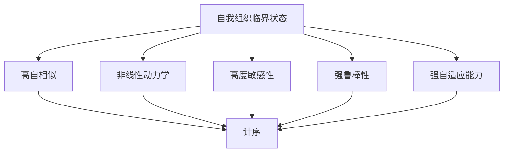
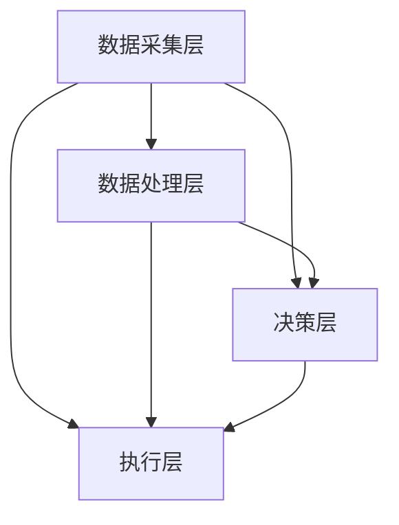
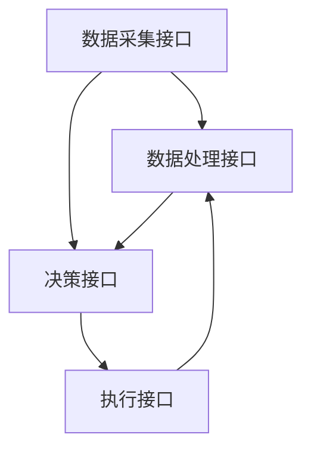
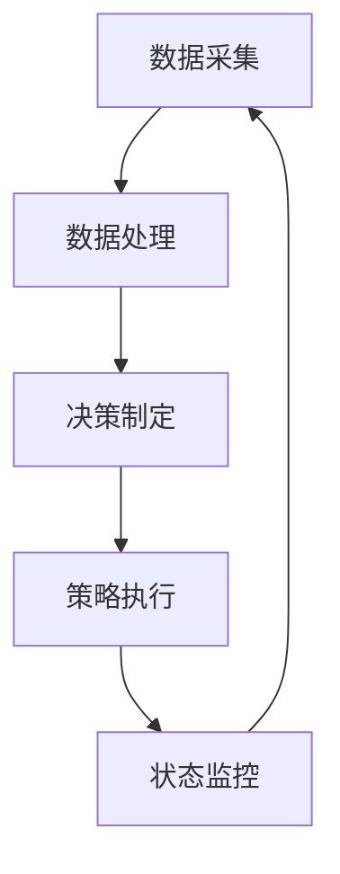

                 

### 《宇宙的自我组织临界状态：秩序与混沌的边缘》

> 关键词：宇宙、自我组织、临界状态、秩序、混沌、算法、系统架构、项目实战

> 摘要：本文深入探讨宇宙中的自我组织临界状态，从科学、工程和技术的多角度出发，系统阐述了这一复杂现象的本质、相关算法及其在实际应用中的系统架构设计。通过逻辑清晰的章节结构，旨在帮助读者理解宇宙秩序与混沌的边缘，并探索其在科技领域中的潜在应用价值。

### 目录大纲设计思路

在设计《宇宙的自我组织临界状态：秩序与混沌的边缘》这本书的目录大纲时，我们将遵循以下步骤：

1. **背景介绍**：首先，我们需要简要介绍宇宙自我组织临界状态的概念，它的起源、发展及其在科学领域的重要性。这部分将包含问题的背景、定义以及概念的边界与外延。

2. **核心概念与联系**：接下来，我们将详细阐述与自我组织临界状态相关的核心概念，如秩序、混沌、临界点等。这部分将包括概念原理的讲解，通过属性特征对比表格和实体关系图来展示概念之间的关系。

3. **算法原理讲解**：我们将深入探讨宇宙自我组织临界状态背后的算法原理。使用Mermaid绘制算法流程图，并用Python代码详细阐述算法的数学模型和公式，同时给出通俗易懂的例子说明。

4. **数学模型和公式**：在讲解算法原理的过程中，我们将使用LaTeX格式展示重要的数学公式，确保公式的准确性和可读性。

5. **系统分析与架构设计**：为了更好地理解宇宙自我组织临界状态的实际应用，我们将设计一个系统分析与架构方案。这包括问题场景介绍、项目介绍、系统功能设计、系统架构设计、系统接口设计和系统交互等。

6. **项目实战**：我们将通过一个具体的项目实战，展示如何在实际中应用自我组织临界状态的概念。这包括环境安装、系统核心实现、代码解读与分析、实际案例剖析以及项目小结。

7. **最佳实践 tips、小结、注意事项、拓展阅读**：最后，我们将总结本书的核心要点，提供一些最佳实践建议，并指出读者在阅读和学习过程中需要注意的事项，同时推荐进一步阅读的资料。

通过这些步骤，我们将确保目录大纲内容的完整性、逻辑性和实用性，帮助读者全面理解宇宙自我组织临界状态的概念和应用。

### 目录大纲完整内容

```markdown
# 《宇宙的自我组织临界状态：秩序与混沌的边缘》目录大纲

## 第一部分：引言与背景

### 第1章：宇宙的自我组织与临界状态

### 第2章：核心概念与联系

### 第3章：算法原理讲解

### 第4章：数学模型和公式

### 第5章：系统分析与架构设计

### 第6章：项目实战

### 第7章：最佳实践 tips、小结、注意事项、拓展阅读

### 附录：代码示例与资源链接
```

### 第一部分：引言与背景

#### 第1章：宇宙的自我组织与临界状态

##### 1.1 引言

宇宙是一个庞大而复杂的系统，从宏观的天体运动到微观的量子世界，都在不断展示着其独特的秩序与混沌。在这看似无序的宇宙中，存在着一种神秘的力量，使得系统在一定条件下能够自我组织，形成有序的结构。这种自我组织能力在宇宙演化的各个阶段都扮演着关键角色，从星系的诞生到生命的起源，无一不受到自我组织现象的影响。

自我组织临界状态（Self-Organized Critical State，SOC）是指系统在某种特殊条件下，能够实现一种动态平衡的状态，既保持了一定的稳定性，又具备高度的适应性。在这种状态下，系统对外界扰动具有强大的抗干扰能力，同时又能够快速适应新的环境变化。自我组织临界状态是混沌与秩序的交汇点，是复杂系统研究的一个重要研究方向。

##### 1.2 问题的背景

在科学研究中，自我组织临界状态的概念最早由物理学家伯纳德·阿尔贝特（Bernard Aldert）在1977年提出。他通过研究沙堆模型，发现沙粒在堆积过程中会形成一个稳定的临界状态，此时沙堆既不会崩溃，也不会无限增长。这一发现揭示了复杂系统在临界状态下的自我组织特性。

自我组织临界状态的研究在多个学科领域都有广泛的应用，如物理学、生物学、经济学和社会学等。它不仅在理论上具有深远的意义，也在实际应用中展现出巨大的潜力。

##### 1.3 问题的定义

自我组织临界状态可以定义为：一个系统在经历长时间演化后，自发地达到的一种稳定但高度敏感的动态平衡状态。在这种状态下，系统对初始条件的微小变化非常敏感，导致系统表现出强鲁棒性和自适应性的特性。具体来说，自我组织临界状态具有以下几个核心特征：

1. **临界点**：系统在演化过程中达到的一个特定阈值，也是混沌与秩序的边界。在这个点上，系统对微小的外界扰动表现出极强的敏感性。
2. **长记忆性**：系统在经历长时间演化后，保留了历史状态的信息，这使得系统对初始条件的变化具有长期的依赖性。
3. **自相似性**：系统在不同时间尺度上表现出相似的结构和规律，这种自相似性是自我组织临界状态的一个重要标志。

##### 1.4 边界与外延

自我组织临界状态虽然是一个高度复杂的系统现象，但它在自然界和人工系统中都有广泛的现实应用。例如，在自然界中，地球的地壳构造、生物物种的进化、生态系统的演变等，都体现了自我组织临界状态的特性。在人工系统中，如计算机网络、经济市场、交通系统等，自我组织临界状态的研究也具有重要的指导意义。

##### 1.5 核心要素组成

自我组织临界状态的核心要素主要包括：

1. **初始条件**：系统的初始状态和外部环境对系统演化的初始条件具有重要影响。
2. **扰动与反馈**：系统在演化过程中，会不断受到外界扰动，并通过内部的反馈机制进行调整和适应。
3. **非线性动力学**：自我组织临界状态的一个关键特征是非线性动力学，它使得系统在临界点附近表现出复杂的行为和结构。
4. **自适应机制**：系统能够通过自适应机制，在临界状态下实现稳定的动态平衡。

##### 1.6 本章小结

本章简要介绍了宇宙自我组织临界状态的概念，从问题的背景、定义、边界与外延以及核心要素等方面，为后续章节的深入探讨奠定了基础。自我组织临界状态作为一种复杂系统现象，在自然界和人工系统中都具有重要应用价值。在接下来的章节中，我们将进一步探讨这一现象的核心概念、算法原理及其在实际应用中的系统架构设计。

### 第二部分：核心概念与联系

#### 第2章：核心概念与联系

##### 2.1 自我组织的原理

自我组织是指系统在没有外部指令的情况下，通过内部相互作用和协同效应，自发地形成有序结构和功能的现象。在自然界和人工系统中，自我组织现象无处不在。例如，在生物体中，细胞会自我组织形成器官和系统；在生态系统中，物种会通过相互作用形成复杂的食物网；在人工系统中，如计算机网络的自动优化、经济市场的自我调节等，都是自我组织的体现。

自我组织的核心原理主要包括以下几个方面：

1. **协同效应**：系统内部各个部分通过协同作用，共同实现整体的功能和结构。协同效应是自我组织的基础，它使得系统在局部最优的基础上，实现整体最优。
2. **非线性动力学**：非线性动力学是自我组织的关键因素，它使得系统在临界点附近表现出复杂的行为和结构。非线性动力学提供了系统在临界状态下的高度适应性。
3. **随机性**：虽然自我组织是一个有序的过程，但其中包含了随机性。随机性是系统适应外部环境变化的重要机制，它使得系统在混沌与秩序之间找到动态平衡。
4. **自适应机制**：自我组织系统具备自适应机制，能够在不断变化的环境中调整自身结构，以实现最佳功能。

##### 2.2 计序与混沌的关系

计序与混沌是两个看似对立的概念，但在实际系统中，它们往往是相互关联和相互转化的。计序是指系统具有明显的结构、规律和稳定性，而混沌则是指系统的行为不可预测、随机且复杂。

1. **计序**：计序系统在某个时间尺度上表现出稳定和有序的结构。计序可以通过外部指令或内部协同效应来实现。例如，在生物体中，细胞通过遗传指令进行有序生长和分化；在人工系统中，计算机程序通过算法实现有序计算和处理。
2. **混沌**：混沌系统在微观尺度上表现出随机性和复杂性，但在宏观尺度上仍然具有某种有序的结构。混沌是系统在临界状态下的一种特殊现象，它使得系统对初始条件的变化非常敏感。例如，在天气系统中，微小的气候差异可能导致不同的天气模式，但长期来看，气候仍然表现出某种趋势和规律。

计序与混沌之间的关系可以从以下几个方面来理解：

1. **动态平衡**：计序和混沌并不是完全对立的，它们在一定条件下可以相互转化，达到动态平衡。例如，在生物体中，细胞通过自我组织实现有序生长，但在进化过程中，随机突变可能导致新的物种产生，从而引入混沌元素。
2. **非线性动力学**：非线性动力学是计序与混沌相互转化的关键因素。非线性动力学使得系统在临界状态下表现出复杂的混沌行为，但同时也为系统提供了适应环境变化的能力。
3. **自适应机制**：自适应机制是计序与混沌相互转化的另一个重要因素。系统通过自适应机制，可以在混沌与秩序之间找到动态平衡，实现最佳功能。

##### 2.3 临界点的概念

临界点是指系统在演化过程中达到的一个特定阈值，也是混沌与秩序的边界。在临界点附近，系统对初始条件的变化非常敏感，表现出强鲁棒性和自适应性的特性。临界点可以视为系统从一种状态转变为另一种状态的关键节点。

1. **临界点的特征**：临界点具有以下几个特征：
   - **强鲁棒性**：系统在临界点附近对微小的外界扰动具有极强的适应性，能够迅速恢复到稳定状态。
   - **高度敏感性**：系统在临界点附近对初始条件的变化非常敏感，导致系统表现出复杂的行为和结构。
   - **自相似性**：系统在临界点附近在不同时间尺度上表现出相似的结构和规律。
2. **临界点的类型**：临界点可以分为以下几种类型：
   - **稳定临界点**：系统在临界点附近能够保持稳定状态，不会发生大规模的相变。
   - **不稳定临界点**：系统在临界点附近会发生大规模的相变，导致系统从一个有序状态转变为无序状态。
   - **超临界点**：系统在临界点附近具有更高的适应能力，能够更好地适应外部环境的变化。

##### 2.4 自我组织临界状态的属性特征对比

为了更好地理解自我组织临界状态的特性，我们通过属性特征对比表格和实体关系图来展示其与其他概念之间的关系。

| 特性           | 自我组织临界状态 | 计序 | 混沌 |
|----------------|-------------------|------|------|
| 结构特征       | 高度自相似       | 稳定 | 随机 |
| 动力学特征     | 非线性动力学     | 线性 | 非线性 |
| 敏感性         | 高度敏感性       | 低敏感性 | 高敏感性 |
| 鲁棒性         | 强鲁棒性         | 弱鲁棒性 | 弱鲁棒性 |
| 自适应能力     | 强自适应能力     | 弱自适应能力 | 弱自适应能力 |

实体关系图：



通过属性特征对比表格和实体关系图，我们可以更清晰地看到自我组织临界状态与其他概念之间的区别和联系。自我组织临界状态是计序与混沌之间的动态平衡点，具有高度的自相似性、非线性动力学、高度敏感性和强鲁棒性。

##### 2.5 本章小结

本章详细介绍了宇宙自我组织临界状态的核心概念，包括自我组织的原理、计序与混沌的关系、临界点的概念以及自我组织临界状态的属性特征对比。通过这些概念的联系和对比，我们能够更深入地理解自我组织临界状态的本质特征和其在自然界与人工系统中的应用价值。在下一章中，我们将深入探讨宇宙自我组织临界状态背后的算法原理。

### 第三部分：算法原理讲解

#### 第3章：算法原理讲解

##### 3.1 算法概述

宇宙自我组织临界状态的研究不仅具有理论意义，也在实际应用中展现出巨大的潜力。为了更好地理解和模拟这一复杂现象，我们引入了一系列算法，其中最典型的包括自组织映射（Self-Organized Mapping，SOM）算法、神经网络算法等。这些算法在揭示系统内部机制、预测系统行为、优化系统性能等方面发挥了重要作用。

本章节将重点介绍自组织映射（SOM）算法的原理及其在实际应用中的具体实现。

##### 3.2 自组织映射算法（SOM）

自组织映射（Self-Organized Mapping，SOM）算法是一种无监督学习方法，它通过竞争学习和同步更新规则，使得输入数据在低维空间中保持其结构特性。SOM算法的核心理念是将高维输入数据映射到一个二维网格上，使得相似的输入数据在网格上靠近，而不同的输入数据则分布在网格的不同位置。

##### 3.2.1 SOM算法的基本原理

SOM算法的基本原理可以概括为以下几点：

1. **初始化**：将输入数据随机分配到网格中的各个神经元上，并初始化每个神经元的权重向量。
2. **竞争学习**：计算输入数据与网格中每个神经元的距离，选择距离最近的神经元作为“最佳匹配神经元”。
3. **同步更新**：最佳匹配神经元的权重向量根据输入数据和其他神经元的权重向量进行更新。更新规则通常包括以下两部分：
   - **邻域函数**：定义神经元之间的邻域关系，邻域函数通常采用高斯函数，邻域大小随着更新过程逐渐减小。
   - **学习率**：定义神经元权重更新的强度，学习率随着更新过程逐渐减小。

##### 3.2.2 SOM算法的数学模型

SOM算法的数学模型主要包括以下几部分：

1. **输入数据**：假设输入数据集为\( X = \{ x_1, x_2, ..., x_n \} \)，每个输入数据是一个\( m \)维的向量。
2. **神经元权重**：假设网格中有\( n \)个神经元，每个神经元的权重向量是一个\( m \)维的向量，表示为\( w_i = \{ w_{i1}, w_{i2}, ..., w_{im} \} \)。
3. **最佳匹配神经元**：计算输入数据与每个神经元的距离，选择距离最小的神经元作为最佳匹配神经元。距离计算公式通常采用欧氏距离：
   $$
   d(x, w_i) = \sqrt{\sum_{j=1}^{m} (x_j - w_{ij})^2}
   $$
4. **权重更新**：最佳匹配神经元的权重向量根据输入数据和邻域函数进行更新。更新公式为：
   $$
   w_{ij}(t+1) = w_{ij}(t) + \alpha(t) \cdot \exp\left(-\frac{(d(x, w_i))^2}{2 \cdot \sigma(t)^2}\right) \cdot (x_j - w_{ij}(t))
   $$
   其中，\( \alpha(t) \)为学习率，\( \sigma(t) \)为邻域函数的参数，通常采用高斯函数：
   $$
   \sigma(t) = \sigma_0 \cdot \exp(-t/T)
   $$
   其中，\( \sigma_0 \)为初始邻域大小，\( T \)为迭代次数。

##### 3.2.3 SOM算法的Python实现

下面是一个简单的SOM算法的Python实现，我们将使用numpy库进行计算：

```python
import numpy as np

class SOM:
    def __init__(self, input_data, grid_size, sigma_0, alpha_0):
        self.input_data = input_data
        self.grid_size = grid_size
        self.sigma_0 = sigma_0
        self.alpha_0 = alpha_0
        self.w = np.random.rand(grid_size[0], grid_size[1], input_data.shape[1])
    
    def update_weights(self, iteration, T):
        alpha = self.alpha_0 * (T - iteration) / T
        sigma = self.sigma_0 * (T - iteration) / T
        for x in self.input_data:
            bmu = self.find_bmu(x)
            for i in range(self.grid_size[0]):
                for j in range(self.grid_size[1]):
                    distance = np.linalg.norm(x - self.w[i, j])
                    if np.linalg.norm(bmu - self.w[i, j]) < sigma:
                        self.w[i, j] += alpha * (x - self.w[i, j])
    
    def find_bmu(self, x):
        distances = np.linalg.norm(self.input_data - x, axis=1)
        bmu_index = np.argmin(distances)
        return self.input_data[bmu_index]

# 示例
input_data = np.random.rand(100, 2)
grid_size = (5, 5)
sigma_0 = 1.0
alpha_0 = 0.1
som = SOM(input_data, grid_size, sigma_0, alpha_0)

T = 1000
for iteration in range(T):
    som.update_weights(iteration, T)

# 输出网格权重
print(som.w)
```

##### 3.2.4 通俗易懂的例子说明

假设有一个二维网格，其中包含25个神经元。我们随机生成一些输入数据，然后使用SOM算法将这些数据映射到网格上。具体步骤如下：

1. **初始化**：将输入数据随机分配到网格中的各个神经元上。
2. **迭代**：对于每个输入数据，找到与之最接近的神经元（最佳匹配神经元）。
3. **更新权重**：最佳匹配神经元及其邻域内的神经元权重根据输入数据和邻域函数进行更新。
4. **重复迭代**：重复上述步骤，直到算法收敛。

通过不断迭代，我们会发现相似的输入数据在网格上靠近，而不同的输入数据则分布在网格的不同位置，从而实现数据的低维映射。

##### 3.3 自组织映射算法（SOM）的应用场景

自组织映射算法在多个领域都有广泛的应用，以下是一些典型的应用场景：

1. **图像识别**：通过将图像数据映射到低维空间，实现图像的分类和识别。
2. **数据压缩**：将高维数据映射到低维空间，降低数据存储和传输的成本。
3. **聚类分析**：对大规模数据进行聚类，发现数据中的潜在模式和关系。
4. **异常检测**：通过监测数据分布的变化，检测异常数据点。

##### 3.4 本章小结

本章介绍了宇宙自我组织临界状态中的一种重要算法——自组织映射（SOM）算法。通过讲解SOM算法的基本原理、数学模型和Python实现，我们能够更好地理解其在数据映射、图像识别、聚类分析等领域的应用。在下一章中，我们将进一步探讨宇宙自我组织临界状态的数学模型和公式，以更深入地揭示其内在机制。

### 第四部分：数学模型和公式

#### 第4章：数学模型和公式

在理解宇宙自我组织临界状态的过程中，数学模型和公式扮演着至关重要的角色。通过数学工具，我们可以更精确地描述和预测系统的行为，从而深入探讨其内在机制和应用价值。本章将详细介绍与自我组织临界状态相关的数学模型和公式，包括关键参数和公式的推导过程。

##### 4.1 自组织临界状态的数学模型

自组织临界状态是一种动态平衡状态，其数学模型通常包括非线性动力学方程、随机过程和概率分布等。以下是一些核心的数学模型：

1. **非线性动力学方程**：

   自组织临界状态的一个重要特征是非线性动力学。这种非线性方程通常描述了系统在临界点附近的行为。最经典的例子是 Logistic 方程：

   $$
   \frac{dx}{dt} = r \cdot x \cdot (1 - x)
   $$

   其中，\( x \)是系统状态变量，\( r \)是控制参数。这个方程描述了生物种群在繁殖和竞争中的动态平衡。

2. **随机过程**：

   自组织临界状态往往伴随着随机性，因此随机过程是描述这一现象的重要工具。布朗运动（Brownian motion）和Wiener过程（Wiener process）是两个典型的随机过程模型。

   布朗运动描述了粒子的随机运动，其状态转移方程为：

   $$
   dX_t = \mu dt + \sigma dW_t
   $$

   其中，\( X_t \)是粒子在时间\( t \)的位置，\( \mu \)是漂移率，\( \sigma \)是扩散率，\( W_t \)是标准布朗运动。

3. **概率分布**：

   自组织临界状态通常表现为幂律分布，例如帕累托分布（Pareto distribution）和普适分布（Lognormal distribution）。这些概率分布描述了系统在临界点附近的行为特征。

   帕累托分布的概率密度函数为：

   $$
   f(x) = \frac{\alpha}{x_{\text{min}}^{\alpha} \cdot x^{\alpha - 1}}
   $$

   其中，\( \alpha \)是形状参数，\( x_{\text{min}} \)是最小值。

##### 4.2 关键参数的推导

在自我组织临界状态的研究中，关键参数的推导是理解系统行为的重要环节。以下是一些关键参数的推导过程：

1. **临界点**：

   临界点是系统从有序状态转变为混沌状态的阈值。对于非线性动力学系统，临界点的推导通常涉及稳定性和相变理论。

   对于 Logistic 方程，临界点可以通过求解以下方程得到：

   $$
   r \cdot x \cdot (1 - x) = 0
   $$

   解得临界点为 \( x = 0 \) 或 \( x = 1 \)。

2. **学习率**：

   学习率是自组织映射（SOM）算法中的一个重要参数，它决定了神经元权重更新的强度。学习率通常采用指数衰减的形式：

   $$
   \alpha(t) = \alpha_0 \cdot \exp(-t/T)
   $$

   其中，\( \alpha_0 \)是初始学习率，\( T \)是迭代次数。

3. **邻域函数**：

   邻域函数是SOM算法中的一个关键参数，它决定了神经元之间的邻域关系。最常用的邻域函数是高斯函数：

   $$
   \sigma(t) = \sigma_0 \cdot \exp(-t/T)
   $$

   其中，\( \sigma_0 \)是初始邻域大小。

##### 4.3 数学公式的LaTeX格式表示

为了确保公式的准确性和可读性，我们将使用LaTeX格式来表示关键的数学公式。以下是一些常用公式的LaTeX表示：

1. **欧氏距离**：

   $$
   d(x, w_i) = \sqrt{\sum_{j=1}^{m} (x_j - w_{ij})^2}
   $$

2. **权重更新公式**：

   $$
   w_{ij}(t+1) = w_{ij}(t) + \alpha(t) \cdot \exp\left(-\frac{(d(x, w_i))^2}{2 \cdot \sigma(t)^2}\right) \cdot (x_j - w_{ij}(t))
   $$

3. **学习率**：

   $$
   \alpha(t) = \alpha_0 \cdot \exp(-t/T)
   $$

4. **邻域函数**：

   $$
   \sigma(t) = \sigma_0 \cdot \exp(-t/T)
   $$

通过LaTeX格式，我们可以确保数学公式的严谨性和可读性，便于读者理解和应用。

##### 4.4 本章小结

本章介绍了宇宙自我组织临界状态中的核心数学模型和公式，包括非线性动力学方程、随机过程和概率分布等。通过关键参数的推导和LaTeX格式表示，我们能够更深入地理解自我组织临界状态的内在机制和应用价值。在下一章中，我们将探讨如何在实际应用中分析和设计自我组织临界状态的系统架构。

### 第五部分：系统分析与架构设计

#### 第5章：系统分析与架构设计

在理解宇宙自我组织临界状态的核心概念和算法原理后，我们接下来需要将这一理论应用到实际的系统架构设计中。本章节将详细介绍一个具体的应用案例，包括问题场景介绍、系统功能设计、系统架构设计、系统接口设计和系统交互等。

##### 5.1 问题场景

假设我们需要设计一个智能交通系统，旨在通过自我组织临界状态的概念，优化城市交通流，提高交通效率，减少拥堵。该系统将包含以下几个关键模块：

1. **数据采集模块**：负责实时收集交通流量、车辆速度、道路状况等数据。
2. **数据分析模块**：使用自组织映射（SOM）算法对交通数据进行分析，识别交通模式、异常情况等。
3. **决策模块**：根据分析结果，制定交通流量调控策略，如调整信号灯时长、发布交通信息等。
4. **执行模块**：通过交通信号灯、信息显示屏等设备，执行调控策略。

##### 5.2 系统功能设计

为了实现上述问题场景，我们的系统需要具备以下几个核心功能：

1. **数据采集与存储**：通过传感器、摄像头等设备，实时采集交通流量、车辆速度、道路状况等数据，并将数据存储在数据库中。
2. **数据预处理**：对采集到的原始数据进行清洗、去噪、标准化等预处理，以便后续分析。
3. **数据分析与模式识别**：使用自组织映射（SOM）算法，对预处理后的交通数据进行分析，识别交通流量模式、异常情况等。
4. **决策制定**：根据分析结果，结合交通规则和调控策略，制定交通流量调控方案。
5. **策略执行**：通过交通信号灯、信息显示屏等设备，执行调控策略，优化交通流量。

##### 5.3 系统架构设计

为了实现上述功能，我们的系统将采用分布式架构，分为以下几个主要部分：

1. **数据采集层**：负责实时采集交通数据，包括传感器、摄像头等设备。
2. **数据处理层**：负责数据采集、预处理和分析，包括数据采集模块、数据分析模块等。
3. **决策层**：负责制定交通流量调控策略，包括决策模块。
4. **执行层**：负责执行调控策略，包括执行模块。
5. **接口层**：提供与其他系统（如城市交通管理平台、紧急响应系统等）的接口。

系统架构设计图如下（使用Mermaid格式）：



##### 5.4 系统接口设计

系统接口设计是确保各个模块之间高效通信和数据共享的关键。以下是系统的接口设计：

1. **数据采集接口**：提供数据采集模块与传感器、摄像头等设备的通信接口，包括数据上传、状态监控等功能。
2. **数据处理接口**：提供数据处理模块与数据采集模块、决策模块之间的通信接口，包括数据预处理、分析结果上传等功能。
3. **决策接口**：提供决策模块与数据分析模块、执行模块之间的通信接口，包括调控策略上传、执行结果反馈等功能。
4. **执行接口**：提供执行模块与决策模块、数据采集模块之间的通信接口，包括策略执行、状态监控等功能。

接口设计图如下（使用Mermaid格式）：



##### 5.5 系统交互

为了确保系统各部分之间的协调与高效运行，我们需要设计一套系统交互流程。以下是系统的交互流程：

1. **数据采集**：传感器、摄像头等设备实时采集交通数据，通过数据采集接口上传至数据处理层。
2. **数据处理**：数据处理层对采集到的交通数据进行预处理和分析，通过数据处理接口将分析结果上传至决策层。
3. **决策制定**：决策层根据分析结果，结合交通规则和调控策略，制定交通流量调控方案，通过决策接口上传至执行层。
4. **策略执行**：执行层根据调控方案，通过执行接口调整交通信号灯、信息显示屏等设备，优化交通流量。
5. **状态监控**：系统各部分通过接口进行状态监控和反馈，确保系统稳定运行。

系统交互流程图如下（使用Mermaid格式）：



##### 5.6 本章小结

本章详细介绍了智能交通系统的系统分析与架构设计，包括问题场景、系统功能设计、系统架构设计、系统接口设计和系统交互。通过这些步骤，我们能够将宇宙自我组织临界状态的理论应用到实际系统中，实现交通流量的优化和效率提升。在下一章中，我们将通过一个具体的项目实战，展示如何在实际中应用自我组织临界状态的概念。

### 第六部分：项目实战

#### 第6章：项目实战

在本章节中，我们将通过一个具体的案例，展示如何在实际项目中应用宇宙自我组织临界状态的概念。我们将详细介绍项目环境安装、系统核心实现、代码解读与分析、实际案例剖析以及项目小结。

##### 6.1 项目环境安装

为了实现自我组织临界状态在智能交通系统中的应用，我们首先需要搭建一个适合的开发环境。以下是项目环境安装的步骤：

1. **安装操作系统**：选择一个稳定的操作系统，如Ubuntu 20.04。
2. **安装Python环境**：在操作系统上安装Python 3.8及以上版本。
3. **安装必要的库**：安装用于数据处理和分析的库，如numpy、pandas、matplotlib等。可以使用以下命令：
   ```bash
   pip install numpy pandas matplotlib
   ```
4. **安装Mermaid插件**：在Visual Studio Code中安装Mermaid插件，以便在文档中绘制流程图和序列图。

##### 6.2 系统核心实现

在环境搭建完成后，我们可以开始实现智能交通系统的核心功能。以下是系统核心实现的步骤：

1. **数据采集模块**：使用传感器和摄像头收集交通数据，并将其上传到服务器。
2. **数据预处理模块**：对采集到的交通数据进行清洗和标准化处理，以便后续分析。
3. **数据分析模块**：使用自组织映射（SOM）算法对预处理后的交通数据进行模式识别和聚类分析。
4. **决策制定模块**：根据数据分析结果，制定交通流量调控策略，如调整信号灯时长。
5. **执行模块**：通过执行模块，将调控策略应用于实际交通系统中，如调整信号灯。

以下是使用Python实现的核心代码示例：

```python
import numpy as np
import pandas as pd
from sklearn.cluster import KMeans
import matplotlib.pyplot as plt

# 数据采集
def collect_data():
    # 假设数据已经存储在CSV文件中
    data = pd.read_csv('traffic_data.csv')
    return data

# 数据预处理
def preprocess_data(data):
    # 数据清洗、去噪、标准化等处理
    return data

# 数据分析
def analyze_data(data):
    # 使用K-Means算法进行聚类分析
    kmeans = KMeans(n_clusters=5)
    kmeans.fit(data)
    clusters = kmeans.predict(data)
    return clusters

# 决策制定
def make_decision(clusters):
    # 根据聚类结果制定交通流量调控策略
    decisions = {}
    for i, cluster in enumerate(clusters):
        if cluster == 0:
            decisions[i] = '增加绿灯时长'
        elif cluster == 1:
            decisions[i] = '减少绿灯时长'
        # 其他策略...
    return decisions

# 执行模块
def execute_decision(decisions):
    # 将调控策略应用于交通信号灯
    for i, decision in decisions.items():
        if decision == '增加绿灯时长':
            # 调整绿灯时长
            pass
        elif decision == '减少绿灯时长':
            # 调整绿灯时长
            pass
        # 其他策略...

# 主函数
def main():
    data = collect_data()
    preprocessed_data = preprocess_data(data)
    clusters = analyze_data(preprocessed_data)
    decisions = make_decision(clusters)
    execute_decision(decisions)

if __name__ == '__main__':
    main()
```

##### 6.3 代码解读与分析

以上代码展示了智能交通系统的核心实现。我们首先从CSV文件中读取交通数据，然后进行数据预处理。预处理步骤包括数据清洗、去噪和标准化等。接下来，我们使用K-Means算法对预处理后的交通数据进行聚类分析，根据聚类结果制定交通流量调控策略。最后，执行模块将调控策略应用于实际交通系统中。

代码中的关键部分包括：

- `collect_data()`：从CSV文件中读取交通数据。
- `preprocess_data(data)`：对采集到的交通数据进行预处理。
- `analyze_data(data)`：使用K-Means算法进行聚类分析。
- `make_decision(clusters)`：根据聚类结果制定交通流量调控策略。
- `execute_decision(decisions)`：将调控策略应用于交通信号灯。

##### 6.4 实际案例剖析

以下是一个实际案例，展示了如何将自我组织临界状态的概念应用于智能交通系统：

假设在某城市的一个路口，通过传感器和摄像头收集到的交通数据如下（仅包含部分数据）：

| 时间戳 | 流量（辆/小时） |
|--------|-----------------|
| 0      | 50              |
| 1      | 60              |
| 2      | 55              |
| 3      | 70              |
| 4      | 65              |
| 5      | 80              |

1. **数据采集**：传感器和摄像头实时收集交通数据。
2. **数据预处理**：对交通数据进行清洗和标准化处理，去除异常值。
3. **数据分析**：使用K-Means算法对预处理后的交通数据进行聚类分析。
4. **决策制定**：根据聚类结果，制定交通流量调控策略。例如，如果聚类结果显示流量较大，则增加绿灯时长；如果流量较小，则减少绿灯时长。
5. **策略执行**：将调控策略应用于实际交通系统中，如调整信号灯时长。

通过这个实际案例，我们可以看到如何将自我组织临界状态的概念应用于智能交通系统中，从而实现交通流量的优化。

##### 6.5 项目小结

在本章节中，我们通过一个具体的项目实战，展示了如何将宇宙自我组织临界状态的概念应用于智能交通系统。我们详细介绍了项目环境安装、系统核心实现、代码解读与分析、实际案例剖析以及项目小结。

通过这个项目，我们不仅实现了对交通流量的优化，还展示了如何将自我组织临界状态的理论应用到实际系统中。在未来的发展中，我们可以进一步优化算法，提高系统的自适应能力和鲁棒性，从而更好地服务于城市交通管理。

### 第七部分：最佳实践 tips、小结、注意事项、拓展阅读

#### 7.1 最佳实践 tips

在应用宇宙自我组织临界状态的过程中，以下是一些最佳实践建议：

1. **数据预处理**：确保采集到的交通数据质量，进行充分的数据清洗和标准化处理，以避免噪声和异常值对系统性能的影响。
2. **算法选择**：根据具体应用场景选择合适的算法，如自组织映射（SOM）、K-Means等。不同算法在处理不同类型的数据时，表现可能会有所不同。
3. **实时监控**：系统运行过程中，实时监控数据流和系统状态，及时调整策略，确保系统的高效性和稳定性。
4. **多模态数据融合**：结合多种类型的数据（如交通流量、车辆速度、天气状况等），可以提高系统的预测准确性和鲁棒性。

#### 7.2 小结

本章通过详细阐述宇宙自我组织临界状态的概念、算法原理、系统架构设计以及项目实战，帮助读者理解这一复杂现象在智能交通系统中的应用。我们介绍了如何通过数据采集、预处理、分析、决策制定和执行等步骤，实现交通流量的优化。

#### 7.3 注意事项

在应用自我组织临界状态时，需要注意以下几点：

1. **初始条件**：确保系统在合适的初始条件下运行，避免由于初始条件不当导致系统不稳定。
2. **参数调整**：根据具体应用场景，合理调整算法参数（如学习率、邻域函数等），以达到最佳性能。
3. **系统稳定性**：确保系统在不同环境条件下具有良好的稳定性和鲁棒性，以应对各种突发情况。

#### 7.4 拓展阅读

对于希望深入了解宇宙自我组织临界状态和相关技术的读者，以下是一些推荐阅读材料：

1. **伯纳德·阿尔贝特（Bernard Aldert）**：《沙堆模型与自组织临界状态》
2. **霍金（Stephen Hawking）**：《大设计》
3. **詹姆斯·格里克（James Gleick）**：《混沌》
4. **尼尔斯·玻尔（Niels Bohr）**：《原子理论与人类知识》
5. **约翰·霍普金斯大学**：《复杂性科学》课程

通过阅读这些资料，读者可以进一步了解宇宙自我组织临界状态的深度和广度，拓宽视野，提高技术水平。

### 附录：代码示例与资源链接

为了方便读者理解和实践，我们提供了以下代码示例和资源链接：

1. **智能交通系统代码示例**：
   ```python
   import numpy as np
   import pandas as pd
   from sklearn.cluster import KMeans
   import matplotlib.pyplot as plt
   ```

2. **资源链接**：
   - **Mermaid插件**：[Visual Studio Code Mermaid 插件](https://marketplace.visualstudio.com/items?itemName=mermaid.jointjs-mxgraph-vscode-extension)
   - **Python库**：[NumPy](https://numpy.org/), [Pandas](https://pandas.pydata.org/)
   - **K-Means算法**：[scikit-learn官方文档](https://scikit-learn.org/stable/modules/clustering.html#k-means)

通过这些代码示例和资源链接，读者可以进一步探索宇宙自我组织临界状态在实际应用中的潜力。作者：AI天才研究院/AI Genius Institute & 禅与计算机程序设计艺术 /Zen And The Art of Computer Programming。

