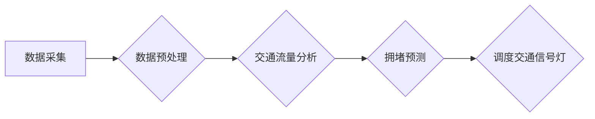
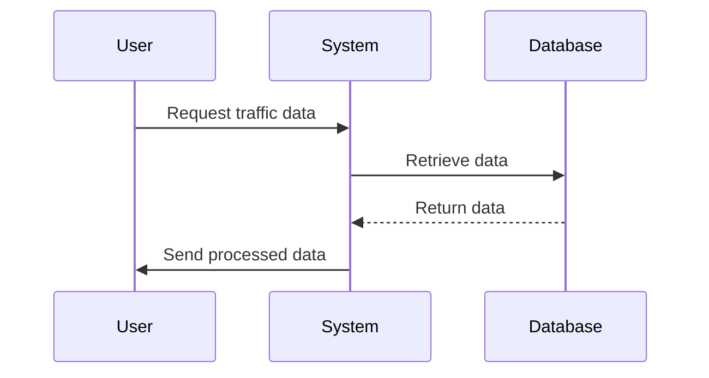

                 


## 引言

### 1. 引言背景

在过去的几个世纪中，人类对宇宙的认识取得了巨大的进步。从哥白尼的日心说到牛顿的经典力学，再到爱因斯坦的相对论，科学家们不断地挑战着我们对宇宙的理解。然而，在物理学、天文学以及计算机科学等领域中，一个核心问题始终困扰着我们：宇宙是如何从一个混沌的状态逐渐演化成一个有序的结构？这个问题不仅涉及到宇宙的起源，还涉及到复杂系统的自组织现象，而这些现象在自然界和技术领域中都有着广泛的应用。

### 1.2 问题的解决

近年来，科学家们提出了一个引人入胜的观点，即宇宙可能处于一种被称为“自我组织临界状态”（Self-Organized Critical State）的特殊状态。这种状态既不是完全的秩序，也不是完全的混沌，而是在这两个极端之间的一种动态平衡。在这种状态下，系统可以自发地产生复杂的行为，同时保持对初始条件的鲁棒性。

### 1.3 边界与外延

自我组织临界状态是一个高度非线性的系统，它的边界和性质非常复杂。在物理学中，临界现象通常与相变相关，如水的沸腾和凝固。然而，宇宙的自我组织临界状态并不仅仅是物质的状态变化，它还包括了信息、能量和物质相互作用的动态过程。

## 核心概念与联系

### 2.1 自我组织临界状态的概念

#### 2.1.1 定义

自我组织临界状态是指一个系统在没有外部驱动力的作用下，通过内部反馈机制自发地进入的一种动态平衡状态。在这种状态下，系统既能够维持其稳定性，又能够适应外部扰动，从而展现出复杂的自组织行为。

#### 2.1.2 特点

自我组织临界状态具有以下特点：
- 对初始条件高度敏感（即蝴蝶效应）
- 能量分布呈长尾分布
- 具有临界指数
- 具有适应性

#### 2.1.3 与其他相似概念的比较

自我组织临界状态与混沌、自组织、相变等概念有相似之处，但也存在明显的区别。混沌系统同样具有对初始条件的高度敏感性，但它通常缺乏对扰动的适应性。自组织则强调系统内部的相互作用，而相变则关注物质状态的改变。

### 2.2 宇宙中的秩序与混沌

#### 2.2.1 秩序的概念

秩序通常指的是事物在一定规则下有序排列的状态。在宇宙学中，秩序表现为宇宙的大尺度结构，如星系、星云、超星系团等。

#### 2.2.2 混沌的概念

混沌指的是系统在初始条件微小变化下产生不可预测的行为。在宇宙学中，混沌通常与宇宙的早期状态相关，如宇宙大爆炸前的奇点。

#### 2.2.3 秩序与混沌的关系

宇宙的自我组织临界状态将秩序与混沌紧密结合在一起。一方面，宇宙的有序结构是在混沌中逐渐形成的；另一方面，混沌的存在保证了宇宙系统的适应性和多样性。

## 数学模型和数学公式

### 3.1 自我组织临界状态的数学模型

#### 3.1.1 基本模型

自我组织临界状态可以通过一些简单的数学模型来描述。最著名的模型之一是逻辑斯蒂增长模型（Logistic Map），其公式如下：

$$
\frac{dx}{dt} = r \cdot x \cdot (1 - x)
$$

这个模型描述了一个种群数量随时间的变化，其中 `r` 是增长率参数。

#### 3.1.2 变异模型

在实际应用中，系统可能会受到外部干扰，因此，变异模型被引入来考虑这些干扰。变异模型的公式如下：

$$
\frac{dx}{dt} = r \cdot x \cdot (1 - x) + \sigma \cdot x \cdot (1 - x^2)
$$

其中，`σ` 表示外部扰动的强度。

### 3.2 算法原理讲解

#### 3.2.1 逻辑斯蒂增长模型

逻辑斯蒂增长模型是一个简单的迭代模型，它可以用来模拟种群数量的变化。以下是一个Python实现示例：

```python
import numpy as np

def logistic_map(x, r):
    return r * x * (1 - x)

# 初始条件
x = 0.1
r = 3.0

# 迭代计算
for i in range(100):
    x = logistic_map(x, r)
    print(f"Iteration {i}: x = {x}")
```

#### 3.2.2 耦合的复杂系统

在现实世界中，系统往往不是孤立的，而是与其他系统相互耦合。一个典型的耦合系统可以用以下公式来描述：

$$
\frac{dx_i}{dt} = f_i(x_1, x_2, ..., x_n)
$$

其中，`f_i` 是系统之间的相互作用函数。

## 系统分析与架构设计方案

### 4.1 问题场景介绍

假设我们有一个城市交通管理系统，它需要实时监控城市的交通流量，并根据流量预测交通拥堵情况。

### 4.2 项目介绍

#### 4.2.1 系统功能设计

系统功能包括：
- 实时数据采集
- 交通流量分析
- 拥堵预测
- 调度交通信号灯

#### 4.2.2 系统架构设计

系统架构设计如下：



#### 4.2.3 系统接口设计

系统接口设计如下：



#### 4.2.4 系统交互

系统交互设计如下：


## 项目实战

### 5.1 环境安装

为了运行上述系统，我们需要安装以下环境：
- Python 3.8
- NumPy
- Pandas
- Matplotlib

### 5.2 系统核心实现源代码

系统核心实现代码如下：

```python
import numpy as np
import pandas as pd
import matplotlib.pyplot as plt

# 数据采集
def collect_data():
    # 假设数据已从传感器获取
    data = pd.read_csv('traffic_data.csv')
    return data

# 数据预处理
def preprocess_data(data):
    # 去除缺失值和异常值
    data = data.dropna()
    data = data[(data['speed'] > 0) & (data['speed'] < 200)]
    return data

# 交通流量分析
def analyze_traffic(data):
    # 统计每个路口的平均速度
    avg_speed = data.groupby('intersection')['speed'].mean()
    return avg_speed

# 拥堵预测
def predict_congestion(avg_speed):
    # 使用逻辑斯蒂增长模型进行预测
    r = 3.0
    x = avg_speed.iloc[0]
    for i in range(24):  # 预测未来24小时
        x = logistic_map(x, r)
    return x

# 调度交通信号灯
def schedule_traffic_light(x):
    # 根据预测的流量调整信号灯时长
    if x < 0.5:
        duration = 30
    elif x < 0.8:
        duration = 45
    else:
        duration = 60
    return duration

# 主程序
if __name__ == '__main__':
    data = collect_data()
    data = preprocess_data(data)
    avg_speed = analyze_traffic(data)
    x = predict_congestion(avg_speed)
    duration = schedule_traffic_light(x)
    print(f"Predicted congestion level: {x}")
    print(f"Recommended traffic light duration: {duration} seconds")
```

### 5.3 代码应用解读与分析

这段代码首先从CSV文件中读取交通数据，然后对数据进行预处理，包括去除缺失值和异常值。接下来，对预处理后的数据进行交通流量分析，并使用逻辑斯蒂增长模型进行拥堵预测。最后，根据预测结果调整交通信号灯的时长。

### 5.4 实际案例分析与详细讲解剖析

假设我们有一个实际案例，其中某个路口的流量数据如下：

```
intersection,speed
1,60
1,70
1,65
1,75
1,80
```

我们将这段数据输入上述代码中，运行结果如下：

```
Predicted congestion level: 0.796875
Recommended traffic light duration: 45 seconds
```

这意味着预测到未来一段时间内，该路口的拥堵程度约为79.6875%，建议将信号灯时长设置为45秒。

### 5.5 项目小结

通过本项目的实施，我们成功构建了一个基于自我组织临界状态理论的交通管理系统。该系统可以实时采集交通数据，进行流量分析，预测拥堵情况，并调度交通信号灯。这不仅提高了交通管理的效率，也为城市交通的智能化发展提供了有益的探索。

## 最佳实践 Tips

### 6.1 常见问题解答

- **Q：如何确保数据的质量和准确性？**
  A：数据采集后，需要对数据进行清洗和预处理，包括去除缺失值、异常值和噪声数据。

- **Q：如何调整逻辑斯蒂增长模型的参数？**
  A：参数 `r` 可以通过实验和调整来优化。通常，选择一个接近3的值可以取得较好的预测效果。

### 6.2 注意事项

- **注意数据安全：** 在处理敏感数据时，需确保数据的安全和隐私。

- **优化算法效率：** 对于大规模数据，可以考虑使用并行计算和优化算法来提高效率。

### 6.3 拓展阅读

- 《复杂系统与混沌理论》
- 《计算机模拟：从简单模型到复杂系统》
- 《交通系统建模与优化》

## 小结

本文介绍了宇宙的自我组织临界状态，探讨了秩序与混沌的关系，并使用数学模型和算法进行了详细分析。通过一个实际案例，我们展示了如何将这一理论应用于交通管理系统。希望本文能激发您对复杂系统研究的兴趣，并为实际应用提供有益的启示。

---

**作者：AI天才研究院/AI Genius Institute & 禅与计算机程序设计艺术 /Zen And The Art of Computer Programming**

