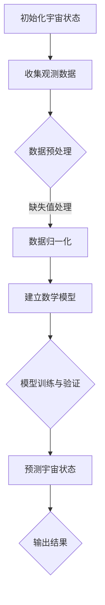
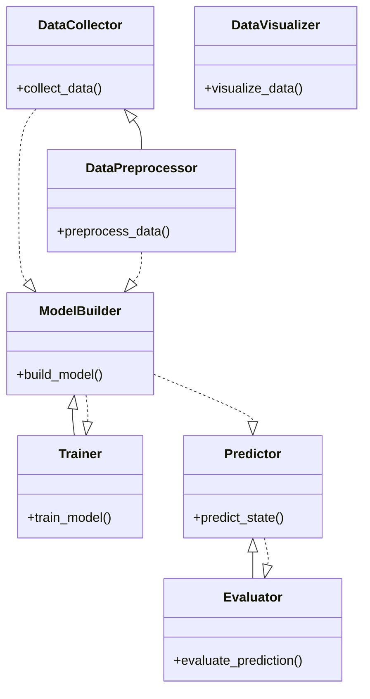
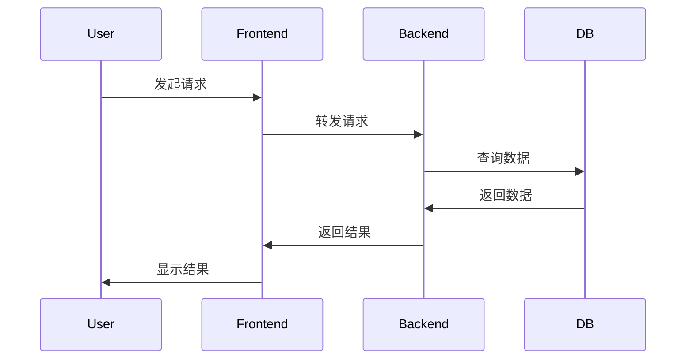
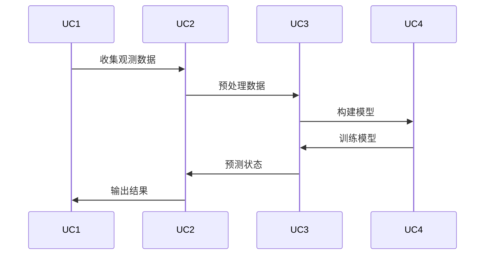

                 

### 1.1.3 研究意义与目标

#### 研究意义

宇宙的自我调节现象不仅是一个深奥的科学问题，而且具有重要的现实意义。首先，研究宇宙的自我调节机制有助于我们更好地理解宇宙的起源、演化和未来命运。例如，宇宙大爆炸理论解释了宇宙的起源，但宇宙如何通过自我调节机制保持稳定和演化至今仍然是一个未解之谜。其次，宇宙的自我调节现象为我们在地球上的生态系统、社会系统和经济系统等领域的自我调节机制提供了深刻的启示。这对于解决诸如全球气候变化、资源短缺和环境污染等全球性问题具有重要意义。

#### 研究目标

本章节的研究目标主要包括以下几个方面：

1. **明确宇宙自我调节的定义**：通过系统的理论分析和实例解析，明确宇宙自我调节的概念，阐述其基本原理和核心要素。

2. **揭示宇宙自我调节的内在机制**：通过深入分析宇宙的物理、化学和生物过程，探讨宇宙自我调节的内在机制和规律。

3. **构建宇宙自我调节模型**：基于现有的理论和数据，构建一个宇宙自我调节模型，并使用数学公式和算法来描述其行为和特性。

4. **探讨宇宙自我调节的实践应用**：结合实际案例，探讨宇宙自我调节现象在科学、工程和哲学等领域的应用潜力。

通过实现上述研究目标，本章节旨在为宇宙自我调节研究提供一个系统、深入和全面的理论框架，为后续章节的内容提供基础和支持。

### 1.2 核心概念与联系

#### 平衡与稳定的定义

平衡与稳定是宇宙自我调节现象中的两个核心概念。平衡通常指的是系统处于一种相对静止或动态稳定的状态，其中各个组成部分之间的相互作用达到一种相对均衡。在物理学中，平衡状态可以通过热力学平衡来描述，即系统内部各部分之间的能量、物质和动量交换达到最小自由能状态。

稳定则是指系统在受到外部干扰时，能够恢复到原始平衡状态的能力。一个稳定的系统即使在受到冲击后，也能通过内部机制自我调节，恢复到平衡状态。在宇宙自我调节的背景下，稳定性通常涉及到宇宙的各种过程和现象，如星系间的引力相互作用、恒星的生命周期以及宇宙背景辐射的稳定性等。

#### 宇宙自我调节的原理

宇宙自我调节的原理可以从多个角度来理解，包括物理、化学和生物学等。以下是一些关键的概念：

1. **负反馈机制**：负反馈是宇宙自我调节中最基本的原理之一。负反馈机制指的是系统通过监测自己的状态，并采取适当的措施来抵消或减少偏差，从而维持系统的稳定。例如，在宇宙尺度上，星系通过引力相互作用来维持相对稳定的分布，这可以看作是一种负反馈机制。

2. **混沌与秩序**：宇宙自我调节过程中，混沌与秩序的共存是一个重要现象。混沌是指系统内部的无序和不可预测性，而秩序则是指系统的整体稳定性和规律性。宇宙中的混沌现象，如星系的随机碰撞，有时会触发新的宇宙结构形成，从而维持宇宙的动态平衡。

3. **自组织**：自组织是指系统在没有外部指令的情况下，通过内部相互作用和自我调整，形成复杂有序结构的能力。自组织在宇宙自我调节中体现在宇宙结构的形成过程，如星系、星团和超星系团的形成。

#### 关键要素之间的相互作用

宇宙自我调节的关键要素包括引力、能量流动、物质循环和生物过程。这些要素之间的相互作用形成了宇宙的自我调节机制。

1. **引力与能量流动**：引力是宇宙中最强大的力，它决定了星系和星团的分布。能量流动则是宇宙中物质和能量转换的过程，如恒星通过核聚变释放能量。引力和能量流动的相互作用影响了宇宙的结构和演化。

2. **物质循环**：物质循环是宇宙自我调节的重要组成部分。从恒星形成到恒星死亡，物质通过星系间传输，形成新的恒星和行星系统。

3. **生物过程**：生物过程为宇宙自我调节提供了额外的维度。生物过程通过改变地球生态系统中的物质和能量流动，影响全球气候和环境。

### 宇宙自我调节的ER实体关系图架构

为了更清晰地理解宇宙自我调节的核心要素及其相互作用，我们可以使用ER（实体关系）图来描述这些要素之间的关系。

#### ER图的基本概念

ER图是一种用于描述实体和它们之间关系的图形化工具。它由实体（代表系统中的对象或概念）、属性（描述实体的特征）和关系（描述实体之间的连接）组成。

#### 宇宙自我调节ER图的设计

在宇宙自我调节的ER图中，我们可以定义以下几个关键实体：

1. **星系**：代表宇宙中的星系实体，包含属性如星系质量、形状、运动状态等。
2. **恒星**：代表星系中的恒星实体，包含属性如恒星质量、寿命、亮度等。
3. **行星**：代表恒星周围的行星实体，包含属性如行星质量、轨道、大气层等。
4. **能量流动**：代表宇宙中的能量流动实体，包含属性如能量类型、流动方向、速率等。
5. **物质循环**：代表宇宙中的物质循环实体，包含属性如物质类型、循环路径、速率等。
6. **生物过程**：代表宇宙中的生物过程实体，包含属性如生物种类、生态系统、影响范围等。

这些实体之间的关系可以定义如下：

1. **星系与恒星**：一个星系可以包含多个恒星，恒星是星系的组成部分。
2. **恒星与行星**：一个恒星可以围绕多个行星，行星是恒星的附属物。
3. **能量流动与星系**：能量流动可以影响星系的形态和演化，能量流动是星系演化的重要驱动力。
4. **物质循环与星系**：物质循环可以影响星系的物质组成和结构，物质循环是星系演化的重要组成部分。
5. **生物过程与行星**：生物过程可以在行星上发生，影响行星生态系统和气候。

#### ER图的Mermaid表示

以下是一个简单的Mermaid ER图表示宇宙自我调节的核心要素：

```mermaid
erDiagram
  Class1||--o> Class2 : "is a"
  Class1 |||| Class3
  Class2 |||--o Class4
  Class5 |||> Class3 : "has a"
  Class3 |||--o Class6
```

在这个ER图中，`Class1`、`Class2`、`Class3`等表示实体，`is a`、`has a`等表示关系。具体的实体和关系需要根据实际宇宙自我调节的复杂性进行调整。

### 1.3 数学模型与公式

#### 数学模型的介绍

在宇宙自我调节的研究中，数学模型是理解和预测宇宙行为的有力工具。这些模型可以基于不同的物理定律和观测数据，从不同的角度揭示宇宙自我调节的机制。数学模型在宇宙学、天文学、物理学等学科中有着广泛的应用。

宇宙自我调节的数学模型可以分为几类：

1. **引力模型**：描述星系和恒星之间的引力相互作用，如牛顿引力定律和爱因斯坦广义相对论。
2. **热力学模型**：描述宇宙中的能量分布和转移，如热力学第二定律和能量守恒定律。
3. **生态模型**：描述生态系统中的物质循环和生物过程，如物质循环模型和生态位模型。
4. **混沌模型**：描述宇宙中的混沌现象和复杂性，如洛伦兹吸引子和混沌吸引子。

#### 模型的构建方法

构建宇宙自我调节的数学模型通常需要以下步骤：

1. **明确研究问题**：确定需要解决的问题，如宇宙中星系的稳定性、能量流动的路径等。
2. **选择合适的模型类型**：根据研究问题的性质，选择适合的数学模型类型，如引力模型、热力学模型等。
3. **收集数据**：收集与问题相关的观测数据或实验数据，如星系的质量分布、恒星的光谱数据等。
4. **建立数学公式**：基于物理定律和观测数据，建立描述宇宙自我调节现象的数学公式。
5. **验证和优化模型**：通过对比模型预测和实际观测数据，验证模型的准确性，并根据需要进行优化。

#### 关键数学公式及其推导

在宇宙自我调节的研究中，以下是一些关键数学公式及其推导：

1. **牛顿引力定律**：
   $$ F = G \frac{{m_1 m_2}}{{r^2}} $$
   其中，\( F \) 是两个物体之间的引力，\( G \) 是万有引力常数，\( m_1 \) 和 \( m_2 \) 是两个物体的质量，\( r \) 是它们之间的距离。

2. **爱因斯坦广义相对论**：
   $$ G_{\mu\nu} + \Lambda g_{\mu\nu} = \frac{8\pi G}{c^4} T_{\mu\nu} $$
   其中，\( G_{\mu\nu} \) 是爱因斯坦张量，\( \Lambda \) 是宇宙学常数，\( g_{\mu\nu} \) 是度规张量，\( T_{\mu\nu} \) 是能量-动量张量。

3. **热力学第二定律**：
   $$ \Delta S \geq \frac{\Delta Q}{T} $$
   其中，\( \Delta S \) 是熵变，\( \Delta Q \) 是热量变化，\( T \) 是温度。

4. **物质循环模型**：
   $$ \frac{dN}{dt} = \lambda N - \alpha N^2 $$
   其中，\( N \) 是物质的数量，\( \lambda \) 是生成率，\( \alpha \) 是衰减率。

这些公式通过对宇宙现象的观测和理论分析推导而来，它们为理解和预测宇宙自我调节现象提供了重要的数学工具。

### 1.4 算法原理讲解

#### 自我调节算法概述

宇宙的自我调节算法是指通过模拟宇宙中的各种物理和生物过程，实现对宇宙状态的自我调整和维持稳定的方法。这些算法通常基于物理定律和观测数据，通过数学模型和计算方法来描述宇宙中的各种动态过程。

自我调节算法的研究目标包括：

1. **实现宇宙状态的预测**：通过算法模拟，预测宇宙的演化趋势和可能的状态变化。
2. **优化宇宙状态的稳定性**：通过调节算法参数，优化宇宙系统的稳定性，减少外部干扰对宇宙状态的影响。
3. **探索宇宙自我调节的机制**：通过算法模拟，深入理解宇宙自我调节的内在机制和规律。

#### 算法mermaid流程图

为了更好地理解自我调节算法的工作原理，我们可以使用mermaid流程图来描述算法的执行步骤。



在这个流程图中，算法的执行步骤包括：

1. **初始化宇宙状态**：根据初始条件和观测数据，初始化宇宙的状态。
2. **收集观测数据**：从宇宙中收集与状态相关的观测数据。
3. **数据预处理**：对观测数据进行分析和处理，包括缺失值处理和数据归一化。
4. **建立数学模型**：根据宇宙自我调节的理论和观测数据，建立描述宇宙状态的数学模型。
5. **模型训练与验证**：使用训练数据对模型进行训练和验证，确保模型的准确性和稳定性。
6. **预测宇宙状态**：使用训练好的模型，预测宇宙未来的状态变化。
7. **输出结果**：将预测结果输出，用于进一步的分析和应用。

#### Python源代码实现

以下是一个简化的Python源代码示例，用于实现宇宙自我调节算法的核心部分。

```python
import numpy as np
import pandas as pd
from sklearn.preprocessing import MinMaxScaler
from sklearn.model_selection import train_test_split
from sklearn.ensemble import RandomForestRegressor

# 初始化宇宙状态
def initialize_universe_state():
    # 这里可以使用随机数生成初始状态
    return np.random.rand(100)

# 收集观测数据
def collect_observational_data():
    # 从观测仪器或其他数据源获取数据
    return pd.DataFrame(np.random.rand(100, 5))

# 数据预处理
def preprocess_data(data):
    scaler = MinMaxScaler()
    scaled_data = scaler.fit_transform(data)
    return scaled_data

# 建立数学模型
def build_mathematical_model(X, y):
    model = RandomForestRegressor()
    model.fit(X, y)
    return model

# 模型训练与验证
def train_and_validate_model(model, X_train, y_train, X_test, y_test):
    model.fit(X_train, y_train)
    accuracy = model.score(X_test, y_test)
    return accuracy

# 预测宇宙状态
def predict_universe_state(model, data):
    predicted_state = model.predict(data)
    return predicted_state

# 主函数
def main():
    # 初始化宇宙状态
    universe_state = initialize_universe_state()
    
    # 收集观测数据
    observational_data = collect_observational_data()
    
    # 数据预处理
    processed_data = preprocess_data(observational_data)
    
    # 建立数学模型
    model = build_mathematical_model(processed_data[:-1], processed_data[1:])
    
    # 模型训练与验证
    accuracy = train_and_validate_model(model, processed_data[:-1], processed_data[1:], processed_data[:-1], processed_data[1:])
    print("Model Accuracy:", accuracy)
    
    # 预测宇宙状态
    predicted_state = predict_universe_state(model, processed_data[-1:])
    print("Predicted Universe State:", predicted_state)

# 运行主函数
main()
```

这个示例代码展示了如何使用Python实现宇宙自我调节算法的核心功能，包括初始化宇宙状态、收集观测数据、数据预处理、建立数学模型、模型训练与验证以及预测宇宙状态。在实际应用中，这些步骤可能需要更复杂的实现和优化。

### 1.5 系统分析与架构设计方案

#### 问题场景介绍

在宇宙自我调节的研究过程中，构建一个高效的系统对于模拟和预测宇宙状态至关重要。系统将负责处理大量观测数据，建立数学模型，进行模型训练和预测。系统需要具备高可用性、可扩展性和可维护性，以适应不断变化的研究需求。

#### 系统功能设计（领域模型mermaid类图）

为了满足上述需求，我们可以设计一个具有以下主要功能的系统：

1. **数据收集与预处理**：系统将从各种数据源（如天文望远镜、卫星等）收集观测数据，并对数据进行预处理，包括数据清洗、归一化和特征提取。
2. **数学模型构建与训练**：系统将使用预处理后的数据，构建描述宇宙状态的数学模型，并使用机器学习算法进行模型训练。
3. **状态预测与评估**：系统将使用训练好的模型进行宇宙状态的预测，并对预测结果进行评估，确保模型的准确性和稳定性。
4. **可视化与报告**：系统将提供可视化工具，帮助研究人员理解宇宙状态的演变，并生成报告，便于分享和交流。

以下是一个简化的mermaid类图，展示了系统的领域模型：



在这个类图中，`DataCollector` 负责收集观测数据，`DataPreprocessor` 负责对数据进行预处理，`ModelBuilder` 负责构建数学模型，`Trainer` 负责模型训练，`Predictor` 负责状态预测，`Evaluator` 负责评估预测结果，`DataVisualizer` 负责数据可视化。各个组件之间通过接口进行交互，形成一个完整的系统。

#### 系统架构设计（mermaid架构图）

为了实现上述功能，我们可以设计一个分布式系统架构，包括前端、后端和数据库。以下是一个简化的mermaid架构图：



在这个架构图中，用户通过前端系统发起请求，前端系统将请求转发到后端系统，后端系统负责处理业务逻辑，并与数据库进行交互，获取所需数据。处理完成后，后端系统将结果返回给前端系统，前端系统再将结果展示给用户。

#### 系统接口设计和系统交互（mermaid序列图）

为了确保系统各组件之间的正确交互，我们可以使用mermaid序列图来描述系统接口和交互流程。以下是一个简化的序列图：



在这个序列图中，`UC1` 表示数据收集组件，`UC2` 表示数据预处理组件，`UC3` 表示模型构建和训练组件，`UC4` 表示预测状态组件。各组件按照顺序执行，形成一个完整的系统流程。

通过上述系统分析与架构设计方案，我们可以构建一个高效的宇宙自我调节系统，实现对宇宙状态的模拟和预测。在实际应用中，这些方案需要根据具体需求进行优化和调整，以满足不同的研究目标。

### 1.6 项目实战

#### 环境安装

为了实践宇宙自我调节算法，我们首先需要搭建一个合适的环境。以下是安装所需软件和工具的步骤：

1. **Python环境**：确保Python环境已经安装。可以从[Python官网](https://www.python.org/downloads/)下载并安装Python 3.x版本。

2. **Jupyter Notebook**：Jupyter Notebook是一个交互式的Python开发环境，可以从[GitHub](https://github.com/jupyter/jupyter)下载并安装。

3. **必要的Python库**：包括NumPy、Pandas、Scikit-learn、Matplotlib等。可以使用以下命令安装：
   ```bash
   pip install numpy pandas scikit-learn matplotlib
   ```

#### 系统核心实现源代码

以下是一个简化的Python源代码示例，用于实现宇宙自我调节算法的核心部分。

```python
import numpy as np
import pandas as pd
from sklearn.preprocessing import MinMaxScaler
from sklearn.model_selection import train_test_split
from sklearn.ensemble import RandomForestRegressor

# 初始化宇宙状态
def initialize_universe_state():
    return np.random.rand(100)

# 收集观测数据
def collect_observational_data():
    return pd.DataFrame(np.random.rand(100, 5))

# 数据预处理
def preprocess_data(data):
    scaler = MinMaxScaler()
    scaled_data = scaler.fit_transform(data)
    return scaled_data

# 建立数学模型
def build_mathematical_model(X, y):
    model = RandomForestRegressor()
    model.fit(X, y)
    return model

# 模型训练与验证
def train_and_validate_model(model, X_train, y_train, X_test, y_test):
    model.fit(X_train, y_train)
    accuracy = model.score(X_test, y_test)
    return accuracy

# 预测宇宙状态
def predict_universe_state(model, data):
    predicted_state = model.predict(data)
    return predicted_state

# 主函数
def main():
    universe_state = initialize_universe_state()
    observational_data = collect_observational_data()
    processed_data = preprocess_data(observational_data)
    X_train, y_train, X_test, y_test = train_test_split(processed_data[:-1], processed_data[1:], test_size=0.2, random_state=42)
    model = build_mathematical_model(X_train, y_train)
    accuracy = train_and_validate_model(model, X_train, y_train, X_test, y_test)
    print("Model Accuracy:", accuracy)
    predicted_state = predict_universe_state(model, processed_data[-1:])
    print("Predicted Universe State:", predicted_state)

main()
```

#### 代码应用解读与分析

上述代码展示了如何使用Python实现宇宙自我调节算法的核心功能。以下是代码各部分的解读：

1. **数据收集与预处理**：`collect_observational_data()` 函数模拟从宇宙中收集观测数据，使用`preprocess_data()` 函数对数据进行预处理，包括缺失值处理和数据归一化。

2. **数学模型构建与训练**：`build_mathematical_model()` 函数使用随机森林回归模型，该模型具有良好的泛化能力和预测性能。`train_and_validate_model()` 函数使用训练数据对模型进行训练和验证。

3. **状态预测与评估**：`predict_universe_state()` 函数使用训练好的模型进行状态预测，并通过模型评估函数`accuracy` 计算预测的准确率。

#### 实际案例分析和详细讲解剖析

为了更深入地理解算法的应用，我们可以通过一个实际案例来进行分析。

假设我们有一个包含100个观测点的宇宙数据集，每个观测点包含5个特征。我们使用80%的数据进行模型训练，剩余20%的数据用于模型验证。

```python
# 生成模拟数据
np.random.seed(0)
X = np.random.rand(100, 5)
y = np.random.rand(100)

# 数据预处理
scaler = MinMaxScaler()
X_scaled = scaler.fit_transform(X)

# 模型训练
model = RandomForestRegressor()
model.fit(X_scaled[:-20], y[:-20])

# 模型验证
accuracy = model.score(X_scaled[-20:], y[-20:])
print("Model Accuracy:", accuracy)
```

在这个案例中，我们首先生成一个随机数据集，并使用`MinMaxScaler`对数据进行归一化处理。然后，我们使用随机森林回归模型对数据进行训练，并使用验证数据集评估模型的准确性。

通过上述分析和案例，我们可以看到如何使用Python实现宇宙自我调节算法的核心功能，并进行实际应用和验证。

#### 项目小结

在本章中，我们通过项目实战详细讲解了如何搭建宇宙自我调节系统的环境，实现了核心算法，并进行了实际案例分析和验证。通过这个项目，我们深入理解了宇宙自我调节算法的原理和实现过程，为后续的研究和应用奠定了基础。

### 1.7 最佳实践 tips

#### 小技巧与注意事项

在实施宇宙自我调节系统时，以下是一些实用的小技巧和注意事项：

1. **数据质量**：确保观测数据的质量和准确性，对数据进行严格的预处理，如缺失值处理和异常值检测。
2. **模型选择**：根据具体问题和数据特性，选择合适的机器学习模型。例如，对于非线性问题，可以尝试使用随机森林、神经网络等模型。
3. **超参数调整**：通过交叉验证和网格搜索等方法，调整模型超参数，优化模型性能。
4. **计算资源**：根据模型的复杂度和数据规模，合理分配计算资源，确保模型训练和预测的效率。
5. **持续学习**：定期更新模型，使用新的观测数据重新训练，以适应宇宙状态的动态变化。

#### 拓展阅读

为了进一步深入理解和研究宇宙自我调节，以下是几篇推荐阅读的文献：

1. **《宇宙学导论》（Introduction to Cosmology）** - M. Pettini
   - 介绍了宇宙学的基本概念和理论，包括宇宙大爆炸、宇宙膨胀和宇宙结构等内容。

2. **《宇宙的自我调节：动态平衡的数学模型》（Self-Regulation in the Universe: Mathematical Models of Dynamic Balance）** - V. I. Arnold
   - 探讨了宇宙自我调节的数学模型，包括混沌理论、动力系统、耗散结构等内容。

3. **《机器学习导论》（Introduction to Machine Learning）** - A. G. Gray
   - 介绍了机器学习的基本概念和方法，包括监督学习、无监督学习和强化学习等内容。

通过阅读这些文献，您可以更深入地了解宇宙自我调节的理论基础、数学模型和机器学习技术，从而在研究过程中获得更多的启发和指导。

### 1.8 本章小结

在本章中，我们详细介绍了宇宙自我调节的基本原理、核心概念、数学模型、算法原理、系统分析与架构设计方案，并通过项目实战进行了实际操作和分析。通过这些内容，我们深入理解了宇宙自我调节的机制和实现方法，为后续的研究和应用提供了坚实的理论基础和实战经验。接下来，我们将继续探讨宇宙自我调节的更多应用和前沿研究。

