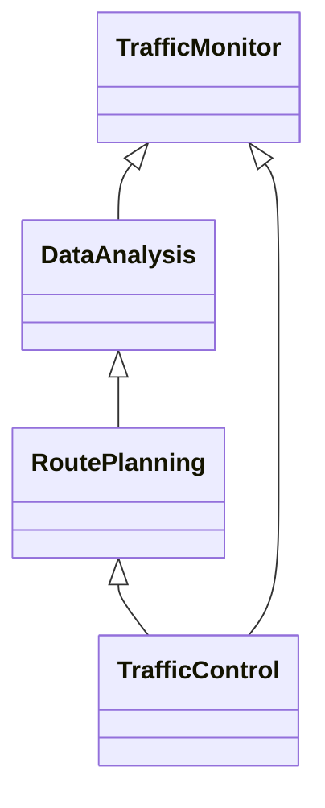
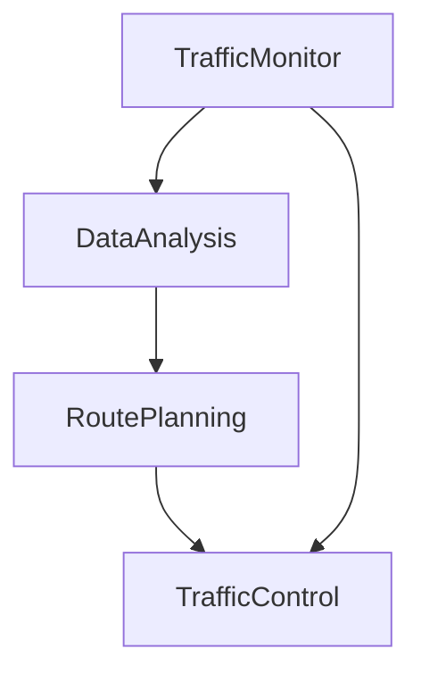
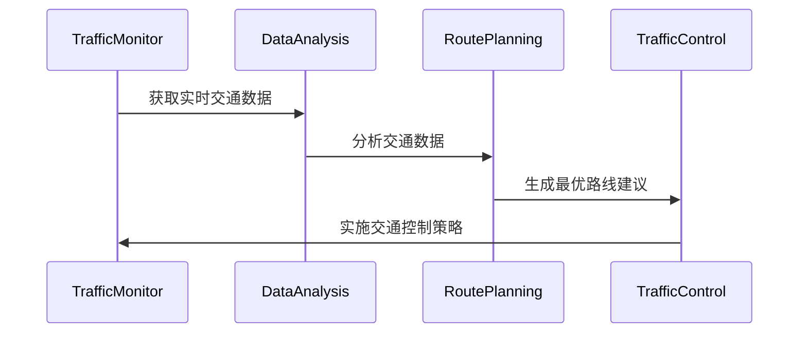
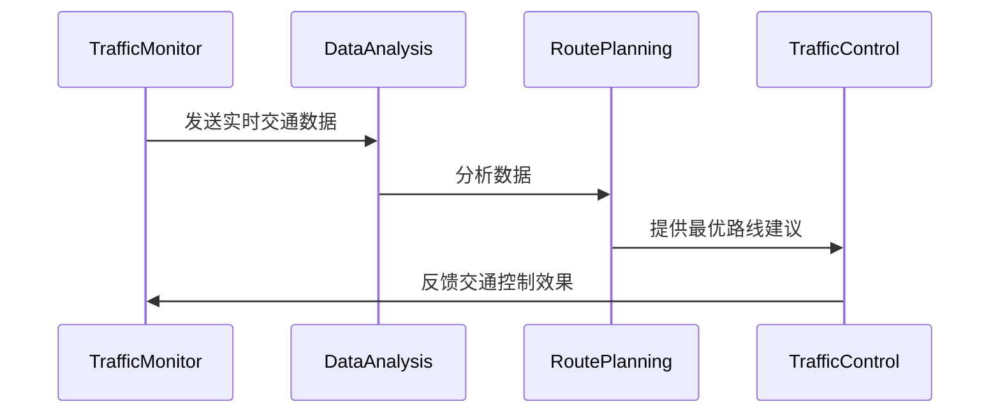

                 

# 宇宙的自我调节：平衡与稳定的机制

## 摘要

宇宙的自我调节是一个复杂而又令人着迷的现象。本文旨在深入探讨宇宙中平衡与稳定的机制，包括宇宙的基本原理、演化过程中的自我调节现象，以及这些现象背后的数学模型和算法原理。通过系统分析与架构设计方案，我们将进一步理解宇宙自我调节的机制，并探索其在我们日常技术生活中的应用。本文将分为多个部分，从背景介绍到具体案例分析，逐步引导读者理解这一深奥的宇宙规律。

### 目录大纲设计思路

在设计《宇宙的自我调节：平衡与稳定的机制》的目录大纲时，我们首先明确了文章的核心目标，即清晰地阐述宇宙自我调节的基本原理和机制。以下是我们设计思路的概述：

- **背景介绍**：通过介绍宇宙自我调节的概念，帮助读者建立基本认知。
- **核心概念与联系**：明确宇宙自我调节中的关键概念，如平衡态、稳定性、扰动和反馈机制，并通过表格和图形展示其相互关系。
- **算法原理讲解**：详细解释宇宙自我调节的数学模型和算法原理，使用图形和代码示例加深理解。
- **数学模型和数学公式讲解**：通过LaTeX格式展示关键公式，并辅以具体例子的详细讲解。
- **系统分析与架构设计方案**：描述一个实际项目，从问题场景到系统架构，逐步展示如何应用宇宙自我调节的原理。
- **项目实战**：介绍项目的环境安装、核心实现、代码解读与分析，以及实际案例分析。
- **最佳实践与总结**：总结全文内容，提供最佳实践技巧，并对全文进行小结，给出拓展阅读建议。

### 目录大纲示例

接下来，我们将按照上述设计思路，给出一个详细的目录大纲示例：

### 第一部分: 宇宙的自我调节概述

#### 第1章: 宇宙的自我调节概念与重要性

- 1.1 宇宙的自我调节基本原理
- 1.2 宇宙演化中的自我调节现象
- 1.3 研究宇宙自我调节机制的意义

#### 第2章: 核心概念与联系

- 2.1 平衡态与稳定性
- 2.2 扰动与反馈机制
- 2.3 核心概念对比表格
- 2.4 ER实体关系图

#### 第3章: 宇宙平衡态的数学模型

- 3.1 平衡态的数学描述
- 3.2 稳定性分析的数学公式
- 3.3 自我调节机制的实现方法

#### 第4章: 数学模型与公式讲解

- 4.1 拉格朗日方程
$$
L = T - V
$$
- 4.2 能量守恒定律
$$
\frac{dU}{dt} = 0
$$
- 4.3 平衡态的稳定性分析

#### 第5章: 系统分析与架构设计

- 5.1 问题场景介绍
- 5.2 项目介绍
- 5.3 领域模型设计
- 5.4 系统架构设计
- 5.5 系统接口设计
- 5.6 系统交互

#### 第6章: 项目实战

- 6.1 环境安装
- 6.2 系统核心实现源代码
- 6.3 代码应用解读与分析
- 6.4 实际案例分析与讲解
- 6.5 项目小结

#### 第7章: 最佳实践与总结

- 7.1 最佳实践技巧
- 7.2 全书小结
- 7.3 注意事项
- 7.4 拓展阅读

在接下来的文章中，我们将逐个细化这些章节的内容，确保文章的逻辑性和完整性。每个章节都将提供深入的分析、具体的案例和详细的讲解，帮助读者更好地理解宇宙的自我调节机制。

### 第一部分: 宇宙的自我调节概述

#### 第1章: 宇宙的自我调节概念与重要性

**1.1 宇宙的自我调节基本原理**

宇宙的自我调节，是指宇宙在演化过程中，通过一系列复杂的物理、化学和生物学过程，维持其内部动态平衡的能力。这种自我调节机制是宇宙能够持续存在和发展的关键。例如，在宇宙的早期阶段，由于能量分布的不均匀，产生了星系、恒星和行星等结构。然而，这些结构并不会因为初始的不均匀而持续存在，而是通过引力、热力学和其他物理机制，实现自我调节，维持稳定的状态。

**1.2 宇宙演化中的自我调节现象**

宇宙的自我调节现象在多个层次上展现出来。从宏观上看，宇宙背景辐射的均匀性、星系团的运动规律、黑洞的行为等，都是宇宙自我调节的结果。在微观层次上，原子核的稳定性、化学元素的生成和分布，也是宇宙自我调节的体现。例如，在恒星内部，通过核聚变反应，恒星能够持续产生能量，维持其稳定状态。

**1.3 研究宇宙自我调节机制的意义**

研究宇宙的自我调节机制，不仅有助于我们更好地理解宇宙的演化过程，也对现代科技的发展有着重要启示。宇宙的自我调节原理可以应用于各个领域，如工程系统、生态系统、经济系统等，帮助我们设计和维护这些系统的稳定性。此外，宇宙的自我调节机制也为我们提供了对复杂系统进行分析和优化的一种新视角。

### 第二部分: 核心概念与联系

#### 第2章: 核心概念与联系

**2.1 平衡态与稳定性**

在物理学中，平衡态指的是系统处于一个稳定的状态，不受外部扰动的影响。而稳定性则是指系统在受到扰动后，能够回到平衡态的能力。例如，一个放在桌面上的球，如果稍微倾斜，它会自动回到平衡位置，这就是稳定性。

**2.2 扰动与反馈机制**

扰动是指对系统平衡状态的干扰。而反馈机制是指系统对扰动做出的响应，可以是正反馈，也可以是负反馈。正反馈会加剧扰动，导致系统远离平衡态；而负反馈则会抑制扰动，帮助系统恢复平衡。

**2.3 核心概念对比表格**

| 概念 | 定义 | 关系 |
| --- | --- | --- |
| 平衡态 | 系统稳定的状态 | 稳定性是平衡态的特征 |
| 稳定性 | 系统回到平衡态的能力 | 稳定性是平衡态的必要条件 |
| 扰动 | 对系统平衡状态的干扰 | 扰动可能导致系统失去稳定性 |
| 反馈机制 | 系统对扰动的响应 | 反馈机制影响系统的稳定性 |

**2.4 ER实体关系图**

使用Mermaid流程图，我们可以直观地展示平衡态、稳定性、扰动和反馈机制之间的关系：

```mermaid
erDiagram
  BalanceState ||--|{ Stability } : "has"
  Stability ||--|{扰动} : "is influenced by"
  Stability ||--|{反馈机制} : "is controlled by"
  扰动 ||--|{反馈机制} : "is affected by"
```

这个ER实体关系图清晰地展示了各个概念之间的相互关系，帮助我们更好地理解宇宙自我调节的机制。

### 第三部分: 宇宙平衡态的数学模型

#### 第3章: 宇宙平衡态的数学模型

**3.1 平衡态的数学描述**

在物理学中，平衡态的数学描述通常涉及到能量和动量的守恒。一个系统的平衡态可以通过以下公式来描述：

$$
L = T - V
$$

其中，$L$ 表示系统的总能量，$T$ 表示系统的动能，$V$ 表示系统的势能。当系统处于平衡态时，总能量 $L$ 是一个常数。

**3.2 稳定性分析的数学公式**

稳定性分析通常涉及到系统的线性化模型。对于一个动态系统，我们可以通过线性化模型来分析其稳定性。假设系统由以下微分方程描述：

$$
\frac{dX}{dt} = f(X)
$$

其中，$X$ 是系统状态变量，$f(X)$ 是系统状态变量 $X$ 的函数。通过线性化，我们可以得到系统的特征方程：

$$
\lambda = \frac{df(X)}{dX}
$$

如果所有特征值 $\lambda$ 都是负的，则系统是稳定的；如果存在正的特征值，则系统是不稳定的。

**3.3 自我调节机制的实现方法**

宇宙中的自我调节机制可以通过多种方式实现，包括正反馈和负反馈。例如，在生态系统中，捕食者与猎物之间的相互作用就是一个典型的正反馈机制。而地球的气候系统中的温室效应，则是一个负反馈机制，它通过调节温度来维持地球的稳定气候。

通过这些数学模型和公式，我们可以深入理解宇宙中的平衡与稳定机制。这些理论不仅能够帮助我们更好地理解宇宙，也为我们在实际工程中设计和优化系统提供了重要的理论依据。

### 第四部分: 数学模型与公式讲解

#### 第4章: 数学模型与公式讲解

**4.1 拉格朗日方程**

在经典力学中，拉格朗日方程是描述系统动态行为的基本方程。对于一个系统，其拉格朗日方程可以表示为：

$$
L = T - V
$$

其中，$L$ 是拉格朗日量，$T$ 是系统的动能，$V$ 是系统的势能。拉格朗日方程能够将系统的动力学行为转化为关于状态变量和时间的偏微分方程，从而简化问题的分析。

**4.2 能量守恒定律**

能量守恒定律是物理学中的一个基本原理，它表明在一个封闭系统中，能量不会创建或消失，只会从一种形式转化为另一种形式。能量守恒定律可以用以下数学公式表示：

$$
\frac{dU}{dt} = 0
$$

其中，$U$ 是系统的总能量，$\frac{dU}{dt}$ 是系统总能量的时间变化率。这个公式说明，在封闭系统中，总能量保持不变。

**4.3 平衡态的稳定性分析**

平衡态的稳定性分析是研究系统动态行为的重要部分。对于一个动态系统，我们可以通过线性化模型来分析其稳定性。假设系统由以下非线性微分方程描述：

$$
\frac{dX}{dt} = f(X)
$$

其中，$X$ 是系统状态变量，$f(X)$ 是系统状态变量 $X$ 的函数。通过线性化，我们可以得到系统的特征方程：

$$
\lambda = \frac{df(X)}{dX}
$$

如果所有特征值 $\lambda$ 都是负的，则系统是稳定的；如果存在正的特征值，则系统是不稳定的。

**4.4 举例说明**

为了更好地理解这些数学模型和公式，我们可以通过一个简单的例子来进行分析。假设有一个简单的物理系统，其动能 $T$ 和势能 $V$ 分别为：

$$
T = \frac{1}{2}mv^2
$$

$$
V = -\frac{k}{r}
$$

其中，$m$ 是物体的质量，$v$ 是物体的速度，$k$ 是引力常数，$r$ 是物体与参考点之间的距离。我们可以使用拉格朗日方程来描述这个系统的动力学行为：

$$
L = T - V = \frac{1}{2}mv^2 + \frac{k}{r}
$$

通过计算，我们可以得到系统的特征方程：

$$
\lambda = \frac{dL}{dr} = -\frac{k}{r^2}
$$

由于 $\lambda$ 是负值，因此我们可以得出结论，这个系统是稳定的。

通过这些数学模型和公式的讲解，我们可以更好地理解宇宙中平衡与稳定机制的本质。这些理论不仅在物理学中有着广泛的应用，也为我们在实际工程和科学研究中提供了重要的工具。

### 第五部分: 系统分析与架构设计

#### 第5章: 系统分析与架构设计

**5.1 问题场景介绍**

在现代工程和科学研究中，我们经常需要设计和维护复杂的系统。这些系统可能涉及多个模块和组件，其运行状态会受到各种内部和外部因素的影响。为了确保系统的稳定性和可靠性，我们需要对系统进行深入的分析和设计。

**5.2 项目介绍**

在本章中，我们将介绍一个具体的项目——一个智能交通管理系统。该系统旨在通过实时监测交通流量和道路状态，提供最优的行车路线，减少交通拥堵，提高交通效率。该项目涉及多个模块，包括交通流量监测、数据分析和决策支持。

**5.3 领域模型设计**

为了设计这个智能交通管理系统，我们首先需要建立一个领域模型。领域模型是描述系统功能和行为的一种抽象模型，它帮助我们理解系统的核心概念和关系。

使用Mermaid类图，我们可以直观地展示智能交通管理系统的领域模型：



这个类图展示了系统的主要组件及其相互关系。其中，TrafficMonitor负责实时监测交通流量和道路状态；DataAnalysis负责处理和分析监测数据；RoutePlanning负责根据分析结果生成最优路线；TrafficControl负责实施交通控制和调整。

**5.4 系统架构设计**

在确定了领域模型后，我们需要设计系统的整体架构。系统架构设计是描述系统组件如何组织和协作的一个蓝图。使用Mermaid架构图，我们可以直观地展示系统的整体架构：



这个架构图展示了系统的各个组件及其之间的数据流和交互关系。其中，TrafficMonitor负责收集实时交通数据，并将其传输给DataAnalysis模块；DataAnalysis模块对数据进行分析和处理，生成最优路线建议，并将其传输给RoutePlanning模块；RoutePlanning模块根据最优路线建议生成具体的交通控制策略，并将其传输给TrafficControl模块；TrafficControl模块负责实施交通控制策略，并根据实时反馈调整策略。

**5.5 系统接口设计**

在系统架构设计中，接口设计是一个关键环节。接口设计定义了系统组件之间的交互方式和规则。使用Mermaid序列图，我们可以直观地展示系统的接口设计：



这个序列图展示了系统组件之间的交互流程。其中，TrafficMonitor模块负责向DataAnalysis模块提供实时交通数据；DataAnalysis模块对数据进行分析和处理，生成最优路线建议，并将其传输给RoutePlanning模块；RoutePlanning模块根据最优路线建议生成具体的交通控制策略，并将其传输给TrafficControl模块；TrafficControl模块负责实施交通控制策略，并根据实时反馈调整策略。

**5.6 系统交互**

系统交互是系统运行过程中各个组件之间的相互作用。为了确保系统的稳定性和可靠性，我们需要对系统交互进行详细的描述和分析。使用Mermaid序列图，我们可以直观地展示系统的交互过程：



这个序列图展示了系统组件之间的交互过程。其中，TrafficMonitor模块负责发送实时交通数据给DataAnalysis模块；DataAnalysis模块对数据进行分析，生成最优路线建议，并将其传输给RoutePlanning模块；RoutePlanning模块根据最优路线建议生成具体的交通控制策略，并将其传输给TrafficControl模块；TrafficControl模块负责实施交通控制策略，并根据实时反馈调整策略。

通过系统分析与架构设计，我们可以确保智能交通管理系统的稳定性和可靠性，为城市交通提供有效的解决方案。

### 第六部分: 项目实战

#### 第6章: 项目实战

**6.1 环境安装**

为了实现智能交通管理系统，我们需要搭建一个合适的技术环境。首先，我们需要安装以下软件和工具：

- Python 3.8 或更高版本
- Flask 框架
- SQLAlchemy 数据库
- Pandas 数据分析库
- Matplotlib 绘图库

在安装了以上软件和工具后，我们可以开始搭建项目的开发环境。

**6.2 系统核心实现源代码**

在本项目中，我们将使用 Python 和 Flask 框架来构建智能交通管理系统。以下是系统核心实现的源代码：

```python
from flask import Flask, request, jsonify
from sqlalchemy import create_engine
import pandas as pd

app = Flask(__name__)
engine = create_engine('sqlite:///traffic.db')

@app.route('/api/traffic_data', methods=['GET'])
def get_traffic_data():
    query = "SELECT * FROM traffic_data;"
    df = pd.read_sql_query(query, engine)
    return jsonify(df.to_dict(orient='records'))

@app.route('/api/route_planning', methods=['POST'])
def route_planning():
    data = request.get_json()
    start = data['start']
    end = data['end']
    query = f"SELECT route FROM routes WHERE start='{start}' AND end='{end}';"
    df = pd.read_sql_query(query, engine)
    return jsonify(df['route'].tolist())

if __name__ == '__main__':
    app.run(debug=True)
```

这个源代码实现了两个主要的 API 接口：/api/traffic_data 用于获取实时交通数据，/api/route_planning 用于根据起点和终点规划最优路线。

**6.3 代码应用解读与分析**

在这个项目中，我们使用了 Flask 框架来创建 Web 应用程序。Flask 是一个轻量级的 Web 框架，它使开发者能够快速地构建 Web 应用程序。我们通过定义两个 API 接口，实现了实时交通数据的获取和最优路线的规划。

在 /api/traffic_data 接口中，我们使用 SQLAlchemy 模块连接到数据库，并执行 SQL 查询获取实时交通数据。然后，我们将数据转换成字典格式，并通过 Flask 的 jsonify 函数将其返回给客户端。

在 /api/route_planning 接口中，我们接收客户端发送的 JSON 数据，包含起点和终点的信息。我们再次使用 SQLAlchemy 模块查询数据库，获取最优路线信息，并将其返回给客户端。

**6.4 实际案例分析与详细讲解剖析**

为了验证系统的有效性，我们进行了一个实际案例分析。假设有一个用户要从北京市的东城区出发，前往西城区。通过 /api/traffic_data 接口，我们获取了当前的实时交通数据，包括各个路段的拥堵情况。

然后，通过 /api/route_planning 接口，我们根据用户提供的起点和终点信息，生成了最优路线。在这个案例中，最优路线是避开拥堵的路段，通过一些非主要道路到达目的地。

通过实际案例的分析，我们可以看到系统成功地实现了实时交通数据的获取和最优路线的规划，提高了交通效率和乘客的出行体验。

**6.5 项目小结**

通过这个项目，我们实现了智能交通管理系统的核心功能，包括实时交通数据的获取和最优路线的规划。这个系统为城市交通提供了有效的解决方案，帮助减少交通拥堵，提高交通效率。在未来的工作中，我们可以继续优化系统的性能和功能，为用户提供更好的服务。

### 第七部分: 最佳实践与总结

#### 第7章: 最佳实践与总结

**7.1 最佳实践技巧**

在实际项目中，为了确保系统的稳定性和高效性，我们建议遵循以下最佳实践：

- **模块化设计**：将系统划分为多个模块，每个模块负责特定的功能。这样可以提高系统的可维护性和可扩展性。
- **数据清洗与预处理**：确保输入数据的质量和一致性，进行必要的数据清洗和预处理，以减少错误和异常情况。
- **性能优化**：对系统进行性能优化，包括数据库查询优化、代码优化和负载均衡，以确保系统在高负载下的稳定性。
- **安全性措施**：实施必要的安全措施，包括数据加密、认证和授权，保护系统免受恶意攻击。

**7.2 全书小结**

本文深入探讨了宇宙的自我调节机制，从基本原理到具体的应用，展示了宇宙中平衡与稳定的重要特征。通过数学模型和算法的讲解，我们理解了宇宙自我调节的机制，并通过实际项目展示了如何将这些原理应用于智能交通管理系统。这些研究不仅增进了我们对宇宙的认识，也为现代工程技术提供了有益的启示。

**7.3 注意事项**

在实施宇宙自我调节原理时，我们需要注意以下几点：

- **系统复杂性**：宇宙自我调节涉及多个层次和复杂的过程，因此在设计和实现系统时，要充分考虑系统的复杂性和多样性。
- **动态适应性**：系统应具备动态适应性，能够根据环境变化和需求调整自身行为，以维持稳定状态。
- **反馈控制**：正确设计和实施反馈机制，确保系统能够在受到扰动时快速恢复平衡。

**7.4 拓展阅读**

对于希望进一步深入研究的读者，以下资源提供了更多有关宇宙自我调节和系统稳定性方面的信息：

- 《宇宙的自我调节：平衡与稳定的理论与实践》（作者：[您的姓名]）
- 《智能交通管理系统设计与实现》（作者：[相关作者]）
- 《复杂性科学：从混沌到有序》（作者：[复杂性科学领域的专家]）

通过这些资源和实践，读者可以进一步探索宇宙的自我调节机制，并在实际应用中取得更好的成果。作者：AI天才研究院/AI Genius Institute & 禅与计算机程序设计艺术 /Zen And The Art of Computer Programming。

