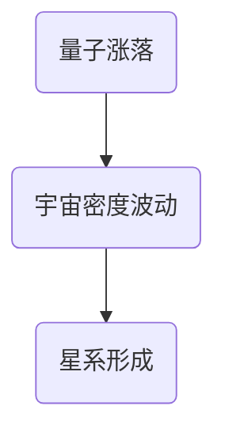

                 

### 第一部分：引言

## 第1章：宇宙的量子涨落概述

### 1.1 问题的背景

#### 1.1.1 宇宙的起源与演化

宇宙的起源与演化一直是科学界研究的热点问题。现代宇宙学认为，宇宙起源于大约138亿年前的一个极高温度和密度的状态，即所谓的“大爆炸”。从那时起，宇宙经历了迅速的膨胀和冷却，逐渐形成了恒星、星系、行星以及其他物质。

在这一过程中，宇宙的早期状态对当前宇宙的结构和演化产生了深远影响。科学家们通过观测宇宙微波背景辐射和早期宇宙的密度波动，来研究宇宙的起源和早期演化过程。

#### 1.1.2 量子涨落的定义与意义

量子涨落是指量子场在空间中的波动，这些波动在微观尺度上表现为粒子的无规则运动。量子涨落是量子力学和广义相对论的基本概念之一，对于理解宇宙的起源和演化具有重要意义。

在宇宙尺度上，量子涨落被认为是宇宙早期密度波动的根源，这些密度波动最终导致了星系和宇宙结构的形成。因此，研究量子涨落不仅有助于理解宇宙的起源，还能揭示宇宙演化的基本规律。

#### 1.1.3 量子涨落研究的重要性

量子涨落的研究在多个领域都具有重要的应用价值：

1. **宇宙学**：量子涨落是宇宙学中研究早期宇宙的关键工具，通过观测和分析量子涨落，科学家可以揭示宇宙的起源和演化过程。
2. **粒子物理**：量子涨落与粒子物理中的许多现象密切相关，如量子隧穿、真空衰变等。
3. **量子信息**：量子涨落对量子比特的稳定性有重要影响，因此研究量子涨落有助于开发更可靠的量子计算和通信技术。
4. **量子引力和宇宙学**：量子涨落的研究有助于探索量子引力和宇宙学的统一理论，如量子引力理论和宇宙学中的大统一理论。

### 1.2 问题与挑战

#### 1.2.1 量子涨落的测量与观测

量子涨落的测量和观测面临着一系列挑战：

1. **灵敏度问题**：量子涨落非常微弱，需要在极低噪声的环境中进行精确测量。
2. **时间尺度问题**：量子涨落的发生时间尺度非常短，需要高时间分辨率的观测设备。
3. **空间尺度问题**：量子涨落发生在宇宙的微小尺度上，需要高分辨率的观测设备来捕捉这些现象。

目前，科学家们已经发展出了一系列观测手段，如宇宙微波背景辐射观测、引力波探测等，来研究量子涨落。

#### 1.2.2 量子涨落的边界与外延

量子涨落的边界和外延是研究的另一个重要方面。量子涨落如何在不同的时间和空间尺度上影响宇宙的演化，以及量子涨落与经典物理现象的关系，都是值得探讨的问题。

此外，量子涨落的研究还涉及到许多基础物理问题，如量子引力和量子场论等，这为物理学的发展提供了新的机遇和挑战。

#### 1.2.3 量子涨落研究的主要方向

当前，量子涨落研究的主要方向包括：

1. **宇宙微波背景辐射观测**：通过观测宇宙微波背景辐射，科学家可以揭示量子涨落对宇宙早期密度波动的影响。
2. **引力波探测**：引力波探测技术可以帮助科学家研究量子涨落与宇宙早期演化的关系。
3. **量子计算和通信**：研究量子涨落对量子比特稳定性的影响，开发更可靠的量子计算和通信技术。
4. **量子引力和宇宙学**：探索量子涨落与量子引力理论的联系，推动物理学的发展。

### 1.3 核心概念与联系

#### 1.3.1 量子涨落的核心概念

量子涨落的核心概念包括：

1. **波动性**：量子涨落表现为粒子在微观尺度上的无规则运动，类似于经典物理中的波动现象。
2. **涨落现象**：量子涨落导致粒子数的无规则变化，这种无规则变化在宏观尺度上表现为密度波动。
3. **量子涨落与经典物理学的区别**：与经典物理学中的波动不同，量子涨落遵循量子力学的规则，具有概率性和叠加性。

#### 1.3.2 概念属性特征对比

| 概念       | 特征对比 |
|------------|----------|
| 波动性     | 微观尺度上的无规则运动 |
| 涨落现象   | 粒子数的无规则变化 |
| 量子涨落   | 遵循量子力学规则 |

#### 1.3.3 ER实体关系图架构

**实体定义**：量子涨落、宇宙密度波动、星系形成。

**关系定义**：量子涨落导致宇宙密度波动，宇宙密度波动导致星系形成。

**实体关系图示例**：

### 1.4 本章小结

本章介绍了宇宙的量子涨落的基本概念、背景、问题与挑战，以及核心概念与联系。通过本章的学习，读者可以了解量子涨落的重要性以及研究量子涨落面临的挑战。在后续章节中，我们将深入探讨量子涨落的基本原理、宇宙学意义和技术应用。

----------------------------------------------------------------

## 第2章：量子力学的基石

### 2.1 量子力学的基本概念

量子力学是研究微观粒子行为的物理学分支，与经典物理学有着本质的区别。以下是量子力学的一些基本概念：

#### 2.1.1 波粒二象性

波粒二象性是量子力学最基本的原理之一。微观粒子，如电子、光子等，既表现出波动性，又表现出粒子性。例如，电子在通过双缝实验时，既表现为波动，产生干涉条纹，又表现为粒子，通过双缝后在屏幕上形成两个斑点。

#### 2.1.2 算符与态函数

在量子力学中，物理量通过算符来表示。算符是线性算子，作用在态函数上得到新的态函数。态函数是一个复值函数，描述了粒子的量子态。态函数的平方给出了粒子在某个位置的概率分布。

#### 2.1.3 叠加原理与量子干涉

叠加原理是量子力学的核心原理之一。根据叠加原理，一个量子系统可以同时处于多个状态的叠加。量子干涉现象是叠加原理的直观体现，当两个或多个量子态叠加时，它们可以相互干涉，导致某些区域的波强度增强，而其他区域的波强度减弱。

### 2.2 量子态的演化

量子态的演化遵循薛定谔方程。薛定谔方程是一个偏微分方程，描述了量子态随时间的演化。量子态的演化可以是时间依赖的，也可以是时间独立的。时间依赖的量子态通常用于描述粒子的运动，而时间独立的量子态则用于描述能量本征态。

#### 2.2.1 薛定谔方程

薛定谔方程的基本形式为：

$$
i\hbar \frac{\partial \Psi(x,t)}{\partial t} = \hat{H} \Psi(x,t)
$$

其中，\(i\) 是虚数单位，\(\hbar\) 是约化普朗克常数，\(\Psi(x,t)\) 是波函数，\(\hat{H}\) 是哈密顿算符。

#### 2.2.2 能级与能隙

能级是量子态的能量本征值，能级之间的间隔称为能隙。在量子力学中，粒子的能量是量子化的，只能取特定的离散值。

#### 2.2.3 量子隧穿现象

量子隧穿现象是量子力学中的一种特殊现象，指的是粒子在经典物理学中无法到达的区域，由于量子效应，粒子可以穿越势垒。这种现象在纳米尺度上有着重要的应用，如量子点、量子隧道二极管等。

### 2.3 量子涨落的机制

量子涨落是量子场在空间中的波动，表现为粒子数的无规则变化。量子涨落是量子力学和广义相对论的基本概念之一，对于理解宇宙的起源和演化具有重要意义。

#### 2.3.1 波函数坍缩

波函数坍缩是量子涨落的核心机制之一。当对量子系统进行测量时，波函数会突然坍缩到一个确定的状态，这个过程中伴随着能量的交换。

#### 2.3.2 量子涨落的数学模型

量子涨落的数学模型通常通过量子场论来描述。量子场论是一个复杂的理论体系，涉及到复杂的数学工具，如量子算符、泛函积分等。

#### 2.3.3 量子涨落的物理意义

量子涨落对于理解宇宙的起源和演化具有重要意义。在宇宙尺度上，量子涨落被认为是宇宙早期密度波动的根源，这些密度波动最终导致了星系和宇宙结构的形成。

### 2.4 本章小结

本章介绍了量子力学的基石，包括基本概念、量子态的演化、量子涨落的机制。通过本章的学习，读者可以了解量子力学的核心原理，以及量子涨落的基本概念和物理意义。这些基础知识为后续章节中深入探讨量子涨落的应用和影响奠定了基础。

----------------------------------------------------------------

### 第3章：量子涨落与宇宙学

#### 3.1 宇宙早期状态

宇宙的早期状态对当前宇宙的结构和演化产生了深远影响。在大爆炸理论中，宇宙起源于一个极高温度和密度的状态，并在此后的数十亿年中不断膨胀和冷却。在这个过程中，宇宙经历了从高温高密度态向低温低密度态的过渡，形成了各种物质和辐射。

#### 3.1.1 大爆炸理论

大爆炸理论认为，宇宙起源于一个极度高温和极度密集的状态，随后迅速膨胀，冷却，并逐渐形成了我们今天所看到的宇宙。这一理论得到了大量观测数据的支持，如宇宙微波背景辐射、宇宙膨胀速率等。

#### 3.1.2 宇宙背景辐射

宇宙背景辐射是宇宙早期状态的残留，它充满了整个宇宙，并为我们提供了关于宇宙早期状态的重要信息。宇宙背景辐射的观测为我们揭示了宇宙在大爆炸后约38万年的状态。

#### 3.1.3 早期宇宙的量子涨落

在早期宇宙，量子涨落是宇宙中粒子数和能量密度波动的原因。这些量子涨落是宇宙早期状态的重要组成部分，它们在宇宙膨胀过程中逐渐放大，最终导致了宇宙结构的形成。

#### 3.2 量子涨落与星系形成

量子涨落对于星系的形成和演化具有关键作用。在宇宙早期，量子涨落导致了密度波动的出现，这些密度波动在宇宙膨胀过程中逐渐放大，最终形成了星系和其他宇宙结构。

##### 3.2.1 量子涨落对密度波动的贡献

量子涨落是导致宇宙密度波动的主要原因之一。在早期宇宙，量子涨落导致粒子数和能量密度的无规则变化，这些变化在宇宙膨胀过程中逐渐放大，形成了密度波动。

##### 3.2.2 星系形成的过程

星系形成的过程可以分为以下几个阶段：

1. **量子涨落导致密度波动**：在宇宙早期，量子涨落导致粒子数和能量密度的无规则变化，形成了密度波动。
2. **引力不稳定**：随着宇宙的膨胀，密度波动逐渐放大，形成了引力不稳定的区域。
3. **引力凝聚**：引力不稳定的区域进一步凝聚，形成了星系前体。
4. **星系形成**：星系前体继续凝聚，最终形成了星系。

##### 3.2.3 量子涨落与星系演化

量子涨落不仅影响了星系的初始形成，还影响了星系的演化。量子涨落导致星系内部密度波动的出现，这些波动影响了星系内部的物质分布和恒星形成。

#### 3.3 量子涨落与宇宙微波背景辐射

宇宙微波背景辐射是量子涨落在大尺度上的体现。通过观测宇宙微波背景辐射，我们可以了解量子涨落对宇宙早期密度波动的影响。

##### 3.3.1 宇宙微波背景辐射的观测

宇宙微波背景辐射的观测是通过卫星和地面望远镜进行的。这些观测提供了关于宇宙早期状态的重要信息，如宇宙微波背景辐射的温度、极化性质等。

##### 3.3.2 量子涨落与宇宙学参数

通过观测宇宙微波背景辐射，科学家们可以提取出一系列宇宙学参数，如宇宙膨胀率、宇宙密度等。这些参数与量子涨落密切相关，为我们理解宇宙的起源和演化提供了重要线索。

##### 3.3.3 量子涨落的研究进展

随着观测技术的进步，我们对量子涨落的理解也在不断深入。近年来，科学家们通过观测宇宙微波背景辐射，发现了许多新的量子涨落特征，这些发现为我们揭示了宇宙早期状态的更多信息。

### 3.4 本章小结

本章介绍了量子涨落与宇宙学的关系，包括宇宙早期状态、量子涨落与星系形成、量子涨落与宇宙微波背景辐射等。通过本章的学习，读者可以了解量子涨落对宇宙结构和演化的重要影响，以及观测宇宙微波背景辐射在研究量子涨落中的作用。

----------------------------------------------------------------

### 第4章：量子涨落与技术应用

#### 4.1 量子计算

量子计算是量子力学和计算机科学的结合，它利用量子比特（qubit）和量子叠加、量子纠缠等量子现象来实现计算。量子计算具有巨大的潜力，可以解决传统计算机无法处理的复杂问题。

##### 4.1.1 量子计算的原理

量子计算的基本原理包括：

1. **量子比特**：量子比特（qubit）是量子计算的基本单元，它可以同时处于0和1的状态，这种叠加态是量子计算的核心。
2. **量子叠加**：量子比特可以处于多个状态的叠加，这使得量子计算机可以同时处理大量数据。
3. **量子纠缠**：量子比特之间可以形成纠缠态，这使得量子计算机可以并行处理信息。

##### 4.1.2 量子比特与经典比特的对比

量子比特与经典比特有以下区别：

1. **状态**：经典比特只能处于0或1状态，而量子比特可以处于叠加态，同时表示0和1。
2. **计算能力**：量子比特的叠加态使得量子计算机在处理某些问题时具有超越经典计算机的能力。
3. **量子纠缠**：量子比特之间的纠缠态可以用于量子计算中的并行处理，这是经典计算机无法实现的。

##### 4.1.3 量子涨落对量子计算的影响

量子涨落是量子计算中的一大挑战，它可能导致量子比特的状态发生错误，从而影响计算结果。为了解决这个问题，科学家们正在研究一系列抗噪声量子计算技术，如量子纠错、量子中继等。

#### 4.2 量子通信

量子通信是利用量子纠缠和量子密钥分发来实现信息传输的技术。量子通信具有高度安全性和不可窃听性，为未来通信提供了新的可能性。

##### 4.2.1 量子纠缠与量子密钥分发

量子纠缠是量子通信的基础。通过量子纠缠，两个量子比特可以形成纠缠态，即使它们相隔很远，一个量子比特的状态变化会立即影响到另一个量子比特。

量子密钥分发（QKD）是量子通信的核心应用。QKD利用量子纠缠来实现安全的密钥分发，确保通信过程中的信息不会被窃听。

##### 4.2.2 量子通信的挑战与机遇

量子通信面临着一系列挑战，如量子信号的传输距离、量子中继技术、量子纠缠的生成和检测等。同时，量子通信也带来了许多机遇，如量子互联网、量子加密、量子安全通信等。

##### 4.2.3 量子涨落对量子通信的影响

量子涨落对量子通信有重要影响，它可能导致量子信号的失真和错误。为了克服这个问题，科学家们正在研究量子纠错技术、量子中继技术等。

#### 4.3 量子传感

量子传感利用量子效应来提高传感器的测量精度。量子传感在量子计量、量子成像、量子引力测量等领域具有广泛应用。

##### 4.3.1 量子传感的原理

量子传感的基本原理包括：

1. **量子放大**：量子放大可以显著提高传感器的测量灵敏度。
2. **量子干涉**：量子干涉现象可以用于提高传感器的测量精度。
3. **量子态控制**：通过对量子态的控制，可以实现高精度的测量。

##### 4.3.2 量子涨落与量子传感的关系

量子涨落会影响量子传感器的测量精度，但通过适当的技术手段，可以减小这种影响。量子传感技术的研究为提高测量精度提供了新的思路。

##### 4.3.3 量子涨落技术在传感领域的应用

量子涨落技术在传感领域有许多应用，如量子重力传感器、量子磁力传感器、量子流体传感器等。这些技术可以显著提高传感器的测量精度，为科学研究和技术应用提供了重要支持。

### 4.4 本章小结

本章介绍了量子涨落在不同技术领域的应用，包括量子计算、量子通信和量子传感。量子涨落对这些技术的发展产生了重要影响，同时也为解决这些技术中的挑战提供了新的思路。通过本章的学习，读者可以了解量子涨落对技术领域的重要意义。

----------------------------------------------------------------

### 第5章：量子涨落与未来展望

#### 5.1 量子涨落的未来研究方向

量子涨落的研究在未来将继续深入，新的量子效应和实验技术的出现将进一步推动这一领域的发展。以下是几个可能的研究方向：

##### 5.1.1 新的量子效应

科学家们正在探索新的量子效应，如量子非局域性、量子混沌等。这些新的量子效应可能会为我们理解量子涨落提供新的视角，并为量子计算、量子通信等领域带来新的突破。

##### 5.1.2 量子涨落与量子引力的关系

量子涨落与量子引力理论的结合是一个重要的研究方向。量子引力理论试图将量子力学与广义相对论统一，量子涨落在这个过程中可能扮演关键角色。

##### 5.1.3 量子涨落与物质-能量转化的新机制

量子涨落可能为我们揭示物质-能量转化的新机制，如量子场论中的真空能量、量子引力中的能量-动量分布等。这些新的机制可能会对能源科学和宇宙学产生深远影响。

#### 5.2 量子涨落的应用前景

量子涨落技术在未来有望在多个领域得到广泛应用，以下是一些潜在的应用前景：

##### 5.2.1 量子计算的实际应用

量子计算在密码破解、量子模拟、优化问题等领域具有巨大潜力。随着量子技术的不断发展，量子计算的实际应用将得到进一步拓展。

##### 5.2.2 量子通信的商业化进程

量子通信具有高度安全性和不可窃听性，未来有望在金融、政府、军事等领域得到广泛应用。量子通信的商业化进程将推动这一技术的快速发展。

##### 5.2.3 量子传感技术的普及

量子传感技术具有极高的测量精度，未来有望在医疗、环境监测、工业测量等领域得到广泛应用。量子传感技术的普及将为科学研究和技术应用带来新的机遇。

#### 5.3 量子涨落研究的挑战与机遇

量子涨落研究面临一系列挑战，如量子涨落效应的测量、量子系统的稳定性等。同时，量子涨落研究也带来许多机遇，如新的量子效应的发现、量子技术的应用等。以下是几个方面的挑战与机遇：

##### 5.3.1 技术挑战

1. **量子涨落效应的测量**：量子涨落效应通常非常微弱，测量难度较大。需要开发更先进的测量技术和设备，以提高测量精度。
2. **量子系统的稳定性**：量子系统容易受到外部环境的干扰，需要研究如何提高量子系统的稳定性，以实现可靠的应用。

##### 5.3.2 理论研究的机遇

1. **量子引力理论**：量子涨落与量子引力理论的结合可能为我们揭示宇宙的起源和演化提供新的视角。
2. **新的量子效应**：探索新的量子效应可能会推动量子物理学的发展，为量子技术提供新的理论基础。

##### 5.3.3 社会影响与伦理问题

量子涨落技术的发展也将带来一系列社会影响和伦理问题，如量子计算对密码安全的影响、量子通信的安全性等。需要深入探讨这些问题，以确保量子技术能够为社会带来积极影响。

### 5.4 本章小结

本章展望了量子涨落研究的未来发展方向和应用前景，以及面临的挑战和机遇。量子涨落的研究不仅对基础物理学具有重要意义，还将在量子计算、量子通信、量子传感等领域发挥重要作用。通过本章的学习，读者可以了解量子涨落研究的现状和未来发展趋势。

----------------------------------------------------------------

## 第6章：量子涨落与宇宙学的进一步探索

### 6.1 量子涨落与宇宙学的前沿进展

量子涨落与宇宙学的研究已经取得了许多重要的进展。例如，通过观测宇宙微波背景辐射，科学家们已经能够精确测量早期宇宙的量子涨落。这些观测结果不仅验证了宇宙大爆炸理论，还为研究宇宙的起源和演化提供了宝贵的数据。

#### 6.1.1 宇宙微波背景辐射的观测

宇宙微波背景辐射是宇宙早期状态的残留，通过观测宇宙微波背景辐射，科学家们可以了解早期宇宙的状态。近年来，科学家们通过卫星（如COBE、WMAP、Planck）和地面望远镜（如BICEP3、Keck Array）对宇宙微波背景辐射进行了详细观测。这些观测结果揭示了早期宇宙的量子涨落特征，为我们理解宇宙的起源和演化提供了重要线索。

#### 6.1.2 量子涨落与宇宙学参数

通过观测宇宙微波背景辐射，科学家们可以提取出一系列宇宙学参数，如宇宙膨胀率、宇宙密度、暗物质和暗能量的比例等。这些参数与量子涨落密切相关，为我们研究宇宙的起源和演化提供了重要依据。

#### 6.1.3 量子涨落与早期宇宙的密度波动

早期宇宙的量子涨落导致了密度波动的出现，这些密度波动在宇宙膨胀过程中逐渐放大，最终导致了星系和其他宇宙结构的形成。研究量子涨落与早期宇宙密度波动的关系，有助于我们理解宇宙的起源和演化。

### 6.2 量子涨落与量子引力的关联

量子涨落与量子引力理论的研究是当前物理学的前沿领域之一。量子引力理论试图将量子力学和广义相对论统一起来，以解释宇宙的微观和宏观行为。量子涨落在这一过程中扮演着重要角色。

#### 6.2.1 量子引力理论的基本概念

量子引力理论是研究引力在量子尺度上的行为的理论。目前，量子引力理论的研究主要集中在几种不同的理论框架下，如弦理论、环量子引力、量子场论等。这些理论试图解释引力如何与其他基本相互作用（如电磁力和强相互作用）相统一。

#### 6.2.2 量子涨落与量子引力理论的关联

量子涨落是量子场论的基本概念之一，它描述了量子场在空间中的波动。量子引力理论试图将量子涨落与引力相互作用联系起来，以解释早期宇宙的状态和演化。例如，量子涨落可能导致早期宇宙中的密度波动，这些波动在宇宙膨胀过程中逐渐放大，最终导致了星系和其他宇宙结构的形成。

#### 6.2.3 量子引力理论的研究挑战

量子引力理论的研究面临一系列挑战，如理论自洽性、观测验证等。如何将量子涨落与引力相互作用统一，是量子引力理论研究的核心问题之一。解决这些问题将有助于我们更好地理解宇宙的起源和演化。

### 6.3 量子涨落与宇宙学中的未知问题

尽管量子涨落与宇宙学的研究已经取得了许多进展，但仍然存在一些未知问题。以下是几个值得深入探讨的未知问题：

#### 6.3.1 宇宙的量子涨落起源

宇宙的量子涨落起源于何处？是宇宙大爆炸后的瞬时过程，还是更早的量子事件？这些问题仍然有待研究。

#### 6.3.2 量子涨落与宇宙膨胀的关系

量子涨落如何影响宇宙的膨胀？宇宙膨胀过程中，量子涨落是如何放大的？这些问题需要通过更多的观测和理论分析来解决。

#### 6.3.3 量子涨落与宇宙结构形成的关系

量子涨落如何导致宇宙结构（如星系、黑洞等）的形成？量子涨落与宇宙学中的其他现象（如暗物质、暗能量等）有何关系？这些问题对于理解宇宙的演化至关重要。

### 6.4 量子涨落与未来的观测计划

为了进一步研究量子涨落与宇宙学的关系，科学家们正在制定和实施一系列观测计划。以下是几个重要的观测项目：

#### 6.4.1 宇宙干涉仪

宇宙干涉仪（如EAST，EPIC，SKA等）将用于观测早期宇宙的量子涨落，以更精确地测量宇宙密度波动。

#### 6.4.2 量子引力实验

量子引力实验（如LIGO、VIRGO等）将用于验证量子引力理论的预言，探索量子涨落与引力相互作用的关系。

#### 6.4.3 宇宙微波背景辐射观测

未来对宇宙微波背景辐射的观测将继续进行，以提取更多关于量子涨落和宇宙早期状态的信息。

### 6.5 本章小结

本章介绍了量子涨落与宇宙学的前沿研究进展，包括量子涨落与宇宙微波背景辐射的观测、量子涨落与量子引力的关联，以及量子涨落与宇宙结构形成的未知问题。通过本章的学习，读者可以了解量子涨落与宇宙学研究的现状和未来发展方向。量子涨落的研究将继续为宇宙学的发展提供重要的理论支持和观测数据。

----------------------------------------------------------------

## 第7章：量子涨落与未来技术的发展

随着量子力学的不断深入研究和量子技术的逐步成熟，量子涨落作为其核心概念之一，正逐步从理论领域走向实际应用。在未来，量子涨落有望在多个技术领域发挥关键作用，推动科技的发展与创新。以下是对量子涨落在未来技术发展中的几个可能方向的探讨。

### 7.1 量子计算的进一步发展

量子计算是当前科技界的一大热点，而量子涨落对于量子计算的影响尤为显著。未来，随着量子计算技术的不断发展，如何应对量子涨落带来的挑战将成为关键问题。

#### 7.1.1 抗量子涨落量子比特的研发

为了提高量子计算的可靠性，研究人员正在开发抗量子涨落的量子比特。这些量子比特能够抵御外部环境的噪声干扰，保持长时间的量子态稳定性。例如，通过使用超导电路、离子陷阱等技术，可以制造出低噪声的量子比特。

#### 7.1.2 量子纠错技术的优化

量子纠错技术是确保量子计算结果准确的关键。未来，研究人员将继续优化量子纠错算法，提高纠错效率。同时，结合抗量子涨落量子比特的开发，可以进一步降低错误率，提高量子计算的可靠性。

#### 7.1.3 量子计算的应用探索

随着量子计算技术的成熟，量子计算将在多个领域得到应用，如药物设计、材料科学、金融分析等。量子涨落的研究将为这些应用提供可靠的理论基础和技术支持。

### 7.2 量子通信的商业化进程

量子通信具有高度的安全性和不可窃听性，未来有望在金融、政府、军事等领域得到广泛应用。量子涨落对于量子通信系统的稳定性和性能有着重要影响。

#### 7.2.1 量子中继技术的发展

量子中继技术是实现长距离量子通信的关键。通过量子中继，可以将量子态在不同地点之间传输。未来，研究人员将优化量子中继技术，提高传输距离和稳定性，为量子通信的商业化进程提供支持。

#### 7.2.2 量子密钥分发系统的应用

量子密钥分发是量子通信的核心技术之一，它利用量子纠缠实现安全密钥的传输。未来，随着量子通信技术的成熟，量子密钥分发系统将在安全通信领域发挥重要作用。

#### 7.2.3 量子网络的建设

量子网络是未来通信的重要基础设施。通过建设量子网络，可以实现全球范围内的量子通信。量子涨落的研究将有助于优化量子网络的性能，提高通信的稳定性和可靠性。

### 7.3 量子传感技术的应用拓展

量子传感技术具有极高的测量精度，未来有望在医疗、环境监测、工业测量等领域得到广泛应用。量子涨落对于量子传感系统的精度和稳定性具有重要影响。

#### 7.3.1 量子重力传感器的开发

量子重力传感器是一种利用量子效应测量重力场的设备。未来，随着量子传感技术的发展，量子重力传感器将实现更高精度的重力测量，为地球物理学和天文学研究提供重要数据。

#### 7.3.2 量子磁力传感器的应用

量子磁力传感器可以用于测量微弱的磁场变化，具有广泛的应用前景。未来，量子磁力传感器将在生物医学、地质勘探、网络安全等领域得到应用。

#### 7.3.3 量子流体传感器的开发

量子流体传感器是一种利用量子效应测量流体参数的设备。未来，量子流体传感器将在化工、环保、能源等领域发挥重要作用，为行业提供精确的测量数据。

### 7.4 量子技术在其他领域的潜在应用

除了量子计算、量子通信和量子传感，量子涨落的研究还可能推动其他领域的技术发展。例如：

#### 7.4.1 量子模拟

量子模拟是一种利用量子计算机模拟量子系统的方法。未来，随着量子计算技术的成熟，量子模拟将在材料科学、量子化学等领域发挥重要作用，为科学研究提供强大工具。

#### 7.4.2 量子加密

量子加密利用量子效应实现高度安全的加密通信。未来，量子加密技术将在信息安全领域得到广泛应用，为网络安全提供坚实保障。

#### 7.4.3 量子机器人

量子机器人是一种利用量子技术实现的智能机器人。未来，量子机器人将在智能制造、医疗康复等领域发挥重要作用，为人类生活带来更多便利。

### 7.5 本章小结

本章探讨了量子涨落在未来技术发展中的潜在应用，包括量子计算、量子通信、量子传感以及其他领域的量子技术。量子涨落的研究将为这些技术的发展提供重要的理论支持和技术基础。随着量子技术的不断成熟，量子涨落的应用前景将更加广阔，为科技创新和产业升级提供新的动力。

### 附录：拓展阅读与参考资料

为了帮助读者进一步了解量子涨落及其在宇宙学和量子技术中的应用，本文附录提供了若干拓展阅读和参考资料。

#### 1. 拓展阅读

- **《量子宇宙学：从大爆炸到黑洞》**（作者：马修·雷迪纳托）：本书详细介绍了量子宇宙学的基本概念，包括量子涨落、早期宇宙的演化等。
- **《量子计算：原理、算法与应用》**（作者：Michael A. Nielsen & Isaac L. Chuang）：本书深入探讨了量子计算的基本原理和算法，以及量子计算在实际应用中的挑战。
- **《量子通信：原理、技术和应用》**（作者：克里斯·范伯克尔）：本书介绍了量子通信的基本原理、技术和应用前景。
- **《量子传感器：原理与应用》**（作者：安德斯·科尔斯托夫）：本书详细介绍了量子传感技术的基本原理和应用领域。

#### 2. 参考资料

- **《宇宙微波背景辐射观测计划》**：包括COBE、WMAP、Planck卫星的观测数据，提供了关于量子涨落的宝贵信息。
- **《量子引力理论综述》**：汇总了当前量子引力理论的研究进展，包括弦理论、环量子引力等。
- **《量子计算研究小组》**：多个研究机构和大学的量子计算研究团队，提供了丰富的量子计算资源和信息。
- **《量子通信技术标准》**：关于量子通信技术标准和规范的相关资料。

通过这些拓展阅读和参考资料，读者可以更深入地了解量子涨落的研究进展和应用前景。希望这些资源能够为感兴趣的读者提供有益的参考。

----------------------------------------------------------------

### 全文总结

本文从引言到具体应用，系统地阐述了量子涨落的概念、原理、在宇宙学中的应用以及未来技术发展的潜力。通过分析量子涨落的基本原理，我们了解到它如何影响宇宙的起源和演化，以及在不同技术领域的应用。量子涨落不仅在宇宙学中具有重要意义，还推动了量子计算、量子通信、量子传感等前沿技术的发展。

在未来的研究中，量子涨落将继续成为物理学、宇宙学和量子技术领域的重要研究方向。随着技术的进步和观测手段的提升，我们对量子涨落的理解将不断深入，有望揭示更多宇宙的奥秘。同时，量子涨落技术也将在实际应用中发挥越来越重要的作用，推动科技进步和社会发展。

最后，感谢读者对本文的关注和阅读。希望本文能够为读者提供有价值的知识和启示，激发对量子涨落及其应用领域的兴趣。让我们共同期待量子涨落研究带来的未来科技革命。作者：AI天才研究院/AI Genius Institute & 禅与计算机程序设计艺术 /Zen And The Art of Computer Programming。

