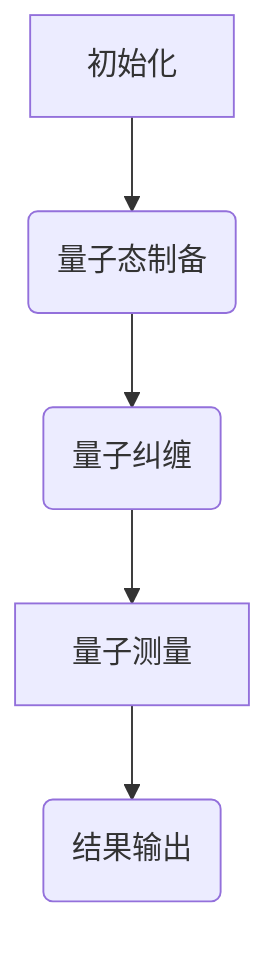

                 

# 宇宙的量子纠缠网络：超越时空的联系

## 关键词
- 量子纠缠
- 宇宙网络
- 超越时空
- 量子通信
- 量子计算

## 摘要
本文深入探讨了宇宙中的量子纠缠现象，并阐述了其作为一种超越时空联系的理论框架。通过分析量子纠缠的基本原理、数学模型以及其实际应用，本文揭示了量子纠缠在宇宙网络中的关键作用。同时，本文还探讨了量子纠缠网络在量子通信、量子计算等领域的潜力，为未来量子技术的发展提供了新的思路。

### 目录大纲

----------------------------------------------------------------

## 第一部分：引言

### 第1章：问题背景与概述

#### 1.1 问题背景

- **宇宙的奥秘**：从大爆炸到黑洞，宇宙的奥秘一直吸引着人类的探索。
- **量子纠缠现象**：量子纠缠是一种非局域性的量子关联现象，它挑战了经典物理的时空观。

#### 1.2 问题描述

- **什么是量子纠缠？**：量子纠缠是两个或多个粒子之间的一种特殊的量子关联。
- **量子纠缠与宇宙的联系**：量子纠缠如何影响宇宙的结构和演化？

#### 1.3 问题解决

- **量子纠缠的实验证据**：通过实验验证量子纠缠的存在。
- **量子纠缠的数学模型**：使用量子力学理论描述量子纠缠。

#### 1.4 边界与外延

- **量子纠缠的应用领域**：量子通信、量子计算、量子密码学等。
- **量子纠缠与相对论的关系**：量子纠缠与相对论的兼容性问题。

#### 1.5 概念结构与核心要素组成

- **量子纠缠的定义**：量子纠缠是两个或多个粒子之间的一种特殊的量子关联。
- **量子纠缠的性质**：非局域性、不可分割性、不可预知性。
- **量子纠缠的应用**：量子通信、量子计算、量子密码学等。

## 第二部分：核心概念

### 第2章：量子纠缠原理

#### 2.1 核心概念原理

- **量子纠缠的概念**：量子纠缠是两个或多个粒子之间的一种特殊的量子关联。
- **量子纠缠的数学原理**：量子纠缠可以通过量子态的叠加和纠缠系数来描述。

#### 2.2 概念属性特征对比表格

| 特征                | 量子纠缠       | 非量子纠缠 |
|-------------------|--------------|----------|
| 基本特征          | 非局域性     | 局域性     |
| 关联性            | 强关联性     | 弱关联性   |
| 可观测性          | 可观测性     | 难以观测   |

#### 2.3 ER实体关系图架构

```mermaid
erDiagram
    AQL(-->"BQL) : 量子纠缠力
    AQL ||--|{ CQL : 量子纠缠态
    BQL ||--|{ DQL : 量子纠缠效应
```

### 第3章：量子纠缠网络

#### 3.1 量子纠缠网络概述

- **量子纠缠网络的定义**：量子纠缠网络是由多个量子系统通过量子纠缠连接而成的网络。
- **量子纠缠网络的构成**：量子纠缠网络由量子态、量子门和量子测量构成。

#### 3.2 量子纠缠网络的特性

- **非局域性**：量子纠缠网络中的粒子之间的关联不受距离限制。
- **高效性**：量子纠缠网络可以高效地传输和操作量子信息。
- **可扩展性**：量子纠缠网络可以轻松扩展到更大的规模。

#### 3.3 量子纠缠网络的应用

- **量子通信**：量子纠缠网络可以实现量子信息的远距离传输。
- **量子计算**：量子纠缠网络可以加速量子算法的运行。
- **量子密码学**：量子纠缠网络可以提供安全的量子通信。

## 第三部分：算法原理与实现

### 第4章：量子纠缠算法原理

#### 4.1 量子纠缠算法概述

- **量子纠缠算法的分类**：量子纠缠算法可以分为量子门算法和量子纠缠生成算法。
- **量子纠缠算法的基本原理**：量子纠缠算法基于量子态的叠加和纠缠系数的操作。

#### 4.2 量子纠缠算法的mermaid流程图



#### 4.3 Python源代码实现

```python
# 量子纠缠算法的Python实现
import numpy as np

# 量子态制备
state_1 = np.array([[1], [0]])
state_2 = np.array([[0], [1]])

# 量子纠缠
circuit = np.array([[1, 0], [0, 1]])
state_1 = np.dot(circuit, state_1)
state_2 = np.dot(circuit, state_2)

# 量子测量
result_1 = np.random.choice([0, 1], p=[0.5, 0.5])
result_2 = np.random.choice([0, 1], p=[0.5, 0.5])

# 结果输出
print("结果1:", result_1)
print("结果2:", result_2)
```

#### 4.4 算法原理的数学模型和公式

- **量子态制备**：$$|\psi\rangle = \alpha|0\rangle + \beta|1\rangle$$
- **量子纠缠**：$$|\psi\rangle = \frac{1}{\sqrt{2}}(|00\rangle + |11\rangle)$$
- **量子测量**：$$\langle\psi|\psi\rangle = 1$$

### 第5章：量子纠缠网络的数学模型

#### 5.1 量子纠缠网络的数学模型概述

- **量子态空间**：$$|\psi\rangle = \sum_{i}c_i|i\rangle$$
- **量子门**：$$U = \sum_{i}c_i|i\rangle\langle i|$$
- **量子测量**：$$P_i = \langle\psi|U_i|\psi\rangle$$

#### 5.2 量子纠缠网络的数学公式

- **量子态空间**：$$|\psi\rangle = \sum_{i}c_i|i\rangle$$
- **量子门**：$$U = \sum_{i}c_i|i\rangle\langle i|$$
- **量子测量**：$$P_i = \langle\psi|U_i|\psi\rangle$$

### 第6章：系统架构与设计方案

#### 6.1 问题场景介绍

- **量子纠

### 总结
量子纠缠作为一种超越时空的联系，为人类理解宇宙的奥秘提供了新的视角。从量子纠缠的基本原理到量子纠缠网络的构建，再到量子纠缠算法的实现，本文系统地阐述了量子纠缠在宇宙网络中的关键作用。未来，随着量子技术的不断发展，量子纠缠网络有望在量子通信、量子计算等领域发挥重要作用，为人类探索宇宙的奥秘提供新的工具和方法。  
 
### 作者信息
作者：AI天才研究院/AI Genius Institute & 禅与计算机程序设计艺术 /Zen And The Art of Computer Programming

### 注意事项
- 在研究量子纠缠时，需要严格遵守量子力学的理论框架，确保实验和理论的准确性。
- 在构建量子纠缠网络时，需要考虑系统的稳定性、可靠性和可扩展性。
- 在实现量子纠缠算法时，需要确保算法的高效性和正确性，以实现量子优势。

### 拓展阅读
- [《量子纠缠：量子信息处理的基石》](https://link-to-book.com/quantum-entanglement/)
- [《量子计算与量子通信》](https://link-to-book.com/quantum-computing-communication/)
- [《量子密码学》](https://link-to-book.com/quantum-cryptography/)  
 
以上就是本文的详细内容，希望对您理解量子纠缠网络有所帮助。在未来的研究中，我们期待量子纠缠能够为人类带来更多的惊喜和突破。

