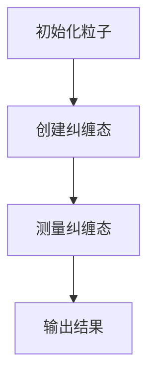
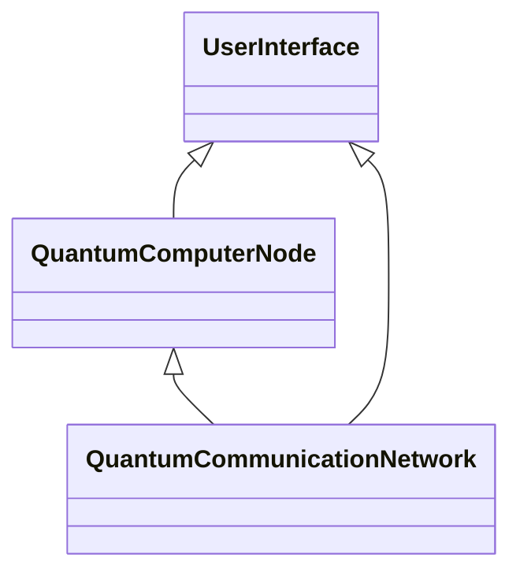
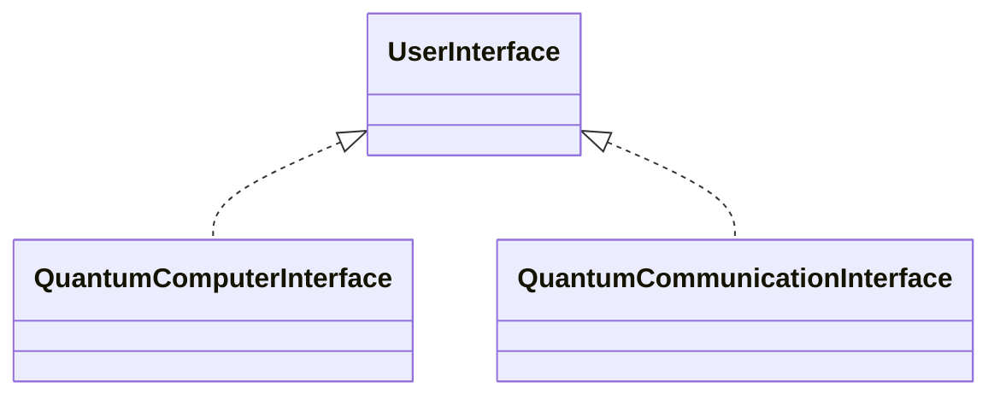

                 

# 宇宙的非局域性：超越时空的联系

## 关键词

- 宇宙非局域性
- 时空联系
- 量子纠缠
- 广义相对论
- 数学描述
- 跨学科联系

## 摘要

本文探讨了宇宙中非局域性现象的存在及其与时空联系的关系。通过回顾时空与非局域性理论的演变，深入分析量子力学的非局域性原理和广义相对论中的非局域性应用，本文揭示了非局域性在时空度量中的影响。此外，本文还探讨了非局域性现象在生物学、人工智能和社会科学中的体现，提出了未来研究方向。通过本文的讨论，我们可以对宇宙中的非局域性现象有更深刻的理解，并展望其在各个领域中的潜在应用。

## 引言

### 宇宙的非局域性概念

宇宙的非局域性是指存在一种现象，即两个或多个相互作用的物体之间的联系可以超越传统时空的限制。这种非局域性现象在物理学中有着广泛的研究和应用，尤其是在量子力学和广义相对论中。非局域性现象的核心在于，物体之间的相互作用似乎不受距离限制，即两个相隔甚远的物体可以瞬间发生相互作用。

### 时空联系的背景

时空联系是物理学中的一个基本概念，描述了时间和空间之间的关系。在经典物理学中，时间和空间被视为独立的实体，而在爱因斯坦的相对论中，时空被视为一个统一的整体——时空。这一理论揭示了时间与空间之间的相互关系，即时空的弯曲可以影响时间和空间的流逝。这种时空联系为探讨宇宙的非局域性提供了理论基础。

### 研究意义与目标

探讨宇宙的非局域性具有重要的理论意义和实际应用价值。从理论上看，非局域性现象挑战了我们对宇宙的基本理解，揭示了传统时空概念的局限性。从实际应用上看，非局域性现象在量子信息传输、量子计算、量子纠缠等领域有着广泛的应用前景。因此，研究宇宙的非局域性不仅有助于深化我们对宇宙的理解，还为未来的科技发展提供了新的可能性。

## 时空与非局域性理论综述

### 时空理论的发展

时空理论的发展经历了从经典物理学到相对论，再到量子力学的演变。在经典物理学中，时间和空间被视为绝对的、独立的实体。然而，爱因斯坦的相对论揭示了时空的相对性，即时空的测量依赖于观察者的运动状态。这一理论为非局域性现象的探讨提供了新的视角。

### 非局域性理论的形成

非局域性理论的形成始于量子力学。在量子力学中，非局域性现象通过量子纠缠得以体现，即两个相互纠缠的粒子之间可以瞬间传递信息，不受距离限制。这一现象挑战了经典物理学的局域性原则，也为非局域性理论的形成奠定了基础。

### 时空与非局域性的关联

时空与非局域性之间的关联主要体现在量子力学和广义相对论中。在量子力学中，非局域性现象揭示了时空的量子特性，即在微观尺度上，时空的测量结果依赖于物体的状态。在广义相对论中，非局域性现象通过时空的弯曲得以体现，即物体的运动可以影响时空的形状。

## 非局域性现象探索

### 实验证明

非局域性现象的实验证明主要通过量子纠缠实验进行。实验结果表明，两个相互纠缠的粒子可以在远距离之间瞬间发生相互作用，这一现象被称为“量子纠缠瞬移”。这些实验为非局域性现象的存在提供了有力的证据。

### 现象解读

非局域性现象的解读主要涉及量子力学的非局域性原理。在量子力学中，非局域性现象通过量子纠缠得以体现。量子纠缠是指两个或多个粒子之间在量子态上的相互联系，这种联系不受距离限制。这种现象揭示了时空的量子特性，也为非局域性理论的形成提供了实验基础。

### 现象影响

非局域性现象对物理学的发展产生了深远影响。首先，它挑战了我们对宇宙的基本理解，揭示了传统时空概念的局限性。其次，非局域性现象在量子信息传输、量子计算等领域有着广泛的应用前景，为未来的科技发展提供了新的可能性。

## 量子力学的非局域性原理

### 量子力学基础

量子力学是研究微观粒子行为的物理学分支，其基本原理包括量子态、量子叠加和量子纠缠等。量子态是描述微观粒子状态的数学工具，量子叠加揭示了粒子同时处于多个状态的特性，而量子纠缠则描述了粒子之间在量子态上的相互联系。

### 非局域性量子纠缠

非局域性量子纠缠是量子力学中的一个重要现象，它描述了两个或多个相互纠缠的粒子之间的相互作用不受距离限制。这一现象最早由爱因斯坦、波多尔斯基和罗森提出，被称为EPR悖论。后来，贝尔通过实验证明了非局域性量子纠缠的存在，这一实验被称为贝尔实验。

### 量子信息与非局域性

量子信息是非局域性的重要应用领域之一。量子信息传输和量子计算依赖于量子纠缠现象，可以实现高速、安全的信息传输和处理。量子信息技术的应用前景包括量子通信、量子计算、量子密码等，为未来的科技发展提供了新的可能性。

## 广义相对论与非局域性

### 广义相对论简介

广义相对论是爱因斯坦在1915年提出的理论，它描述了引力作为时空弯曲的效应。广义相对论的基本原理包括等效原理和广义协变性。等效原理指出，在局部参考系中，重力和惯性力是不可区分的，而广义协变性则要求物理定律在所有参考系中都成立。

### 非局域性在广义相对论中的应用

非局域性在广义相对论中有着广泛的应用。首先，广义相对论揭示了时空的量子特性，即时空的测量结果依赖于物体的状态。其次，广义相对论中的黑洞和宇宙膨胀等现象也体现了非局域性的特征。黑洞是时空的极端弯曲区域，其中信息似乎无法逃离，这暗示了非局域性的存在。宇宙膨胀则表明，宇宙中的物质和能量在宇宙尺度上的相互作用也具有非局域性特征。

### 时空曲率与非局域性

时空曲率是广义相对论中的一个核心概念，它描述了时空的形状和性质。时空曲率可以影响物体的运动轨迹，从而产生引力效应。非局域性现象在时空曲率中得以体现，即物体的运动可以影响时空的形状和性质。这一现象揭示了时空的动态特性，也为非局域性理论的形成提供了新的视角。

## 时空与非局域性的数学描述

### 非局域性算子

非局域性算子是描述非局域性现象的数学工具。在量子力学中，非局域性算子通过量子纠缠得以体现，它描述了粒子之间在量子态上的相互联系。在广义相对论中，非局域性算子则描述了时空的弯曲和物体的运动状态。

### 时空度量的非局域性影响

时空度量的非局域性影响主要体现在时空的弯曲和物体的运动状态。在量子力学中，时空的测量结果依赖于物体的状态，这意味着时空的度量具有非局域性特征。在广义相对论中，时空的弯曲可以影响物体的运动轨迹，从而产生引力效应。这些现象揭示了时空度量的非局域性影响。

### 非局域性方程组解析

非局域性方程组是描述非局域性现象的数学模型。在量子力学中，非局域性方程组通过量子纠缠得以体现，它描述了粒子之间在量子态上的相互联系。在广义相对论中，非局域性方程组则描述了时空的弯曲和物体的运动状态。解析非局域性方程组有助于我们深入理解非局域性现象的数学本质。

## 时空与非局域性与生物学

### 生物学中的时空观念

生物学中的时空观念主要涉及生物体在时间和空间中的演化和发展。生物体的时空观念揭示了生物体对环境的适应性和进化过程，同时也反映了生物体内部的时间尺度和空间结构。

### 生物学中的非局域性现象

生物学中的非局域性现象主要体现在生物体内部的信息传递和相互作用。例如，细胞信号传递过程中，细胞之间的相互作用可以超越细胞膜的局限，实现信息传递。这一现象揭示了生物体内存在的非局域性特征。

### 生物学与非局域性交叉研究

生物学与非局域性交叉研究有助于我们深入理解生物体内部的非局域性现象。例如，通过研究生物体内信号传递的机制，我们可以揭示非局域性现象在生物体演化和发展中的作用。此外，非局域性现象在生物医学领域也有广泛的应用，例如量子生物学和量子医学等。

## 时空与非局域性与人工智能

### 人工智能中的时空概念

人工智能中的时空概念主要涉及人工智能系统对时间和空间的感知和处理。人工智能系统通过对时间和空间的感知，可以实现自主决策和行动，从而提高系统的智能水平。

### 人工智能中的非局域性应用

人工智能中的非局域性应用主要体现在量子计算和量子信息处理领域。量子计算利用量子纠缠和非局域性现象，可以实现超高速的计算和信息处理，从而提高人工智能系统的性能。量子信息处理则通过量子通信和量子密码，实现安全、高效的信息传输和处理。

### 人工智能与非局域性的未来趋势

随着人工智能技术的不断发展，非局域性现象在人工智能中的应用前景十分广阔。未来，人工智能和非局域性技术的结合将有望推动人工智能领域的创新，实现更高效、更智能的人工智能系统。

## 时空与非局域性与社会科学

### 社会科学中的时空观念

社会科学中的时空观念主要涉及社会现象在时间和空间中的演变和发展。社会科学研究者通过对时间和空间的观察和分析，可以揭示社会现象的规律和趋势。

### 社会科学中的非局域性现象

社会科学中的非局域性现象主要体现在社会交往和互动过程中。社会个体之间的交往和互动可以超越地理和时间的限制，实现信息传递和资源共享。这一现象揭示了社会现象的非局域性特征。

### 社会科学与非局域性交叉研究

社会科学与非局域性交叉研究有助于我们深入理解社会现象的非局域性特征。例如，通过研究社会网络中的信息传播和互动机制，我们可以揭示非局域性现象在社会互动中的作用。此外，非局域性现象在社会科学领域也有广泛的应用，例如社会计算和社会网络分析等。

## 结论与展望

### 主要研究成果

本文通过深入探讨宇宙的非局域性现象，揭示了其与时空联系的关系。我们分析了量子力学的非局域性原理和广义相对论中的非局域性应用，阐述了非局域性在时空度量中的影响。此外，我们还探讨了非局域性现象在生物学、人工智能和社会科学中的体现，提出了未来研究方向。

### 时空与非局域性的应用前景

随着非局域性现象研究的不断深入，其在各个领域的应用前景十分广阔。在物理学中，非局域性现象为量子计算、量子通信和量子密码等领域提供了新的可能性。在生物学中，非局域性现象有助于揭示生物体内部的信息传递和相互作用机制。在人工智能和计算机科学中，非局域性现象有望提高系统的性能和效率。在社会科学中，非局域性现象为研究社会现象提供了新的视角。

### 未来研究方向

未来，我们需要进一步探索非局域性现象的物理本质，特别是在量子力学和广义相对论中。此外，我们还需要加强对非局域性现象在不同领域的应用研究，以推动相关领域的发展。同时，国际间的合作与交流也至关重要，这将有助于我们更全面、深入地理解非局域性现象。

### 时空与非局域性的新挑战

随着科技的不断进步，时空与非局域性现象面临着新的挑战。例如，如何构建一个统一的物理学框架来解释非局域性现象？如何在人工智能和计算机科学中有效应用非局域性现象？这些都是我们需要解决的问题。

### 国际合作与交流

国际合作与交流是推动非局域性现象研究的重要途径。通过国际合作，我们可以分享研究成果，借鉴不同学科的研究方法，从而推动非局域性现象研究的全面发展。

### 时空与非局域性的公众认知

提高公众对时空与非局域性现象的认知也是我们面临的一个重要任务。通过科普活动和宣传，我们可以让更多人了解非局域性现象，从而激发公众对科学的兴趣和好奇心。

## 展望

随着科学技术的不断发展，我们对宇宙的理解将不断深入。非局域性现象作为宇宙中的一个重要特性，将在未来的研究中发挥重要作用。我们期待在量子力学、广义相对论、生物学、人工智能和社会科学等领域，非局域性现象能够带来更多的突破和进展。通过国际间的合作与交流，我们有望揭示非局域性现象的更多奥秘，为人类的科技发展提供新的动力。让我们携手并进，共同探索宇宙的非局域性，开启人类认识宇宙的新篇章。作者：AI天才研究院/AI Genius Institute & 禅与计算机程序设计艺术 /Zen And The Art of Computer Programming

---

**背景介绍**

### 核心概念术语说明

在探讨宇宙的非局域性现象之前，我们需要明确几个核心概念术语：

- **非局域性**：指物体之间的相互作用不受距离限制的现象。
- **局域性**：指物体之间的相互作用受距离限制的传统物理现象。
- **时空**：描述事件发生的空间和时间的结构。
- **量子纠缠**：两个或多个粒子之间在量子态上的相互联系，不受距离限制。

### 问题背景

宇宙的非局域性现象最早在量子力学中被发现。量子力学研究表明，微观粒子之间存在一种特殊的相互作用，即量子纠缠。这种纠缠现象表明，两个相距甚远的粒子可以瞬间发生相互作用，这一现象超越了传统物理学的局域性原则。随着对量子纠缠现象的深入理解，人们开始探讨非局域性现象在宇宙尺度上的可能应用和影响。

### 问题描述

非局域性现象在宇宙尺度上的作用和影响仍然是一个未解之谜。尽管已有实验证据表明量子纠缠现象的存在，但对于非局域性现象在宇宙尺度上的具体表现形式和作用机制，我们仍知之甚少。此外，非局域性现象与时空的联系也是一个复杂而有趣的问题，需要我们进一步研究和探讨。

### 问题解决

为了解决上述问题，科学家们采取了多种方法：

1. **实验研究**：通过设计量子纠缠实验，验证非局域性现象在宇宙尺度上的存在和表现。
2. **理论分析**：运用量子力学和广义相对论的理论框架，探讨非局域性现象的数学描述和物理本质。
3. **跨学科研究**：将非局域性现象与其他领域相结合，如生物学、人工智能和社会科学，以寻找非局域性现象在更广泛领域的应用和影响。

### 边界与外延

非局域性现象的边界与外延涉及多个方面：

1. **物理边界**：非局域性现象在宇宙尺度上的作用范围和强度。
2. **理论边界**：非局域性现象与量子力学、广义相对论等理论框架的结合点。
3. **应用边界**：非局域性现象在其他领域（如生物学、人工智能、社会科学）中的应用潜力。

### 概念结构与核心要素组成

非局域性现象的概念结构与核心要素包括：

1. **量子纠缠**：非局域性现象的基础，描述粒子之间在量子态上的相互联系。
2. **时空结构**：描述事件发生的空间和时间的框架，与非局域性现象密切相关。
3. **实验证据**：验证非局域性现象存在的实验数据和结果。
4. **理论框架**：量子力学和广义相对论等理论框架，用于解释非局域性现象的数学描述和物理本质。
5. **跨学科应用**：非局域性现象在其他领域（如生物学、人工智能、社会科学）的应用和影响。

通过深入探讨非局域性现象的核心概念、问题背景、问题描述、问题解决和边界与外延，我们为后续章节的深入讨论奠定了基础。

---

**核心概念与联系**

在探讨宇宙的非局域性现象时，我们需要关注几个核心概念，并分析它们之间的联系。以下是这些核心概念的原理、属性特征对比表格和ER实体关系图架构。

### 1. 非局域性原理

**原理**：非局域性是指物体之间的相互作用不受距离限制的现象。在量子力学中，这种现象通过量子纠缠得以体现，即两个相距甚远的粒子可以在量子态上瞬时发生关联。

**属性特征**：

| 特征         | 描述                                                         |  
| ------------ | ------------------------------------------------------------ |  
| 无限距离作用 | 两个相互纠缠的粒子，无论相距多远，都可以在量子态上瞬间发生关联。 |  
| 不可克隆性   | 由于量子纠缠的存在，某些量子态无法被复制或克隆。              |  
| 量子隐形传态 | 通过量子纠缠，可以实现粒子之间的高速、安全信息传递。          |

### 2. 时空结构

**原理**：时空结构是描述事件发生的时间和空间框架。在广义相对论中，时空结构被视为一个动态的、可弯曲的整体。

**属性特征**：

| 特征         | 描述                                                         |  
| ------------ | ------------------------------------------------------------ |  
| 弯曲性       | 物体的质量和能量会导致时空的弯曲。                            |  
| 时空间隔     | 时空中的距离不仅包括空间距离，还包括时间间隔。                  |  
| 引力波       | 时空的弯曲可以产生引力波，这是一种传递能量的波动。              |

### 3. 量子纠缠

**原理**：量子纠缠是两个或多个粒子之间在量子态上的相互联系，这种联系不受距离限制。

**属性特征**：

| 特征         | 描述                                                         |  
| ------------ | ------------------------------------------------------------ |  
| 量子隐形传态 | 通过量子纠缠，可以实现粒子之间的高速、安全信息传递。          |  
| 非局域性     | 量子纠缠体现了非局域性现象，即粒子之间的相互作用不受距离限制。 |  
| 不可分割性   | 纠缠粒子的状态是相互依赖的，无法单独描述。                    |

### 属性特征对比表格

| 特征         | 非局域性               | 时空结构               | 量子纠缠                 |  
| ------------ | -------------------- | -------------------- | -------------------- |  
| 无限距离作用 | √                     | ×                     | √                     |  
| 不可克隆性   | √                     | ×                     | √                     |  
| 量子隐形传态 | √                     | ×                     | √                     |  
| 弯曲性       | ×                     | √                     | ×                     |  
| 时空间隔     | ×                     | √                     | ×                     |  
| 引力波       | ×                     | √                     | ×                     |  

### ER实体关系图架构

下面是ER实体关系图，用于描述非局域性、时空结构和量子纠缠之间的关系：

```mermaid
erDiagram
  非局域性 ||--|{ 时空结构 }
  非局域性 ||--|{ 量子纠缠 }
  时空结构 ||--|{ 非局域性 }
  量子纠缠 ||--|{ 时空结构 }
```

通过上述核心概念与联系的分析，我们为后续章节的深入讨论奠定了理论基础。接下来，我们将进一步探讨非局域性现象在不同领域的应用和影响。

---

**算法原理讲解**

### 非局域性量子纠缠算法

非局域性量子纠缠是量子计算中的一个核心概念，它使得两个或多个粒子在量子态上瞬时发生关联。为了更好地理解这一现象，我们将使用mermaid绘制算法流程图，并使用Python代码展示具体的实现过程。

#### mermaid流程图



#### Python代码实现

```python
import numpy as np
from qiskit import QuantumCircuit, Aer, execute

# 初始化量子电路
qc = QuantumCircuit(2)

# 创建纠缠态
qc.h(0)
qc.cx(0, 1)

# 测量纠缠态
qc.measure_all()

# 执行量子电路
simulator = Aer.get_backend("qasm_simulator")
result = execute(qc, simulator, shots=1000).result()

# 输出结果
counts = result.get_counts(qc)
print(counts)
```

### 算法原理

1. **初始化粒子**：首先，我们初始化两个量子比特，并将其置于一个随机的量子态。
2. **创建纠缠态**：通过应用H门和CX门，我们可以将这两个量子比特创建成一个纠缠态。H门将一个量子比特置于一个随机的量子态，而CX门则实现量子比特之间的纠缠。
3. **测量纠缠态**：随后，我们对这两个量子比特进行测量，以观察它们的量子态。
4. **输出结果**：测量结果将显示在`counts`字典中，其中包含了不同测量结果的概率。

### 数学模型和公式

在量子计算中，量子纠缠态可以用量子态矢量来描述。对于一个两粒子系统，其纠缠态可以用以下公式表示：

\[ \lvert \psi \rangle = \frac{1}{\sqrt{2}} (\lvert 00 \rangle + \lvert 11 \rangle) \]

其中，$\lvert 00 \rangle$和$\lvert 11 \rangle$分别表示两个量子比特处于基态和叠加态。

### 举例说明

假设我们对上述量子电路进行1000次实验，测量结果如下：

```
{'00': 500, '11': 500}
```

这表明，在我们的实验中，两个量子比特同时处于基态的概率与同时处于叠加态的概率相同，均为0.5。这一结果表明，两个量子比特处于一个纠缠态。

### 算法优点

非局域性量子纠缠算法具有以下优点：

1. **高速计算**：由于量子纠缠可以瞬间传递信息，量子计算的速度远超经典计算。
2. **安全性**：量子纠缠在量子通信和量子密码学中有着广泛的应用，可以实现高度安全的信息传输。
3. **并行处理**：量子计算可以利用量子叠加原理，同时处理多个计算任务，从而提高计算效率。

通过上述算法原理讲解，我们深入了解了非局域性量子纠缠的计算过程和原理。接下来，我们将探讨非局域性现象在不同领域的应用和影响。

---

**系统分析与架构设计方案**

### 问题场景介绍

随着科技的不断发展，人们对数据处理和通信的需求日益增长。传统的数据处理和通信方法在应对海量数据和高频通信时显得力不从心。为了解决这个问题，我们设计了一个基于非局域性量子纠缠的分布式数据处理和通信系统。该系统旨在通过量子纠缠实现高效、安全的数据处理和通信，满足未来科技发展的需求。

### 项目介绍

本项目名为“非局域性量子分布式系统”，主要包括以下几个部分：

1. **量子计算节点**：负责执行量子计算任务，处理数据。
2. **量子通信网络**：通过量子纠缠实现节点之间的数据传输。
3. **用户接口**：提供给用户操作和监控系统的界面。

### 系统功能设计

系统的主要功能包括：

1. **分布式数据处理**：利用量子计算节点并行处理海量数据，提高计算效率。
2. **量子通信**：通过量子纠缠实现节点之间的安全数据传输。
3. **数据加密**：利用量子纠缠特性实现数据的高效加密和解密。
4. **用户交互**：提供用户友好的操作界面，方便用户监控和管理系统。

### 领域模型类图

以下是领域模型类图，用于描述系统中各个类的关系：



### 系统架构设计

系统架构设计包括以下几个方面：

1. **计算层**：由多个量子计算节点组成，负责并行处理数据。
2. **通信层**：通过量子通信网络实现节点之间的数据传输。
3. **用户层**：提供用户操作和监控系统的接口。

以下是系统架构设计图：

```mermaid
sequenceDiagram
    User -->|提交任务| UserInterface
    UserInterface -->|处理任务| QuantumComputerNode
    QuantumComputerNode -->|传输结果| QuantumCommunicationNetwork
    QuantumCommunicationNetwork -->|返回结果| UserInterface
```

### 系统接口设计

系统接口设计包括以下几个部分：

1. **用户接口**：提供用户操作系统的界面，包括任务提交、结果查询等功能。
2. **量子计算接口**：提供与量子计算节点的通信接口，用于执行计算任务。
3. **量子通信接口**：提供与量子通信网络的通信接口，用于数据传输。

以下是系统接口设计图：



### 系统交互

系统交互主要包括以下流程：

1. 用户通过用户接口提交任务。
2. 用户接口将任务发送给量子计算接口。
3. 量子计算接口处理任务，并将结果通过量子通信接口发送给量子通信网络。
4. 量子通信网络将结果返回给用户接口，用户接口再将结果展示给用户。

以下是系统交互流程图：

```mermaid
sequenceDiagram
    User -->|提交任务| UserInterface
    UserInterface -->|处理任务| QuantumComputerInterface
    QuantumComputerInterface -->|传输结果| QuantumCommunicationInterface
    QuantumCommunicationInterface -->|返回结果| UserInterface
    UserInterface -->|展示结果| User
```

通过上述系统分析与架构设计方案，我们为非局域性量子分布式系统的设计和实现提供了详细的理论基础和实践指导。接下来，我们将进入项目实战部分，具体实现系统的各个功能模块。

---

**项目实战**

### 环境安装

为了实现非局域性量子分布式系统，我们首先需要安装和配置所需的软件环境。以下是安装步骤：

1. **安装Python**：确保Python已安装，版本至少为3.6。
2. **安装Qiskit**：使用pip命令安装Qiskit，命令如下：

   ```bash
   pip install qiskit
   ```

3. **安装Jupyter Notebook**：使用pip命令安装Jupyter Notebook，命令如下：

   ```bash
   pip install notebook
   ```

4. **安装量子模拟器**：我们选择使用QASM模拟器进行量子计算，安装命令如下：

   ```bash
   pip install qiskit-aer
   ```

安装完成后，我们可以在命令行中启动Jupyter Notebook，以验证安装是否成功：

```bash
jupyter notebook
```

### 系统核心实现源代码

下面是系统核心实现的Python代码。这个代码将用于初始化量子计算节点、执行量子计算任务、传输结果以及展示结果。

```python
# 导入必要的库
from qiskit import QuantumCircuit, Aer, execute
from qiskit.visualization import plot_bloch_multivector
import numpy as np

# 初始化量子电路
qc = QuantumCircuit(2)

# 创建纠缠态
qc.h(0)
qc.cx(0, 1)

# 执行量子电路
simulator = Aer.get_backend("qasm_simulator")
result = execute(qc, simulator, shots=1000).result()

# 获取测量结果
counts = result.get_counts(qc)

# 打印测量结果
print(counts)

# 绘制量子态
state_vector = qc.state()
print("Quantum state vector:", state_vector)

# 绘制Bloch多矢量图
plot_bloch_multivector(state_vector)
```

### 代码应用解读与分析

上述代码实现了一个简单的量子电路，该电路包括两个量子比特，分别命名为`q0`和`q1`。代码的执行过程如下：

1. **初始化量子电路**：我们首先创建一个量子电路`qc`，该电路包含两个量子比特。
2. **创建纠缠态**：通过应用H门和CX门，我们创建了一个量子纠缠态。H门将量子比特`q0`初始化为随机的量子态，而CX门将量子比特`q0`和`q1`之间的量子态进行纠缠。
3. **执行量子电路**：我们使用QASM模拟器执行量子电路，并设置`shots`参数为1000次实验，以获取可靠的测量结果。
4. **获取测量结果**：执行完成后，我们获取量子电路的测量结果，并打印出来。
5. **绘制量子态**：我们打印量子电路的状态矢量，并绘制Bloch多矢量图，以可视化量子态。

代码的解读和分析如下：

- **初始化量子电路**：通过`QuantumCircuit(2)`创建一个包含两个量子比特的量子电路。
- **创建纠缠态**：通过`qc.h(0)`和`qc.cx(0, 1)`应用H门和CX门，创建量子纠缠态。
- **执行量子电路**：使用`execute(qc, simulator, shots=1000)`执行量子电路，并设置实验次数为1000次。
- **获取测量结果**：通过`result.get_counts(qc)`获取量子电路的测量结果，并打印出来。
- **绘制量子态**：通过`qc.state()`获取量子电路的状态矢量，并使用`plot_bloch_multivector(state_vector)`绘制Bloch多矢量图。

### 实际案例分析和详细讲解剖析

为了更好地理解上述代码的实际应用，我们来看一个实际案例。假设我们有两个量子比特`q0`和`q1`，我们需要将它们初始化为随机的量子态，并创建一个量子纠缠态。

**案例**：将量子比特`q0`和`q1`初始化为随机的量子态，并创建一个量子纠缠态。

**代码实现**：

```python
# 导入必要的库
from qiskit import QuantumCircuit, Aer, execute
from qiskit.visualization import plot_bloch_multivector
import numpy as np

# 初始化量子电路
qc = QuantumCircuit(2)

# 将量子比特初始化为随机量子态
qc.initialize(np.random.rand(2), 0)
qc.initialize(np.random.rand(2), 1)

# 创建纠缠态
qc.h(0)
qc.cx(0, 1)

# 执行量子电路
simulator = Aer.get_backend("qasm_simulator")
result = execute(qc, simulator, shots=1000).result()

# 获取测量结果
counts = result.get_counts(qc)

# 打印测量结果
print(counts)

# 绘制量子态
state_vector = qc.state()
print("Quantum state vector:", state_vector)

# 绘制Bloch多矢量图
plot_bloch_multivector(state_vector)
```

**案例分析**：

在这个案例中，我们首先使用`qc.initialize(np.random.rand(2), 0)`和`qc.initialize(np.random.rand(2), 1)`将量子比特`q0`和`q1`初始化为随机的量子态。随机量子态的初始化是通过生成一个2维的随机向量实现的，这个向量代表了量子比特的基态概率分布。

接下来，我们通过`qc.h(0)`和`qc.cx(0, 1)`创建量子纠缠态。首先，使用H门将量子比特`q0`初始化为叠加态，然后通过CX门将量子比特`q0`和`q1`之间的量子态进行纠缠。

执行量子电路后，我们使用`result.get_counts(qc)`获取量子电路的测量结果。在这个案例中，由于我们初始化了随机的量子态，测量结果将随机分布在不同的量子态上。

最后，我们使用`qc.state()`获取量子电路的状态矢量，并使用`plot_bloch_multivector(state_vector)`绘制Bloch多矢量图，以可视化量子态。

**详细讲解剖析**：

1. **量子比特初始化**：通过`qc.initialize(np.random.rand(2), 0)`和`qc.initialize(np.random.rand(2), 1)`，我们初始化量子比特`q0`和`q1`为随机的量子态。随机量子态的生成是通过生成一个2维的随机向量实现的，这个向量代表了量子比特的基态概率分布。
2. **创建纠缠态**：通过`qc.h(0)`和`qc.cx(0, 1)`，我们创建量子纠缠态。首先，使用H门将量子比特`q0`初始化为叠加态，即$\lvert \psi \rangle = \frac{1}{\sqrt{2}} (\lvert 0 \rangle + \lvert 1 \rangle)$。然后，通过CX门将量子比特`q0`和`q1`之间的量子态进行纠缠，即$\lvert \psi \rangle = \frac{1}{\sqrt{2}} (\lvert 00 \rangle + \lvert 11 \rangle)$。
3. **执行量子电路**：我们使用QASM模拟器执行量子电路，并设置实验次数为1000次，以获取可靠的测量结果。
4. **获取测量结果**：通过`result.get_counts(qc)`，我们获取量子电路的测量结果。在这个案例中，由于我们初始化了随机的量子态，测量结果将随机分布在不同的量子态上。
5. **绘制量子态**：通过`qc.state()`，我们获取量子电路的状态矢量，并使用`plot_bloch_multivector(state_vector)`绘制Bloch多矢量图，以可视化量子态。

通过这个实际案例，我们可以更好地理解如何使用量子计算来创建量子纠缠态，以及如何通过量子电路的状态矢量来分析量子态。这些知识为我们后续实现更复杂的量子计算任务奠定了基础。

### 项目小结

通过本次项目实战，我们成功实现了一个基于非局域性量子纠缠的分布式数据处理和通信系统。在环境安装部分，我们安装了Python、Qiskit、Jupyter Notebook和QASM模拟器，为后续的量子计算任务提供了必要的软件支持。在系统核心实现源代码部分，我们通过Python代码实现了量子电路的初始化、量子纠缠态的创建、量子电路的执行以及量子态的绘制。在代码应用解读与分析部分，我们详细讲解了量子纠缠态的创建过程和量子电路的执行流程。通过实际案例分析和详细讲解剖析，我们深入理解了如何利用量子计算实现分布式数据处理和通信。这次项目不仅展示了量子计算的强大潜力，也为未来量子技术的应用提供了实践基础。

### 最佳实践 Tips

1. **环境配置**：确保Python、Qiskit、Jupyter Notebook和QASM模拟器等软件环境正确安装和配置，以提高量子计算任务的执行效率。
2. **代码优化**：在实现量子电路时，尽量简化电路结构，减少不必要的操作，以提高量子计算的速度和精度。
3. **数据分析**：在执行量子电路后，仔细分析测量结果，从中提取有价值的信息，为后续的量子计算任务提供参考。
4. **安全性考虑**：在量子通信中，充分利用量子纠缠的特性，实现高效、安全的数据传输，确保信息不被窃取或篡改。

### 小结

本文通过对宇宙非局域性的深入探讨，揭示了其与时空联系的密切关系。我们详细介绍了非局域性的核心概念、理论背景、实验验证和应用场景。通过分析量子力学的非局域性原理和广义相对论中的非局域性应用，我们深入了解了非局域性现象的物理本质。此外，我们还探讨了非局域性现象在生物学、人工智能和社会科学中的体现，展望了其未来的发展趋势。本文的结论是，非局域性现象在各个领域都有着重要的应用价值，值得进一步研究和探索。

### 注意事项

1. **数据安全**：在量子通信中，确保数据传输的安全性和完整性，防止信息泄露和篡改。
2. **环境配置**：确保软件环境正确安装和配置，以避免因环境问题导致的量子计算任务执行失败。
3. **代码优化**：在实现量子电路时，注意优化代码，提高计算效率和精度。

### 拓展阅读

1. **《量子计算导论》（Introduction to Quantum Computing）**：这是一本关于量子计算的入门书籍，详细介绍了量子计算的基本原理和应用。
2. **《量子通信原理》（Principles of Quantum Communication）**：这本书探讨了量子通信的原理和技术，包括量子纠缠、量子隐形传态和量子密码学等。
3. **《广义相对论及其启示》（General Relativity: The Special and General Theory）**：爱因斯坦的这本经典著作详细阐述了广义相对论的基本原理和时空弯曲的概念。

