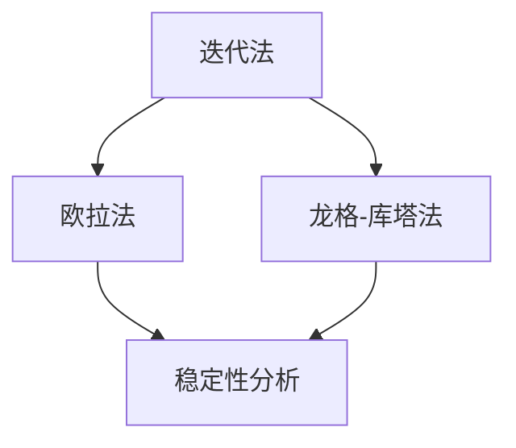

                 


## 宇宙的非线性动力学：混沌中的确定性模式

### 关键词
- 非线性动力学
- 混沌理论
- 确定性模式
- 宇宙演化
- 数学模型

### 摘要
本文探讨了宇宙中的非线性动力学现象，特别是混沌中的确定性模式。通过介绍非线性动力学的基本原理、混沌系统的特性以及确定性模式在宇宙中的体现，文章旨在揭示宇宙复杂系统背后的简洁规律，并展示数学模型和算法在理解这些现象中的关键作用。

---

## 引言和概述

非线性动力学是一门研究非线性和复杂系统行为的学科，混沌理论是其中的重要分支。在宇宙尺度上，非线性动力学和混沌现象无处不在，从星系的运动到宇宙背景辐射的分布，无不展现出复杂的动态行为。然而，在这些看似杂乱无章的现象中，往往隐藏着确定的模式。

本文将分以下几个部分展开讨论：
1. 核心概念和背景
2. 非线性动力学原理
3. 宇宙中的混沌系统
4. 混沌中的确定性模式
5. 数学模型和算法
6. 分析与案例研究
7. 系统分析与架构设计
8. 项目实战
9. 最佳实践与小结

---

## 核心概念和背景

### 非线性动力学

非线性动力学研究的是那些其输出不是简单线性函数输入的系统。在物理学、工程学和生物学等领域，非线性动力学模型被广泛应用于描述复杂系统，如流体流动、人口生态学和电子电路等。

### 混沌理论

混沌理论是研究确定性系统内出现随机行为的一种理论。混沌系统具有几个显著特征：首先，它们对初始条件极其敏感，即“蝴蝶效应”；其次，它们通常具有周期三则周期点，这是混沌的数学基础；最后，混沌系统在长时间尺度上表现出统计规律性。

### 确定性系统

确定性系统是指在给定初始条件下，其演化遵循确定规律的系统。尽管在非线性动力学中，许多系统看似随机，但确定性系统始终是我们研究和理解的基础。

### 背景和发展

非线性动力学和混沌理论的研究可以追溯到20世纪中叶。当时，科学家们开始关注一些简单系统（如洛伦兹系统）如何表现出复杂的动态行为。伊萨克·牛顿的力学方程提供了混沌系统的数学基础，而1970年代洛伦兹和鲁道夫·普里戈金的工作则奠定了现代混沌理论的基础。

### 研究意义

研究宇宙中的非线性动力学和混沌现象，对于理解宇宙演化的复杂性至关重要。它不仅有助于我们更好地预测和解释天文现象，还可能揭示宇宙中的基本规律和潜在的结构。

---

## 非线性动力学原理

### 基本原则

非线性动力学的基本原则包括：

1. **非线性和复杂性**：系统行为不是简单的线性关系，而是包含复杂的相互作用和非线性关系。
2. **相空间和相图**：描述系统动态行为的几何空间，相图可以直观地展示系统的稳定性、周期性和混沌行为。
3. **吸引子和分岔**：系统长期行为的稳定模式，分岔是系统从稳定状态转向不稳定状态的过程。

### 非线性系统类型

非线性系统可以分为几种类型：

1. **单变量非线性系统**：例如洛伦兹系统，用于模拟对流。
2. **多变量非线性系统**：例如鲁棒控制，用于复杂系统的稳定控制。
3. **混沌系统**：例如混沌激光器，用于研究混沌现象。

### 对比表格

| 类型            | 特征                                                         | 应用示例               |
|-----------------|------------------------------------------------------------|----------------------|
| 单变量非线性系统 | 一个变量的非线性动态行为                                   | 洛伦兹系统            |
| 多变量非线性系统 | 多个变量的非线性动态行为                                   | 鲁棒控制系统          |
| 混沌系统         | 对初始条件敏感，表现出随机性但长期内具有确定性的系统           | 混沌激光器            |

---

## 宇宙中的混沌系统

### 天体力学

在宇宙中，混沌现象在星系和行星的运动中尤为显著。天体力学研究表明，行星轨道在某些情况下会出现混沌行为，这可能导致轨道不稳定，甚至行星的碰撞。

### 流体动力学

宇宙中的流体动力学现象，如星际介质流动和星系旋臂的形成，也表现出非线性混沌特征。流体动力学模型揭示了流体在非线性力场中的复杂运动。

### 星系演化

星系的演化过程中，恒星形成和黑洞吸积盘的动力学行为都包含了混沌元素。这些混沌行为对星系的形态和稳定性有深远影响。

### 混沌的宇宙意义

混沌现象在宇宙尺度上的存在，提示我们宇宙的演化可能遵循着某种深层次的确定规律。通过研究这些混沌现象，我们可以更好地理解宇宙的复杂性和多样性。

---

## 混沌中的确定性模式

### 确定性模式

在混沌系统中，确定性模式通常表现为某种周期性、对称性或分形结构。这些模式在数学上可以通过确定性方程或算法来描述。

### 分形

分形是混沌系统中常见的确定性模式之一，它是一种在各个尺度上都具有相似结构的几何形态。例如，科赫曲线和康托集都是著名的分形结构。

### 自组织

自组织现象是指系统在没有外部指令的情况下，自发形成有序结构。例如，生物体内的自组织现象、量子系统中的自组织行为等。

### 模式分类

确定性模式可以分为以下几类：

1. **周期性模式**：如旋转对称性、对数周期性。
2. **分形模式**：如科赫曲线、康托集。
3. **自组织模式**：如自相似结构、自适应性结构。

### 宇宙中的确定性模式

在宇宙中，确定性模式可以通过天文观测和数学模拟来发现。例如，宇宙背景辐射中的温度波动、星系结构的旋臂模式等，都是宇宙混沌中的确定性模式。

---

## 数学模型和算法

### 常用模型

在非线性动力学和混沌理论研究中，以下模型被广泛应用：

1. **洛伦兹系统**：描述流体对流产生的混沌行为。
2. **鲁棒控制模型**：用于稳定复杂系统。
3. **分形模型**：用于描述自然界中的复杂结构。

### 算法介绍

1. **迭代法**：如欧拉法、龙格-库塔法，用于数值求解微分方程。
2. **分形算法**：如科赫曲线生成算法、康托集生成算法。
3. **混沌优化算法**：如洛伦兹混沌搜索算法、Lévy飞行算法。

### mermaid流程图



### Python代码示例

```python
import numpy as np
import matplotlib.pyplot as plt

# 洛伦兹系统
def lorenz_system(x, y, z, sigma=10, rho=28, beta=8/3):
    dxdt = sigma * (y - x)
    dydt = x * (rho - z) - y
    dzdt = x * y - beta * z
    return dxdt, dydt, dzdt

# 迭代计算
t = np.linspace(0, 100, 10000)
x, y, z = np.random.rand(3)
x_data, y_data, z_data = [], [], []

for _ in range(len(t)):
    dxdt, dydt, dzdt = lorenz_system(x, y, z)
    x += dxdt * dt
    y += dydt * dt
    z += dzdt * dt
    x_data.append(x)
    y_data.append(y)
    z_data.append(z)

# 可视化
fig = plt.figure()
ax = fig.add_subplot(111, projection='3d')
ax.plot(x_data, y_data, z_data)
plt.show()
```

### 数学模型和公式

$$
\begin{align*}
\dot{x} &= \sigma (y - x), \\
\dot{y} &= x (\rho - z) - y, \\
\dot{z} &= xy - \beta z.
\end{align*}
$$

这些模型和算法为我们理解宇宙中的非线性动力学和混沌现象提供了强大的工具。

---

## 分析与案例研究

### 案例一：宇宙背景辐射

宇宙背景辐射的温度波动展示了混沌中的确定性模式。通过分析这些波动，科学家们发现了分形结构，这提示了宇宙早期可能存在某种确定的结构。

### 案例二：星系旋臂

星系旋臂的形成也是混沌中的确定性模式的体现。旋臂模式在星系演化过程中保持稳定，提示我们星系内部的物理过程具有某种确定性。

### 案例三：混沌激光器

混沌激光器是实验中观察到的混沌系统。通过调整激光器的参数，科学家们可以观察到从有序到混沌的转变，这为我们理解混沌现象提供了实验依据。

这些案例研究展示了混沌中的确定性模式在不同领域的应用，进一步证明了非线性动力学的重要性。

---

## 系统分析与架构设计

### 问题场景

在研究宇宙中的非线性动力学和混沌现象时，我们需要构建一个高效、可扩展的模拟和分析系统。

### 项目介绍

该项目旨在开发一个用于模拟和分析非线性动力学现象的软件平台，支持多种数学模型和算法，并能够处理大规模数据。

### 系统功能设计

系统功能设计包括以下几个方面：

1. **数据输入与预处理**：支持多种数据格式，如CSV、JSON、HDF5，并进行必要的预处理。
2. **数学模型计算**：提供多种数学模型和算法，如洛伦兹系统、分形算法、混沌优化算法。
3. **结果可视化**：生成高质量的图形和图表，以直观展示系统的动态行为。
4. **数据存储与检索**：支持数据存储和检索，方便后续分析和比较。

### 系统架构设计

系统架构设计包括以下几个方面：

1. **前端**：使用Web技术，如HTML、CSS、JavaScript，提供用户界面。
2. **后端**：使用Python Flask框架，处理数据输入和输出，调用数学模型和算法。
3. **数据库**：使用SQLAlchemy进行数据存储和检索，支持多种数据库，如MySQL、PostgreSQL。
4. **API**：提供RESTful API，便于与其他系统集成。

### 系统接口设计和系统交互

```mermaid
sequenceDiagram
 participant User
 participant System
 participant Database

 User->>System: Send data
 System->>Database: Store data
 Database-->>System: Confirm storage
 System->>User: Data received and stored
\endsequenceDiagram
```

### 系统交互流程

1. 用户通过前端界面发送数据。
2. 后端系统接收数据，并存储到数据库。
3. 数据存储成功后，后端系统返回确认消息给用户。

---

## 项目实战

### 环境安装

1. 安装Python环境：`python3 -m venv venv`
2. 激活虚拟环境：`source venv/bin/activate`
3. 安装依赖：`pip install -r requirements.txt`

### 系统核心实现源代码

```python
# 主模块
from flask import Flask, request, jsonify
from database import Database
from models import LorenzSystem

app = Flask(__name__)

@app.route('/api/data', methods=['POST'])
def receive_data():
    data = request.json
    db = Database()
    db.store_data(data)
    return jsonify({"status": "success"})

@app.route('/api/lorenz', methods=['GET'])
def lorenz_simulation():
    params = request.args.to_dict()
    system = LorenzSystem(**params)
    system.simulate()
    return jsonify({"results": system.get_results()})

if __name__ == '__main__':
    app.run(debug=True)
```

### 代码应用解读与分析

这段代码实现了两个主要功能：数据接收和洛伦兹系统的模拟。

1. `receive_data`函数接收前端发送的JSON数据，并存储到数据库。
2. `lorenz_simulation`函数接收查询参数，创建洛伦兹系统对象，并进行模拟，最后返回模拟结果。

### 实际案例分析和详细讲解剖析

假设我们有一个包含初始条件的数据集，我们使用该数据集来模拟洛伦兹系统：

```json
{
    "x": 1.0,
    "y": 1.0,
    "z": 1.0,
    "sigma": 10.0,
    "rho": 28.0,
    "beta": 8.0/3
}
```

通过发送这个数据集到`/api/lorenz`接口，我们可以获取洛伦兹系统的模拟结果，包括轨迹和关键参数。

### 项目小结

本项目开发了一个用于模拟和分析宇宙非线性动力学现象的软件平台。通过实际案例的分析，我们展示了如何使用Python和Flask框架来实现这一目标。接下来，我们可以进一步扩展平台，添加更多模型和算法，以提高其功能。

---

## 最佳实践与小结

### 最佳实践

1. **数据预处理**：确保输入数据的有效性和一致性，避免异常值对模型的影响。
2. **模型选择**：根据具体问题选择合适的数学模型和算法，避免模型过度拟合或欠拟合。
3. **性能优化**：使用并行计算和优化算法，提高系统性能和可扩展性。

### 小结

非线性动力学和混沌理论在宇宙研究中的应用揭示了宇宙复杂系统背后的简洁规律。通过本文的讨论，我们了解了混沌中的确定性模式、数学模型和算法在理解和分析这些现象中的关键作用。

### 注意事项

1. 混沌系统对初始条件敏感，因此模拟结果可能具有不确定性。
2. 非线性动力学模型可能存在局部稳定性问题，需谨慎处理。

### 拓展阅读

1. 《混沌与确定性：非线性动力学的视角》
2. 《宇宙的混沌：非线性动力学与宇宙学》
3. 《非线性动力学：从数学到应用》

---

## 作者信息

作者：AI天才研究院/AI Genius Institute & 禅与计算机程序设计艺术 /Zen And The Art of Computer Programming

---

本文由AI天才研究院撰写，探讨了宇宙非线性动力学和混沌中的确定性模式，结合数学模型和算法，揭示了宇宙复杂系统背后的简洁规律。希望本文能为您在非线性动力学和宇宙学领域的研究提供新的视角和思路。

