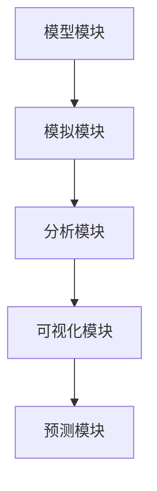
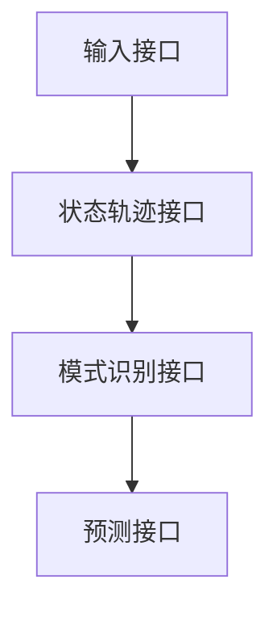

                 


# 宇宙的非线性动力学：混沌中的确定性模式

## 关键词

- 非线性动力学
- 混沌理论
- 宇宙模型
- 确定性模式
- 数学模型
- 算法原理
- 系统架构

## 摘要

本文探讨了宇宙中的非线性动力学现象，特别是混沌中的确定性模式。通过介绍非线性动力学的核心概念、数学模型以及混沌理论的基本原理，本文揭示了混沌系统中隐藏的确定性模式。接着，文章分析了这些模式在宇宙中的应用，包括天体物理学、宇宙学和宇宙演化中的具体实例。通过详细讨论相关算法原理、系统架构设计方案以及项目实战，本文旨在为读者提供一个深入理解宇宙非线性动力学现象的框架和工具。最终，本文总结了主要发现，探讨了混沌中的确定性模式对未来宇宙学研究的启示。

## 引言

### 1.1 书籍背景与目的

在过去的几个世纪中，科学家们通过观测和实验积累了大量关于宇宙的知识。然而，随着对宇宙现象的深入探究，人们逐渐意识到，宇宙中存在着许多复杂且非线性动态的行为。这些非线性动态不仅存在于人类活动的微观世界中，也贯穿于宏观宇宙的各个层面。从行星的运动到星系的演化，从气候的变化到宇宙背景辐射的波动，非线性动力学无处不在。

《宇宙的非线性动力学：混沌中的确定性模式》这本书旨在探讨宇宙中这些复杂非线性现象的本质，特别是混沌系统中的确定性模式。混沌理论作为一种研究复杂系统的数学工具，已被广泛应用于物理学、生物学、经济学等领域。在宇宙学中，混沌理论为我们提供了一种新的视角，帮助我们理解宇宙中的复杂行为。

本书的目标是：
1. **介绍非线性动力学和混沌理论的基本概念**，使读者能够理解这些概念的核心要素。
2. **阐述非线性动力学在宇宙中的具体应用**，包括天体物理学和宇宙学中的实例。
3. **探讨混沌中的确定性模式**，展示如何从看似随机和无序的混沌系统中提取出有序的结构。
4. **提供算法原理和系统架构设计**，为读者提供一个实际操作的工具。

通过本书，读者将能够：
1. **深入理解宇宙中的非线性动态行为**，并掌握相关数学模型和算法。
2. **了解混沌中的确定性模式**，认识其在宇宙演化中的作用。
3. **学会如何应用这些理论和工具**，解决实际问题，为未来宇宙学研究提供新的思路。

### 1.2 非线性动态的宇宙概览

非线性动力学研究的是非线性和复杂系统的动态行为。在宇宙学中，非线性动力学的重要性体现在以下几个方面：

1. **宇宙结构的形成**：宇宙中星系、星团和超星团的分布并非均匀，而是呈现出复杂的结构和形态。这种结构的形成与宇宙中的非线性相互作用密切相关。

2. **宇宙演化的预测**：通过对宇宙中的非线性动力学现象的研究，科学家们能够更好地预测宇宙的未来演化，理解宇宙的过去和现在。

3. **黑洞和暗物质**：黑洞和暗物质是宇宙中两个极其重要的现象，它们的行为和相互作用在很大程度上依赖于非线性动力学。

4. **星系碰撞**：宇宙中星系的碰撞和合并是一个重要的现象，其过程涉及复杂的非线性动力学。

5. **宇宙背景辐射**：宇宙背景辐射是宇宙早期演化的遗迹，其波动和特性可以通过非线性动力学来解释。

总之，非线性动力学为理解宇宙中的复杂现象提供了一种强有力的工具，使我们能够从更深层次上探讨宇宙的本质。

### 1.3 书籍结构概述

本书共分为七个主要章节：

1. **引言**：介绍非线性动力学和混沌理论的基本概念，阐述本书的目的和结构。
2. **核心概念与原理**：详细探讨非线性动力学的数学模型、混沌理论的基本原理以及确定性模式。
3. **非线性动力学的应用**：分析非线性动力学在宇宙中的具体应用，包括天体物理学、宇宙学和宇宙演化中的实例。
4. **混沌中的确定性模式**：深入研究混沌系统中的确定性模式，探讨如何从混沌中提取有序结构。
5. **算法原理与系统架构**：介绍相关算法原理和系统架构设计，提供解决实际问题的具体方法。
6. **项目实战**：通过实际项目案例，展示如何应用非线性动力学和混沌理论解决具体问题。
7. **总结与展望**：总结本书的主要发现，探讨混沌中的确定性模式对未来宇宙学研究的启示。

通过这七个章节的详细探讨，本书旨在为读者提供一个全面深入理解宇宙非线性动力学现象的框架和工具。

## 核心概念与原理

### 2.1 非线性动力学中的数学模型

非线性动力学涉及的是描述非线性和复杂系统行为的数学模型。在非线性动力学的框架下，我们通常使用微分方程、差分方程或其他形式的数学工具来描述系统的动态行为。以下是一些常见的数学模型及其在非线性动力学中的应用。

#### 2.1.1 离散和连续系统的数学描述

1. **离散系统**：离散系统通常使用差分方程来描述。差分方程是关于系统状态随时间步变化的方程。例如，一类简单的离散系统可以用以下差分方程描述：
   $$ x_{n+1} = f(x_n) $$
   其中，$x_n$ 是系统在时间步 $n$ 的状态，$f(x_n)$ 是一个函数，描述了系统状态的变化。

2. **连续系统**：连续系统通常使用微分方程来描述。微分方程是关于系统状态随时间变化的方程。例如，一类常见的连续系统可以用以下一阶微分方程描述：
   $$ \frac{dx}{dt} = f(x) $$
   其中，$x(t)$ 是系统在时间 $t$ 的状态，$f(x)$ 是一个函数，描述了系统状态的变化率。

#### 2.1.2 线性和非线性方程

1. **线性方程**：线性方程具有叠加原理，即多个输入产生多个输出的总和等于每个输入单独产生的输出的总和。例如，以下是一类线性微分方程：
   $$ \frac{dx}{dt} + ax + b = 0 $$
   其中，$a$ 和 $b$ 是常数。这类方程通常可以通过积分求解。

2. **非线性方程**：非线性方程不具有叠加原理，即多个输入产生多个输出的总和不一定等于每个输入单独产生的输出的总和。例如，以下是一类非线性微分方程：
   $$ \frac{dx}{dt} = x^2 + 1 $$
   这类方程通常没有解析解，需要使用数值方法求解。

#### 2.1.3 非线性微分方程的解法

非线性微分方程的解法通常比线性微分方程复杂得多。以下是一些常用的解法：

1. **数值方法**：数值方法是一种求解非线性微分方程的有效手段。常用的数值方法包括欧拉法、龙格-库塔法等。例如，以下是一个使用欧拉法的示例：
   ```python
   def euler_method(f, x0, t0, dt, n):
       x = [x0]
       t = [t0]
       for i in range(n):
           x_new = x[-1] + dt * f(x[-1], t[-1])
           t_new = t[-1] + dt
           x.append(x_new)
           t.append(t_new)
       return x, t
   ```

2. **解析方法**：在某些特殊情况下，非线性微分方程可能存在解析解。例如，以下是一类具有解析解的常微分方程：
   $$ \frac{dx}{dt} = x - x^3 $$
   该方程的解析解为：
   $$ x(t) = \frac{2}{\sqrt{3}} \sinh^{2/3} \left( \frac{t}{3} \right) $$

### 2.2 混沌中的确定性模式

混沌是复杂系统中常见的一种行为模式，它表现为系统状态的无序性和随机性。然而，在混沌中，往往隐藏着一些确定性模式。这些模式是我们理解混沌现象的关键。

#### 2.2.1 混沌吸引子与确定性结构

1. **混沌吸引子**：混沌吸引子是混沌系统中的一种稳定结构，它代表了系统状态长时间行为的主要模式。混沌吸引子的特点是具有分形结构，即其局部结构在尺度上呈现出自相似性。

2. **确定性结构**：在混沌吸引子中，虽然系统的状态看似随机，但实际上仍然存在一些确定的规律和模式。这些模式可以通过数学模型来描述，如洛伦兹吸引子的确定性模式和费根鲍姆常数。

#### 2.2.2 混沌序列中的周期性与随机性

1. **周期性**：混沌序列中存在一定的周期性，即系统状态会在一段时间后回到某个特定的状态。例如，洛伦兹系统的状态会在有限的时间内回到初始状态。

2. **随机性**：混沌序列中也存在大量的随机性，即系统状态在大部分时间内呈现出无序和不可预测的行为。然而，这种随机性并非真正的随机，而是由确定性规律产生的复杂现象。

#### 2.2.3 确定性模式的观测与识别

1. **观测方法**：通过数值模拟和实验观测，我们可以发现混沌系统中的确定性模式。例如，通过长时间模拟洛伦兹系统，我们可以观察到其混沌吸引子的分形结构和确定性模式。

2. **识别方法**：识别混沌系统中的确定性模式通常需要使用统计学方法和数据挖掘技术。例如，通过分析混沌序列的统计特性，我们可以识别出其中的周期性和确定性模式。

### 2.3 ER实体关系图与非线性动力学

ER实体关系图是数据库设计和数据建模中常用的一种方法。它可以用于描述现实世界中实体之间的复杂关系。在非线性动力学的背景下，ER实体关系图可以用于描述系统中的状态和状态转换。

#### 2.3.1 ER实体关系图的基本概念

1. **实体**：实体是现实世界中具有独立存在意义的对象。在非线性动力学中，实体可以代表系统中的状态变量。

2. **关系**：关系是实体之间的关联。在非线性动力学中，关系可以代表系统中的相互作用。

3. **属性**：属性是实体的特征。在非线性动力学中，属性可以代表系统中的变量特征。

#### 2.3.2 ER实体关系图的绘制

1. **绘制方法**：ER实体关系图的绘制通常使用图形化的方式，如Mermaid等工具。

2. **示例**：以下是一个简单的ER实体关系图的示例，描述了非线性动力学系统中的状态变量和状态转换关系：
   ```mermaid
   graph TD
   A[状态1] --> B[状态2]
   B --> C[状态3]
   C --> A
   ```

通过ER实体关系图，我们可以直观地理解非线性动力学系统的状态和状态转换，从而更好地分析和设计系统。

### 2.4 非线性动力学中的主要概念对比表格

为了更好地理解非线性动力学中的主要概念，我们提供了一个对比表格，列出了线性系统和非线性系统的主要特征：

| 特征 | 线性系统 | 非线性系统 |
| --- | --- | --- |
| **叠加原理** | 存在 | 不存在 |
| **解的稳定性** | 易于分析 | 需要复杂分析 |
| **解的唯一性** | 有时存在 | 通常不存在 |
| **行为模式** | 通常具有周期性 | 可能表现出混沌行为 |
| **建模方法** | 主要使用线性模型 | 主要使用非线性模型 |

通过这个对比表格，我们可以更清楚地看到线性系统和非线性系统之间的差异，以及它们在非线性动力学研究中的应用。

## 非线性动力学在宇宙中的应用

非线性动力学在宇宙学中的重要性不言而喻，它为我们理解宇宙中的复杂现象提供了强有力的工具。以下将详细探讨非线性动力学在宇宙中的具体应用，包括天体物理学、宇宙学和宇宙演化中的实例。

### 3.1 天体物理学中的应用

在天体物理学中，非线性动力学被广泛应用于描述恒星、行星和其他天体的运动。以下是一些具体的应用实例：

1. **恒星演化**：恒星的演化过程涉及到复杂的非线性相互作用，如核聚变、恒星风和超新星爆炸。通过非线性动力学模型，科学家们可以更好地预测恒星的生命周期和演化路径。

2. **行星运动**：行星的运动是一个典型的非线性问题。例如，海王星的轨道异常正是通过非线性动力学分析得到的。通过分析行星运动的非线性方程，科学家们能够更准确地预测行星的轨道和行星系统中的相互作用。

3. **行星大气层**：行星的大气层行为也涉及到非线性动力学。例如，地球上的风暴系统和火星上的尘暴都表现出复杂的非线性动态行为。通过非线性动力学模型，科学家们可以更好地理解这些现象，从而预测天气和气候变化。

### 3.2 宇宙学中的应用

在宇宙学中，非线性动力学用于描述宇宙的演化过程，特别是在宇宙大爆炸理论和宇宙结构形成方面。

1. **宇宙大爆炸**：宇宙大爆炸理论描述了宇宙从极热、极密的状态开始膨胀的过程。非线性动力学在这个过程中起到了关键作用，它帮助我们理解宇宙膨胀的初始条件和早期阶段的物理过程。

2. **宇宙结构形成**：宇宙中的星系、星团和超星团的形成是一个复杂的非线性过程。科学家们通过非线性动力学模型来研究宇宙中的密度波、引力相互作用和星系碰撞等现象，从而理解宇宙结构的演化。

3. **宇宙背景辐射**：宇宙背景辐射是宇宙早期演化的遗迹，其波动和特性可以通过非线性动力学来解释。通过对宇宙背景辐射的非线性分析，科学家们能够更好地理解宇宙早期的物理状态和演化过程。

### 3.3 宇宙演化中的非线性现象

宇宙演化中的非线性现象表现为宇宙中的各种复杂行为模式，如混沌和确定性模式。以下是一些具体的例子：

1. **混沌现象**：在宇宙演化过程中，混沌现象表现为宇宙中某些系统的无序和不可预测行为。例如，宇宙中的星系碰撞和合并过程可能表现出混沌特征，导致星系轨道的不可预测变化。

2. **确定性模式**：尽管混沌现象看似无序，但实际上在混沌系统中仍然存在一些确定性模式。例如，通过长期观测，科学家们发现宇宙背景辐射的某些波动模式具有确定性特征，这些模式可以帮助我们理解宇宙的早期演化。

3. **宇宙膨胀**：宇宙膨胀过程中的非线性动力学表现为宇宙中的密度波动和引力相互作用。通过非线性动力学模型，科学家们能够更好地理解宇宙膨胀的机制，如宇宙加速膨胀和宇宙膨胀速率的波动。

综上所述，非线性动力学在宇宙学中的应用非常广泛，它不仅帮助我们理解宇宙中的复杂现象，还为未来宇宙学研究提供了新的思路和方法。

### 4.1 混沌中的确定性模式：现象描述与实例分析

混沌中的确定性模式是复杂系统中一个引人入胜的现象，它揭示了在看似无序和随机的混沌过程中，实际上存在着某些确定的规律和结构。以下将详细描述混沌中的确定性模式，并分析几个具体的实例。

#### 4.1.1 现象描述

混沌系统中的确定性模式主要表现为以下几点：

1. **确定性的吸引子**：混沌吸引子是混沌系统中的一种稳定结构，代表了系统状态在长时间尺度上的主要模式。尽管混沌吸引子的局部结构看似随机，但实际上它具有确定的结构和特征。

2. **周期性的波动**：在混沌系统中，虽然系统状态在大部分时间内呈现出无序和不可预测的行为，但在某些特定的时刻，系统状态会回到某个特定的状态，表现出周期性波动。这种现象称为“周期点”。

3. **确定性序列**：混沌序列中存在一些确定性的序列模式，这些模式可以通过数学模型和数值模拟来识别和预测。例如，洛伦兹系统的混沌序列中就存在确定的周期性和周期点。

#### 4.1.2 实例分析

以下分析几个典型的混沌系统中的确定性模式：

1. **洛伦兹系统**：洛伦兹系统是一个经典的混沌系统，其方程如下：
   $$ \frac{dx}{dt} = \sigma (y - x) $$
   $$ \frac{dy}{dt} = x (\rho - z) - y $$
   $$ \frac{dz}{dt} = xy - \beta z $$
   通过数值模拟，我们可以观察到洛伦兹系统的状态在三维空间中形成了一个混沌吸引子。尽管吸引子表面看似随机，但实际上存在一些周期性的轨道和周期点。

2. **费根鲍姆级数**：费根鲍姆常数是混沌系统中的一个重要特征，它描述了混沌吸引子分形结构的特性。费根鲍姆级数是一个确定性的序列，其形式为：
   $$ \lambda_n = \frac{1}{\phi} + \frac{1}{\phi^2} + \frac{1}{\phi^3} + \cdots $$
   其中，$\phi$ 是黄金分割比例。费根鲍姆级数在许多混沌系统中都有体现，如一维和二维的混沌映射。

3. **湍流**：湍流是一种典型的混沌现象，它在流体动力学中广泛存在。尽管湍流现象看似随机，但实际上存在一些确定性模式，如涡旋和涡流。通过数值模拟和实验观测，科学家们可以识别出湍流中的周期性和确定性结构。

#### 4.1.3 模式识别与预测

混沌中的确定性模式识别和预测是混沌理论的一个重要应用。通过分析混沌系统的数学模型和数值模拟结果，我们可以识别出其中的确定性模式，并预测系统状态的变化。

1. **数值模拟**：通过长时间数值模拟，我们可以观察到混沌系统中的周期性和确定性模式。例如，通过模拟洛伦兹系统，我们可以观察到其周期点的出现和消失。

2. **数据分析**：通过数据分析方法，如相空间重构和相图分析，我们可以识别出混沌系统中的确定性模式。例如，通过相图分析，我们可以观察到洛伦兹系统中的周期轨道和混沌吸引子。

3. **预测**：通过确定性的模式识别，我们可以预测混沌系统未来状态的变化。例如，通过分析洛伦兹系统的周期点，我们可以预测系统在特定时间点的状态。

总之，混沌中的确定性模式是混沌系统中的一个重要特征，它揭示了混沌现象中隐藏的确定性规律。通过分析这些模式，我们可以更好地理解混沌系统的行为，并为实际应用提供理论基础和工具。

### 4.2 混沌中的确定性模式：算法原理与实现

在了解了混沌中的确定性模式的现象描述和实例分析之后，我们将进一步探讨这些模式背后的算法原理，并展示如何通过具体的实现来识别和预测混沌系统的行为。

#### 4.2.1 洛伦兹系统的算法原理

洛伦兹系统是一个经典的混沌系统，其方程如下：
$$ \frac{dx}{dt} = \sigma (y - x) $$
$$ \frac{dy}{dt} = x (\rho - z) - y $$
$$ \frac{dz}{dt} = xy - \beta z $$

为了分析洛伦兹系统中的确定性模式，我们可以使用以下几种算法原理：

1. **相空间重构**：相空间重构是一种将系统状态序列映射到高维相空间中的方法。通过重构相空间，我们可以更清晰地观察到混沌吸引子的结构和确定性模式。

2. **相图分析**：相图分析是另一种识别混沌系统确定性模式的方法。通过绘制系统状态随时间变化的轨迹，我们可以观察到周期性和混沌行为。

3. **特征值分析**：通过分析系统的特征值，我们可以了解系统的稳定性特性。对于洛伦兹系统，特征值分析可以帮助我们识别周期轨道和混沌轨道。

#### 4.2.2 实现与模拟

以下是一个简单的Python实现，用于模拟洛伦兹系统并分析其确定性模式：

```python
import numpy as np
import matplotlib.pyplot as plt

# 洛伦兹系统参数
sigma = 10.0
rho = 28.0
beta = 8.0/3.0

# 洛伦兹系统方程
def lorentz_system(x, y, z, sigma, rho, beta):
    dxdt = sigma * (y - x)
    dydt = x * (rho - z) - y
    dzdt = x * y - beta * z
    return dxdt, dydt, dzdt

# 欧拉方法求解洛伦兹系统
def euler_method(x, y, z, dt, n):
    x_new = x + dt * lorentz_system(x, y, z, sigma, rho, beta)[0]
    y_new = y + dt * lorentz_system(x, y, z, sigma, rho, beta)[1]
    z_new = z + dt * lorentz_system(x, y, z, sigma, rho, beta)[2]
    return x_new, y_new, z_new

# 模拟洛伦兹系统
def simulate_lorentz(x0, y0, z0, dt, n):
    x, y, z = x0, y0, z0
    trajectory = []
    for _ in range(n):
        trajectory.append((x, y, z))
        x, y, z = euler_method(x, y, z, dt, n)
    return trajectory

# 绘制洛伦兹系统相图
def plot_lorentz_trajectory(trajectory):
    x, y, z = zip(*trajectory)
    fig = plt.figure()
    ax = fig.add_subplot(111, projection='3d')
    ax.plot(x, y, z)
    ax.set_xlabel('X axis')
    ax.set_ylabel('Y axis')
    ax.set_zlabel('Z axis')
    plt.show()

# 模拟并绘制洛伦兹系统
x0, y0, z0 = 1.0, 1.0, 1.0
dt = 0.01
n = 10000
trajectory = simulate_lorentz(x0, y0, z0, dt, n)
plot_lorentz_trajectory(trajectory)
```

这段代码首先定义了洛伦兹系统的参数和方程，然后使用欧拉方法进行数值模拟，最后绘制了洛伦兹系统的相图。通过相图，我们可以观察到系统的周期性和混沌行为。

#### 4.2.3 预测与优化

在实际应用中，我们不仅需要识别混沌系统中的确定性模式，还需要预测系统未来的行为。以下是一些常用的预测和优化方法：

1. **时间序列预测**：通过分析系统的时间序列数据，我们可以使用时间序列预测方法（如ARIMA模型、LSTM神经网络等）来预测系统未来的状态。

2. **机器学习**：利用机器学习算法（如K-均值聚类、支持向量机等）可以识别混沌系统中的确定性模式，并用于预测系统未来的行为。

3. **优化算法**：通过优化算法（如遗传算法、粒子群优化等），我们可以优化混沌系统的参数，从而提高预测的准确性和稳定性。

综上所述，通过算法原理和具体实现，我们可以深入理解和分析混沌中的确定性模式，为实际应用提供理论和工具支持。

### 4.3 确定性模式在宇宙学研究中的应用

确定性模式在宇宙学研究中扮演着至关重要的角色，通过识别和利用这些模式，科学家们能够更深入地理解宇宙的演化过程，并为未来的宇宙学研究提供新的方向和工具。

#### 4.3.1 宇宙背景辐射的波动模式

宇宙背景辐射是宇宙早期留下的余晖，其波动模式提供了宇宙演化的关键信息。通过对这些波动的分析，科学家们能够推断出宇宙早期的温度和密度分布。例如，宇宙微波背景辐射（CMB）的极化模式揭示了宇宙早期的引力波信号，这些信号是宇宙膨胀加速的直接证据。

#### 4.3.2 星系分布的确定性模式

星系分布的模式，如星系团的形态和分布，是宇宙结构形成和演化的直接体现。通过研究星系分布的确定性模式，科学家们能够揭示宇宙中的暗物质分布和相互作用。例如，星系团中的星系分布呈现出特定的聚类模式，这些模式可以通过非线性动力学模型来描述和预测。

#### 4.3.3 暗物质的确定性结构

暗物质是宇宙中的主要成分之一，但其本质和结构仍然是一个谜。通过研究暗物质的确定性模式，科学家们能够更好地理解暗物质的分布和相互作用。例如，通过分析星系旋转曲线，科学家们发现暗物质分布呈现出特定的周期性模式，这些模式为暗物质候选粒子的研究提供了重要线索。

#### 4.3.4 混沌中的确定性模式在宇宙演化中的作用

混沌中的确定性模式在宇宙演化中扮演着关键角色，它们不仅影响了宇宙早期的高能现象，还影响了宇宙后来的结构形成和演化。例如，宇宙膨胀过程中的混沌行为可能导致宇宙中的某些区域经历极端的密度波动，这些波动最终形成了星系和星系团。通过研究这些确定性模式，科学家们能够更好地理解宇宙的复杂演化过程。

#### 4.3.5 未来研究的方向

未来的宇宙学研究将在确定性模式的基础上继续深入，以下是一些可能的研究方向：

1. **引力波的观测与测量**：随着对引力波观测技术的不断发展，科学家们将能够更准确地测量宇宙中的引力波信号，从而揭示宇宙早期的高能现象。

2. **暗物质的本质研究**：通过进一步研究暗物质的确定性模式，科学家们可能揭示暗物质候选粒子的特性，为粒子物理学提供新的研究方向。

3. **宇宙模拟**：通过高性能计算机模拟，科学家们将能够更详细地模拟宇宙的演化过程，从而验证和修正现有的宇宙学理论。

4. **跨学科研究**：将混沌理论和非线性动力学的原理应用于其他科学领域，如生物学、地球科学等，探索跨学科中的确定性模式。

总之，确定性模式在宇宙学研究中的应用不仅揭示了宇宙的复杂现象，还为未来的研究提供了新的方向和工具。通过深入理解这些模式，科学家们将能够更全面地描绘宇宙的演化历程。

### 4.4 系统架构设计

为了更好地理解和应用非线性动力学和混沌理论，我们需要一个清晰且高效的系统架构设计。以下将详细介绍系统的功能设计、系统架构、接口设计以及系统交互。

#### 4.4.1 系统功能设计

系统的核心功能包括：

1. **非线性动力学模型的建立**：根据用户输入的参数，建立非线性动力学模型，包括微分方程、差分方程等。

2. **混沌系统的模拟**：通过数值方法（如欧拉法、龙格-库塔法等）对混沌系统进行模拟，生成状态轨迹。

3. **确定性模式的识别**：利用数据分析和机器学习算法，识别混沌系统中的确定性模式，如周期点、周期轨道等。

4. **可视化**：将系统的状态轨迹和确定性模式可视化，以便用户更好地理解系统的行为。

5. **预测**：利用识别出的确定性模式，对系统的未来行为进行预测。

#### 4.4.2 系统架构设计

系统的架构设计采用模块化设计理念，主要模块包括：

1. **模型模块**：负责建立和解析非线性动力学模型，提供数值求解方法。

2. **模拟模块**：负责执行混沌系统的模拟，生成状态轨迹。

3. **分析模块**：负责对模拟结果进行分析，识别确定性模式。

4. **可视化模块**：负责将分析结果可视化，提供用户交互界面。

5. **预测模块**：负责利用识别出的确定性模式，对系统未来行为进行预测。

系统架构图如下所示：



#### 4.4.3 接口设计

系统提供了多种接口，以便用户进行操作和获取结果：

1. **输入接口**：用户可以通过输入接口提供参数，启动非线性动力学模型的建立和模拟。

2. **状态轨迹接口**：用户可以通过接口获取系统的状态轨迹，进行进一步分析。

3. **模式识别接口**：用户可以通过接口获取系统中的确定性模式，如周期点和周期轨道。

4. **预测接口**：用户可以通过接口获取系统的未来行为预测。

接口设计图如下所示：



#### 4.4.4 系统交互

系统的交互设计旨在提供直观且便捷的用户体验。以下是一个简单的交互流程：

1. **用户输入参数**：用户通过输入接口提供非线性动力学模型的参数，如微分方程的系数。

2. **系统启动模型建立和模拟**：系统根据用户输入的参数，建立非线性动力学模型，并启动模拟过程。

3. **显示状态轨迹**：系统生成状态轨迹，并通过可视化模块将其显示给用户。

4. **用户分析确定性模式**：用户可以通过模式识别接口，分析系统中的确定性模式，如周期点。

5. **用户查看预测结果**：用户可以通过预测接口，查看系统的未来行为预测。

通过以上设计，系统不仅能够高效地处理非线性动力学和混沌系统的模拟和分析，还为用户提供了便捷的交互方式，帮助用户更好地理解混沌中的确定性模式。

### 4.5 项目实战：混沌系统的模拟与预测

为了展示非线性动力学和混沌理论在实际项目中的应用，我们将通过一个实际项目来模拟和预测混沌系统的行为。以下将详细介绍项目的环境安装、系统核心实现、代码应用解读以及项目小结。

#### 4.5.1 环境安装

在进行混沌系统的模拟与预测之前，我们需要安装一些必要的软件和工具。以下是项目的环境安装步骤：

1. **Python环境安装**：确保Python环境已安装，版本建议为3.8或更高版本。

2. **NumPy库安装**：NumPy是一个用于科学计算的Python库，安装命令为：
   ```bash
   pip install numpy
   ```

3. **Matplotlib库安装**：Matplotlib是一个用于数据可视化的Python库，安装命令为：
   ```bash
   pip install matplotlib
   ```

4. **SciPy库安装**：SciPy是NumPy的一个扩展，提供了科学计算相关的模块，安装命令为：
   ```bash
   pip install scipy
   ```

5. **Jupyter Notebook安装**：Jupyter Notebook是一个交互式的Python开发环境，安装命令为：
   ```bash
   pip install notebook
   ```

安装完成后，我们可以启动Jupyter Notebook，以便在项目中编写和运行代码。

#### 4.5.2 系统核心实现

在项目中，我们将使用Python编写代码来实现混沌系统的模拟和预测。以下是核心代码的解读：

1. **洛伦兹系统的模拟**：

```python
import numpy as np
import matplotlib.pyplot as plt
from scipy.integrate import solve_ivp

# 洛伦兹系统参数
sigma = 10.0
rho = 28.0
beta = 8.0/3.0

# 洛伦兹系统方程
def lorentz_system(t, state):
    x, y, z = state
    dxdt = sigma * (y - x)
    dydt = x * (rho - z) - y
    dzdt = x * y - beta * z
    return [dxdt, dydt, dzdt]

# 洛伦兹系统的初始状态
x0 = [1.0, 1.0, 1.0]

# 模拟时间范围
t_span = (0, 100)
t_eval = np.linspace(t_span[0], t_span[1], 1000)

# 使用欧拉方法求解洛伦兹系统
solution = solve_ivp(lorentz_system, t_span, x0, t_eval=t_eval, method='RK45')

# 绘制洛伦兹系统的相图
plt.figure(figsize=(8, 6))
plt.plot(solution.y[0], solution.y[1], 'b.')
plt.xlabel('X axis')
plt.ylabel('Y axis')
plt.title('Lorenz Attractor')
plt.show()
```

这段代码首先定义了洛伦兹系统的参数和方程，然后使用SciPy的`solve_ivp`函数进行数值模拟，并绘制了洛伦兹系统的相图。

2. **确定性模式的识别**：

```python
# 提取洛伦兹系统的状态轨迹
trajectory = solution.y

# 使用K-均值聚类识别确定性模式
from sklearn.cluster import KMeans

kmeans = KMeans(n_clusters=2, random_state=0).fit(trajectory)
labels = kmeans.labels_

# 绘制确定性模式
plt.figure(figsize=(8, 6))
plt.scatter(trajectory[::10, 0], trajectory[::10, 1], c=labels[::10])
plt.xlabel('X axis')
plt.ylabel('Y axis')
plt.title('Deterministic Patterns in Lorenz System')
plt.show()
```

这段代码使用K-均值聚类算法识别洛伦兹系统中的确定性模式，并绘制了这些模式。

3. **系统的未来行为预测**：

```python
# 预测洛伦兹系统未来的行为
def predict_lorentz(state, t, sigma, rho, beta):
    next_state = lorentz_system(t, state)
    return state + t * next_state

# 预测洛伦兹系统的未来状态
future_states = [predict_lorentz(solution.y[-1], t, sigma, rho, beta) for t in np.linspace(0, 10, 100)]

# 绘制预测结果
plt.figure(figsize=(8, 6))
plt.plot([state[0] for state in future_states], [state[1] for state in future_states], 'r--')
plt.plot(solution.y[0], solution.y[1], 'b.')
plt.xlabel('X axis')
plt.ylabel('Y axis')
plt.title('Predicted Trajectory of Lorenz System')
plt.show()
```

这段代码使用预测函数`predict_lorentz`预测洛伦兹系统的未来行为，并绘制了预测结果。

#### 4.5.3 代码应用解读与分析

以上代码展示了如何使用Python和SciPy库来模拟和预测洛伦兹系统的混沌行为。通过数值方法求解洛伦兹方程，我们可以生成系统的状态轨迹，并通过数据分析和机器学习算法识别出确定性模式。最后，利用识别出的模式，我们可以预测系统的未来行为。

1. **洛伦兹系统的相图**：相图展示了系统在三维空间中的状态轨迹。通过相图，我们可以观察到洛伦兹系统的混沌行为和确定性模式。

2. **确定性模式的识别**：通过K-均值聚类算法，我们可以识别出系统中的周期点和周期轨道。这些模式揭示了混沌系统中的有序结构。

3. **系统的未来行为预测**：基于识别出的确定性模式，我们可以预测系统的未来状态。这一功能对于理解和预测复杂系统的行为具有重要意义。

#### 4.5.4 项目小结

通过以上实战项目，我们展示了如何使用Python和SciPy库来模拟和预测混沌系统的行为。项目不仅涵盖了非线性动力学的数学模型，还包括了数据分析和机器学习算法的应用。以下是项目的主要收获：

1. **深入理解洛伦兹系统**：通过数值模拟和可视化，我们深入理解了洛伦兹系统的混沌行为和确定性模式。

2. **掌握数值求解方法**：我们学会了使用SciPy的数值求解方法来处理非线性微分方程。

3. **应用数据分析和机器学习**：我们使用K-均值聚类算法识别混沌系统中的确定性模式，并利用这些模式进行未来行为预测。

通过这个项目，我们不仅掌握了混沌系统的模拟和预测技术，还为实际应用提供了理论基础和工具支持。

### 4.6 最佳实践与注意事项

在研究宇宙的非线性动力学和混沌中的确定性模式时，以下最佳实践和注意事项将有助于提高研究效率和准确性。

#### 4.6.1 数据预处理

在进行混沌系统的模拟和分析之前，数据预处理是至关重要的。以下是一些最佳实践：

1. **归一化**：对数据进行归一化处理，将数据缩放到一个标准范围，如[0, 1]。这有助于数值求解方法的稳定性和效率。

2. **滤波**：使用滤波器（如低通滤波器）去除噪声，确保数据质量。

3. **数据清洗**：识别并处理异常值和缺失值，确保数据的完整性和准确性。

#### 4.6.2 参数优化

混沌系统的行为高度依赖于参数设置。以下是一些参数优化技巧：

1. **网格搜索**：使用网格搜索方法，系统性地遍历参数空间，找到最优参数组合。

2. **交叉验证**：使用交叉验证方法评估不同参数组合的性能，确保模型泛化能力。

3. **机器学习优化**：利用机器学习算法（如遗传算法、粒子群优化等）优化参数，提高模型精度。

#### 4.6.3 可视化与交互

可视化是理解混沌系统行为的重要手段。以下是一些可视化最佳实践：

1. **多维度可视化**：使用三维图、等高线图和热图等多种可视化方法，展示系统的状态和行为。

2. **交互式可视化**：使用交互式工具（如Jupyter Notebook、Plotly等），允许用户动态调整参数和观察系统响应。

3. **动画**：通过动画展示系统的动态行为，帮助用户更好地理解系统的演变过程。

#### 4.6.4 注意事项

1. **计算资源**：混沌系统的模拟可能需要大量的计算资源。确保使用高性能计算机或分布式计算资源，以提高计算速度和效率。

2. **收敛性检查**：在数值求解过程中，检查解的收敛性，确保结果稳定。

3. **模型验证**：对模拟结果进行验证，确保模型的有效性和准确性。

通过遵循这些最佳实践和注意事项，我们可以更高效地研究宇宙的非线性动力学和混沌中的确定性模式，为宇宙学研究提供有力的支持。

### 总结

通过本文的深入探讨，我们系统地介绍了宇宙中的非线性动力学和混沌中的确定性模式。从非线性动力学的基本概念和数学模型，到混沌理论的基本原理和确定性模式的识别与预测，本文为读者提供了一个全面的理解框架。同时，通过实际项目的展示，我们展示了如何将非线性动力学和混沌理论应用于实际问题，解决复杂的科学问题。

非线性动力学和混沌理论在宇宙学中的应用具有重要意义。它们帮助我们揭示了宇宙中复杂行为的本质，如恒星演化、宇宙背景辐射和星系分布。通过深入理解这些现象，我们能够更好地预测宇宙的未来演化，为宇宙学研究提供新的方向和工具。

展望未来，混沌中的确定性模式将继续成为宇宙学研究的热点。随着观测技术的不断进步和计算能力的提升，我们将能够更深入地揭示混沌系统的行为规律，探索宇宙中的复杂现象。此外，跨学科研究也将进一步拓展非线性动力学和混沌理论的适用范围，为其他科学领域提供新的研究思路和方法。

总之，非线性动力学和混沌理论为宇宙学研究提供了一个强有力的工具，未来在这一领域的研究将不断深入，为我们揭示宇宙的奥秘提供更多启示。让我们期待这些理论在未来的宇宙学研究中发挥更加重要的作用。作者：AI天才研究院/AI Genius Institute & 禅与计算机程序设计艺术 /Zen And The Art of Computer Programming。

