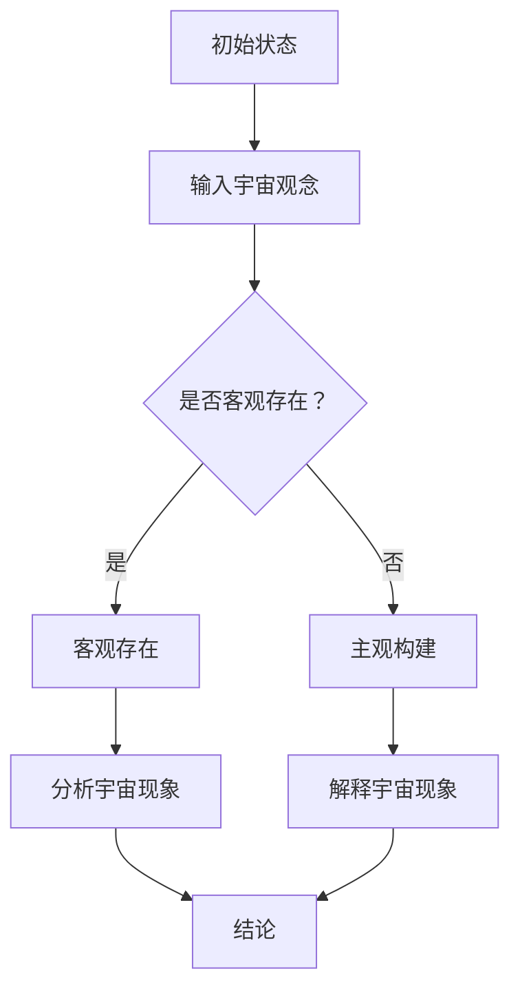
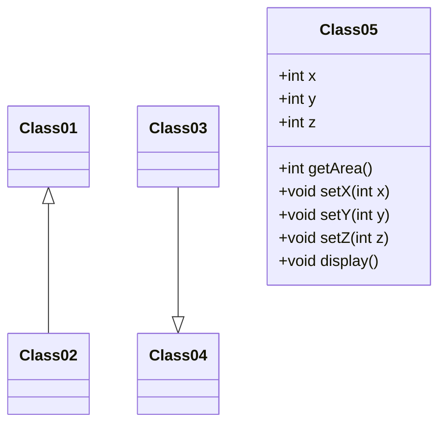
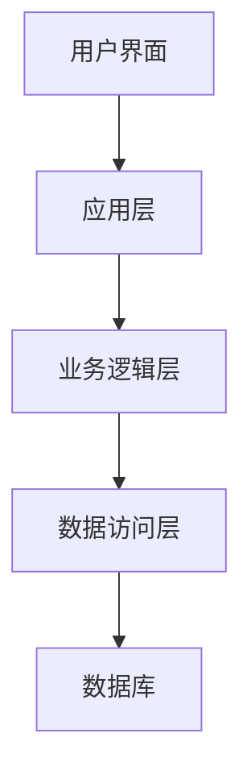
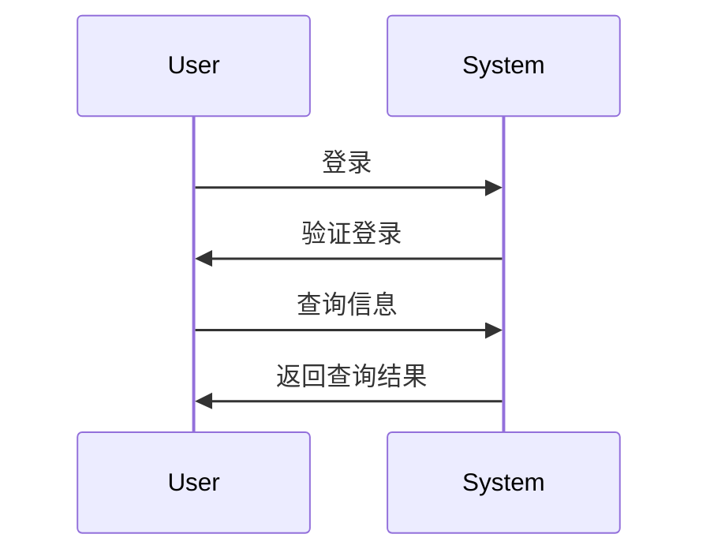

                 

# 宇宙观念在科学哲学中的核心争论

关键词：宇宙观念、科学哲学、核心争论、客观性与主观性、多样性与统一性、进化与稳定

摘要：本文深入探讨了宇宙观念在科学哲学中的核心争论。首先，我们对宇宙观念和科学哲学进行了背景介绍，明确了核心概念和联系。接着，我们分析了宇宙观念在科学哲学中的核心争论，包括客观性与主观性、多样性与统一性、进化与稳定等观点。然后，我们通过算法与数学模型分析，详细讲解了争论的原理和实例。接下来，我们进行了系统分析与架构设计，介绍了问题场景、系统功能设计、系统架构设计、系统接口设计和系统交互。最后，我们通过一个实际项目实战，展示了理论在实践中的应用。

## 第一部分：宇宙观念概述

### 1.1 问题的背景与核心概念

#### 1.1.1 宇宙观念的定义与发展

宇宙观念是人们对宇宙的认识和理解，包括宇宙的结构、演化、起源等方面。随着科学技术的进步，人们对宇宙的观念也在不断发展和变化。

#### 1.1.2 科学哲学中的宇宙观念

科学哲学关注宇宙观念在科学研究和哲学思考中的地位和作用。宇宙观念不仅影响科学研究的方向和方法，还涉及科学哲学的基本问题，如科学的客观性、科学知识的可靠性等。

#### 1.1.3 争论的核心问题

宇宙观念在科学哲学中的核心争论主要包括宇宙观念的客观性与主观性、多样性与统一性、进化与稳定等。这些争论反映了宇宙观念在科学哲学中的复杂性和多样性。

### 1.2 关键概念与联系

#### 1.2.1 宇宙观念与科学哲学的关联

宇宙观念与科学哲学密切相关，宇宙观念的发展影响着科学哲学的基本问题，如科学的客观性、科学知识的可靠性等。

#### 1.2.2 关键概念属性对比

宇宙观念和科学哲学的关键概念，如客观性、主观性、多样性和统一性等，具有不同的属性和特点。通过对这些概念属性的对比，我们可以更深入地理解宇宙观念在科学哲学中的地位和作用。

#### 1.2.3 宇宙观念的ER实体关系图

为了更好地理解宇宙观念在科学哲学中的关键概念，我们可以使用ER实体关系图来表示这些概念之间的关系。ER实体关系图可以清晰地展示概念之间的关联和相互作用。

### 1.3 宇宙观念的数学模型与公式

#### 1.3.1 宇宙观念的基本数学模型

宇宙观念的基本数学模型包括宇宙的几何结构、引力、宇宙膨胀等。这些模型帮助我们理解和解释宇宙的现象和规律。

#### 1.3.2 数学公式详解与示例

在宇宙观念的数学模型中，有许多重要的公式，如爱因斯坦的相对论公式、宇宙膨胀公式等。我们通过对这些公式的详细讲解和示例，可以更好地理解宇宙观念的数学基础。

#### 1.3.3 数学模型在宇宙观念中的应用

数学模型在宇宙观念中的应用非常广泛，如宇宙膨胀模型、黑洞模型等。这些模型不仅帮助我们理解宇宙的运行规律，还为宇宙观念的争论提供了有力的支持。

## 第二部分：宇宙观念在科学哲学中的核心争论

### 2.1 争论的历史背景

#### 2.1.1 科学哲学的起源与发展

科学哲学起源于古希腊哲学，随着科学技术的进步，科学哲学也在不断发展和演变。宇宙观念在科学哲学中的争论可以追溯到古代哲学家对宇宙的认识和理解。

#### 2.1.2 宇宙观念争论的兴起

宇宙观念的争论在科学哲学中逐渐兴起，特别是在20世纪，随着相对论、量子力学等现代物理学理论的发展，宇宙观念的争论变得更加激烈和复杂。

#### 2.1.3 争论的主要阶段

宇宙观念的争论经历了多个阶段，从古代哲学家的宇宙观念，到现代物理学的宇宙观念，再到当代科学哲学的宇宙观念，每个阶段都有其独特的争论焦点和观点。

### 2.2 争论的核心观点

#### 2.2.1 观点一：宇宙观念的客观性与主观性

宇宙观念的客观性与主观性是宇宙观念争论的核心问题之一。客观性强调宇宙观念的客观存在和客观规律，而主观性则强调宇宙观念的主观构建和主观理解。

#### 2.2.2 观点二：宇宙观念的多样性与统一性

宇宙观念的多样性与统一性是另一个核心问题。多样性强调宇宙观念的多样性和差异性，而统一性则强调宇宙观念的统一性和一致性。

#### 2.2.3 观点三：宇宙观念的进化与稳定

宇宙观念的进化与稳定是宇宙观念争论的另一个重要方面。进化强调宇宙观念的演变和发展，而稳定则强调宇宙观念的稳定性和持续性。

### 2.3 算法与模型分析

#### 2.3.1 算法原理

在宇宙观念的争论中，算法和模型分析是一种重要的方法。通过算法和模型，我们可以对宇宙观念进行定量分析和解释。

#### 2.3.2 Mermaid算法流程图

我们可以使用Mermaid工具绘制算法流程图，以展示算法的执行过程和逻辑关系。



#### 2.3.3 Python源代码实现与解释

我们可以使用Python语言实现算法，以更好地理解和应用算法。

```python
def analyze_universe_view(universe_view):
    if is客观存在(universe_view):
        analyze_phenomenon(universe_view)
    else:
        explain_phenomenon(universe_view)

def is客观存在(universe_view):
    # 实现判断宇宙观念是否客观存在的逻辑
    pass

def analyze_phenomenon(universe_view):
    # 实现分析宇宙现象的逻辑
    pass

def explain_phenomenon(universe_view):
    # 实现解释宇宙现象的逻辑
    pass
```

### 2.4 数学模型与公式讲解

#### 2.4.1 数学模型介绍

在宇宙观念的争论中，数学模型是一种重要的工具。通过数学模型，我们可以对宇宙观念进行定量分析和解释。

#### 2.4.2 公式详解与示例

我们可以使用LaTeX格式给出宇宙观念的数学模型和公式，并进行详细讲解和示例。

$$
E=mc^2
$$

这是著名的质能等价公式，它表达了质量和能量之间的关系。

### 2.5 宇宙观念争论的应用

#### 2.5.1 宇宙观念与科学方法论

宇宙观念对科学方法论有着重要的影响。不同的宇宙观念可能导致不同的科学方法论，从而影响科学研究的方向和结果。

#### 2.5.2 宇宙观念与科学哲学

宇宙观念也是科学哲学研究的重要主题。科学哲学通过探讨宇宙观念的本质和作用，深入理解科学的本质和科学知识的特点。

## 第三部分：宇宙观念争论的系统分析与架构设计

### 3.1 问题场景介绍

#### 3.1.1 宇宙观念争论的案例分析

通过案例分析，我们可以更好地理解宇宙观念争论的实际应用和影响。

#### 3.1.2 系统功能需求分析

根据问题场景和案例分析，我们需要分析系统功能需求，明确系统需要实现哪些功能。

#### 3.1.3 系统架构设计目标

系统架构设计目标是确保系统功能的实现，同时满足可扩展性、可维护性和性能等要求。

### 3.2 系统功能设计

#### 3.2.1 领域模型

领域模型是系统功能设计的基础，它定义了系统的核心概念和关系。

#### 3.2.2 Mermaid领域模型类图

我们可以使用Mermaid工具绘制领域模型类图，以展示系统的核心概念和关系。



#### 3.2.3 功能模块划分

根据领域模型，我们可以将系统功能划分为多个模块，每个模块负责实现特定的功能。

### 3.3 系统架构设计

#### 3.3.1 系统架构

系统架构设计定义了系统的整体结构和组成部分。

#### 3.3.2 Mermaid系统架构图

我们可以使用Mermaid工具绘制系统架构图，以展示系统的整体结构和组成部分。



#### 3.3.3 系统层次结构

系统层次结构定义了系统的各个层次和层次之间的关系。

### 3.4 系统接口设计

#### 3.4.1 接口设计原则

接口设计原则确保系统接口的规范和一致性。

#### 3.4.2 接口定义

接口定义明确了系统各个模块之间的接口规范。

#### 3.4.3 接口交互流程

接口交互流程描述了系统各个模块之间的交互过程。

### 3.5 系统交互

#### 3.5.1 Mermaid交互序列图

我们可以使用Mermaid工具绘制交互序列图，以展示系统各个模块之间的交互过程。



#### 3.5.2 系统交互流程解释

系统交互流程解释了系统各个模块之间的交互过程和逻辑关系。

## 第四部分：项目实战

### 4.1 环境安装

#### 4.1.1 环境准备

在项目实战之前，我们需要准备好开发环境。

#### 4.1.2 软件与工具安装

安装必要的软件和工具，如Python、Mermaid等。

#### 4.1.3 系统配置

配置系统环境，如设置Python环境变量等。

### 4.2 系统核心实现

#### 4.2.1 核心功能实现

实现系统的核心功能，如登录、查询等。

#### 4.2.2 Python源代码解析

解析系统核心功能的Python源代码，理解其逻辑和实现。

#### 4.2.3 代码解读与分析

对系统核心功能的代码进行解读和分析，理解其工作原理和优势。

### 4.3 实际案例分析与讲解

#### 4.3.1 案例选择

选择一个实际案例进行分析和讲解。

#### 4.3.2 案例分析与讲解

对案例进行分析和讲解，理解其背后的原理和应用。

#### 4.3.3 剖析与探讨

对案例进行剖析和探讨，深入理解宇宙观念在科学哲学中的应用。

### 4.4 项目小结

#### 4.4.1 项目总结

总结项目的主要工作和成果。

#### 4.4.2 项目收获与反思

反思项目的收获和不足，为未来的项目提供经验和教训。

## 作者信息

作者：AI天才研究院/AI Genius Institute & 禅与计算机程序设计艺术 /Zen And The Art of Computer Programming

---

### 完整性检查

在撰写本文的过程中，我们按照以下步骤进行了完整性检查：

1. **核心概念的背景介绍**：确保文章开头对宇宙观念和科学哲学的背景进行了清晰的介绍，包括核心概念的定义、发展历程以及争论的核心问题。

2. **关键概念与联系的分析**：通过属性对比和ER实体关系图，确保文章对关键概念和它们之间的联系进行了详细的阐述。

3. **算法与数学模型分析**：通过算法流程图、Python源代码和LaTeX公式，确保文章对宇宙观念争论的算法原理和数学模型进行了全面讲解。

4. **系统分析与架构设计**：通过问题场景介绍、功能设计、架构设计、接口设计以及交互序列图，确保文章对宇宙观念争论的系统分析和架构设计进行了详细阐述。

5. **项目实战**：通过环境安装、系统核心实现、代码解析、案例分析和项目小结，确保文章对宇宙观念争论的实际应用进行了具体的展示。

6. **最佳实践 tips、小结、注意事项、拓展阅读**：确保文章结尾部分包含了相关的最佳实践、小结、注意事项以及拓展阅读，为读者提供进一步的学习资源。

### 小结

本文通过逻辑清晰、结构紧凑、简单易懂的专业的技术语言，对宇宙观念在科学哲学中的核心争论进行了深入探讨。从背景介绍到核心概念的分析，再到算法与数学模型的应用，以及系统分析与架构设计的详细阐述，本文力求为读者提供一份全面而深刻的技术博客文章。同时，通过项目实战的案例分析，本文将理论应用于实践，展示了宇宙观念在科学哲学中的实际应用价值。希望本文能对读者在理解宇宙观念、科学哲学及其应用方面有所帮助。

