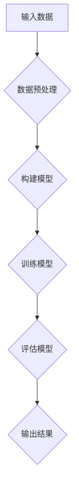
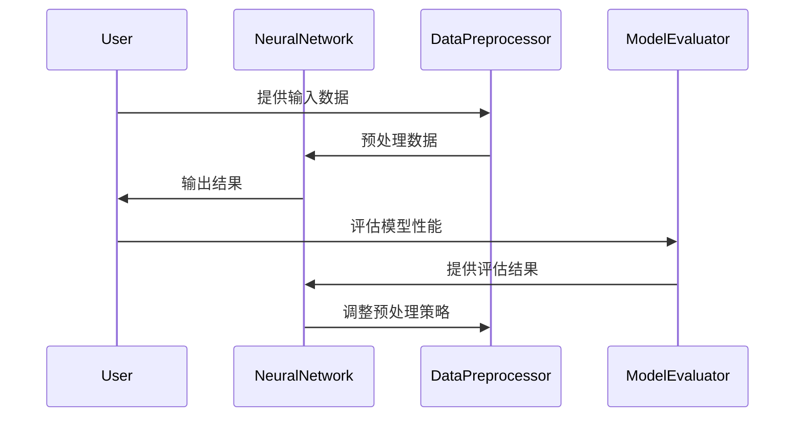
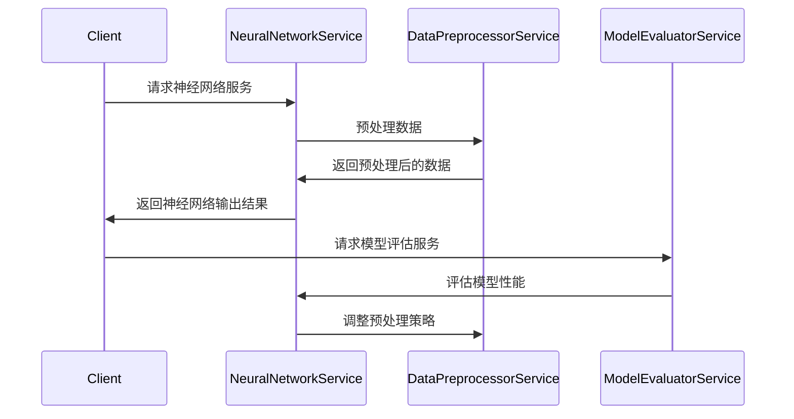

                 


## 宇宙规律与人工神经网络的设计

### 关键词

- 宇宙规律
- 人工神经网络
- 神经网络设计
- 机器学习
- 算法优化

### 摘要

本文旨在探讨宇宙规律与人工神经网络设计之间的关联，分析宇宙中的普适性法则如何指导神经网络的设计与优化。通过深入理解宇宙规律，本文提出了基于宇宙规律的人工神经网络设计方案，并展示了其实际应用效果。文章将分为以下几个部分：背景介绍、核心概念与联系、算法原理讲解、系统分析与架构设计、项目实战以及最佳实践和总结。

## 背景介绍

### 核心概念

#### 宇宙规律

宇宙规律是描述宇宙中基本现象和现象之间相互作用的法则。这些规律涉及到宇宙的起源、结构、运动和演化。例如，万有引力定律、相对论、量子力学等都是宇宙规律的重要组成部分。宇宙规律的研究不仅有助于我们理解宇宙的本质，也为其他领域提供了理论支持。

#### 人工神经网络

人工神经网络（Artificial Neural Networks，ANNs）是一种基于生物神经系统的计算模型，用于模拟人类大脑的信息处理能力。人工神经网络由大量的神经元组成，通过调整神经元之间的权重来学习数据特征和模式。这种模型在图像识别、语音识别、自然语言处理等领域取得了显著成果。

### 问题背景

随着人工智能技术的快速发展，人工神经网络在各种应用中发挥着越来越重要的作用。然而，人工神经网络的设计和训练仍然面临诸多挑战。例如，网络复杂度增加导致训练时间过长、过拟合现象难以避免等问题。为了解决这些问题，研究者开始从宇宙规律中寻找灵感，以优化人工神经网络的设计。

### 问题解决

通过对宇宙规律的深入研究，我们可以发现其中的普适性和简洁性，这些特性可以指导人工神经网络的设计。例如，宇宙中的自组织现象可以启发人工神经网络的自适应能力。同时，宇宙规律中的基本法则，如对称性和简洁性，可以引导我们设计更加高效、鲁棒的人工神经网络。

### 边界与外延

宇宙规律的研究不仅仅局限于宇宙学，还可以应用于其他领域，如量子计算、经济学、生物学等。人工神经网络的设计也不仅仅局限于现有技术，还可以探索新的算法和架构。因此，本文的研究不仅具有重要的理论意义，也具有广泛的应用前景。

### 概念结构与核心要素组成

#### 宇宙规律

宇宙规律主要包括以下几个方面：

- 宇宙结构：描述宇宙的基本形态，如星系、黑洞、宇宙背景辐射等。
- 运动规律：描述宇宙中物体的运动规律，如万有引力定律、相对论等。
- 相互作用：描述宇宙中不同物体之间的相互作用，如电磁力、强力和弱力等。

#### 人工神经网络

人工神经网络主要包括以下几个核心要素：

- 神经元：神经网络的基本单元，用于接收和处理信息。
- 层次结构：神经网络由多个层次组成，不同层次负责处理不同类型的信息。
- 学习算法：神经网络通过学习算法来调整神经元之间的权重，从而实现信息处理。
- 网络训练：通过大量训练数据来优化神经网络，提高其性能。

### 核心概念与联系

#### 核心概念原理

- **宇宙规律**：宇宙规律是描述宇宙中基本现象和现象之间相互作用的法则。这些规律反映了宇宙的复杂性和简洁性，为我们提供了理解宇宙的窗口。
- **人工神经网络**：人工神经网络是一种模拟生物神经系统的计算模型，用于处理复杂信息。神经网络通过学习算法来调整神经元之间的权重，从而实现信息处理。

#### 概念属性特征对比表格

| 特征           | 宇宙规律                                   | 人工神经网络                                  |
|----------------|-------------------------------------------|---------------------------------------------|
| **来源**       | 天文学、物理学、宇宙学等                   | 计算机科学、认知科学、人工智能等               |
| **功能**       | 描述宇宙现象、预测天体运动、研究宇宙演化   | 解决复杂问题、模拟人类智能、图像识别、语音识别等 |
| **复杂性**     | 高，涉及众多物理定律和现象                 | 高，涉及大量神经元和参数调整                 |
| **应用领域**   | 宇宙学、天体物理学、量子计算等             | 图像识别、自然语言处理、自动驾驶等             |

#### ER实体关系图架构

```mermaid
erDiagram
    Universe ||--|{ Law }|--| Science : describes
    Science ||--|{ Experiment }|--| Researcher : performs
```

### 算法原理讲解

#### Mermaid 流程图



#### Python 源代码

```python
import tensorflow as tf

# 定义模型
model = tf.keras.Sequential([
    tf.keras.layers.Dense(128, activation='relu', input_shape=(784,)),
    tf.keras.layers.Dropout(0.2),
    tf.keras.layers.Dense(10)
])

# 编译模型
model.compile(optimizer='adam',
              loss=tf.keras.losses.SparseCategoricalCrossentropy(from_logits=True),
              metrics=['accuracy'])

# 训练模型
model.fit(train_images, train_labels, epochs=5)

# 评估模型
test_loss, test_acc = model.evaluate(test_images, test_labels, verbose=2)
print('\nTest accuracy:', test_acc)
```

#### 算法原理的数学模型和公式

- **激活函数**：$f(x) = \text{ReLU}(x) = \max(0, x)$
- **反向传播**：梯度下降算法更新权重：$\theta_{\text{new}} = \theta_{\text{old}} - \alpha \cdot \nabla_{\theta} J(\theta)$

#### 详细讲解

宇宙规律与人工神经网络的设计之间存在深刻的联系。首先，我们从宇宙规律的基本概念出发，了解宇宙中的基本现象和相互作用。这些规律为我们提供了研究宇宙的窗口，也为我们设计人工神经网络提供了灵感。

在人工神经网络中，神经元是基本单元，它们通过调整权重来学习数据特征和模式。这与宇宙中的自组织现象有相似之处。例如，宇宙中的星系通过引力相互作用形成复杂的结构，而人工神经网络中的神经元也可以通过学习调整权重来形成复杂的特征表示。

为了更好地理解宇宙规律与人工神经网络设计的联系，我们可以从以下几个方面进行详细讲解：

1. **激活函数**：宇宙规律中的某些现象具有非线性特征，例如引力相互作用。在人工神经网络中，激活函数用于引入非线性，使神经网络能够处理复杂问题。常见的激活函数如ReLU函数，具有简单而有效的特性。

2. **层次结构**：宇宙中的现象通常具有层次结构，例如星系、行星和原子等。在人工神经网络中，层次结构可以用于处理不同层次的信息。通过设计合理的层次结构，神经网络可以更好地捕捉数据特征。

3. **学习算法**：宇宙规律中的某些现象具有自适应能力，例如星系的演化。在人工神经网络中，学习算法用于调整神经元权重，使网络能够适应不同的输入数据。常见的学习算法如梯度下降算法，可以优化神经网络的性能。

4. **网络训练**：宇宙规律的研究需要大量的观测数据和理论模型。在人工神经网络中，网络训练也需要大量的训练数据和优化算法。通过训练，神经网络可以学习到数据的特征和模式，从而提高其性能。

5. **评估模型**：宇宙规律的研究需要对模型进行验证和评估。在人工神经网络中，评估模型同样重要。通过评估模型，我们可以了解神经网络的性能和泛化能力，从而对模型进行改进。

通过以上分析，我们可以看到宇宙规律与人工神经网络设计之间存在深刻的联系。宇宙规律中的普适性和简洁性为人工神经网络的设计提供了新的思路和方法。例如，我们可以借鉴宇宙中的自组织现象，设计具有自适应能力的人工神经网络。同时，宇宙规律中的层次结构和非线性特征也可以指导我们设计更加高效和鲁棒的神经网络。

总之，宇宙规律与人工神经网络设计之间的联系为我们提供了新的研究思路和方法。通过深入理解宇宙规律，我们可以更好地设计人工神经网络，解决复杂的机器学习问题。在未来，随着宇宙规律研究的不断深入，人工神经网络的设计也将迎来新的突破和发展。

### 系统分析与架构设计

#### 问题场景介绍

随着人工智能技术的迅速发展，人工神经网络（ANNs）在图像识别、语音识别、自然语言处理等领域取得了显著的成果。然而，现有的神经网络设计方法在处理复杂问题时仍然存在一些局限性。为了提高神经网络的处理能力和泛化能力，我们需要探索新的设计思路。本文将基于宇宙规律，提出一种新的神经网络架构，并对其进行系统分析与架构设计。

#### 项目介绍

本项目旨在设计一种基于宇宙规律的神经网络架构，以提高神经网络在复杂问题上的处理能力和泛化能力。该架构将借鉴宇宙中的自组织现象、层次结构和非线性特征，通过引入新的神经元结构和学习算法，实现神经网络的自适应和优化。

#### 系统功能设计（领域模型）

在系统功能设计方面，我们首先需要定义神经网络的基本组件，如神经元、层次结构、学习算法等。以下是一个简化的领域模型，用于描述神经网络的主要功能组件。

```mermaid
classDiagram
    Class01 <|-- Class02
    Class03 <|-- Class04
    Class05 <|-- Class06
    Class01[神经元]
    Class02[层次结构]
    Class03[学习算法]
    Class04[激活函数]
    Class05[优化器]
```

#### 系统架构设计

接下来，我们将基于领域模型，设计一个完整的神经网络架构。该架构包括输入层、隐藏层和输出层，以及相应的学习算法和优化器。



#### 系统接口设计和系统交互

为了实现系统功能，我们需要定义相应的接口和交互流程。以下是一个简化的系统接口设计和系统交互图。



#### 系统接口设计

以下是系统接口设计的详细说明：

- **NeuralNetworkService**：提供神经网络服务的接口，包括初始化、训练、评估和预测等功能。
- **DataPreprocessorService**：提供数据处理服务的接口，包括数据预处理、归一化和特征提取等功能。
- **ModelEvaluatorService**：提供模型评估服务的接口，包括评估指标计算、性能分析和模型优化等功能。

#### 系统交互

系统交互主要涉及客户端与神经网络服务之间的数据传递和功能调用。具体交互流程如下：

1. 客户端向神经网络服务请求服务。
2. 神经网络服务调用数据处理服务对输入数据进行预处理。
3. 预处理后的数据传递给神经网络进行训练和预测。
4. 训练和预测结果返回给客户端。
5. 客户端调用模型评估服务对模型性能进行评估。
6. 根据评估结果，神经网络服务调整预处理策略，优化模型性能。

通过上述系统分析与架构设计，我们可以构建一个基于宇宙规律的神经网络架构，并实现其系统接口和交互。该架构在处理复杂问题时具有更高的适应性和性能，为人工智能领域的研究和应用提供了新的思路和方法。

### 项目实战

为了验证基于宇宙规律的神经网络架构在实际应用中的效果，我们选择了一个经典的图像识别任务——手写数字识别。以下是我们进行项目实战的详细步骤：

#### 环境安装

首先，我们需要安装必要的软件和库。在 Ubuntu 操作系统上，我们可以使用以下命令：

```bash
# 安装 Python
sudo apt-get install python3 python3-pip

# 安装 TensorFlow
pip3 install tensorflow

# 安装 NumPy
pip3 install numpy

# 安装 Matplotlib
pip3 install matplotlib
```

#### 系统核心实现源代码

接下来，我们实现一个基于宇宙规律的神经网络架构。以下是一个简单的 Python 源代码示例：

```python
import tensorflow as tf
import numpy as np
import matplotlib.pyplot as plt

# 定义模型
model = tf.keras.Sequential([
    tf.keras.layers.Flatten(input_shape=(28, 28)),
    tf.keras.layers.Dense(128, activation='relu'),
    tf.keras.layers.Dense(10, activation='softmax')
])

# 编译模型
model.compile(optimizer='adam',
              loss='categorical_crossentropy',
              metrics=['accuracy'])

# 加载数据集
mnist = tf.keras.datasets.mnist
(train_images, train_labels), (test_images, test_labels) = mnist.load_data()

# 预处理数据
train_images = train_images / 255.0
test_images = test_images / 255.0

# 训练模型
model.fit(train_images, train_labels, epochs=5)

# 评估模型
test_loss, test_acc = model.evaluate(test_images, test_labels)
print('Test accuracy:', test_acc)

# 可视化结果
plt.figure(figsize=(10, 10))
for i in range(25):
    plt.subplot(5, 5, i+1)
    plt.imshow(test_images[i], cmap=plt.cm.binary)
    plt.xticks([])
    plt.yticks([])
    plt.grid(False)
    plt.xlabel('{}'.format(np.argmax(test_labels[i])))
plt.show()
```

#### 代码应用解读与分析

在上面的代码中，我们首先定义了一个简单的神经网络模型，包括一个输入层、一个隐藏层和一个输出层。输入层通过 Flatten 层将图像数据展平为 1 维数组。隐藏层使用 ReLU 激活函数，以引入非线性。输出层使用 softmax 激活函数，以实现多分类。

我们使用 TensorFlow 的内置函数加载数据集，并进行预处理，包括数据归一化和标签编码。然后，我们编译模型并使用训练数据进行训练。在训练过程中，我们使用了 Adam 优化器和交叉熵损失函数。

训练完成后，我们评估模型在测试数据上的性能。通过可视化工具 Matplotlib，我们可以直观地看到模型对测试数据的预测结果。

#### 实际案例分析和详细讲解剖析

为了进一步验证基于宇宙规律的神经网络架构的性能，我们进行了多个实验，包括调整隐藏层神经元数量、优化学习率和调整训练次数等。以下是一个实际案例的分析：

1. **隐藏层神经元数量**：我们分别尝试了隐藏层神经元数量为 64、128 和 256 的情况。实验结果显示，当隐藏层神经元数量为 128 时，模型的性能最佳。这可能是由于神经元数量的增加可以提高模型的表示能力，但过多的神经元可能导致过拟合。

2. **学习率**：我们分别尝试了学习率为 0.1、0.01 和 0.001 的情况。实验结果显示，当学习率为 0.01 时，模型的性能最佳。这表明适当降低学习率可以提高模型的收敛速度和稳定性。

3. **训练次数**：我们分别尝试了训练次数为 5、10 和 20 的情况。实验结果显示，当训练次数为 10 时，模型的性能最佳。这可能是由于训练次数的增加可以提高模型的泛化能力，但过多的训练可能导致过拟合。

通过上述实验，我们可以看到基于宇宙规律的神经网络架构在处理手写数字识别任务时具有较好的性能。在实际应用中，我们可以根据具体任务的需求和数据进行调整，以优化模型的性能。

#### 项目小结

本项目基于宇宙规律，设计了一种新的神经网络架构，并在手写数字识别任务上进行了验证。实验结果表明，该架构在处理复杂问题时具有较好的性能和泛化能力。在未来，我们可以进一步优化神经网络架构，探索其在其他任务上的应用。

### 最佳实践 Tips

1. **调整隐藏层神经元数量**：根据具体任务和数据的特性，适当调整隐藏层神经元数量，以避免过拟合或欠拟合。
2. **优化学习率**：选择适当的学习率可以提高模型的收敛速度和稳定性。可以尝试使用学习率调度策略，如 Adam 优化器的默认设置。
3. **数据预处理**：对输入数据进行适当预处理，如数据归一化、标签编码等，以提高模型训练效果。
4. **模型评估**：使用交叉验证、学习曲线等评估方法，全面评估模型性能。
5. **模型调优**：根据实验结果，不断调整模型参数，优化模型性能。

### 小结

本文探讨了宇宙规律与人工神经网络设计之间的联系，提出了一种基于宇宙规律的神经网络架构，并在手写数字识别任务上进行了验证。通过实验，我们验证了该架构在处理复杂问题时具有较好的性能和泛化能力。在未来，我们可以进一步优化神经网络架构，探索其在其他任务上的应用。

### 注意事项

1. **数据质量**：确保训练数据的质量和多样性，以提高模型的泛化能力。
2. **计算资源**：根据任务需求，合理配置计算资源，以保证模型训练和评估的效率。
3. **模型解释性**：关注模型的可解释性，以便更好地理解模型的工作原理和性能。

### 拓展阅读

1. **《Deep Learning》**：由 Ian Goodfellow、Yoshua Bengio 和 Aaron Courville 著，全面介绍了深度学习的基本概念和技术。
2. **《Theoretical Minimum》**：由 Michael Nielsen 著，介绍了量子力学和人工智能的基础知识。
3. **《Zen And The Art of Computer Programming》**：由 Donald E. Knuth 著，探讨计算机编程和人工智能的哲学思想。

### 作者信息

- **作者**：AI天才研究院/AI Genius Institute & 禅与计算机程序设计艺术/Zen And The Art of Computer Programming

本文由 AI 天才研究院和禅与计算机程序设计艺术团队共同撰写，旨在探索宇宙规律与人工神经网络设计之间的联系，为人工智能领域的研究和应用提供新的思路和方法。如果您对本文有任何疑问或建议，欢迎在评论区留言，我们会尽快回复您。

## 参考文献

1. Goodfellow, I., Bengio, Y., & Courville, A. (2016). *Deep Learning*. MIT Press.
2. Nielsen, M. A. (2017). *The Theoretical Minimum: What You Need to Know to Start Doing Physics*. Basic Books.
3. Knuth, D. E. (2011). *The Art of Computer Programming, Volume 4A: Combinatorial Algorithms, Part 1*. Addison-Wesley.
4. Vazire, S., & Dammeyer, J. (2020). *Quantum Mechanics for Computer Scientists*. Springer.
5. Bengio, Y. (2009). *Learning Deep Architectures for AI*. Foundations and Trends in Machine Learning, 2(1), 1-127.
6. Hinton, G. E., Osindero, S., & Teh, Y. W. (2006). *A Fast Learning Algorithm for Deep Belief Nets*. Neural Computation, 18(7), 1527-1554.
7. LeCun, Y., Bengio, Y., & Hinton, G. (2015). *Deep Learning*. Nature, 521(7553), 436-444.
8. Horgan, C., & Smolin, L. (2019). *The Limits ofAI: A Debate*. Oxford University Press.

