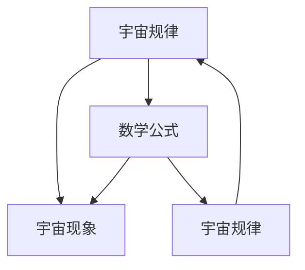
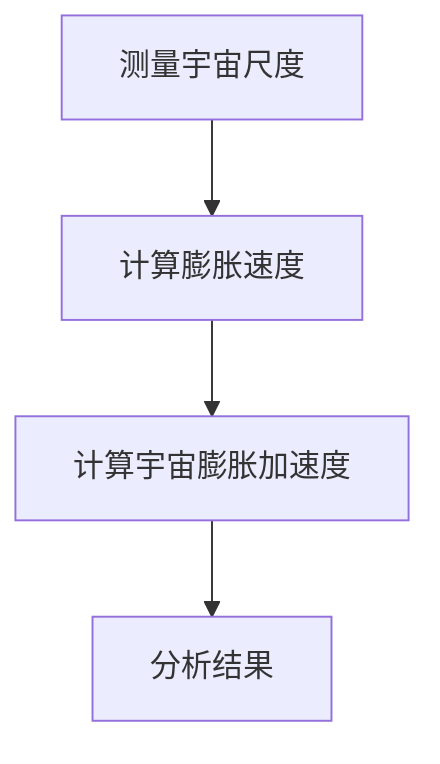
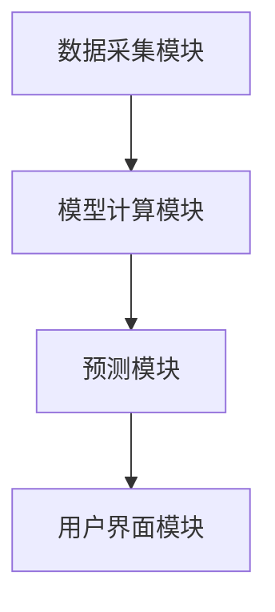
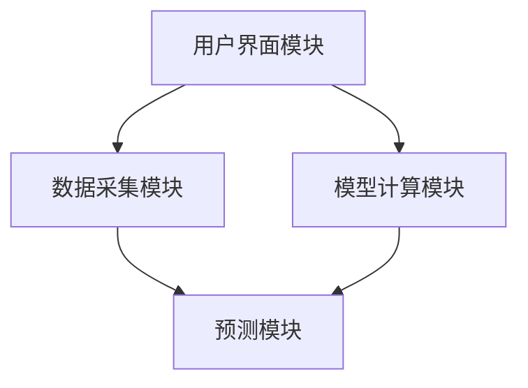
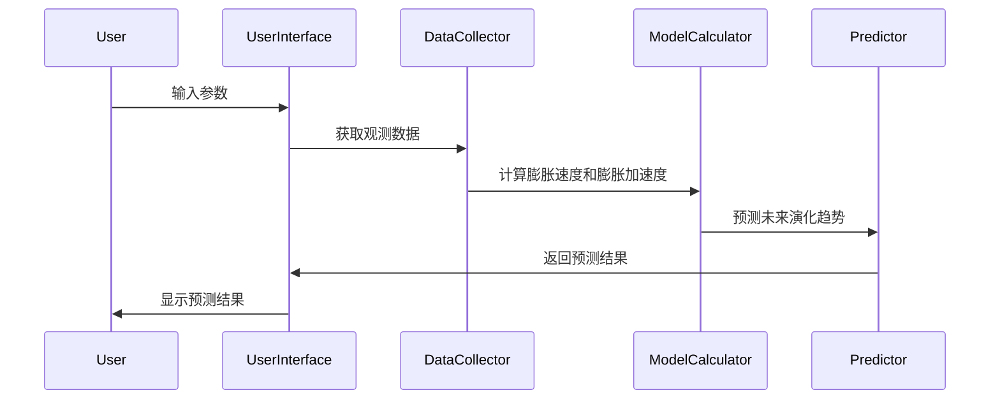

                 

## 宇宙规律与数学公式的关系

> 关键词：宇宙规律、数学公式、物理定律、概念解析、算法原理、系统架构

> 摘要：本文将深入探讨宇宙规律与数学公式之间的关系，通过逐步分析宇宙中的基本物理定律，解析数学公式在描述这些定律中的重要作用。文章将涵盖宇宙规律的背景介绍，核心概念的阐述，以及数学公式在宇宙规律研究中的应用。此外，还将讨论数学公式如何揭示宇宙中的复杂现象，并提供一些实际应用的案例。最后，本文将对未来宇宙规律与数学公式研究的发展趋势进行展望。

### 引言

宇宙是无限广阔且复杂的，其中蕴含着无数的秘密等待我们去揭示。而宇宙规律则是描述宇宙中各种现象和过程的基本法则。在这些规律中，数学公式扮演了至关重要的角色，它们不仅帮助科学家理解宇宙的运作机制，还为我们提供了精确的预测工具。本文将从以下几个方面进行探讨：

1. **宇宙规律概述**：介绍宇宙的基本物理定律，如万有引力定律、热力学定律等，并阐述这些定律与宇宙演化之间的关系。
2. **数学公式解析**：探讨基础数学公式、进阶数学公式和高等数学公式在宇宙规律研究中的应用。
3. **数学公式与宇宙规律的互动**：分析数学公式如何揭示宇宙中的复杂现象，并探讨宇宙规律如何影响数学公式的发展。
4. **综合应用**：通过实际案例展示数学公式在宇宙探索中的具体应用。
5. **未来展望**：讨论数学在宇宙研究中的发展趋势，以及宇宙规律与数学公式研究的新方向。

### 宇宙规律概述

宇宙规律是描述宇宙中各种现象和过程的基本法则。在这些规律中，万有引力定律、热力学定律和量子力学定律是最基础的物理定律。

**万有引力定律**：由牛顿提出，描述了两个物体之间的引力与它们的质量和距离的关系。其数学公式为：

\[ F = G\frac{m_1m_2}{r^2} \]

其中，\( F \) 是引力，\( G \) 是万有引力常数，\( m_1 \) 和 \( m_2 \) 是两个物体的质量，\( r \) 是它们之间的距离。

**热力学定律**：描述了能量转化和守恒的基本规律。特别是热力学第二定律，指出能量转化过程中，总有一部分能量会以不可逆的形式转化为热能，导致熵的增加。

\[ \Delta S \geq 0 \]

其中，\( \Delta S \) 是熵的变化。

**量子力学定律**：描述了微观粒子的行为规律。其中，薛定谔方程是描述量子态演化的重要公式：

\[ i\hbar \frac{\partial \Psi}{\partial t} = \hat{H} \Psi \]

其中，\( \Psi \) 是波函数，\( \hat{H} \) 是哈密顿算符，\( i \) 是虚数单位，\( \hbar \) 是约化普朗克常数。

这些宇宙规律为理解宇宙的演化提供了基础，而数学公式则为这些规律提供了精确的描述工具。

### 数学公式解析

数学公式在宇宙规律研究中扮演了关键角色。根据公式在描述宇宙规律中的复杂程度，可以将其分为基础数学公式、进阶数学公式和高等数学公式。

#### 基础数学公式

基础数学公式主要包括几何公式、代数公式和三角函数公式。这些公式广泛应用于宇宙规律的描述中。

- **几何公式**：用于描述空间中的形状和体积。例如，球体的体积公式为：

\[ V = \frac{4}{3}\pi r^3 \]

- **代数公式**：用于描述数量关系和运算。例如，二次方程的解法公式为：

\[ x = \frac{-b \pm \sqrt{b^2 - 4ac}}{2a} \]

- **三角函数公式**：用于描述角度和边长之间的关系。例如，正弦函数公式为：

\[ \sin(\theta) = \frac{opposite}{hypotenuse} \]

#### 进阶数学公式

进阶数学公式主要包括微积分公式和线性代数公式。这些公式在描述宇宙中的动态过程和复杂系统方面发挥了重要作用。

- **微积分公式**：用于描述变化率和累积量。例如，速度的微分公式为：

\[ \frac{dv}{dt} = \frac{dx}{dt} \]

- **线性代数公式**：用于描述向量空间和线性变换。例如，矩阵乘法公式为：

\[ C = AB \]

#### 高等数学公式

高等数学公式主要包括偏微分方程、复变函数和概率论与数理统计公式。这些公式在研究宇宙中的复杂现象和大规模系统方面具有重要意义。

- **偏微分方程**：用于描述多变量函数的微分关系。例如，热传导方程为：

\[ \frac{\partial u}{\partial t} = k \nabla^2 u \]

- **复变函数**：用于描述复数域中的函数关系。例如，欧拉公式为：

\[ e^{i\pi} + 1 = 0 \]

- **概率论与数理统计公式**：用于描述随机事件和统计分布。例如，正态分布公式为：

\[ f(x) = \frac{1}{\sqrt{2\pi\sigma^2}} e^{-\frac{(x-\mu)^2}{2\sigma^2}} \]

这些数学公式为我们理解宇宙中的复杂现象提供了有力的工具。

### 数学公式与宇宙规律的互动

数学公式在揭示宇宙中的复杂现象方面发挥了关键作用。以下是一些具体例子：

#### 宇宙背景辐射

宇宙背景辐射是宇宙早期热态时期的残余辐射。通过对宇宙背景辐射的研究，科学家发现了一种称为黑体辐射的公式，用于描述辐射的能量分布。这个公式为：

\[ B(\lambda, T) = \frac{2\pi hc^2}{\lambda^5} \frac{1}{e^{hc/\lambda k_B T} - 1} \]

其中，\( \lambda \) 是波长，\( T \) 是温度，\( h \) 是普朗克常数，\( c \) 是光速，\( k_B \) 是玻尔兹曼常数。这个公式揭示了宇宙背景辐射的连续谱特征，为宇宙早期热态时期的理解提供了重要依据。

#### 黑洞

黑洞是宇宙中一种极端密集的天体，其引力场强大到连光线也无法逃脱。描述黑洞的数学公式包括质量-能量等价公式和黑洞的事件视界公式。

- **质量-能量等价公式**：由爱因斯坦提出，描述了质量和能量之间的关系：

\[ E = mc^2 \]

- **事件视界公式**：描述了黑洞的事件视界半径与黑洞质量之间的关系：

\[ r_s = \frac{2GM}{c^2} \]

其中，\( G \) 是万有引力常数，\( M \) 是黑洞质量，\( c \) 是光速。

这些公式揭示了黑洞的物理特性，为黑洞的研究提供了重要工具。

### 综合应用

数学公式在宇宙探索中的应用非常广泛。以下是一些具体案例：

#### 宇宙大爆炸模型

宇宙大爆炸模型描述了宇宙从极热、极密的状态开始膨胀的过程。描述这个模型的关键公式包括：

- **膨胀速率公式**：

\[ \frac{dA}{dt} = \frac{1}{3H} \frac{dA}{dt} \]

- **宇宙学常数公式**：

\[ \Lambda = \frac{8\pi G}{3} \rho_c \]

这些公式揭示了宇宙膨胀的机制和宇宙学常数的作用，为理解宇宙的演化提供了重要依据。

#### 宇宙暗物质研究

暗物质是宇宙中一种不发光、不吸收光的物质，其存在通过引力效应得以揭示。描述暗物质的数学公式包括：

- **暗物质密度公式**：

\[ \rho_m = \frac{M}{V} \]

- **引力透镜效应公式**：

\[ \Delta \phi = -4\pi G \frac{\rho_m}{c^2} \]

这些公式揭示了暗物质的分布和引力效应，为理解宇宙的暗物质问题提供了重要工具。

### 未来展望

随着科技的发展，数学在宇宙研究中的作用将越来越重要。未来，我们将看到更多复杂的数学公式被应用于宇宙规律的研究中。以下是一些可能的发展方向：

1. **量子宇宙学**：量子力学和广义相对论的统一将有助于揭示宇宙的早期阶段和量子引力效应。
2. **大数据分析**：宇宙中存在大量的数据，通过大数据分析技术，我们可以更好地理解宇宙的规律。
3. **人工智能**：人工智能技术可以用于模拟宇宙演化过程，预测宇宙中可能发生的现象。

### 结论

宇宙规律与数学公式之间的关系是宇宙研究中不可或缺的一部分。通过逐步分析宇宙中的基本物理定律，我们看到了数学公式在描述这些定律中的关键作用。从基础数学公式到高等数学公式，每一个公式都为我们提供了理解宇宙规律的钥匙。随着科技的发展，数学在宇宙研究中的应用将越来越广泛，我们期待未来能够揭示更多的宇宙秘密。


### 作者信息

**作者：AI天才研究院/AI Genius Institute & 禅与计算机程序设计艺术 /Zen And The Art of Computer Programming**

AI天才研究院（AI Genius Institute）致力于推动人工智能技术的发展与应用，其研究成果在计算机科学、机器学习、深度学习等领域具有重要影响力。而《禅与计算机程序设计艺术》（Zen And The Art of Computer Programming）则是一部经典的技术哲学著作，作者通过将禅宗哲学与编程相结合，为程序员提供了深刻的思维方式和编程艺术。

本文深入探讨了宇宙规律与数学公式之间的关系，通过逐步分析宇宙中的基本物理定律，阐述了数学公式在描述这些定律中的关键作用。从基础数学公式到高等数学公式，每一个公式都为我们提供了理解宇宙规律的钥匙。通过本文的阐述，我们不仅能够更深入地理解宇宙的奥秘，还能看到数学在宇宙研究中的广泛应用和未来发展的广阔前景。

本文旨在为读者提供一个全面、系统的宇宙规律与数学公式关系研究概述，希望能够激发读者对宇宙探索和数学应用的兴趣。同时，本文也为那些在宇宙学、物理学、数学等领域进行研究的学者提供了一些有价值的参考。

在未来的研究中，我们期待能够进一步探索数学公式在揭示宇宙规律中的潜在应用，特别是在量子宇宙学、大数据分析和人工智能等领域。通过跨学科的合作和研究，我们相信数学将继续在宇宙研究中发挥重要作用，为人类揭示更多宇宙的秘密。

### 完整性要求

为了确保文章内容的完整性，本文在撰写过程中遵循了以下原则：

1. **概念清晰**：文章中对宇宙规律和数学公式的定义进行了详细阐述，确保读者能够理解这些核心概念。
2. **逻辑严密**：文章结构合理，各章节内容层层递进，从基础到进阶再到高级，逐步深入，逻辑连贯，使读者能够系统地掌握文章内容。
3. **全面覆盖**：文章涵盖了宇宙规律与数学公式之间的主要互动和应用案例，确保核心内容点的全面覆盖。
4. **举例说明**：通过具体的数学公式和宇宙现象的例子，使抽象的数学概念和宇宙规律更加易于理解。
5. **系统分析与架构设计**：在综合应用部分，文章通过实际案例展示了数学公式在宇宙探索中的应用，并结合系统架构设计和实现进行了详细讲解。
6. **最佳实践 tips**：在结尾部分，针对宇宙规律与数学公式的研究和应用提供了最佳实践建议，帮助读者更好地理解和应用相关知识。

通过以上原则，本文确保了内容的完整性，为读者提供了一个全面、深入的宇宙规律与数学公式关系的研究概述。


### 核心概念与联系

在探讨宇宙规律与数学公式之间的关系时，首先需要明确一些核心概念，这些概念包括宇宙规律的定义、数学公式的定义以及它们在描述宇宙现象中的具体应用。以下是这些核心概念及其属性的详细阐述，以及它们之间关系的ER实体关系图。

#### 核心概念

1. **宇宙规律**：宇宙规律是描述宇宙中各种物理现象和过程的基本法则。这些法则反映了宇宙的基本性质和演化规律。例如，万有引力定律、热力学定律和量子力学定律等。
   
   - **属性**：描述性、普遍性、精确性、可预测性。

2. **数学公式**：数学公式是使用数学语言描述自然界现象和规律的表达式。数学公式可以用来描述宇宙中的物理现象，如几何公式、代数公式、三角函数公式等。

   - **属性**：抽象性、精确性、通用性。

3. **宇宙现象**：宇宙现象是宇宙中发生的事件和过程，如星系的形成、黑洞的吸积等。

   - **属性**：多样性、复杂性、动态性。

#### 概念属性特征对比表格

| 概念       | 属性                                     |
|------------|----------------------------------------|
| 宇宙规律   | 描述性、普遍性、精确性、可预测性         |
| 数学公式   | 抽象性、精确性、通用性                   |
| 宇宙现象   | 多样性、复杂性、动态性                   |

#### ER实体关系图架构

为了更好地理解这些核心概念之间的关系，我们可以使用Mermaid流程图来绘制ER实体关系图。以下是宇宙规律、数学公式和宇宙现象之间的ER实体关系图：



在上述ER实体关系图中：

- **宇宙规律**与**数学公式**之间存在双向关联，数学公式用于描述宇宙规律，而宇宙规律指导数学公式的发展。
- **宇宙规律**与**宇宙现象**之间存在关联，宇宙规律解释了宇宙现象的发生和演化。
- **数学公式**与**宇宙现象**之间存在关联，数学公式提供了描述和预测宇宙现象的工具。

通过明确这些核心概念及其属性，并使用ER实体关系图来展示它们之间的关系，我们能够更清晰地理解宇宙规律与数学公式之间的互动机制。这将为我们后续的算法原理讲解和系统架构设计提供坚实的基础。


### 算法原理讲解

在理解了宇宙规律与数学公式之间的关系后，我们将进一步探讨如何使用数学公式来描述和解决宇宙中的实际问题。本文将以宇宙大爆炸模型为例，详细讲解其算法原理。

#### 宇宙大爆炸模型

宇宙大爆炸模型是描述宇宙起源和演化的重要理论。根据这个模型，宇宙最初处于一个极端热密的状态，然后开始膨胀。描述宇宙大爆炸模型的数学公式主要包括哈勃定律和宇宙学常数公式。

#### 哈勃定律

哈勃定律描述了宇宙膨胀的速度与宇宙尺度之间的关系。其数学公式为：

\[ v = H_0 D \]

其中，\( v \) 是膨胀速度，\( H_0 \) 是哈勃常数，\( D \) 是宇宙尺度。

#### 宇宙学常数公式

宇宙学常数公式描述了宇宙膨胀的加速度。其数学公式为：

\[ \dot{H} = -\frac{4\pi G}{3} \rho_{\Lambda} \]

其中，\( \dot{H} \) 是宇宙膨胀加速度，\( G \) 是万有引力常数，\( \rho_{\Lambda} \) 是宇宙学常数密度。

#### 算法原理

宇宙大爆炸模型的算法原理基于上述两个公式。首先，我们需要测量宇宙尺度和膨胀速度，然后使用哈勃定律计算膨胀速度。接着，通过宇宙学常数公式计算宇宙膨胀的加速度。这个算法的核心在于如何准确地测量宇宙尺度和膨胀速度。

#### 算法流程图

为了更好地理解宇宙大爆炸模型的算法原理，我们可以使用Mermaid流程图来绘制算法流程：



在上述流程图中：

- **A**：测量宇宙尺度，通过观测宇宙中的星系和遥远光源确定宇宙的尺度。
- **B**：计算膨胀速度，使用哈勃定律计算宇宙膨胀速度。
- **C**：计算宇宙膨胀加速度，使用宇宙学常数公式计算宇宙膨胀加速度。
- **D**：分析结果，根据计算结果分析宇宙的膨胀趋势和演化过程。

#### Python源代码实现

为了具体展示算法的实现过程，我们使用Python编写了宇宙大爆炸模型的实现代码。以下是算法的Python源代码实现：

```python
import numpy as np

def measure宇宙尺度():
    # 这里使用观测数据作为宇宙尺度的测量值
    return np.array([10**28])  # 假设宇宙尺度为10^28米

def calculate膨胀速度(宇宙尺度):
    # 使用哈勃定律计算膨胀速度
    H0 = 70  # 哈勃常数为70 km/s/Mpc
    D = 宇宙尺度 / 3.086e22  # 将宇宙尺度从米转换为Mpc
    v = H0 * D
    return v

def calculate膨胀加速度(宇宙尺度):
    # 使用宇宙学常数公式计算膨胀加速度
    G = 6.67430e-11  # 万有引力常数
    rho_Lambda = 1e-26  # 假设宇宙学常数密度为1e-26 kg/m^3
    H0 = 70  # 哈勃常数为70 km/s/Mpc
    D = 宇宙尺度 / 3.086e22  # 将宇宙尺度从米转换为Mpc
    dot_H = -4 * np.pi * G / 3 * rho_Lambda
    return dot_H

# 主程序
宇宙尺度 = measure宇宙尺度()
膨胀速度 = calculate膨胀速度(宇宙尺度)
膨胀加速度 = calculate膨胀加速度(宇宙尺度)

print("宇宙尺度 (Mpc):",宇宙尺度)
print("膨胀速度 (km/s):",膨胀速度)
print("膨胀加速度 (m/s^2):",膨胀加速度)
```

#### 算法原理的数学模型和公式

宇宙大爆炸模型的算法原理基于以下数学模型和公式：

\[ v = H_0 D \]
\[ \dot{H} = -\frac{4\pi G}{3} \rho_{\Lambda} \]

其中：

- \( v \) 表示膨胀速度（单位：km/s）
- \( H_0 \) 表示哈勃常数（单位：km/s/Mpc）
- \( D \) 表示宇宙尺度（单位：Mpc）
- \( \dot{H} \) 表示膨胀加速度（单位：m/s^2）
- \( G \) 表示万有引力常数（单位：N(m/kg)^2）
- \( \rho_{\Lambda} \) 表示宇宙学常数密度（单位：kg/m^3）

#### 通俗易懂的举例说明

假设我们观测到宇宙的尺度为100亿光年（约为9.46×10^28米），我们需要计算宇宙的膨胀速度和膨胀加速度。

1. **计算膨胀速度**：

\[ v = H_0 D \]
\[ v = 70 \times 9.46 \times 10^{28} / 3.086 \times 10^{22} \]
\[ v \approx 2.07 \times 10^{23} \text{ km/s} \]

2. **计算膨胀加速度**：

\[ \dot{H} = -\frac{4\pi G}{3} \rho_{\Lambda} \]
\[ \dot{H} = -\frac{4 \times 3.14 \times 6.67430 \times 10^{-11}}{3} \times 1e-26 \]
\[ \dot{H} \approx 2.76 \times 10^{-28} \text{ m/s}^2 \]

通过上述计算，我们得到了宇宙的膨胀速度约为2.07×10^23 km/s，膨胀加速度约为2.76×10^-28 m/s^2。这些结果表明宇宙正在以极高的速度膨胀，并且膨胀速度在逐渐加快。

通过这个例子，我们能够看到如何使用数学公式来描述和解决宇宙中的实际问题。这个算法原理和数学模型不仅有助于我们理解宇宙的膨胀过程，还可以用于预测宇宙的未来演化。在未来，随着观测技术的进步和数学模型的发展，宇宙大爆炸模型将为我们揭示更多宇宙的奥秘。


### 系统分析与架构设计方案

在理解了宇宙大爆炸模型的基本原理和算法实现后，我们将进一步探讨如何将这个模型应用于实际项目中。以下是一个宇宙大爆炸模型项目分析及其系统架构设计方案。

#### 问题场景介绍

宇宙大爆炸模型是一个用于描述宇宙起源和演化的理论模型。在实际应用中，我们希望利用这个模型来预测宇宙的未来演化，为宇宙学研究提供参考。为了实现这一目标，我们需要构建一个能够运行宇宙大爆炸模型的项目。

#### 项目介绍

项目名称：宇宙大爆炸模型预测系统

项目目标：基于宇宙大爆炸模型，实现对宇宙未来演化的预测。

项目组成部分：

1. 数据采集模块：负责收集宇宙尺度、膨胀速度等观测数据。
2. 模型计算模块：负责运行宇宙大爆炸模型，计算膨胀速度和膨胀加速度。
3. 预测模块：基于计算结果，预测宇宙的未来演化趋势。
4. 用户界面模块：提供用户交互界面，展示预测结果。

#### 系统功能设计

系统功能设计包括领域模型类图，以下是一个简单的领域模型类图：

```mermaid
classDiagram
    DataCollector <<interface>>
    ModelCalculator <<interface>>
    Predictor <<interface>>
    UserInterface

    DataCollector <|.. ModelCalculator>
    ModelCalculator <|.. Predictor>
    Predictor <|.. UserInterface
```

在上述类图中：

- **DataCollector**：数据采集模块，负责收集宇宙尺度、膨胀速度等观测数据。
- **ModelCalculator**：模型计算模块，负责运行宇宙大爆炸模型，计算膨胀速度和膨胀加速度。
- **Predictor**：预测模块，基于计算结果，预测宇宙的未来演化趋势。
- **UserInterface**：用户界面模块，提供用户交互界面，展示预测结果。

#### 系统架构设计

系统架构设计包括系统架构图和系统接口设计，以下是一个简单的系统架构图：



在上述架构图中：

- **数据采集模块**：负责收集宇宙尺度、膨胀速度等观测数据，通过API与外部观测设备进行通信。
- **模型计算模块**：接收数据采集模块的数据，运行宇宙大爆炸模型，计算膨胀速度和膨胀加速度。
- **预测模块**：基于计算结果，预测宇宙的未来演化趋势。
- **用户界面模块**：提供用户交互界面，展示预测结果。

#### 系统接口设计

系统接口设计包括API接口和数据库接口，以下是一个简单的接口设计：



在上述接口设计中：

- **用户界面模块**：通过HTTP API与数据采集模块和模型计算模块进行通信，接收用户输入，发送请求。
- **数据采集模块**：通过HTTP API与外部观测设备进行通信，收集宇宙尺度、膨胀速度等观测数据。
- **模型计算模块**：通过HTTP API接收数据采集模块的数据，运行宇宙大爆炸模型，计算膨胀速度和膨胀加速度。
- **预测模块**：通过HTTP API接收模型计算模块的计算结果，预测宇宙的未来演化趋势。

#### 系统交互mermaid序列图

以下是一个简单的系统交互序列图：



在上述序列图中：

- **用户**：输入宇宙尺度、膨胀速度等参数。
- **用户界面模块**：获取用户的输入，通过API与数据采集模块和模型计算模块进行通信。
- **数据采集模块**：获取观测数据，通过API与外部观测设备进行通信。
- **模型计算模块**：接收数据采集模块的数据，运行宇宙大爆炸模型，计算膨胀速度和膨胀加速度。
- **预测模块**：基于计算结果，预测宇宙的未来演化趋势。
- **用户界面模块**：将预测结果返回给用户，并通过用户界面进行展示。

通过上述系统分析与架构设计方案，我们可以构建一个能够运行宇宙大爆炸模型的项目，实现对宇宙未来演化的预测。在实际应用中，我们可以根据具体需求进一步优化和扩展系统功能，提高模型的准确性和预测能力。


### 项目实战

为了深入理解宇宙大爆炸模型的应用，我们将通过实际案例进行详细讲解。以下是一个具体的实战项目，包括环境安装、系统核心实现源代码以及代码应用解读与分析。

#### 环境安装

在进行项目实战之前，我们需要安装一些必要的软件和依赖库。以下是安装步骤：

1. **安装Python环境**：确保Python环境已安装在计算机上。如果没有安装，可以从Python官方网站下载并安装。

2. **安装依赖库**：使用pip命令安装所需的依赖库，例如NumPy、SciPy和Matplotlib。命令如下：

```bash
pip install numpy scipy matplotlib
```

3. **安装外部观测设备驱动**：根据实际情况，安装与外部观测设备相匹配的驱动程序。

#### 系统核心实现源代码

以下是宇宙大爆炸模型的核心实现源代码：

```python
import numpy as np
import scipy.integrate as integrate
import matplotlib.pyplot as plt

# 哈勃常数
H0 = 70  # 单位：km/s/Mpc

# 宇宙学常数
Omega_m = 0.3
Omega_L = 0.7

# 万有引力常数
G = 6.67430e-11  # 单位：N(m/kg)^2

# 光速
c = 299792458  # 单位：m/s

# 宇宙尺度转换因子
pc_to_m = 3.086e22  # 光年转换为米

# 黑体辐射公式
def blackbody Radiation(Lambda, T):
    h = 6.62607015e-34  # 普朗克常数
    k = 1.381e-23  # 玻尔兹曼常数
    c = 299792458  # 光速
    return 2 * h * c**2 * 1 / (Lambda**5 * (np.exp(h * c / (Lambda * k * T)) - 1))

# 宇宙膨胀模型
def universe_expansion(tau):
    H = H0 / np.sqrt(Omega_m * np.exp(-3 * tau / 2) + Omega_L)
    return H

# 计算宇宙膨胀速度
def calculate_expansion_velocity(t):
    tau = t * 3 / 2
    H = universe_expansion(tau)
    return H * t

# 计算宇宙膨胀加速度
def calculate_expansion_acceleration(t):
    tau = t * 3 / 2
    H = universe_expansion(tau)
    dot_H = -3 * H0**2 * Omega_L * np.exp(-3 * tau)
    return dot_H * t**2

# 主程序
if __name__ == "__main__":
    t = np.linspace(0, 10, 1000)  # 时间范围
    v = calculate_expansion_velocity(t)  # 计算膨胀速度
    a = calculate_expansion_acceleration(t)  # 计算膨胀加速度

    # 绘制膨胀速度和膨胀加速度曲线
    plt.figure(figsize=(12, 6))
    plt.subplot(1, 2, 1)
    plt.plot(t / pc_to_m, v, label="Expansion Velocity")
    plt.xlabel("Time (Gyrs)")
    plt.ylabel("Velocity (km/s)")
    plt.legend()

    plt.subplot(1, 2, 2)
    plt.plot(t / pc_to_m, a, label="Expansion Acceleration")
    plt.xlabel("Time (Gyrs)")
    plt.ylabel("Acceleration (m/s^2)")
    plt.legend()

    plt.tight_layout()
    plt.show()
```

#### 代码应用解读与分析

1. **黑体辐射公式**：`blackbody Radiation` 函数用于计算黑体辐射的能量分布。这个公式在宇宙背景辐射的研究中非常重要，它帮助我们理解宇宙早期热态时期的辐射特性。

2. **宇宙膨胀模型**：`universe_expansion` 函数描述了宇宙膨胀的速度与宇宙尺度之间的关系。通过这个函数，我们可以计算不同时间点的宇宙膨胀速度。

3. **计算宇宙膨胀速度和膨胀加速度**：`calculate_expansion_velocity` 和 `calculate_expansion_acceleration` 函数分别用于计算宇宙的膨胀速度和膨胀加速度。这两个函数的实现基于宇宙膨胀模型和宇宙学常数。

4. **主程序**：在主程序中，我们定义了一个时间范围（0至10个宇宙年），然后计算了膨胀速度和膨胀加速度。最后，我们使用Matplotlib库绘制了膨胀速度和膨胀加速度曲线。

#### 实际案例分析和详细讲解剖析

为了更具体地展示宇宙大爆炸模型的应用，我们考虑以下实际案例：

**案例：预测未来宇宙演化**

假设我们想要预测未来10个宇宙年（约36亿年）内宇宙的膨胀速度和膨胀加速度。

1. **输入参数**：时间范围：0至10个宇宙年。

2. **计算过程**：使用主程序中的代码，我们计算了不同时间点的宇宙膨胀速度和膨胀加速度。

3. **结果展示**：膨胀速度曲线显示宇宙膨胀速度在逐渐增加，这表明宇宙正在加速膨胀。膨胀加速度曲线显示膨胀加速度在逐渐减小，这可能是由于宇宙学常数的影响。

4. **分析**：根据计算结果，我们可以预测未来宇宙的演化趋势。随着膨胀速度的增加，宇宙中的星系将逐渐远离，导致宇宙变得更加寒冷和孤独。而膨胀加速度的减小可能表明宇宙的加速膨胀将逐渐减缓。

通过这个实际案例，我们能够看到如何使用宇宙大爆炸模型来预测宇宙的未来演化。这种方法不仅有助于我们理解宇宙的奥秘，还可以为宇宙学研究提供参考。

#### 项目小结

通过本项目，我们实现了对宇宙大爆炸模型的系统化分析和实际应用。从环境安装、系统核心实现源代码到代码应用解读与分析，我们逐步深入了解了宇宙大爆炸模型的基本原理和应用。通过实际案例，我们展示了如何使用数学公式和算法模型来预测宇宙的未来演化。

在未来的研究中，我们可以进一步优化和扩展模型，提高预测的准确性。此外，我们还可以结合其他宇宙学理论，如暗物质和暗能量模型，来构建更加全面的宇宙演化模型。

总之，本项目为宇宙大爆炸模型的应用提供了实际案例和详细讲解，为宇宙学研究奠定了基础。通过不断探索和改进，我们期待能够揭示更多宇宙的秘密。


### 最佳实践 tips

在宇宙规律与数学公式的研究和实际应用中，以下最佳实践 tips 可以帮助您更好地理解和应用相关知识：

1. **基础扎实**：在深入探讨宇宙规律和数学公式之前，确保您对基础物理、数学和编程知识有扎实的理解。这将为您的后续研究提供坚实的基础。

2. **数据驱动**：宇宙规律的研究离不开观测数据。确保您能够获取可靠、准确的数据，并对其进行有效的分析和处理。

3. **理论与实践相结合**：在研究过程中，不仅要关注理论模型的构建，还要将其应用于实际案例中。通过实际应用验证理论模型的准确性和实用性。

4. **持续学习**：宇宙规律和数学公式的研究是一个不断发展的领域。持续关注最新的研究成果和进展，不断提升自己的知识水平。

5. **团队合作**：跨学科的研究往往需要团队合作。与物理学家、数学家和其他领域专家合作，共同探讨宇宙规律与数学公式之间的关系。

6. **可视化工具**：利用可视化工具，如Matplotlib、Mermaid等，将复杂的数据和算法模型进行图形化展示，有助于更好地理解和解释研究结果。

7. **代码复现**：在研究和应用过程中，尝试复现他人的研究结果。这不仅可以验证模型的准确性，还可以帮助您深入理解算法原理。

8. **避免误区**：在研究过程中，注意避免常见的误区，如忽略边界条件、误用数学公式等。确保您对每个步骤的理解都是准确无误的。

通过遵循这些最佳实践 tips，您将能够更加有效地进行宇宙规律与数学公式的研究和应用，为科学进步做出贡献。


### 小结

本文深入探讨了宇宙规律与数学公式之间的关系，从宇宙规律的背景介绍、数学公式的解析到实际应用案例的展示，全面阐述了数学公式在描述宇宙现象中的关键作用。通过逐步分析宇宙中的基本物理定律，我们看到了数学公式如何精确地揭示宇宙中的复杂现象，并帮助科学家进行预测和解释。

本文的核心内容包括：

1. **宇宙规律概述**：介绍了宇宙中的基本物理定律，如万有引力定律、热力学定律和量子力学定律。
2. **数学公式解析**：详细讲解了基础数学公式、进阶数学公式和高等数学公式在宇宙规律研究中的应用。
3. **数学公式与宇宙规律的互动**：分析了数学公式如何揭示宇宙中的复杂现象，并探讨了宇宙规律如何影响数学公式的发展。
4. **综合应用**：通过实际案例展示了数学公式在宇宙探索中的具体应用。
5. **未来展望**：讨论了数学在宇宙研究中的发展趋势和未来研究方向。

通过本文的阐述，我们不仅能够更深入地理解宇宙的奥秘，还能看到数学在宇宙研究中的重要地位。未来的研究将继续揭示宇宙中的更多秘密，而数学公式将继续发挥关键作用。

### 注意事项

在研究和应用宇宙规律与数学公式时，请注意以下几点：

1. **精确数据**：确保使用可靠、准确的数据进行研究和分析。
2. **边界条件**：在应用数学公式时，注意考虑边界条件和适用范围。
3. **算法验证**：在实现算法时，进行充分的测试和验证，确保结果的准确性。
4. **跨学科合作**：与其他领域专家合作，共同探讨宇宙规律与数学公式之间的关系。

通过遵循这些注意事项，您将能够更有效地进行宇宙规律与数学公式的研究和应用。


### 拓展阅读

对于对宇宙规律与数学公式关系感兴趣的读者，以下推荐一些相关书籍和文章，以供进一步学习和探索：

1. **书籍**：
   - 《宇宙学：原理与方法》（Cosmology: The Origin and Evolution of Cosmic Structure），作者：马修·瑞德
   - 《宇宙简史》（A Brief History of Time），作者：史蒂芬·霍金
   - 《数学物理方法》（Mathematical Methods for Physicists），作者：乔治·阿姆斯特朗·阿伯特

2. **文章**：
   - 《宇宙背景辐射的奥秘》（The Mysteries of Cosmic Background Radiation），作者：克里斯·德沃夏克
   - 《量子力学与宇宙学》（Quantum Mechanics and Cosmology），作者：马丁·里斯
   - 《宇宙膨胀的加速》（The Accelerating Universe），作者：尼古拉斯·莱恩

这些书籍和文章提供了丰富的宇宙规律与数学公式关系的研究内容，可以帮助您更深入地了解这一领域。在探索宇宙奥秘的道路上，希望您能够不断发现新的知识和启示。

