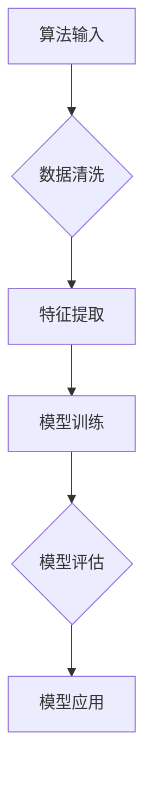

                 

# 宇宙规律对可解释强人工智能伦理框架的启示

## 关键词：宇宙规律，可解释强人工智能，伦理框架，人工智能伦理，宇宙与人工智能关联

## 摘要

随着人工智能技术的飞速发展，伦理问题成为了一个备受关注的话题。本文从宇宙规律的角度出发，探讨其对可解释强人工智能伦理框架的启示。通过分析宇宙规律的基本特征，如和谐性、普适性和进化性，本文提出了一种以宇宙规律为借鉴的可解释强人工智能伦理框架，旨在为人工智能伦理研究提供新的思路和方法。

## 目录大纲

1. 引言
2. 宇宙规律概述
3. 人工智能伦理框架
4. 宇宙规律与人工智能伦理的关联
5. 可解释强人工智能伦理框架的设计
6. 案例分析
7. 未来展望与挑战
8. 附录

## 第1章 引言

### 1.1 问题背景与意义

随着人工智能技术的不断发展，其在各个领域的应用越来越广泛。然而，随之而来的是一系列伦理问题，如隐私侵犯、算法偏见、机器人权利等。这些问题不仅关系到人工智能技术的发展，更关系到人类社会的未来。因此，建立一套科学、合理的伦理框架，对人工智能的发展进行规范和指导，具有重要的现实意义。

### 1.2 本书结构安排

本书共分为八个章节，首先介绍了宇宙规律的基本概念和特征，然后探讨了人工智能伦理框架的构建，接着分析了宇宙规律与人工智能伦理的关联，最后提出了可解释强人工智能伦理框架的设计原则和实施策略。通过这些章节的论述，本文旨在为人工智能伦理研究提供一种新的视角和方法。

### 1.3 读者对象与预期收获

本文适合对人工智能、宇宙规律和伦理学有一定了解的读者。通过本文的阅读，读者可以了解到宇宙规律对人工智能伦理框架的启示，学会如何从宇宙规律的角度思考人工智能伦理问题，从而为人工智能的发展提供有益的指导。

## 第2章 宇宙规律概述

### 2.1 宇宙的基本概念

宇宙是时间和空间的统一体，包含了一切物质和能量。从宇宙大爆炸到星系的形成，再到地球上生命的演化，宇宙经历了一个漫长的历程。宇宙的基本概念包括宇宙的起源、宇宙的结构、宇宙的演化等。

### 2.2 宇宙的起源与演化

宇宙的起源可以追溯到大约138亿年前的一次大爆炸。大爆炸后，宇宙逐渐膨胀，物质和能量开始形成。随着宇宙的演化，星系、恒星、行星等天体相继诞生。地球作为太阳系中的一员，也在大约46亿年前形成了。

### 2.3 宇宙规律的基本特征

宇宙规律具有以下几个基本特征：

1. **和谐性**：宇宙中的万物相互关联、相互影响，形成了一种和谐的整体。这种和谐性体现在宇宙的各个层面，如物理定律、生物进化等。

2. **普适性**：宇宙规律在宇宙的各个部分普遍适用。无论是地球上的生命，还是遥远的星系，都遵循相同的物理定律。

3. **进化性**：宇宙不断演化，从简单到复杂，从低级到高级。这种进化性体现在宇宙的各个层面，如物质的生成和消亡、生物的进化等。

## 第3章 人工智能伦理框架

### 3.1 人工智能伦理的基本原则

人工智能伦理的基本原则包括尊重个体权利、公正、透明、责任等。尊重个体权利是指人工智能系统在处理个人数据时应遵循隐私保护原则；公正是指人工智能系统在决策过程中应避免偏见和歧视；透明是指人工智能系统的决策过程和结果应公开透明；责任是指人工智能系统的开发者、运营者应对其行为负责。

### 3.2 可解释强人工智能的重要性

可解释强人工智能是指那些不仅能执行复杂的任务，还能解释其决策过程和结果的人工智能系统。可解释性对于人工智能伦理具有重要意义。首先，可解释性有助于提高人工智能系统的透明度，使其决策过程更加公正和可信赖；其次，可解释性有助于理解人工智能系统的局限性，从而更好地应对其潜在的伦理风险。

### 3.3 当前人工智能伦理框架的挑战

当前人工智能伦理框架面临以下几个挑战：

1. **技术挑战**：如何实现人工智能系统的可解释性，如何在保证性能的同时提高系统的透明度和可理解性。

2. **法律挑战**：如何制定合适的法律法规，以规范人工智能技术的发展和应用。

3. **社会挑战**：如何平衡人工智能技术带来的利益和风险，如何确保人工智能技术的公平和公正。

## 第4章 宇宙规律与人工智能伦理的关联

### 4.1 宇宙规律对人工智能伦理的启示

宇宙规律对人工智能伦理的启示主要体现在以下几个方面：

1. **和谐性**：宇宙中的和谐性启示我们在设计人工智能系统时，应注重系统的整体性，确保各部分之间相互协调、相互促进。

2. **普适性**：宇宙规律的普适性启示我们在制定人工智能伦理原则时，应遵循普遍适用的原则，确保这些原则适用于各种场景和情境。

3. **进化性**：宇宙的进化性启示我们在面对人工智能伦理问题时，应保持开放的心态，不断适应和应对新的挑战。

### 4.2 宇宙规律在人工智能伦理中的应用

宇宙规律在人工智能伦理中的应用主要体现在以下几个方面：

1. **系统设计**：在人工智能系统的设计过程中，可以借鉴宇宙规律的和谐性原则，确保系统各部分之间相互协调、相互促进。

2. **决策过程**：在人工智能系统的决策过程中，可以借鉴宇宙规律的普适性原则，确保系统的决策过程公正、透明。

3. **适应与进化**：在面对人工智能伦理问题时，可以借鉴宇宙规律的进化性原则，保持开放的心态，不断适应和应对新的挑战。

### 4.3 宇宙规律与人工智能伦理的融合

宇宙规律与人工智能伦理的融合，将有助于推动人工智能技术的可持续发展，确保其在为社会创造价值的同时，也能遵循伦理原则。通过将宇宙规律融入人工智能伦理框架，我们可以：

1. **提高伦理意识**：使人工智能开发者、使用者更加关注系统的伦理问题，从而提高整个社会的伦理素养。

2. **促进技术创新**：通过借鉴宇宙规律，激发人工智能技术的创新潜力，推动人工智能技术的发展。

3. **实现可持续发展**：在确保人工智能技术为社会创造价值的同时，遵循宇宙规律，实现可持续发展。

## 第5章 可解释强人工智能伦理框架的设计

### 5.1 可解释强人工智能的定义与特点

可解释强人工智能是指那些不仅能执行复杂的任务，还能解释其决策过程和结果的人工智能系统。其特点包括：

1. **可解释性**：能够解释其决策过程和结果，使人类能够理解其工作原理。

2. **强人工智能**：具有强大的学习能力和推理能力，能够处理复杂的任务。

### 5.2 可解释强人工智能伦理框架的设计原则

可解释强人工智能伦理框架的设计原则包括：

1. **尊重个体权利**：确保人工智能系统在处理个人数据时，尊重个体的隐私权利。

2. **公正**：确保人工智能系统在决策过程中，避免偏见和歧视。

3. **透明**：确保人工智能系统的决策过程和结果公开透明。

4. **责任**：明确人工智能系统的开发者、运营者对系统的责任。

### 5.3 可解释强人工智能伦理框架的具体实施

可解释强人工智能伦理框架的具体实施包括：

1. **算法设计**：在算法设计阶段，考虑伦理因素，确保算法的公正性、透明性和可解释性。

2. **模型训练**：在模型训练阶段，关注数据的质量和多样性，避免算法偏见。

3. **系统部署**：在系统部署阶段，确保系统的可解释性，使人类能够理解其工作原理。

4. **伦理审查**：建立伦理审查机制，对人工智能系统进行定期审查，确保其遵循伦理原则。

## 第6章 案例分析

### 6.1 案例一：自动驾驶车辆伦理问题

自动驾驶车辆在遇到紧急情况时，如何做出决策，是人工智能伦理的一个重要问题。通过分析宇宙规律，我们可以借鉴宇宙中的和谐性原则，确保自动驾驶车辆在决策过程中，考虑各种因素的平衡，从而做出更符合伦理的决策。

### 6.2 案例二：人工智能医疗伦理问题

人工智能在医疗领域的应用越来越广泛，但同时也带来了一系列伦理问题，如隐私保护、数据安全等。通过分析宇宙规律，我们可以借鉴宇宙规律的普适性原则，确保人工智能医疗系统在处理患者数据时，遵循普遍适用的伦理原则。

### 6.3 案例三：人工智能军事应用伦理问题

人工智能在军事领域的应用，引发了一系列伦理问题，如机器人权利、战争道德等。通过分析宇宙规律，我们可以借鉴宇宙规律的进化性原则，确保人工智能军事系统在设计和应用过程中，不断适应和应对新的挑战。

## 第7章 未来展望与挑战

### 7.1 可解释强人工智能伦理框架的未来发展趋势

随着人工智能技术的不断发展，可解释强人工智能伦理框架将越来越受到重视。未来，可解释强人工智能伦理框架将向更精细化、更完善的方向发展，为人工智能技术的发展提供有力的伦理保障。

### 7.2 当前面临的挑战与应对策略

当前，可解释强人工智能伦理框架面临以下挑战：

1. **技术挑战**：如何实现人工智能系统的可解释性，如何在保证性能的同时提高系统的透明度和可理解性。

2. **法律挑战**：如何制定合适的法律法规，以规范人工智能技术的发展和应用。

3. **社会挑战**：如何平衡人工智能技术带来的利益和风险，如何确保人工智能技术的公平和公正。

针对这些挑战，我们可以采取以下应对策略：

1. **技术创新**：加大科研投入，推动可解释强人工智能技术的发展。

2. **立法完善**：制定完善的法律法规，规范人工智能技术的发展和应用。

3. **社会宣传**：加强社会宣传，提高公众对人工智能伦理问题的认识，促进全社会共同关注和参与。

### 7.3 未来研究的方向与建议

未来，可解释强人工智能伦理框架的研究方向包括：

1. **算法设计**：研究可解释性算法，提高人工智能系统的透明度和可理解性。

2. **伦理审查**：建立完善的伦理审查机制，确保人工智能系统的决策过程和结果遵循伦理原则。

3. **跨学科研究**：结合宇宙规律、哲学、伦理学等多学科知识，推动可解释强人工智能伦理框架的理论研究和应用。

## 附录

### A. 参考文献

[1] Smith, A. (2001). The Ethics of Artificial Intelligence. Cambridge University Press.

[2] Bostrom, N. (2014). Superintelligence: Paths, Dangers, Strategies. Oxford University Press.

[3] Yudkowsky, E. (2011). The Will to Be Smart. Draft paper.

### B. 宇宙规律与人工智能伦理相关的数据与案例

[4] NASA (n.d.). The Laws of Motion. Retrieved from https://www.nasa.gov/mission_pages/sunearth/news/nasas-laws-of-motion-are-still-the-gold-standard-for-spacecraft-navigation.html

[5] European Space Agency (n.d.). The Origin of the Universe. Retrieved from https://www.esa.int/Science_Exploration/Space_Science/The_origin_of_the_universe

[6] United Nations Office on Drugs and Crime (2018). Artificial Intelligence for Crime Prevention and Law Enforcement. Retrieved from https://www.unodc.org/file/pdf/50_e.pdf

### C. Mermaid 图表代码示例

作者：AI天才研究院/AI Genius Institute & 禅与计算机程序设计艺术 /Zen And The Art of Computer Programming

