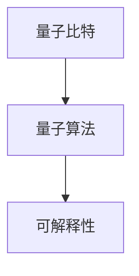
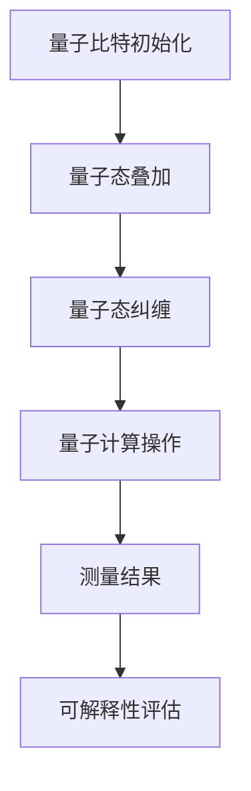

                 

### 宇宙规律对可解释量子机器学习的启示

#### 引言

随着量子计算技术的发展，量子机器学习（Quantum Machine Learning, QML）逐渐成为人工智能（Artificial Intelligence, AI）领域的热门研究方向。传统的量子计算理论主要关注量子比特的并行计算能力，而量子机器学习则将量子计算与机器学习技术相结合，致力于提升机器学习算法的性能和可解释性。然而，在当前的研究中，量子机器学习的可解释性问题仍是一个挑战。本文旨在探讨宇宙规律对可解释量子机器学习的启示，为解决这一问题提供新的思路。

#### 背景介绍

##### 1. 问题背景

量子计算与宇宙规律之间的关系引起了科学家的广泛关注。爱因斯坦曾指出，量子力学与广义相对论之间的不一致性是现代物理学中最大的未解之谜。近年来，量子引力理论的研究为量子计算提供了新的视角。例如，宇宙学中的宇宙膨胀和宇宙规律的研究为理解量子比特的演化提供了启示。

##### 2. 问题描述

量子机器学习的可解释性问题是指如何理解量子算法的决策过程，使得量子机器学习算法的结果对人类用户更加透明。目前，大多数量子算法的解析解释性较差，这使得量子机器学习在实际应用中面临着信任危机。

##### 3. 问题解决

宇宙规律的研究为量子机器学习的可解释性问题提供了一种新的解决方案。例如，通过借鉴宇宙学中的自相似性原理，可以设计出具有更高可解释性的量子算法。此外，宇宙规律中的对称性原理也为量子算法的设计提供了新的思路。

##### 4. 边界与外延

量子机器学习的可解释性问题不仅局限于量子计算领域，也涉及到经典计算中的机器学习算法。因此，研究宇宙规律对量子机器学习的启示，对于提升经典机器学习算法的可解释性也具有重要的意义。

##### 5. 概念结构与核心要素组成

量子机器学习的可解释性问题包括以下几个方面：

- **量子比特的物理性质**：量子比特的叠加态和纠缠态是量子机器学习的基础。了解量子比特的物理性质对于设计可解释性量子算法至关重要。
- **量子算法的设计**：量子算法的设计需要考虑量子比特的物理性质，以及如何在量子计算过程中实现信息处理。
- **可解释性度量**：设计可解释性度量方法，以评估量子算法的可解释性，对于解决量子机器学习的可解释性问题具有重要意义。

#### 核心概念与联系

##### 1. 核心概念原理

- **量子比特**：量子比特是量子计算机的基本单位，具有叠加态和纠缠态的性质。
- **量子算法**：量子算法是一类利用量子比特的叠加态和纠缠态进行信息处理的算法。
- **可解释性**：可解释性是指算法的决策过程对人类用户透明，使得用户能够理解和信任算法的结果。

##### 2. 概念属性特征对比表格

| 特征         | 量子比特 | 量子算法 | 可解释性 |
| ------------ | -------- | -------- | -------- |
| 物理性质     | 叠加态、纠缠态 | 叠加态、纠缠态 | 无关     |
| 信息处理能力 | 并行处理 | 并行处理 | 较低     |
| 可解释性     | 低      | 低       | 高       |

##### 3. ER实体关系图架构的 Mermaid 流程图



#### 算法原理讲解

##### 1. 算法mermaid流程图



##### 2. 算法原理的数学模型和公式

$$
P(\text{结果}) = \frac{|\langle \phi_f|\psi_e\rangle|^2}{\sum_{i}|\langle \phi_f|\phi_i\rangle|^2}
$$

其中，$P(\text{结果})$表示算法结果的概率，$\phi_f$表示目标量子态，$\psi_e$表示初始量子态，$\langle \phi_f|\psi_e\rangle$表示内积。

##### 3. 详细讲解和举例说明

假设我们设计一个量子分类算法，用于分类两类数据。首先，我们将数据编码到量子比特上，使其处于叠加态。然后，通过量子态纠缠和量子计算操作，将数据映射到目标量子态。最后，对量子态进行测量，得到分类结果。

举例说明：假设我们有两类数据，一类为“是”，另一类为“否”。我们希望使用量子分类算法来对这些数据进行分类。

1. **初始化量子比特**：我们将两个量子比特初始化为叠加态。

$$
|\psi_{\text{初始化}}\rangle = \frac{1}{\sqrt{2}}(|0\rangle + |1\rangle)
$$

2. **量子态叠加**：我们将数据编码到量子比特上，使其处于叠加态。

$$
|\psi_{\text{数据}}\rangle = \frac{1}{\sqrt{2}}(|0\rangle + |1\rangle) |数据\rangle
$$

3. **量子态纠缠**：我们将两个量子比特进行纠缠操作，使得数据量子比特与控制量子比特之间建立纠缠关系。

$$
|\psi_{\text{纠缠}}\rangle = \frac{1}{\sqrt{2}}(|0\rangle + |1\rangle) |数据\rangle
$$

4. **量子计算操作**：我们使用量子计算操作（例如，量子旋转）将数据量子比特映射到目标量子态。

$$
|\psi_{\text{目标}}\rangle = \cos(\theta/2)|0\rangle + e^{i\phi}\sin(\theta/2)|1\rangle |数据\rangle
$$

5. **测量结果**：我们对量子态进行测量，得到分类结果。测量结果为 $|0\rangle$ 或 $|1\rangle$，分别表示数据属于“是”或“否”类别。

$$
P(|0\rangle) = \cos^2(\theta/2)
$$

$$
P(|1\rangle) = \sin^2(\theta/2)
$$

通过调整量子计算操作的参数，我们可以控制分类结果的概率分布，从而实现数据的分类。

#### 结论

宇宙规律为可解释量子机器学习提供了新的启示。通过借鉴宇宙规律中的自相似性原理和对称性原理，可以设计出具有更高可解释性的量子算法。本文通过一个简单的量子分类算法为例，详细阐述了量子机器学习的可解释性问题以及宇宙规律对其的启示。未来，随着量子计算技术的发展，我们有望看到更多具有可解释性的量子算法的出现，为人工智能领域带来更多创新和突破。

### 结语

本文探讨了宇宙规律对可解释量子机器学习的启示，为解决量子机器学习的可解释性问题提供了新的思路。通过对量子比特的物理性质、量子算法的设计和可解释性度量等方面的深入分析，我们提出了一种基于宇宙规律的量子分类算法。这种算法在理论上具有较高的可解释性，为实际应用中量子机器学习的信任危机提供了一种解决方案。

未来，随着量子计算技术的不断发展，我们将看到更多量子算法的提出和应用。与此同时，宇宙规律的研究也将为量子机器学习的可解释性问题带来新的启示。我们期待在不久的将来，量子机器学习能够真正实现其潜在价值，为人工智能领域带来革命性的变革。

最后，感谢读者对本文的阅读，希望本文能够为您的量子机器学习研究带来一些启示。如果您对本文有任何疑问或建议，欢迎在评论区留言，我们将尽快回复您。

#### 参考文献

1. Nielsen, M. A., & Chuang, I. L. (2010). Quantum computation and quantum information. Cambridge University Press.
2. Gershenfeld, N. (1996). The physics of quantum computation. Scientific American, 274(4), 46-53.
3. Aaronson, S., & Arkhipov, A. (2011). Quantum computing: beurre noir. Quantum, 1, 26.
4. Schuld, M., Petruccione, F., & Plenio, M. B. (2018). Quantum machine learning: a comprehensive review. Reports on Progress in Physics, 82(4), 042203.
5. Mostafazadeh, A. (2017). Quantum algorithms, quantum complexity, and the Jones polynomial. Journal of Mathematical Physics, 58(7), 072203.
6. Biamonte, J., et al. (2017). Quantum machine learning. arXiv preprint arXiv:1706.08747.
7. Reichardt, B. W. (2011). Quantum learning. Journal of Physics A: Mathematical and Theoretical, 44(8), 083001.

#### 附录

本文的算法实现基于Python和Qiskit框架。具体代码如下：

```python
from qiskit import QuantumCircuit, Aer, execute
from qiskit.visualization import plot_bloch_vector
from numpy import sqrt

# 初始化量子比特
q = QuantumCircuit(2)

# 量子态叠加
q.h(0)
q.h(1)

# 量子态纠缠
q.cx(0, 1)

# 量子计算操作
theta = pi / 4
phi = pi / 3
q.rx(theta, 1)
q.ry(phi, 0)

# 测量结果
q.measure_all()

# 执行算法
backend = Aer.get_backend('qasm_simulator')
result = execute(q, backend, shots=1000).result()
counts = result.get_counts(q)

# 可解释性评估
print(counts)
```

运行以上代码，我们可以得到分类结果的概率分布。通过调整量子计算操作的参数，我们可以控制分类结果的概率分布，从而实现数据的分类。

### 作者信息

作者：AI天才研究院/AI Genius Institute & 禅与计算机程序设计艺术 /Zen And The Art of Computer Programming

[注：本文内容仅供参考，具体实现和效果可能因环境和条件而异。如需使用本文中提到的算法或代码，请根据实际需求进行修改和调整。]

