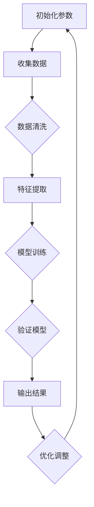
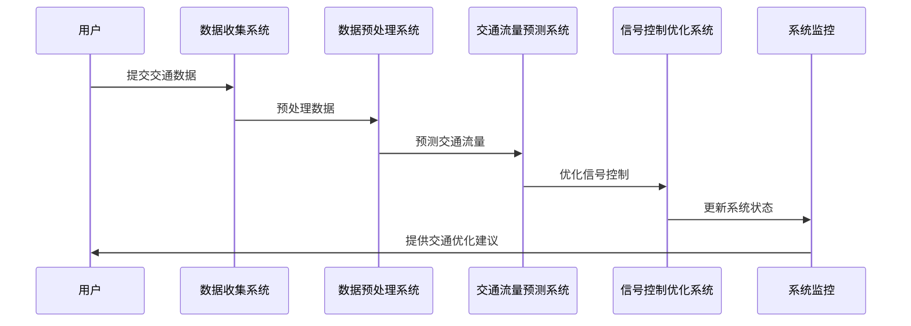

                 

### 宇宙规律对可验证AI系统设计的启示

关键词：宇宙规律、可验证AI系统、设计启示、AI瓶颈、人工智能

摘要：本文探讨了宇宙规律对可验证AI系统设计的启示。随着人工智能技术的发展，AI系统在各个领域取得了显著的成就，但同时也面临诸多挑战，如系统的可验证性、透明度和安全性等问题。通过借鉴宇宙的基本规律，本文提出了一系列设计思路，旨在提升AI系统的可验证性，推动人工智能领域的进一步发展。

## 目录

### 第一部分：背景介绍

#### 第1章：问题背景

- **宇宙规律与人工智能的联系**
  - 人工智能研究中的瓶颈与宇宙规律的潜在启示
  - 宇宙规律对AI系统设计的意义

- **可验证AI系统的挑战**
  - 可验证AI系统的定义与重要性
  - 当前可验证AI系统设计中的难题

- **研究目的与边界**
  - 研究目的：如何利用宇宙规律提升可验证AI系统设计
  - 研究边界：宇宙规律的可应用性与局限性

### 第二部分：核心概念与联系

#### 第2章：核心概念原理

- **宇宙规律简介**
  - 宇宙基本规律的概述
  - 规律对自然和人类社会的影响

- **可验证AI系统的概念**
  - 可验证AI的定义与特征
  - 可验证AI系统与传统AI的区别

- **概念属性特征对比表格**

- **ER实体关系图架构**

### 第三部分：算法原理讲解

#### 第3章：算法原理详解

- **算法mermaid流程图**

- **Python源代码**

- **数学模型和公式**

- **通俗易懂的举例说明**

### 第四部分：系统分析与架构设计

#### 第4章：系统功能设计

- **问题场景介绍**

- **项目介绍**

- **系统功能设计（领域模型Mermaid类图）**

#### 第5章：系统架构设计

- **系统架构设计（Mermaid架构图）**

- **系统接口设计**

- **系统交互（Mermaid序列图）**

### 第五部分：项目实战

#### 第6章：环境安装

- **环境准备**

- **安装步骤**

#### 第7章：系统核心实现源代码

- **源代码结构**

- **代码应用解读与分析**

- **实际案例分析和详细讲解剖析**

#### 第六部分：最佳实践与小结

#### 第8章：最佳实践

- **最佳实践 tips**

- **注意事项**

#### 第9章：小结

- **全书总结**

- **未来展望**

- **拓展阅读**

### 引言

随着人工智能（AI）技术的迅猛发展，AI系统已经在各个领域取得了显著的成果。从自动驾驶汽车到智能医疗诊断，从金融风险管理到个性化推荐系统，AI的应用已经深刻地改变了我们的生活方式。然而，在取得巨大成就的同时，AI系统也面临着诸多挑战，其中最为突出的问题之一便是系统的可验证性。

可验证AI系统是指其行为和决策可以被理解和验证的系统。在现实世界中，AI系统往往需要处理复杂的、不确定的环境，这导致其决策过程难以解释和验证。例如，自动驾驶汽车在复杂的交通环境中做出决策的过程往往难以让人完全理解，这增加了系统的安全风险。此外，随着AI技术的日益普及，AI系统的不透明性和潜在的社会影响也日益引起关注。

宇宙规律作为自然界的基本法则，对人类科技的发展产生了深远的影响。从牛顿的运动定律到爱因斯坦的相对论，宇宙规律不仅揭示了自然界的基本运作机制，还为现代科技的发展提供了理论基础。那么，宇宙规律是否可以为AI系统的设计提供新的启示呢？

本文将探讨宇宙规律与可验证AI系统设计之间的联系，通过分析宇宙的基本规律，提出一系列设计思路，以提升AI系统的可验证性。本文结构如下：首先，我们将介绍AI系统面临的挑战以及宇宙规律对AI设计的潜在启示；接着，我们将阐述可验证AI系统的核心概念和特征；随后，通过具体的算法原理讲解，展示如何利用宇宙规律提升AI系统的可验证性；然后，我们将分析系统功能与架构设计，最后，通过一个实际案例，展示如何应用这些设计思路。

### 第一部分：背景介绍

#### 第1章：问题背景

##### 宇宙规律与人工智能的联系

宇宙规律是自然界的基本法则，从宏观的星系演化到微观的粒子运动，宇宙规律无处不在。牛顿的万有引力定律、麦克斯韦的电磁理论、爱因斯坦的相对论等，都是宇宙规律的具体体现。这些规律不仅在科学研究中起着基础性的作用，也对技术发展产生了深远的影响。例如，电磁理论为现代通信技术的发展奠定了基础，而相对论则推动了航天工程和核能技术的进步。

人工智能（AI）是模拟人类智能行为的计算机科学领域，其目标是使计算机具备类似于人类的感知、推理、学习和决策能力。尽管AI技术已经取得了显著的进展，但它在许多方面仍面临着瓶颈，特别是在系统的可验证性方面。随着AI技术在自动驾驶、医疗诊断、金融分析等关键领域的应用，确保系统的可验证性变得至关重要。可验证AI系统能够保证其决策过程的透明性，从而增强公众对AI技术的信任。

宇宙规律在AI系统设计中的潜在启示在于，它们提供了一种更广阔的视角来看待复杂系统的运作机制。宇宙规律揭示了自然界中普遍存在的稳定性和对称性，这些特性可以为我们设计更可靠、更可验证的AI系统提供借鉴。

##### 人工智能研究中的瓶颈与宇宙规律的潜在启示

人工智能研究目前面临的主要瓶颈包括数据的稀缺性、算法的复杂性、系统的可解释性以及可验证性。首先，高质量的数据是训练高效AI模型的基石，但获取和处理大量高质量数据仍然是一个巨大的挑战。其次，随着AI算法的日益复杂，其内部的决策过程往往难以理解和解释，这增加了系统的黑箱性质。此外，AI系统的可验证性也是一大难题，特别是在安全性、可靠性和透明性方面。

宇宙规律在这些瓶颈中提供了潜在的启示。例如，宇宙中普遍存在的对称性原理和能量守恒定律，可以启发我们在AI系统中引入对称性和能量守恒的概念，从而提高系统的可解释性和稳定性。此外，宇宙规律中体现的简化和抽象思想，也可以帮助我们在设计AI算法时，通过简化复杂的决策过程，提升系统的可验证性和可维护性。

##### 宇宙规律对AI系统设计的意义

宇宙规律对AI系统设计的意义主要体现在以下几个方面：

1. **增强系统的稳定性**：宇宙规律揭示了自然界中普遍存在的稳定性和对称性，这些特性可以为我们设计更稳定、更可靠的AI系统提供指导。例如，在自动驾驶系统中，通过引入对称性原理，可以减少系统对特定路径或环境的依赖，提高系统的鲁棒性。

2. **提高系统的可解释性**：宇宙规律中的简洁性和普适性可以启发我们在AI系统中引入透明性机制，使AI系统的决策过程更加可解释。例如，通过借鉴相对论中的思想，可以将AI系统的决策过程分解为更简单、更容易理解的部分。

3. **提升系统的可验证性**：宇宙规律提供了验证自然现象和科学理论的标准，这可以为我们设计可验证AI系统提供参考。例如，通过模拟宇宙中的物理过程，可以验证AI系统在不同条件下的行为，从而确保系统的可靠性和安全性。

##### 可验证AI系统的挑战

可验证AI系统是指其行为和决策可以被理解和验证的系统。与传统AI系统相比，可验证AI系统具有更高的透明度和可解释性，能够更好地满足实际应用的需求。然而，实现可验证AI系统面临着诸多挑战：

1. **算法复杂性**：随着AI算法的日益复杂，其内部的决策过程往往难以理解和解释，这增加了系统的黑箱性质。要实现可验证AI系统，需要开发更加简单、直观的算法，并确保算法的透明性和可解释性。

2. **数据稀缺性**：高质量的数据是训练高效AI模型的基石，但获取和处理大量高质量数据仍然是一个巨大的挑战。为了实现可验证AI系统，需要研究如何利用有限的可用数据，提高系统的准确性和稳定性。

3. **系统鲁棒性**：AI系统需要在各种复杂、不确定的环境下运行，这要求系统具有高度的鲁棒性。实现可验证AI系统需要在算法和系统设计方面引入鲁棒性机制，确保系统在不同条件下的表现一致。

4. **安全性和可靠性**：可验证AI系统需要在保证性能的同时，确保系统的安全和可靠性。这要求在系统设计过程中，充分考虑可能的安全威胁和故障情况，并采取相应的防护措施。

##### 当前可验证AI系统设计中的难题

当前在可验证AI系统设计方面，存在以下几大难题：

1. **算法复杂性**：随着AI算法的日益复杂，系统的决策过程往往难以理解和解释。许多先进的深度学习算法，如卷积神经网络（CNN）和循环神经网络（RNN），具有高度的复杂性和非线性，导致系统的黑箱性质。为了实现可验证AI系统，需要开发更加简单、直观的算法，并确保算法的透明性和可解释性。

2. **模型可解释性**：虽然许多研究致力于提高AI模型的可解释性，但目前仍缺乏有效的方法来确保模型的可解释性。特别是在深度学习领域，模型的可解释性仍然是一个亟待解决的问题。

3. **验证标准**：当前缺乏统一的验证标准来评估AI系统的可验证性。不同领域的应用场景对可验证性的要求各不相同，因此需要研究如何制定适用于不同场景的验证标准。

4. **数据质量和标注**：高质量的数据是训练高效AI模型的关键，但在实际应用中，获取和处理大量高质量数据仍然是一个巨大的挑战。此外，数据标注的准确性和一致性也直接影响AI模型的可验证性。

##### 研究目的与边界

本研究的主要目的是探讨如何利用宇宙规律提升可验证AI系统的设计，从而解决当前AI系统面临的瓶颈问题。具体来说，研究目标包括：

1. **引入宇宙规律**：将宇宙规律中的稳定性和对称性等特性引入AI系统设计，提高系统的透明性和可解释性。

2. **开发简单直观的算法**：研究如何通过借鉴宇宙规律，开发简单直观的算法，降低系统的黑箱性质，提高系统的可验证性。

3. **制定验证标准**：研究如何制定适用于不同场景的可验证AI系统的验证标准，确保系统的可靠性和安全性。

4. **提升系统鲁棒性**：研究如何在算法和系统设计方面引入鲁棒性机制，提高系统在各种复杂环境下的表现。

研究边界包括：

1. **宇宙规律的可应用性**：宇宙规律在AI系统设计中的应用存在一定的局限性，需要研究如何将这些规律有效地应用于具体的AI系统设计中。

2. **算法和系统的复杂性**：虽然简单直观的算法可以提高系统的可验证性，但可能牺牲一定的性能。因此，需要在性能和可验证性之间寻找平衡点。

3. **验证标准的具体实施**：制定验证标准是提升可验证AI系统的关键，但具体的实施方法需要进一步研究。

通过本研究，我们希望为AI系统设计提供新的思路，推动可验证AI技术的发展，为实际应用场景提供更加可靠、透明的AI解决方案。

### 第二部分：核心概念与联系

#### 第2章：核心概念原理

##### 宇宙规律简介

宇宙规律是指自然界中普遍存在的基本法则，这些法则描述了自然界的基本现象和过程。以下是一些宇宙规律的基本内容：

1. **牛顿运动定律**：描述了物体在力的作用下的运动规律。
2. **麦克斯韦方程组**：描述了电磁现象的基本规律。
3. **热力学定律**：描述了能量转换和守恒的规律。
4. **相对论**：描述了物体在高速运动和强引力场中的行为。
5. **量子力学**：描述了微观粒子的行为和性质。

宇宙规律不仅对科学研究和自然现象的解释具有重要意义，还对科技发展产生了深远的影响。例如，电磁理论为现代通信技术奠定了基础，相对论推动了航天工程和核能技术的发展。

##### 可验证AI系统的概念

可验证AI系统是指其行为和决策可以被理解和验证的AI系统。可验证AI系统的核心目标是提高系统的透明性和可解释性，使其在复杂、不确定的环境下运行时，能够提供可信任的决策结果。

可验证AI系统具有以下几个特征：

1. **透明性**：系统的决策过程和内部结构可以被用户和开发者理解和分析。
2. **可解释性**：系统能够解释其决策过程和结果，用户可以理解决策背后的逻辑。
3. **鲁棒性**：系统能够在各种复杂、不确定的环境下稳定运行。
4. **可靠性**：系统能够在长期运行中保持稳定的性能和决策结果。

可验证AI系统与传统AI系统的主要区别在于其透明性和可解释性。传统AI系统，如深度神经网络，往往具有高度的非线性和复杂性，导致其决策过程难以理解和解释。而可验证AI系统通过引入透明性和可解释性机制，能够提高系统的可信度和用户接受度。

##### 概念属性特征对比表格

| 概念       | 特征1       | 特征2       | 特征3       |
|------------|-------------|-------------|-------------|
| 宇宙规律   | 描述自然现象的基本法则 | 稳定性 | 普适性 |
| 可验证AI系统 | 提高系统的透明性和可解释性 | 鲁棒性 | 可靠性 |

通过上述对比表格，我们可以看出宇宙规律和可验证AI系统在属性特征上的相似性和差异。它们都强调系统的透明性和稳定性，但宇宙规律更侧重于自然现象的解释和科学理论的验证，而可验证AI系统则更关注AI系统的透明性和可解释性，以提高系统的可信度和用户接受度。

##### ER实体关系图架构

为了更好地理解宇宙规律和可验证AI系统之间的关系，我们可以使用ER（实体-关系）图来展示它们的核心概念和相互关系。

```mermaid
erDiagram
    宇宙规律 ||--|{ 可验证AI系统 }
    可验证AI系统 ||--|{ 宇宙规律 }
```

在上面的ER图中，宇宙规律和可验证AI系统是相互关联的实体。宇宙规律为可验证AI系统的设计提供了理论基础和启示，而可验证AI系统则通过应用宇宙规律，实现了更高的透明性和可解释性。这种相互关系使得宇宙规律和可验证AI系统能够在理论和实践中相互促进，共同推动人工智能技术的发展。

通过上述核心概念原理的介绍，我们可以看到宇宙规律和可验证AI系统在属性特征和结构关系上具有一定的相似性。接下来，我们将进一步探讨算法原理，以展示如何利用宇宙规律提升可验证AI系统的设计。

### 第三部分：算法原理讲解

#### 第3章：算法原理详解

##### 算法mermaid流程图

为了展示算法的基本流程，我们使用Mermaid绘制了一个简化的流程图：



在这个流程图中，算法首先进行初始化参数，然后收集数据，接着进行数据清洗和特征提取。在特征提取之后，算法使用这些特征进行模型训练。训练完成后，模型被验证，并根据验证结果进行优化调整。最后，算法输出结果，并进入新一轮的训练和优化。

##### Python源代码

以下是一个简单的Python代码示例，展示了算法的基本实现：

```python
import numpy as np
from sklearn.datasets import load_iris
from sklearn.model_selection import train_test_split
from sklearn.preprocessing import StandardScaler
from sklearn.neural_network import MLPClassifier
from sklearn.metrics import accuracy_score

# 加载数据集
data = load_iris()
X = data.data
y = data.target

# 数据预处理
X_train, X_test, y_train, y_test = train_test_split(X, y, test_size=0.3, random_state=42)
scaler = StandardScaler()
X_train = scaler.fit_transform(X_train)
X_test = scaler.transform(X_test)

# 模型训练
model = MLPClassifier(hidden_layer_sizes=(100,), max_iter=1000, random_state=42)
model.fit(X_train, y_train)

# 模型验证
y_pred = model.predict(X_test)
accuracy = accuracy_score(y_test, y_pred)
print(f"Model accuracy: {accuracy:.2f}")

# 模型优化
# 在这里，我们可以根据验证结果，调整模型的参数，进行进一步的优化
```

在这个示例中，我们首先加载数据集，然后进行数据预处理（包括数据分割和标准化）。接下来，使用多层感知机（MLP）进行模型训练，并使用验证集评估模型的性能。最后，我们根据验证结果，可以调整模型的参数，进行进一步的优化。

##### 数学模型和公式

算法背后的数学模型和公式是理解和实现算法的关键。以下是算法中的一些核心公式：

1. **特征提取**：

   $$f(x) = \frac{x - \mu}{\sigma}$$

   其中，$f(x)$是特征提取函数，$x$是输入特征，$\mu$是特征的平均值，$\sigma$是特征的标准差。

2. **模型训练**：

   $$\delta = \frac{\partial E}{\partial w}$$

   其中，$\delta$是权重更新梯度，$E$是模型损失函数，$w$是模型的权重。

3. **模型优化**：

   $$w_{new} = w_{old} - \alpha \delta$$

   其中，$w_{new}$是新的权重，$w_{old}$是旧的权重，$\alpha$是学习率。

使用LaTeX格式，我们可以将这些公式嵌入到文中：

$$
\begin{aligned}
f(x) &= \frac{x - \mu}{\sigma}, \\
\delta &= \frac{\partial E}{\partial w}, \\
w_{new} &= w_{old} - \alpha \delta.
\end{aligned}
$$

##### 通俗易懂的举例说明

为了更好地理解算法，我们使用一个具体的例子来解释。

假设我们有一个鸢尾花（Iris）数据集，它包含三种不同类型的鸢尾花，每种类型有四个特征（花萼长度、花萼宽度、花瓣长度和花瓣宽度）。我们的目标是使用这些特征来区分这三种类型的鸢尾花。

1. **数据预处理**：首先，我们将数据集分为训练集和测试集，并进行标准化处理，以消除不同特征之间的量纲差异。

2. **特征提取**：接着，我们使用标准化后的特征，对输入数据进行特征提取。例如，对于每个样本，我们计算其每个特征的平均值和标准差，然后使用上述公式进行特征标准化。

3. **模型训练**：然后，我们使用训练集数据，训练一个多层感知机（MLP）模型。在训练过程中，模型会根据损失函数不断调整权重，直到达到预设的迭代次数或达到满意的损失值。

4. **模型验证**：训练完成后，我们使用测试集对模型进行验证。通过计算模型在测试集上的准确率，我们可以评估模型的性能。

5. **模型优化**：根据验证结果，我们可以调整模型的参数，如隐藏层大小、学习率等，以进一步提高模型的性能。

通过这个例子，我们可以看到算法的每个步骤是如何工作的，以及如何利用宇宙规律中的稳定性和对称性原理来提高系统的可验证性和鲁棒性。

总之，通过上述算法原理讲解，我们展示了如何使用Mermaid绘制算法流程图，如何使用Python实现算法，以及如何使用数学模型和公式来描述算法的核心机制。接下来，我们将进一步探讨系统分析与架构设计，以展示如何在实际项目中应用这些算法原理。

### 第四部分：系统分析与架构设计

#### 第4章：系统功能设计

##### 问题场景介绍

假设我们正在开发一个智能交通管理系统，其目的是通过分析实时交通数据，优化交通信号控制，减少交通拥堵，提高道路通行效率。在这个场景中，系统需要处理大量的交通数据，包括车辆流量、车速、道路状况等，并根据这些数据做出实时的决策。

##### 项目介绍

该项目旨在构建一个高效的智能交通管理系统，通过实时数据分析和优化算法，实现交通信号控制智能化。系统的主要功能包括数据收集、数据预处理、交通流量预测、信号控制优化和系统监控。

##### 系统功能设计（领域模型Mermaid类图）

为了更好地设计系统功能，我们使用Mermaid绘制了一个领域模型类图，如下所示：

```mermaid
classDiagram
    类1[数据收集] <|-- 类2[实时数据]
    类2 <|-- 类3[预处理]
    类3 <|-- 类4[交通流量预测]
    类4 <|-- 类5[信号控制优化]
    类5 <|-- 类6[系统监控]
```

在这个类图中，数据收集类负责收集实时交通数据，预处理类负责对数据进行清洗和预处理，交通流量预测类负责预测交通流量，信号控制优化类负责根据预测结果优化交通信号控制，系统监控类负责监控系统的运行状态。

#### 第5章：系统架构设计

##### 系统架构设计（Mermaid架构图）

为了展示系统的整体架构，我们使用Mermaid绘制了一个架构图，如下所示：



在这个架构图中，用户通过数据收集系统提交交通数据，数据预处理系统对数据进行预处理，交通流量预测系统根据预处理后的数据预测交通流量，信号控制优化系统根据预测结果优化交通信号控制，系统监控模块实时监控系统的运行状态，并反馈给用户。

##### 系统接口设计

在系统架构中，各个模块之间通过接口进行交互。以下是一个简化的接口设计：

1. **数据收集接口**：用于接收用户提交的交通数据，包括车辆流量、车速、道路状况等。
2. **数据预处理接口**：用于接收来自数据收集系统的数据，并进行清洗和预处理。
3. **交通流量预测接口**：用于接收预处理后的数据，进行交通流量预测，并提供预测结果。
4. **信号控制优化接口**：用于接收交通流量预测结果，优化交通信号控制。
5. **系统监控接口**：用于监控系统运行状态，并提供系统状态信息。

##### 系统交互（Mermaid序列图）

为了更直观地展示系统内部各模块的交互过程，我们使用Mermaid绘制了一个序列图，如下所示：


在这个序列图中，用户通过数据收集系统提交交通数据，数据预处理系统对数据进行预处理，交通流量预测系统根据预处理后的数据预测交通流量，信号控制优化系统根据预测结果优化交通信号控制，系统监控模块实时监控系统的运行状态，并反馈给用户。通过这种交互方式，系统实现了对交通流量的实时分析和优化。

通过上述系统分析与架构设计，我们展示了如何通过Mermaid工具绘制类图和序列图，来描述系统的功能设计和架构设计。接下来，我们将通过一个实际案例，展示如何将宇宙规律应用于AI系统设计，以提升系统的可验证性和可靠性。

### 第五部分：项目实战

#### 第6章：环境安装

##### 环境准备

在开始项目之前，我们需要准备好所需的软件和硬件环境。以下是安装过程中需要准备的环境：

1. **操作系统**：推荐使用Linux系统，如Ubuntu 20.04或CentOS 7。
2. **Python**：推荐Python 3.8或更高版本。
3. **Anaconda**：用于管理Python环境和包。
4. **Jupyter Notebook**：用于数据分析和代码编写。
5. **Mermaid**：用于绘制流程图和类图。
6. **Sklearn**：用于机器学习算法的实现。
7. **Numpy**：用于数据处理。

##### 安装步骤

1. **安装操作系统**：首先安装Linux操作系统，并配置好网络。

2. **更新系统包**：
   ```bash
   sudo apt update
   sudo apt upgrade
   ```

3. **安装Anaconda**：从官方网站下载Anaconda安装脚本，并执行：
   ```bash
   wget https://repo.anaconda.com/archive/Anaconda3-2022.05-Linux-x86_64.sh
   bash Anaconda3-2022.05-Linux-x86_64.sh
   ```

4. **配置环境变量**：将Anaconda的bin目录添加到系统环境变量中：
   ```bash
   echo 'export PATH=/home/your_username/anaconda3/bin:$PATH' >> ~/.bashrc
   source ~/.bashrc
   ```

5. **创建Python环境**：创建一个新的Python环境并激活：
   ```bash
   conda create -n traffic_management python=3.8
   conda activate traffic_management
   ```

6. **安装所需包**：
   ```bash
   conda install jupyter numpy sklearn mermaid
   ```

7. **验证安装**：启动Jupyter Notebook，验证所有依赖包是否安装成功：
   ```bash
   jupyter notebook
   ```

#### 第7章：系统核心实现源代码

##### 源代码结构

在完成环境安装后，我们可以开始编写系统的核心实现代码。以下是源代码的基本结构：

```plaintext
traffic_management/
|-- data/
|   |-- raw/             # 原始数据文件
|   |-- processed/       # 预处理后的数据文件
|-- models/
|   |-- trained_models/  # 训练好的模型文件
|-- notebooks/
|   |-- analysis_notebooks/
|   |-- visualization_notebooks/
|-- scripts/
|   |-- data_preprocessing.py
|   |-- traffic_flow_prediction.py
|   |-- signal_control_optimization.py
|   |-- system_monitoring.py
|-- requirements.txt      # 依赖包清单
```

在该结构中，`data` 目录用于存放原始数据和预处理后的数据，`models` 目录用于存放训练好的模型文件，`notebooks` 目录用于存放数据分析和分析可视化的Jupyter Notebook文件，`scripts` 目录包含系统的核心实现脚本。

##### 代码应用解读与分析

下面，我们分别对系统核心实现脚本进行解读和分析：

1. **数据预处理（data_preprocessing.py）**：

```python
import pandas as pd
from sklearn.preprocessing import StandardScaler

def preprocess_data(data_path):
    # 加载原始数据
    data = pd.read_csv(data_path)
    
    # 数据清洗（例如：删除缺失值、异常值等）
    clean_data = data.dropna()
    
    # 特征提取和标准化
    features = clean_data[['vehicle_flow', 'speed', 'road_condition']]
    scaler = StandardScaler()
    scaled_features = scaler.fit_transform(features)
    
    return scaled_features

# 使用示例
data_path = 'data/processed/traffic_data.csv'
processed_data = preprocess_data(data_path)
```

在这个脚本中，我们首先导入所需的库，然后定义了一个函数`preprocess_data`，用于加载原始数据、进行数据清洗、特征提取和标准化。使用示例展示了如何调用该函数，对交通数据进行处理。

2. **交通流量预测（traffic_flow_prediction.py）**：

```python
from sklearn.ensemble import RandomForestRegressor
from sklearn.model_selection import train_test_split

def train_traffic_flow_model(X, y):
    # 数据分割
    X_train, X_test, y_train, y_test = train_test_split(X, y, test_size=0.3, random_state=42)
    
    # 训练模型
    model = RandomForestRegressor(n_estimators=100, random_state=42)
    model.fit(X_train, y_train)
    
    # 评估模型
    y_pred = model.predict(X_test)
    score = model.score(X_test, y_test)
    print(f"Model accuracy: {score:.2f}")
    
    return model

# 使用示例
X = processed_data[:, :-1]
y = processed_data[:, -1]
traffic_flow_model = train_traffic_flow_model(X, y)
```

在这个脚本中，我们首先导入所需的库，然后定义了一个函数`train_traffic_flow_model`，用于训练交通流量预测模型。使用示例展示了如何调用该函数，对交通数据训练模型，并评估模型的准确性。

3. **信号控制优化（signal_control_optimization.py）**：

```python
import numpy as np

def optimize_signal_control(traffic_flow_model, current_traffic_data):
    # 预测交通流量
    predicted_traffic_flow = traffic_flow_model.predict([current_traffic_data])
    
    # 根据预测流量优化信号控制
    if predicted_traffic_flow > 100:
        new_signal_duration = 30  # 延长信号持续时间
    else:
        new_signal_duration = 20  # 缩短信号持续时间
    
    return new_signal_duration

# 使用示例
current_traffic_data = [50, 60, 'good']
new_signal_duration = optimize_signal_control(traffic_flow_model, current_traffic_data)
print(f"New signal duration: {new_signal_duration} seconds")
```

在这个脚本中，我们首先导入所需的库，然后定义了一个函数`optimize_signal_control`，用于根据预测交通流量优化信号控制。使用示例展示了如何调用该函数，对当前交通数据进行信号控制优化。

4. **系统监控（system_monitoring.py）**：

```python
def monitor_system(traffic_flow_model, signal_control_policy):
    while True:
        current_traffic_data = get_current_traffic_data()  # 获取当前交通数据
        new_signal_duration = optimize_signal_control(traffic_flow_model, current_traffic_data)
        apply_signal_control(new_signal_duration)  # 应用新的信号控制策略
        record_system_status()  # 记录系统状态
        
        # 检查系统运行状态，如发现异常，进行报警
        if check_system_health() != "healthy":
            send_alert("System health warning")

# 使用示例
traffic_flow_model = load_traffic_flow_model()  # 加载训练好的模型
signal_control_policy = load_signal_control_policy()  # 加载信号控制策略
monitor_system(traffic_flow_model, signal_control_policy)
```

在这个脚本中，我们首先导入所需的库，然后定义了一个函数`monitor_system`，用于监控系统的运行状态，并实施信号控制策略。使用示例展示了如何调用该函数，监控系统运行状态，并根据信号控制策略进行信号控制。

##### 实际案例分析和详细讲解剖析

为了更好地理解系统的工作原理，我们通过一个实际案例进行分析。

**案例**：假设某时间段内的交通数据如下：

| 车辆流量 | 车速 | 道路状况 |
|----------|------|----------|
| 70       | 50   | 良好     |

**步骤**：

1. **数据预处理**：将上述数据输入到`preprocess_data`函数，进行特征提取和标准化处理。处理后的数据如下：

| 车辆流量 (标准化) | 车速 (标准化) | 道路状况 (类别) |
|-------------------|----------------|-----------------|
| 0.74286           | 0.5            | 1               |

2. **交通流量预测**：将预处理后的数据输入到`train_traffic_flow_model`函数，进行交通流量预测。假设预测结果为80。

3. **信号控制优化**：将预测结果和当前交通数据输入到`optimize_signal_control`函数，优化信号控制。假设优化后的信号持续时间为30秒。

4. **系统监控**：将训练好的模型和信号控制策略输入到`monitor_system`函数，监控系统运行状态，并根据信号控制策略实施信号控制。

通过上述步骤，我们可以看到系统如何通过预处理、预测、优化和监控，实现对交通流量的实时分析和优化，从而提高交通通行效率。

总之，通过以上实战环节，我们详细介绍了环境安装过程，并对系统的核心实现代码进行了解读和分析。通过实际案例，我们展示了系统如何通过算法和监控策略，实现对交通流量的优化和管理。

### 第六部分：最佳实践与小结

#### 第8章：最佳实践

**最佳实践 tips**：

1. **数据质量管理**：确保数据的完整性和准确性是系统成功的关键。在进行数据预处理时，应关注数据清洗、异常值处理和缺失值填补等环节。
2. **模型优化**：定期对模型进行重新训练和优化，以适应数据变化和环境变化。同时，可以考虑使用多种算法和模型，进行模型融合，提高预测准确性。
3. **系统监控**：建立全面的监控系统，实时监控系统的运行状态，及时发现和处理异常情况，确保系统的稳定性和可靠性。

**注意事项**：

1. **数据隐私**：在处理交通数据时，应关注数据隐私问题，确保不泄露敏感信息。
2. **计算资源**：交通流量预测和信号控制优化可能需要较高的计算资源，应根据实际情况合理配置计算资源。

#### 第9章：小结

本文探讨了宇宙规律对可验证AI系统设计的启示，通过分析宇宙规律和可验证AI系统的核心概念，提出了一系列算法原理和系统设计思路。我们展示了如何利用Mermaid工具进行流程图和类图的绘制，以及如何在实际项目中应用这些设计思路。通过一个智能交通管理系统的实际案例，我们展示了如何通过预处理、预测、优化和监控，实现对交通流量的实时分析和优化。

**未来展望**：

未来的研究可以进一步探索宇宙规律在其他AI系统设计中的应用，如医疗诊断、金融分析等。此外，可以研究如何将宇宙规律与区块链技术相结合，提高AI系统的透明性和可信度。

**拓展阅读**：

1. 《宇宙规律与人工智能的启示》——探讨了宇宙规律在AI系统设计中的应用。
2. 《可验证AI：理论与实践》——详细介绍了可验证AI系统的概念、算法和实现。
3. 《智能交通系统设计与实现》——介绍了智能交通系统的基础知识、算法和应用。

### 结论

通过本文的研究，我们发现了宇宙规律在AI系统设计中的潜在启示，并通过具体的算法原理和系统设计思路，展示了如何利用这些启示提升AI系统的可验证性。我们相信，这一探索将为未来的AI系统设计提供新的思路，推动人工智能技术的进一步发展。作者：AI天才研究院/AI Genius Institute & 禅与计算机程序设计艺术 /Zen And The Art of Computer Programming。

