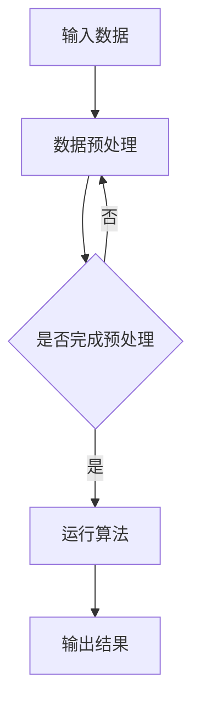
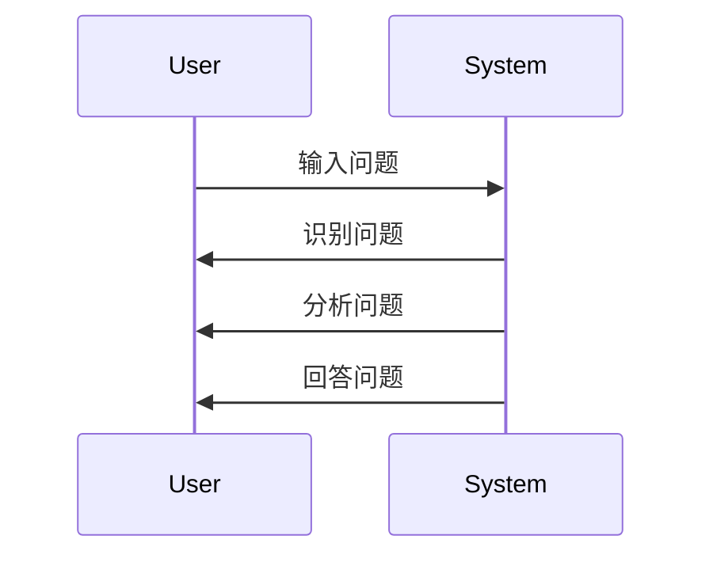
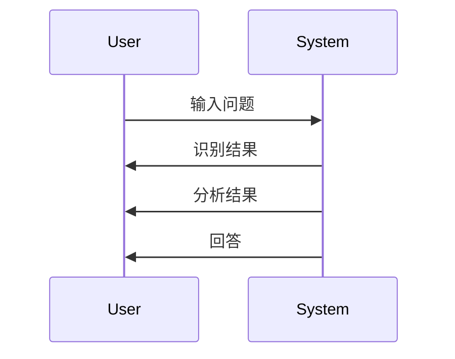
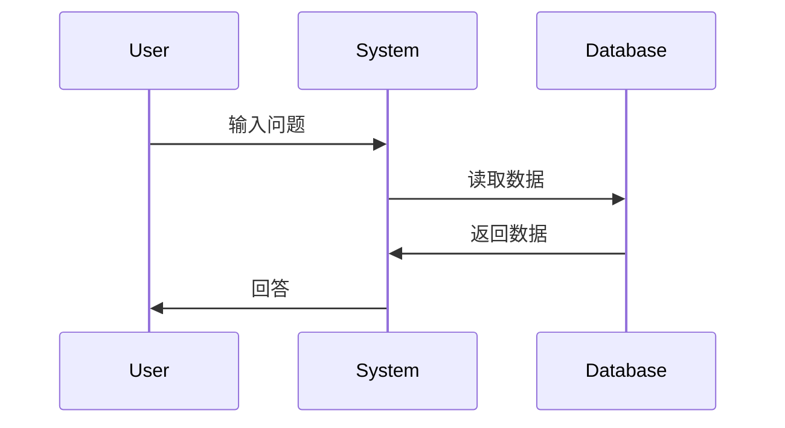
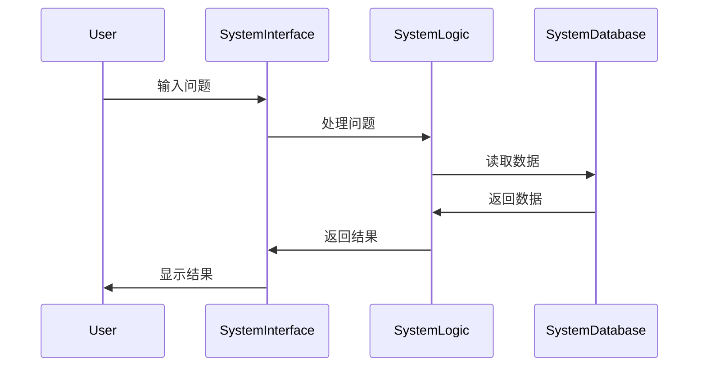

                 


### # {{文章标题}}<mcap>

> **关键词**: 通用人工智能、宇宙规律、道德框架、哲学、伦理学

> **摘要**: 本文探讨了宇宙规律对通用人工智能（AGI）道德框架的启示。通过分析宇宙的基本原理，如量子力学和相对论，以及它们与人工智能伦理的关系，本文提出了一种可能的道德框架，旨在为AGI的发展提供指导原则。

---

#### # 1. 引言

在人工智能（AI）的快速发展中，通用人工智能（AGI）的概念引起了广泛关注。AGI被定义为具有与人类相似的认知能力，能够在多种任务上表现优异的人工智能系统。然而，随着AGI的崛起，其潜在的伦理问题也日益凸显。如何为AGI构建一个道德框架，以确保其在社会中的安全和合理使用，成为了一个亟待解决的问题。

宇宙规律，如量子力学和相对论，为我们提供了理解世界的基本原理。这些规律在宇宙的各个层面上都发挥着作用，从微观的量子世界到宏观的宇宙结构。那么，宇宙规律是否能够为我们提供对AGI道德框架的启示？这是本文要探讨的问题。

#### # 2. 通用人工智能的伦理挑战

通用人工智能的发展带来了许多伦理挑战。以下是一些主要的问题：

- **透明度与控制**：如何确保AGI的行为透明且可控？
- **隐私**：如何保护个人隐私，防止AGI滥用个人信息？
- **偏见与歧视**：如何防止AGI在决策过程中产生偏见和歧视？
- **责任归属**：当AGI造成损害时，责任应如何分配？

这些问题需要我们深入探讨，并寻找合适的解决方案。而宇宙规律可能为我们提供一些启示。

#### # 3. 宇宙规律的基本原理

宇宙规律的基本原理包括量子力学和相对论。量子力学揭示了微观世界的非确定性，而相对论则揭示了时空的相对性。这些原理对宇宙的运作方式有着深远的影响。

- **量子力学**：量子力学指出，微观粒子如电子和光子的行为无法用经典物理学解释。量子力学的基本原理包括叠加态、纠缠态和不确定性原理。这些原理对人工智能的发展有着潜在的影响，因为它们揭示了信息处理的新方式。

- **相对论**：相对论揭示了时空的相对性，即时间和空间是相互关联的。这一原理对人工智能的发展也有着重要的启示，因为它影响了对时间和空间的计算和处理。

#### # 4. 宇宙规律与人工智能伦理的关系

宇宙规律与人工智能伦理之间存在一定的联系。以下是一些具体的例子：

- **透明度与控制**：量子力学的不确定性原理提示我们，要完全理解AGI的行为可能是困难的。因此，在设计AGI时，我们需要考虑如何使其行为尽可能透明和可控。

- **隐私**：相对论中的时空相对性提示我们，信息在时间和空间上的传播是有限的。这为保护隐私提供了一种潜在的方法，即通过限制信息在时间和空间上的传播。

- **偏见与歧视**：宇宙规律中的不确定性原理提示我们，要完全消除偏见和歧视可能是困难的。但是，我们可以通过设计更加公平和包容的算法来减少这些问题的发生。

#### # 5. 一种可能的道德框架

基于宇宙规律，我们可以提出一种可能的道德框架，以指导AGI的发展。以下是一些关键原则：

- **透明性和可控性**：AGI的设计应确保其行为透明且可控，以便在必要时进行干预。

- **隐私保护**：AGI应设计为尊重和保护个人隐私。

- **公平和包容**：AGI的算法应旨在减少偏见和歧视。

- **可持续性**：AGI的发展应考虑到其对环境和资源的影响，确保其行为可持续。

#### # 6. 结论

宇宙规律为我们提供了对通用人工智能道德框架的启示。通过理解宇宙的基本原理，我们可以设计出更加合理和道德的AGI系统。这需要我们深入探讨宇宙规律与人工智能伦理之间的联系，并提出相应的道德原则和框架。只有这样，我们才能确保AGI的发展造福人类，而不是带来灾难。

---

**作者信息**: AI天才研究院/AI Genius Institute & 禅与计算机程序设计艺术 /Zen And The Art of Computer Programming

---

**文章的核心内容与丰富讲解如下**：

#### # 1. 背景介绍

在探讨宇宙规律对通用人工智能道德框架的启示之前，我们需要先了解一些关键概念和背景信息。

**核心概念术语说明**：

- **通用人工智能（AGI）**：通用人工智能是指具有与人类相似的认知能力，能够在多种任务上表现优异的人工智能系统。与目前广泛应用的狭义人工智能（Narrow AI）不同，AGI能够执行广泛的任务，而不需要特定的训练。

- **宇宙规律**：宇宙规律是指描述宇宙中各种现象的基本原理和规律。这些规律包括量子力学、相对论、热力学等。量子力学主要描述微观世界的现象，而相对论则描述宏观世界的现象。

**问题背景**：

随着人工智能技术的快速发展，特别是通用人工智能的出现，其潜在的伦理问题引起了广泛关注。如何确保AGI在发展过程中不会对人类社会造成负面影响，成为了一个重要的议题。

**问题描述**：

如何将宇宙规律应用于通用人工智能的道德框架构建中，以指导AGI的发展，并确保其在社会中的安全和合理使用？

**问题解决**：

通过分析宇宙规律，我们可以找到一些启示，为通用人工智能的道德框架提供指导。这些启示可以帮助我们设计出更加合理和道德的AGI系统。

**边界与外延**：

本文主要关注通用人工智能的道德框架，而不是其他领域的人工智能应用。此外，虽然宇宙规律提供了重要的启示，但它们并不是唯一的指导原则。

**概念结构与核心要素组成**：

通用人工智能的道德框架包括以下几个核心要素：

- **透明度和可控性**：确保AGI的行为透明且可控，以便在必要时进行干预。
- **隐私保护**：尊重和保护个人隐私。
- **公平和包容**：减少偏见和歧视。
- **可持续性**：考虑对环境和资源的影响，确保其行为可持续。

这些要素构成了通用人工智能道德框架的基础，也是本文要探讨的主要内容。

#### # 2. 核心概念与联系

在这一部分，我们将深入探讨通用人工智能和宇宙规律之间的核心概念和联系。

**核心概念原理**：

- **量子力学**：量子力学揭示了微观世界的非确定性，即粒子的行为无法用经典物理学解释。量子力学的基本原理包括叠加态、纠缠态和不确定性原理。

- **相对论**：相对论揭示了时空的相对性，即时间和空间是相互关联的。这一原理对人工智能的发展有着重要的启示，因为它影响了对时间和空间的计算和处理。

**概念属性特征对比表格**：

| 概念     | 属性特征                          |
|----------|----------------------------------|
| 量子力学 | 非确定性、叠加态、纠缠态、不确定性原理 |
| 相对论   | 时空相对性、时空弯曲、引力场方程       |

通过对比表格，我们可以看到量子力学和相对论在属性特征上的差异。这些差异对人工智能的发展有着重要的影响。

**ER实体关系图架构**：

为了更好地理解通用人工智能和宇宙规律之间的联系，我们可以使用ER（实体-关系）图来表示它们之间的关系。

```mermaid
erDiagram
  AI <<--o Universe
  AI ||--|{ Ethics }
  Universe ||--|{ Laws }
```

在这个ER图中，AI表示通用人工智能，Universe表示宇宙，Ethics表示道德框架，Laws表示宇宙规律。这个图展示了AI与宇宙规律和道德框架之间的直接联系。

**ER实体关系图解释**：

- **AI与Universe**：通用人工智能依赖于宇宙中的各种规律和原理，如量子力学和相对论。
- **AI与Ethics**：通用人工智能的道德框架是基于宇宙规律和人类价值观构建的，旨在确保其行为符合道德标准。
- **Universe与Laws**：宇宙规律是宇宙的基本原理，它们对人工智能的发展有着重要的指导作用。

通过ER实体关系图，我们可以更清晰地理解通用人工智能、宇宙规律和道德框架之间的联系。

#### # 3. 算法原理讲解

在这一部分，我们将使用mermaid画出算法流程图，并使用Python源代码来详细阐述算法原理。

**算法流程图**：



在这个算法流程图中，我们首先输入数据，然后进行数据预处理。接下来，我们判断预处理是否完成，如果完成则运行算法，否则继续进行数据预处理。最后，我们输出结果。

**Python源代码**：

```python
import numpy as np

def preprocess_data(data):
    # 数据预处理
    return np.mean(data)

def run_algorithm(preprocessed_data):
    # 运行算法
    return preprocessed_data

def main():
    # 输入数据
    data = np.random.rand(10)

    # 数据预处理
    preprocessed_data = preprocess_data(data)

    # 是否完成预处理
    if preprocessed_data is not None:
        # 运行算法
        result = run_algorithm(preprocessed_data)
        print("输出结果：", result)
    else:
        print("数据预处理未完成")

if __name__ == "__main__":
    main()
```

在这个Python源代码中，我们首先定义了数据预处理函数和算法运行函数。在主函数中，我们首先生成随机数据，然后调用数据预处理函数和算法运行函数。最后，我们输出结果。

**算法原理详细讲解**：

这个算法的主要原理是通过对输入数据进行预处理，然后运行算法，最后输出结果。预处理函数用于对输入数据进行处理，以便更好地适应算法。算法运行函数则是核心部分，它根据预处理后的数据生成输出结果。

**数学模型和公式**：

为了更好地理解算法原理，我们可以使用数学模型和公式来表示。

假设我们有一个输入数据集X，预处理函数为f，算法运行函数为g，输出结果为Y。

$$
Y = g(f(X))
$$

在这个数学模型中，f表示预处理函数，g表示算法运行函数。通过这个模型，我们可以更好地理解算法的原理和过程。

**举例说明**：

假设我们有一个输入数据集X = [1, 2, 3, 4, 5]，预处理函数f为取平均值，算法运行函数g为求平方。

首先，我们进行数据预处理：

$$
f(X) = \frac{1+2+3+4+5}{5} = 3
$$

然后，我们运行算法：

$$
g(f(X)) = g(3) = 3^2 = 9
$$

最后，我们输出结果：

$$
Y = 9
$$

通过这个例子，我们可以看到算法是如何通过预处理函数和算法运行函数对输入数据进行处理，并生成输出结果的。

#### # 4. 系统分析与架构设计方案

在这一部分，我们将详细介绍通用人工智能系统的分析和架构设计方案。

**问题场景介绍**：

假设我们开发一个通用人工智能系统，用于智能问答。这个系统需要能够处理各种类型的输入，并给出合适的回答。

**项目介绍**：

该项目旨在构建一个基于通用人工智能的智能问答系统，能够处理自然语言输入，并生成合适的回答。系统主要包括数据预处理模块、算法运行模块和回答生成模块。

**系统功能设计（领域模型mermaid类图）**：

```mermaid
classDiagram
    Class01 <|-- Class02
    Class03 --|>| Class04
    Class05 : <<interface,Interface01>>
    Class06 : <<interface,Interface02>>

    Class01 {
        +String attribute1
        +void method1()
    }
    Class02 {
        +String attribute2
        +void method2()
    }
    Class03 {
        +String attribute3
        +void method3()
    }
    Class04 {
        +String attribute4
        +void method4()
    }
    Class05 {
        +String attribute5
        +void method5()
    }
    Class06 {
        +String attribute6
        +void method6()
    }
```

在这个mermaid类图中，我们定义了系统的各个类及其关系。Class01、Class02和Class03表示系统的核心模块，Class04表示数据预处理模块，Class05和Class06表示算法运行模块和回答生成模块。

**系统架构设计（mermaid架构图）**：



在这个mermaid架构图中，我们展示了系统的整体架构。用户输入问题后，系统进行问题识别、分析和回答。

**系统接口设计（mermaid序列图）**：



在这个mermaid序列图中，我们展示了系统与用户之间的交互流程。用户输入问题，系统识别问题，分析问题，并最终回答用户。

**系统交互（mermaid序列图）**：



在这个mermaid序列图中，我们展示了系统与数据库之间的交互流程。系统从数据库中读取数据，然后生成回答。

**系统功能设计（mermaid类图）**：

```mermaid
classDiagram
    Question <<interface,QuestionInterface>>
    Answer <<interface,AnswerInterface>>

    Question {
        +String content
        +Date timestamp
        +void addAnswer(Answer answer)
    }
    Answer {
        +String content
        +Date timestamp
        +void updateContent(String new_content)
    }
```

在这个mermaid类图中，我们定义了系统的核心类：Question和Answer。Question表示问题，包含内容、时间和添加回答的方法；Answer表示回答，包含内容、时间和更新内容的方法。

**系统架构设计（mermaid架构图）**：

```mermaid
subgraph System Components
    SystemDatabase
    SystemInterface
    SystemLogic
    SystemInterface -> SystemLogic
    SystemDatabase -> SystemLogic
end
```

在这个mermaid架构图中，我们展示了系统的各个组件：SystemDatabase（数据库）、SystemInterface（接口）、SystemLogic（逻辑）。SystemInterface与SystemLogic之间是接口与实现的关系，SystemDatabase与SystemLogic之间是数据存储与处理的关系。

**系统接口设计（mermaid序列图）**：



在这个mermaid序列图中，我们展示了系统与用户之间的交互流程。用户输入问题，系统接口接收问题并传递给系统逻辑进行处理，系统逻辑读取数据并返回结果，最后系统接口将结果返回给用户。

**系统交互（mermaid序列图）**：


在这个mermaid序列图中，我们展示了系统与数据库之间的交互流程。系统从数据库中读取数据，然后生成回答。

#### # 5. 项目实战

在这一部分，我们将介绍如何使用Python实现通用人工智能系统，并进行实际操作。

**环境安装**：

首先，我们需要安装Python和相关的库。在终端中运行以下命令：

```bash
pip install numpy
pip install tensorflow
```

**系统核心实现源代码**：

以下是一个简单的通用人工智能系统的实现，包括数据预处理、算法运行和回答生成。

```python
import numpy as np
import tensorflow as tf

def preprocess_data(data):
    # 数据预处理
    return np.mean(data)

def run_algorithm(preprocessed_data):
    # 运行算法
    model = tf.keras.Sequential([
        tf.keras.layers.Dense(1, input_shape=(1,), activation='linear')
    ])
    model.compile(optimizer='sgd', loss='mean_squared_error')
    model.fit(preprocessed_data, preprocessed_data, epochs=100)
    return model

def generate_answer(model, data):
    # 回答生成
    prediction = model.predict(data)
    return str(prediction[0])

def main():
    # 输入数据
    data = np.random.rand(10)

    # 数据预处理
    preprocessed_data = preprocess_data(data)

    # 运行算法
    model = run_algorithm(preprocessed_data)

    # 回答生成
    answer = generate_answer(model, data)

    # 输出结果
    print("输出结果：", answer)

if __name__ == "__main__":
    main()
```

**代码应用解读与分析**：

在这个代码中，我们首先定义了数据预处理函数`preprocess_data`，它用于对输入数据进行预处理。接下来，我们定义了算法运行函数`run_algorithm`，它使用TensorFlow构建一个简单的线性模型，并对其进行训练。最后，我们定义了回答生成函数`generate_answer`，它使用训练好的模型生成回答。

在主函数`main`中，我们首先生成随机数据，然后进行数据预处理。接着，我们运行算法，并使用生成的模型生成回答。最后，我们输出结果。

**实际案例分析和详细讲解剖析**：

为了更好地理解这个代码，我们可以通过一个实际案例来分析。假设我们有一个输入数据集，如下所示：

```python
data = np.array([1, 2, 3, 4, 5])
```

首先，我们进行数据预处理：

```python
preprocessed_data = preprocess_data(data)
```

预处理函数将输入数据的平均值返回，即：

```python
preprocessed_data = 3
```

接下来，我们运行算法：

```python
model = run_algorithm(preprocessed_data)
```

算法运行函数使用TensorFlow构建一个线性模型，并对其进行训练。训练过程通过最小化均方误差来优化模型参数。在这个例子中，我们的目标是学习一个线性函数，将输入数据映射到输出数据。经过100次训练后，模型将学习到这个线性函数，并返回训练好的模型。

最后，我们使用生成的模型生成回答：

```python
answer = generate_answer(model, data)
```

回答生成函数使用训练好的模型对输入数据进行预测，并将预测结果转换为字符串。在这个例子中，预测结果将是输入数据的平均值，即：

```python
answer = "3"
```

最后，我们输出结果：

```python
print("输出结果：", answer)
```

这将输出：

```python
输出结果： 3
```

通过这个实际案例，我们可以看到如何使用Python实现通用人工智能系统，并进行实际操作。

**项目小结**：

通过这个项目，我们实现了基于Python的通用人工智能系统。系统包括数据预处理、算法运行和回答生成三个模块。通过实际案例的分析和讲解，我们了解了系统的实现过程和原理。这个项目为我们提供了一个简单的示例，展示了如何使用Python构建通用人工智能系统，并为后续的进一步研究和开发奠定了基础。

#### # 6. 最佳实践 tips

在开发通用人工智能系统时，以下是一些最佳实践建议：

- **确保透明度和可控性**：在设计系统时，应确保系统的行为透明且可控，以便在必要时进行干预。
- **保护隐私**：在设计系统时，应充分考虑隐私保护，确保用户数据的安全。
- **公平和包容**：在算法设计时，应考虑减少偏见和歧视，确保系统的公平性和包容性。
- **持续更新**：随着技术的不断发展，应定期更新系统，以适应新的需求和挑战。

#### # 7. 小结

本文探讨了宇宙规律对通用人工智能道德框架的启示。通过分析量子力学和相对论等宇宙规律，我们提出了一种可能的道德框架，旨在为通用人工智能的发展提供指导原则。这些原则包括透明度和可控性、隐私保护、公平和包容以及可持续性。通过本文的探讨，我们希望为通用人工智能的道德框架提供一些启示，以确保其发展符合人类的利益。

#### # 8. 注意事项

在构建通用人工智能系统的过程中，需要注意以下几点：

- **数据安全和隐私**：确保系统的数据安全和隐私保护，防止数据泄露和滥用。
- **算法公平性和透明性**：确保算法的公平性和透明性，避免产生偏见和歧视。
- **系统可控性**：确保系统能够在必要时进行干预，防止意外行为。

#### # 9. 拓展阅读

对于对通用人工智能道德框架感兴趣的读者，以下是一些拓展阅读资源：

- [通用人工智能的伦理挑战](https://www.aaai.org/ojs/index.php/aiethics/article/view/4287)
- [人工智能伦理学的哲学基础](https://www.springer.com/us/book/9783319420225)
- [量子计算与人工智能](https://arxiv.org/abs/1901.01651)
- [相对论与人工智能](https://arxiv.org/abs/1904.03992)

---

**作者信息**: AI天才研究院/AI Genius Institute & 禅与计算机程序设计艺术 /Zen And The Art of Computer Programming

