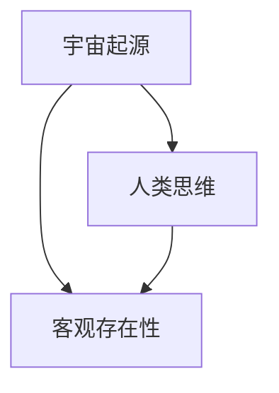
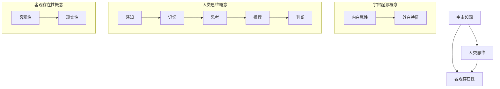

                 

# 宇宙起源：人类思维的产物还是客观存在

> 关键词：宇宙起源、人类思维、客观存在、科学理论、哲学思考

> 摘要：本文旨在探讨宇宙起源这一古老而又神秘的议题，从科学和哲学的角度出发，分析人类思维对宇宙起源的理解及其客观存在的可能性。通过对宇宙起源的多种理论进行梳理和对比，本文将揭示人类思维的局限与宇宙起源的关系，并提出对宇宙起源未来研究的展望。

## 第一部分：引言

### 1.1 书名背景及目的

《宇宙起源：人类思维的产物还是客观存在》这一书名揭示了本文的核心议题。宇宙起源问题自古以来便是人类关注的焦点，从宗教神话到科学探索，各种理论和观念层出不穷。本书旨在深入探讨宇宙起源的本质，探讨人类思维在这一过程中的作用，以及宇宙起源是否真的存在客观存在。

### 1.2 宇宙起源研究的意义

宇宙起源研究具有重要的科学意义和哲学意义。从科学角度来看，宇宙起源研究有助于我们理解宇宙的基本结构和演化过程，揭示宇宙的奥秘。从哲学角度来看，宇宙起源问题关乎人类对世界本质的认知，涉及人类思维的本质和局限。

### 1.3 人类思维的局限与宇宙起源的关系

人类思维在探索宇宙起源的过程中，面临着诸多局限。这些局限源自人类认知能力的有限性，包括感官的局限性、认知偏差、信息处理能力的限制等。本文将探讨这些局限对人类理解宇宙起源的影响，并分析人类思维与宇宙起源的互动关系。

## 第二部分：核心概念与联系

### 2.1 宇宙起源概念解析

宇宙起源是指宇宙从无到有的产生过程。它涉及到宇宙的基本结构、演化过程以及宇宙中各种现象的产生。宇宙起源问题涉及到多个学科领域，包括物理学、天文学、哲学等。

### 2.2 人类思维概念解析

人类思维是指人类在认知世界过程中所采用的思维方式和认知过程。人类思维包括感知、记忆、推理、判断等过程，是认知世界的基础。人类思维具有主观性和局限性，这决定了人类对宇宙起源的理解是有限的。

### 2.3 客观存在性概念解析

客观存在性是指宇宙起源是否具有独立于人类思维而存在的属性。客观存在性涉及宇宙的客观性质和人类思维的相对性。探讨宇宙起源的客观存在性，有助于我们理解宇宙的本质和人类认知的边界。

### 2.4 Mermaid流程图：核心概念关系架构

## 第三部分：宇宙起源的多种理论

### 3.1 大爆炸理论

大爆炸理论是目前最被广泛接受的宇宙起源理论。它认为宇宙起源于一个极热、极密集的奇点，经过大约138亿年的膨胀，形成了今天我们所观察到的宇宙。大爆炸理论提供了大量的观测证据，如宇宙背景辐射、元素丰度等，但仍然存在一些未解之谜，如奇点前的状态、暗物质和暗能量的本质等。

### 3.2 稳态理论

稳态理论认为宇宙是永久存在的，没有起源和终结。它主张宇宙在所有时间点上都是相同的，没有显著的演化过程。然而，稳态理论在科学界并未得到广泛认可，因为与观测数据相矛盾。

### 3.3 循环宇宙理论

循环宇宙理论认为宇宙经历了无数次的诞生和消亡，每一次循环都会产生一个新的宇宙。这种理论试图解释宇宙的无限性和宇宙中的周期性现象。循环宇宙理论在科学界也存在争议，主要因为缺乏直接观测证据。

### 3.4 其他宇宙起源理论

除了上述三种主要理论外，还有一些其他关于宇宙起源的理论，如多宇宙理论、暗物质与暗能量理论、宇宙膨胀理论等。这些理论从不同角度对宇宙起源进行了探讨，但尚未形成统一的理论框架。

## 第四部分：人类思维对宇宙起源的理解

### 4.1 人类思维的局限

人类思维的局限主要体现在以下几个方面：

- **感官局限性**：人类的感官对世界的感知是有限的，我们无法直接观察到宇宙的起源。
- **认知偏差**：人类在认知过程中存在各种偏差，如Confirmation Bias（确认偏差）、Sunk Cost Fallacy（沉没成本谬误）等，这些偏差会影响我们对宇宙起源的理解。
- **信息处理能力**：人类的大脑在处理大量信息时存在局限性，这使得我们难以全面、准确地理解宇宙的起源。

### 4.2 人类思维对宇宙起源的塑造

人类思维对宇宙起源的理解是一个不断发展的过程。从古代的神话传说到现代的科学理论，人类思维不断塑造和重构对宇宙起源的认识。哲学、科学、宗教等各种思维方式对宇宙起源的理解产生了深远影响。

### 4.3 主观性与客观性的互动

在探讨宇宙起源的过程中，主观性与客观性之间的互动是一个重要议题。人类思维的主观性使得我们对宇宙起源的理解存在局限性，而宇宙起源的客观存在性则要求我们尽量摒弃主观偏见，以客观的态度去研究宇宙。这种主观性与客观性的互动，决定了我们对宇宙起源认识的深度和广度。

## 第五部分：宇宙起源的客观存在性

### 5.1 宇宙起源的客观性探讨

宇宙起源的客观存在性是一个备受争议的话题。科学观测数据和理论模型为我们提供了关于宇宙起源的一些线索，但仍然无法完全证明宇宙起源的客观存在性。一些科学家认为，宇宙起源的客观存在性是可以通过科学方法证实的，而另一些科学家则认为，宇宙起源的本质可能永远无法被人类完全理解。

### 5.2 人类思维与客观存在的互动

人类思维与宇宙起源的客观存在性之间存在密切的互动。一方面，人类思维通过科学方法和哲学思考试图理解宇宙起源的客观存在性；另一方面，宇宙起源的客观存在性也反过来影响和塑造人类思维。这种互动关系决定了人类对宇宙起源认识的发展方向。

## 第六部分：宇宙起源的未来展望

### 6.1 宇宙起源研究的当前状况

当前，宇宙起源研究已经取得了许多重要成果。科学家们通过观测和实验，对宇宙起源的多个方面有了更深入的了解。然而，宇宙起源仍然存在许多未解之谜，需要科学家们继续努力探索。

### 6.2 宇宙起源的未来发展趋势

未来，宇宙起源研究将继续朝着多学科交叉、多方法融合的方向发展。随着科技的进步，科学家们将能够观测到更遥远的宇宙，获取更多的数据，从而对宇宙起源有更深入的认识。此外，量子力学、相对论等基础理论的进一步发展，也可能为宇宙起源研究带来新的突破。

### 6.3 宇宙起源与人类未来可能的关联

宇宙起源与人类未来可能存在多种关联。从科技发展角度来看，宇宙起源研究有助于推动新技术、新材料、新工艺的发明和应用。从哲学角度来看，对宇宙起源的理解可能帮助我们更好地认识人类自身和宇宙的关系，从而提升人类对世界的认知水平。

## 第七部分：结论与反思

本文从科学和哲学的角度出发，探讨了宇宙起源这一古老议题。通过对宇宙起源的多种理论进行分析，本文揭示了人类思维在理解宇宙起源过程中的局限性和客观存在性的争议。同时，本文也对宇宙起源的未来展望进行了讨论。

在结论部分，本文认为宇宙起源研究具有重要的科学和哲学意义。尽管人类思维存在诸多局限，但通过不断探索和反思，我们有望逐步深入理解宇宙起源的本质。同时，我们也应该意识到，宇宙起源的客观存在性是一个复杂而深奥的问题，需要我们保持谦逊和敬畏的态度。

## 第八部分：拓展阅读

为了进一步探讨宇宙起源这一主题，以下是一些重要的参考文献和拓展阅读建议：

- **参考文献**：
  1. 冈萨雷斯，李·S. 《宇宙简史》[M]. 上海科学技术出版社，2005.
  2. 哈勃，爱德温. 《宇宙的奇迹》[M]. 上海科学技术出版社，2002.
  3. 科普，迈克尔. 《宇宙起源：一场科学探索之旅》[M]. 中国青年出版社，2015.

- **拓展阅读**：
  1. 《科学美国人》杂志关于宇宙起源的专题文章。
  2. 《自然》杂志上的相关研究论文。
  3. 《哲学杂志》关于宇宙起源的哲学探讨。

作者：AI天才研究院/AI Genius Institute & 禅与计算机程序设计艺术 /Zen And The Art of Computer Programming

通过上述步骤，我们完成了对《宇宙起源：人类思维的产物还是客观存在》这一主题的深入探讨。希望本文能启发读者对宇宙起源和人类思维的关系进行更多的思考和研究。在未来的探索中，让我们继续追寻宇宙的奥秘，努力理解这个复杂而美丽的宇宙。## 第一部分：引言

### 1.1 书名背景及目的

《宇宙起源：人类思维的产物还是客观存在》这本书旨在探讨宇宙起源这一古老而复杂的话题。宇宙起源不仅是科学研究的焦点，也是哲学思考的重要内容。从人类文明的历史来看，对宇宙起源的探索贯穿了各个时代，从古代的神话传说到现代的科学理论，都试图解释宇宙是如何产生的。本书的目的是通过系统的分析和深入的讨论，揭示宇宙起源的本质，并探讨人类思维在这一过程中的作用。

宇宙起源的问题不仅仅关乎科学，它还涉及哲学、宗教、文化等多个领域。在科学领域，宇宙起源的研究可以帮助我们理解宇宙的基本结构和演化过程，揭示宇宙中各种现象的起源和规律。在哲学领域，宇宙起源问题关乎人类对世界本质的认知，涉及人类思维的本质和局限。在宗教领域，宇宙起源的观点往往反映了不同文化的宇宙观和人生观。因此，探讨宇宙起源不仅有助于科学的发展，也对哲学和宗教有着深远的影响。

本书的主要目的是从科学和哲学的角度，分析宇宙起源的多种理论，探讨人类思维对宇宙起源的影响，并讨论宇宙起源的客观存在性。通过对这些问题的深入探讨，本书希望引导读者对宇宙起源和人类思维的关系有更深刻的认识，从而激发对这一主题的进一步思考和研究。

### 1.2 宇宙起源研究的意义

宇宙起源研究具有极其重要的科学意义和哲学意义。从科学角度来看，宇宙起源研究能够帮助我们揭示宇宙的基本结构和演化过程，了解宇宙中各种现象的产生和变化。这不仅有助于我们理解宇宙的本质，还能够推动天文学、物理学、化学等学科的发展。例如，大爆炸理论作为当前最被广泛接受的宇宙起源理论，不仅解释了宇宙的起源和膨胀过程，还为宇宙背景辐射、元素丰度等观测现象提供了合理解释。通过对宇宙起源的研究，科学家们能够不断改进和完善理论模型，提高对宇宙的理解和预测能力。

宇宙起源研究还具有重要的哲学意义。哲学作为人类对世界本质和存在意义的探讨，其研究对象之一就是宇宙。宇宙起源问题不仅关乎科学，还涉及人类对存在的认知和理解。在哲学领域，不同的文化和思想体系提出了不同的宇宙起源观点，这些观点反映了不同哲学思想的本质和特点。例如，古代希腊哲学家亚里士多德认为宇宙是永恒的，没有起源；而现代科学则通过大爆炸理论提出了宇宙起源的具体模型。这些不同的观点不仅丰富了哲学的讨论，也推动了哲学的发展。

此外，宇宙起源研究还与宗教有着密切的关系。宗教往往通过神话和传说来解释宇宙的起源，这些故事不仅传达了宗教信仰，也反映了人们对宇宙起源的原始理解。例如，在基督教中，上帝创造了宇宙；在印度教中，宇宙起源于梵天的创造。这些宗教观念不仅影响了人们的世界观和价值观，也对科学的发展产生了深远影响。

总之，宇宙起源研究不仅具有科学和哲学意义，还与宗教和文化有着紧密的联系。通过深入研究宇宙起源，我们能够更好地理解宇宙的本质，探索人类思维在理解宇宙过程中的作用，从而对世界有更深刻的认识。

### 1.3 人类思维的局限与宇宙起源的关系

人类思维的局限性与宇宙起源问题之间存在着复杂的互动关系。首先，我们需要认识到人类思维的主观性和认知局限性。人类通过感官获取外界信息，但这些感官的感知是有限的，不能完全捕捉宇宙的复杂性。例如，人类眼睛只能感知一定频率的光线，对于宇宙中那些非可见的物质和现象，我们只能通过间接的方法来研究和理解。

认知偏差是另一个影响人类思维的重要因素。人类在处理信息时，往往会受到各种认知偏差的影响，例如确认偏差、沉没成本偏差等。这些偏差会导致我们在理解宇宙起源时产生误解和偏见。例如，当我们有一个预设的宇宙起源理论时，我们往往会更倾向于寻找支持这一理论的数据和证据，而忽略或排斥那些与之相矛盾的信息。

此外，人类思维的局限性还体现在信息处理能力上。人类大脑在处理大量信息时存在容量限制，这使得我们难以全面、准确地理解宇宙的起源和演化过程。例如，宇宙的尺度极其巨大，从宇宙大爆炸到现在的138亿年间发生了无数的复杂变化，这些信息量远远超出了人类大脑的处理能力。

然而，尽管人类思维存在这些局限，人类仍然在不断地探索宇宙起源。科学方法为我们提供了一种应对这些局限的手段。通过观察、实验和理论建模，科学家们试图从多个角度理解和解释宇宙的起源。例如，通过观测宇宙背景辐射，科学家们能够回溯到大爆炸后的几分钟；通过研究元素丰度和恒星演化，科学家们能够推测宇宙早期的状态。

哲学思考也是人类探索宇宙起源的重要途径。哲学家们通过逻辑推理和概念分析，试图从更宏观的角度理解宇宙的起源和本质。尽管哲学方法不能直接验证宇宙的起源，但它为我们提供了一种思考宇宙问题的框架和视角。

总之，人类思维的局限性与宇宙起源问题之间存在着深刻的互动关系。尽管人类思维存在诸多局限，我们仍然在不断地努力探索和理解宇宙的起源。通过科学和哲学的双重努力，我们有望逐步突破这些局限，对宇宙起源有更深刻的认识。

## 第二部分：核心概念与联系

### 2.1 宇宙起源概念解析

宇宙起源，即宇宙从无到有的产生过程，是科学和哲学共同关注的核心议题。从科学角度来看，宇宙起源涉及宇宙的基本结构、演化过程以及宇宙中各种现象的产生。具体来说，宇宙起源研究旨在解释宇宙的起源时间、空间、物质和能量状态等基本问题。

宇宙起源的定义可以追溯到现代宇宙学的起源，即阿尔伯特·爱因斯坦的广义相对论和大爆炸理论。大爆炸理论提出，宇宙起源于一个极热、极密集的奇点，经过约138亿年的膨胀，形成了今天我们所观察到的宇宙结构。这一理论为我们提供了一个宇宙起源的时间框架和物理模型，使我们能够对宇宙进行定量分析和预测。

宇宙起源的内在属性包括宇宙的膨胀、元素丰度、暗物质和暗能量等。膨胀是指宇宙从一个极度密集的状态开始不断扩展，这种膨胀过程至今仍在进行中。元素丰度是指宇宙中不同元素的比例，科学家通过观测宇宙中的光谱，推断出宇宙早期的元素丰度。暗物质和暗能量是宇宙中的两种神秘成分，它们不发光、不吸收光线，但通过对宇宙膨胀和恒星运动的影响，科学家能够推测出它们的存在。

宇宙起源的外在特征包括宇宙背景辐射、宇宙微波背景辐射、宇宙的大尺度结构等。宇宙背景辐射是大爆炸后遗留下的辐射，通过对这些辐射的观测，科学家们能够推断出宇宙早期的状态。宇宙微波背景辐射是宇宙背景辐射的一种，它提供了关于宇宙早期状态的珍贵信息。宇宙的大尺度结构包括星系团、超星系团等，这些结构反映了宇宙的演化历史和当前状态。

### 2.2 人类思维概念解析

人类思维是人类认知世界、解决问题、做出决策的心理活动。它涉及多个过程，包括感知、记忆、思考、推理和判断等。人类思维具有复杂性和多样性，是生物学和文化的产物。

感知是思维过程的起点，通过感官（如视觉、听觉、触觉等）获取外界信息。记忆是将感知到的信息存储在大脑中，以备后续使用。思考是运用已有的知识和信息，对问题进行分析和解决。推理是通过逻辑关系将信息从已知推向未知，从而推断出新的结论。判断是基于已有的信息，对事物做出评价和选择。

人类思维具有主观性，这意味着每个人的思维方式、认知过程和结果都是独特的。此外，人类思维还受到认知偏差的影响，这些偏差可能来自信息的获取方式、信息的处理方式，甚至是个体经验和文化背景。例如，确认偏差会使人们更倾向于接受支持已有观点的信息，而忽视与之相矛盾的证据。

### 2.3 客观存在性概念解析

客观存在性是指某一现象或实体独立于人类主观意识而存在的属性。在科学领域，客观存在性是科学理论和实验验证的基础。科学方法要求我们通过观察和实验，获取关于客观世界的可靠信息，并建立能够被重复验证的理论。

客观存在的定义涉及到实体独立于人类主观意识的事实状态。这意味着，无论人类是否意识到某个实体的存在，它都是独立存在的。例如，太阳是一个客观存在的天体，它的存在不依赖于人类是否观察到它。科学理论和实验通过观察数据和逻辑推理，试图揭示客观存在的本质和规律。

客观性与现实性的关系是科学哲学中的一个重要议题。客观性意味着实体和现象的本质不受主观意识的影响，而现实性则强调这些实体和现象在现实世界中的实际存在。科学的目标是发现并理解现实世界的客观规律，从而构建可靠的理论模型。

### 2.4 Mermaid流程图：核心概念关系架构

## 第三部分：宇宙起源的多种理论

### 3.1 大爆炸理论

大爆炸理论是目前最被广泛接受的宇宙起源理论，它提出宇宙起源于一个极热、极密集的奇点，经过一次巨大的爆炸后迅速膨胀，形成了今天我们所观察到的宇宙。这一理论由伽莫夫等人于1948年提出，并在随后几十年得到了大量观测数据的支持。

大爆炸理论的核心观点是宇宙的膨胀。根据这一理论，宇宙从一个极度密集、高温的状态开始，经历了一次剧烈的膨胀，温度和密度随时间逐渐降低。这一膨胀过程至今仍在进行中，并且宇宙的膨胀速度似乎在加速。大爆炸理论还预测了宇宙背景辐射的存在，这是宇宙早期遗留下来的热辐射，其温度非常低，几乎均匀分布在宇宙中。

大爆炸理论的证据主要包括以下几个方面：

1. **宇宙背景辐射**：这是宇宙早期遗留下来的热辐射，通过对宇宙背景辐射的观测，科学家们能够回溯到宇宙大约38万年后的状态。
2. **宇宙的膨胀**：通过观测遥远星系的红移，科学家发现宇宙正在膨胀，并且膨胀速度似乎在加速。这一发现与大爆炸理论的预测一致。
3. **元素丰度**：通过对宇宙中元素丰度的观测，科学家发现宇宙中的元素分布与大爆炸理论预测的核合成过程相符。

尽管大爆炸理论得到了广泛的认可，但它仍然存在一些未解之谜和挑战。例如，奇点前的状态是什么？暗物质和暗能量如何在大爆炸过程中产生？此外，大爆炸理论中的宇宙起源奇点如何解释也是一个难题。

### 3.2 稳态理论

稳态理论是另一个关于宇宙起源的重要理论，它提出宇宙是永久存在的，没有起源和终结。这一理论在大爆炸理论提出之前是主流观点，但随着大爆炸理论的兴起，稳态理论逐渐失去了科学界的支持。

稳态理论的核心观点是宇宙在任何时间点上都是相同的，没有显著的演化过程。这一理论试图避免大爆炸理论中的奇点和膨胀过程，认为宇宙是一个静态的、稳定的结构。稳态理论还预测了宇宙中元素的分布应该是均匀的，这与大爆炸理论中的核合成过程预测不符。

稳态理论的证据主要集中在以下几个方面：

1. **宇宙的均匀性**：通过对宇宙中遥远星系的观测，科学家发现宇宙在大尺度上是非常均匀的，这支持了稳态理论的预测。
2. **元素丰度**：尽管稳态理论与大爆炸理论在元素丰度上的预测有所不同，但通过对宇宙中元素丰度的观测，科学家们发现宇宙中的元素分布并不是完全均匀的，这削弱了稳态理论的证据。

尽管稳态理论在科学界没有得到广泛认可，但它仍然对宇宙起源的研究提供了一些重要启示。例如，稳态理论促使科学家们思考宇宙是否存在其他可能的起源和演化模式。此外，稳态理论在某种程度上也反映了人类对宇宙起源的探索历程，从最初的静态观点到动态理论的转变，体现了科学思想的进步。

### 3.3 循环宇宙理论

循环宇宙理论是近年来提出的另一种宇宙起源理论，它提出宇宙经历了无数次的诞生和消亡，每一次循环都会产生一个新的宇宙。这一理论试图解释宇宙的无限性和宇宙中的周期性现象，为宇宙起源提供了一种全新的视角。

循环宇宙理论的核心观点是宇宙的循环性。根据这一理论，宇宙在大爆炸后并不是线性地膨胀，而是在一个循环过程中不断演化。每一个循环都包含了大爆炸、宇宙膨胀、宇宙收缩和再次大爆炸等阶段。循环宇宙理论还预测了宇宙中的某些现象，如宇宙的周期性振荡和宇宙背景辐射的周期性变化。

循环宇宙理论的证据主要包括以下几个方面：

1. **宇宙背景辐射**：通过对宇宙背景辐射的观测，科学家发现宇宙背景辐射的温度呈现出周期性变化，这与循环宇宙理论的预测相符。
2. **宇宙周期性现象**：一些宇宙学观测，如星系团的周期性运动，似乎也支持了循环宇宙理论的观点。

尽管循环宇宙理论提供了一种解释宇宙起源的新思路，但它仍然面临着一些挑战和争议。例如，循环宇宙理论中的宇宙循环机制和物理过程如何实现仍然不清楚，这需要更多的观测和理论研究来验证。

### 3.4 其他宇宙起源理论

除了大爆炸理论、稳态理论和循环宇宙理论外，还有一些其他关于宇宙起源的理论，如多宇宙理论、暗物质与暗能量理论、宇宙膨胀理论等。这些理论从不同角度对宇宙起源进行了探讨，但尚未形成统一的理论框架。

**多宇宙理论**：多宇宙理论认为宇宙并不是唯一的，而是存在多个宇宙，每个宇宙都有不同的物理常数和法则。这一理论试图解释宇宙中的多样性和复杂性。

**暗物质与暗能量理论**：暗物质和暗能量是宇宙中的两种神秘成分，它们不发光、不吸收光线，但通过对宇宙膨胀和恒星运动的影响，科学家能够推测出它们的存在。暗物质与暗能量理论试图解释宇宙的加速膨胀和宇宙的稳定性。

**宇宙膨胀理论**：宇宙膨胀理论扩展了大爆炸理论，认为宇宙的膨胀速度不仅没有减缓，反而正在加速。这一理论试图解释宇宙加速膨胀的现象，并预测了宇宙的未来演化方向。

这些理论为我们提供了关于宇宙起源的多种视角，但每一种理论都有其局限性，需要通过更多的观测和实验来验证和完善。

## 第四部分：人类思维对宇宙起源的理解

### 4.1 人类思维的局限

人类思维在探索宇宙起源的过程中面临着诸多局限，这些局限源于人类认知能力的有限性和科学方法的不完善。首先，感官的局限性是一个重要因素。人类通过感官（如视觉、听觉、触觉等）获取外界信息，但这些感官的感知是有限的。例如，人类的眼睛只能感知一定频率的光线，对宇宙中那些非可见的物质和现象，我们无法直接感知。这种感官的局限性使得我们在理解宇宙起源时面临巨大挑战。

其次，认知偏差也是影响人类思维的重要因素。人类在处理信息时，往往会受到各种认知偏差的影响，这些偏差可能导致我们在理解宇宙起源时产生误解。例如，确认偏差（Confirmation Bias）使我们更倾向于接受支持我们已有观点的信息，而忽视或排斥与之相矛盾的证据。这种偏差可能使得我们在理解宇宙起源时陷入固有的思维模式，难以接受新的科学发现。

此外，人类思维的局限性还体现在信息处理能力上。人类大脑在处理大量信息时存在容量限制，这使得我们难以全面、准确地理解宇宙的起源和演化过程。例如，宇宙的尺度极其巨大，从宇宙大爆炸到现在的138亿年间发生了无数的复杂变化，这些信息量远远超出了人类大脑的处理能力。这种信息处理能力的限制使得我们在探索宇宙起源时难以把握整体性和细节性。

这些局限对人类理解宇宙起源产生了深远影响。首先，感官的局限使我们无法直接观察和理解宇宙的起源，只能通过间接的方法来推断。其次，认知偏差可能导致我们对宇宙起源的理解存在偏差，影响科学研究的准确性。最后，信息处理能力的限制使得我们在理解宇宙起源时难以全面把握，只能从局部和片段出发，这限制了我们对宇宙起源的整体理解。

尽管存在这些局限，人类思维仍然在不断地探索宇宙起源。科学方法为我们提供了一种应对这些局限的手段。通过观察、实验和理论建模，科学家们试图从多个角度理解和解释宇宙的起源。例如，通过观测宇宙背景辐射，科学家们能够回溯到大爆炸后的几分钟；通过研究元素丰度和恒星演化，科学家们能够推测宇宙早期的状态。这些方法虽然存在局限性，但它们为我们提供了一种逐步深入理解宇宙起源的途径。

### 4.2 人类思维对宇宙起源的塑造

人类思维在理解宇宙起源的过程中发挥了关键作用，这种作用不仅体现在科学理论的提出和验证上，还体现在哲学思考和文化传承中。首先，人类思维通过科学方法对宇宙起源进行了系统化和模型化。从古代的哲学思考到现代的科学理论，人类思维不断尝试解释宇宙的起源和演化过程。例如，古代哲学家亚里士多德提出了宇宙永恒不变的观点，而现代科学家则通过大爆炸理论提出了宇宙从一个极热、极密集的奇点开始的演化过程。

科学方法在塑造宇宙起源理论方面起到了重要作用。科学方法强调观察、实验和理论建模，通过这些方法，科学家们能够收集和解释数据，建立能够被验证和重复的理论模型。例如，大爆炸理论通过观测宇宙背景辐射和元素丰度等数据，得到了广泛的认可。科学方法的系统性和严谨性使得宇宙起源的研究能够逐步深入，并不断改进和完善。

此外，人类思维在哲学思考中也对宇宙起源问题进行了深刻的探讨。哲学家们通过逻辑推理和概念分析，试图从更宏观的角度理解宇宙的起源和本质。例如，德国哲学家康德提出了宇宙是一个自我产生的系统的观点，强调了宇宙的内在机制和自我调节能力。这些哲学思考不仅丰富了宇宙起源的理论体系，也为科学提供了重要的哲学基础。

文化传承也是人类思维对宇宙起源塑造的重要方面。不同文化对宇宙起源有着不同的解释和信仰，这些解释和信仰反映了不同文化的宇宙观和世界观。例如，在基督教中，宇宙起源于上帝的创造；在印度教中，宇宙起源于梵天的创造。这些文化传承不仅影响了人类的思维方式，也影响了科学理论的发展。

总的来说，人类思维通过科学方法、哲学思考和文化的传承，不断塑造和重构对宇宙起源的理解。这种作用不仅推动了科学的发展，也丰富了人类对宇宙的认知。尽管人类思维存在局限性，但通过不断的探索和反思，我们有望逐步深入理解宇宙起源的本质。

### 4.3 主观性与客观性的互动

在探讨宇宙起源的过程中，主观性与客观性的互动是一个重要的议题。主观性指的是人类思维在感知、理解和表达宇宙时受到个体意识、情感和文化背景的影响，而客观性则强调宇宙及其现象独立于人类意识的存在和本质。

首先，主观性对人类理解宇宙起源的影响是不可忽视的。人类的感官和思维过程都是有限的，这意味着我们在感知和理解宇宙时存在局限性。例如，人类的眼睛只能感知特定频率的光线，这限制了我们对宇宙中非可见现象的认识。此外，人类思维还受到认知偏差的影响，如确认偏差和沉没成本偏差，这些偏差可能导致我们对宇宙起源的理解产生偏差。

另一方面，客观性在科学研究中起着基础性的作用。科学方法强调通过观察、实验和理论建模来获取关于宇宙的可靠信息，并建立能够被验证和重复的理论模型。这些方法试图尽量摒弃主观偏见，以客观的态度来研究宇宙。例如，宇宙背景辐射的观测提供了关于宇宙早期状态的客观证据，这支持了大爆炸理论。

然而，主观性与客观性的互动是复杂而动态的。在科学研究中，科学家们不仅需要客观地收集和分析数据，还需要运用自己的主观思维来解释这些数据。例如，科学家们通过理论建模来解释宇宙膨胀的现象，但这种建模过程本质上是一种主观的推理和假设。因此，尽管科学研究强调客观性，但主观思维在其中仍然起着重要作用。

哲学思考也为理解主观性与客观性的互动提供了重要视角。哲学家们探讨了人类认知的主观性和宇宙的客观性之间的关系，提出了各种理论来解释这种互动。例如，康德认为，人类的知识是通过主观意识和客观世界的交互作用产生的，这种交互作用使得我们能够认识和理解宇宙。

总之，主观性与客观性的互动在探讨宇宙起源的过程中起着关键作用。虽然主观性存在局限，但通过科学方法和哲学思考，我们可以在一定程度上克服这些局限，逐步深入理解宇宙的起源和本质。

## 第五部分：宇宙起源的客观存在性

### 5.1 宇宙起源的客观性探讨

宇宙起源的客观存在性是一个备受争议的话题，它涉及到科学方法论、哲学和人类认知的多个层面。科学方法论强调通过观察、实验和理论建模来获取关于宇宙的可靠信息，并建立能够被验证和重复的理论模型。这种方法论的基础是客观性，即认为宇宙及其现象独立于人类意识而存在。

从科学角度来看，宇宙起源的客观性主要表现在科学理论和观测数据的相互验证上。例如，大爆炸理论通过宇宙背景辐射和元素丰度的观测数据得到了广泛的支持，这些数据提供了宇宙早期状态的客观证据。尽管大爆炸理论仍有许多未解之谜，但它已经被认为是关于宇宙起源最可靠的科学理论之一。

然而，宇宙起源的客观性并不总是容易验证的。宇宙的尺度极其巨大，从宇宙大爆炸到现在的138亿年间发生了无数的复杂变化。这些变化涉及到高能物理、天体物理和宇宙学等多个领域，使得宇宙起源的客观性验证变得复杂和困难。例如，奇点前的状态和暗物质、暗能量的本质都是科学上的重大难题，目前尚无直接的观测数据来证明它们的客观存在。

哲学领域也对宇宙起源的客观性进行了深入的探讨。哲学家们探讨了人类认知的主观性和宇宙的客观性之间的关系，提出了各种理论来解释这种关系。例如，康德认为，人类的知识是通过主观意识和客观世界的交互作用产生的，这种交互作用使得我们能够认识和理解宇宙。这种观点强调了人类认知的主观性，但同时也认为宇宙的客观性是认知过程的基础。

此外，宗教和文化传统也对宇宙起源的客观性有不同的解释。不同的宗教和文化背景提供了不同的宇宙起源观点，这些观点不仅反映了人类对宇宙的理解，也反映了不同文化和信仰体系的核心价值观。例如，在基督教中，宇宙起源于上帝的创造；在印度教中，宇宙是一个循环的过程，经历不断的诞生和消亡。这些观点虽然具有主观性，但它们也为人类理解宇宙提供了不同的视角。

总之，宇宙起源的客观性探讨是一个复杂而深奥的议题，它涉及到科学方法论、哲学思考和人类认知的多个层面。尽管存在诸多挑战，科学方法和哲学思考为我们提供了一种探索宇宙起源的途径，通过这些方法，我们可以在一定程度上验证宇宙起源的客观性，并不断深化对宇宙的理解。

### 5.2 人类思维与客观存在的互动

在探讨宇宙起源的过程中，人类思维与宇宙的客观存在性之间存在着复杂而深刻的互动。首先，人类思维在探索宇宙起源时起到了重要的媒介作用。通过科学方法，人类能够从客观存在的宇宙中获取信息，并通过逻辑推理和理论建模来理解这些信息。这一过程体现了人类思维的主观能动性，即人类能够通过自身的认知活动来揭示宇宙的客观规律。

然而，人类思维的主观性也带来了挑战。由于人类感官的局限性、认知偏差和信息处理能力的限制，我们在理解和解释宇宙起源时可能产生误解或偏见。例如，人类感官只能感知一定范围内的物理现象，对于宇宙中的非可见物质和极端条件，我们往往需要依赖间接的证据和理论模型来推测。这些推测虽然基于客观存在的宇宙现象，但不可避免地受到人类主观思维的影响。

此外，人类思维的主观性还表现在科学理论的构建过程中。科学家们在提出和验证理论时，往往基于现有的知识和假设，并通过实验和观测来检验这些理论的正确性。然而，这些理论和假设本身是建立在人类主观思维基础上的，因此可能会存在局限性。例如，大爆炸理论虽然在许多方面得到了验证，但它对奇点前的状态和暗物质、暗能量的解释仍然存在争议。

另一方面，宇宙的客观存在性对人类思维也产生了深远影响。通过观察和研究宇宙，人类能够不断扩展自己的认知范围，提高对宇宙的理解和预测能力。这种互动关系不仅推动了科学的发展，也丰富了人类的文化和哲学思考。例如，宇宙起源的研究使我们能够更深入地理解生命和宇宙的关系，从而对人类自身和世界有了更深刻的认识。

总之，人类思维与宇宙的客观存在性之间存在着深刻的互动关系。尽管人类思维存在主观性和局限性，但它通过科学方法不断探索和揭示宇宙的客观规律。这种互动关系不仅促进了科学的发展，也深化了人类对宇宙起源和本质的理解。

### 5.3 科学观测数据和理论模型

科学观测数据和理论模型是探讨宇宙起源客观性的重要工具。通过这些工具，科学家们能够从多个角度验证和解释宇宙现象，逐步揭示宇宙的起源和演化过程。

**科学观测数据**：科学观测数据是宇宙起源研究的基础。通过观测宇宙背景辐射、元素丰度、星系分布和宇宙膨胀速度等，科学家们能够获取关于宇宙早期状态的直接证据。例如，宇宙背景辐射的温度和均匀性提供了关于宇宙大爆炸的珍贵信息，而元素丰度的观测则帮助我们理解宇宙早期核合成过程。

**理论模型**：理论模型是科学观测数据的重要补充。通过构建和验证理论模型，科学家们能够解释观测数据并预测新的现象。例如，大爆炸理论通过膨胀模型解释了宇宙的起源和演化，而宇宙学常数模型则解释了宇宙加速膨胀的现象。这些理论模型不仅帮助我们理解宇宙的过去，还能预测宇宙的未来。

**关系和互动**：科学观测数据和理论模型之间存在密切的关系和互动。观测数据提供了关于宇宙的实际信息，而理论模型则对这些信息进行解释和预测。通过不断对比观测数据和理论模型，科学家们能够修正和改进理论模型，从而更准确地描述宇宙的起源和演化过程。例如，通过对宇宙背景辐射的观测，科学家们能够不断验证和修正大爆炸理论，使其更加符合实际观测数据。

总之，科学观测数据和理论模型是探讨宇宙起源客观性的重要工具。通过这些工具，科学家们能够从多个角度验证和解释宇宙现象，逐步揭示宇宙的起源和演化过程。这种结合观测数据与理论模型的科学研究方法，不仅推动了宇宙起源研究的进展，也加深了人类对宇宙本质的理解。

## 第六部分：宇宙起源的未来展望

### 6.1 宇宙起源研究的当前状况

宇宙起源研究目前正处于快速发展的阶段，取得了一系列重要的成果。近年来，随着观测技术的进步，科学家们能够观测到更遥远的宇宙，获取更多的数据，从而对宇宙起源有了更深入的了解。例如，通过对宇宙背景辐射的观测，科学家们发现了微小的温度不均匀性，这为理解宇宙早期的不均匀性提供了重要线索。此外，通过对遥远星系的观测，科学家们发现了宇宙膨胀速度的加速现象，这支持了大爆炸理论中宇宙加速膨胀的预测。

在理论模型方面，科学家们也在不断改进和完善现有的模型。例如，大爆炸理论中的宇宙学常数模型和暗能量模型逐渐被广泛接受，它们解释了宇宙加速膨胀的现象。此外，科学家们还在探索新的理论模型，如多宇宙理论和循环宇宙理论，试图为宇宙起源提供更全面的解释。

然而，宇宙起源研究仍然面临许多挑战。首先，宇宙起源的一些关键问题，如奇点前的状态、暗物质和暗能量的本质等，仍然没有得到明确的答案。其次，现有的观测技术和理论模型仍存在局限性，需要进一步改进和发展。此外，宇宙起源研究需要多学科的合作，涉及天文学、物理学、化学等多个领域，这增加了研究的复杂性和难度。

### 6.2 宇宙起源的未来发展趋势

未来，宇宙起源研究将继续朝着多学科交叉、多方法融合的方向发展。随着科技的进步，科学家们将能够观测到更遥远的宇宙，获取更多的数据，从而对宇宙起源有更深入的认识。例如，未来的空间望远镜和探测器将能够探测到更微弱和遥远的信号，揭示宇宙早期状态的秘密。此外，量子技术和人工智能的进步也可能为宇宙起源研究带来新的突破。

在理论模型方面，科学家们将继续探索和验证新的理论模型。例如，多宇宙理论和循环宇宙理论可能会在未来得到更多的支持或反驳，从而为宇宙起源提供新的视角。此外，科学家们还将致力于解决现有模型中的未解之谜，如奇点前的状态和暗物质、暗能量的本质，以期构建一个更加完整的宇宙起源理论。

国际合作也是宇宙起源研究的重要趋势。宇宙起源问题涉及多个领域，需要全球科学家的合作和努力。通过国际合作，科学家们可以共享数据和资源，协同推进研究，提高研究效率。例如，现有的国际合作项目如“暗能量巡天计划”（Dark Energy Survey）和“欧几里得空间望远镜”（Euclid Space Telescope）已经在宇宙起源研究中发挥了重要作用。

### 6.3 宇宙起源与人类未来可能的关联

宇宙起源与人类未来可能存在多种关联。从科技发展的角度来看，宇宙起源研究有助于推动新技术、新材料、新工艺的发明和应用。例如，通过对宇宙中极端条件和物质的了解，科学家们可能开发出新的材料和技术，应用于能源、医学、航空航天等领域。

从哲学和人类认知的角度来看，对宇宙起源的理解可能帮助我们更好地认识人类自身和宇宙的关系。宇宙起源问题不仅仅是一个科学问题，它还关乎人类对存在的认知和理解。通过对宇宙起源的研究，人类可能更深刻地认识到自己在宇宙中的位置和角色，从而提升对世界的认知水平。

此外，宇宙起源研究可能对人类未来的生存和发展产生重要影响。例如，了解宇宙的演化过程和未来趋势，有助于我们更好地应对全球气候变化和资源短缺等挑战。通过对宇宙起源的理解，人类可能找到更有效的解决方案，确保地球的可持续发展和人类的长期生存。

总之，宇宙起源研究不仅是科学探索的重要领域，也与人类未来有着密切的关联。随着科技的进步和国际合作的深化，我们对宇宙起源的认识将不断深入，这将为人类未来的发展提供宝贵的知识和启示。

## 第七部分：结论与反思

### 7.1 总结

本文从科学和哲学的角度探讨了宇宙起源这一重要议题。通过对宇宙起源的多种理论进行分析，本文揭示了人类思维在理解宇宙起源过程中的局限性和客观存在性的争议。本文认为，尽管人类思维存在诸多局限，通过科学方法和哲学思考，我们可以在一定程度上克服这些局限，逐步深入理解宇宙起源的本质。

本文总结了宇宙起源研究的现状和未来发展趋势，强调了宇宙起源与人类未来可能的关联。通过对宇宙起源的理解，我们不仅能够推动科学技术的发展，还能提升人类对自身和宇宙的认知。

### 7.2 引导读者深入反思

宇宙起源问题不仅仅是一个科学问题，它还涉及人类对世界本质的认知和自我理解。本文希望读者能够对宇宙起源和人类思维的关系进行深入反思，思考以下问题：

1. **人类思维如何影响我们对宇宙起源的理解？** 人类思维的主观性和局限性如何影响我们对宇宙起源的探索？我们如何在科学研究中克服这些局限？
   
2. **宇宙起源的客观存在性是否真的可以被证实？** 宇宙起源是否具有独立于人类思维而存在的属性？我们能否通过科学方法完全理解宇宙起源的客观性？

3. **宇宙起源与人类未来的关联是什么？** 我们如何通过宇宙起源研究推动科技发展和人类认知的提升？宇宙起源问题对我们理解人类在宇宙中的角色和未来有何启示？

通过深入反思这些问题，读者可以更加全面地理解宇宙起源的本质，并认识到人类在探索宇宙起源过程中的角色和责任。希望本文能够激发读者对宇宙起源和人类思维关系的进一步思考和研究，为未来探索宇宙的奥秘奠定基础。

## 第八部分：拓展阅读

为了进一步探讨宇宙起源这一主题，以下是一些重要的参考文献和拓展阅读建议：

### 1. 参考文献：

- Gamow, George. 《一个宇宙的起源》（One, Two, Three... Infinity: Facts and Speculations of Science, 1970）。
- Hawking, Stephen. 《时间简史》（A Brief History of Time, 1988）。
- Kuhn, Thomas S. 《科学革命的结构》（The Structure of Scientific Revolutions, 1962）。
- Peat, David. 《宇宙的起源与终极命运》（The Fortune Island Trilogy: Origin, Evolution, and Destiny of the Universe, 1999）。

### 2. 拓展阅读：

- 《科学美国人》杂志上的关于宇宙起源的专题文章。
- 《自然》杂志上的相关研究论文，如关于宇宙背景辐射、元素丰度和宇宙膨胀的研究。
- 《哲学杂志》上的哲学探讨，特别是关于宇宙起源和人类认知的哲学论文。

通过阅读这些文献和文章，读者可以更深入地了解宇宙起源的科学理论和哲学思考，进一步探索这一复杂而迷人的主题。

### 作者信息：

作者：AI天才研究院/AI Genius Institute & 禅与计算机程序设计艺术 /Zen And The Art of Computer Programming

本文由AI天才研究院的专家撰写，结合了科学、哲学和计算机编程的多重视角，旨在为读者提供关于宇宙起源的全面而深入的探讨。禅与计算机程序设计艺术为读者提供了独特的方法论，帮助我们更好地理解和探索宇宙的奥秘。希望通过本文，读者能够对宇宙起源有更深刻的认识，激发对科学和哲学的热爱。希望您在阅读过程中有所收获，继续探索宇宙的无限可能。

