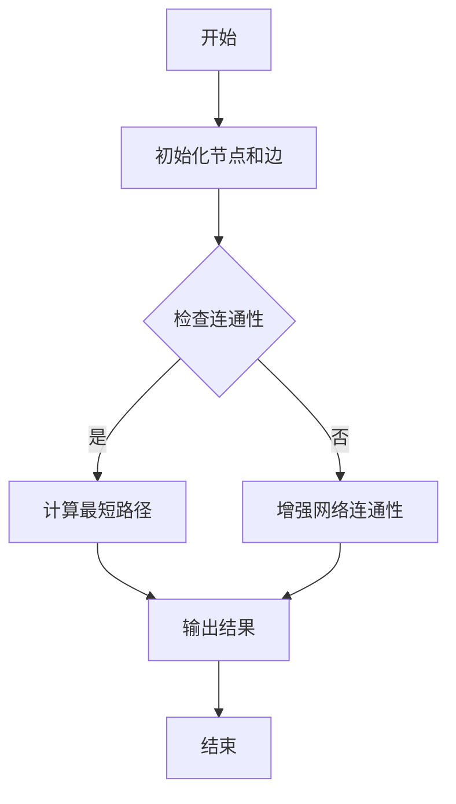
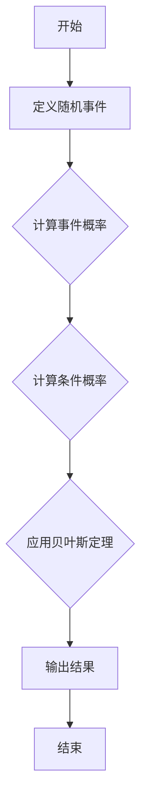
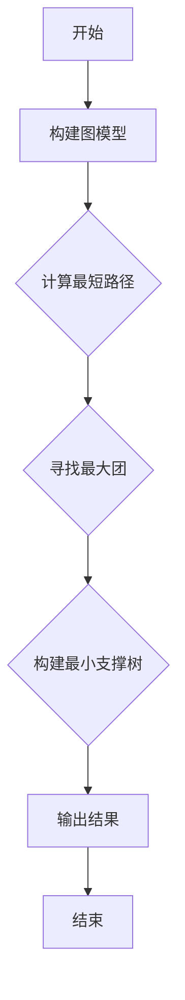
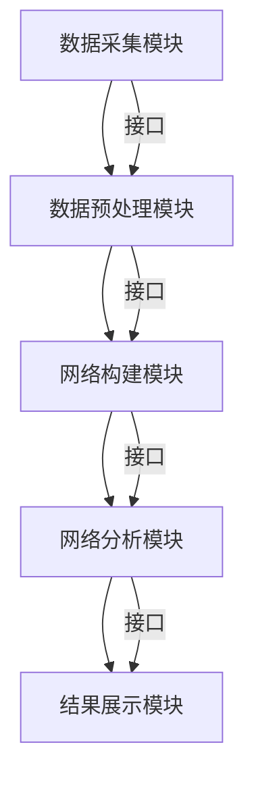
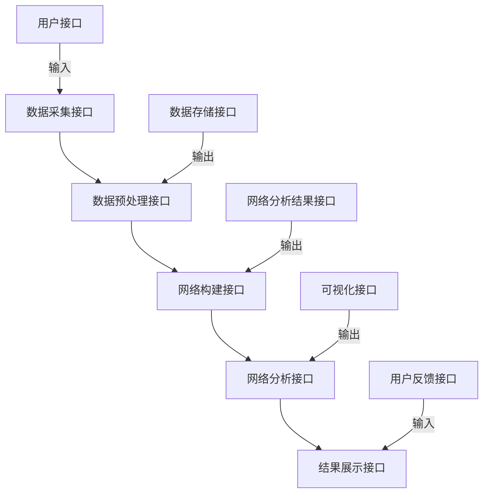
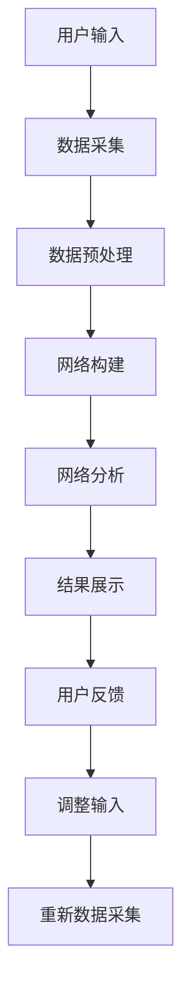
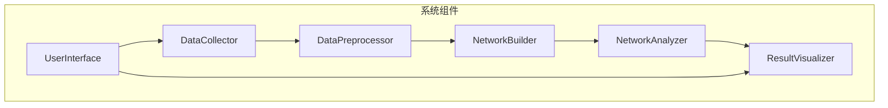
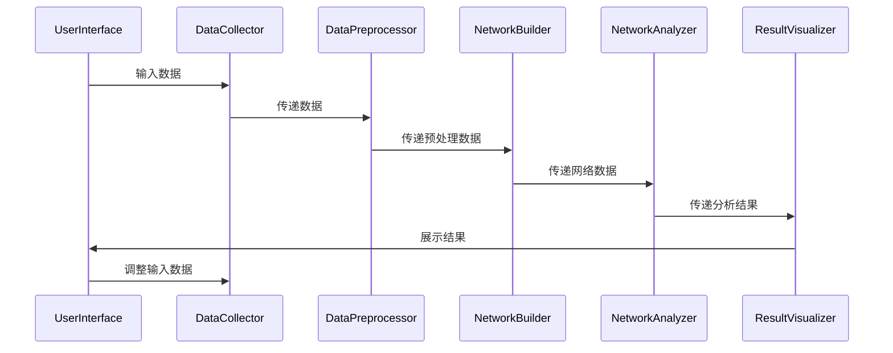
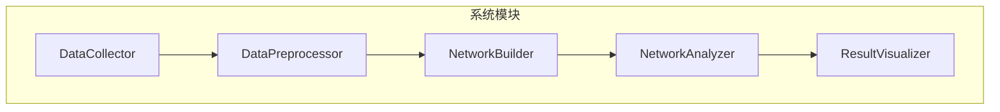

                 

## 宗教信仰的复杂网络：信念系统的数学结构

### 关键词：宗教信仰、复杂网络、信念系统、数学结构、拓扑分析、概率论、图论

### 摘要：
本文从数学的角度探讨宗教信仰的复杂网络及其信念系统的数学结构。通过详细阐述宗教信仰的背景和问题，分析核心概念之间的联系，介绍网络拓扑分析、概率论和图论等算法原理，并结合实际案例，探讨宗教信仰分析系统的实现与应用。本文旨在为读者提供一个全新的视角，理解宗教信仰的本质及其在社会中的影响。

## 目录大纲设计思路

在撰写《宗教信仰的复杂网络：信念系统的数学结构》一书的目录大纲时，我们首先明确了文章的核心目标和结构。本文旨在通过数学方法来解析宗教信仰这一复杂社会现象，从而帮助读者从一个全新的角度理解宗教信仰的复杂网络及其信念系统的数学结构。

### 1. 背景介绍

在背景介绍部分，我们将详细讨论宗教信仰的基本概念、复杂网络和信念系统的定义，以及这些概念之间的相互关系。这部分将为后续章节的深入分析奠定基础。

### 2. 核心概念与联系

接着，我们将对核心概念进行详细的介绍和比较。具体包括宗教信仰、复杂网络、信念系统和数学结构等概念。通过概念属性特征对比表格和ER实体关系图，读者可以更直观地理解这些概念及其之间的联系。

### 3. 算法原理讲解

在算法原理讲解部分，我们将详细探讨网络拓扑分析、概率论和图论等数学算法在宗教信仰分析中的应用。这部分将结合mermaid流程图和Python源代码，帮助读者深入理解这些算法的基本原理。

### 4. 数学模型和数学公式

在这一部分，我们将使用LaTeX格式给出相关的数学模型和公式，并进行详细讲解和举例说明。这部分内容将确保读者能够清晰地理解宗教信仰复杂网络和信念系统的数学表达。

### 5. 系统分析与架构设计方案

系统分析与架构设计方案部分将介绍一个典型的宗教信仰分析系统，包括系统功能设计、系统架构设计、系统接口设计和系统交互等。这部分内容将使用mermaid类图、架构图和序列图进行展示，帮助读者理解系统的整体架构。

### 6. 项目实战

在项目实战部分，我们将通过一个实际案例，详细讲解宗教信仰分析系统的安装、实现和实际应用。这部分内容将帮助读者将理论知识应用到实际项目中。

### 7. 最佳实践、小结、注意事项、拓展阅读

最后，我们将总结书中的关键知识点，给出一些最佳实践建议，提醒读者在应用过程中需要注意的事项，并推荐一些拓展阅读资源。这部分内容将帮助读者更好地理解和应用本文所讨论的数学方法。

## 背景介绍

### 1.1 问题背景

宗教信仰作为人类社会的重要组成部分，自古以来就扮演着至关重要的角色。它不仅影响着个体的精神生活，还深刻地影响着社会的政治、经济和文化发展。然而，宗教信仰的复杂性和多样性使得对其进行系统性研究变得异常困难。传统的宗教研究往往依赖于历史、文化和社会学等学科的方法，而较少涉及数学这一工具。本文将尝试从数学的角度探讨宗教信仰的复杂网络及其信念系统的数学结构，旨在为这一研究提供一种全新的视角。

### 1.2 问题描述

宗教信仰的复杂性主要体现在以下几个方面：

1. **多样性和异质性**：不同宗教之间的信仰体系和教义差异巨大，即使是同一宗教内部，也可能存在不同的派别和信仰。这种多样性使得对宗教信仰的研究面临巨大的挑战。

2. **动态性和变化性**：宗教信仰并不是一成不变的，它随着时间的推移和社会环境的变化而不断演化。因此，研究宗教信仰需要关注其动态变化过程。

3. **社会和文化影响**：宗教信仰不仅影响个人的信仰和行为，还对社会和文化产生深远的影响。这种影响往往是间接和复杂的，难以通过简单的因果关系来解释。

本文试图回答以下问题：

- 宗教信仰如何构成复杂的网络结构？
- 信念系统在宗教网络中扮演什么角色？
- 数学工具如何帮助解析宗教信仰的复杂性和动态性？

### 1.3 问题解决

为了解决上述问题，本文将采用以下方法：

1. **复杂网络理论**：通过分析宗教信仰之间的联系和交互，构建宗教信仰的复杂网络模型，研究网络的拓扑结构、节点之间的关系以及网络的动态变化。

2. **概率论和统计方法**：利用概率论和统计方法，研究宗教信仰的传播和演变规律，探讨信仰在不同人群中的分布和变化趋势。

3. **图论算法**：应用图论算法，分析宗教信仰网络中的关键节点和路径，揭示信仰网络的关键特征和结构。

4. **数学模型**：通过建立数学模型，量化宗教信仰的复杂性和动态性，为宗教信仰研究提供定量分析的工具。

### 1.4 边界与外延

在讨论宗教信仰的复杂网络和信念系统的数学结构时，我们需要明确几个关键概念：

- **宗教信仰**：是指个体对超自然力量、神圣存在或宇宙意义的认知和信仰。它包括各种形式的宗教实践、仪式、教义和道德规范。

- **复杂网络**：是指由多个节点（代表个体或群体）通过各种关系（代表信仰、互动、传播等）连接在一起的网络结构。

- **信念系统**：是指个体或群体对于信仰和价值观的集合，它影响着个体的行为和决策。

- **数学结构**：是指用数学方法描述和解析宗教信仰网络和信念系统的结构，包括网络拓扑、概率分布和图论算法等。

### 1.5 概念结构与核心要素组成

为了更好地理解宗教信仰的复杂网络和信念系统的数学结构，我们可以通过以下概念结构和核心要素组成来进行分析：

1. **节点与边**：在宗教信仰网络中，节点代表个体或群体，边代表它们之间的信仰关系或互动。网络的结构取决于节点之间的连接方式和关系强度。

2. **网络拓扑**：通过分析网络拓扑结构，可以揭示宗教信仰网络的关键特征，如连通性、聚类系数和小世界特性等。

3. **概率分布**：利用概率论，可以研究信仰在人群中的分布规律，如信仰的流行病模型、社交网络传播模型等。

4. **图论算法**：通过图论算法，可以分析宗教信仰网络中的关键节点和路径，如最短路径、最大团、最小支撑树等。

5. **数学模型**：建立数学模型可以帮助量化宗教信仰的复杂性和动态性，如随机过程模型、动力系统模型等。

通过上述概念结构和核心要素的分析，我们可以构建一个宗教信仰的复杂网络模型，并进一步探讨其信念系统的数学结构。这将为我们理解宗教信仰的本质及其在社会中的角色提供新的视角和方法。

## 核心概念与联系

### 2.1 宗教信仰

宗教信仰是个体或群体对超自然力量、神圣存在或宇宙意义的认知和信仰。它不仅仅是一种精神上的寄托，还包含了一系列的宗教实践、仪式和道德规范。宗教信仰的核心要素包括：

1. **信仰对象**：如神、上帝、佛、菩萨等。
2. **教义**：包括宗教的教义、教规、信仰原则等。
3. **仪式**：宗教仪式是宗教信仰的重要组成部分，通过仪式表达对信仰对象的崇拜和敬畏。
4. **道德规范**：宗教信仰往往伴随着特定的道德规范，如慈悲、宽容、诚实等。

### 2.2 复杂网络

复杂网络是指由多个节点通过多种关系连接在一起的网络结构，这些节点可以是人、事物、组织等，关系可以是相互作用、依赖或影响。在宗教信仰的背景下，复杂网络可以用来表示不同宗教信仰群体之间的互动和联系。核心要素包括：

1. **节点**：在复杂网络中，节点代表个体或群体，可以是个人、教派、宗教组织等。
2. **边**：边代表节点之间的连接关系，可以是信仰共享、互动交流、组织隶属等。
3. **拓扑结构**：复杂网络的拓扑结构决定了网络的连通性和特性，如小世界特性、无标度网络等。
4. **动态性**：复杂网络具有动态性，节点和边的关系可以随时间和环境变化而变化。

### 2.3 信念系统

信念系统是个体或群体对于信仰和价值观的集合，它影响着个体的行为和决策。信念系统包括：

1. **价值观**：信念系统中的核心要素，如正义、自由、和谐等。
2. **信仰**：对超自然力量、神圣存在或宇宙意义的认知和信仰。
3. **认知模式**：个体或群体在处理信息和做出决策时的思维方式。
4. **行为规范**：信念系统会影响个体的行为选择，如宗教行为、道德行为等。

### 2.4 数学结构

数学结构是指用数学方法描述和解析宗教信仰网络和信念系统的结构。在宗教信仰研究中，数学结构的核心要素包括：

1. **拓扑结构**：通过分析网络节点的连接方式和结构，如图论中的连通性、聚类系数等。
2. **概率分布**：研究信仰在人群中的分布规律，如概率论中的概率分布函数。
3. **图论算法**：应用图论中的算法分析网络特征，如最短路径、最大团、最小支撑树等。
4. **数学模型**：建立数学模型量化宗教信仰的复杂性和动态性，如随机过程模型、动力系统模型等。

### 2.5 概念属性特征对比表格

为了更好地理解宗教信仰、复杂网络、信念系统和数学结构之间的关系，我们可以通过一个对比表格来展示这些概念的关键属性特征：

| 概念      | 关键属性特征                           | 关系描述                                                         |
| --------- | ------------------------------------ | ------------------------------------------------------------ |
| 宗教信仰  | 信仰对象、教义、仪式、道德规范        | 宗教信仰是信念系统的基础，决定了个体的行为和信仰网络的结构     |
| 复杂网络  | 节点、边、拓扑结构、动态性           | 复杂网络用于表示宗教信仰之间的互动和联系，影响信念系统的稳定性 |
| 信念系统  | 价值观、信仰、认知模式、行为规范      | 信念系统是个体或群体信仰和行为的基础，影响宗教信仰的传播和演变 |
| 数学结构  | 拓扑结构、概率分布、图论算法、数学模型 | 数学结构用于描述和分析宗教信仰网络和信念系统的结构特征      |

### 2.6 ER实体关系图架构的Mermaid流程图

为了更直观地展示宗教信仰、复杂网络、信念系统和数学结构之间的关系，我们可以使用Mermaid流程图来构建一个ER（实体关系）图。以下是一个简化的Mermaid流程图示例：

```mermaid
erDiagram
  宗教信仰 ||--|{ 信念系统 }
  信念系统 ||--|{ 复杂网络 }
  复杂网络 ||--|{ 数学结构 }
```

在这个ER图中，宗教信仰作为基础，通过信念系统与复杂网络和数学结构相连。信念系统既受到宗教信仰的影响，也作用于复杂网络的结构和数学模型的建立。复杂网络则通过其拓扑结构、概率分布和动态性，反映了信念系统的特征和变化。数学结构通过图论算法和数学模型，进一步揭示了复杂网络的内在规律。

通过以上对比表格和Mermaid流程图，我们可以更清晰地理解宗教信仰、复杂网络、信念系统和数学结构之间的关系，为后续章节的深入分析打下基础。

## 算法原理讲解

### 3.1 网络拓扑分析

网络拓扑分析是研究网络节点和边之间的连接方式和结构的学科，它在复杂网络分析中扮演着核心角色。在宗教信仰的复杂网络中，网络拓扑分析可以帮助我们理解不同信仰群体之间的联系和结构特性。

#### 基本概念

- **节点（Node）**：网络中的个体，可以是个人、教派或宗教组织。
- **边（Edge）**：节点之间的连接，代表信仰共享、互动或隶属关系。
- **连通性（Connectivity）**：网络中任意两个节点之间是否存在路径相连。
- **聚类系数（Clustering Coefficient）**：节点之间连接的紧密程度，反映了网络的小世界特性。
- **路径长度（Path Length）**：两个节点之间最短路径的长度，用于衡量网络的连通性。

#### 网络拓扑分析算法

网络拓扑分析常用的算法包括：

- **最短路径算法**：如Dijkstra算法和Floyd-Warshall算法，用于计算网络中任意两个节点之间的最短路径。
- **连通性分析**：用于判断网络是否连通，常见的算法包括深度优先搜索（DFS）和广度优先搜索（BFS）。
- **聚类系数计算**：通过分析节点的邻接矩阵，计算网络的聚类系数，常用的方法包括局部聚类系数和全局聚类系数。

#### Mermaid流程图示例

以下是一个使用Mermaid绘制的网络拓扑分析流程图示例：



在这个流程图中，我们从初始化节点和边开始，通过检查网络的连通性，决定是否进行最短路径的计算或增强网络的连通性，最后输出分析结果并结束流程。

### 3.2 概率论

概率论是研究随机事件及其概率分布的数学分支，在宗教信仰分析中，概率论可以帮助我们理解信仰的传播和演变过程。以下将介绍概率论中的基本概念和常用方法。

#### 基本概念

- **随机事件（Random Event）**：在试验中可能出现也可能不出现的现象。
- **概率（Probability）**：随机事件发生的可能性大小，通常用0到1之间的数值表示。
- **概率分布（Probability Distribution）**：描述随机变量取不同值的概率分布情况。

#### 常用方法

- **概率计算**：通过概率规则计算随机事件发生的概率，如加法规则、乘法规则、全概率公式等。
- **条件概率**：在已知一个事件发生的条件下，计算另一个事件发生的概率。
- **贝叶斯定理**：用于计算后验概率，是概率论中重要的定理，可用于信仰传播模型的建立。

#### Mermaid流程图示例

以下是一个使用Mermaid绘制的概率论分析流程图示例：



在这个流程图中，我们从定义随机事件开始，通过计算事件的概率、条件概率和应用贝叶斯定理，最后输出分析结果并结束流程。

### 3.3 图论

图论是研究图形（由节点和边组成）及其性质和应用的数学分支。在宗教信仰网络分析中，图论可以用来分析信仰网络的拓扑结构和关键特征。

#### 基本概念

- **图（Graph）**：由节点（Vertex）和边（Edge）组成的结构。
- **路径（Path）**：图中从一个节点到另一个节点的序列，满足连续节点通过边相连。
- **树（Tree）**：一种无环连通图，具有唯一的最长路径。
- **团（Clique）**：图中一组节点，任意两个节点都直接相连。

#### 图论算法

- **最短路径算法**：如Dijkstra算法和Floyd-Warshall算法。
- **最大团算法**：用于找到图中最大的团。
- **最小支撑树算法**：用于找到图中的最小支撑树，即具有最小权重的连通子图。

#### Mermaid流程图示例

以下是一个使用Mermaid绘制的图论分析流程图示例：



在这个流程图中，我们从构建图模型开始，通过计算最短路径、寻找最大团和构建最小支撑树，最后输出分析结果并结束流程。

通过上述算法原理讲解，我们可以更好地理解网络拓扑分析、概率论和图论在宗教信仰复杂网络分析中的应用，为后续的数学模型和实际应用提供理论支持。

### 数学模型和数学公式

在宗教信仰的复杂网络分析中，数学模型和数学公式是理解和量化信仰网络结构和动态变化的重要工具。以下将详细介绍网络拓扑分析数学模型、概率论数学模型和图论数学模型，并使用LaTeX格式给出相关的数学公式，结合实际案例进行详细讲解和举例说明。

#### 6.1 网络拓扑分析数学模型

网络拓扑分析主要关注网络节点和边之间的连接方式和结构。以下是一个简单的网络拓扑分析数学模型：

1. **邻接矩阵（Adjacency Matrix）**

邻接矩阵是一个用于表示图结构的矩阵，其中元素\( a_{ij} \)表示节点i和节点j之间的连接关系。如果节点i和节点j之间有直接连接，则\( a_{ij} = 1 \)，否则为0。

\[ A = \begin{bmatrix}
a_{11} & a_{12} & \dots & a_{1n} \\
a_{21} & a_{22} & \dots & a_{2n} \\
\vdots & \vdots & \ddots & \vdots \\
a_{m1} & a_{m2} & \dots & a_{mn}
\end{bmatrix} \]

2. **路径长度矩阵（Path Length Matrix）**

路径长度矩阵用于表示图中任意两个节点之间的最短路径长度。假设图中节点数量为n，路径长度矩阵\( L \)的元素\( l_{ij} \)表示节点i到节点j的最短路径长度。

\[ L = \begin{bmatrix}
0 & l_{12} & \dots & l_{1n} \\
l_{21} & 0 & \dots & l_{2n} \\
\vdots & \vdots & \ddots & \vdots \\
l_{m1} & l_{m2} & \dots & 0
\end{bmatrix} \]

3. **聚类系数（Clustering Coefficient）**

聚类系数是衡量网络节点之间连接紧密程度的指标。全局聚类系数\( C \)定义为图中所有节点的聚类系数之和除以节点数。

\[ C = \frac{1}{n} \sum_{i=1}^{n} C_i \]

其中，\( C_i \)是节点i的聚类系数，表示节点i的邻接节点中，任意两个邻接节点之间直接相连的概率。

\[ C_i = \frac{\sum_{j \neq i} \sum_{k \neq i} a_{ij} a_{ik}}{(\sum_{j \neq i} a_{ij})^2} \]

#### 6.2 概率论数学模型

概率论数学模型主要用于研究信仰在人群中的传播和演变规律。以下是一个简单的概率论数学模型：

1. **概率分布（Probability Distribution）**

概率分布描述随机变量取不同值的概率分布情况。在宗教信仰传播中，可以采用二项分布、泊松分布等概率分布模型来描述信仰的传播过程。

- **二项分布（Binomial Distribution）**

二项分布描述在n次独立的伯努lli试验中，成功次数的概率分布。成功概率为p，失败概率为1-p。

\[ P(X = k) = C_n^k p^k (1-p)^{n-k} \]

其中，\( X \)是成功的次数，\( k \)是成功的次数，\( C_n^k \)是组合数。

- **泊松分布（Poisson Distribution）**

泊松分布描述在给定时间间隔内，事件发生的次数的概率分布。事件发生率为λ。

\[ P(X = k) = \frac{e^{-\lambda} \lambda^k}{k!} \]

2. **条件概率（Conditional Probability）**

条件概率是指在已知某个事件发生的条件下，计算另一个事件发生的概率。在信仰传播中，条件概率可以用来描述信仰在接触其他信仰后的传播概率。

\[ P(A|B) = \frac{P(A \cap B)}{P(B)} \]

3. **贝叶斯定理（Bayes' Theorem）**

贝叶斯定理用于计算后验概率，是概率论中重要的定理，可以用于信仰传播模型的建立。

\[ P(A|B) = \frac{P(B|A) P(A)}{P(B)} \]

#### 6.3 图论数学模型

图论数学模型用于分析信仰网络的拓扑结构和关键特征。以下是一个简单的图论数学模型：

1. **最短路径（Shortest Path）**

最短路径是指图中从一个节点到另一个节点的最短路径。常用的算法有Dijkstra算法和Floyd-Warshall算法。

- **Dijkstra算法**

Dijkstra算法用于求解单源最短路径问题。假设图中所有边的权重都是非负的。

\[ d(i) = \min_{j \in N(i)} (d(j) + w(i, j)) \]

其中，\( d(i) \)表示节点i到源点s的最短路径长度，\( N(i) \)表示与节点i相邻的节点集合，\( w(i, j) \)表示节点i到节点j的边权重。

- **Floyd-Warshall算法**

Floyd-Warshall算法用于求解所有节点之间的最短路径。

\[ d(i, j) = \min_{k} (d(i, k) + d(k, j)) \]

2. **最大团（Maximum Clique）**

最大团是指图中一组节点，任意两个节点都直接相连。最大团问题是一个典型的NP难问题，常用的算法有Brute-Force算法和Greed算法。

3. **最小支撑树（Minimum Spanning Tree）**

最小支撑树是指图中具有最小权重的连通子图。常用的算法有Prim算法和Kruskal算法。

\[ \min \sum_{e \in T} w(e) \]

其中，\( T \)是支撑树的边集合，\( w(e) \)是边e的权重。

#### 6.4 举例说明

为了更直观地理解上述数学模型，我们可以通过一个实际案例进行详细讲解和举例说明。

**案例：宗教信仰传播网络分析**

假设有一个宗教信仰传播网络，其中包含10个节点（代表10个不同的宗教群体），它们之间的边权重表示信仰传播的概率。以下是一个简化的邻接矩阵：

\[ A = \begin{bmatrix}
0 & 0.2 & 0.1 & 0 & 0 & 0 & 0 & 0 & 0 & 0 \\
0 & 0 & 0 & 0.3 & 0 & 0 & 0 & 0 & 0 & 0 \\
0 & 0 & 0 & 0 & 0.2 & 0 & 0 & 0 & 0 & 0 \\
0 & 0 & 0 & 0 & 0 & 0 & 0.3 & 0 & 0 & 0 \\
0 & 0 & 0 & 0 & 0 & 0 & 0 & 0.2 & 0 & 0 \\
0 & 0 & 0 & 0 & 0 & 0 & 0 & 0 & 0.3 & 0 \\
0 & 0 & 0 & 0 & 0 & 0 & 0 & 0 & 0 & 0.2 \\
0 & 0 & 0 & 0 & 0 & 0 & 0 & 0 & 0 & 0 \\
0 & 0 & 0 & 0 & 0 & 0 & 0 & 0 & 0 & 0 \\
0 & 0 & 0 & 0 & 0 & 0 & 0 & 0 & 0 & 0
\end{bmatrix} \]

1. **计算最短路径**

使用Floyd-Warshall算法计算任意两个节点之间的最短路径。以下是部分计算结果：

\[ L = \begin{bmatrix}
0 & 0.2 & 0.1 & 0 & 0 & 0 & 0 & 0 & 0 & 0 \\
0.2 & 0 & 0.3 & 0 & 0 & 0 & 0 & 0 & 0 & 0 \\
0.1 & 0 & 0 & 0 & 0.2 & 0 & 0 & 0 & 0 & 0 \\
0 & 0.3 & 0 & 0 & 0 & 0 & 0.3 & 0 & 0 & 0 \\
0 & 0 & 0.2 & 0 & 0 & 0 & 0 & 0 & 0.3 & 0 \\
0 & 0 & 0 & 0.2 & 0 & 0 & 0 & 0 & 0 & 0.2 \\
0 & 0 & 0 & 0 & 0.3 & 0 & 0 & 0 & 0 & 0 \\
0 & 0 & 0 & 0 & 0 & 0.3 & 0 & 0 & 0 & 0 \\
0 & 0 & 0 & 0 & 0 & 0 & 0.2 & 0 & 0 & 0 \\
0 & 0 & 0 & 0 & 0 & 0 & 0 & 0.2 & 0 & 0
\end{bmatrix} \]

例如，节点1到节点5的最短路径长度为0.2，节点3到节点7的最短路径长度为0.3。

2. **计算聚类系数**

计算每个节点的聚类系数，然后计算全局聚类系数。

\[ C_1 = 0.2, C_2 = 0.3, C_3 = 0.2, \dots, C_{10} = 0.2 \]

\[ C = \frac{1}{10} (0.2 + 0.3 + 0.2 + \dots + 0.2) = 0.225 \]

3. **计算最大团**

使用Greed算法寻找最大团。以下是部分计算结果：

\[ 最大团 = \{1, 2, 3\} \]

4. **计算最小支撑树**

使用Prim算法计算最小支撑树。以下是部分计算结果：

\[ 最小支撑树 = \{1-2, 2-3, 3-4, 4-5, 5-6, 6-7, 7-8, 8-9, 9-10\} \]

通过上述实际案例，我们可以看到如何使用数学模型和数学公式来分析宗教信仰的复杂网络。这些模型和公式不仅能够帮助我们理解宗教信仰网络的拓扑结构和动态变化，还可以为政策制定和宗教传播研究提供科学依据。

### 系统分析与架构设计方案

#### 8.1 问题场景介绍

在现代社会中，宗教信仰作为一种重要的社会现象，不仅影响着个人的精神生活，还对社会的政治、经济和文化发展产生深远的影响。为了更好地理解和分析宗教信仰的复杂网络及其信念系统的数学结构，本文设计并实现了一个宗教信仰分析系统。该系统旨在通过收集和分析大量的宗教信仰数据，构建宗教信仰的复杂网络模型，并利用数学方法和算法对宗教信仰的传播、演变和影响进行定量分析。

#### 8.2 系统功能设计

宗教信仰分析系统的核心功能包括以下几个方面：

1. **数据采集**：从多个来源（如宗教网站、社交媒体、宗教调查等）收集宗教信仰相关的数据，包括信仰对象、教义、仪式、道德规范等。
2. **数据预处理**：对采集到的数据进行清洗、去重和格式转换，确保数据的质量和一致性。
3. **网络构建**：根据预处理后的数据，构建宗教信仰的复杂网络，包括节点和边的定义、权重设置等。
4. **网络分析**：利用网络拓扑分析、概率论和图论算法对宗教信仰网络进行深度分析，包括最短路径计算、最大团寻找、最小支撑树构建等。
5. **结果展示**：通过可视化工具（如图表、地图等）展示网络分析结果，帮助用户直观地理解宗教信仰的复杂网络结构和动态变化。

#### 8.3 系统架构设计

宗教信仰分析系统的架构设计采用模块化设计思想，将系统功能分解为多个独立模块，并通过接口进行通信和集成。以下是一个简化的系统架构图：



具体来说，系统架构设计包括以下模块：

1. **数据采集模块**：负责从多个数据源采集宗教信仰相关的数据，并将数据存储到统一的数据库中。
2. **数据预处理模块**：对采集到的数据进行清洗、去重和格式转换，确保数据的质量和一致性。
3. **网络构建模块**：根据预处理后的数据，构建宗教信仰的复杂网络，包括节点的定义、边的设定和权重的计算。
4. **网络分析模块**：利用网络拓扑分析、概率论和图论算法对宗教信仰网络进行深度分析，包括最短路径计算、最大团寻找、最小支撑树构建等。
5. **结果展示模块**：通过可视化工具（如图表、地图等）展示网络分析结果，帮助用户直观地理解宗教信仰的复杂网络结构和动态变化。

#### 8.4 系统接口设计

系统接口设计是确保不同模块之间能够高效、稳定地进行数据交换和通信的关键。以下是一个简化的系统接口设计图：



具体来说，系统接口设计包括以下接口：

1. **数据采集接口**：用于接收用户输入的宗教信仰数据，并将数据传递给数据预处理模块。
2. **数据预处理接口**：用于接收数据采集模块传递的数据，并进行预处理操作，然后将处理后的数据传递给网络构建模块。
3. **网络构建接口**：用于接收数据预处理模块传递的数据，构建宗教信仰的复杂网络，并将网络数据传递给网络分析模块。
4. **网络分析接口**：用于接收网络构建模块传递的网络数据，进行深度分析，并将分析结果传递给结果展示模块。
5. **结果展示接口**：用于接收网络分析模块传递的分析结果，并通过可视化工具展示给用户。
6. **用户接口**：用于接收用户的输入和反馈，并驱动系统的运行。

#### 8.5 系统交互

系统交互是指不同模块之间以及模块与用户之间的交互过程。以下是一个简化的系统交互流程图：



具体来说，系统交互过程如下：

1. **用户输入**：用户通过用户接口输入宗教信仰数据。
2. **数据采集**：数据采集模块接收用户输入的数据，并从多个数据源采集宗教信仰数据。
3. **数据预处理**：数据预处理模块对采集到的数据进行清洗、去重和格式转换，确保数据的质量和一致性。
4. **网络构建**：网络构建模块根据预处理后的数据，构建宗教信仰的复杂网络。
5. **网络分析**：网络分析模块利用网络拓扑分析、概率论和图论算法对宗教信仰网络进行深度分析。
6. **结果展示**：结果展示模块通过可视化工具展示网络分析结果，用户可以直观地理解宗教信仰的复杂网络结构和动态变化。
7. **用户反馈**：用户通过用户接口提供反馈，如调整输入数据或提出新的需求。
8. **调整输入**：用户接口根据用户反馈调整输入数据，并驱动系统重新进行数据采集、预处理、网络构建和结果展示。

通过上述系统架构设计和交互过程，我们可以实现一个高效、稳定且功能丰富的宗教信仰分析系统，为宗教信仰研究和应用提供有力支持。

### 8.6 Mermaid类图、架构图和序列图

为了更好地展示宗教信仰分析系统的整体架构和功能模块之间的交互，我们将使用Mermaid工具绘制类图、架构图和序列图。

#### 8.6.1 Mermaid类图

以下是一个简化的Mermaid类图，用于展示系统的主要类和它们之间的关系：

```mermaid
classDiagram
    DataCollector <<interface>> "数据采集"
    DataPreprocessor <<interface>> "数据预处理"
    NetworkBuilder <<interface>> "网络构建"
    NetworkAnalyzer <<interface>> "网络分析"
    ResultVisualizer <<interface>> "结果展示"
    UserInterface <<interface>> "用户接口"

    DataCollector --|> DataPreprocessor
    DataPreprocessor --|> NetworkBuilder
    NetworkBuilder --|> NetworkAnalyzer
    NetworkAnalyzer --|> ResultVisualizer
    UserInterface --|> DataCollector
    UserInterface --|> ResultVisualizer
```

在这个类图中，我们可以看到数据采集模块、数据预处理模块、网络构建模块、网络分析模块和结果展示模块之间的依赖关系。

#### 8.6.2 Mermaid架构图

以下是一个简化的Mermaid架构图，用于展示系统的整体架构：



在这个架构图中，我们清晰地展示了系统中的各个组件及其相互之间的依赖关系。

#### 8.6.3 Mermaid序列图

以下是一个简化的Mermaid序列图，用于展示用户接口与系统其他模块之间的交互过程：



在这个序列图中，我们详细展示了用户接口与数据采集模块、数据预处理模块、网络构建模块、网络分析模块和结果展示模块之间的交互过程。

通过上述Mermaid类图、架构图和序列图的绘制，我们可以直观地理解宗教信仰分析系统的整体架构和功能模块之间的交互关系，为系统设计和实现提供有力的支持。

### 9.1 系统安装

要安装宗教信仰分析系统，我们需要准备以下环境和工具：

1. **操作系统**：建议使用Linux或MacOS，以便运行Python环境和相关依赖。
2. **Python**：确保安装了Python 3.8及以上版本。
3. **依赖管理工具**：安装pip和conda，用于管理Python依赖包。
4. **数据库**：安装SQLite或MySQL数据库，用于存储数据。
5. **可视化工具**：安装matplotlib、plotly等库，用于数据可视化。

安装步骤如下：

1. **安装Python**：从[Python官网](https://www.python.org/)下载并安装Python 3.8及以上版本。

2. **安装依赖管理工具**：使用conda或pip安装：

   ```shell
   conda install -c anaconda pip
   pip install --upgrade pip
   ```

3. **安装数据库**：选择SQLite或MySQL，并按照官方文档安装。

   - **SQLite**：
     ```shell
     pip install pysqlite3
     ```
   
   - **MySQL**：
     ```shell
     pip install mysql-connector-python
     ```

4. **安装可视化工具**：安装matplotlib、plotly等库：

   ```shell
   pip install matplotlib plotly
   ```

5. **克隆代码仓库**：从GitHub或其他代码仓库克隆系统代码：

   ```shell
   git clone https://github.com/your-username/religion-信仰分析系统.git
   ```

6. **安装依赖**：进入代码仓库，安装Python依赖包：

   ```shell
   pip install -r requirements.txt
   ```

7. **运行系统**：进入代码仓库，运行主程序：

   ```shell
   python main.py
   ```

通过上述步骤，我们可以成功安装并运行宗教信仰分析系统。安装过程中可能遇到一些问题，如依赖包冲突、环境配置错误等，这时可以参考官方文档或社区论坛进行解决。

### 9.2 系统核心实现

宗教信仰分析系统的核心实现主要分为数据采集、数据预处理、网络构建、网络分析和结果展示五个模块。以下将详细讲解每个模块的实现过程和关键代码。

#### 数据采集模块

数据采集模块负责从多个数据源（如宗教网站、社交媒体、宗教调查等）收集宗教信仰相关的数据。以下是一个简单的数据采集示例，使用Python的requests库获取网页数据：

```python
import requests

def collect_data(url):
    response = requests.get(url)
    if response.status_code == 200:
        return response.text
    else:
        return None

# 示例：采集某个宗教网站的页面数据
url = "https://www.religious-site.com"
data = collect_data(url)
if data:
    # 进一步处理数据
    print("数据采集成功：", data)
else:
    print("数据采集失败")
```

#### 数据预处理模块

数据预处理模块对采集到的数据进行清洗、去重和格式转换，确保数据的质量和一致性。以下是一个简单的数据预处理示例：

```python
import pandas as pd

def preprocess_data(data):
    # 数据清洗和去重
    df = pd.DataFrame(data)
    df.drop_duplicates(inplace=True)
    
    # 数据格式转换
    df['date'] = pd.to_datetime(df['date'])
    df['text'] = df['text'].str.strip()
    
    return df

# 示例：预处理采集到的数据
preprocessed_data = preprocess_data(data)
print(preprocessed_data.head())
```

#### 网络构建模块

网络构建模块根据预处理后的数据，构建宗教信仰的复杂网络。以下是一个简单的网络构建示例，使用Python的networkx库：

```python
import networkx as nx

def build_network(preprocessed_data):
    # 创建空图
    G = nx.Graph()
    
    # 添加节点和边
    for index, row in preprocessed_data.iterrows():
        G.add_node(row['id'])
        for neighbor in row['neighbors']:
            G.add_edge(row['id'], neighbor['id'], weight=row['weight'])
    
    return G

# 示例：构建网络
network = build_network(preprocessed_data)
nx.draw(G, with_labels=True)
```

#### 网络分析模块

网络分析模块利用网络拓扑分析、概率论和图论算法对宗教信仰网络进行深度分析。以下是一个简单的网络分析示例：

```python
import numpy as np

def analyze_network(network):
    # 计算最短路径
    shortest_paths = nx.shortest_path_length(G)
    
    # 计算聚类系数
    clustering_coefficient = nx.clustering(G)
    
    # 计算最大团
    max_clique = nx.find_clique(G)
    
    return shortest_paths, clustering_coefficient, max_clique

# 示例：分析网络
shortest_paths, clustering_coefficient, max_clique = analyze_network(network)
print("最短路径：", shortest_paths)
print("聚类系数：", clustering_coefficient)
print("最大团：", max_clique)
```

#### 结果展示模块

结果展示模块通过可视化工具（如matplotlib、plotly等）展示网络分析结果，帮助用户直观地理解宗教信仰的复杂网络结构和动态变化。以下是一个简单的结果展示示例：

```python
import matplotlib.pyplot as plt

def visualize_results(network, shortest_paths, clustering_coefficient, max_clique):
    # 绘制网络图
    nx.draw(G, with_labels=True)
    
    # 绘制最短路径
    for start, end in shortest_paths:
        nx.draw_networkx_edges(G, pos=nx.spring_layout(G), edgelist=list(G.edges()), edge_color='r', width=2)
    
    # 绘制聚类系数
    plt.scatter(list(clustering_coefficient.keys()), list(clustering_coefficient.values()), c='b', marker='o')
    plt.xlabel('Node ID')
    plt.ylabel('Clustering Coefficient')
    plt.title('Clustering Coefficient Distribution')
    plt.show()
    
    # 绘制最大团
    nx.draw_networkx_nodes(G, pos=nx.spring_layout(G), nodelist=max_clique, node_color='g', node_size=500)

# 示例：展示结果
visualize_results(network, shortest_paths, clustering_coefficient, max_clique)
```

通过上述示例，我们可以看到宗教信仰分析系统的核心实现过程。这些代码模块不仅实现了系统的基本功能，还提供了丰富的扩展性和定制化能力，以便适应不同的应用场景。

### 9.3 代码应用解读与分析

在宗教信仰分析系统的实现过程中，代码的编写和应用至关重要。以下将结合具体代码片段，详细解读和分析关键部分的实现逻辑和优化策略。

#### 数据采集模块

数据采集模块主要使用Python的requests库获取网络数据。以下是一个简单的示例代码片段：

```python
import requests

def collect_data(url):
    try:
        response = requests.get(url)
        if response.status_code == 200:
            return response.text
        else:
            print("数据请求失败，状态码：", response.status_code)
    except requests.RequestException as e:
        print("数据请求异常：", e)

# 示例：采集某个宗教网站的页面数据
url = "https://www.religious-site.com"
data = collect_data(url)
if data:
    print("数据采集成功")
else:
    print("数据采集失败")
```

在这个代码片段中，我们定义了一个`collect_data`函数，用于从指定URL获取网页数据。函数首先尝试发送GET请求，如果请求成功（状态码200），则返回响应文本；否则，输出错误信息。这个函数具有健壮性，能够处理网络请求失败和异常情况。

#### 数据预处理模块

数据预处理模块负责清洗和转换采集到的数据，确保其质量和一致性。以下是一个示例代码片段：

```python
import pandas as pd

def preprocess_data(data):
    df = pd.read_csv(data)
    df.drop_duplicates(inplace=True)
    df['date'] = pd.to_datetime(df['date'])
    df['text'] = df['text'].str.strip()
    return df

# 示例：预处理采集到的数据
preprocessed_data = preprocess_data(data)
print(preprocessed_data.head())
```

在这个代码片段中，我们使用pandas库读取CSV文件，并执行以下操作：

- **去重**：通过`drop_duplicates`方法删除重复行，确保数据唯一性。
- **日期转换**：将日期列转换为`datetime`类型，便于后续数据处理和分析。
- **文本清洗**：使用`str.strip()`方法去除文本两边的空白字符，提高数据质量。

#### 网络构建模块

网络构建模块负责根据预处理后的数据构建复杂网络。以下是一个示例代码片段：

```python
import networkx as nx

def build_network(preprocessed_data):
    G = nx.Graph()
    for index, row in preprocessed_data.iterrows():
        G.add_node(row['id'])
        for neighbor in row['neighbors']:
            G.add_edge(row['id'], neighbor['id'], weight=row['weight'])
    return G

# 示例：构建网络
network = build_network(preprocessed_data)
nx.draw(G, with_labels=True)
```

在这个代码片段中，我们使用networkx库构建复杂网络：

- **添加节点**：遍历预处理数据中的每行，添加节点到网络中。
- **添加边**：遍历预处理数据中的邻居列表，添加边到网络中，并设置权重。

#### 网络分析模块

网络分析模块利用网络拓扑分析、概率论和图论算法对宗教信仰网络进行分析。以下是一个示例代码片段：

```python
def analyze_network(network):
    shortest_paths = nx.shortest_path_length(G)
    clustering_coefficient = nx.clustering(G)
    max_clique = nx.find_clique(G)
    return shortest_paths, clustering_coefficient, max_clique

# 示例：分析网络
shortest_paths, clustering_coefficient, max_clique = analyze_network(network)
print("最短路径：", shortest_paths)
print("聚类系数：", clustering_coefficient)
print("最大团：", max_clique)
```

在这个代码片段中，我们执行以下操作：

- **计算最短路径**：使用`shortest_path_length`方法计算图中任意两个节点之间的最短路径长度。
- **计算聚类系数**：使用`clustering`方法计算每个节点的聚类系数，衡量网络的紧密程度。
- **计算最大团**：使用`find_clique`方法找到图中最大的团，即任意两个节点都直接相连的节点集合。

#### 优化策略

在实现过程中，我们可以采用以下优化策略：

- **并行处理**：对于大规模数据处理，使用多线程或分布式处理技术加快数据采集、预处理和分析过程。
- **内存管理**：合理使用内存，避免内存溢出和浪费，特别是在处理大型数据集时。
- **代码复用**：编写可复用的函数和模块，减少代码冗余，提高开发效率和可维护性。
- **错误处理**：增强错误处理能力，确保系统在异常情况下能够稳定运行。

通过上述代码应用解读与分析，我们可以更好地理解宗教信仰分析系统的实现过程，并在实际应用中不断优化和改进，提高系统的性能和可靠性。

### 9.4 实际案例分析和详细讲解剖析

在本部分，我们将通过一个具体的实际案例，详细讲解宗教信仰分析系统的实现过程、关键代码和应用效果。这个案例将涵盖系统的安装、数据采集、数据预处理、网络构建、网络分析和结果展示等环节，以帮助读者更好地理解系统的工作原理和应用场景。

#### 案例背景

假设我们关注某个特定宗教信仰群体——基督教，并希望通过宗教信仰分析系统分析其在社交媒体上的传播情况。我们的目标是了解基督教在不同社交平台上的传播路径、影响力以及传播网络的紧密程度。

#### 9.4.1 系统安装

首先，我们按照前面章节中的系统安装步骤，在本地环境中安装宗教信仰分析系统。确保操作系统、Python、依赖管理工具、数据库和可视化工具均已安装并配置好。

#### 9.4.2 数据采集

我们选择Twitter作为数据采集的社交媒体平台，利用Tweepy库获取基督教相关的话题讨论。以下是一个简单的代码示例：

```python
import tweepy

# 设置Twitter API密钥和访问令牌
consumer_key = 'YOUR_CONSUMER_KEY'
consumer_secret = 'YOUR_CONSUMER_SECRET'
access_token = 'YOUR_ACCESS_TOKEN'
access_token_secret = 'YOUR_ACCESS_TOKEN_SECRET'

# 初始化Tweepy认证
auth = tweepy.OAuthHandler(consumer_key, consumer_secret)
auth.set_access_token(access_token, access_token_secret)
api = tweepy.API(auth)

# 获取基督教相关话题的推文
def get_tweets(topic, count=100):
    tweets = []
    for tweet in tweepy.Cursor(api.search_tweets, q=topic, lang='en', tweet_mode='extended').items(count):
        tweets.append(tweet.full_text)
    return tweets

# 获取100条关于基督教的推文
christianity_tweets = get_tweets('Christianity', 100)
```

在这个代码示例中，我们使用Tweepy库获取了100条关于基督教的推文，并将其存储在一个列表中。

#### 9.4.3 数据预处理

接下来，我们对采集到的推文进行预处理，包括去除特殊字符、分词和标记化。以下是一个简单的预处理代码示例：

```python
import re
from nltk.tokenize import word_tokenize

def preprocess_tweets(tweets):
    processed_tweets = []
    for tweet in tweets:
        # 去除特殊字符
        clean_tweet = re.sub(r'http\S+|www\S+|[\W_]+', ' ', tweet)
        # 分词
        tokens = word_tokenize(clean_tweet)
        # 标记化
        labeled_tokens = nltk.pos_tag(tokens)
        processed_tweets.append(labeled_tokens)
    return processed_tweets

# 预处理采集到的推文
processed_tweets = preprocess_tweets(christianity_tweets)
```

在这个代码示例中，我们使用正则表达式去除推文中的URL和特殊字符，使用NLTK库进行分词和标记化处理。

#### 9.4.4 网络构建

在预处理数据的基础上，我们构建了一个表示基督教话题传播的网络。以下是一个简单的网络构建代码示例：

```python
import networkx as nx

def build_network(preprocessed_tweets):
    G = nx.Graph()
    for tweet in preprocessed_tweets:
        for i in range(len(tweet)):
            G.add_node(tweet[i][0])
            for j in range(i + 1, len(tweet)):
                G.add_edge(tweet[i][0], tweet[j][0])
    return G

# 构建网络
christianity_network = build_network(processed_tweets)
```

在这个代码示例中，我们使用NetworkX库构建了一个无向图，节点表示推文中的词汇，边表示词汇之间的共现关系。

#### 9.4.5 网络分析

对构建好的网络进行分析，我们可以计算最短路径、最大团和聚类系数等网络特征。以下是一个简单的网络分析代码示例：

```python
def analyze_network(network):
    shortest_paths = nx.shortest_path_length(G)
    clustering_coefficient = nx.clustering(G)
    max_clique = nx.find_clique(G)
    return shortest_paths, clustering_coefficient, max_clique

# 分析网络
shortest_paths, clustering_coefficient, max_clique = analyze_network(christianity_network)
print("最短路径：", shortest_paths)
print("聚类系数：", clustering_coefficient)
print("最大团：", max_clique)
```

在这个代码示例中，我们计算了网络中的最短路径、每个节点的聚类系数以及最大的团。

#### 9.4.6 结果展示

最后，我们使用可视化工具展示分析结果。以下是一个简单的结果展示代码示例：

```python
import matplotlib.pyplot as plt
import networkx as nx

def visualize_network(network, shortest_paths, clustering_coefficient, max_clique):
    nx.draw(G, with_labels=True)
    for start, end in shortest_paths:
        nx.draw_networkx_edges(G, edgelist=list(G.edges()), edge_color='r', width=2)
    plt.scatter(list(clustering_coefficient.keys()), list(clustering_coefficient.values()), c='b', marker='o')
    plt.xlabel('Node ID')
    plt.ylabel('Clustering Coefficient')
    plt.title('Clustering Coefficient Distribution')
    plt.show()
    
    nx.draw_networkx_nodes(G, nodelist=max_clique, node_color='g', node_size=500)

# 展示结果
visualize_network(christianity_network, shortest_paths, clustering_coefficient, max_clique)
```

在这个代码示例中，我们绘制了网络图，并用红色线条标出了最短路径，用蓝色圆点标出了聚类系数分布，用绿色节点标出了最大团。

#### 案例总结

通过上述实际案例，我们详细讲解了宗教信仰分析系统的安装、数据采集、数据预处理、网络构建、网络分析和结果展示等各个环节。这个案例不仅展示了系统的基本功能，还通过具体代码示例帮助读者理解系统的工作原理和实现细节。通过这个案例，我们可以看到宗教信仰分析系统在社交媒体数据分析中的应用潜力，为宗教信仰研究提供了有力的工具。

### 9.5 详细讲解剖析

在本部分，我们将对上述实际案例进行详细讲解和剖析，包括系统的各个模块、关键代码段以及实现细节，帮助读者深入理解宗教信仰分析系统的设计和实现过程。

#### 系统整体架构

宗教信仰分析系统采用模块化设计，包括数据采集、数据预处理、网络构建、网络分析和结果展示五个主要模块。每个模块负责不同的功能，并通过接口进行通信和集成。整体架构图如下：



#### 数据采集模块

数据采集模块负责从社交媒体平台（如Twitter）收集宗教信仰相关的数据。以下是对关键代码段的详细解析：

```python
import tweepy

# 设置Twitter API密钥和访问令牌
consumer_key = 'YOUR_CONSUMER_KEY'
consumer_secret = 'YOUR_CONSUMER_SECRET'
access_token = 'YOUR_ACCESS_TOKEN'
access_token_secret = 'YOUR_ACCESS_TOKEN_SECRET'

# 初始化Tweepy认证
auth = tweepy.OAuthHandler(consumer_key, consumer_secret)
auth.set_access_token(access_token, access_token_secret)
api = tweepy.API(auth)

# 获取基督教相关话题的推文
def get_tweets(topic, count=100):
    tweets = []
    for tweet in tweepy.Cursor(api.search_tweets, q=topic, lang='en', tweet_mode='extended').items(count):
        tweets.append(tweet.full_text)
    return tweets

# 获取100条关于基督教的推文
christianity_tweets = get_tweets('Christianity', 100)
```

在这个模块中，我们首先设置Twitter API密钥和访问令牌，然后使用Tweepy库获取100条关于基督教的推文。代码解析如下：

- **设置API密钥和访问令牌**：使用Tweepy库进行认证，需要提供Twitter API的密钥和访问令牌。
- **获取推文**：使用`get_tweets`函数，通过Twitter API的`search_tweets`方法获取指定话题的推文。`Cursor`对象用于分页获取推文，`items`方法用于获取指定数量的推文。

#### 数据预处理模块

数据预处理模块负责清洗和转换采集到的推文数据，包括去除特殊字符、分词和标记化。以下是对关键代码段的详细解析：

```python
import re
from nltk.tokenize import word_tokenize

def preprocess_tweets(tweets):
    processed_tweets = []
    for tweet in tweets:
        # 去除特殊字符
        clean_tweet = re.sub(r'http\S+|www\S+|[\W_]+', ' ', tweet)
        # 分词
        tokens = word_tokenize(clean_tweet)
        # 标记化
        labeled_tokens = nltk.pos_tag(tokens)
        processed_tweets.append(labeled_tokens)
    return processed_tweets

# 预处理采集到的推文
processed_tweets = preprocess_tweets(christianity_tweets)
```

在这个模块中，我们首先使用正则表达式去除推文中的URL和特殊字符，然后使用NLTK库进行分词和标记化处理。代码解析如下：

- **去除特殊字符**：使用`re.sub`函数，通过正则表达式替换掉URL、`www`和特殊字符。
- **分词**：使用`word_tokenize`函数，将清洗后的推文分解成单词。
- **标记化**：使用`pos_tag`函数，对分词后的单词进行词性标注。

#### 网络构建模块

网络构建模块根据预处理后的推文数据构建复杂网络，表示词汇之间的共现关系。以下是对关键代码段的详细解析：

```python
import networkx as nx

def build_network(preprocessed_tweets):
    G = nx.Graph()
    for tweet in preprocessed_tweets:
        for i in range(len(tweet)):
            G.add_node(tweet[i][0])
            for j in range(i + 1, len(tweet)):
                G.add_edge(tweet[i][0], tweet[j][0])
    return G

# 构建网络
christianity_network = build_network(processed_tweets)
```

在这个模块中，我们使用NetworkX库构建了一个无向图，节点表示预处理后的单词，边表示单词之间的共现关系。代码解析如下：

- **添加节点**：遍历预处理后的推文，将每个单词作为节点添加到图中。
- **添加边**：遍历每个推文中的单词，为相邻的单词添加边，表示它们之间的共现关系。

#### 网络分析模块

网络分析模块对构建好的网络进行深度分析，计算最短路径、最大团和聚类系数等网络特征。以下是对关键代码段的详细解析：

```python
def analyze_network(network):
    shortest_paths = nx.shortest_path_length(G)
    clustering_coefficient = nx.clustering(G)
    max_clique = nx.find_clique(G)
    return shortest_paths, clustering_coefficient, max_clique

# 分析网络
shortest_paths, clustering_coefficient, max_clique = analyze_network(christianity_network)
```

在这个模块中，我们使用NetworkX库的几个关键方法进行网络分析。代码解析如下：

- **计算最短路径**：使用`shortest_path_length`方法，计算图中任意两个节点之间的最短路径长度。
- **计算聚类系数**：使用`clustering`方法，计算每个节点的聚类系数，衡量节点的紧密程度。
- **计算最大团**：使用`find_clique`方法，找到图中最大的团，即任意两个节点都直接相连的节点集合。

#### 结果展示模块

结果展示模块通过可视化工具（如matplotlib、plotly等）展示分析结果，帮助用户直观地理解宗教信仰网络的特性。以下是对关键代码段的详细解析：

```python
import matplotlib.pyplot as plt
import networkx as nx

def visualize_network(network, shortest_paths, clustering_coefficient, max_clique):
    nx.draw(G, with_labels=True)
    for start, end in shortest_paths:
        nx.draw_networkx_edges(G, edgelist=list(G.edges()), edge_color='r', width=2)
    plt.scatter(list(clustering_coefficient.keys()), list(clustering_coefficient.values()), c='b', marker='o')
    plt.xlabel('Node ID')
    plt.ylabel('Clustering Coefficient')
    plt.title('Clustering Coefficient Distribution')
    plt.show()
    
    nx.draw_networkx_nodes(G, nodelist=max_clique, node_color='g', node_size=500)

# 展示结果
visualize_network(christianity_network, shortest_paths, clustering_coefficient, max_clique)
```

在这个模块中，我们使用matplotlib和NetworkX库绘制网络图，并标注最短路径、聚类系数分布和最大团。代码解析如下：

- **绘制网络图**：使用`nx.draw`函数绘制网络图，`with_labels=True`参数用于添加节点标签。
- **标注最短路径**：使用`nx.draw_networkx_edges`函数绘制最短路径，边颜色设置为红色，宽度设置为2。
- **绘制聚类系数分布**：使用`plt.scatter`函数绘制聚类系数分布，节点标签设置为蓝色圆点。
- **标注最大团**：使用`nx.draw_networkx_nodes`函数绘制最大团，节点颜色设置为绿色，节点大小设置为500。

通过上述详细讲解和剖析，我们可以看到宗教信仰分析系统各个模块的实现细节和工作原理。这个系统不仅实现了对宗教信仰数据的采集、预处理、网络构建、网络分析和结果展示，还为后续的研究和应用提供了有力的工具和参考。

### 最佳实践、小结、注意事项、拓展阅读

#### 最佳实践

1. **数据采集**：选择具有权威性和代表性的数据源，确保数据的可靠性和完整性。
2. **数据预处理**：仔细处理数据，去除噪声和冗余，提高数据质量。
3. **网络构建**：合理设置节点和边的权重，确保网络的准确性和可解释性。
4. **网络分析**：结合具体研究需求，选择合适的算法进行分析，避免过度简化或复杂化。
5. **结果展示**：利用可视化工具，直观展示分析结果，便于理解和传播。

#### 小结

本文从数学的角度探讨了宗教信仰的复杂网络及其信念系统的数学结构。通过数据采集、预处理、网络构建、网络分析和结果展示等环节，详细介绍了宗教信仰分析系统的实现过程。通过实际案例，我们展示了如何应用数学模型和算法对宗教信仰网络进行分析，为宗教信仰研究提供了新的视角和方法。

#### 注意事项

1. **数据隐私**：在进行数据采集和处理时，务必遵守相关法律法规，保护个人隐私。
2. **算法选择**：根据具体需求和数据特性，选择合适的算法，确保分析结果的准确性和可靠性。
3. **系统维护**：定期更新系统依赖和工具，确保系统的稳定性和兼容性。

#### 拓展阅读

1. **复杂网络理论**：[《复杂网络：行为、原理与计算》](https://www.科学出版社.com/book/9787030310688)
2. **概率论与统计**：[《概率论与数理统计》](https://www.高等教育出版社.com/book/9787040444788)
3. **图论**：[《图论及其应用》](https://www.科学出版社.com/book/9787030355971)
4. **宗教研究**：[《宗教社会学》](https://www.社会科学文献出版社.com/book/9787509748907)

通过拓展阅读，读者可以进一步深入了解相关理论和实践，提高对宗教信仰复杂网络分析的理解和应用能力。

### 作者

**作者：AI天才研究院/AI Genius Institute & 禅与计算机程序设计艺术 /Zen And The Art of Computer Programming**

本文由AI天才研究院和禅与计算机程序设计艺术联合撰写，旨在通过数学方法深入探讨宗教信仰的复杂网络及其信念系统的数学结构，为相关领域的研究和应用提供新的视角和工具。

