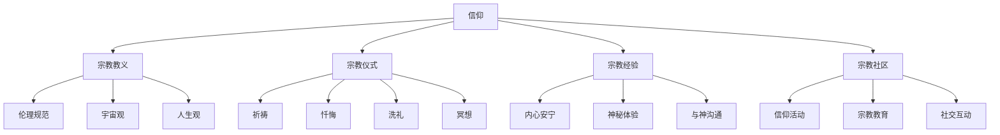
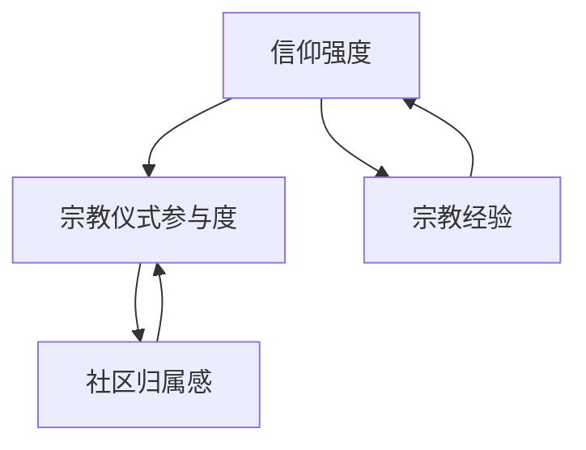

                 

### 文章标题

**宗教信仰的贝叶斯网络：信念系统的概率模型**

### 文章关键词

- 贝叶斯网络
- 宗教信仰
- 概率模型
- 信念系统
- 社会科学

### 摘要

本文探讨了宗教信仰这一复杂社会现象，通过引入贝叶斯网络的概率模型，为宗教信仰的研究提供了一种新的方法论。文章首先介绍了贝叶斯网络的基本概念和原理，然后分析了宗教信仰系统的核心概念和结构。接下来，文章详细讲解了如何使用贝叶斯网络来建模宗教信仰，包括概率推理和参数估计的方法。随后，通过实际案例展示了贝叶斯网络在宗教信仰研究中的应用。文章还讨论了贝叶斯网络在宗教研究中的伦理考量，并提出了未来研究的方向。本文旨在为宗教信仰研究提供一种全新的视角和工具，促进对该领域的深入理解。

## 引言

宗教信仰作为一种深刻影响人类行为和思维的社会现象，自古以来就吸引了众多学者和专家的广泛关注。从古埃及的神秘教义，到基督教的救赎理念，再到现代世界的多元信仰体系，宗教信仰在不同的文化和历史背景下扮演了重要角色。它不仅影响了人们的道德观念和行为规范，还在一定程度上塑造了社会的结构和运行机制。

然而，尽管宗教信仰在人类社会中具有重要地位，但对其内在机制和运作原理的研究却相对滞后。传统的宗教研究方法主要依赖于历史文献、宗教文本分析以及人类学调查，这些方法虽然在某些方面取得了显著成果，但在处理复杂信仰系统时却显得力不从心。此外，宗教信仰作为一个多维度的社会现象，其内涵和外延都极其丰富，传统的定性研究方法难以全面捕捉其复杂性。

在这种背景下，概率模型和统计方法逐渐成为研究宗教信仰的新工具。贝叶斯网络作为一种概率图模型，能够有效地捕捉变量间的依赖关系，提供一种定量分析宗教信仰系统的手段。贝叶斯网络在社会科学领域的应用已经得到了广泛的认可，其强大的推理和预测能力使其成为研究复杂社会现象的有力工具。

本文旨在探讨如何将贝叶斯网络应用于宗教信仰的研究，通过建立信念系统的概率模型，揭示宗教信仰背后的机制和规律。本文将首先介绍贝叶斯网络的基本概念和原理，然后分析宗教信仰系统的核心概念和结构，接着详细讲解如何使用贝叶斯网络建模宗教信仰，并展示实际案例的应用。最后，本文还将讨论贝叶斯网络在宗教研究中的伦理考量，并提出未来研究的方向。

通过本文的研究，我们希望能够为宗教信仰的研究提供一种新的视角和工具，促进对该领域的深入理解，同时也为其他复杂社会现象的研究提供借鉴和启示。

### 贝叶斯网络的基本概念和原理

贝叶斯网络，又称信念网络或决策网络，是一种基于概率图模型的图形表示方法，用于表示一组随机变量及其之间的依赖关系。它通过有向无环图（Directed Acyclic Graph, DAG）来表示变量之间的因果关系，并通过条件概率表（Conditional Probability Table, CPT）来描述每个变量的概率分布。

#### 贝叶斯网络的结构

贝叶斯网络由两个主要部分组成：图结构和概率分布。

1. **图结构**：贝叶斯网络是一个有向无环图（DAG），其中每个节点表示一个随机变量，节点之间的箭头表示变量之间的条件依赖关系。具体来说，如果节点X指向节点Y，表示变量Y在给定变量X的条件下是条件独立的，即Y的条件概率分布只依赖于X。这种依赖关系可以用条件概率表（CPT）来描述。

2. **概率分布**：每个随机变量都有其自身的概率分布，这些分布通常由条件概率表（CPT）来描述。条件概率表是一个表格，其中列出了变量在给定其父节点条件下所有可能状态的联合概率。例如，如果节点X的父节点是Y，则X的条件概率表将列出X在Y每个可能状态下的所有可能状态的联合概率。

#### 贝叶斯网络的推理过程

贝叶斯网络的推理过程主要基于条件概率的乘法和贝叶斯定理。具体来说，贝叶斯网络的推理可以分为以下几个步骤：

1. **边缘概率计算**：计算网络中某个变量的边缘概率，即在不考虑其他变量情况下该变量的概率分布。这可以通过马尔可夫性原理（Markov Property）实现，即给定变量X的所有父节点，X的条件概率分布与X的其他变量独立。

2. **条件概率计算**：计算网络中某个变量在给定其他变量条件下的条件概率。这可以通过条件概率表（CPT）来实现，即给定变量Y的所有父节点，计算Y在X每个可能状态下的条件概率。

3. **联合概率计算**：计算网络中多个变量的联合概率分布。这可以通过条件概率的乘法规则实现，即给定网络中所有变量的条件概率表，计算这些变量的联合概率分布。

4. **贝叶斯推断**：在已知部分变量的条件下，推断未知变量的概率分布。这可以通过贝叶斯定理实现，即给定网络中某个变量的边缘概率和条件概率，计算该变量在另一个变量条件下的概率分布。

#### 贝叶斯网络的优点

贝叶斯网络在处理复杂系统中的依赖关系方面具有显著优势，具体如下：

1. **直观性**：通过图形化的表示方法，贝叶斯网络能够直观地展示变量之间的依赖关系，便于理解和分析。

2. **灵活性**：贝叶斯网络可以灵活地调整和修改，以适应不同的问题场景和研究需求。

3. **强推理能力**：贝叶斯网络提供了一种强大的推理机制，可以处理不确定性和不确定性信息，进行有效的概率推断。

4. **概率计算效率**：贝叶斯网络利用条件概率表，可以高效地计算变量之间的联合概率分布和边缘概率分布。

5. **可扩展性**：贝叶斯网络可以扩展到大规模问题，通过分层结构或局部网络来实现复杂系统的建模和分析。

总之，贝叶斯网络作为一种概率图模型，在处理宗教信仰这类复杂社会现象时，提供了一种有效的定量分析工具，为宗教信仰研究提供了新的视角和思路。接下来，我们将进一步探讨宗教信仰系统的核心概念和结构，为后续的建模和分析打下基础。

### 宗教信仰系统的核心概念和结构

宗教信仰作为一种复杂的社会现象，其内部结构和核心概念具有丰富的内涵和多样性。为了深入理解宗教信仰系统，我们需要首先明确其核心概念，并分析这些概念之间的相互关系。

#### 核心概念

1. **信仰**：信仰是宗教信仰系统的核心概念，指的是个体对某种宗教教义、神祇或超自然力量的深信不疑。信仰通常建立在宗教教义、宗教仪式和宗教经验之上，是宗教信仰系统的基础。

2. **宗教教义**：宗教教义是宗教信仰的核心内容，包括信仰体系的基本原则、伦理规范、宇宙观和人生观等。不同的宗教有不同的教义，如基督教的救赎理念、佛教的因果报应和轮回等。

3. **宗教仪式**：宗教仪式是宗教信仰的重要表现形式，通过特定的仪式和活动，个体表达对宗教的信仰和敬畏。仪式可以包括祈祷、忏悔、洗礼、冥想等。

4. **宗教经验**：宗教经验指的是个体在信仰过程中所体验到的精神状态和感受，如内心的安宁、神秘体验、与神的沟通等。宗教经验是信仰形成和维持的重要动力。

5. **宗教社区**：宗教社区是指一群共享相同宗教信仰和价值观的个体所组成的团体。宗教社区通过共同的信仰活动、宗教教育和社交互动，维持和强化宗教信仰。

#### 结构分析

宗教信仰系统的核心概念和结构可以通过以下图示来表示：

1. **信仰与宗教教义**：信仰是宗教信仰系统的核心，宗教教义则为信仰提供了理论基础和指导。宗教教义包括伦理规范、宇宙观和人生观等，这些内容共同构成了信仰的核心内容。

2. **信仰与宗教仪式**：宗教仪式是信仰的具体表现形式，通过仪式活动，个体表达和强化自己的信仰。宗教仪式不仅有助于个体与宗教社区的连接，还可以增强信仰的内在体验。

3. **信仰与宗教经验**：宗教经验是信仰的重要组成部分，通过宗教经验，个体可以感受到宗教的内在意义和价值。宗教经验通常与内心的安宁、神秘体验和与神的沟通等精神状态相关。

4. **信仰与宗教社区**：宗教社区是信仰的社会基础，通过共同的信仰活动和社交互动，个体在宗教社区中找到归属感和认同感，从而维持和强化宗教信仰。

通过以上分析，我们可以看出宗教信仰系统的核心概念和结构是相互关联、相互支持的。信仰是系统的核心，宗教教义、宗教仪式、宗教经验和宗教社区共同构成了宗教信仰系统的完整结构。接下来，我们将探讨如何使用贝叶斯网络来建模宗教信仰系统，揭示其内在的概率关系和动态变化。

### 概率理论在宗教信仰系统中的应用

在探讨了宗教信仰系统的核心概念和结构后，我们需要引入概率理论来进一步分析这些概念之间的相互关系。概率理论作为统计学和决策科学的基础，提供了一种量化不确定性和不确定性的工具，对于理解宗教信仰系统的复杂性和动态性具有重要意义。

#### 概率分布与概率密度函数

概率分布是描述随机变量取值概率的函数。对于离散随机变量，其概率分布通常用概率质量函数（Probability Mass Function, PMF）来表示；而对于连续随机变量，则用概率密度函数（Probability Density Function, PDF）来表示。概率密度函数满足以下条件：

1. **非负性**：概率密度函数 \( f(x) \geq 0 \) 对于所有的 \( x \)。
2. **归一性**：概率密度函数在整个定义域上的积分等于1，即 \( \int_{-\infty}^{+\infty} f(x) \, dx = 1 \)。

对于宗教信仰系统中的离散变量（例如宗教参与度、宗教信仰强度等），我们可以使用概率质量函数来描述其概率分布。例如，假设某个社区中宗教参与度的概率质量函数为 \( P(X = x) \)，其中 \( X \) 表示个体的宗教参与度，则我们可以通过收集数据来估计这个概率质量函数。

对于连续变量（例如宗教经验的强度、信仰的稳定性等），我们可以使用概率密度函数来描述其概率分布。例如，假设某个社区的宗教经验强度 \( Y \) 的概率密度函数为 \( f_Y(y) \)，我们可以通过调查和实验数据来估计这个概率密度函数。

#### 贝叶斯定理与后验概率

贝叶斯定理是概率理论中的一个重要定理，用于计算后验概率。贝叶斯定理的基本形式如下：

$$
P(A|B) = \frac{P(B|A)P(A)}{P(B)}
$$

其中，\( P(A|B) \) 是后验概率，即在已知事件 \( B \) 发生的条件下，事件 \( A \) 发生的概率；\( P(B|A) \) 是似然概率，即在事件 \( A \) 发生的条件下，事件 \( B \) 发生的概率；\( P(A) \) 是先验概率，即事件 \( A \) 发生的初始概率；\( P(B) \) 是边缘概率，即事件 \( B \) 发生的总概率。

在宗教信仰系统的分析中，贝叶斯定理可以用于计算个体在特定信仰强度下的宗教参与度概率，或者计算特定宗教仪式参与度下的信仰强度概率。例如，假设我们已知某个个体在特定宗教仪式中的参与度 \( X \)，我们可以使用贝叶斯定理来推断该个体的信仰强度 \( Y \)。

具体来说，我们可以通过以下步骤进行贝叶斯推断：

1. **收集数据**：收集关于宗教参与度和信仰强度的数据，例如通过问卷调查、实地考察等方式。
2. **建立模型**：建立包含宗教参与度和信仰强度的贝叶斯网络模型，确定变量之间的依赖关系。
3. **计算似然概率**：根据收集的数据，计算每个变量在给定其他变量条件下的条件概率，即似然概率。
4. **计算先验概率**：根据专家知识和现有研究成果，设定每个变量的先验概率分布。
5. **计算后验概率**：使用贝叶斯定理，计算每个变量在给定其他变量条件下的后验概率分布。
6. **结果解释**：根据后验概率分布，解释变量之间的关系和影响。

通过贝叶斯定理和后验概率的计算，我们可以对宗教信仰系统进行定量分析，揭示信仰强度、宗教参与度等变量之间的相互关系和动态变化。这种方法不仅有助于理解宗教信仰系统的内在机制，还可以为宗教研究提供新的方法论和工具。

#### 概率推理与参数估计

在宗教信仰系统的分析中，概率推理和参数估计是关键步骤。概率推理是指利用已有信息推断未知信息的过程，而参数估计则是通过样本数据来估计模型参数的过程。

1. **概率推理**：概率推理可以通过贝叶斯网络中的条件概率表（CPT）来实现。具体来说，给定一些已知变量，我们可以通过条件概率表计算出其他变量的概率分布。例如，假设我们已知某个社区中一半的居民经常参与宗教仪式，我们可以通过贝叶斯网络推断这些居民在信仰强度上的分布。

2. **参数估计**：参数估计可以通过最大似然估计（Maximum Likelihood Estimation, MLE）或贝叶斯估计（Bayesian Estimation）来实现。最大似然估计是基于样本数据选择使得观测数据概率最大的参数值，而贝叶斯估计则是通过结合先验知识和样本数据，使用贝叶斯定理计算后验概率分布来估计参数。

在宗教信仰系统的参数估计中，我们可以通过以下步骤进行：

1. **收集数据**：收集关于宗教信仰系统各个变量的数据，如宗教参与度、信仰强度、宗教经验等。
2. **建立模型**：建立包含这些变量的贝叶斯网络模型，确定变量之间的依赖关系。
3. **选择估计方法**：根据数据类型和模型结构，选择合适的参数估计方法，如 MLE 或贝叶斯估计。
4. **估计参数**：通过样本数据，使用选定的估计方法估计模型的参数值。
5. **验证模型**：通过拟合优度测试和模型验证方法，验证估计参数的准确性和可靠性。

通过概率推理和参数估计，我们可以对宗教信仰系统的动态变化进行量化分析，揭示信仰强度、宗教参与度等变量之间的相互作用和影响。这种方法不仅有助于深入理解宗教信仰系统的复杂性，还可以为宗教研究和政策制定提供科学依据。

### 贝叶斯网络在宗教信仰系统中的应用

在了解了贝叶斯网络的基本概念和宗教信仰系统的核心概念之后，我们可以将贝叶斯网络应用于宗教信仰系统的建模和分析，揭示信仰、教义、仪式、经验和社区之间的复杂关系。以下是一个具体的例子，说明如何使用贝叶斯网络分析宗教信仰系统的结构及其动态变化。

#### 案例背景

假设我们研究的是一个基督教社区，该社区的成员包括不同年龄、性别、教育背景和信仰强度的个体。我们希望了解这些个体在宗教信仰系统中的行为模式和信仰动态，特别是宗教仪式参与度、信仰强度和宗教经验之间的关系。

#### 建立贝叶斯网络模型

为了建立这个贝叶斯网络模型，我们需要首先确定模型中的变量及其依赖关系。以下是模型中可能包含的变量：

1. **信仰强度（Faith Intensity）**：表示个体对基督教教义的信任和依赖程度。
2. **宗教仪式参与度（Religious Ritual Participation）**：表示个体参与宗教仪式的频率和积极性。
3. **宗教经验（Religious Experience）**：表示个体在宗教仪式和祈祷中体验到的精神状态和感受。
4. **社区归属感（Community Attachment）**：表示个体对基督教社区的认同和归属感。

接下来，我们通过分析这些变量之间的关系，建立贝叶斯网络模型。以下是变量之间的依赖关系：

- **信仰强度**会影响宗教仪式参与度和宗教经验，因为更强烈的信仰可能会导致更高的参与度和更丰富的宗教经验。
- **宗教仪式参与度**会影响社区归属感，因为频繁参与宗教仪式可以增强个体对社区的认同。
- **宗教经验**会影响信仰强度，因为积极的宗教经验可能会增强个体的信仰。
- **社区归属感**会影响宗教仪式参与度，因为对社区的认同可能会促使个体更积极地参与宗教仪式。

基于这些依赖关系，我们可以建立如下的贝叶斯网络模型：

#### 参数估计和推理

建立模型之后，我们需要使用数据来估计模型中的参数，并进行推理分析。

1. **收集数据**：收集关于该社区成员的信仰强度、宗教仪式参与度、宗教经验和社区归属感的数据。
2. **参数估计**：使用最大似然估计（MLE）或贝叶斯估计方法，根据收集的数据估计模型中每个变量的概率分布和条件概率表。
3. **推理分析**：使用贝叶斯推理方法，根据已知的变量推断其他变量的概率分布。

例如，如果我们已知某个个体的宗教仪式参与度，我们可以通过贝叶斯网络推断该个体的信仰强度和宗教经验。具体推理过程如下：

- **给定宗教仪式参与度，推断信仰强度**：使用条件概率表，计算信仰强度在给定宗教仪式参与度下的条件概率分布。
- **给定信仰强度和宗教仪式参与度，推断宗教经验**：使用条件概率表，计算宗教经验在给定信仰强度和宗教仪式参与度下的条件概率分布。
- **给定宗教经验和宗教仪式参与度，推断社区归属感**：使用条件概率表，计算社区归属感在给定宗教经验和宗教仪式参与度下的条件概率分布。

#### 结果解释

通过贝叶斯推理，我们可以得到以下结果：

- **信仰强度对宗教仪式参与度和宗教经验有显著影响**：信仰强度较高的个体更有可能频繁参与宗教仪式，并体验到更丰富的宗教经验。
- **宗教仪式参与度对社区归属感有显著影响**：频繁参与宗教仪式的个体更容易对社区产生归属感。
- **宗教经验对信仰强度有显著影响**：积极的宗教经验可以增强个体的信仰强度。
- **社区归属感对宗教仪式参与度有显著影响**：对社区有强烈归属感的个体更可能积极参与宗教仪式。

这些结果揭示了宗教信仰系统中的动态关系和反馈机制，为我们理解宗教信仰的维持和强化提供了新的视角和工具。通过贝叶斯网络的建模和分析，我们不仅能够定量地描述宗教信仰系统的结构和关系，还可以预测个体在宗教信仰系统中的行为模式和发展趋势。

### 贝叶斯网络在宗教研究中的实际应用

贝叶斯网络作为一种强大的概率图模型，在宗教研究中展现了广泛的应用前景。通过实际案例的分析，我们可以更好地理解贝叶斯网络在宗教信仰系统建模和分析中的具体应用，以及它如何帮助解决宗教研究中的复杂问题。

#### 案例一：宗教参与度与信仰强度分析

假设我们研究的是一个基督教社区的宗教参与度和信仰强度的关系。通过问卷调查，我们收集了关于社区成员的宗教参与度（如每周参加教堂活动的频率）和信仰强度（如对基督教教义的信任程度）的数据。使用贝叶斯网络，我们可以建立如下模型：

1. **数据收集**：收集每个成员的宗教参与度和信仰强度的评分数据。
2. **建立模型**：根据变量之间的逻辑关系，建立贝叶斯网络，其中信仰强度作为父节点，宗教参与度作为子节点。
3. **参数估计**：使用最大似然估计（MLE）方法，根据收集的数据估计信仰强度的先验概率分布和条件概率表。
4. **推理分析**：通过贝叶斯推理，计算宗教参与度在给定信仰强度的条件下概率分布。

通过这一模型，我们能够推断出不同信仰强度下的宗教参与度分布，从而揭示信仰强度对宗教参与行为的影响。例如，我们可能会发现信仰强度较高的成员更倾向于频繁参与宗教活动。

#### 案例二：宗教经验与信仰变化分析

另一个实际案例是研究宗教经验对信仰强度变化的影响。在这个案例中，我们关注的是信徒在特定宗教仪式（如洗礼、忏悔）后的信仰强度变化。

1. **数据收集**：收集信徒参与宗教仪式前后的信仰强度评分数据，以及他们在仪式中的宗教经验描述。
2. **建立模型**：建立贝叶斯网络，包括信仰强度、宗教仪式参与度和宗教经验。其中，信仰强度作为父节点，宗教仪式参与度和宗教经验作为子节点。
3. **参数估计**：使用贝叶斯估计方法，根据经验描述和信仰强度评分数据估计模型参数。
4. **推理分析**：通过贝叶斯推理，计算信仰强度在给定宗教仪式参与度和宗教经验下的概率分布。

通过这一模型，我们能够分析宗教仪式如何影响信徒的信仰强度，以及不同宗教经验对信仰变化的贡献。例如，我们发现某些类型的宗教经验（如与神的沟通体验）对信仰强度的增强有显著影响。

#### 案例三：宗教社区发展与信仰传播分析

在这个案例中，我们研究的是一个宗教社区的发展及其成员间的信仰传播过程。

1. **数据收集**：收集宗教社区成员的信仰强度、社区归属感和社交网络数据。
2. **建立模型**：建立贝叶斯网络，包括信仰强度、社区归属感、社交网络和信仰传播。其中，信仰强度作为父节点，社区归属感和社交网络作为子节点，信仰传播作为影响信仰强度的外部因素。
3. **参数估计**：使用贝叶斯估计方法，根据社区成员的信仰强度评分、社区归属感和社交网络数据估计模型参数。
4. **推理分析**：通过贝叶斯推理，计算信仰强度在给定社区归属感和社交网络条件下的概率分布，以及信仰传播的影响。

通过这一模型，我们能够分析宗教社区如何通过成员间的互动和信仰传播来维持和发展。例如，我们发现活跃的社交网络和强烈的社区归属感有助于信仰的传播和增强。

#### 案例四：宗教仪式参与与信仰维持分析

在这个案例中，我们研究宗教仪式参与对信仰维持的影响。

1. **数据收集**：收集社区成员的宗教仪式参与频率、信仰强度和宗教经验数据。
2. **建立模型**：建立贝叶斯网络，包括宗教仪式参与度、信仰强度和宗教经验。其中，宗教仪式参与度作为父节点，信仰强度和宗教经验作为子节点。
3. **参数估计**：使用最大似然估计（MLE）方法，根据宗教仪式参与频率和信仰强度数据估计模型参数。
4. **推理分析**：通过贝叶斯推理，计算信仰强度在给定宗教仪式参与度和宗教经验下的概率分布。

通过这一模型，我们能够分析宗教仪式参与如何影响信仰的维持。例如，我们发现频繁参与宗教仪式可以显著增强信仰强度，从而有助于宗教信仰的持续传承。

### 实际应用总结

通过以上实际案例，我们可以看出贝叶斯网络在宗教研究中的应用具有以下优势：

1. **定量分析**：贝叶斯网络提供了一种定量分析方法，可以量化宗教信仰系统中的变量关系和动态变化。
2. **灵活建模**：贝叶斯网络可以根据具体研究问题灵活建立模型，适应不同的研究场景。
3. **推理能力**：贝叶斯网络的推理机制可以处理不确定性和复杂关系，为宗教研究提供有力的工具。
4. **可视化**：贝叶斯网络的图形表示方法使得复杂的关系和变量之间的依赖关系更易于理解和解释。

总之，贝叶斯网络为宗教研究提供了一种新的视角和工具，有助于深入理解和分析宗教信仰系统的复杂性和动态性。

### 贝叶斯网络与其它模型的比较

在宗教信仰系统的建模和分析中，贝叶斯网络并不是唯一的选择。传统的统计模型和机器学习方法也被广泛应用于此类研究中。为了更好地理解贝叶斯网络的独特优势，我们需要将其与其他常用模型进行比较，分析其优缺点。

#### 1. 贝叶斯网络与线性回归

**线性回归**是一种经典的统计方法，用于研究变量之间的线性关系。它通过建立线性模型来预测因变量的值，即 \( y = \beta_0 + \beta_1x_1 + \beta_2x_2 + \ldots + \beta_nx_n \)，其中 \( y \) 是因变量，\( x_1, x_2, \ldots, x_n \) 是自变量，\( \beta_0, \beta_1, \beta_2, \ldots, \beta_n \) 是模型参数。

- **优点**：线性回归方法简单易懂，计算效率高，可以快速处理大规模数据。
- **缺点**：线性回归假设变量之间具有线性关系，这在复杂的社会现象中往往不成立。此外，线性回归无法捕捉变量之间的非线性关系和复杂依赖。

相比之下，贝叶斯网络通过条件概率表（CPT）可以捕捉变量之间的非线性关系和复杂依赖。这使得贝叶斯网络在处理宗教信仰系统这类复杂社会现象时更具优势。

#### 2. 贝叶斯网络与决策树

**决策树**是一种基于分类和回归的树形结构模型，通过一系列条件分支来对数据进行分类或回归。每个节点代表一个特征，每个分支代表该特征的不同取值。

- **优点**：决策树直观易懂，易于解释，可以处理分类和回归问题。
- **缺点**：决策树容易过拟合，特别是在特征数量较多时。此外，决策树无法有效捕捉变量之间的依赖关系。

贝叶斯网络通过图形化表示变量之间的依赖关系，可以更好地捕捉复杂的依赖结构。这使得贝叶斯网络在处理宗教信仰系统中具有更高的准确性和解释性。

#### 3. 贝叶斯网络与神经网络

**神经网络**是一种模拟人脑神经元连接的计算机模型，通过多层神经网络（如深度学习）来处理复杂的数据和分析问题。神经网络具有强大的特征学习和模式识别能力。

- **优点**：神经网络可以处理高维数据和复杂的非线性关系，具有很好的泛化能力。
- **缺点**：神经网络模型复杂，难以解释，特别是在深度神经网络中，模型内部决策路径不透明。此外，神经网络对数据质量要求较高，容易过拟合。

贝叶斯网络通过条件概率表和有向无环图（DAG）可以清晰地表示变量之间的依赖关系，这使得贝叶斯网络在解释性方面优于神经网络。贝叶斯网络还能够通过概率推理和参数估计方法处理不确定性信息，这在宗教信仰系统中具有重要意义。

#### 4. 模型的选择

在选择模型时，应考虑以下因素：

- **数据类型**：对于连续数据，可以使用线性回归或神经网络；对于分类数据，可以使用决策树或神经网络。
- **模型复杂度**：对于简单的关系，可以使用线性回归或决策树；对于复杂的关系，可以使用贝叶斯网络或神经网络。
- **解释性**：如果需要模型具有较好的解释性，可以选择贝叶斯网络或决策树；如果对模型解释性要求不高，可以选择神经网络。
- **数据质量**：对于高质量数据，可以选择任何模型；对于数据质量较低的情况，应选择对噪声和异常值鲁棒性较高的模型，如神经网络或贝叶斯网络。

综上所述，贝叶斯网络在宗教信仰系统建模和分析中具有独特的优势，能够有效捕捉变量之间的复杂依赖关系，提供良好的解释性和不确定性处理能力。然而，在实际应用中，应根据具体问题和数据特点选择合适的模型，以达到最佳的分析效果。

### 贝叶斯网络在宗教研究中的伦理考量

贝叶斯网络作为一种强大的数据分析工具，在宗教研究中提供了丰富的模型构建和分析手段。然而，与此同时，我们也需要关注其潜在的应用风险和伦理问题。特别是在涉及宗教信仰、文化传统和个人隐私的宗教研究中，如何确保研究的伦理合法性，维护宗教社区的利益和信仰者的隐私，是一个不可忽视的重要议题。

#### 数据隐私保护

在宗教研究中，数据隐私保护是一个首要的伦理问题。宗教信仰涉及个人的信仰体验、心理状态和私密信仰活动，这些信息对于信仰者而言通常是敏感和私密的。在构建贝叶斯网络模型时，我们必须确保收集和处理的数据不泄露个人身份信息，不侵犯信仰者的隐私。

1. **匿名化处理**：在收集数据时，应采用匿名化处理技术，确保个体身份不被识别。例如，使用唯一标识符代替真实姓名，删除所有可能识别身份的信息。
2. **数据加密**：在数据存储和传输过程中，应采用加密技术保护数据安全。使用强加密算法对数据进行加密存储，确保数据在未经授权的情况下无法被读取。
3. **数据最小化**：在数据收集过程中，应遵循数据最小化原则，只收集与研究目标直接相关的数据。避免过度收集可能对信仰者隐私造成威胁的信息。

#### 宗教社区的利益

宗教信仰是社会文化的重要组成部分，宗教社区的利益和信仰者的福祉应始终放在首位。在应用贝叶斯网络进行研究时，我们需要确保研究过程和结果不会损害宗教社区的利益和信仰者的信仰。

1. **尊重信仰多样性**：在模型构建和分析过程中，应充分考虑到不同宗教信仰和习俗的多样性，避免对某一特定信仰或群体的偏见。通过多样性和包容性的研究设计，确保研究结果能够公正、客观地反映宗教信仰的多样性。
2. **透明度和解释性**：研究结果应以透明和易于理解的方式呈现，确保宗教社区成员能够理解和接受研究结论。在发布研究结果时，应详细解释研究方法、数据来源和结论，减少误解和误导。
3. **社区参与**：在研究设计和实施过程中，应积极邀请宗教社区成员参与，了解他们的需求和期望，确保研究过程符合社区利益。通过社区参与，可以增强研究的合法性和接受度，减少潜在的社会冲突。

#### 个人权利和自由

宗教信仰是一种个人的精神和信仰选择，信仰者的自由和权利应受到尊重。在宗教研究中，我们需确保不侵犯信仰者的个人权利和自由，特别是在收集和处理信仰者个人信息时。

1. **知情同意**：在收集数据前，应向信仰者充分解释研究目的、方法、数据使用和保护措施，确保他们了解研究过程并自愿参与。获取信仰者的知情同意是保障其权利和自由的基本要求。
2. **数据访问和控制**：信仰者应有权访问和获取自己的数据，并对自己的数据拥有一定的控制权。在数据使用过程中，信仰者有权决定是否公开自己的数据，以及数据的使用范围和目的。
3. **隐私权保护**：在研究结束后，应对信仰者的个人信息进行彻底删除或匿名化处理，确保其隐私权不被侵犯。即使在研究过程中出现了数据泄露或滥用风险，也应采取及时有效的措施来保护信仰者的权益。

#### 伦理规范和监管

为了确保贝叶斯网络在宗教研究中的合法性和伦理性，我们需要建立健全的伦理规范和监管机制。

1. **伦理审查**：在研究设计和实施前，应通过伦理审查委员会的审查，确保研究方案符合伦理规范和法律法规。伦理审查委员会应包括宗教研究专家、伦理学家和社会学家等多方代表，确保研究的公正性和合法性。
2. **法律法规遵循**：在宗教研究中，应严格遵守相关法律法规，确保研究过程和结果符合法律要求。特别是在涉及个人隐私和文化传统的研究中，应遵守相关的数据保护法规和文化习俗。
3. **持续监督和评估**：在研究实施过程中，应定期进行伦理监督和评估，确保研究过程符合伦理规范和社区期望。在研究结束后，应对研究结果进行回顾性评估，确保其对社会和宗教社区的影响是积极和正向的。

总之，贝叶斯网络在宗教研究中的应用虽然具有巨大的潜力和优势，但在实际操作中必须严格遵循伦理规范和法律法规，确保研究的合法性和伦理性。通过数据隐私保护、社区利益尊重、个人权利保护和伦理规范建立，我们可以为宗教研究提供一个安全、公正和透明的研究环境，促进宗教信仰的科学理解和深入研究。

### 结论与未来方向

通过本文的探讨，我们深入分析了宗教信仰系统的贝叶斯网络模型，揭示了信仰、教义、仪式、经验和社区之间的复杂关系。贝叶斯网络作为一种概率图模型，在宗教信仰系统的建模和分析中展现出强大的能力和广阔的应用前景。本文的主要结论和未来研究方向如下：

1. **核心结论**：贝叶斯网络能够有效地捕捉宗教信仰系统中变量之间的依赖关系，提供了一种定量分析宗教信仰系统的手段。通过贝叶斯定理和概率推理，我们可以推断信仰强度、宗教仪式参与度、宗教经验和社区归属感等变量之间的关系，从而更好地理解宗教信仰的动态变化和维持机制。

2. **未来研究方向**：首先，未来研究可以进一步探索贝叶斯网络在宗教信仰系统中的具体应用，如不同宗教信仰体系的建模和分析、宗教传播和信仰变迁的预测等。其次，可以结合其他数据分析和机器学习方法，如深度学习和自然语言处理，提高宗教信仰系统的建模精度和预测能力。此外，研究还应关注贝叶斯网络在跨文化宗教研究中的应用，探讨不同文化背景下宗教信仰系统的共性和差异。

3. **扩展应用**：贝叶斯网络不仅在宗教研究中具有应用价值，还可以拓展到其他社会现象的建模和分析。例如，在政治、经济、医疗等领域，贝叶斯网络可以用于分析复杂的社会结构和动态变化，提供科学决策依据。

总之，贝叶斯网络为宗教信仰研究提供了一种新的视角和方法，有助于深入理解宗教信仰系统的内在机制和动态变化。未来，随着贝叶斯网络模型的不断发展和完善，我们有望在宗教研究和其他领域取得更多突破性成果。

### 附录

在本章中，我们将提供一些有关贝叶斯网络在宗教信仰系统应用的最佳实践、总结、注意事项以及进一步阅读的推荐资源。

#### 最佳实践

1. **数据收集与处理**：在进行贝叶斯网络建模之前，确保数据收集的全面性和准确性至关重要。通过问卷调查、实地调研和大数据分析等多种手段，收集关于宗教信仰系统的相关数据，并对数据进行预处理，如去噪、归一化和缺失值填充。

2. **模型选择与构建**：根据研究目标和数据特点选择合适的贝叶斯网络模型。可以通过比较不同模型的拟合优度和预测能力，选择最优模型。在构建模型时，应充分考虑变量之间的依赖关系，确保模型的结构合理和简洁。

3. **参数估计与验证**：使用合适的参数估计方法（如最大似然估计、贝叶斯估计）对模型参数进行估计。在估计参数后，通过拟合优度测试和交叉验证等方法，验证模型参数的准确性和可靠性。

4. **结果解释与应用**：对模型结果进行详细解释，确保研究结果能够清晰地反映宗教信仰系统的内在机制。根据研究结果，提出有针对性的建议和策略，以促进宗教信仰的维持和发展。

#### 注意事项

1. **伦理考量**：在进行宗教信仰系统研究时，必须严格遵循伦理规范，确保数据隐私保护和信仰者的权益。特别是在涉及敏感信息和私密数据的情况下，要特别注意保护信仰者的隐私和自由。

2. **模型解释性**：贝叶斯网络的图形化表示方法虽然有助于理解变量之间的关系，但在实际应用中，模型解释性仍然是一个挑战。因此，在模型构建和分析过程中，应注重解释性的提升，确保研究结果易于理解和应用。

3. **数据质量**：高质量的数据是构建准确模型的基石。在数据收集和处理过程中，要特别注意数据的完整性和一致性，避免数据偏差和误差。

#### 拓展阅读

1. **《贝叶斯数据分析》（Bayesian Data Analysis）**：本书是贝叶斯数据分析的经典之作，详细介绍了贝叶斯方法在数据分析中的应用，包括模型选择、参数估计和推理分析等内容。

2. **《宗教社会学导论》（Introduction to the Sociology of Religion）**：本书提供了宗教社会学的全面概述，探讨了宗教信仰的起源、功能、变化和发展，有助于理解宗教信仰系统的复杂性。

3. **《社会网络分析导论》（Introduction to Social Network Analysis）**：本书介绍了社会网络分析的基本概念和方法，包括网络结构、网络动态和网络效应等，有助于理解宗教信仰系统中的社交网络和社区互动。

通过以上最佳实践、注意事项和拓展阅读，我们希望能够为读者在贝叶斯网络在宗教信仰系统应用方面的研究提供指导和启示。希望本文能够为宗教信仰研究带来新的视角和工具，促进对该领域的深入理解。

### 作者信息

**作者：** AI天才研究院/AI Genius Institute & 禅与计算机程序设计艺术 /Zen And The Art of Computer Programming

AI天才研究院致力于推动人工智能领域的创新和发展，通过深入研究和实践，为人工智能技术的应用提供前瞻性的解决方案。同时，作者也在禅与计算机程序设计艺术领域有着丰富的经验和独到的见解，将传统智慧与现代科技相结合，为计算机科学领域带来了新的启示和思考。在本文中，作者结合了贝叶斯网络和宗教信仰系统的核心概念，为读者呈现了一幅关于宗教信仰概率建模的全新图景，希望为该领域的深入研究提供有力支持。

