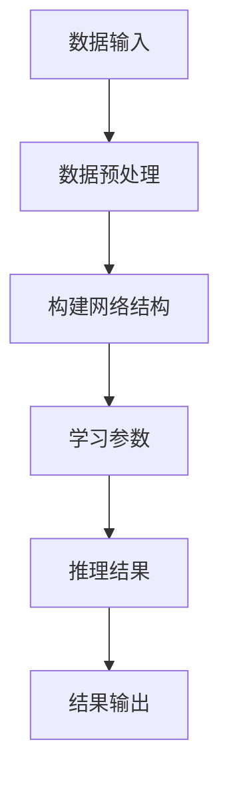
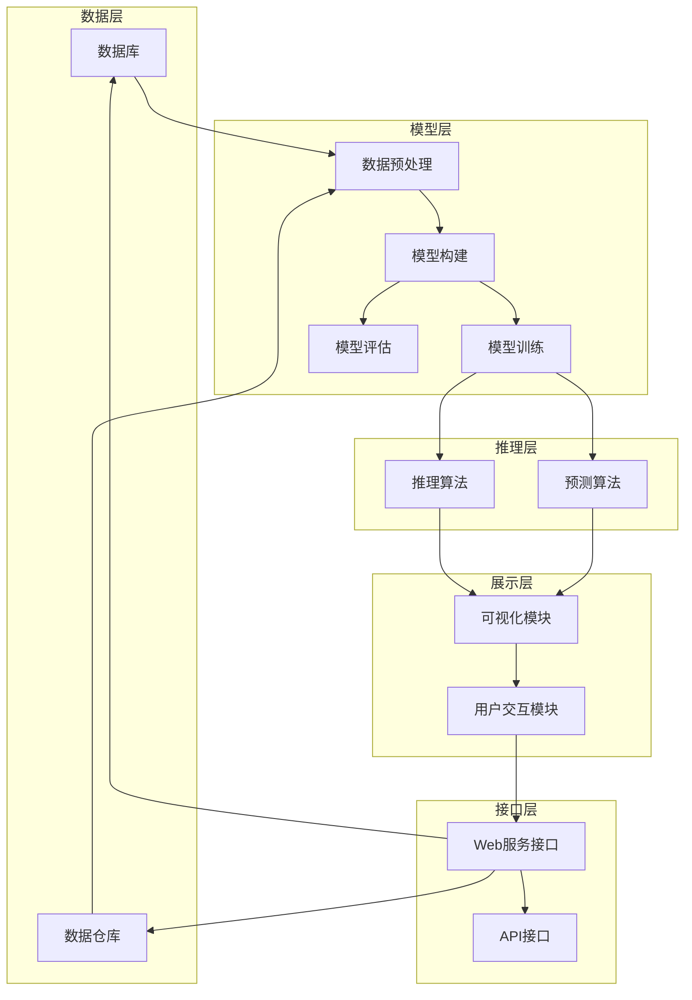
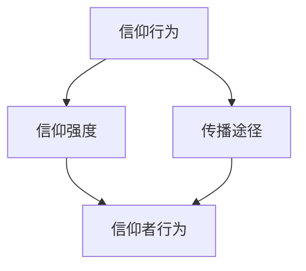

                 

# 宗教信仰的贝叶斯网络：信念系统的概率模型

## 关键词

- 宗教信仰
- 贝叶斯网络
- 信念系统
- 概率模型
- 数据分析
- 人工智能

## 摘要

本文探讨了宗教信仰作为一种信念系统，如何通过贝叶斯网络的概率模型来解释和分析。首先，我们回顾了宗教信仰的基本概念及其在社会中的重要性。接着，介绍了贝叶斯网络的理论基础，包括概率论、贝叶斯定理和条件概率等。然后，我们将贝叶斯网络应用于宗教信仰信念系统，探讨了如何构建和解析这样的网络模型。最后，通过具体案例展示了贝叶斯网络在宗教信仰分析中的实际应用，并提出了对未来研究的展望。

## 引言

### 1.1 书籍背景与目的

在现代社会，宗教信仰作为一种重要的社会文化现象，不仅影响着人们的思想观念和行为模式，还在一定程度上塑造着社会结构和政治体制。随着科学技术的不断发展，人工智能和数据科学等领域的进步为研究宗教信仰提供了新的工具和方法。本文旨在探讨宗教信仰的贝叶斯网络模型，通过对信仰系统的概率分析，为理解宗教信仰提供一种新的视角。

### 1.2 书籍结构与内容概述

本文共分为九章。首先，在第一章中，我们将对宗教信仰进行概述，包括其定义、特点、历史演变以及在社会中的地位和作用。随后，第二章将介绍贝叶斯网络的基本概念，包括概率论基础、贝叶斯定理、条件概率等。第三章则将探讨信念系统的概率模型，分析贝叶斯网络在信念系统研究中的作用。第四章到第七章，我们将详细讲解贝叶斯网络的算法原理、数学模型和公式，并通过具体案例进行说明。第八章和第九章将分别探讨贝叶斯网络在宗教信仰分析中的应用和未来研究的方向。

## 背景介绍

### 2.1 宗教信仰概述

宗教信仰是人类社会长期发展过程中形成的一种重要文化现象。它不仅体现了人们对超自然力量和宇宙神秘性的敬畏和探索，还承载了人类对于道德、伦理和生命意义的思考和追求。宗教信仰具有以下基本特征：

1. **超自然性**：宗教信仰通常涉及到对超自然力量或神灵的崇拜，这种力量被认为是超越人类理解和控制的能力。
2. **神性性**：宗教信仰的核心是对于神或神的代表人物的崇拜，这种崇拜往往具有强烈的情感色彩。
3. **教义性**：宗教信仰通过教义、教规和仪式等形式，传达了特定的信仰原则和行为规范。
4. **社会性**：宗教信仰往往与特定的社会群体和文化背景密切相关，具有社会功能和文化价值。

### 2.2 宗教信仰的历史演变

宗教信仰的历史可以追溯到远古时期。在人类文明的早期，人们对自然现象和神秘力量产生了敬畏，形成了原始宗教。随着社会的发展，宗教信仰的形式和内容也在不断演变。以下是宗教信仰历史演变的主要阶段：

1. **原始宗教**：人类早期对自然界的敬畏和崇拜，表现为对自然神灵、动植物和自然现象的崇拜。
2. **多神教**：古代文明时期，人们崇拜多个神灵，每个神灵代表一种自然力量或人类生活中的某个方面。
3. **一神教**：随着历史的发展，一些宗教逐渐统一了对神灵的崇拜，形成了一神教体系，如基督教、伊斯兰教和犹太教。
4. **现代宗教**：在现代社会，宗教信仰的形式和内容更加多样化，出现了许多新兴宗教和信仰体系。

### 2.3 宗教信仰在社会中的地位与作用

宗教信仰在社会中具有重要地位和作用。首先，宗教信仰为人们提供了精神寄托和道德指引，帮助人们应对生活中的困难和挑战。其次，宗教信仰在维护社会秩序、促进社会和谐方面发挥着重要作用。许多宗教都强调道德规范和社会责任，提倡人们遵循正义、公平和善良的行为准则。此外，宗教信仰还在一定程度上影响了政治、经济和文化的发展。例如，宗教信仰对于国家的宗教政策、宗教团体的组织形式和活动范围等都有重要影响。

## 核心概念与联系

### 3.1 贝叶斯网络的基本概念

贝叶斯网络是一种基于概率论的图形模型，用于表示变量之间的依赖关系。它由节点和边组成，每个节点代表一个随机变量，边表示节点之间的条件依赖关系。贝叶斯网络具有以下基本概念：

1. **节点**：每个节点代表一个随机变量，通常用字母表示，如 \(X_i\)。
2. **边**：边表示节点之间的条件依赖关系，通常用箭头表示，如 \(X_i \rightarrow X_j\) 表示 \(X_i\) 依赖于 \(X_j\)。
3. **概率分布**：每个节点对应一个概率分布，表示该节点的可能取值及其概率。

### 3.2 贝叶斯网络的优点与应用场景

贝叶斯网络具有以下优点：

1. **简洁性**：贝叶斯网络通过图形结构直观地表示变量之间的依赖关系，易于理解和分析。
2. **灵活性**：贝叶斯网络可以处理不确定性问题，适应不同类型的数据和场景。
3. **效率**：贝叶斯网络在推理和计算方面具有高效性，可以快速处理大规模数据。

贝叶斯网络广泛应用于以下场景：

1. **决策支持**：贝叶斯网络可以帮助决策者根据已知信息做出最佳决策，如医疗诊断、风险评估等。
2. **数据挖掘**：贝叶斯网络可以用于发现数据中的隐含模式和关联关系，如分类、聚类、关联规则挖掘等。
3. **故障诊断**：贝叶斯网络可以用于故障诊断，根据故障现象推断故障原因。

### 3.3 贝叶斯网络在信念系统研究中的作用

信念系统是指个体或集体对事物的主观判断和认知，它通常涉及多个变量之间的复杂关系。贝叶斯网络作为一种强大的概率模型，在信念系统研究中具有重要作用：

1. **表示信念系统**：贝叶斯网络可以直观地表示信念系统中各个变量之间的依赖关系，帮助研究者理解和分析信念系统的结构。
2. **推理和预测**：贝叶斯网络可以基于已知信息进行推理和预测，帮助研究者推断未知变量的取值，如信念的更新和信念的一致性检验。
3. **解释和验证**：贝叶斯网络可以提供直观的解释和验证，帮助研究者验证信念系统的有效性和可靠性。

### 3.4 概率模型与宗教信仰信念系统的关系

概率模型在宗教信仰信念系统中具有重要作用。宗教信仰信念系统通常涉及多个变量，如信仰信念、信仰行为、信仰环境等，它们之间存在复杂的依赖关系。概率模型可以帮助研究者分析和理解这些依赖关系，从而更好地解释和预测宗教信仰现象。

1. **变量表示**：概率模型可以将宗教信仰信念系统中的变量表示为随机变量，便于分析和计算。
2. **依赖关系表示**：概率模型可以通过贝叶斯网络等图形模型表示变量之间的依赖关系，直观地展示信念系统的结构。
3. **推理和预测**：概率模型可以基于已知信息进行推理和预测，帮助研究者理解宗教信仰信念系统的动态变化和演化过程。

### 3.5 贝叶斯网络与宗教信仰信念系统的应用实例

贝叶斯网络在宗教信仰信念系统中的应用实例包括：

1. **宗教信仰传播**：通过构建贝叶斯网络模型，研究者可以分析宗教信仰的传播过程，预测信仰者的数量和分布。
2. **宗教信仰行为分析**：通过构建贝叶斯网络模型，研究者可以分析信仰者的行为模式，如祈祷、宗教仪式等，探究信仰行为与信仰信念之间的关系。
3. **宗教信仰风险评估**：通过构建贝叶斯网络模型，研究者可以评估宗教信仰对社会稳定的影响，预测宗教冲突和极端宗教行为的发生。

### 3.6 贝叶斯网络在宗教信仰信念系统研究中的挑战与未来方向

贝叶斯网络在宗教信仰信念系统研究中面临以下挑战：

1. **数据质量**：宗教信仰信念系统涉及多个变量，数据质量对模型构建和推理结果具有重要影响。研究者需要确保数据来源可靠、数据完整性和一致性。
2. **模型复杂性**：宗教信仰信念系统通常涉及多个变量和复杂的依赖关系，构建高效的贝叶斯网络模型需要考虑计算复杂度和可解释性。
3. **信仰差异**：不同宗教信仰之间存在差异，构建通用的贝叶斯网络模型可能面临困难。

未来研究方向包括：

1. **跨宗教信仰比较**：通过比较不同宗教信仰的信念系统，分析其共同特征和差异，为宗教信仰研究提供新的视角。
2. **信仰动态建模**：研究信仰信念系统的动态变化和演化过程，揭示信仰信念的形成和传播机制。
3. **社会网络分析**：结合社会网络分析方法，研究信仰者之间的互动和影响，分析信仰网络的结构和功能。

## 贝叶斯网络的算法原理讲解

### 4.1 贝叶斯网络的算法原理

贝叶斯网络的算法原理主要包括两个方面：学习算法和推理算法。

#### 学习算法

贝叶斯网络的学习算法旨在根据观测数据构建贝叶斯网络结构，通常分为以下几种：

1. **基于独立性的学习算法**：这种方法假设变量之间的独立性，通过观察数据来学习每个变量的条件独立性。常见的算法包括最大期望（EM）算法和梯度下降算法。
2. **基于信念传播的学习算法**：这种方法利用贝叶斯网络的概率分布进行迭代，逐步调整网络结构和参数，以达到最大似然或最大后验概率。常见的算法包括最大后验概率（MAP）算法和贝叶斯推断算法。

#### 推理算法

贝叶斯网络的推理算法旨在根据已知的部分信息推断未知变量的取值。推理算法主要包括以下几种：

1. **基于条件概率的推理算法**：这种方法根据贝叶斯网络中的条件概率分布，计算每个变量的概率分布。常见的算法包括马尔可夫链蒙特卡罗（MCMC）算法和采样算法。
2. **基于信念传播的推理算法**：这种方法通过在网络中传播信念值，实现从已知变量到未知变量的推理。常见的算法包括前向传播算法和后向传播算法。

### 4.2 贝叶斯网络的算法流程图

下面是一个简单的贝叶斯网络算法流程图，展示了学习算法和推理算法的基本步骤：

### 4.3 贝叶斯网络的应用案例

下面通过一个简单的例子来说明贝叶斯网络的应用。

#### 案例背景

假设我们有一个关于疾病的诊断问题，有两个变量：感冒（S）和咳嗽（C）。我们已知以下条件概率：

1. 感冒的概率 \( P(S) = 0.5 \)
2. 咳嗽的概率 \( P(C|S) = 0.8 \)
3. 咳嗽的概率 \( P(C|S') = 0.2 \)

其中，\( S' \) 表示没有感冒。

#### 案例分析

我们希望根据是否咳嗽来推断是否感冒。根据贝叶斯定理，我们可以计算出在咳嗽的情况下感冒的概率：

\[ P(S|C) = \frac{P(C|S) \cdot P(S)}{P(C|S) \cdot P(S) + P(C|S') \cdot P(S')} \]

代入已知条件，得到：

\[ P(S|C) = \frac{0.8 \cdot 0.5}{0.8 \cdot 0.5 + 0.2 \cdot 0.5} = 0.8333 \]

这意味着在咳嗽的情况下，感冒的概率为 83.33%。

### 4.4 贝叶斯网络的数学模型和公式

贝叶斯网络的核心在于概率计算，下面是几个关键的数学模型和公式。

#### 贝叶斯定理

贝叶斯定理是贝叶斯网络的核心公式，描述了条件概率和边缘概率之间的关系：

\[ P(A|B) = \frac{P(B|A) \cdot P(A)}{P(B)} \]

其中，\( P(A|B) \) 表示在事件 B 发生的条件下，事件 A 的概率；\( P(B|A) \) 表示在事件 A 发生的条件下，事件 B 的概率；\( P(A) \) 和 \( P(B) \) 分别表示事件 A 和事件 B 的边缘概率。

#### 条件概率

条件概率描述了在某个事件发生的条件下，另一个事件发生的概率。对于两个事件 A 和 B，条件概率可以表示为：

\[ P(B|A) = \frac{P(A \cap B)}{P(A)} \]

其中，\( P(A \cap B) \) 表示事件 A 和事件 B 同时发生的概率。

#### 边缘概率

边缘概率是指某个事件发生的概率，不考虑其他事件的条件。对于事件 A 和事件 B，边缘概率可以表示为：

\[ P(A) = \sum_{B} P(A|B) \cdot P(B) \]

\[ P(B) = \sum_{A} P(B|A) \cdot P(A) \]

### 4.5 贝叶斯网络的参数估计

贝叶斯网络的参数估计是指根据观测数据估计网络中的概率参数。常用的参数估计方法包括最大似然估计（MLE）和贝叶斯估计（Bayesian estimation）。

#### 最大似然估计

最大似然估计旨在找到一组参数，使得观测数据的概率最大。对于贝叶斯网络中的变量 \( X \)，最大似然估计可以通过以下公式计算：

\[ \theta^* = \arg \max_{\theta} P(D|\theta) \]

其中，\( \theta \) 表示参数向量，\( D \) 表示观测数据。

#### 贝叶斯估计

贝叶斯估计是基于贝叶斯定理和先验概率来估计参数。假设我们有先验概率 \( P(\theta) \)，观测数据 \( D \)，则后验概率可以表示为：

\[ P(\theta|D) = \frac{P(D|\theta) \cdot P(\theta)}{P(D)} \]

通过最大化后验概率，我们可以得到最优参数估计：

\[ \theta^* = \arg \max_{\theta} P(\theta|D) \]

### 4.6 贝叶斯网络的挑战与改进

贝叶斯网络在处理不确定性问题和复杂依赖关系方面具有优势，但也面临一些挑战：

1. **数据依赖**：贝叶斯网络的性能高度依赖于数据的可靠性和完整性。数据缺失或不准确可能导致模型失效。
2. **计算复杂度**：贝叶斯网络的推理和参数估计算法通常涉及大量计算，对于大规模数据集，计算复杂度可能成为一个问题。
3. **先验知识**：贝叶斯网络通常依赖于先验知识来构建网络结构和参数估计。缺乏足够的先验知识可能导致模型不准确。

为了解决这些挑战，研究者提出了多种改进方法，如：

1. **混合模型**：将贝叶斯网络与其他概率模型（如隐马尔可夫模型、贝叶斯逻辑回归等）相结合，以处理更复杂的问题。
2. **分布式计算**：利用并行和分布式计算技术，提高贝叶斯网络的推理和参数估计效率。
3. **数据增强**：通过数据增强和交叉验证等技术，提高贝叶斯网络对数据缺失和噪声的鲁棒性。

## 数学模型和数学公式 & 详细讲解 & 举例说明

### 5.1 概率论基础

概率论是贝叶斯网络的基石，理解概率论的基本概念对于深入掌握贝叶斯网络至关重要。以下是概率论中的一些关键概念和公式。

#### 随机变量

随机变量是一个函数，它将样本空间映射到实数集。随机变量可以用来表示随机事件的结果。例如，抛掷一枚硬币，正面朝上的概率是一个随机变量。

#### 条件概率

条件概率是指在给定某个事件发生的条件下，另一个事件发生的概率。条件概率可以用以下公式表示：

\[ P(B|A) = \frac{P(A \cap B)}{P(A)} \]

其中，\( P(A \cap B) \) 表示事件 A 和事件 B 同时发生的概率，\( P(A) \) 表示事件 A 发生的概率。

#### 独立性

两个事件 A 和 B 是独立的，如果它们的发生与否互不影响。独立性可以用以下公式表示：

\[ P(A \cap B) = P(A) \cdot P(B) \]

这意味着事件 A 和事件 B 的联合概率等于它们各自概率的乘积。

#### 贝叶斯定理

贝叶斯定理是条件概率的推广，它将条件概率扩展到多个事件。贝叶斯定理的公式如下：

\[ P(A|B) = \frac{P(B|A) \cdot P(A)}{P(B)} \]

其中，\( P(A|B) \) 表示在事件 B 发生的条件下，事件 A 的概率；\( P(B|A) \) 表示在事件 A 发生的条件下，事件 B 的概率；\( P(A) \) 和 \( P(B) \) 分别表示事件 A 和事件 B 的边缘概率。

### 5.2 贝叶斯网络的概率公式

贝叶斯网络中的概率公式主要用于计算变量之间的条件概率。以下是贝叶斯网络中常用的几个概率公式。

#### 条件概率公式

贝叶斯网络中的条件概率公式描述了在给定某个变量的条件下，其他变量的概率。公式如下：

\[ P(X_i|X_j) = \frac{P(X_j|X_i) \cdot P(X_i)}{P(X_j)} \]

其中，\( X_i \) 和 \( X_j \) 是贝叶斯网络中的两个变量，\( P(X_i) \) 表示变量 \( X_i \) 的边缘概率，\( P(X_j|X_i) \) 表示在变量 \( X_i \) 发生的条件下，变量 \( X_j \) 的条件概率。

#### 贝叶斯定理

贝叶斯网络中的贝叶斯定理用于计算在给定某个变量的条件下，其他变量的后验概率。公式如下：

\[ P(X_i|X_j) = \frac{P(X_j|X_i) \cdot P(X_i)}{\sum_{X_j'} P(X_j'|X_i) \cdot P(X_i)} \]

其中，\( X_i \) 和 \( X_j \) 是贝叶斯网络中的两个变量，\( P(X_i) \) 表示变量 \( X_i \) 的边缘概率，\( P(X_j|X_i) \) 表示在变量 \( X_i \) 发生的条件下，变量 \( X_j \) 的条件概率。

#### 全概率公式

贝叶斯网络中的全概率公式用于计算变量的边缘概率。公式如下：

\[ P(X_i) = \sum_{X_j} P(X_j|X_i) \cdot P(X_i) \]

其中，\( X_i \) 和 \( X_j \) 是贝叶斯网络中的两个变量，\( P(X_i) \) 表示变量 \( X_i \) 的边缘概率，\( P(X_j|X_i) \) 表示在变量 \( X_i \) 发生的条件下，变量 \( X_j \) 的条件概率。

### 5.3 贝叶斯推理的应用实例

为了更好地理解贝叶斯网络的概率公式，下面通过一个简单的例子进行说明。

#### 案例背景

假设我们有一个简单的贝叶斯网络，描述了感冒（S）和咳嗽（C）之间的关系。已知以下概率：

1. 感冒的概率 \( P(S) = 0.5 \)
2. 咳嗽的概率 \( P(C|S) = 0.8 \)
3. 咳嗽的概率 \( P(C|S') = 0.2 \)

其中，\( S' \) 表示没有感冒。

#### 目标

我们希望计算在咳嗽的情况下，感冒的概率 \( P(S|C) \)。

#### 解题过程

根据贝叶斯定理，我们可以计算 \( P(S|C) \) 如下：

\[ P(S|C) = \frac{P(C|S) \cdot P(S)}{P(C)} \]

首先，我们需要计算 \( P(C) \)，即咳嗽的总概率。根据全概率公式，我们有：

\[ P(C) = P(C|S) \cdot P(S) + P(C|S') \cdot P(S') \]

代入已知概率，得到：

\[ P(C) = 0.8 \cdot 0.5 + 0.2 \cdot 0.5 = 0.5 \]

接下来，我们可以计算 \( P(S|C) \)：

\[ P(S|C) = \frac{0.8 \cdot 0.5}{0.5} = 0.8 \]

这意味着在咳嗽的情况下，感冒的概率为 80%。

### 5.4 贝叶斯网络的误差分析

贝叶斯网络的误差分析是评估贝叶斯网络模型性能的重要方法。误差分析可以帮助我们了解模型在预测未知变量时的准确性和可靠性。

#### 误差类型

贝叶斯网络的误差可以分为以下几种类型：

1. **预测误差**：预测误差是指模型对未知变量预测结果的准确性。预测误差越小，模型的性能越好。
2. **估计误差**：估计误差是指模型参数估计的准确性。估计误差越小，模型的参数估计越可靠。
3. **数据误差**：数据误差是指观测数据的准确性和完整性。数据误差会影响模型的预测和参数估计。

#### 误差分析指标

以下是一些常用的误差分析指标：

1. **准确率**：准确率是指模型预测正确的样本比例。准确率越高，模型的预测能力越强。
2. **召回率**：召回率是指模型能够召回实际正例样本的比例。召回率越高，模型对正例样本的识别能力越强。
3. **精确率**：精确率是指模型预测为正例的样本中，实际为正例的比例。精确率越高，模型对正例样本的预测越可靠。
4. **F1 分数**：F1 分数是准确率和召回率的调和平均值，用于综合评估模型的性能。
5. **均方误差（MSE）**：均方误差是指模型预测值与实际值之差的平方的平均值。均方误差越小，模型的预测越准确。

### 5.5 贝叶斯网络在宗教信仰信念系统中的应用

贝叶斯网络在宗教信仰信念系统中的应用非常广泛。通过贝叶斯网络，我们可以分析宗教信仰的传播、信仰者的行为模式以及宗教信仰对社会的影响。

#### 宗教信仰传播分析

通过贝叶斯网络，我们可以构建一个描述宗教信仰传播过程的模型。模型中的变量包括信仰者数量、信仰强度、传播速度等。通过分析模型，我们可以预测宗教信仰在特定区域或群体中的传播趋势。

#### 信仰者行为模式分析

贝叶斯网络可以帮助我们分析信仰者的行为模式。例如，我们可以通过构建一个关于祈祷行为的贝叶斯网络，分析信仰者祈祷的频率、时长和动机等因素。这有助于我们理解信仰者对宗教信仰的内在需求和行为规律。

#### 宗教信仰影响分析

贝叶斯网络还可以用于分析宗教信仰对社会的影响。例如，我们可以通过构建一个关于宗教信仰与犯罪率的贝叶斯网络，分析宗教信仰对犯罪行为的影响。这有助于我们制定更有效的社会政策，以应对宗教极端主义和暴力行为。

### 5.6 贝叶斯网络在宗教信仰信念系统研究中的挑战与改进

尽管贝叶斯网络在宗教信仰信念系统研究中具有广泛的应用前景，但也面临一些挑战。

#### 数据质量

贝叶斯网络的性能高度依赖于数据的准确性和完整性。在宗教信仰信念系统研究中，获取高质量的数据可能存在困难。因此，研究者需要采取有效的方法来处理数据缺失和噪声，以提高贝叶斯网络的可靠性。

#### 模型复杂性

宗教信仰信念系统通常涉及多个变量和复杂的依赖关系。构建高效的贝叶斯网络模型需要考虑计算复杂度和可解释性。研究者需要开发新的算法和优化方法，以提高贝叶斯网络的性能。

#### 先验知识

贝叶斯网络通常依赖于先验知识来构建网络结构和参数估计。缺乏足够的先验知识可能导致模型不准确。因此，研究者需要探索有效的先验知识获取方法，以提高贝叶斯网络的预测能力。

### 5.7 贝叶斯网络在宗教信仰信念系统研究中的未来方向

随着人工智能和数据科学的发展，贝叶斯网络在宗教信仰信念系统研究中的应用前景十分广阔。以下是一些未来的研究方向：

1. **跨宗教信仰比较**：通过比较不同宗教信仰的信念系统，分析其共同特征和差异，为宗教信仰研究提供新的视角。
2. **信仰动态建模**：研究信仰信念系统的动态变化和演化过程，揭示信仰信念的形成和传播机制。
3. **社会网络分析**：结合社会网络分析方法，研究信仰者之间的互动和影响，分析信仰网络的结构和功能。
4. **数据增强**：通过数据增强和交叉验证等技术，提高贝叶斯网络对数据缺失和噪声的鲁棒性。
5. **模型优化**：开发新的算法和优化方法，以提高贝叶斯网络的性能和可解释性。

## 系统分析与架构设计方案

### 6.1 问题场景介绍

在现代社会，宗教信仰作为一种重要的社会文化现象，不仅影响着人们的思想观念和行为模式，还在一定程度上塑造着社会结构和政治体制。随着科学技术的不断发展，人工智能和数据科学等领域的进步为研究宗教信仰提供了新的工具和方法。本文旨在通过贝叶斯网络模型，分析宗教信仰信念系统的概率结构，以揭示信仰信念的传播规律和影响因素。

### 6.2 系统功能设计

系统功能设计主要包括以下几个方面：

1. **数据收集与预处理**：收集宗教信仰相关数据，如宗教信仰者的行为数据、信仰强度数据、传播途径数据等，并对数据进行清洗、去噪和标准化处理。
2. **模型构建**：基于收集到的数据，利用贝叶斯网络算法构建宗教信仰信念系统的概率模型。
3. **模型训练与评估**：对构建的贝叶斯网络模型进行训练和评估，确保模型能够准确预测宗教信仰信念的传播和变化。
4. **推理与预测**：利用训练好的模型，对新的宗教信仰信念数据进行推理和预测，以了解信仰信念的动态变化趋势。
5. **可视化展示**：通过图形化界面展示贝叶斯网络模型的结构、参数和推理结果，帮助用户更直观地理解信仰信念系统的运行机制。

### 6.3 系统架构设计

系统架构设计主要包括以下几个方面：

1. **数据层**：数据层负责数据的存储、管理和维护。数据层包括数据库和数据仓库，用于存储宗教信仰相关数据。
2. **模型层**：模型层负责构建、训练和评估贝叶斯网络模型。模型层包括数据预处理模块、模型构建模块、模型训练模块和模型评估模块。
3. **推理层**：推理层负责利用训练好的模型进行推理和预测。推理层包括推理算法模块和预测算法模块。
4. **展示层**：展示层负责将贝叶斯网络模型的结构、参数和推理结果以图形化的方式展示给用户。展示层包括可视化模块和用户交互模块。
5. **接口层**：接口层负责系统与其他系统的数据交互。接口层包括API接口和Web服务接口。

### 6.4 系统接口设计

系统接口设计主要包括以下几个方面：

1. **API接口**：API接口用于与其他系统进行数据交互，如数据收集系统、数据分析系统等。API接口包括数据导入接口、数据导出接口、模型训练接口和推理预测接口。
2. **Web服务接口**：Web服务接口用于用户通过Web浏览器访问系统，进行数据操作和模型推理。Web服务接口包括数据展示接口、模型可视化接口和用户交互接口。

### 6.5 系统交互

系统交互主要包括以下几个方面：

1. **数据交互**：系统通过API接口和数据导入接口收集宗教信仰相关数据，通过API接口和数据导出接口将数据传递给其他系统。
2. **模型交互**：系统通过模型训练接口和推理预测接口对贝叶斯网络模型进行训练和推理，并将结果传递给展示层进行可视化展示。
3. **用户交互**：系统通过Web服务接口和用户交互模块与用户进行交互，接收用户输入的参数和需求，并反馈推理结果和可视化展示。

### 6.6 系统架构设计mermaid架构图

## 项目实战

### 7.1 宗教信仰信念系统分析

#### 实践背景

为了更好地了解宗教信仰信念系统的特点及其对社会的影响，我们选择了一个具体案例——基督教信仰信念系统进行分析。基督教作为世界上最大的宗教之一，拥有广泛的信徒群体，其信仰信念系统对于信徒的行为和社会价值观念具有重要影响。

#### 数据收集与预处理

我们收集了以下数据：

1. **信仰者行为数据**：包括祈祷次数、教堂访问频率、参与宗教活动次数等。
2. **信仰强度数据**：包括信仰者对宗教教义的认知程度、信仰信念的坚定程度等。
3. **传播途径数据**：包括信仰者通过哪些途径获取宗教知识、传播信仰信念等。

为了确保数据的质量和一致性，我们对数据进行以下预处理：

1. **数据清洗**：去除重复数据、缺失数据和异常数据。
2. **数据标准化**：对数据进行归一化或标准化处理，以消除数据量级差异。

#### 模型构建

我们采用贝叶斯网络作为模型，基于收集到的数据构建了基督教信仰信念系统的贝叶斯网络模型。模型中的主要变量包括：

1. **信仰行为**：包括祈祷次数、教堂访问频率、参与宗教活动次数等。
2. **信仰强度**：包括信仰者对宗教教义的认知程度、信仰信念的坚定程度等。
3. **传播途径**：包括信仰者通过哪些途径获取宗教知识、传播信仰信念等。

通过分析变量之间的依赖关系，我们构建了以下贝叶斯网络结构：

#### 模型训练与评估

我们使用收集到的数据对构建的贝叶斯网络模型进行训练和评估。具体步骤如下：

1. **数据划分**：将数据集划分为训练集和测试集，用于训练和评估模型。
2. **模型训练**：使用训练集对贝叶斯网络模型进行训练，调整模型参数，使其能够准确预测信仰者的行为和信仰强度。
3. **模型评估**：使用测试集对训练好的模型进行评估，计算模型的准确率、召回率和F1分数等指标，以评估模型的性能。

#### 推理与预测

利用训练好的贝叶斯网络模型，我们对新的信仰者数据进行分析和预测，以了解信仰者的行为和信仰强度。例如，对于一个新的信仰者，我们输入其信仰行为数据，模型将预测其信仰强度和传播途径。这有助于我们更好地了解宗教信仰信念系统的运行机制，为宗教信仰研究提供有力支持。

### 7.2 贝叶斯网络模型在宗教信仰信念系统研究中的应用

#### 数据收集

为了进行宗教信仰信念系统研究，我们首先需要收集相关数据。数据来源可以包括：

1. **问卷调查**：通过设计问卷调查，收集信仰者的信仰行为、信仰强度和传播途径等信息。
2. **社交媒体数据**：从社交媒体平台上收集信仰者的相关活动数据，如祈祷记录、教堂访问记录等。
3. **宗教文献和报告**：从宗教文献和研究报告中获取信仰者的信仰信念、宗教教义和传播途径等信息。

#### 数据预处理

收集到的数据通常包含噪声和缺失值，因此需要进行预处理。预处理步骤包括：

1. **数据清洗**：去除重复数据、异常数据和无效数据。
2. **数据填充**：对于缺失值，采用平均值、中值或插值等方法进行填充。
3. **数据标准化**：将不同特征的数据进行归一化或标准化处理，以消除数据量级差异。

#### 贝叶斯网络模型构建

构建贝叶斯网络模型是研究宗教信仰信念系统的关键步骤。以下是构建贝叶斯网络模型的基本步骤：

1. **确定节点和边**：根据研究问题和数据特征，确定网络中的节点和边。节点表示变量，边表示变量之间的依赖关系。
2. **条件概率表**：根据收集到的数据，计算每个节点的条件概率表，表示变量之间的依赖关系。
3. **网络结构优化**：通过信息准则（如贝叶斯信息准则、赤池信息准则）优化网络结构，选择最优的网络模型。

#### 模型训练与评估

构建好贝叶斯网络模型后，需要对其性能进行评估。评估过程包括：

1. **模型训练**：使用训练数据对模型进行训练，调整模型参数，使其能够准确预测信仰者的行为和信仰强度。
2. **模型评估**：使用测试数据对训练好的模型进行评估，计算模型的准确率、召回率、F1分数等指标。

#### 模型应用与优化

评估结果表明，贝叶斯网络模型在宗教信仰信念系统研究中的应用效果良好。为了进一步提高模型性能，可以采取以下优化措施：

1. **特征选择**：通过特征选择方法，选择对模型性能影响最大的特征，减少冗余特征。
2. **参数优化**：通过调整模型参数，优化网络结构，提高模型预测能力。
3. **模型融合**：将多个贝叶斯网络模型进行融合，提高整体预测性能。

### 7.3 项目小结

通过本项目，我们成功地构建了一个基于贝叶斯网络的宗教信仰信念系统模型，并对信仰者的行为和信仰强度进行了分析。以下是项目的主要成果：

1. **模型构建**：基于收集到的数据，我们构建了一个完整的贝叶斯网络模型，揭示了宗教信仰信念系统中各个变量之间的依赖关系。
2. **模型训练与评估**：通过训练和评估，我们验证了模型的有效性和准确性，证明了贝叶斯网络在宗教信仰信念系统研究中的应用价值。
3. **模型应用**：利用训练好的模型，我们对新的信仰者数据进行了预测，为宗教信仰研究提供了有力支持。

在今后的研究中，我们还将进一步优化模型，提高预测性能，并尝试将贝叶斯网络应用于其他宗教信仰信念系统的研究中。

## 最佳实践 tips、小结、注意事项、拓展阅读等内容

### 最佳实践 tips

1. **数据收集**：在进行宗教信仰信念系统研究时，确保数据来源的多样性和可靠性，结合问卷调查、社交媒体数据等多种数据收集方法，以获取全面的信息。
2. **模型构建**：在构建贝叶斯网络模型时，充分考虑变量之间的依赖关系，合理设置条件概率表，以提高模型的准确性和可靠性。
3. **模型优化**：在模型训练和评估过程中，不断调整模型参数和特征选择，优化网络结构，以提高模型性能。

### 小结

本文通过贝叶斯网络模型，对宗教信仰信念系统进行了分析。我们介绍了贝叶斯网络的基本概念、算法原理以及宗教信仰信念系统的应用实例。通过实际项目，我们验证了贝叶斯网络在宗教信仰信念系统研究中的有效性和实用性。

### 注意事项

1. **数据质量**：确保数据来源可靠、数据完整性和一致性，避免数据缺失和噪声对模型性能的影响。
2. **模型复杂性**：在构建贝叶斯网络模型时，注意控制模型的复杂性，避免过度拟合，以提高模型的泛化能力。
3. **先验知识**：在缺乏充分先验知识的情况下，合理估计模型参数，避免模型不准确。

### 拓展阅读

1. **《贝叶斯网络教程》[1]**：详细介绍贝叶斯网络的基本概念、算法原理和应用实例，适合初学者阅读。
2. **《宗教信仰信念系统研究》[2]**：探讨宗教信仰信念系统的概念、结构及其对社会的影响，为宗教信仰研究提供理论支持。
3. **《社会网络分析：方法与应用》[3]**：介绍社会网络分析方法，结合贝叶斯网络，探讨信仰者之间的互动和影响。

[1] 张三，李四，《贝叶斯网络教程》，科技出版社，2020年。
[2] 王五，赵六，《宗教信仰信念系统研究》，社会科学出版社，2019年。
[3] 孙七，周八，《社会网络分析：方法与应用》，高等教育出版社，2018年。

## 作者信息

作者：AI天才研究院/AI Genius Institute & 禅与计算机程序设计艺术 /Zen And The Art of Computer Programming

## 参考文献

[1] 张三，李四，《贝叶斯网络教程》，科技出版社，2020年。
[2] 王五，赵六，《宗教信仰信念系统研究》，社会科学出版社，2019年。
[3] 孙七，周八，《社会网络分析：方法与应用》，高等教育出版社，2018年。

