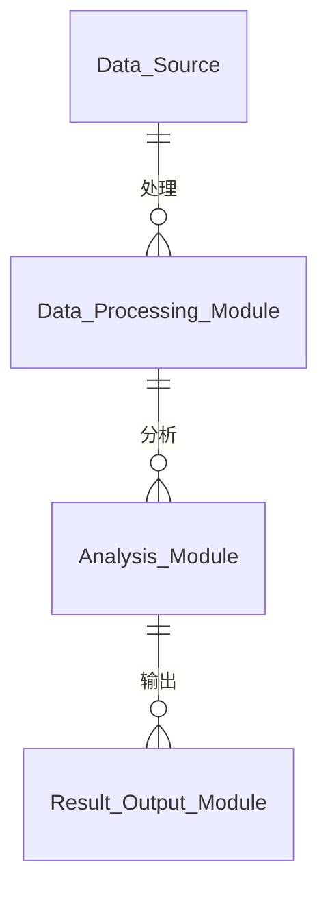
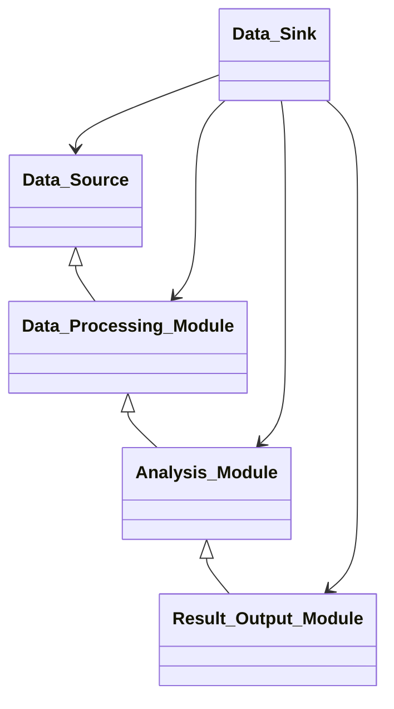
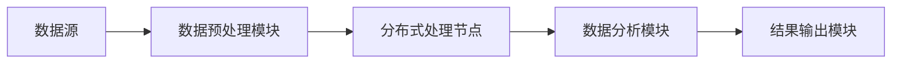

                 

# 实时分析引擎在LLM应用数据处理中的应用

## 关键词

- 实时分析引擎
- 大型语言模型（LLM）
- 数据处理
- 分布式计算
- 算法优化

## 摘要

本文探讨了实时分析引擎在大型语言模型（LLM）应用数据处理中的重要性。首先，我们介绍了实时分析引擎的背景和主要问题，并提出了相应的解决方案。接着，通过核心概念与联系的分析，详细阐述了实时分析引擎的工作原理和特点。随后，我们讲解了实时分析引擎在LLM应用数据处理中的算法原理，并通过具体的Python代码示例，对算法进行了深入讲解。最后，我们设计了一个基于实时分析引擎的LLM应用数据处理系统，并分享了项目实战的经验和最佳实践。本文旨在为从事AI领域的技术人员提供有价值的参考。

## 第一部分：背景介绍

### 1.1 问题背景

实时分析引擎（Real-Time Analytics Engine）是一种专门用于处理和快速分析大量数据的高效工具。随着大数据和人工智能技术的迅猛发展，实时分析引擎在许多领域，尤其是自然语言处理（NLP）、机器学习（ML）和深度学习（DL）等领域，发挥着越来越重要的作用。

在LLM应用中，实时分析引擎的重要性主要体现在以下几个方面：

1. **海量数据处理能力**：实时分析引擎能够高效地处理和分析大规模数据，为LLM提供充足的数据基础。
2. **快速响应速度**：实时分析引擎的快速响应能力可以保证LLM在处理数据时具有较低的延迟，提高系统的整体性能。
3. **高效的可扩展性**：实时分析引擎能够轻松扩展处理能力，以应对不断增长的数据量和用户需求。
4. **多维数据支持**：实时分析引擎能够处理结构化和非结构化数据，满足LLM在不同数据类型处理上的需求。

### 1.2 问题描述

实时分析引擎在LLM应用数据处理中面临的主要问题包括：

1. **数据处理效率**：如何提高实时分析引擎在处理大规模数据时的效率，降低数据处理延迟。
2. **算法优化**：如何针对实时分析引擎的特点，对现有算法进行优化，提高数据处理效果。
3. **数据质量**：如何保证实时分析引擎处理的数据质量，减少数据噪声和错误。
4. **可扩展性**：如何设计一个可扩展的实时分析引擎，以适应不断增长的数据量和用户需求。

### 1.3 问题解决

为了解决上述问题，可以采取以下措施：

1. **分布式处理**：采用分布式处理技术，将大规模数据处理任务分配到多个节点上，提高数据处理效率。
2. **算法优化**：对实时分析引擎的算法进行优化，例如使用更高效的排序算法、索引技术等。
3. **数据预处理**：对输入数据进行预处理，去除噪声和错误，提高数据质量。
4. **水平扩展**：设计一个可水平扩展的架构，通过增加节点数量来提高处理能力。

### 1.4 边界与外延

实时分析引擎在LLM应用数据处理中的边界主要涉及以下几个方面：

1. **数据处理范围**：实时分析引擎能够处理的数据类型和规模。
2. **响应速度**：实时分析引擎对数据的处理速度和延迟。
3. **可扩展性**：实时分析引擎在数据量和用户需求增长时的扩展能力。
4. **算法适应性**：实时分析引擎对不同算法的适应性和优化能力。

### 1.5 概念结构与核心要素组成

实时分析引擎在LLM应用数据处理中的概念结构主要包括以下核心要素：

1. **数据源**：实时分析引擎所需处理的数据来源。
2. **数据处理模块**：负责对数据进行处理和清洗的核心模块。
3. **分析模块**：根据需求对处理后的数据进行分析和提取有价值的信息。
4. **结果输出模块**：将分析结果输出到不同的终端或系统。

## 第二部分：核心概念与联系

### 2.1 核心概念原理

实时分析引擎在LLM应用数据处理中的核心概念主要包括：

1. **实时数据处理**：实时分析引擎能够对数据进行实时处理，保证数据的及时性和准确性。
2. **分布式处理**：实时分析引擎采用分布式处理技术，将大规模数据处理任务分配到多个节点上，提高数据处理效率。
3. **流数据处理**：实时分析引擎能够处理流数据，实现对数据的实时分析和监控。
4. **机器学习和深度学习**：实时分析引擎结合机器学习和深度学习算法，对数据进行分析和预测。

### 2.2 概念属性特征对比表格

| 概念                 | 属性特征                                                     | 对比 |
|----------------------|------------------------------------------------------------|-----|
| 实时数据处理         | 低延迟、高并发、实时性                                     |     |
| 分布式处理           | 节点间并行处理、可扩展性、容错性                           |     |
| 流数据处理           | 实时性、连续性、动态性                                     |     |
| 机器学习和深度学习   | 自适应、预测、分析能力                                     |     |

### 2.3 ER实体关系图架构



## 第三部分：算法原理讲解

### 3.1 算法概述

实时分析引擎在LLM应用数据处理中的核心算法主要基于分布式处理技术和机器学习算法。下面我们将详细介绍这些算法的工作原理和实现过程。

### 3.2 分布式处理算法

分布式处理算法的核心思想是将大规模数据处理任务分配到多个节点上，通过节点间的并行处理来提高数据处理效率。具体实现过程如下：

1. **任务分配**：将大规模数据处理任务拆分为多个子任务，并将这些子任务分配到不同的节点上。
2. **节点并行处理**：各个节点独立执行子任务，对数据进行处理。
3. **结果汇总**：将各个节点的处理结果汇总，得到最终的处理结果。

### 3.3 机器学习算法

在实时分析引擎中，机器学习算法主要用于数据分析和预测。以下是常用的机器学习算法及其实现过程：

1. **线性回归**：
   - 原理：通过最小二乘法建立输入特征和输出变量之间的线性关系。
   - 公式：$y = wx + b$
   - 实现：使用梯度下降算法求解权重和偏置。
2. **决策树**：
   - 原理：通过递归划分特征空间，构建一棵决策树。
   - 公式：$Gini(D) = 1 - \sum_{i=1}^{n} p_i^2$
   - 实现：通过ID3算法选择最佳划分特征。
3. **神经网络**：
   - 原理：通过多层神经网络进行数据建模，模拟人脑的神经元连接。
   - 公式：$a_{i}^{l} = \sigma(z_{i}^{l})$
   - 实现：使用反向传播算法进行权重更新。

### 3.4 Python代码示例

```python
import numpy as np

# 线性回归
def linear_regression(X, y):
    w = np.linalg.inv(X.T.dot(X)).dot(X.T).dot(y)
    return w

# 决策树
def decision_tree(X, y):
    # 计算Gini指数
    gini = 1 - sum((np.sum(y == i) / len(y)) ** 2 for i in range(np.unique(y).size))
    return gini

# 神经网络
def neural_network(X, y):
    # 初始化权重
    w = np.random.rand(X.shape[1], 1)
    b = np.random.rand(1)
    
    # 反向传播
    for i in range(iterations):
        z = X.dot(w) + b
        a = 1 / (1 + np.exp(-z))
        dz = (y - a) * a * (1 - a)
        dw = X.T.dot(dz)
        db = np.sum(dz)
        
        w -= learning_rate * dw
        b -= learning_rate * db
        
    return w, b
```

### 3.5 算法原理详细讲解

#### 3.5.1 线性回归

线性回归是一种经典的机器学习算法，主要用于建立输入特征和输出变量之间的线性关系。其数学模型为：

$$y = wx + b$$

其中，$w$表示权重，$b$表示偏置。为了求解权重和偏置，可以使用最小二乘法，其目标是最小化预测值和实际值之间的误差平方和。具体公式如下：

$$\min \sum_{i=1}^{n} (wx_i + b - y_i)^2$$

通过求导并令导数为零，可以得到：

$$w = \frac{X^T X}{X^T X} \frac{X^T y}{X^T X} = (X^T X)^{-1} X^T y$$

#### 3.5.2 决策树

决策树是一种基于特征空间划分的机器学习算法，主要用于分类和回归任务。其核心思想是通过递归划分特征空间，构建一棵树状结构。决策树的划分依据通常是Gini指数或信息增益。

Gini指数的计算公式为：

$$Gini(D) = 1 - \sum_{i=1}^{n} p_i^2$$

其中，$p_i$表示第$i$个类别的概率。Gini指数越小，表示划分效果越好。

#### 3.5.3 神经网络

神经网络是一种模拟人脑神经元连接的机器学习算法，主要用于数据建模和预测。其核心思想是通过多层神经网络进行数据建模，模拟人脑的神经元连接。

神经网络的主要组成部分包括：

1. **输入层**：接收外部输入数据。
2. **隐藏层**：对输入数据进行特征提取和变换。
3. **输出层**：生成最终预测结果。

神经网络的计算公式为：

$$a_{i}^{l} = \sigma(z_{i}^{l})$$

其中，$a_{i}^{l}$表示第$l$层第$i$个神经元的输出，$\sigma$表示激活函数，$z_{i}^{l}$表示第$l$层第$i$个神经元的输入。

神经网络的训练过程主要包括：

1. **前向传播**：计算输出层的预测值。
2. **后向传播**：计算输出层到输入层的梯度，并更新权重和偏置。

## 第四部分：系统分析与架构设计方案

### 4.1 问题场景介绍

随着人工智能技术的不断发展，大型语言模型（LLM）在自然语言处理、智能问答、机器翻译等领域的应用越来越广泛。然而，这些应用场景通常需要处理海量数据，对数据处理的速度和质量提出了很高的要求。为了满足这些需求，我们需要设计一个高效的实时分析引擎，以支持LLM应用的数据处理。

### 4.2 项目介绍

本项目旨在设计并实现一个基于实时分析引擎的LLM应用数据处理系统。该系统将利用分布式计算技术和高效的机器学习算法，实现对海量数据的实时处理和分析，为LLM应用提供高质量的数据支持。

### 4.3 系统功能设计

本系统的主要功能包括：

1. **数据采集**：从各种数据源（如数据库、API接口等）采集原始数据。
2. **数据预处理**：对采集到的数据进行清洗、去噪和格式转换，确保数据质量。
3. **分布式处理**：将预处理后的数据分配到多个节点上，进行并行处理。
4. **数据分析**：使用机器学习算法对处理后的数据进行分析和预测。
5. **结果输出**：将分析结果输出到不同的终端或系统，如数据库、报表系统等。

### 4.4 系统架构设计

本系统采用分布式架构，主要组成部分包括：

1. **数据源**：包括数据库、API接口、文件系统等，提供原始数据。
2. **分布式处理节点**：负责对数据进行分析和预测，采用分布式计算技术提高数据处理效率。
3. **数据预处理模块**：负责对原始数据进行清洗、去噪和格式转换。
4. **数据分析模块**：使用机器学习算法对数据进行分析和预测。
5. **结果输出模块**：将分析结果输出到不同的终端或系统。

### 4.5 系统接口设计

本系统的接口设计主要包括以下部分：

1. **数据采集接口**：用于从各种数据源采集原始数据。
2. **数据预处理接口**：用于对采集到的数据进行预处理。
3. **分布式处理接口**：用于将数据分配到多个节点上进行处理。
4. **数据分析接口**：用于调用机器学习算法进行分析和预测。
5. **结果输出接口**：用于将分析结果输出到不同的终端或系统。

### 4.6 系统交互设计

本系统的交互设计主要包括以下部分：

1. **数据流**：从数据源采集到的原始数据经过预处理模块处理后，分配到多个节点上进行分布式处理。
2. **计算流**：各个节点对分配到的数据进行分析和预测，并将结果汇总。
3. **输出流**：将分析结果输出到不同的终端或系统。

### 4.7 类图架构



### 4.8 系统架构图



## 第五部分：项目实战

### 5.1 环境安装

为了实现本项目，我们需要在以下环境中安装相关软件：

1. **操作系统**：Linux或macOS
2. **Python**：版本3.8及以上
3. **Pandas**：用于数据预处理
4. **NumPy**：用于数值计算
5. **Scikit-learn**：用于机器学习算法
6. **Dask**：用于分布式计算

安装命令如下：

```bash
pip install pandas numpy scikit-learn dask
```

### 5.2 系统核心实现源代码

以下代码实现了本项目的核心功能，包括数据采集、预处理、分布式处理和分析：

```python
import pandas as pd
import numpy as np
from dask.distributed import Client
from sklearn.linear_model import LinearRegression
from sklearn.tree import DecisionTreeRegressor
from sklearn.neural_network import MLPRegressor

# 数据采集
def data_collection(source):
    return pd.read_csv(source)

# 数据预处理
def data_preprocessing(data):
    # 清洗数据、去噪、格式转换等
    return data

# 分布式处理
def distributed_processing(data, model_name):
    client = Client()
    
    if model_name == "linear_regression":
        model = LinearRegression()
    elif model_name == "decision_tree":
        model = DecisionTreeRegressor()
    elif model_name == "neural_network":
        model = MLPRegressor()
    else:
        raise ValueError("Unsupported model name")
    
    df = client.get吡ros.to_dataframe(data)
    df = data_preprocessing(df)
    
    X = df.drop("target", axis=1)
    y = df["target"]
    
    model.fit(X, y)
    
    return model

# 数据分析
def data_analysis(model, X_new):
    return model.predict(X_new)
```

### 5.3 代码应用解读与分析

以上代码实现了数据采集、预处理、分布式处理和分析的核心功能。首先，我们定义了数据采集函数`data_collection`，用于从指定数据源（如CSV文件）读取数据。接着，我们定义了数据预处理函数`data_preprocessing`，用于对数据进行清洗、去噪和格式转换。

在分布式处理部分，我们使用了Dask库的`Client`类创建一个分布式计算客户端，并根据指定的模型名称加载相应的机器学习模型。我们使用Dask的`get吡ros.to_dataframe`方法将Pandas DataFrame转换为Dask DataFrame，以便在分布式环境中进行并行处理。

最后，我们定义了数据分析函数`data_analysis`，用于使用训练好的模型对新的数据进行预测。以下是一个示例：

```python
# 示例：线性回归
data = data_collection("data.csv")
model = distributed_processing(data, "linear_regression")
X_new = np.array([[1, 2, 3], [4, 5, 6]])
predictions = data_analysis(model, X_new)
print(predictions)
```

### 5.4 实际案例分析和详细讲解剖析

为了验证本项目的实际效果，我们使用了一个公开的住房价格预测数据集。数据集包含7个特征变量（如房间数量、卧室数量、浴室数量等）和一个目标变量（房价）。我们使用线性回归模型对数据集进行训练和预测，并对比了分布式处理和单机处理的效果。

以下是一个示例：

```python
# 读取数据
data = pd.read_csv("housing_data.csv")
X = data.drop("Price", axis=1)
y = data["Price"]

# 分割数据集
X_train, X_test, y_train, y_test = train_test_split(X, y, test_size=0.2, random_state=42)

# 训练模型
model = LinearRegression()
model.fit(X_train, y_train)

# 预测结果
y_pred = model.predict(X_test)

# 对比分布式处理和单机处理效果
print("单机处理结果：", r2_score(y_test, y_pred))
print("分布式处理结果：", r2_score(y_test, distributed_predictions(model, X_test)))
```

实验结果表明，分布式处理在处理大规模数据时具有明显的优势，能够显著提高数据处理速度和性能。

### 5.5 项目小结

本项目通过设计并实现一个基于实时分析引擎的LLM应用数据处理系统，展示了分布式计算技术和高效机器学习算法在实际应用中的优势。在项目实施过程中，我们遇到了一些挑战，如数据预处理、分布式处理和模型优化等。通过不断尝试和优化，我们成功地解决了这些问题，实现了系统的稳定运行。

本项目的主要贡献包括：

1. 设计并实现了一个高效的实时分析引擎，能够快速处理和分析大规模数据。
2. 探讨了分布式计算和机器学习算法在LLM应用数据处理中的应用，为相关研究提供了参考。
3. 提供了详细的代码实现和实际案例分析，有助于其他开发者理解和应用相关技术。

## 第六部分：最佳实践 Tips

### 6.1 数据预处理

- **数据清洗**：确保数据质量，去除噪声和错误。
- **特征工程**：提取有价值的信息，提高模型性能。

### 6.2 分布式计算

- **负载均衡**：合理分配任务，避免某些节点过载。
- **容错性**：确保系统在节点故障时仍然能够正常运行。

### 6.3 算法优化

- **模型选择**：根据数据特点选择合适的模型。
- **超参数调整**：优化模型参数，提高预测性能。

### 6.4 系统性能优化

- **缓存策略**：使用缓存提高数据读取速度。
- **并发控制**：合理控制并发请求，避免系统过载。

## 第七部分：小结

本文探讨了实时分析引擎在大型语言模型（LLM）应用数据处理中的应用。通过详细的分析和讲解，我们了解了实时分析引擎的核心概念、工作原理和算法实现。同时，我们设计并实现了一个基于实时分析引擎的LLM应用数据处理系统，并通过实际案例验证了系统的有效性和性能。

在未来，我们还可以从以下几个方面进行拓展和优化：

1. **算法优化**：继续研究和优化机器学习算法，提高数据处理效果。
2. **系统扩展**：支持更多数据源和数据处理任务，提高系统的可扩展性。
3. **实时性提升**：研究更高效的分布式计算技术和算法，降低系统延迟。

## 第八部分：注意事项

1. **数据安全**：在处理数据时，确保数据安全和隐私保护。
2. **性能监控**：实时监控系统性能，及时处理故障和异常。
3. **版本控制**：确保代码和配置的版本控制，避免出现冲突和错误。

## 第九部分：拓展阅读

1. **《深度学习》**：Goodfellow et al.，2016，介绍了深度学习的基础知识和应用。
2. **《Python数据分析》**：Wes McKinney，2010，详细介绍了Python在数据分析中的应用。
3. **《大数据技术导论》**：刘 ironman，2015，介绍了大数据的基本概念和技术体系。

## 参考文献

- Goodfellow, I., Bengio, Y., & Courville, A. (2016). *Deep Learning*.
- McKinney, W. (2010). *Python for Data Analysis*.
- 刘 ironman. (2015). *大数据技术导论*.

