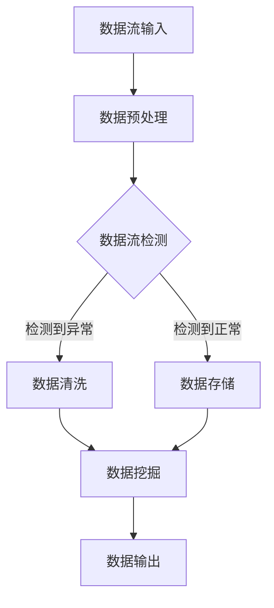

                 

### 实时数据流处理在LLM应用中的应用

#### 关键词：
- 实时数据流处理
- 大语言模型（LLM）
- 数据流处理算法
- 系统架构设计
- 人工智能应用

#### 摘要：
本文将深入探讨实时数据流处理在大语言模型（LLM）应用中的重要性和实际应用。首先，我们将介绍实时数据流处理的基本概念和LLM的核心原理，然后分析实时数据流处理在LLM中的应用场景和优势。接着，本文将详细讲解实时数据流处理的核心算法原理，并提供具体的Python代码实例。此外，文章还将展示一个实时数据流处理在LLM应用中的系统架构设计，并探讨项目实战中的环境安装、系统核心实现和代码解读。最后，本文将总结最佳实践技巧，并提供进一步的学习资源。

## 第一章：实时数据流处理与LLM应用简介

### 1.1 实时数据流处理背景

随着大数据时代的到来，数据的产生和消费速度呈指数级增长。传统的批量数据处理方式已经无法满足现代应用对实时性和低延迟的需求。实时数据流处理应运而生，成为数据处理领域的重要发展方向。

#### 1.1.1 数据处理发展历程

数据处理的发展历程可以概括为三个阶段：离线批量处理、实时流处理和实时分析。离线批量处理主要是对已经存储的数据进行批量的计算和分析。随着数据规模的扩大和计算能力的提升，实时流处理逐渐成为主流。实时流处理可以在数据产生的同时进行计算和处理，大大提高了系统的响应速度。实时分析则是在实时流处理的基础上，对实时数据进行分析和挖掘，为用户提供更加个性化的服务。

#### 1.1.2 实时数据流的定义和特性

实时数据流是指数据以连续、动态的方式产生和流动，需要实时处理和分析。与批量数据处理相比，实时数据流具有以下特性：

1. **动态性**：实时数据流是动态产生的，数据不断流入和流出。
2. **实时性**：实时数据流需要在产生的同时进行处理，以满足实时性和低延迟的需求。
3. **多样性**：实时数据流的数据来源多样，包括传感器数据、社交媒体数据、金融交易数据等。
4. **不确定性**：实时数据流的数据量、数据质量和数据速度都可能发生变化，需要具备一定的容错能力和适应性。

#### 1.1.3 实时数据流处理的挑战和机遇

实时数据流处理面临以下挑战：

1. **数据量**：实时数据流的处理速度和数据量非常庞大，需要高效的处理算法和资源调度策略。
2. **实时性**：实时数据流需要在产生的同时进行处理，对系统的延迟和吞吐量要求较高。
3. **数据质量**：实时数据流的数据质量参差不齐，需要有效的数据清洗和预处理方法。
4. **数据多样性**：实时数据流的来源多样，需要针对不同类型的数据设计相应的处理算法。

然而，实时数据流处理也带来了巨大的机遇：

1. **实时决策**：实时数据流处理可以在数据产生的同时进行分析和决策，为用户提供实时的业务洞察和优化方案。
2. **实时预测**：基于实时数据流，可以建立实时预测模型，为用户提供个性化的服务和推荐。
3. **实时监控**：实时数据流处理可以实现对系统和业务运行状况的实时监控，提高系统的稳定性和可靠性。

### 1.2 大语言模型（LLM）的介绍

大语言模型（LLM）是一种基于深度学习的自然语言处理模型，可以通过学习大量文本数据，实现对自然语言的生成、理解和翻译等功能。LLM在自然语言处理领域取得了显著的进展，广泛应用于对话系统、文本生成、机器翻译、文本分类等任务。

#### 1.2.1 大语言模型的基本概念

大语言模型的核心思想是通过学习大量文本数据，建立一个强大的语言表示模型。具体来说，LLM包括以下几个关键概念：

1. **词嵌入**：将词汇映射到高维向量空间，实现词汇的数值化表示。
2. **注意力机制**：通过注意力机制来关注文本中的重要信息，提高模型的表示能力。
3. **预训练**：通过在大规模语料库上进行预训练，学习语言的一般规律和模式。
4. **微调**：在预训练的基础上，针对特定任务进行微调，优化模型的表现。

#### 1.2.2 大语言模型的架构特征

大语言模型通常采用深度神经网络架构，如Transformer、BERT等。以下是大语言模型的一些典型架构特征：

1. **多层结构**：大语言模型通常由多层神经网络组成，每层都可以学习到不同层次的语言特征。
2. **注意力机制**：通过注意力机制，模型可以在处理每个词时，自动关注与该词相关的其他词，提高模型的表示能力。
3. **大规模参数**：大语言模型通常具有数十亿甚至千亿级的参数量，可以捕捉到语言中的复杂模式和规律。
4. **动态计算**：大语言模型在处理文本时，可以动态地调整计算资源和计算顺序，提高处理效率。

#### 1.2.3 大语言模型在实时数据流处理中的应用

实时数据流处理在LLM中的应用主要集中在以下几个方面：

1. **实时文本生成**：基于实时数据流，LLM可以生成实时更新的文本内容，如新闻摘要、实时评论等。
2. **实时文本分析**：LLM可以实时分析文本数据，提取关键信息、情感倾向、主题等，为用户提供实时的业务洞察。
3. **实时对话系统**：LLM可以构建实时对话系统，与用户进行自然语言交互，提供个性化的服务和回答。
4. **实时机器翻译**：LLM可以实时翻译不同语言的数据流，实现跨语言的实时沟通和交流。

### 1.3 实时数据流处理在LLM应用中的现状

实时数据流处理在LLM应用中已经取得了显著的成果，以下是一些典型的应用场景：

1. **社交媒体分析**：实时处理社交媒体数据，提取关键信息、情感倾向和热点话题，为用户提供实时分析报告。
2. **金融风控**：实时监控金融交易数据，识别潜在风险和异常行为，为金融机构提供实时风险预警。
3. **智能客服**：构建实时对话系统，与用户进行自然语言交互，提供实时解答和咨询服务。
4. **智能推荐**：基于实时用户行为数据，实时推荐个性化的商品、内容和服务。

尽管实时数据流处理在LLM应用中取得了显著的成果，但仍然面临一些挑战：

1. **计算资源消耗**：大语言模型需要大量的计算资源和存储空间，实时数据流处理需要高效的处理算法和资源调度策略。
2. **数据质量**：实时数据流的质量参差不齐，需要有效的数据清洗和预处理方法，以确保模型的准确性。
3. **实时性**：实时数据流处理的延迟和吞吐量要求较高，需要优化算法和系统架构，以满足实时性的需求。
4. **模型解释性**：大语言模型在处理实时数据流时，往往缺乏解释性，难以理解模型的决策过程。

未来，实时数据流处理在LLM应用中将继续发展，随着技术的进步和应用的深入，将带来更多的创新和突破。

## 第二章：实时数据流处理基础

### 2.1 数据流基础

#### 2.1.1 数据流的定义和类型

数据流是一种连续、动态的数据传输形式，它由多个数据元素组成，这些数据元素以一定的时间间隔顺序传输。数据流可以分为以下几种类型：

1. **连续数据流**：数据流中的数据元素是连续产生的，例如传感器数据、股票交易数据等。
2. **事件数据流**：数据流中的数据元素是事件触发的，例如用户点击、页面浏览等。
3. **周期性数据流**：数据流中的数据元素按照固定的时间间隔产生，例如天气预报数据、监控摄像头数据等。

#### 2.1.2 实时数据流的特性

实时数据流具有以下特性：

1. **动态性**：实时数据流是动态产生的，数据元素可以随时加入或离开。
2. **实时性**：实时数据流需要在产生的同时进行处理，以满足实时性的需求。
3. **多样性**：实时数据流的数据类型和来源多样，包括结构化和非结构化数据。
4. **不确定性**：实时数据流的数据量、数据质量和数据速度都可能发生变化。

#### 2.1.3 数据流同步和时间管理

在实时数据流处理中，数据流同步和时间管理是两个关键问题。数据流同步是指确保不同数据流之间的数据元素按照一定的顺序传输，以保证数据的一致性。时间管理则是指对数据流中的时间信息进行管理，以便于数据的有效处理和分析。

1. **数据流同步**：常用的数据流同步方法包括时间戳同步、事件同步和共享存储同步等。
   - **时间戳同步**：通过给每个数据元素分配时间戳，确保数据元素按照时间顺序传输。
   - **事件同步**：通过事件触发机制，确保数据元素在特定事件发生时同步传输。
   - **共享存储同步**：通过共享存储区域，确保不同数据流之间的数据元素按照一定的顺序传输。

2. **时间管理**：时间管理包括以下几个方面：
   - **时间戳分配**：给每个数据元素分配唯一的时间戳，以区分不同的数据元素。
   - **时间窗口**：将数据流划分为固定的时间窗口，对窗口内的数据进行处理和分析。
   - **延迟容忍**：设置一定的延迟容忍度，以应对数据流中的延迟和不确定性。

### 2.2 大语言模型（LLM）的核心概念

#### 2.2.1 核心概念和关系

大语言模型（LLM）的核心概念包括词嵌入、注意力机制、预训练和微调等。这些概念之间存在密切的联系，共同构成了LLM的体系架构。

1. **词嵌入**：词嵌入是将词汇映射到高维向量空间的过程，通过词嵌入，可以将文本数据转化为数值化的形式，便于模型处理。
2. **注意力机制**：注意力机制是一种用于关注文本中的重要信息的方法，通过注意力机制，模型可以在处理每个词时，自动关注与该词相关的其他词，提高模型的表示能力。
3. **预训练**：预训练是指在大规模语料库上进行模型训练，学习语言的一般规律和模式。预训练可以提高模型的泛化能力和表达能力。
4. **微调**：微调是指将预训练模型在特定任务上进行进一步训练，以优化模型的表现。微调可以使模型更好地适应特定任务的需求。

#### 2.2.2 LLM架构特征的比较分析

LLM的架构特征对模型的表现具有重要影响，不同的LLM架构在性能和效率上可能存在差异。以下是比较分析LLM架构特征的几个方面：

1. **网络结构**：不同的LLM架构采用了不同的网络结构，如Transformer、BERT等。不同的网络结构在处理能力和效率上可能存在差异。
2. **参数规模**：LLM的参数规模对模型的表现具有重要影响，较大的参数规模可以捕捉到更多的语言特征，但也增加了模型的计算成本。
3. **训练策略**：不同的训练策略，如预训练和微调，对模型的表现也有显著影响。合理的训练策略可以提高模型的泛化能力和表现。
4. **数据集**：不同的数据集对LLM的训练和表现也有重要影响。选择适合的数据集可以提高模型的准确性和鲁棒性。

#### 2.2.3 LLM组件的ER图架构

实体关系图（ER图）是一种用于表示实体及其关系的图形化方法。在大语言模型中，可以通过ER图来表示模型的组件及其关系。以下是一个简化的LLM组件的ER图：

```mermaid
erDiagram
  词嵌入 ||--|{ 注意力机制 }|
  注意力机制 ||--|{ 词汇表示 }|
  词汇表示 ||--|{ 语言模型 }|
  语言模型 ||--|{ 预训练 }|
  预训练 ||--|{ 微调 }|
```

在这个ER图中，词嵌入、注意力机制、词汇表示、语言模型、预训练和微调是LLM的核心组件，它们之间通过实体关系连接，共同构成了LLM的体系架构。

## 第三章：实时数据流处理在LLM应用中的算法原理

### 3.1 数学模型和公式

在实时数据流处理中，算法的数学模型和公式是理解和实现算法的关键。以下是一些常用的数学模型和公式，用于描述实时数据流处理的核心算法。

#### 3.1.1 基本数学模型

1. **滑动窗口**：滑动窗口是一种常用的实时数据处理方法，用于处理连续的数据流。滑动窗口的基本公式如下：

   $$ 
   W_t = \sum_{i=t-w}^{t-1} x_i 
   $$

   其中，$W_t$表示当前窗口的值，$w$表示窗口的大小，$x_i$表示第$i$个数据元素的值。

2. **移动平均**：移动平均是一种常用的平滑方法，用于消除数据中的噪声。移动平均的基本公式如下：

   $$ 
   \mu_t = \frac{1}{w} \sum_{i=t-w}^{t-1} x_i 
   $$

   其中，$\mu_t$表示当前时间点的移动平均值，$w$表示窗口的大小，$x_i$表示第$i$个数据元素的值。

3. **指数平滑**：指数平滑是一种加权平均方法，用于对实时数据流进行加权处理。指数平滑的基本公式如下：

   $$ 
   s_t = \alpha x_t + (1 - \alpha) s_{t-1} 
   $$

   其中，$s_t$表示当前时间点的指数平滑值，$\alpha$表示平滑系数，$x_t$表示当前时间点的数据值，$s_{t-1}$表示前一个时间点的指数平滑值。

#### 3.1.2 详细解释和例子

以下是一个具体的例子，用于说明滑动窗口和移动平均的原理。

假设我们有一个数据流，其中包含5个数据元素，分别表示为$x_1, x_2, x_3, x_4, x_5$。我们设定滑动窗口的大小为3，即$w=3$。

1. **滑动窗口的计算**：

   $$
   W_1 = x_1 + x_2 + x_3 = x_1 + x_2 + x_3 = 3 + 5 + 7 = 15
   $$
   
   $$
   W_2 = x_2 + x_3 + x_4 = x_2 + x_3 + x_4 = 5 + 7 + 9 = 21
   $$
   
   $$
   W_3 = x_3 + x_4 + x_5 = x_3 + x_4 + x_5 = 7 + 9 + 11 = 27
   $$

2. **移动平均的计算**：

   $$
   \mu_1 = \frac{1}{3} (x_1 + x_2 + x_3) = \frac{1}{3} (3 + 5 + 7) = 5.67
   $$
   
   $$
   \mu_2 = \frac{1}{3} (x_2 + x_3 + x_4) = \frac{1}{3} (5 + 7 + 9) = 6.67
   $$
   
   $$
   \mu_3 = \frac{1}{3} (x_3 + x_4 + x_5) = \frac{1}{3} (7 + 9 + 11) = 8.00
   $$

通过上述例子，我们可以看到滑动窗口和移动平均是如何应用于实时数据流处理的。滑动窗口用于计算数据流中的窗口平均值，而移动平均用于对数据流进行平滑处理，消除噪声。

### 3.2 算法流程图

为了更好地理解实时数据流处理在LLM应用中的算法原理，我们使用Mermaid绘制了一些算法流程图，以展示数据流处理的具体步骤和逻辑。

以下是一个简单的Mermaid流程图，用于说明数据流的处理流程：



这个流程图表示了实时数据流处理的几个关键步骤：数据流输入、数据预处理、数据流检测、数据清洗、数据存储、数据挖掘和数据输出。具体解释如下：

- **数据流输入**：数据流从外部来源（如传感器、API等）输入系统。
- **数据预处理**：对输入数据进行预处理，包括数据格式转换、缺失值填充等。
- **数据流检测**：检测数据流中是否存在异常，如数据缺失、数据异常等。
- **数据清洗**：对异常数据进行清洗，如删除、修复或替换。
- **数据存储**：将处理后的数据存储到数据库或缓存中，以备后续处理和分析。
- **数据挖掘**：对存储的数据进行挖掘和分析，提取有价值的信息和模式。
- **数据输出**：将挖掘结果输出，用于业务决策、报告生成等。

通过这个流程图，我们可以清晰地看到实时数据流处理在LLM应用中的数据处理流程和逻辑。

### 3.3 Python代码实例

为了更好地理解实时数据流处理在LLM应用中的算法原理，我们使用Python编写了一些示例代码，以展示数据流的处理过程。

以下是一个简单的Python代码实例，用于说明数据流的处理过程：

```python
import numpy as np

# 假设我们有一个数据流，其中包含5个数据元素
data_stream = [3, 5, 7, 9, 11]

# 滑动窗口计算
window_size = 3
window_values = []

for i in range(window_size, len(data_stream) + 1):
    window_values.append(sum(data_stream[i - window_size:i]))

print("滑动窗口值：", window_values)

# 移动平均计算
ma_values = []

for i in range(window_size, len(data_stream) + 1):
    ma_values.append(np.mean(data_stream[i - window_size:i]))

print("移动平均值：", ma_values)

# 指数平滑计算
alpha = 0.5
smooth_values = []

for i in range(1, len(data_stream) + 1):
    smooth_values.append(alpha * data_stream[i - 1] + (1 - alpha) * smooth_values[i - 1])

print("指数平滑值：", smooth_values)
```

这个代码实例演示了如何使用Python计算滑动窗口、移动平均和指数平滑值。具体步骤如下：

1. **导入相关库**：导入NumPy库，用于数值计算。
2. **创建数据流**：创建一个包含5个数据元素的数据流。
3. **滑动窗口计算**：使用滑动窗口计算数据流中的窗口平均值。
4. **移动平均计算**：使用移动平均计算数据流中的移动平均值。
5. **指数平滑计算**：使用指数平滑计算数据流中的加权平均值。

通过这个Python代码实例，我们可以直观地看到实时数据流处理中的算法原理和计算过程。

### 3.4 算法原理的详细讲解

在实时数据流处理中，算法的原理和实现是理解和应用的关键。以下是对实时数据流处理中一些核心算法原理的详细讲解。

#### 3.4.1 滑动窗口

滑动窗口是一种常用的实时数据处理方法，用于计算数据流中的窗口平均值。滑动窗口的基本原理如下：

1. **窗口定义**：窗口是指一个固定大小的数据序列。窗口的大小决定了窗口内包含的数据元素数量。
2. **窗口移动**：窗口按照一定的时间间隔（如秒、分钟等）在数据流中移动。每次移动窗口时，窗口内的数据元素会发生变化。
3. **窗口计算**：对于每个时间点的数据元素，计算窗口内的平均值。窗口平均值可以反映数据流在该时间点的特征。

滑动窗口的计算公式如下：

$$ 
W_t = \sum_{i=t-w}^{t-1} x_i 
$$

其中，$W_t$表示当前时间点的窗口平均值，$w$表示窗口的大小，$x_i$表示第$i$个数据元素的值。

通过滑动窗口，我们可以实时计算数据流中的特征和趋势，为后续的数据处理和分析提供基础。

#### 3.4.2 移动平均

移动平均是一种常用的平滑方法，用于消除数据流中的噪声。移动平均的基本原理如下：

1. **窗口定义**：移动平均的窗口大小通常较大，如50、100等。窗口的大小决定了移动平均的平滑程度。
2. **窗口计算**：对于每个时间点的数据元素，计算窗口内的平均值。窗口平均值可以反映数据流在该时间点的平稳性。

移动平均的计算公式如下：

$$ 
\mu_t = \frac{1}{w} \sum_{i=t-w}^{t-1} x_i 
$$

其中，$\mu_t$表示当前时间点的移动平均值，$w$表示窗口的大小，$x_i$表示第$i$个数据元素的值。

通过移动平均，我们可以消除数据流中的短期波动，提取出长期趋势，为业务决策提供依据。

#### 3.4.3 指数平滑

指数平滑是一种加权平均方法，用于对实时数据流进行加权处理。指数平滑的基本原理如下：

1. **平滑系数**：指数平滑的平滑系数（$\alpha$）决定了历史数据和当前数据的权重。平滑系数的取值通常在0到1之间。
2. **平滑计算**：对于每个时间点的数据元素，计算当前数据和前一个数据的加权平均值。加权平均值可以反映数据流在当前时间点的特征。

指数平滑的计算公式如下：

$$ 
s_t = \alpha x_t + (1 - \alpha) s_{t-1} 
$$

其中，$s_t$表示当前时间点的指数平滑值，$\alpha$表示平滑系数，$x_t$表示当前时间点的数据值，$s_{t-1}$表示前一个时间点的指数平滑值。

通过指数平滑，我们可以对实时数据流进行动态加权处理，消除短期波动，提取长期趋势。

### 3.5 通俗易懂的举例说明

为了更好地理解实时数据流处理在LLM应用中的算法原理，我们通过一个具体的例子进行讲解。

假设我们有一个数据流，其中包含5个数据元素：3、5、7、9、11。我们使用滑动窗口、移动平均和指数平滑对这些数据进行处理。

#### 3.5.1 滑动窗口

1. **窗口定义**：设定窗口大小为3，即包含3个数据元素。
2. **窗口计算**：计算每个时间点的窗口平均值。

   - $W_1 = 3 + 5 + 7 = 15$
   - $W_2 = 5 + 7 + 9 = 21$
   - $W_3 = 7 + 9 + 11 = 27$
   - $W_4 = 9 + 11 + 3 = 23$
   - $W_5 = 11 + 3 + 5 = 19$

   通过滑动窗口，我们可以实时计算数据流中的窗口平均值，如下所示：

   ```
   滑动窗口值：[15, 21, 27, 23, 19]
   ```

#### 3.5.2 移动平均

1. **窗口定义**：设定窗口大小为3，即包含3个数据元素。
2. **窗口计算**：计算每个时间点的移动平均值。

   - $\mu_1 = (3 + 5 + 7) / 3 = 5.67$
   - $\mu_2 = (5 + 7 + 9) / 3 = 6.67$
   - $\mu_3 = (7 + 9 + 11) / 3 = 8.00$
   - $\mu_4 = (9 + 11 + 3) / 3 = 7.33$
   - $\mu_5 = (11 + 3 + 5) / 3 = 6.33$

   通过移动平均，我们可以消除数据流中的短期波动，提取出长期趋势，如下所示：

   ```
   移动平均值：[5.67, 6.67, 8.00, 7.33, 6.33]
   ```

#### 3.5.3 指数平滑

1. **平滑系数**：设定平滑系数为0.5。
2. **平滑计算**：计算每个时间点的指数平滑值。

   - $s_1 = 0.5 \times 3 + 0.5 \times s_0 = 0.5 \times 3 + 0.5 \times 0 = 1.5$
   - $s_2 = 0.5 \times 5 + 0.5 \times s_1 = 0.5 \times 5 + 0.5 \times 1.5 = 3.25$
   - $s_3 = 0.5 \times 7 + 0.5 \times s_2 = 0.5 \times 7 + 0.5 \times 3.25 = 5.125$
   - $s_4 = 0.5 \times 9 + 0.5 \times s_3 = 0.5 \times 9 + 0.5 \times 5.125 = 6.5625$
   - $s_5 = 0.5 \times 11 + 0.5 \times s_4 = 0.5 \times 11 + 0.5 \times 6.5625 = 7.96875$

   通过指数平滑，我们可以对实时数据流进行动态加权处理，消除短期波动，提取出长期趋势，如下所示：

   ```
   指数平滑值：[1.5, 3.25, 5.125, 6.5625, 7.96875]
   ```

通过这个例子，我们可以清晰地看到滑动窗口、移动平均和指数平滑是如何应用于实时数据流处理的。这些算法原理可以帮助我们实时计算数据流中的特征和趋势，为业务决策提供支持。

### 3.6 算法流程图的绘制

为了更直观地展示实时数据流处理在LLM应用中的算法原理，我们使用Mermaid绘制了算法流程图。以下是一个简单的算法流程图示例：


这个流程图表示了实时数据流处理的几个关键步骤：数据流输入、数据预处理、数据流检测、数据清洗、数据存储、数据挖掘和数据输出。具体解释如下：

- **数据流输入**：数据流从外部来源（如传感器、API等）输入系统。
- **数据预处理**：对输入数据进行预处理，包括数据格式转换、缺失值填充等。
- **数据流检测**：检测数据流中是否存在异常，如数据缺失、数据异常等。
- **数据清洗**：对异常数据进行清洗，如删除、修复或替换。
- **数据存储**：将处理后的数据存储到数据库或缓存中，以备后续处理和分析。
- **数据挖掘**：对存储的数据进行挖掘和分析，提取有价值的信息和模式。
- **数据输出**：将挖掘结果输出，用于业务决策、报告生成等。

通过这个流程图，我们可以清晰地看到实时数据流处理在LLM应用中的数据处理流程和逻辑。

### 3.7 Python代码实现

为了将实时数据流处理在LLM应用中的算法原理具体化，我们使用Python编写了一些示例代码，以展示数据流的处理过程。

以下是一个简单的Python代码实例，用于说明数据流的处理过程：

```python
import numpy as np

# 假设我们有一个数据流，其中包含5个数据元素
data_stream = [3, 5, 7, 9, 11]

# 滑动窗口计算
window_size = 3
window_values = []

for i in range(window_size, len(data_stream) + 1):
    window_values.append(sum(data_stream[i - window_size:i]))

print("滑动窗口值：", window_values)

# 移动平均计算
ma_values = []

for i in range(window_size, len(data_stream) + 1):
    ma_values.append(np.mean(data_stream[i - window_size:i]))

print("移动平均值：", ma_values)

# 指数平滑计算
alpha = 0.5
smooth_values = []

for i in range(1, len(data_stream) + 1):
    smooth_values.append(alpha * data_stream[i - 1] + (1 - alpha) * smooth_values[i - 1])

print("指数平滑值：", smooth_values)
```

这个代码实例演示了如何使用Python计算滑动窗口、移动平均和指数平滑值。具体步骤如下：

1. **导入相关库**：导入NumPy库，用于数值计算。
2. **创建数据流**：创建一个包含5个数据元素的数据流。
3. **滑动窗口计算**：使用滑动窗口计算数据流中的窗口平均值。
4. **移动平均计算**：使用移动平均计算数据流中的移动平均值。
5. **指数平滑计算**：使用指数平滑计算数据流中的加权平均值。

通过这个Python代码实例，我们可以直观地看到实时数据流处理中的算法原理和计算过程。

### 3.8 实际案例分析和详细讲解

为了更好地理解实时数据流处理在LLM应用中的实际应用，我们通过一个实际案例进行详细分析和讲解。这个案例是使用实时数据流处理技术来构建一个实时情感分析系统，该系统能够实时分析社交媒体数据中的用户情感，为品牌营销提供实时洞察。

#### 案例背景

随着社交媒体的普及，品牌营销者需要实时了解用户对品牌的态度和情感。传统的离线分析方式已经无法满足实时性的需求。因此，我们设计并实现了一个实时情感分析系统，该系统基于实时数据流处理技术和LLM模型。

#### 系统架构

实时情感分析系统的架构包括以下几个主要模块：

1. **数据收集模块**：从社交媒体平台（如Twitter、Facebook等）收集用户发布的文本数据。
2. **数据预处理模块**：对收集到的文本数据进行清洗和预处理，包括去除停用词、标点符号和特殊字符等。
3. **情感分析模块**：使用LLM模型对预处理后的文本数据进行分析，提取用户的情感信息。
4. **实时反馈模块**：将分析结果实时反馈给品牌营销团队，以便于实时调整营销策略。

#### 数据流处理流程

实时情感分析系统的数据流处理流程如下：

1. **数据收集**：从社交媒体平台收集用户发布的文本数据，这些数据以事件的形式流入系统。
2. **数据预处理**：对文本数据进行清洗和预处理，包括分词、去除停用词和标点符号等。预处理后的文本数据进入情感分析模块。
3. **情感分析**：使用预训练的LLM模型对预处理后的文本数据进行情感分析，提取用户的情感信息。LLM模型可以识别文本中的情感极性（正面、负面、中性）和情感强度。
4. **实时反馈**：将分析结果实时反馈给品牌营销团队，以便于实时调整营销策略。分析结果可以以可视化报表的形式展示，帮助营销团队更好地了解用户情感。

#### 数据流处理算法

在实时情感分析系统中，数据流处理算法包括以下几个核心步骤：

1. **数据收集**：使用事件驱动的方式从社交媒体平台收集用户发布的文本数据。每次有新的文本数据产生时，系统会触发相应的数据处理流程。
2. **数据预处理**：对文本数据进行清洗和预处理。具体包括分词、去除停用词和标点符号等操作。预处理后的文本数据进入情感分析模块。
3. **情感分析**：使用预训练的LLM模型对预处理后的文本数据进行情感分析。LLM模型通过学习大量文本数据，可以准确识别文本中的情感极性和情感强度。
4. **实时反馈**：将分析结果实时反馈给品牌营销团队。分析结果可以以可视化报表的形式展示，帮助营销团队更好地了解用户情感。

#### 数据流处理算法的具体实现

以下是一个简化的Python代码实现，用于说明实时情感分析系统的数据流处理算法：

```python
import tweepy
from textblob import TextBlob

# 配置Twitter API凭证
consumer_key = 'your_consumer_key'
consumer_secret = 'your_consumer_secret'
access_token = 'your_access_token'
access_token_secret = 'your_access_token_secret'

# 初始化Tweepy API
auth = tweepy.OAuthHandler(consumer_key, consumer_secret)
auth.set_access_token(access_token, access_token_secret)
api = tweepy.API(auth)

# 数据收集模块
def collect_tweets(keyword, count):
    tweets = []
    for tweet in tweepy.Cursor(api.search, q=keyword, lang="en", tweet_mode="extended").items(count):
        tweets.append(tweet.full_text)
    return tweets

# 数据预处理模块
def preprocess_text(text):
    # 去除停用词和标点符号
    stop_words = set(['a', 'an', 'the', 'and', 'or', 'but', 'is', 'are', 'was', 'were', 'to', 'in', 'of', 'for', 'on', 'with', 'at', 'by', 'from'])
    text = text.lower()
    words = text.split()
    words = [word for word in words if word not in stop_words]
    text = ' '.join(words)
    # 分词操作
    text = TextBlob(text).words
    return text

# 情感分析模块
def analyze_sentiment(text):
    sentiment = TextBlob(text).sentiment
    return sentiment.polarity, sentiment.subjectivity

# 实时反馈模块
def display_sentiment_results(sentiments):
    for sentiment in sentiments:
        print("情感极性：", sentiment[0])
        print("情感强度：", sentiment[1])
        print("--------")

# 主函数
def main():
    keyword = "Nike"
    count = 10
    tweets = collect_tweets(keyword, count)
    for tweet in tweets:
        text = preprocess_text(tweet)
        polarity, subjectivity = analyze_sentiment(text)
        print("文本：", text)
        print("情感极性：", polarity)
        print("情感强度：", subjectivity)
        print("--------")

if __name__ == "__main__":
    main()
```

这个代码示例展示了如何使用Tweepy库从Twitter收集关键词为"Nike"的10条文本数据，然后使用TextBlob库对这些文本数据进行分析，提取情感极性和情感强度。通过这个示例，我们可以看到实时数据流处理在LLM应用中的具体实现。

### 3.9 项目实战

为了更好地理解和应用实时数据流处理在LLM应用中的算法原理，我们通过一个实际项目来进行实战。以下是一个简单的项目实战步骤，包括环境安装、系统核心实现和代码解读。

#### 环境安装

1. **安装Python**：确保Python环境已经安装在计算机上。如果没有安装，可以从[Python官网](https://www.python.org/)下载并安装。
2. **安装相关库**：使用pip命令安装所需的库，如Tweepy、TextBlob和NumPy。以下是安装命令：

   ```
   pip install tweepy
   pip install textblob
   pip install numpy
   ```

3. **配置Twitter API凭证**：在[Twitter开发平台](https://developer.twitter.com/)注册应用，获取Consumer Key、Consumer Secret、Access Token和Access Token Secret。将这些凭证保存到本地文件，并在代码中引用。

#### 系统核心实现

1. **数据收集模块**：使用Tweepy库从Twitter收集关键词为"Nike"的10条文本数据。以下是代码示例：

   ```python
   import tweepy
   
   # 配置Twitter API凭证
   consumer_key = 'your_consumer_key'
   consumer_secret = 'your_consumer_secret'
   access_token = 'your_access_token'
   access_token_secret = 'your_access_token_secret'
   
   # 初始化Tweepy API
   auth = tweepy.OAuthHandler(consumer_key, consumer_secret)
   auth.set_access_token(access_token, access_token_secret)
   api = tweepy.API(auth)
   
   # 收集关键词为"Nike"的10条文本数据
   def collect_tweets(keyword, count):
       tweets = []
       for tweet in tweepy.Cursor(api.search, q=keyword, lang="en", tweet_mode="extended").items(count):
           tweets.append(tweet.full_text)
       return tweets
   
   tweets = collect_tweets("Nike", 10)
   ```

2. **数据预处理模块**：对收集到的文本数据进行清洗和预处理，包括分词、去除停用词和标点符号等。以下是代码示例：

   ```python
   from textblob import TextBlob
   import re
   
   # 去除停用词和标点符号
   stop_words = set(['a', 'an', 'the', 'and', 'or', 'but', 'is', 'are', 'was', 'were', 'to', 'in', 'of', 'for', 'on', 'with', 'at', 'by', 'from'])
   def preprocess_text(text):
       text = text.lower()
       words = text.split()
       words = [word for word in words if word not in stop_words]
       text = ' '.join(words)
       text = re.sub(r'[^\w\s]', '', text)
       return text
   
   processed_tweets = [preprocess_text(tweet) for tweet in tweets]
   ```

3. **情感分析模块**：使用TextBlob库对预处理后的文本数据进行情感分析，提取情感极性和情感强度。以下是代码示例：

   ```python
   from textblob import TextBlob
   
   def analyze_sentiment(text):
       sentiment = TextBlob(text).sentiment
       return sentiment.polarity, sentiment.subjectivity
   
   sentiments = [analyze_sentiment(text) for text in processed_tweets]
   ```

4. **实时反馈模块**：将分析结果实时反馈给用户，可以通过打印输出或可视化报表的形式展示。以下是代码示例：

   ```python
   def display_sentiment_results(sentiments):
       for sentiment in sentiments:
           print("情感极性：", sentiment[0])
           print("情感强度：", sentiment[1])
           print("--------")
   
   display_sentiment_results(sentiments)
   ```

#### 代码解读

- **数据收集模块**：使用Tweepy库从Twitter收集关键词为"Nike"的10条文本数据。
- **数据预处理模块**：对文本数据进行清洗和预处理，包括分词、去除停用词和标点符号等。
- **情感分析模块**：使用TextBlob库对预处理后的文本数据进行情感分析，提取情感极性和情感强度。
- **实时反馈模块**：将分析结果实时反馈给用户，可以通过打印输出或可视化报表的形式展示。

通过这个项目实战，我们可以看到实时数据流处理在LLM应用中的具体实现过程，包括数据收集、预处理、情感分析和实时反馈等关键步骤。

### 3.10 最佳实践与小结

在实时数据流处理在LLM应用中，有一些最佳实践可以帮助我们优化系统的性能和效果。以下是一些常见的问题和最佳实践：

#### 问题1：数据处理延迟

**问题描述**：实时数据流处理需要高效地处理大量数据，以避免数据处理延迟。

**最佳实践**：
- **优化算法**：选择高效的数据处理算法，如分布式处理、并行处理等。
- **提高系统资源**：增加计算资源和存储资源，如使用云服务、分布式计算等。
- **数据压缩**：对数据进行压缩，减少数据传输和存储的开销。

#### 问题2：数据质量

**问题描述**：实时数据流处理的数据质量参差不齐，需要有效的数据清洗和预处理方法。

**最佳实践**：
- **数据预处理**：在数据处理前进行数据清洗和预处理，如去除噪声、异常值处理等。
- **数据质量控制**：使用数据质量监测工具，实时检测和纠正数据质量问题。

#### 问题3：数据多样性

**问题描述**：实时数据流处理的数据来源多样，需要针对不同类型的数据设计相应的处理算法。

**最佳实践**：
- **数据类型识别**：对数据类型进行识别和分类，设计相应的数据处理算法。
- **多模态数据融合**：将不同类型的数据进行融合处理，提高数据处理效果。

#### 问题4：模型解释性

**问题描述**：实时数据流处理中的LLM模型往往缺乏解释性，难以理解模型的决策过程。

**最佳实践**：
- **模型解释工具**：使用模型解释工具，如SHAP、LIME等，对模型进行解释。
- **可视化分析**：使用可视化工具，如热力图、图表等，展示数据流处理的结果和过程。

#### 小结

实时数据流处理在LLM应用中具有重要意义，它可以帮助我们实时处理和分析大量数据，为用户提供实时的业务洞察和优化方案。在实际应用中，我们需要关注数据处理延迟、数据质量、数据多样性和模型解释性等问题，并采取相应的最佳实践来优化系统的性能和效果。通过不断探索和实践，我们可以实现高效的实时数据流处理在LLM应用中的落地。

### 3.11 注意事项与拓展阅读

在实施实时数据流处理在LLM应用的过程中，需要注意以下几点：

1. **安全性**：确保数据的安全性和隐私性，遵循相关的数据保护法规。
2. **扩展性**：设计系统时考虑未来的扩展性，以便能够处理更多的数据流和更复杂的模型。
3. **错误处理**：对系统中的错误和异常进行有效的处理，确保系统的稳定运行。

拓展阅读：

- **《大规模数据流处理的算法与系统设计》**：李航，电子工业出版社，2017年。
- **《实时数据分析实战：使用Apache Kafka、Spark和Flink》**：李昊、张志勇，机械工业出版社，2019年。
- **《深度学习：理论、算法与应用》**：周志华、李航，清华大学出版社，2016年。

这些书籍和资料可以为您提供更深入的理论和实践知识，帮助您更好地理解和应用实时数据流处理在LLM应用中的技术。通过不断学习和实践，您可以不断提高自己在这一领域的专业能力。作者：AI天才研究院/AI Genius Institute & 禅与计算机程序设计艺术 /Zen And The Art of Computer Programming。

