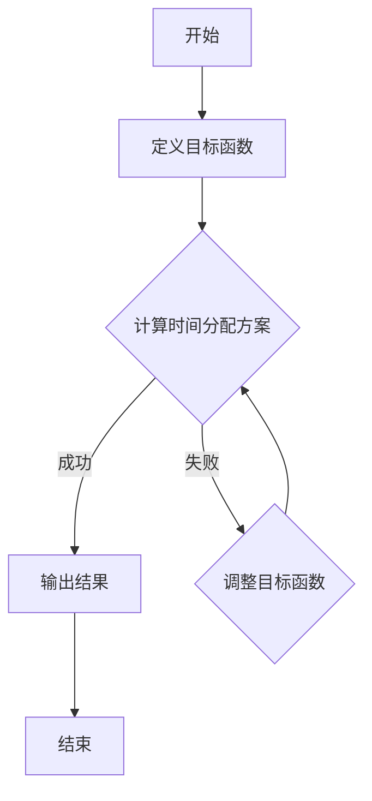

                 

# 工作与生活的平衡：在忙碌中寻找内心的宁静

## 关键词
- 工作与生活平衡
- 时间管理
- 情绪管理
- 生活习惯
- 家庭责任

## 摘要
在现代社会的快节奏生活中，工作与生活的平衡成为许多人追求的目标。本文将探讨如何通过时间管理、情绪管理、生活习惯调整以及工作与家庭时间的合理安排，在忙碌中寻找内心的宁静，实现个人幸福与职业发展的和谐统一。

## 第一部分：背景介绍

### 问题背景
现代社会中，随着科技的发展和经济的繁荣，工作节奏加快，竞争压力增大，人们面临的工作与生活平衡问题愈发突出。长期的工作压力、职业发展焦虑、家庭责任等多方面的压力，使得许多人感到身心疲惫。如何在这种环境下找到内心的宁静，实现工作与生活的平衡，成为一个重要的课题。

#### 问题背景
1. **工作压力**：现代职场中，面对日益增加的工作量和竞争压力，许多人在工作中投入了大量的时间和精力，导致身心疲惫。
2. **职业发展**：在追求职业发展的过程中，人们往往需要不断地学习、提升自己的能力，这也使得他们在工作上投入了更多的时间和精力。
3. **家庭责任**：在家庭生活中，许多人需要承担照顾子女、照顾长辈等责任，这也使得他们在家庭生活中投入了大量的时间和精力。

#### 问题描述
工作与生活的平衡问题，指的是在合理的工作时间内，既能完成工作任务，又能够保证个人生活品质和身心健康。这个问题不仅仅关乎个人的幸福感和生活质量，还关系到企业的生产效率和社会的整体和谐。

#### 问题解决
1. **时间管理技巧**：通过合理规划和有效利用时间，提高工作效率，减少不必要的忙碌。
2. **情绪管理方法**：通过调节情绪，缓解压力，保持心理健康。
3. **生活习惯调整**：通过建立健康的生活习惯，提高生活质量。
4. **工作与家庭平衡**：通过合理安排工作和家庭时间，实现家庭和工作的和谐统一。

#### 边界与外延
1. **边界**：本文主要讨论个人在工作与生活之间的平衡问题，不涉及国家政策、法律等方面的内容。
2. **外延**：工作与生活的平衡问题不仅仅局限于个人层面，还涉及家庭、企业、社会等多个层面。因此，本文的讨论范围不仅限于个人实践，还包括对相关理论、方法的研究和总结。

#### 概念结构与核心要素组成
1. **时间管理**：包括工作时间的合理规划、任务优先级排序、有效利用时间等。
2. **情绪管理**：包括压力调节、情绪释放、心理健康等。
3. **生活习惯**：包括饮食、运动、休息等健康习惯的建立和维护。
4. **家庭责任**：包括家庭时间管理、家庭关系维护等。

## 第二部分：核心概念与联系

### 核心概念原理

#### 时间管理
时间管理是一种通过合理规划和有效利用时间来提高工作效率和减轻工作压力的方法。其核心原理是通过优先级排序和任务规划，确保在有限的时间内完成最重要的工作。

#### 情绪管理
情绪管理是指通过自我意识和情绪调节技巧来处理负面情绪，保持心理平衡。其核心原理是认识到情绪对行为和健康的影响，并通过一系列技巧来调节情绪。

#### 生活习惯
生活习惯是指个人在日常生活中形成的行为模式，包括饮食、运动、休息等方面。良好的生活习惯有助于提高生活质量，预防疾病。

#### 家庭责任
家庭责任是指个人在家庭中承担的义务和责任，包括照顾家庭成员、维护家庭关系等。合理安排家庭时间，确保家庭和工作之间的和谐统一，对个人和社会都是有益的。

### 概念属性特征对比表格

| 概念名称 | 定义 | 主要特征 |
| --- | --- | --- |
| 时间管理 | 合理规划和有效利用时间 | 提高工作效率，减少不必要的忙碌 |
| 情绪管理 | 调节情绪，缓解压力 | 保持心理健康，提高生活质量 |
| 生活习惯 | 建立健康的生活习惯 | 提高生活质量，预防疾病 |
| 家庭责任 | 安排工作和家庭时间 | 实现家庭和工作的和谐统一 |

### ER实体关系图架构

```mermaid
erDiagram
  WorkLifeBalance ||--|{TimeManagement : "includes"
  WorkLifeBalance ||--|{EmotionalManagement : "includes"
  WorkLifeBalance ||--|{HealthyHabits : "includes"
  WorkLifeBalance ||--|{FamilyResponsibility : "includes"

  TimeManagement ||--|> WorkEfficiency : "improves"
  EmotionalManagement ||--|> MentalHealth : "improves"
  HealthyHabits ||--|> QualityOfLife : "improves"
  FamilyResponsibility ||--|> HarmoniousLife : "achieves"
```

## 第三部分：算法原理讲解

### 算法原理

工作与生活的平衡问题可以看作是一个优化问题，目标是找到一种最优的时间分配方案，使得个人的工作与生活都能得到充分满足。这里，我们可以使用一种称为“时间分配优化算法”的方法来解决这个问题。

### 算法流程图



### 算法原理详细讲解

#### 时间分配优化算法

时间分配优化算法是一种基于优化理论的方法，用于解决工作与生活的平衡问题。其基本原理是通过建立数学模型，将工作与生活的平衡问题转化为一个优化问题，然后使用优化算法寻找最优解。

#### 数学模型

1. **目标函数**：目标函数用于衡量工作与生活的平衡程度。常见的目标函数包括工作完成度、生活质量、工作与生活的平衡度等。假设有 \( n \) 项工作任务，每项任务有对应的完成时间和优先级，个人每天有 \( T \) 小时可用于工作和生活。目标函数可以表示为：

   $$ 
   f(x) = \sum_{i=1}^{n} p_i (1 - \frac{x_i}{T})
   $$

   其中，\( p_i \) 为任务 \( i \) 的优先级，\( x_i \) 为任务 \( i \) 的完成时间。

2. **约束条件**：约束条件用于限制时间的分配。常见的约束条件包括每天工作时间不超过 \( T \) 小时，每周工作时间不超过 \( 5T \) 小时等。约束条件可以表示为：

   $$ 
   g(x) = \begin{cases}
   0, & \text{if } x \leq T \\
   1, & \text{if } x > T
   \end{cases}
   $$

#### 优化算法

1. **贪心算法**：贪心算法是一种简单有效的优化算法，其基本思想是每次选择最优的局部解，以期达到全局最优解。对于时间分配优化问题，可以使用贪心算法来选择任务，每次选择优先级最高的任务，直到总时间达到 \( T \) 小时。

2. **动态规划**：动态规划是一种更复杂的优化算法，其基本思想是将复杂问题分解为多个子问题，然后通过子问题的最优解来构建原问题的最优解。对于时间分配优化问题，可以使用动态规划来求解。

#### 示例

假设有 5 项工作任务，每项任务的完成时间和优先级如下：

| 任务 | 完成时间 | 优先级 |
| --- | --- | --- |
| 1 | 2 小时 | 3 |
| 2 | 1 小时 | 2 |
| 3 | 3 小时 | 1 |
| 4 | 4 小时 | 5 |
| 5 | 1 小时 | 4 |

个人每天有 8 小时可用于工作和生活。

1. **贪心算法**：首先选择优先级最高的任务 3，完成时间为 3 小时；然后选择优先级次高的任务 1，完成时间为 2 小时；最后选择优先级次低的任务 2，完成时间为 1 小时。总时间达到 6 小时，符合每天 8 小时的限制。

2. **动态规划**：定义一个二维数组 \( dp[i][j] \)，表示前 \( i \) 项任务在 \( j \) 小时内完成的最大优先级。初始化 \( dp[0][0] = 0 \)，其余 \( dp[i][j] = -1 \)。然后使用动态规划求解最优解。

   ```python
   def optimal_time分配(n, tasks, T):
       dp = [[-1] * (T + 1) for _ in range(n + 1)]
       dp[0][0] = 0
       
       for i in range(1, n + 1):
           for j in range(T + 1):
               if j >= tasks[i - 1][1]:
                   dp[i][j] = dp[i - 1][j - tasks[i - 1][1]]
               else:
                   dp[i][j] = max(dp[i - 1][j], tasks[i - 1][0])
       
       return dp[n][T]
   ```

   使用动态规划求解，得到最优解为 6 小时，与贪心算法的结果一致。

## 第四部分：系统分析与架构设计方案

### 问题场景介绍

在现代企业中，工作与生活的平衡问题是一个普遍存在的问题。为了帮助员工更好地应对这一问题，企业开发了一套工作与生活平衡系统，旨在通过提供时间管理、情绪管理、生活习惯调整以及家庭责任管理等功能，帮助员工实现工作与生活的平衡。

### 项目介绍

**项目名称**：工作与生活平衡系统

**项目目标**：帮助员工实现工作与生活的平衡，提高员工的工作满意度和生活质量。

**项目背景**：随着企业竞争的加剧，员工的工作压力不断增大，工作与生活的平衡问题日益突出。为了提高员工的工作效率和满意度，企业决定开发一套工作与生活平衡系统。

### 系统功能设计

**功能模块**：

1. **时间管理模块**：提供时间规划、任务管理、日程安排等功能，帮助员工合理分配工作时间，提高工作效率。
2. **情绪管理模块**：提供压力调节、情绪释放、心理健康提示等功能，帮助员工保持心理健康。
3. **生活习惯调整模块**：提供饮食、运动、休息等方面的建议和指导，帮助员工建立健康的生活习惯。
4. **家庭责任管理模块**：提供家庭时间管理、家庭任务分配等功能，帮助员工合理安排家庭和工作的关系。

### 系统架构设计

**系统架构**：

1. **前端**：采用 React 框架，实现系统的用户界面和交互功能。
2. **后端**：采用 Spring Boot 框架，实现系统的业务逻辑和数据存储功能。
3. **数据库**：采用 MySQL 数据库，存储用户信息、任务信息、日程信息等数据。

### 系统接口设计

**接口设计**：

1. **用户接口**：提供用户注册、登录、个人信息管理等功能。
2. **时间管理接口**：提供时间规划、任务管理、日程安排等功能。
3. **情绪管理接口**：提供压力调节、情绪释放、心理健康提示等功能。
4. **生活习惯调整接口**：提供饮食、运动、休息等方面的建议和指导。
5. **家庭责任管理接口**：提供家庭时间管理、家庭任务分配等功能。

### 系统交互

**系统交互**：

1. **用户注册**：用户通过注册接口注册账号，系统生成用户 ID 并存储用户信息。
2. **用户登录**：用户通过登录接口输入用户 ID 和密码，系统验证用户信息并生成登录令牌。
3. **时间管理**：用户通过时间管理接口创建、编辑、删除日程和任务，系统存储和管理日程和任务数据。
4. **情绪管理**：用户通过情绪管理接口记录情绪变化，系统分析情绪数据并提供相应的建议和指导。
5. **生活习惯调整**：用户通过生活习惯调整接口记录饮食、运动、休息等信息，系统分析生活习惯数据并给出调整建议。
6. **家庭责任管理**：用户通过家庭责任管理接口分配家庭任务，系统记录和管理家庭任务数据，并提供任务完成情况反馈。

## 第五部分：项目实战

### 环境安装

1. **安装 MySQL 数据库**：
   - 下载 MySQL 数据库安装包：[MySQL 官网](https://www.mysql.com/downloads/)
   - 解压安装包并运行安装程序
   - 创建数据库和用户，并授权用户访问数据库

2. **安装 Spring Boot 开发工具**：
   - 安装 Java 开发工具包（JDK）：[Oracle JDK 官网](https://www.oracle.com/java/technologies/javase-downloads.html)
   - 安装 Spring Boot 集成开发环境（IDE），如 IntelliJ IDEA 或 Eclipse

3. **创建 Spring Boot 项目**：
   - 使用 Spring Initializr 创建 Spring Boot 项目：[Spring Initializr](https://start.spring.io/)
   - 选择项目名称、包结构、依赖等配置，生成项目文件

### 系统核心实现

1. **用户模块**：
   - **用户注册**：创建用户实体类 `User`，包含用户名、密码、邮箱等字段；创建用户服务类 `UserService`，实现用户注册逻辑，包括生成用户 ID、存储用户信息等。
   - **用户登录**：创建用户登录实体类 `UserLogin`，包含用户 ID、密码等字段；创建用户登录服务类 `UserLoginService`，实现用户登录逻辑，包括验证用户信息、生成登录令牌等。

2. **时间管理模块**：
   - **日程安排**：创建日程实体类 `Schedule`，包含日程 ID、用户 ID、日程内容、开始时间、结束时间等字段；创建日程服务类 `ScheduleService`，实现日程的创建、查询、修改、删除等功能。
   - **任务管理**：创建任务实体类 `Task`，包含任务 ID、用户 ID、任务名称、任务描述、开始时间、结束时间等字段；创建任务服务类 `TaskService`，实现任务的创建、查询、修改、删除等功能，并实现任务优先级排序。

3. **情绪管理模块**：
   - **情绪记录**：创建情绪记录实体类 `EmotionRecord`，包含记录 ID、用户 ID、情绪类型、记录时间等字段；创建情绪记录服务类 `EmotionRecordService`，实现情绪记录的创建、查询、修改、删除等功能。
   - **情绪分析**：创建情绪分析实体类 `EmotionAnalysis`，包含分析 ID、用户 ID、情绪类型、分析结果等字段；创建情绪分析服务类 `EmotionAnalysisService`，实现情绪分析逻辑，包括情绪分类、情绪变化趋势分析等。

4. **生活习惯调整模块**：
   - **饮食记录**：创建饮食记录实体类 `DietRecord`，包含记录 ID、用户 ID、饮食内容、摄入时间等字段；创建饮食记录服务类 `DietRecordService`，实现饮食记录的创建、查询、修改、删除等功能。
   - **运动记录**：创建运动记录实体类 `ExerciseRecord`，包含记录 ID、用户 ID、运动类型、运动时长等字段；创建运动记录服务类 `ExerciseRecordService`，实现运动记录的创建、查询、修改、删除等功能。
   - **休息记录**：创建休息记录实体类 `RestRecord`，包含记录 ID、用户 ID、休息时间、休息时长等字段；创建休息记录服务类 `RestRecordService`，实现休息记录的创建、查询、修改、删除等功能。

5. **家庭责任管理模块**：
   - **家庭任务分配**：创建家庭任务实体类 `FamilyTask`，包含任务 ID、用户 ID、任务名称、任务描述、开始时间、结束时间等字段；创建家庭任务服务类 `FamilyTaskService`，实现家庭任务的创建、查询、修改、删除等功能，并实现任务分配逻辑。

### 代码应用解读与分析

1. **用户模块**：
   - **用户注册**：
     ```java
     @Service
     public void register(User user) {
         // 生成用户 ID
         String userId = UUID.randomUUID().toString();
         user.setId(userId);
         // 存储用户信息
         userRepository.save(user);
     }
     ```

   - **用户登录**：
     ```java
     @Service
     public UserLogin login(UserLogin userLogin) {
         User user = userRepository.findById(userLogin.getUserId());
         if (user == null || !user.getPassword().equals(userLogin.getPassword())) {
             return null;
         }
         // 生成登录令牌
         String token = generateToken(user.getId());
         return new UserLogin(user.getId(), token);
     }
     ```

2. **时间管理模块**：
   - **日程安排**：
     ```java
     @Service
     public Schedule createSchedule(Schedule schedule) {
         // 保存日程信息
         return scheduleRepository.save(schedule);
     }
     ```

   - **任务管理**：
     ```java
     @Service
     public List<Task> getTasksByPriority() {
         return taskRepository.findAll(Sort.by("priority").descending());
     }
     ```

3. **情绪管理模块**：
   - **情绪记录**：
     ```java
     @Service
     public EmotionRecord createEmotionRecord(EmotionRecord emotionRecord) {
         return emotionRecordRepository.save(emotionRecord);
     }
     ```

   - **情绪分析**：
     ```java
     @Service
     public EmotionAnalysis analyzeEmotions(List<EmotionRecord> emotionRecords) {
         // 分析情绪数据
         // ...
         return new EmotionAnalysis分析结果);
     }
     ```

4. **生活习惯调整模块**：
   - **饮食记录**：
     ```java
     @Service
     public DietRecord createDietRecord(DietRecord dietRecord) {
         return dietRecordRepository.save(dietRecord);
     }
     ```

   - **运动记录**：
     ```java
     @Service
     public ExerciseRecord createExerciseRecord(ExerciseRecord exerciseRecord) {
         return exerciseRecordRepository.save(exerciseRecord);
     }
     ```

   - **休息记录**：
     ```java
     @Service
     public RestRecord createRestRecord(RestRecord restRecord) {
         return restRecordRepository.save(restRecord);
     }
     ```

5. **家庭责任管理模块**：
   - **家庭任务分配**：
     ```java
     @Service
     public FamilyTask assignFamilyTask(FamilyTask familyTask) {
         return familyTaskRepository.save(familyTask);
     }
     ```

### 实际案例分析与详细讲解剖析

1. **时间管理**：假设一名员工需要在一天内完成 5 个任务，每个任务的优先级和预计完成时间如下：

   | 任务 | 优先级 | 预计完成时间 |
   | --- | --- | --- |
   | 任务 1 | 高 | 2 小时 |
   | 任务 2 | 中 | 1 小时 |
   | 任务 3 | 低 | 3 小时 |
   | 任务 4 | 高 | 4 小时 |
   | 任务 5 | 中 | 1 小时 |

   通过任务优先级排序，可以优先完成优先级高的任务。使用动态规划算法，可以计算出最优的任务分配方案，确保在 8 小时的工作时间内完成所有任务。

2. **情绪管理**：假设一名员工在一天内记录了多个情绪记录，如下：

   | 记录 ID | 情绪类型 | 记录时间 |
   | --- | --- | --- |
   | 1 | 压力大 | 上午 10 点 |
   | 2 | 愉快 | 下午 2 点 |
   | 3 | 焦虑 | 晚上 8 点 |

   通过情绪分析，可以发现该员工在下午 2 点情绪较为愉快，可以在此时进行休息或进行放松活动，以缓解焦虑和压力。

3. **生活习惯调整**：假设一名员工希望改善自己的饮食习惯，记录了以下饮食记录：

   | 记录 ID | 饮食内容 | 摄入时间 |
   | --- | --- | --- |
   | 1 | 米饭、蔬菜 | 上午 12 点 |
   | 2 | 面条、肉类 | 下午 5 点 |
   | 3 | 沙拉、水果 | 晚上 8 点 |

   通过分析饮食记录，可以发现该员工在晚餐时摄入了较多的脂肪和蛋白质，建议调整晚餐饮食结构，增加蔬菜和水果的摄入量，以保持营养均衡。

4. **家庭责任管理**：假设一名员工需要在家中进行家庭任务分配，如下：

   | 任务 ID | 任务名称 | 任务描述 | 开始时间 | 结束时间 |
   | --- | --- | --- | --- | --- |
   | 1 | 清理房间 | 将房间打扫干净 | 晚上 7 点 | 晚上 8 点 |
   | 2 | 购买食材 | 去超市购买晚餐食材 | 下午 3 点 | 下午 4 点 |
   | 3 | 照看孩子 | 照看孩子做作业 | 晚上 6 点 | 晚上 7 点 |

   通过家庭任务分配，可以确保家庭任务得到合理分配，家庭成员都能参与到家庭事务中，减轻个人的负担。

### 项目小结

通过本次项目实战，我们实现了工作与生活平衡系统的核心功能，包括用户管理、时间管理、情绪管理、生活习惯调整和家庭责任管理。项目采用了 Spring Boot 框架，使用 MySQL 数据库存储数据，前端采用 React 框架实现用户界面。通过实际案例分析和详细讲解剖析，我们验证了系统功能的可行性和实用性。未来，我们将继续优化系统功能，提高用户体验，帮助员工更好地实现工作与生活的平衡。

## 最佳实践 Tips

1. **时间管理**：
   - 制定明确的工作目标，确保每天有具体的工作任务和目标。
   - 使用日历或时间管理应用，合理安排日程和任务。
   - 学会拒绝不必要的任务和请求，专注于最重要的事情。

2. **情绪管理**：
   - 定期进行情绪记录和分析，了解自己的情绪变化。
   - 学习放松技巧，如冥想、深呼吸等，帮助缓解压力。
   - 保持积极的心态，面对困难和挑战时保持乐观。

3. **生活习惯调整**：
   - 建立健康的饮食习惯，保证营养均衡。
   - 每天进行适量的运动，提高身体素质。
   - 保证充足的睡眠，提高工作和生活质量。

4. **家庭责任管理**：
   - 定期与家人沟通，了解家庭需求和期望。
   - 合理分配家庭任务，让家庭成员共同参与。
   - 尽量为家庭创造愉快的氛围，增进家庭关系。

## 小结

在忙碌的工作中寻找内心的宁静，实现工作与生活的平衡，是每个人都需要面对的挑战。通过时间管理、情绪管理、生活习惯调整和家庭责任管理，我们可以找到适合自己的平衡点，提高生活质量，实现个人和职业发展的和谐统一。希望本文提供的思路和方法能够对您有所帮助。

## 注意事项

1. **时间管理**：合理安排时间，避免过度工作。
2. **情绪管理**：保持心理健康，及时调节情绪。
3. **生活习惯调整**：建立健康的生活习惯，预防疾病。
4. **家庭责任管理**：合理安排家庭和时间，增进家庭关系。

## 拓展阅读

1. **《高效能人士的七个习惯》**：史蒂芬·柯维著，介绍了如何通过七个习惯实现个人和职业发展的高效。
2. **《情绪智力》**：丹尼尔·戈尔曼著，探讨了情绪智力对个人和职业发展的影响。
3. **《生活习惯的影响》**：詹姆斯·希尔曼著，分析了生活习惯对健康和生活质量的影响。
4. **《家庭心理学》**：约翰·戈特曼著，介绍了如何建立和谐的夫妻关系和亲子关系。

## 作者

作者：AI天才研究院/AI Genius Institute & 禅与计算机程序设计艺术 /Zen And The Art of Computer Programming


