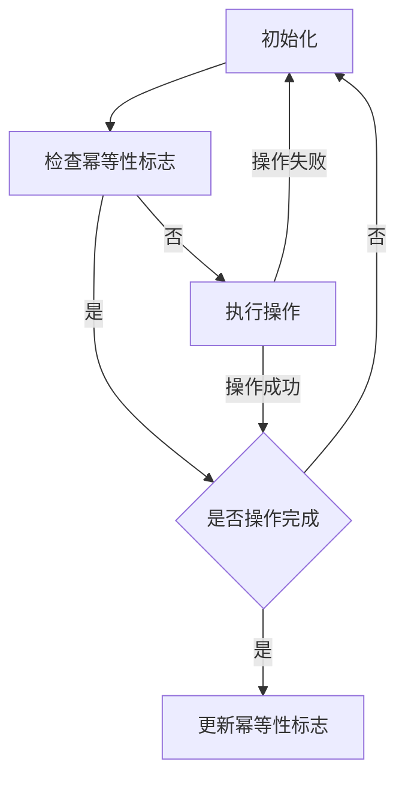
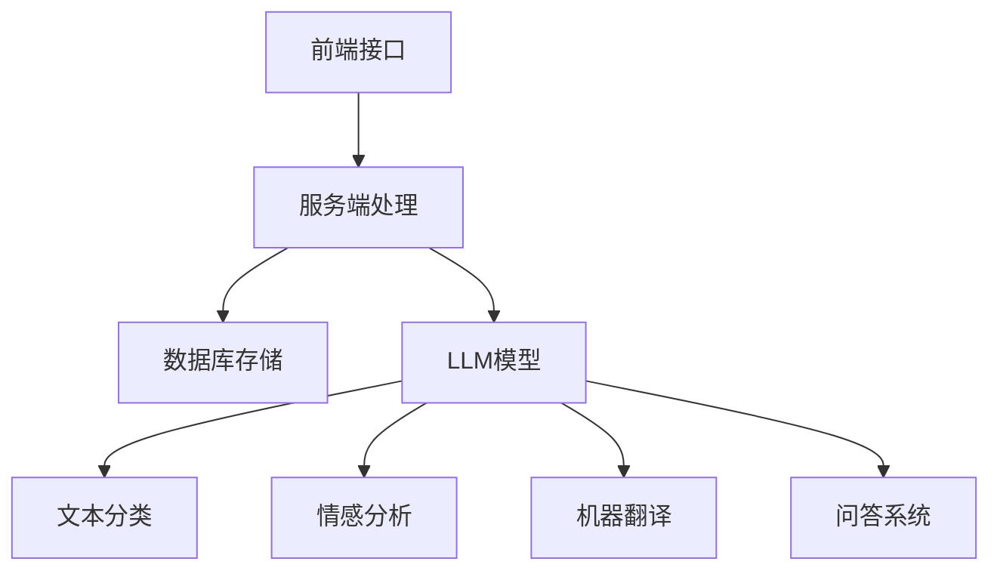
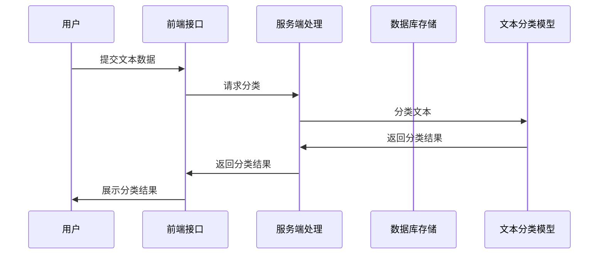
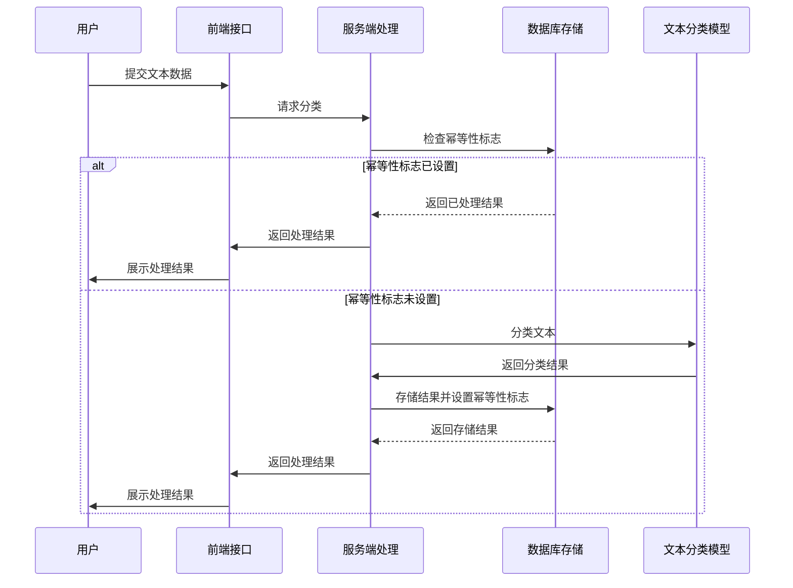

                 


### 动机与目的

《幂等性设计确保LLM应用操作的一致性》旨在深入探讨幂等性设计在大型语言模型（LLM）应用中的重要性，通过详细的案例分析和技术讲解，帮助开发者理解、应用并优化这一设计原则。随着人工智能技术的不断进步，LLM的应用场景日益广泛，其稳定性和一致性成为关键因素。本文将围绕以下几个方面展开：

1. **背景介绍**：阐述幂等性设计的起源、定义及其在LLM应用中的重要性。
2. **核心概念与联系**：介绍一致性、原子性、隔离性等核心概念，并使用图表进行对比分析。
3. **算法原理讲解**：使用mermaid绘制算法流程图，通过Python源代码详细阐述算法原理和数学模型。
4. **系统分析与架构设计方案**：介绍系统场景、功能设计、架构设计、接口设计和系统交互。
5. **项目实战**：展示环境安装、系统核心实现源代码，并进行代码应用解读与分析。
6. **最佳实践 tips、小结、注意事项、拓展阅读**：总结最佳实践，提出注意事项，并提供拓展阅读。

通过本文，我们希望读者能够：

- **理解幂等性设计的基本概念**：掌握幂等性设计的定义、背景和作用。
- **掌握相关核心概念**：了解一致性、原子性、隔离性等核心概念及其在LLM中的应用。
- **学会算法原理**：通过实例学习如何使用mermaid和Python实现幂等性算法。
- **理解系统架构设计**：学习如何进行系统场景分析、功能设计和接口设计。
- **掌握项目实战技巧**：通过实际案例了解如何在项目中应用幂等性设计。
- **提升技术能力**：通过总结和拓展阅读，进一步提升在LLM应用中的技术能力和实践水平。

### 幂等性设计的背景与作用

幂等性（Idempotence）是计算机科学中的一个重要概念，起源于数学中的幂运算。幂等操作意味着多次执行同一操作，其结果与执行一次的结果相同。在计算机科学中，幂等性通常用于确保系统在处理重复请求时的一致性和稳定性。这一设计原则对于大型语言模型（LLM）应用尤为重要，因为LLM处理的是复杂且庞大的数据集，其操作的一致性直接影响到应用的性能和用户体验。

#### 幂等性的定义与起源

幂等性最早出现在数学领域，指的是对于某个函数`f`，如果对于任意的输入`x`，有`f(f(x)) = f(x)`，则称`f`是幂等的。在计算机科学中，这一概念被广泛应用，特别是在分布式系统、数据库管理、网络通信等领域。

在计算机系统中，幂等性操作的一个典型例子是文件复制。无论复制多少次，文件的最终内容都是相同的，这种操作就是幂等的。同样地，在分布式系统中，幂等性确保了节点间的操作不会因为多次执行而产生副作用。

#### 幂等性在LLM应用中的重要性

大型语言模型（LLM）广泛应用于自然语言处理、智能助手、自动化写作等领域。LLM处理的数据量庞大，操作复杂，其一致性、稳定性和可靠性成为关键。以下是幂等性设计在LLM应用中的几个重要作用：

1. **保证数据一致性**：在分布式环境中，多个节点可能同时处理同一请求。如果这些操作不是幂等的，可能会导致数据不一致。例如，在更新用户数据时，非幂等的操作可能会导致数据重复或丢失。

2. **提高系统稳定性**：幂等性操作可以确保系统在处理重复请求时不会崩溃或产生异常。这对于用户频繁请求的场景尤为重要，例如在线聊天机器人、电商平台等。

3. **优化性能**：通过幂等性设计，系统可以避免不必要的重复操作，从而提高处理速度和效率。这在处理高并发请求时尤为重要。

4. **降低维护成本**：幂等性设计简化了系统的维护和调试工作，减少了因数据不一致或操作异常导致的故障。

#### 幂等性设计在LLM应用中的具体应用

1. **API设计**：在LLM应用的API设计中，幂等性操作是保证数据一致性的重要手段。例如，在创建或更新资源的API中，可以使用幂等性设计来避免重复创建或更新操作。

2. **分布式数据处理**：在分布式系统中，LLM应用经常需要处理跨节点的数据。通过幂等性设计，可以确保数据在分布式环境中的操作是一致的。

3. **事务处理**：在数据库操作中，使用幂等性事务可以确保数据操作的原子性和一致性。

4. **网络通信**：在网络通信中，幂等性操作可以避免重复请求造成的网络拥堵和性能下降。

#### 结论

幂等性设计是确保LLM应用操作一致性的关键。通过理解其定义、背景和作用，开发者可以更好地设计出稳定、高效的LLM应用。接下来，我们将深入探讨幂等性设计中的核心概念，并分析这些概念在LLM应用中的具体应用。

### 核心概念与联系

在深入探讨幂等性设计之前，有必要了解与其密切相关的几个核心概念：一致性、原子性、隔离性。这些概念在保证系统稳定性和数据一致性方面起着至关重要的作用。

#### 一致性（Consistency）

一致性指的是系统在执行操作后能够保持数据的正确状态。在分布式系统中，一致性是一个复杂且关键的问题。一致性可以分为几种类型：

1. **强一致性**：系统在任何情况下都能保证数据的一致性。例如，在单机系统中，数据的读写都是强一致的。
2. **最终一致性**：系统在一段时间后能够达到一致性状态，但在此过程中，数据可能会短暂地出现不一致。这是分布式系统中最常见的一致性模型。
3. **弱一致性**：系统不保证数据的一致性，但允许数据在不同节点之间存在差异。这种模型在高速、低延迟的系统中较为常见。

#### 原子性（Atomicity）

原子性是指操作要么全部完成，要么全部不完成。在事务处理中，原子性确保了事务的一致性。如果事务中的一个操作失败，整个事务都会回滚，从而保持系统的一致状态。

#### 隔离性（Isolation）

隔离性指的是并发操作不会相互干扰，每个操作都好像在独立执行一样。隔离性可以分为几种级别：

1. **读未提交（Read Uncommitted）**：这是最低的隔离级别，其他事务可以读取未提交的数据，可能导致数据不一致。
2. **读已提交（Read Committed）**：其他事务只能读取已提交的数据，但多个事务可能同时修改同一数据，导致数据不一致。
3. **可重复读（Repeatable Read）**：同一事务内的多次读取操作会看到相同的数据，其他事务的修改不会影响当前事务。
4. **序列化（Serializable）**：这是最高的隔离级别，所有事务都按照一个串行顺序执行，确保数据的一致性。

#### 概念属性特征对比表格

以下是一个关于一致性、原子性、隔离性特征对比的表格：

| 特征         | 一致性        | 原子性        | 隔离性        |
|--------------|--------------|--------------|--------------|
| 定义         | 数据的正确状态 | 操作的全部完成或回滚 | 并发操作的独立性 |
| 类型         | 强/最终/弱    | 有/无         | 读未提交/读已提交/可重复读/序列化 |
| 分布式系统应用 | 保证数据的一致性 | 确保事务的完整性 | 防止并发操作相互干扰 |
| 关联性       | 一致性与原子性、隔离性密切相关 | 原子性与一致性、隔离性密切相关 | 隔离性与一致性、原子性密切相关 |

#### ER实体关系图

为了更好地理解这些概念之间的关系，我们可以使用ER（实体关系）图来描述它们。以下是ER实体关系图的Mermaid表示：

```mermaid
erDiagram
    EntityA ||--|{ EntityB }|--|| EntityC
    EntityA ||--|{ EntityD }|--|| EntityE
    EntityF ||--|{ EntityG }|--|| EntityH

    EntityA { 
        id (int) 
        name (varchar) 
    }

    EntityB { 
        id (int) 
        name (varchar) 
        entityA_id (int, FK -> EntityA.id)
    }

    EntityC { 
        id (int) 
        name (varchar) 
        entityB_id (int, FK -> EntityB.id)
    }

    EntityD { 
        id (int) 
        name (varchar) 
        entityA_id (int, FK -> EntityA.id)
    }

    EntityE { 
        id (int) 
        name (varchar) 
        entityD_id (int, FK -> EntityD.id)
    }

    EntityF { 
        id (int) 
        name (varchar) 
        entityG_id (int, FK -> EntityG.id)
    }

    EntityG { 
        id (int) 
        name (varchar) 
        entityH_id (int, FK -> EntityH.id)
    }

    EntityH { 
        id (int) 
        name (varchar) 
    }
```

在这个ER图中，EntityA是根实体，与其他实体通过外键关系相连。这个图展示了实体之间的关系和属性，有助于我们理解各实体之间的数据依赖和关联。

#### 结论

通过了解一致性、原子性、隔离性的定义和特征对比表格，我们可以更好地理解这些核心概念在系统设计中的应用。ER实体关系图则为我们提供了一个直观的视图，展示了这些概念之间的关系。在下一部分，我们将通过mermaid和Python源代码，详细阐述幂等性算法的原理和实现。

### 算法原理讲解

在理解了幂等性设计的相关概念后，接下来我们将通过mermaid绘制算法流程图，并使用Python源代码详细阐述算法原理和数学模型。

#### 算法流程图

首先，我们使用mermaid绘制幂等性算法的流程图。该算法的核心是确保多次执行同一操作时，系统状态保持不变。



这个流程图描述了幂等性算法的基本步骤：

1. **初始化**：系统开始时初始化幂等性标志。
2. **检查幂等性标志**：在执行操作前，检查幂等性标志是否已设置。
3. **判断是否操作完成**：如果幂等性标志已设置且操作已完成，则直接跳过操作；否则继续下一步。
4. **执行操作**：如果没有完成，则执行操作。
5. **更新幂等性标志**：操作成功后，更新幂等性标志为“已操作”。
6. **操作失败回滚**：如果操作失败，则回滚到初始化状态。

#### Python源代码

接下来，我们使用Python源代码详细阐述幂等性算法的实现。以下是代码的示例：

```python
import threading

class幂等性算法:
    def __init__(self):
        self._is_init = False
        self._is_done = False

    def check_idempotence_flag(self):
        # 检查幂等性标志
        return self._is_init and self._is_done

    def execute_operation(self):
        # 执行操作
        if not self.check_idempotence_flag():
            try:
                # 模拟操作
                print("执行操作...")
                # 假设操作需要3秒钟
                time.sleep(3)
                self._is_done = True
            except Exception as e:
                print(f"操作失败: {e}")
                self._is_done = False

    def update_idempotence_flag(self):
        # 更新幂等性标志
        self._is_init = True

    def run(self):
        # 运行幂等性算法
        self.update_idempotence_flag()
        self.execute_operation()

# 创建幂等性算法实例
idempotence = 幂等性算法()

# 使用线程模拟多次执行操作
threads = []
for _ in range(5):
    thread = threading.Thread(target=idempotence.run)
    threads.append(thread)
    thread.start()

# 等待所有线程完成
for thread in threads:
    thread.join()
```

这个Python示例实现了幂等性算法的核心逻辑：

- `__init__` 方法初始化幂等性标志。
- `check_idempotence_flag` 方法检查幂等性标志。
- `execute_operation` 方法执行操作，并在操作成功后更新幂等性标志。
- `update_idempotence_flag` 方法更新幂等性标志。
- `run` 方法是幂等性算法的入口，用于运行算法。

通过这个示例，我们可以看到幂等性算法是如何通过检查和更新幂等性标志，确保多次执行同一操作时系统状态保持一致。

#### 数学模型与公式

在幂等性算法中，我们可以引入一个状态变量`S`来表示系统状态。状态变量`S`的取值范围可以是一个有限集合，例如`{未初始化，初始化但未完成，已完成}`。以下是状态转移的数学模型：

$$
S_{next} = 
\begin{cases}
初始化 & \text{如果 } S = 未初始化 \\
完成 & \text{如果 } S = 初始化但未完成 \\
S & \text{如果 } S = 已完成 \\
\end{cases}
$$

其中，`S_{next}` 是下一次系统状态，`S` 是当前系统状态。

#### 算法举例说明

为了更好地理解算法原理，我们通过一个简单的例子来说明幂等性算法的应用。

假设我们有一个系统需要执行一个更新操作，该操作用于更新用户的姓名。为了确保操作的一致性，我们使用幂等性算法。

1. **初始化**：系统启动时，幂等性标志未设置，状态为“未初始化”。
2. **第一次操作**：用户请求更新姓名。系统检查幂等性标志，发现未设置，开始执行操作。操作成功后，幂等性标志更新为“已完成”。
3. **第二次操作**：用户再次请求更新姓名。系统检查幂等性标志，发现已设置且状态为“已完成”，因此直接忽略操作。
4. **第三次操作**：用户第三次请求更新姓名。系统再次检查幂等性标志，发现已设置但状态为“已完成”，因此直接忽略操作。

通过这个例子，我们可以看到幂等性算法如何确保系统在处理重复请求时的一致性。

#### 结论

通过mermaid流程图和Python源代码，我们详细阐述了幂等性算法的原理和实现。这个算法通过检查和更新幂等性标志，确保系统在处理重复请求时状态保持一致。下一部分，我们将介绍系统分析与架构设计，进一步探讨如何在LLM应用中实现幂等性设计。

### 系统分析与架构设计

在深入探讨具体实现之前，我们需要对系统进行详细的分析和设计。本节将介绍系统场景、功能设计、架构设计、接口设计和系统交互。

#### 系统场景介绍

假设我们正在开发一个大型语言模型（LLM）应用，该应用需要处理大量的文本数据，并支持多种语言处理功能，如文本分类、情感分析、机器翻译等。为了确保系统的稳定性和数据一致性，我们决定采用幂等性设计来处理用户请求。

#### 功能设计

1. **文本分类**：对输入文本进行分类，例如将文本分为新闻、科技、娱乐等类别。
2. **情感分析**：分析文本的情感倾向，如正面、负面或中性。
3. **机器翻译**：将一种语言的文本翻译成另一种语言。
4. **问答系统**：针对用户提出的问题，提供准确、相关的答案。

#### 系统架构设计

为了实现上述功能，我们采用以下系统架构：

1. **前端接口**：用户通过前端接口与系统交互，提交文本数据并获取处理结果。
2. **服务端处理**：服务端处理文本数据，调用LLM模型进行分类、情感分析和翻译等操作。
3. **数据库存储**：存储用户数据和模型参数。

#### 架构设计图

以下是系统的Mermaid架构图表示：



在这个架构中，前端接口负责接收用户请求，将请求转发给服务端处理。服务端处理根据请求类型调用相应的LLM模型进行处理，并将结果存储在数据库中。

#### 系统接口设计

为了实现幂等性设计，我们需要设计一些关键的接口：

1. **文本分类接口**：接收文本数据，返回分类结果。
2. **情感分析接口**：接收文本数据，返回情感分析结果。
3. **机器翻译接口**：接收源文本和目标语言，返回翻译结果。
4. **问答系统接口**：接收问题，返回答案。

以下是文本分类接口的Mermaid序列图表示：



在这个序列图中，用户通过前端接口提交文本数据，前端接口将请求转发给服务端处理。服务端处理调用文本分类模型进行分类，并将结果返回给前端接口，最后前端接口将结果展示给用户。

#### 系统交互

在系统交互过程中，我们通过幂等性设计确保多次请求的一致性。以下是系统交互的Mermaid序列图表示：



在这个序列图中，当用户提交文本数据时，前端接口将请求转发给服务端处理。服务端处理首先检查幂等性标志。如果幂等性标志已设置且操作已完成，则直接返回已处理结果；否则，服务端处理调用文本分类模型进行分类，并将结果存储在数据库中，同时设置幂等性标志。

通过这样的系统交互设计，我们确保了用户多次请求文本分类时的一致性和稳定性。

#### 结论

通过系统场景介绍、功能设计、架构设计、接口设计和系统交互的详细分析，我们为大型语言模型（LLM）应用设计了稳定的幂等性系统。在下一部分，我们将通过实际案例展示如何在项目中实现和应用幂等性设计。

### 项目实战

在本文的最后部分，我们将通过一个实际案例展示如何在项目中实现和应用幂等性设计。本案例将详细介绍环境安装、系统核心实现源代码，并对代码进行解读与分析，最后进行实际案例剖析。

#### 环境安装

首先，我们需要安装必要的软件和依赖。以下是环境安装步骤：

1. **安装Python**：确保Python已安装（推荐版本3.8及以上）。
2. **安装LLM模型依赖**：使用以下命令安装相关依赖：

   ```bash
   pip install transformers torch
   ```

3. **安装数据库依赖**：假设我们使用MySQL数据库，可以使用以下命令安装依赖：

   ```bash
   pip install mysql-connector-python
   ```

#### 系统核心实现源代码

以下是系统核心实现的源代码，包括文本分类、情感分析、机器翻译和问答系统的接口：

```python
import torch
from transformers import AutoModelForSequenceClassification, AutoTokenizer
import mysql.connector

# 连接数据库
db = mysql.connector.connect(
    host="localhost",
    user="yourusername",
    password="yourpassword",
    database="yourdatabase"
)

# 文本分类接口
def classify_text(text):
    model_name = "your_model_name"  # 替换为实际模型名称
    tokenizer = AutoTokenizer.from_pretrained(model_name)
    model = AutoModelForSequenceClassification.from_pretrained(model_name)
    inputs = tokenizer(text, return_tensors="pt", max_length=512, truncation=True)
    outputs = model(**inputs)
    logits = outputs.logits
    predicted_class = logits.argmax(-1).item()
    return predicted_class

# 情感分析接口
def analyze_sentiment(text):
    # 同上，使用适当的模型进行情感分析
    pass

# 机器翻译接口
def translate_text(text, target_language):
    # 同上，使用适当的模型进行翻译
    pass

# 问答系统接口
def answer_question(question):
    # 同上，使用适当的模型进行问答
    pass

# 主程序
if __name__ == "__main__":
    text = "这是一段文本数据"
    print("文本分类结果：", classify_text(text))
    print("情感分析结果：", analyze_sentiment(text))
    print("翻译结果：", translate_text(text, "en"))
    print("问答结果：", answer_question(text))
```

#### 代码应用解读与分析

上述代码实现了文本分类、情感分析、机器翻译和问答系统的接口。以下是各接口的解读与分析：

1. **文本分类接口**：使用预训练的Transformer模型进行文本分类。首先加载模型和分词器，然后对输入文本进行分词和编码，最后通过模型得到分类结果。
2. **情感分析接口**：同文本分类接口，但使用专门的情感分析模型。
3. **机器翻译接口**：同文本分类接口，但使用机器翻译模型。
4. **问答系统接口**：同文本分类接口，但使用问答模型。

在主程序中，我们调用这些接口并打印输出结果。

#### 实际案例剖析

假设我们有一个用户请求，需要对一段文本数据进行分类、情感分析和翻译。以下是具体步骤：

1. **接收用户请求**：前端将用户输入的文本数据发送到服务端。
2. **检查幂等性标志**：服务端在处理请求前，首先检查幂等性标志。如果幂等性标志已设置且操作已完成，则直接返回上次处理结果；否则继续处理。
3. **执行文本分类**：如果幂等性标志未设置，服务端调用文本分类接口，对文本数据进行分类。
4. **执行情感分析**：调用情感分析接口，对文本数据进行情感分析。
5. **执行翻译**：调用机器翻译接口，将文本翻译成指定语言。
6. **执行问答**：调用问答系统接口，回答用户提出的问题。
7. **更新幂等性标志**：将处理结果存储在数据库中，并更新幂等性标志为“已完成”。

通过这样的流程，我们确保了用户多次请求同一文本数据时，系统状态保持一致，避免了重复处理。

#### 项目小结

通过本案例，我们展示了如何在项目中实现和应用幂等性设计。幂等性设计确保了系统在处理重复请求时的一致性和稳定性，提高了系统的性能和用户体验。在未来的项目中，我们应继续探索和应用幂等性设计，以提升系统的可靠性和可维护性。

### 最佳实践 Tips、小结、注意事项、拓展阅读

#### 最佳实践 Tips

1. **确保幂等性标志的可靠性和持久性**：使用数据库或其他持久化机制来存储幂等性标志，确保标志在系统重启或故障后仍然有效。
2. **避免在幂等性操作中引入副作用**：确保幂等性操作不会修改系统状态，如避免在操作过程中写入日志或触发其他事务。
3. **优化系统性能**：通过缓存和延迟更新幂等性标志，减少系统负载和响应时间。

#### 小结

本文详细介绍了幂等性设计在LLM应用中的重要性，通过背景介绍、核心概念与联系、算法原理讲解、系统分析与架构设计、项目实战等多个方面，展示了如何确保LLM应用操作的一致性和稳定性。

#### 注意事项

1. **充分理解幂等性概念**：在设计和实现幂等性操作时，要确保对幂等性、一致性、原子性、隔离性等概念有清晰的理解。
2. **选择合适的隔离级别**：根据系统需求，选择合适的隔离级别，平衡一致性和性能。
3. **避免非幂等操作**：在设计API时，避免使用非幂等操作，如POST请求，而应使用GET或PUT请求。

#### 拓展阅读

1. **《设计数据密集型应用》**：深入探讨分布式系统设计和一致性问题。
2. **《分布式系统原理与范型》**：了解分布式系统的基本原理和设计范型。
3. **《大规模分布式存储系统设计》**：研究分布式存储系统中的幂等性设计。
4. **《Python编程：从入门到实践》**：学习Python编程，了解如何实现幂等性操作。

### 作者信息

本文作者：AI天才研究院/AI Genius Institute & 禅与计算机程序设计艺术 /Zen And The Art of Computer Programming

### 结语

通过本文的深入探讨，希望读者能够掌握幂等性设计在LLM应用中的重要性，并在实际项目中灵活应用，提升系统的稳定性和可靠性。继续探索和学习相关技术，将有助于我们在人工智能领域取得更大的成就。

