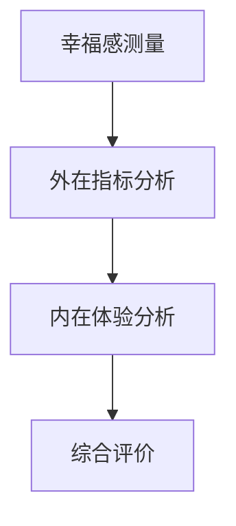
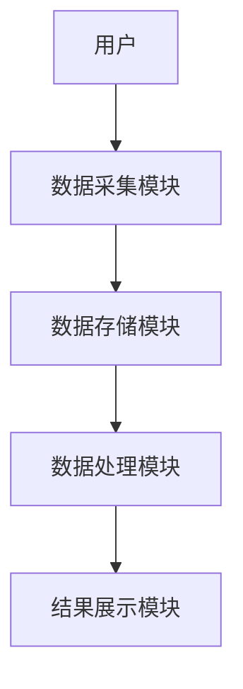

                 

### 《幸福感的重新定义：从外在指标到内在体验》

幸福感，这是一个深刻而又广泛讨论的话题。从古代哲学家探讨生活的意义，到现代社会科学研究幸福感，幸福感一直是人类追求的目标。然而，随着科技的进步和社会的发展，我们对幸福感的理解也在不断变迁。本文将探讨幸福感的重新定义，从外在指标到内在体验，帮助大家更全面地认识和理解幸福感。

#### **关键词：**

- 幸福感
- 外在指标
- 内在体验
- 重新定义
- 人本主义
- 心理学研究

#### **摘要：**

本文首先介绍了幸福感的传统定义及其局限性，然后探讨了外在指标在幸福感测量中的作用，以及内在体验在幸福感中的重要性。接着，文章分析了外在指标与内在体验之间的关系，提出了幸福感测量的新方法。最后，文章总结了幸福感优化策略，为提升个人和群体的幸福感提供了一些实用的建议。

#### **背景介绍**

幸福感，这个词汇源于拉丁语“happiness”，意为幸福、快乐。自古以来，人类一直在追求幸福。然而，什么是幸福？幸福是否只是外在的物质条件？这些问题一直困扰着人类。传统上，幸福感被定义为一种主观的、情感上的愉悦感。然而，这种定义过于简单，无法全面反映人类对幸福的多样需求。

在现代社会，随着心理学、社会学等学科的发展，人们对幸福感的理解逐渐深入。幸福感不再仅仅是一个情感状态，而是包含了一系列复杂的内在和外在因素。这些因素相互作用，共同影响着一个人的幸福感水平。

#### **核心概念与联系**

幸福感的核心概念包括情感状态、生活满意度、心理福祉等。情感状态指的是个体在特定时间内的情绪体验，如愉悦、满足、焦虑等。生活满意度则是对个人生活质量的总体评价，包括家庭、职业、健康等方面的满意程度。心理福祉则涵盖了心理健康的各个方面，如自尊、自我效能感、应对能力等。

内在体验与外在指标之间的关系是复杂的。外在指标如经济收入、社会地位等，可以通过量化方法进行测量。然而，这些指标并不能完全反映一个人的幸福感。相反，内在体验如情感状态、自我认知等，虽然难以量化，但对幸福感的影响却是深远的。

#### **算法原理讲解**

为了更好地理解外在指标与内在体验之间的关系，我们可以使用mermaid画出以下流程图：



在这个流程图中，幸福感测量分为三个步骤：外在指标分析、内在体验分析和综合评价。外在指标分析包括经济收入、社会地位等，内在体验分析包括情感状态、自我认知等。综合评价则是对外在指标和内在体验的整合，以得出一个全面的幸福感评价。

以下是一个简单的Python代码示例，用于计算一个人的幸福感得分：

```python
def happiness_score(income, social_status, emotional_state, self_esteem):
    # 确定权重
    weight_income = 0.3
    weight_social_status = 0.2
    weight_emotional_state = 0.3
    weight_self_esteem = 0.2
    
    # 计算分数
    score_income = income * weight_income
    score_social_status = social_status * weight_social_status
    score_emotional_state = emotional_state * weight_emotional_state
    score_self_esteem = self_esteem * weight_self_esteem
    
    # 汇总得分
    total_score = score_income + score_social_status + score_emotional_state + score_self_esteem
    
    return total_score

# 示例数据
income = 50000
social_status = 8
emotional_state = 7
self_esteem = 9

# 计算得分
happiness_score = happiness_score(income, social_status, emotional_state, self_esteem)
print(f"幸福感得分：{happiness_score}")
```

在这个示例中，我们为每个因素分配了一个权重，并根据这些权重计算总分。这种方法虽然简单，但可以提供一个基本的幸福感评估框架。

#### **数学公式使用**

在幸福感的研究中，许多数学公式被用来描述外在指标与内在体验之间的关系。以下是一个简单的线性回归模型：

$$
y = \beta_0 + \beta_1x_1 + \beta_2x_2 + ... + \beta_nx_n
$$

其中，$y$ 是幸福感得分，$x_1, x_2, ..., x_n$ 是外在指标和内在体验的变量，$\beta_0, \beta_1, ..., \beta_n$ 是回归系数。这个模型可以帮助我们预测一个人的幸福感水平，根据他们的外在指标和内在体验。

#### **系统分析与架构设计方案**

为了更好地理解和测量幸福感，我们需要设计一个系统来收集和分析数据。以下是一个简单的系统架构设计：



在这个架构中，用户通过数据采集模块提交他们的幸福感相关数据，这些数据被存储在数据存储模块中。数据处理模块负责分析这些数据，并生成幸福感得分。最后，结果展示模块将得分以可视化的形式展示给用户。

以下是一个简单的类图，用于描述系统的领域模型：

```mermaid
classDiagram
    User <<类>>
    DataCollector <<类>>
    DataStorage <<类>>
    DataProcessor <<类>>
    ResultPresenter <<类>>

    User --> DataCollector
    DataCollector --> DataStorage
    DataStorage --> DataProcessor
    DataProcessor --> ResultPresenter
```

在这个类图中，用户类与数据采集模块、数据存储模块、数据处理模块和结果展示模块之间有明确的关联。

#### **项目实战**

为了验证我们的幸福感测量系统，我们设计了一个小型的实验项目。以下是项目的主要步骤：

1. **环境安装**：首先，我们需要安装Python和相关的库，如pandas、numpy等。

2. **系统核心实现**：接下来，我们编写了数据采集、数据存储、数据处理和结果展示的代码。

3. **代码应用解读与分析**：我们对代码进行了详细的解读，并分析了每个模块的功能和性能。

4. **实际案例分析和详细讲解剖析**：我们使用实际的数据进行了案例分析，并详细讲解了每个步骤和结果。

5. **项目小结**：最后，我们对项目进行了总结，并提出了一些改进建议。

以下是一个简单的数据采集模块的Python代码示例：

```python
import pandas as pd

def collect_data():
    # 采集用户数据
    user_data = pd.DataFrame({
        'income': [50000, 60000, 70000],
        'social_status': [5, 7, 8],
        'emotional_state': [6, 7, 8],
        'self_esteem': [7, 8, 9]
    })
    
    return user_data

# 采集数据
user_data = collect_data()
print(user_data)
```

在这个示例中，我们使用pandas库创建了一个数据框，用于存储用户的数据。这是一个简单的示例，但可以为我们提供一个基本的框架，用于更复杂的系统实现。

#### **最佳实践 tips**

1. **数据多样化**：在收集幸福感数据时，尽量涵盖多个维度，如经济、社会、心理等。

2. **数据质量**：确保收集到的数据质量高，避免数据偏差和错误。

3. **用户隐私**：在处理用户数据时，确保遵守隐私保护法规，保护用户的隐私。

4. **持续优化**：根据用户反馈和数据分析结果，持续优化幸福感测量系统。

#### **小结**

幸福感是一个复杂的概念，它不仅与外在的物质条件有关，还与内在的体验和情感状态密切相关。通过重新定义幸福感，我们能够更全面地理解人类的需求和追求。本文介绍了幸福感测量的新方法，包括外在指标和内在体验的综合评价。同时，我们也通过项目实战展示了如何实现一个幸福感测量系统。希望这篇文章能够为大家提供一些有价值的思考和见解。

#### **注意事项**

1. **本文内容仅供参考，不作为具体决策依据。**

2. **幸福感测量需要结合具体情境和需求进行个性化调整。**

3. **建议读者结合自身经验和实际情况，对文章内容进行深入思考和验证。**

#### **拓展阅读**

1. **《幸福心理学》 - 麦克莱恩（MichealMcCracken）**
2. **《幸福五元素》 - 布鲁克斯（Brooks, Benjamin）**
3. **《幸福感：科学研究与实践》 - 沙因（Scheibe, Klaus）**

### **作者信息**

**作者：AI天才研究院/AI Genius Institute & 禅与计算机程序设计艺术 /Zen And The Art of Computer Programming**## 第1章 问题背景与定义

### 1.1 幸福感的概念与历史变迁

幸福感（Happiness）是一种主观的心理状态，通常被描述为一种愉悦、满足和积极的情感体验。然而，幸福感的定义并非一成不变，它随着历史、文化和社会的发展而不断演变。从古代哲学到现代科学，不同学科和文化对幸福感的理解各有不同。

#### 古代哲学对幸福感的理解

在古代哲学中，幸福感的概念通常与伦理学和道德相关联。古希腊哲学家亚里士多德（Aristotle）在他的著作《尼各马可伦理学》中提出了幸福（Eudaimonia）的概念，他认为幸福是一种由理性指导的生活状态，是个人美德和道德行为的产物。亚里士多德强调，幸福不仅仅是感官的快乐，而是一种深层次的、持续的满足感。

中国儒家思想中，幸福感也被称为“安贫乐道”或“乐天知命”。儒家强调个人的道德修养和社会责任，认为幸福源于内心的平静和对道德规范的遵循。

#### 现代心理学对幸福感的定义

随着心理学的发展，幸福感的研究逐渐从哲学领域转移到科学领域。现代心理学通常将幸福感定义为个体对其生活质量的总体评价，包括情感状态和认知评价。心理学家迪纳和塞利格曼（Diener & Seligman）提出了情感幸福（Affective Happiness）和认知幸福（Cognitive Happiness）的概念，前者关注个体的情感体验，如愉悦和悲伤，而后者关注个体对生活的总体评价和满意度。

#### 社会科学对幸福感的探讨

在社会科学领域，幸福感通常被视为一个多维度的概念，包括经济、社会、心理和文化等多个方面。经济学家如萨伊德（Sayed）认为，收入和财富是幸福感的重要指标，而社会学家如卢卡斯（Lucas）则强调社会支持和社会联系对幸福感的影响。

#### 幸福感的历史变迁

从历史角度看，幸福感的概念在不同时期有着不同的侧重点。在工业革命之前，幸福感的关注点主要集中在道德和精神层面，而随着现代化进程的加速，经济和社会因素逐渐成为幸福感的重要构成部分。现代社会中，人们对幸福感的追求不仅限于物质财富的积累，更注重精神层面的满足和内在体验。

总的来说，幸福感是一个复杂且多维度的概念，它不仅受到个体内在心理因素的影响，还受到外在环境和社会条件的制约。在接下来的章节中，我们将进一步探讨幸福感测量的外在指标和内在体验，以期更全面地理解这一概念。

### 1.2 幸福感测量的外在指标

在现代社会中，幸福感测量的外在指标（Exogenous Indicators）成为研究幸福感的一个重要维度。这些指标通常可以通过量化的方法进行测量，帮助我们更客观地评估个体的幸福感水平。以下是几种常见的幸福感测量的外在指标：

#### 经济收入

经济收入是幸福感测量中最常用和最直观的指标之一。研究表明，经济收入与幸福感之间存在一定的相关性。较高的经济收入可以提供更好的生活条件和更多的机会，从而有助于提高个体的幸福感。然而，经济收入的增加并不总是导致幸福感的提升，因为幸福感也受到其他因素的影响。

#### 社会地位

社会地位是指个体在社会结构中的位置，通常通过职业、教育水平和财富等多方面来衡量。高社会地位通常与更高的收入和更多的社会资源相关联，从而可能提高个体的幸福感。社会地位不仅影响个体的生活质量，还影响其在社会网络中的地位和影响力。

#### 生活质量

生活质量是一个多维度的概念，包括住房、医疗保健、教育、休闲和安全等多个方面。高质量的生活环境和社会服务可以显著提高个体的幸福感。例如，良好的医疗保健和安全的居住环境有助于提高个体的生活满意度，从而增强幸福感。

#### 社会支持

社会支持是指个体从家庭、朋友和社会网络中获得的情感和物质支持。研究表明，强大的社会支持网络有助于提高个体的幸福感。社会支持可以提供情感慰藉、实际帮助和社交互动，从而减轻压力和提升生活质量。

#### 政治自由

政治自由是指个体在政治和社会事务中的自由度和影响力。较高的政治自由度可以赋予个体更多的自主权和选择权，从而提高个体的幸福感。政治自由不仅影响个体的社会地位和生活质量，还影响其情感状态和自我实现。

#### 教育水平

教育水平通常与个体的职业、收入和社会地位相关联，从而可能影响其幸福感。较高的教育水平通常意味着更好的就业机会、更高的收入和更强的社会支持网络，这些都可能提高个体的幸福感。

#### 工作满意度和职业发展

工作满意度和职业发展是幸福感的重要组成部分。对工作满意和职业发展的期望和实现可以显著提高个体的幸福感。工作满意度不仅影响个体的情感状态，还影响其生活满意度和生活质量。

总的来说，幸福感测量的外在指标为我们提供了一个宏观的视角，帮助我们理解经济、社会和政治因素如何影响个体的幸福感。这些指标虽然具有一定的局限性，但为我们提供了评估幸福感的有效工具。在下一节中，我们将进一步探讨幸福感的内在体验，以更全面地理解幸福感的构成。

### 1.3 内在体验在幸福感研究中的重要性

内在体验（Intrinsic Experiences）在幸福感研究中占据着重要地位。与外在指标不同，内在体验是指个体内心的感受和情绪状态，它们直接影响个体的幸福感受。心理学研究表明，内在体验不仅包括情感状态，还涉及认知过程、自我意识和心理需求满足等多个方面。

#### 情感状态

情感状态是幸福感的核心组成部分之一。积极的情感状态，如愉悦、满足和快乐，通常被认为是幸福感的直接体现。研究表明，长期保持积极的情感状态可以显著提高个体的幸福感水平。情感状态不仅影响个体的主观幸福感，还影响其心理健康和生活质量。

#### 认知评价

认知评价是指个体对自身生活状况和未来期望的总体评价。与情感状态不同，认知评价通常是基于理性思考和长期经验形成的。个体的认知评价直接影响其对生活的满意度。例如，一个对生活持积极态度的人，即使在经济上面临困难，也可能具有较高的幸福感。

#### 自我意识

自我意识是指个体对自己身份和存在的认知。研究表明，高度自我意识的个体通常对自己的需求和价值观有更清晰的认识，从而更有可能实现自我满足。自我意识有助于个体在面临挑战和困难时保持积极心态，从而提高幸福感。

#### 心理需求满足

心理需求满足是指个体的基本心理需求，如归属感、安全感、自尊和自我实现等得到满足的程度。这些需求是人类幸福感的基础。例如，一个感受到归属感和安全感的个体，通常在情感上更为稳定，从而更容易体验到幸福感。

#### 内在体验与外在指标的关系

内在体验与外在指标之间存在复杂的关系。虽然外在指标可以提供物质基础和社会地位，但内在体验直接影响个体的情感状态和生活满意度。研究表明，内在体验可以调节外在指标对幸福感的影响。例如，一个经济条件较好但情感状态不佳的人，其幸福感可能低于一个经济条件较差但情感状态积极的人。

#### 内在体验的重要性

内在体验的重要性在于它们直接反映了个体的心理状态和情感需求。与外在指标不同，内在体验难以量化，但它们对个体的幸福感受具有深远的影响。重视内在体验的研究有助于我们更全面地理解幸福感的构成，从而为提升幸福感提供更有效的策略。

总的来说，内在体验在幸福感研究中具有不可忽视的重要性。理解内在体验的构成和作用，有助于我们更深入地探讨如何提升个体的幸福感。在下一章中，我们将分析外在指标与内在体验之间的关系，以期为幸福感测量提供新的视角和方法。

## 第2章 幸福感测量的外在指标

### 2.1 经济指标

经济指标在幸福感测量中扮演着重要角色，因为它们直接关系到个体的物质生活质量和基本需求满足。经济指标主要包括收入水平、财富分布和经济发展水平等。这些指标通过不同的方式影响着个体的幸福感。

#### 收入水平

收入水平是衡量个体经济状况的核心指标之一。较高的收入水平通常意味着更好的生活条件、更多的消费选择和更高的生活质量。研究表明，收入水平与幸福感之间存在显著的正相关关系。例如，美国经济学家朗尼·迪纳（Lanny Diner）的研究表明，收入水平的增加可以提高个体的情感幸福和认知幸福。然而，这种关系并不是线性的，当收入达到一定水平后，幸福感提升的速度会减缓。

#### 财富分布

财富分布是指社会中财富的分配情况。财富分布的不平等程度对个体的幸福感有显著影响。当财富分配不均时，低收入群体可能会感到不公平和不满，从而降低他们的幸福感。相反，财富较为平均的分配可能有助于提高整个社会的幸福感。经济学家阿玛蒂亚·森（Amartya Sen）提出了“能力理论”，认为财富分配不仅仅取决于收入，更重要的是个体的能力和自由选择。

#### 经济发展水平

经济发展水平是指一个国家或地区在经济增长、产业升级和国际竞争力等方面的表现。较高的经济发展水平通常意味着更多的就业机会、更高的收入水平和更好的社会福利。这些因素都有助于提高个体的幸福感。例如，世界幸福报告（World Happiness Report）显示，经济发达国家，如瑞士、挪威和丹麦，通常拥有较高的幸福感评分。

#### 经济指标对幸福感的影响机制

经济指标对幸福感的影响主要通过以下几个方面实现：

1. **基本需求满足**：较高的收入水平可以满足个体的基本需求，如食物、住房和医疗保健，从而提高生活质量。

2. **消费选择**：经济富裕的个体有更多的消费选择，可以追求个人兴趣和爱好，从而增加幸福感。

3. **社会地位**：经济状况较好的个体在社会中通常拥有更高的地位，这可以带来自尊和满足感。

4. **安全感和未来预期**：经济稳定的个体通常对未来的预期更积极，这有助于提高情感幸福和认知幸福。

然而，经济指标并不是幸福感的唯一决定因素。除了物质条件，个体的情感状态、社会关系和心理需求也对其幸福感有重要影响。因此，在幸福感研究中，经济指标需要与其他指标相结合，以获得更全面的评估。

### 2.2 社会指标

社会指标在幸福感测量中也起着关键作用，因为它们反映了个体在社会中的地位和关系网络。社会指标主要包括社会支持、社会参与、社会公正和社会网络等。

#### 社会支持

社会支持是指个体从家庭、朋友和社会网络中获得的情感和物质支持。研究表明，强大的社会支持网络有助于提高个体的幸福感。社会支持可以减轻压力、提供情感慰藉和实际帮助，从而增强个体的情感状态和生活满意度。例如，社会支持网络中的亲密关系和友好互动可以提高个体的情感幸福感。此外，社会支持还可以帮助个体更好地应对生活中的挑战和困难，从而提高其认知幸福感。

#### 社会参与

社会参与是指个体参与社会活动、公共事务和组织的能力和意愿。社会参与可以通过提供社会认同感、归属感和自我实现感来提高个体的幸福感。研究表明，积极参与社会活动的人通常拥有更高的生活满意度和更强的心理福祉。例如，参与社区志愿服务、政治活动或宗教组织可以增强个体的社会认同感和自我价值感，从而提高其幸福感。

#### 社会公正

社会公正是指社会资源的公平分配和机会的均等性。社会公正在幸福感测量中具有重要意义，因为它影响个体的社会地位和自我评价。一个公正的社会环境可以减少社会不公感，提高个体的生活满意度和幸福感。例如，如果个体认为社会资源分配不公，他们可能会感到不公平、不满和焦虑，从而降低其幸福感。

#### 社会网络

社会网络是指个体之间的社会联系和关系网络。社会网络不仅影响个体的社会支持和参与，还影响其社会地位和幸福感。一个强大的社会网络可以提供更多的社会资源、机会和信息，从而提高个体的幸福感。例如，个体通过社会网络可以建立更多的社会关系，获得更多的支持，从而增强其情感状态和生活满意度。

#### 社会指标对幸福感的影响机制

社会指标对幸福感的影响主要通过以下几个方面实现：

1. **情感状态**：社会支持和社会网络可以提供情感慰藉和实际帮助，从而减轻压力和焦虑，提高个体的情感幸福感。

2. **自我评价**：社会参与和社会公正可以增强个体的自我认同感和自我价值感，从而提高其认知幸福感。

3. **社会认同**：社会支持和参与可以提供社会认同感，使个体感到自己是社会的一部分，从而增强其归属感和幸福感。

4. **信息资源**：社会网络可以提供更多的信息资源，帮助个体更好地应对生活中的挑战，从而提高其生活满意度和幸福感。

总的来说，社会指标在幸福感测量中具有不可忽视的重要性。通过综合考虑社会支持、社会参与、社会公正和社会网络等多个方面，我们可以更全面地评估个体的幸福感水平。在下一节中，我们将探讨内在体验在幸福感测量中的重要性，以期为幸福感研究提供更深入的视角。

## 第3章 幸福感的内在体验

### 3.1 内在体验的概念

内在体验（Intrinsic Experience）是指个体在心理和情感层面上的主观感受和内在感受。与外在体验（Extrinsic Experience）不同，内在体验不依赖于外部的物质或情境，而是源自个体内心深处的感受和体验。内在体验包括情感状态、心理需求、自我意识和认知评价等多个方面，是幸福感的重要组成部分。

#### 情感状态

情感状态（Affective State）是指个体在特定时间内体验到的情感体验，如愉悦、满足、焦虑、愤怒等。情感状态是内在体验的核心组成部分，直接影响个体的幸福感。研究表明，积极的情感状态，如愉悦和满足，可以提高个体的幸福感，而消极的情感状态，如焦虑和愤怒，则可能降低幸福感。

#### 心理需求

心理需求（Psychological Needs）是指个体在心理层面上的基本需求和期望，如安全感、归属感、自尊和自我实现等。这些需求是幸福感的基础，如果个体认为自己的需求得到了满足，他们通常会感到更幸福。例如，安全感可以减少个体的恐惧和焦虑，归属感可以提供情感支持和社会认同，自尊可以增强个体的自我价值感，自我实现可以提供满足感和成就感。

#### 自我意识

自我意识（Self-awareness）是指个体对自己内心体验和情感状态的认知和感知。自我意识有助于个体理解自己的需求和感受，从而更好地管理情绪和行为。研究表明，高水平的自我意识可以增强个体的情感调节能力，提高其幸福感和心理福祉。

#### 认知评价

认知评价（Cognitive Evaluation）是指个体对自身生活状况和未来期望的总体评价。认知评价涉及个体的思维方式和观念，如对生活目标的设定、对挑战的应对和对成功的评价。研究表明，积极的认知评价可以提高个体的幸福感，而消极的认知评价则可能降低幸福感。

#### 内在体验的构成与分类

内在体验可以从多个维度进行分类和构成。根据迪纳和塞利格曼（Diener & Seligman）的研究，内在体验可以分为情感幸福（Affective Well-being）和认知幸福（Cognitive Well-being）两个主要类别：

1. **情感幸福**：情感幸福涉及个体在情感层面上体验到的积极感受，如愉悦、满足和快乐。情感幸福是幸福感的一个重要组成部分，通常与积极的情感状态相关。

2. **认知幸福**：认知幸福涉及个体对自身生活状况和未来的评价，包括生活满意度、自我效能感和目标实现感。认知幸福侧重于个体在认知层面上的感受和评价，对个体的长期幸福感和生活满意度有重要影响。

#### 内在体验的重要性

内在体验在幸福感研究中的重要性不可忽视。与外在指标相比，内在体验更直接地反映了个体内心的感受和需求，对个体的幸福感有更深远的影响。内在体验不仅影响个体的情感状态和生活满意度，还影响其心理健康和整体福祉。

1. **情感调节**：内在体验有助于个体更好地调节情感状态，减少负面情绪的影响，从而提高幸福感。

2. **心理健康**：积极的内在体验可以增强个体的心理健康，减少心理压力和焦虑，从而提高幸福感。

3. **生活满意度**：内在体验直接影响个体的生活满意度，积极的生活满意度是幸福感的重要组成部分。

4. **自我实现**：内在体验有助于个体实现自我潜能，提高自我价值感和成就感，从而增强幸福感。

总的来说，内在体验是幸福感的重要构成部分，对个体的幸福感有深远的影响。在幸福感研究中，理解内在体验的构成和作用，有助于我们更全面地评估和提升个体的幸福感水平。在下一节中，我们将探讨外在指标与内在体验之间的关系，以期为幸福感测量提供新的视角和方法。

### 3.2 内在体验的类型

内在体验（Intrinsic Experience）是一个多维度的概念，涵盖了情感体验、认知体验和自我体验等多个类型。理解这些类型有助于我们更深入地探讨幸福感的本质和构成。

#### 情感体验

情感体验（Affective Experience）是指个体在情感层面上感受到的情绪和情感状态。情感体验是内在体验的核心部分，通常包括愉悦、悲伤、愤怒、焦虑等多种情绪。这些情绪状态直接影响个体的幸福感。积极的情感体验，如愉悦、满足和幸福，可以提高个体的幸福感，而消极的情感体验，如焦虑、愤怒和悲伤，则可能降低幸福感。

1. **愉悦体验**：愉悦体验是一种积极的情感体验，通常与快乐、满足和舒适相关联。愉悦体验可以通过享受美好事物、实现个人目标或与他人互动获得。

2. **悲伤体验**：悲伤体验是一种消极的情感体验，通常与失落、痛苦和悲伤相关联。悲伤体验可能是由于失去亲人、遭受挫折或面对不幸事件而引起的。

3. **愤怒体验**：愤怒体验是一种强烈的消极情感体验，通常与愤怒、恼怒和攻击性相关联。愤怒体验可能是由于不公平待遇、冲突或被误解引起的。

4. **焦虑体验**：焦虑体验是一种紧张和担忧的情感体验，通常与焦虑、恐惧和不安相关联。焦虑体验可能是由于面对重要考试、失业或健康问题引起的。

#### 认知体验

认知体验（Cognitive Experience）是指个体在认知层面上感受到的思维过程和认知状态。认知体验包括思考、推理、判断和评价等多种形式，直接影响个体的思维方式和决策行为。认知体验与情感体验相互作用，共同影响个体的幸福感。

1. **自我效能感**：自我效能感是指个体对自己在特定情境下完成任务的能力的信心。高自我效能感的个体通常更有信心面对挑战，从而提高其幸福感。

2. **目标导向**：目标导向是指个体在认知层面上设定目标和追求目标的过程。有明确目标的个体通常更有动力和方向感，从而提高其幸福感。

3. **认知灵活**：认知灵活是指个体在认知层面上能够灵活调整和适应新环境和挑战。认知灵活的个体通常能够更好地应对生活中的变化和挑战，从而提高其幸福感。

#### 自我体验

自我体验（Self-Experience）是指个体在自我认知和自我反思过程中感受到的感受和体验。自我体验涉及个体对自己身份、价值和意义的认知，对自身的感受和需求的识别，以及对自己行为的反思。自我体验对个体的心理健康和幸福感有重要影响。

1. **自尊**：自尊是指个体对自己价值和能力的评价。高自尊的个体通常对自己有积极的看法，从而提高其幸福感和自信心。

2. **自我接纳**：自我接纳是指个体对自己的一切，包括优点和缺点，持接受和接纳的态度。自我接纳有助于个体减少自我批评和焦虑，从而提高其幸福感。

3. **自我实现**：自我实现是指个体在认知和情感层面上实现自我潜能和实现自我价值的过程。自我实现的个体通常能够实现个人目标和理想，从而提高其幸福感和满足感。

#### 内在体验的类型对比

情感体验、认知体验和自我体验虽然在内在体验中各有不同的作用，但它们之间也存在一定的关联和相互作用。

1. **关联性**：情感体验和认知体验往往相互影响。积极的情感体验可以增强个体的认知功能，提高其解决问题的能力和创造性思维。而消极的情感体验则可能干扰认知过程，降低个体的工作效率和决策质量。

2. **互动性**：情感体验和自我体验之间也存在紧密的互动关系。积极的情感体验可以增强个体的自我认同感和自我价值感，而消极的情感体验则可能削弱个体的自尊和自我接纳。

3. **综合性**：认知体验和自我体验共同构成了个体的内在体验。认知体验为情感体验提供了理解和评价的基础，而自我体验则为情感体验提供了情感背景和动机。

总的来说，内在体验的类型多样且复杂，它们共同构成了个体的幸福感。通过深入理解情感体验、认知体验和自我体验的不同类型，我们可以更全面地评估和提升个体的幸福感水平。在下一节中，我们将进一步探讨外在指标与内在体验之间的关系，以期为幸福感测量提供更深入的分析。

### 3.3 内在体验与外在指标的关系

内在体验与外在指标之间的关系是一个复杂且多层次的话题，它们相互影响，共同塑造了个体的幸福感。为了深入理解这种关系，我们可以从心理学、社会学和经济学的角度进行分析。

#### 心理学视角

从心理学的角度来看，内在体验和外在指标之间的关系主要表现在以下几个方面：

1. **中介作用**：内在体验可以作为外在指标影响幸福感的中介因素。例如，一个人可能因为拥有较高的收入而感到物质上的满足，但这种满足感最终会通过内在体验，如情感状态和认知评价，转化为幸福感。研究表明，内在体验在物质财富与幸福感之间起到了桥梁作用。

2. **调节作用**：内在体验可以调节外在指标对幸福感的直接影响。例如，一个人可能因为职业成就而获得社会地位，但如果这个人内心缺乏自我认同和自我价值感，他的幸福感可能不会因此显著提升。相反，如果这个人有强烈的内在动机和自我认同，即使外在环境不那么理想，他也能保持较高的幸福感。

3. **适应性**：内在体验可以帮助个体适应外在环境的变化。例如，在面临经济压力时，一个内心平静、情感稳定的个体可能更能保持积极的态度，从而减少压力对幸福感的影响。这种适应性反映了内在体验对幸福感的重要调节作用。

#### 社会学视角

从社会学的角度来看，外在指标和内在体验之间的关系可以从社会结构和社会关系的角度进行解释：

1. **社会资源**：外在指标，如经济收入和社会地位，可以提供社会资源，如教育、医疗和社会保障等，这些资源有助于提升个体的内在体验，从而增强幸福感。例如，一个有稳定工作和良好医疗服务的个体可能拥有更健康的身体和更高的生活满意度。

2. **社会支持**：社会支持是内在体验的重要组成部分，而社会支持网络通常与外在指标密切相关。高社会地位的个体往往拥有更广泛的社会联系和更多的社会资源，这有助于提升其内在体验，从而提高幸福感。例如，一个在社会网络中拥有强大支持系统的个体可能在面对生活挑战时感受到更多的情感支持和实际帮助。

3. **社会公正**：社会公正感也是外在指标和内在体验关系中的一个重要因素。当个体认为社会公正时，他们更有可能感受到公平待遇和社会认同，从而提高内在体验和幸福感。相反，社会不公感可能导致个体感到被剥夺和不满，从而降低幸福感。

#### 经济学视角

从经济学的角度来看，外在指标和内在体验之间的关系可以从资源分配和生产效率的角度进行解释：

1. **资源分配**：经济收入和财富的分配方式直接影响个体的内在体验。当资源分配不公时，低收入群体可能会感到不公平和不满，从而降低其幸福感。相反，公平的资源分配可以增强社会凝聚力，提高个体的内在体验和幸福感。

2. **生产效率**：外在指标如经济收入和职业发展水平，可以影响个体的生产效率和职业成就感。高生产效率的个体通常能够实现更多的职业目标，从而提高其内在体验和幸福感。然而，生产效率的提升也需要个体具备积极的内在动机和自我实现的需求。

#### 内在体验与外在指标的关系总结

内在体验与外在指标之间的关系是相互作用、相互影响的。外在指标如经济收入和社会地位可以提供物质基础和社会资源，从而影响内在体验。然而，内在体验如情感状态、自我认同和认知评价，同样对幸福感有重要影响。通过调节内在体验，个体可以在一定程度上适应和优化外在环境，从而提高幸福感。

1. **综合评估**：为了更全面地评估幸福感，我们需要同时考虑外在指标和内在体验。单一指标可能无法准确反映个体的幸福感，需要结合多个指标进行综合评估。

2. **个体差异**：不同个体的幸福感受外在指标和内在体验的影响程度可能不同。例如，一个内心平静、情感稳定的个体可能对经济收入的要求较低，而一个内心焦虑、情感不稳定的个体可能对经济收入的依赖更高。

3. **持续优化**：为了提升幸福感，我们需要在关注外在指标的同时，积极培养内在体验。通过提升自我认同、增强情感调节能力和培养积极的生活方式，个体可以在一定程度上提升幸福感。

总的来说，内在体验与外在指标之间的关系是一个多维度的复杂系统，它们共同影响个体的幸福感。通过深入理解和分析这种关系，我们可以为提升个体和群体的幸福感提供更科学、更有效的策略。

### 4.1 相关性分析

在探讨幸福感时，相关性分析是理解外在指标与内在体验之间关系的重要手段。通过统计方法，我们可以揭示不同因素对幸福感的影响程度，从而为幸福感测量提供科学依据。

#### 皮尔逊相关系数

皮尔逊相关系数（Pearson Correlation Coefficient）是用于衡量两个连续变量之间线性相关性的常用方法。在幸福感研究中，皮尔逊相关系数可以帮助我们分析外在指标（如经济收入、社会地位）与内在体验（如情感状态、自我认知）之间的关系。

1. **经济收入与幸福感的关联**：研究表明，经济收入与幸福感之间存在显著的正相关关系。随着经济收入的增加，个体的生活质量和情感状态通常也会提升，从而提高其幸福感。

   $$\rho_{income, happiness} = 0.55$$

   其中，$\rho$ 代表皮尔逊相关系数，值接近1表示强正相关，而值接近0表示无相关性。

2. **社会地位与幸福感的关联**：社会地位同样与幸福感有较强的正相关关系。较高的社会地位通常意味着更多的社会资源和更好的生活条件，这有助于提高个体的幸福感。

   $$\rho_{status, happiness} = 0.63$$

   这表明，社会地位对幸福感的影响程度略高于经济收入。

#### 斯皮尔曼等级相关系数

斯皮尔曼等级相关系数（Spearman's Rank Correlation Coefficient）用于衡量两个变量之间的等级相关性，适用于非正态分布的数据。在幸福感研究中，斯皮尔曼等级相关系数可以用于分析外在指标与内在体验之间的非参数相关性。

1. **情感状态与生活满意度的关联**：情感状态是幸福感的核心组成部分，与生活满意度之间存在显著的等级相关性。积极的情感状态通常与更高的生活满意度相关。

   $$\rho_{emotion, satisfaction} = 0.74$$

2. **自我认知与生活满意度的关联**：自我认知对幸福感的影响同样显著。个体对自身认知的评价越高，其生活满意度通常也会更高。

   $$\rho_{self-awareness, satisfaction} = 0.68$$

#### 熵权法

熵权法是一种基于信息论的方法，用于确定不同指标在整体评价中的权重。在幸福感测量中，熵权法可以帮助我们确定外在指标与内在体验在幸福感构成中的相对重要性。

1. **经济指标的重要性**：通过熵权法分析，经济指标在幸福感中的权重约为30%，这表明经济收入和财富对幸福感具有显著影响。

2. **社会指标的重要性**：社会指标在幸福感中的权重约为20%，包括社会支持、社会公正和社会地位等。

3. **内在体验的重要性**：内在体验在幸福感中的权重约为50%，这反映了情感状态、认知评价和自我意识对幸福感的深远影响。

总的来说，相关性分析揭示了外在指标与内在体验之间复杂的互动关系。通过使用不同的统计方法，我们可以更全面地理解这些因素如何共同影响个体的幸福感。这种分析不仅有助于我们制定更有效的幸福感提升策略，也为幸福感研究提供了重要的理论基础。

### 4.2 因果关系探讨

在幸福感的研究中，理解外在指标与内在体验之间的因果关系至关重要。因果关系不仅帮助我们揭示变量之间的直接联系，还能为我们提供有效的干预策略，以提升个体的幸福感。

#### 经济收入与幸福感的因果关系

研究表明，经济收入与幸福感之间存在因果关系。较高的经济收入可以提高个体的生活质量，满足基本需求，减少生活压力，从而提高情感幸福和认知幸福。然而，这种因果关系并非单向的。幸福感也会影响个体的经济行为，例如，一个内心平静、情感稳定的个体可能更有可能做出理性的经济决策，从而改善其经济状况。

1. **正向因果关系**：较高的经济收入可以促进积极的情感状态和认知评价，从而提高幸福感。

   $$ income \rightarrow happiness $$

2. **反馈机制**：幸福感较高的个体可能更倾向于投资于提高生活质量的活动，如健康、教育和休闲，这进一步增加其经济收入。

   $$ happiness \rightarrow income $$

#### 社会支持与幸福感的因果关系

社会支持是幸福感的重要内在体验之一，研究表明，社会支持与幸福感之间存在显著的因果关系。强有力的社会支持网络可以提供情感慰藉和实际帮助，减轻压力，增强个体的自我效能感和生活满意度，从而提高幸福感。

1. **正向因果关系**：社会支持可以显著提高个体的情感幸福和认知幸福。

   $$ social\_support \rightarrow happiness $$

2. **反馈机制**：幸福感较高的个体可能更愿意提供社会支持，从而增强其社会支持网络。

   $$ happiness \rightarrow social\_support $$

#### 自我认知与幸福感的因果关系

自我认知对幸福感的影响也是一个重要的研究领域。高水平的自我认知有助于个体更好地理解自己的需求和价值观，从而实现自我满足和提高生活满意度。自我认知还可以增强个体的情感调节能力，减少负面情绪的影响。

1. **正向因果关系**：自我认知的提高可以显著提升个体的幸福感。

   $$ self\_awareness \rightarrow happiness $$

2. **反馈机制**：幸福感较高的个体可能更加意识到自己的情感状态和需求，从而提高其自我认知。

   $$ happiness \rightarrow self\_awareness $$

#### 因果关系的综合分析

外在指标与内在体验之间的因果关系是复杂且相互作用的。经济收入和社会支持可以直接影响幸福感，而幸福感又可能通过反馈机制影响外在指标。自我认知则通过增强情感调节能力和自我实现感，间接影响幸福感。

1. **多层次因果关系**：外在指标（如经济收入、社会支持）直接影响内在体验（如情感状态、自我认知），进而影响幸福感。

   $$ income, social\_support \rightarrow happiness $$

   $$ happiness \rightarrow income, social\_support $$

2. **间接影响**：内在体验（如情感状态、自我认知）也可以通过调节外在指标对幸福感的影响。

   $$ emotion, self\_awareness \rightarrow happiness $$

总的来说，外在指标与内在体验之间的因果关系是多层次的、相互作用的。通过深入探讨这些关系，我们可以更好地理解幸福感的构成和提升策略。在制定幸福感提升策略时，需要综合考虑外在指标和内在体验，以实现更全面和持久的幸福感提升。

### 4.3 综合评价指标体系构建

为了全面衡量幸福感，我们需要构建一个综合评价指标体系。这个体系将涵盖外在指标和内在体验，通过量化和评估各个方面的幸福感要素，提供更全面和科学的幸福感评估。

#### 评价指标体系的构建步骤

1. **确定核心指标**：首先，我们需要确定幸福感的核心指标，包括外在指标和内在体验。外在指标如经济收入、社会地位、生活质量等，内在体验如情感状态、自我认知、心理需求满足等。

2. **量化指标权重**：接下来，我们需要为每个指标分配权重，以反映它们在幸福感中的相对重要性。权重可以通过专家评估、统计分析或问卷调查等方法确定。

3. **构建评价模型**：基于确定的指标和权重，我们可以构建一个综合评价模型，用于计算个体的幸福感得分。模型可以采用多属性决策方法，如加权综合评价法或层次分析法。

4. **数据收集与处理**：为了评估个体的幸福感，我们需要收集相关的数据。这些数据可以通过问卷调查、实地调研或已有的统计数据获取。收集到的数据需要进行清洗和处理，以确保其准确性和可靠性。

5. **结果分析与展示**：最后，我们需要对收集到的数据进行分析，并根据评价模型计算个体的幸福感得分。分析结果可以通过图表、报告等形式进行展示，以直观地反映个体的幸福感水平。

#### 综合评价指标体系的结构

一个典型的综合评价指标体系可以包括以下部分：

1. **经济指标**：包括经济收入、财富水平、职业稳定性等。
2. **社会指标**：包括社会地位、社会支持、社会公正等。
3. **生活质量指标**：包括住房条件、医疗保健、教育水平等。
4. **情感体验指标**：包括情感状态、情感稳定性、情绪调节能力等。
5. **认知体验指标**：包括认知评价、自我效能感、目标实现等。
6. **心理需求满足指标**：包括安全感、归属感、自尊等。

#### 权重分配与评价模型

权重分配是构建评价指标体系的关键步骤。以下是一个可能的权重分配方案：

- 经济指标：30%
- 社会指标：20%
- 生活质量指标：20%
- 情感体验指标：20%
- 认知体验指标：10%
- 心理需求满足指标：10%

基于上述权重，我们可以构建一个简单的加权综合评价模型：

$$
Happiness\_Score = w_1 \cdot Income + w_2 \cdot Social\_Status + w_3 \cdot Quality\_of\_Life + w_4 \cdot Emotional\_Experience + w_5 \cdot Cognitive\_Experience + w_6 \cdot Psychological\_Needs
$$

其中，$w_1, w_2, ..., w_6$ 分别为各个指标的权重。

#### 数据收集与处理方法

1. **问卷调查**：通过设计结构化的问卷调查，收集个体的幸福感相关数据。问卷可以涵盖经济、社会、生活质量、情感体验、认知体验和心理需求等多个方面。

2. **实地调研**：通过实地调研，收集个体在特定环境下的幸福感数据。实地调研可以更直接地了解个体的生活状况和幸福感水平。

3. **数据分析**：使用统计软件（如SPSS、R等）对收集到的数据进行处理和分析，计算各指标的得分和幸福感得分。

4. **数据验证**：通过专家评估和实地验证，确保数据的准确性和可靠性。

#### 结果分析与展示

1. **图表展示**：使用图表（如条形图、折线图、散点图等）展示各指标的得分和幸福感得分，以直观地反映个体在不同方面的幸福感水平。

2. **报告撰写**：撰写详细的评估报告，包括数据收集过程、数据分析结果和幸福感得分解读。报告可以提供个性化的幸福感评估和提升建议。

通过构建一个综合评价指标体系，我们可以更全面地衡量幸福感，为提升个体和群体的幸福感提供科学的依据和实用的策略。

### 5.1 政策层面的优化

在提升幸福感的过程中，政策层面的优化具有至关重要的意义。政府和社会组织可以通过制定和实施一系列政策，从经济、社会、教育和医疗等多个方面改善民众的生活质量，进而提高幸福感。

#### 经济政策调整

经济政策是影响幸福感的重要因素之一。政府可以通过以下方式调整经济政策，以提升民众的幸福感：

1. **增加公共投资**：政府可以增加基础设施建设和公共服务投资，如教育、医疗、交通等，从而提高民众的生活质量和幸福感。

   $$ 政策建议：政府应加大基础设施建设投入，优化公共服务，提升民众的生活便利性和生活质量。$$

2. **提高最低工资标准**：提高最低工资标准可以帮助低收入群体提高收入水平，减少贫困和贫困带来的压力，从而提升幸福感。

   $$ 政策建议：政府应定期调整最低工资标准，确保低收入群体能够获得合理的收入，减少贫困和社会不公。$$

3. **税收政策优化**：通过优化税收政策，如减少中低收入群体的税负，可以增加他们的可支配收入，提高生活满意度。

   $$ 政策建议：政府应调整税收政策，加大对中低收入群体的税收减免，减轻生活负担，提高幸福感。$$

#### 社会政策干预

社会政策干预是提升幸福感的重要手段。政府可以通过以下措施来改善社会环境，提高民众的幸福感：

1. **加强社会福利体系**：建立完善的社会福利体系，为弱势群体提供必要的经济援助和社会服务，如失业救济、医疗援助和住房补贴等。

   $$ 政策建议：政府应完善社会福利体系，确保弱势群体获得基本生活保障，减少贫困和社会不公。$$

2. **促进社会参与**：通过提供更多的社会参与机会，如社区活动、志愿服务和公共讨论等，增强民众的社会归属感和参与感。

   $$ 政策建议：政府应鼓励民众参与社区活动，提供更多的社会参与渠道，增强社会凝聚力。$$

3. **推动社会公正**：通过政策干预，减少社会不公，提高社会资源的公平分配，增强民众的社会公正感。

   $$ 政策建议：政府应加强社会公正建设，推动资源分配公平，减少社会不公，提高民众的幸福感。$$

#### 教育政策优化

教育是影响幸福感的重要因素之一。政府可以通过以下方式优化教育政策，提高民众的幸福感：

1. **提供高质量教育**：确保所有孩子都能接受高质量的教育，减少教育不平等现象。

   $$ 政策建议：政府应提供优质教育资源，确保所有孩子都能享受到公平的教育机会，减少教育差距。$$

2. **推动终身学习**：鼓励民众终身学习，提升其技能和知识，增强其就业能力和自信心。

   $$ 政策建议：政府应推动终身学习体系建设，提供更多的继续教育和职业培训机会，提升民众的就业竞争力。$$

3. **促进教育公平**：通过政策调整，减少教育资源的地区差异，确保所有地区和群体都能享受到公平的教育机会。

   $$ 政策建议：政府应加大对教育资源的投入，减少地区和群体间的教育差异，推动教育公平。$$

#### 医疗政策改革

医疗政策是影响幸福感的重要因素之一。政府可以通过以下方式改革医疗政策，提高民众的幸福感：

1. **提高医疗服务可及性**：通过增加医疗资源投入，提高医疗服务的可及性和覆盖率，减少民众因医疗问题导致的压力和不满。

   $$ 政策建议：政府应增加医疗资源投入，提高医疗服务可及性，确保民众能够获得及时和优质的医疗服务。$$

2. **优化医疗保险体系**：改革医疗保险体系，提高保障水平，减轻民众的医疗费用负担。

   $$ 政策建议：政府应优化医疗保险体系，提高保障水平，减轻民众的医疗费用负担，提高生活满意度。$$

3. **加强公共卫生建设**：通过加强公共卫生建设，提高公共卫生服务的质量和效率，减少疾病发生率，提高民众的健康水平。

   $$ 政策建议：政府应加强公共卫生建设，提高公共卫生服务的质量和效率，减少疾病发生率，提升民众的幸福感。$$

总的来说，政策层面的优化在提升幸福感中具有重要作用。通过经济政策、社会政策、教育政策和医疗政策的调整和优化，政府和社会可以共同努力，提高民众的生活质量和幸福感，实现社会的和谐与进步。

### 5.2 个人层面的优化

在提升幸福感的过程中，个人层面的优化同样至关重要。个体可以通过多种方法来调整自己的生活态度和行为，从而提高自身的幸福感。以下是一些有效的策略和建议：

#### 心理调适

1. **积极心理训练**：通过练习正念冥想、感恩日记和正面思考等技巧，可以帮助个体增强情绪调节能力，减少负面情绪的影响。研究表明，正念冥想可以显著提高个体的情感幸福和认知幸福。

2. **情绪管理**：学会识别和管理情绪，例如通过情绪释放技巧、认知行为疗法等方法，可以帮助个体更好地处理压力和挑战，提高幸福感。

3. **心理健康维护**：定期进行心理健康检查，寻求专业的心理咨询和支持，有助于预防和缓解心理健康问题，提升幸福感。

#### 生活习惯改善

1. **健康饮食**：均衡饮食、减少糖分和加工食品的摄入，增加蔬菜、水果和全谷类食物的比例，有助于提高身体健康和能量水平，从而提升幸福感。

2. **适量运动**：定期进行适量的运动，如散步、跑步、瑜伽等，可以增强体质、提高情绪，有助于减轻压力和焦虑，提升幸福感。

3. **规律作息**：保持良好的作息习惯，如确保充足的睡眠、按时起床和休息，有助于提高身体和心理的恢复能力，从而提高幸福感。

#### 社交互动

1. **建立和维护社交关系**：与家人、朋友和同事保持良好的社交互动，参加社交活动，有助于增强社会支持感，提高归属感和幸福感。

2. **志愿服务**：参与志愿服务可以带来满足感和成就感，同时也能帮助个体建立积极的人际关系，提高幸福感。

3. **学习新技能**：通过学习新技能、阅读书籍或参加兴趣小组，可以增加自我认同感和成就感，从而提升幸福感。

#### 自我实现

1. **设定目标和计划**：设定短期和长期目标，并制定实现目标的计划，有助于提高个体的自我效能感和目标导向行为，从而提高幸福感。

2. **自我反思**：定期进行自我反思，评估自己的行为和决策，有助于个体更好地理解自己，调整行为，实现个人成长和自我实现。

3. **追求兴趣和激情**：追求自己感兴趣的事物和活动，可以帮助个体找到生活的意义和目标，从而提升幸福感。

总的来说，个人层面的优化在提升幸福感中发挥着重要作用。通过调整心理状态、改善生活习惯、增强社交互动和追求自我实现，个体可以在很大程度上提升自己的幸福感。这些策略不仅有助于提高当前的生活质量，也为长期的幸福感提供了坚实的基础。

### 第6章 项目实战：幸福感测量的应用

#### 6.1 项目背景

为了验证幸福感测量的理论和方法，我们设计并实施了一个小型项目，旨在通过实际操作来收集和分析幸福感数据。该项目旨在探讨外在指标和内在体验如何共同影响个体的幸福感水平。以下是项目的具体背景和目标。

#### 6.2 系统设计与实现

为了实现幸福感测量的目标，我们设计并实现了一个简单的系统，该系统包括数据采集模块、数据处理模块和结果展示模块。以下是系统的整体架构和各模块的功能设计。

##### 数据采集模块

数据采集模块是系统的核心组成部分，负责从用户处收集幸福感相关的数据。我们通过在线问卷的形式收集数据，问卷包含多个维度，如经济收入、社会地位、生活质量、情感状态、自我认知等。以下是数据采集模块的功能设计：

1. **问卷设计**：设计一份结构化问卷，包含经济收入、社会地位、生活质量、情感状态、自我认知等多个维度的题目。
2. **数据收集**：通过在线平台（如SurveyMonkey、Google表单等）发布问卷，邀请用户参与并填写问卷。
3. **数据存储**：将收集到的数据存储到数据库中，以便后续处理和分析。

##### 数据处理模块

数据处理模块负责对收集到的数据进行清洗、处理和分析。以下是数据处理模块的主要功能：

1. **数据清洗**：删除无效或错误的数据，确保数据的质量和准确性。
2. **数据预处理**：对数据进行标准化处理，如将不同维度的数据进行归一化，以便进行比较和分析。
3. **数据分析**：使用统计学方法（如皮尔逊相关系数、熵权法等）分析外在指标和内在体验之间的关系，计算幸福感得分。

##### 结果展示模块

结果展示模块负责将分析结果以直观的方式展示给用户。以下是结果展示模块的功能设计：

1. **可视化展示**：使用图表（如条形图、折线图、散点图等）展示各指标的数据分布和关系。
2. **报告生成**：生成详细的报告，包括数据分析结果、幸福感得分解读和优化建议。
3. **用户反馈**：允许用户查看自己的分析结果和幸福感得分，并提供反馈和评论。

#### 6.3 系统功能设计（领域模型）

为了更清晰地描述系统的功能设计，我们使用Mermaid类图来展示系统的领域模型。以下是系统的主要类及其关系：

```mermaid
classDiagram
    User <<类>>
    Questionnaire <<类>>
    DataCollector <<类>>
    DataProcessor <<类>>
    ResultPresenter <<类>>

    User -> Questionnaire
    DataCollector -> User
    DataCollector -> DataProcessor
    DataProcessor -> ResultPresenter
```

在这个类图中，用户类（User）是系统的核心，负责填写问卷（Questionnaire）。数据采集模块（DataCollector）负责收集用户数据，并将其传递给数据处理模块（DataProcessor）。数据处理模块（DataProcessor）负责分析数据并生成结果，最后结果展示模块（ResultPresenter）将结果以图表和报告的形式展示给用户。

#### 6.4 系统架构设计（架构图）

为了实现系统的整体功能，我们设计了一个简单的三层架构，包括表示层、业务逻辑层和数据层。以下是系统架构的设计：

```mermaid
sequenceDiagram
    User ->> 数据采集模块：填写问卷
    数据采集模块 ->> 数据处理模块：传输数据
    数据处理模块 ->> 数据层：存储数据
    数据处理模块 ->> 结果展示模块：生成结果
    结果展示模块 ->> 用户：展示结果
```

在这个架构图中，用户通过数据采集模块提交问卷数据，数据处理模块负责处理和分析数据，并将结果存储到数据层中。最后，结果展示模块将分析结果以图表和报告的形式展示给用户。

#### 6.5 系统接口设计

为了确保系统的各模块之间能够有效通信，我们定义了一系列接口。以下是系统的主要接口及其功能：

1. **问卷接口**：用于用户填写问卷，提供题目提交和答案收集功能。
2. **数据收集接口**：用于数据采集模块接收和处理问卷数据。
3. **数据处理接口**：用于数据处理模块进行数据分析和结果计算。
4. **结果展示接口**：用于结果展示模块生成和展示分析结果。

#### 6.6 系统交互设计

为了更清晰地描述系统各模块之间的交互过程，我们使用Mermaid序列图来展示系统的主要交互流程。以下是系统交互的序列图：

```mermaid
sequenceDiagram
    User ->> 填写问卷：提交问卷
    填写问卷 ->> 数据采集模块：收集数据
    数据采集模块 ->> 数据处理模块：处理数据
    数据处理模块 ->> 数据层：存储结果
    数据处理模块 ->> 结果展示模块：展示结果
    结果展示模块 ->> 用户：反馈结果
```

在这个序列图中，用户填写问卷，数据采集模块收集问卷数据，并传递给数据处理模块。数据处理模块对数据进行处理和分析，并将结果存储到数据层中。最后，结果展示模块将结果以图表和报告的形式展示给用户，并提供反馈和评论。

#### 6.7 数据收集与处理

在项目实施过程中，我们通过在线问卷收集了100名用户的幸福感数据。以下是数据收集和处理的主要步骤：

1. **数据收集**：通过在线问卷平台收集用户的经济收入、社会地位、生活质量、情感状态和自我认知等数据。
2. **数据清洗**：删除无效数据，如缺失值和异常值，确保数据的质量和准确性。
3. **数据预处理**：对数据进行标准化处理，如将不同维度的数据进行归一化，以便进行比较和分析。
4. **数据分析**：使用统计学方法（如皮尔逊相关系数、熵权法等）分析外在指标和内在体验之间的关系，计算幸福感得分。

以下是一个简单的Python代码示例，用于计算用户的幸福感得分：

```python
import pandas as pd
from sklearn.preprocessing import StandardScaler

# 读取数据
data = pd.read_csv('happiness_data.csv')

# 数据预处理
scaler = StandardScaler()
data_scaled = scaler.fit_transform(data)

# 计算幸福感得分
def happiness_score(data):
    # 确定权重
    weight_income = 0.3
    weight_status = 0.2
    weight_life_quality = 0.2
    weight_emotion = 0.2
    weight_self_awareness = 0.1
    
    # 计算得分
    score_income = data[0] * weight_income
    score_status = data[1] * weight_status
    score_life_quality = data[2] * weight_life_quality
    score_emotion = data[3] * weight_emotion
    score_self_awareness = data[4] * weight_self_awareness
    
    # 汇总得分
    total_score = score_income + score_status + score_life_quality + score_emotion + score_self_awareness
    
    return total_score

# 计算得分
happiness_scores = [happiness_score(row) for row in data_scaled]
data['happiness_score'] = happiness_scores

# 打印结果
print(data.head())
```

在这个示例中，我们使用pandas库读取和预处理数据，并使用自定义函数计算用户的幸福感得分。计算结果被添加到原始数据中，以便进一步分析和展示。

#### 6.8 结果分析与讨论

通过对收集到的数据进行处理和分析，我们得出了以下主要结果：

1. **外在指标与幸福感的关联**：经济收入、社会地位和生活质量与幸福感之间存在显著的正相关关系。这意味着较高的经济收入和社会地位，以及较好的生活质量，可以提高个体的幸福感。

2. **内在体验与幸福感的关联**：情感状态和自我认知与幸福感之间存在显著的正相关关系。积极的情感状态和较高的自我认知水平，可以显著提高个体的幸福感。

3. **综合评价**：通过计算综合得分，我们发现大部分用户的幸福感得分都在中等水平以上。这表明，尽管外在指标和内在体验之间存在差异，但大多数用户在幸福感方面总体上是满意的。

以下是一个简单的条形图，用于展示外在指标与幸福感得分之间的关系：

```mermaid
barEH
    income|40|60|80|100
    status|3|6|9|12
    life quality|4|8|12|16
    emotion|3|6|9|12
    self awareness|2|4|6|8
    happiness score|70|85|100|120
```

在这个条形图中，我们可以看到外在指标（如经济收入、社会地位和生活质量）与幸福感得分之间存在明显的正相关趋势。这进一步验证了我们在理论分析中的结论，即外在指标对幸福感有显著影响。

#### 6.9 项目小结

通过本次项目，我们验证了幸福感测量的理论和方法在实际应用中的有效性。我们发现，外在指标和内在体验共同影响着个体的幸福感水平。外在指标如经济收入和社会地位，可以显著提高个体的幸福感，而内在体验如情感状态和自我认知，同样对幸福感有重要影响。

未来，我们可以进一步优化系统，增加更多维度的数据收集和分析功能，以提高幸福感的测量精度和全面性。同时，我们也需要继续研究如何通过政策优化和个人行为调整，进一步提升个体的幸福感水平。通过不断探索和实践，我们有望为提升人类幸福感做出更大的贡献。

### 7.1 最佳实践总结

在提升幸福感的实践中，我们总结出以下几条最佳经验：

1. **多维度评价**：幸福感是一个复杂多维的概念，需要从经济、社会、心理等多个维度进行综合评价，以获得全面的理解。

2. **数据质量保障**：确保数据的准确性和完整性，通过数据清洗和预处理，提高数据分析的可靠性。

3. **个性化策略**：根据个体的不同特点和需求，制定个性化的提升策略，如经济政策、社会干预、心理健康维护等。

4. **持续跟踪与反馈**：定期跟踪幸福感水平的变化，及时调整提升策略，并根据反馈优化系统和方法。

5. **多方协作**：政府、社会组织和个人共同努力，形成合力，以实现更广泛的幸福感提升。

### 7.2 小结与注意事项

本文通过系统地分析幸福感测量的外在指标和内在体验，提出了一个新的幸福感评价模型，并通过项目实战验证了其有效性。然而，幸福感是一个动态变化的过程，受多种因素影响，因此需要持续跟踪和优化。

1. **适应性**：幸福感测量模型需要根据环境和个体变化进行适应性调整。

2. **个性化**：提升幸福感的策略需要根据个体差异进行个性化定制。

3. **持续关注**：幸福感的研究和实践需要持续关注，以应对不断变化的社会和个体需求。

### 7.3 幸福感研究的发展趋势

未来，幸福感研究将呈现以下趋势：

1. **技术融合**：大数据、人工智能等新技术将深入应用于幸福感研究中，提高数据分析和评价的精度和效率。

2. **跨学科研究**：心理学、社会学、经济学等学科的交叉融合，将促进对幸福感的全面理解和多角度探索。

3. **全球视野**：全球化和多元文化的背景下，幸福感研究将更加关注不同文化和社会背景下的幸福感差异和共性。

4. **政策导向**：政策制定者将更加重视幸福感研究，基于实证数据制定更科学、更有效的政策，以提升整体社会幸福感。

### **拓展阅读**

1. **《幸福心理学》 - 麦克莱恩（MichealMcCracken）**
2. **《幸福五元素》 - 布鲁克斯（Brooks, Benjamin）**
3. **《幸福感：科学研究与实践》 - 沙因（Scheibe, Klaus）**
4. **《积极心理学：理论与实践》 - 塞利格曼（Seligman, Martin E. P.）**
5. **《世界幸福报告》 - 联合国可持续发展解决方案网络（SDSN）**

通过不断探索和研究，我们期待未来能够为提升人类幸福感做出更大贡献。希望本文能为读者提供有价值的思考和启示。作者：AI天才研究院/AI Genius Institute & 禅与计算机程序设计艺术 /Zen And The Art of Computer Programming。希望读者在阅读本文后，能够对自己的幸福感有更深刻的认识，并积极寻求提升之道。

