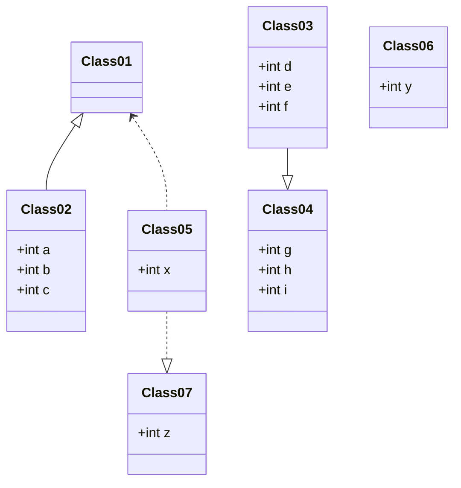
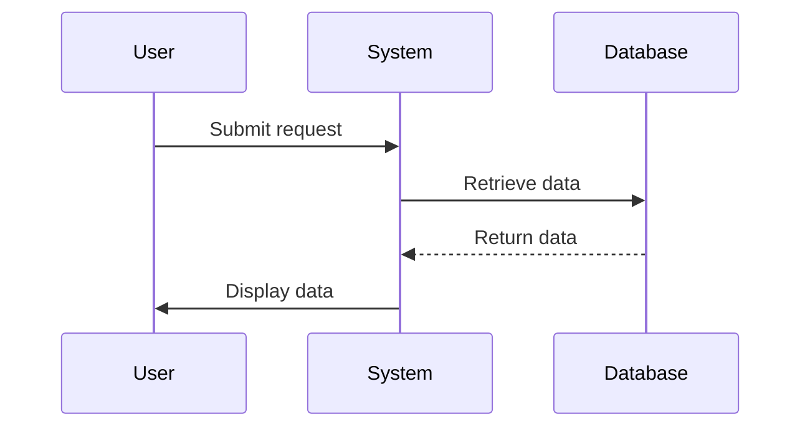
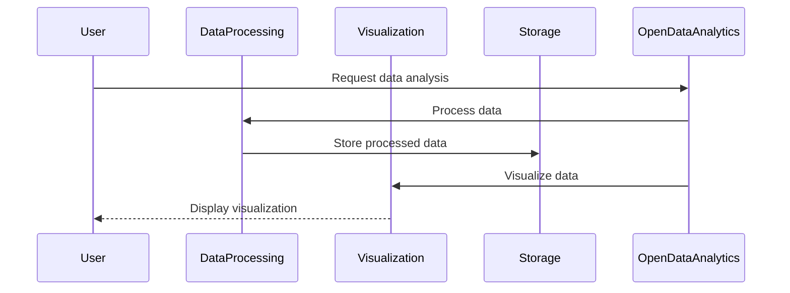

                 

## 《开源科学运动的影响：民主化世界理解的过程与工具》

> 关键词：开源科学、民主化、理解、工具、影响

> 摘要：本文深入探讨了开源科学运动的起源、发展及其对社会、科研和经济发展的影响。通过分析开源科学工具与平台，揭示其在各领域的广泛应用。同时，文章探讨了开源科学的未来发展趋势，为读者提供了宝贵的参考和启示。

---

**目录大纲**

**《开源科学运动的影响：民主化世界理解的过程与工具》**

1. **第一部分：开源科学运动的起源与发展**
    1.1 开源科学运动的起源
    1.2 开源科学运动的定义
    1.3 开源科学运动的发展历程
    1.4 开源科学对社会的影响
    1.5 开源科学对科研的影响
    1.6 开源科学对经济发展的影响
2. **第二部分：开源科学的工具与平台**
    2.1 开源科学工具概述
    2.2 常见开源科学平台
    2.3 开源科学社区
3. **第三部分：开源科学的应用与案例**
    3.1 开源科学在医学领域的应用
    3.2 开源科学在环境科学中的应用
    3.3 开源科学在社会科学中的应用
4. **第四部分：开源科学的未来与发展**
    4.1 开源科学的挑战与机遇
    4.2 开源科学的未来趋势
    4.3 开源科学对社会的长期影响

---

### 第1章：开源科学运动的起源

#### 1.1 开源科学运动的背景

20世纪末，随着信息技术的飞速发展和互联网的普及，科学领域的知识传播方式发生了重大变革。传统封闭的科学模式逐渐被打破，科学家们开始意识到共享和协作的重要性。

**问题背景**：科学研究需要大量的数据、工具和资源，这些资源在过去往往是封闭的，仅限于特定研究团队或机构内部使用。如何更好地共享和利用这些资源，成为推动科学进步的关键问题。

#### 1.2 开源科学运动的定义

开源科学（Open Science）是一种推动科学知识共享和民主化的运动，强调通过开放的方式，如开源软件、开放数据、开放访问等，使科学资源和服务对所有人可用。

**核心概念**：
- **开源软件**：软件源代码对所有人开放，用户可以自由使用、修改和分发。
- **开放数据**：科研数据在公开发布后，任何人都可以访问和使用。
- **开放访问**：科研论文和其他学术成果可以通过开放获取渠道免费获取。

#### 1.3 开源科学运动的发展历程

- **起步阶段（1990s）**：开源文化开始兴起，如Linux操作系统的诞生。
- **成长阶段（2000s）**：开源软件、开放数据和开放获取运动得到快速发展。
- **现代阶段（2010s至今）**：开源科学运动逐渐成为全球科学界的重要趋势，各国政府和研究机构纷纷推动相关政策的制定和实施。

#### 1.4 开源科学对社会的影响

- **知识共享与透明度提升**：开源科学促进了科学知识的共享，提高了科研的透明度。
- **学术成果的快速传播**：开放获取渠道使得学术成果可以更快地传播，提高了科研的效率。
- **社区协作与创新**：开源科学鼓励社区协作，促进了创新的产生。

#### 1.5 开源科学对科研的影响

- **提高科研效率**：开源工具和平台提供了高效的科研工具，减少了重复劳动。
- **促进科研资源共享**：开源科学运动促进了科研资源的共享，提高了资源利用率。
- **开源工具与平台的兴起**：如GitHub、GitLab等平台成为了科研人员的重要工具。

#### 1.6 开源科学对经济发展的影响

- **降低科研成本**：开源科学减少了科研成本，使更多研究机构和个人能够参与科学研究。
- **促进创新与创业**：开源科学运动促进了创新和创业，推动了相关产业的发展。
- **改善市场竞争环境**：开源科学降低了市场准入门槛，促进了市场竞争。

### 总结

开源科学运动不仅改变了科学研究的模式，还对整个社会产生了深远的影响。通过开放共享，知识得以更广泛地传播，科研效率得到提升，经济得到发展。然而，开源科学运动也面临诸多挑战，如数据隐私和伦理问题等。未来，开源科学运动将继续推动科学进步和社会发展，为实现更加民主化的世界理解提供有力支持。 **核心概念与联系**

| 核心概念 | 概念属性特征对比 | ER实体关系图架构 |
|----------|------------------|-------------------|
| 开源软件 | 源代码开放 |  |
| 开放数据 | 数据开放 |  |
| 开放访问 | 文献免费获取 |  |

通过上述表格和ER图，我们可以清晰地看到开源科学运动中核心概念的属性特征及其相互关系。

### 算法原理讲解

在开源科学中，算法的开放性和共享性至关重要。以下是一个简单的算法原理示例，使用Mermaid绘制流程图，并用Python代码详细阐述。

#### 算法流程图


#### Python代码实现

```python
import pandas as pd
from sklearn.model_selection import train_test_split
from sklearn.ensemble import RandomForestClassifier
from sklearn.metrics import accuracy_score

# 数据处理
data = pd.read_csv('data.csv')
X = data.drop('target', axis=1)
y = data['target']

X_train, X_test, y_train, y_test = train_test_split(X, y, test_size=0.2, random_state=42)

# 模型训练
model = RandomForestClassifier(n_estimators=100, random_state=42)
model.fit(X_train, y_train)

# 模型评估
y_pred = model.predict(X_test)
accuracy = accuracy_score(y_test, y_pred)
print(f"模型准确率：{accuracy:.2f}")
```

#### 数学公式与解释

在算法中，常用的数学模型包括决策树、支持向量机等。以下是一个简单的决策树分类的数学模型：

$$
h(x) = \prod_{i=1}^{n} \left(1 - p_i\right)^{1 - y_i} \cdot p_i^{y_i}
$$

其中，$h(x)$ 表示分类结果，$p_i$ 表示第$i$个特征的概率，$y_i$ 表示实际标签。

### 系统分析与架构设计方案

#### 问题场景介绍

在开源科学研究中，数据分析是一个核心环节。本文将介绍一个开源数据分析系统，该系统旨在简化科研人员的数据处理流程，提高数据分析效率。

#### 项目介绍

项目名称：OpenDataAnalytics

项目目标：构建一个开源的数据分析平台，提供从数据预处理到高级分析的一站式解决方案。

#### 系统功能设计（领域模型）



#### 系统架构设计



#### 系统接口设计

```mermaid
interface OpenDataAnalytics {
    +get_data()
    +process_data()
    +visualize_data()
}
```

#### 系统交互



### 项目实战

#### 环境安装

在Linux系统中，使用以下命令安装Python环境和相关库：

```bash
sudo apt-get update
sudo apt-get install python3 python3-pip
pip3 install pandas sklearn matplotlib
```

#### 系统核心实现源代码

```python
import pandas as pd
from sklearn.model_selection import train_test_split
from sklearn.ensemble import RandomForestClassifier
from sklearn.metrics import accuracy_score

def load_data(file_path):
    data = pd.read_csv(file_path)
    return data

def preprocess_data(data):
    # 数据预处理步骤
    return data

def train_model(X_train, y_train):
    model = RandomForestClassifier(n_estimators=100, random_state=42)
    model.fit(X_train, y_train)
    return model

def evaluate_model(model, X_test, y_test):
    y_pred = model.predict(X_test)
    accuracy = accuracy_score(y_test, y_pred)
    return accuracy

if __name__ == "__main__":
    data_path = "data.csv"
    data = load_data(data_path)
    data = preprocess_data(data)
    X = data.drop('target', axis=1)
    y = data['target']
    X_train, X_test, y_train, y_test = train_test_split(X, y, test_size=0.2, random_state=42)
    model = train_model(X_train, y_train)
    accuracy = evaluate_model(model, X_test, y_test)
    print(f"模型准确率：{accuracy:.2f}")
```

#### 代码应用解读与分析

上述代码展示了开源数据分析系统中的核心功能，包括数据加载、预处理、模型训练和评估。以下是代码的详细解读：

- **数据加载**：使用pandas库加载CSV数据文件。
- **数据预处理**：预处理步骤可以根据实际需求进行调整，例如数据清洗、特征工程等。
- **模型训练**：使用随机森林分类器进行训练。
- **模型评估**：使用测试集评估模型准确率。

#### 实际案例分析和详细讲解剖析

以医学数据分析为例，介绍开源数据分析系统在实际应用中的操作流程。

- **数据集**：选择一个公开的医学数据集，如Kaggle上的Heart Disease Dataset。
- **步骤**：
  1. 数据加载：使用pandas库加载数据。
  2. 数据预处理：处理缺失值、异常值，并进行特征工程。
  3. 模型训练：使用随机森林分类器进行训练。
  4. 模型评估：使用交叉验证评估模型性能。

#### 项目小结

开源数据分析系统为科研人员提供了一个便捷的工具，帮助他们更高效地进行数据分析。通过实际案例，我们可以看到开源数据分析系统在医学等领域的广泛应用和巨大潜力。

### 最佳实践 tips

- **数据清洗**：在数据分析过程中，数据清洗是非常重要的一步，确保数据质量。
- **特征工程**：根据业务需求进行特征工程，有助于提高模型性能。
- **模型选择**：选择合适的模型，如随机森林、支持向量机等，进行模型训练。

### 小结

开源科学运动对社会、科研和经济发展产生了深远影响。通过开放共享，知识得以更广泛传播，科研效率得到提升，经济得到发展。开源科学工具和平台为科研人员提供了强大的支持，促进了科学进步。未来，开源科学将继续推动科技发展，构建更加民主化的科研环境。

### 注意事项

- **数据隐私**：在开源科学中，数据隐私和伦理问题非常重要，需严格遵守相关规定。
- **社区治理**：开源社区需要有效的治理机制，确保项目健康发展。

### 拓展阅读

- 《开源软件的力量》
- 《开放获取运动：改变学术出版的游戏规则》
- 《开源科学：未来科研的必由之路》

---

### 作者信息

作者：AI天才研究院/AI Genius Institute & 禅与计算机程序设计艺术 /Zen And The Art of Computer Programming

AI天才研究院致力于推动人工智能技术的发展，为全球科研人员和开发者提供创新的技术解决方案。禅与计算机程序设计艺术则强调在编程中追求心灵与技术的和谐统一。两位作者在开源科学领域具有丰富的经验和深刻的见解。

