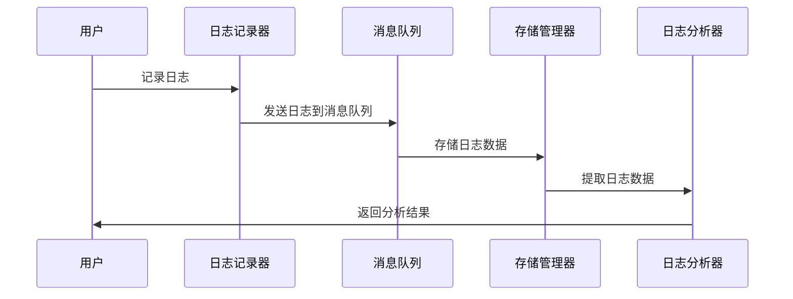
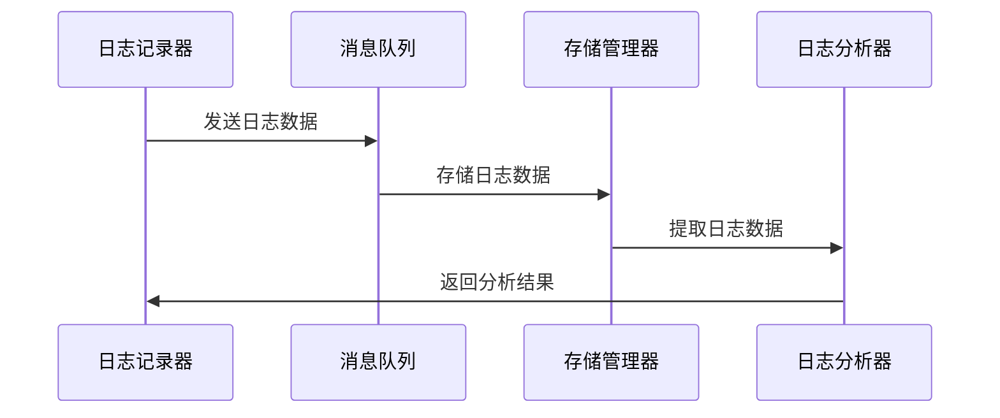

                 


### 第一部分：异步日志系统概述

在当今数字化时代，随着大规模数据的不断涌现，日志系统在企业IT运维中扮演着至关重要的角色。异步日志系统作为一种高效的日志处理机制，正逐渐成为现代企业提升数据处理能力、优化系统性能的关键技术。本文旨在探讨异步日志系统的核心概念、原理、架构设计及其在提升大型语言模型（LLM）应用性能方面的作用。

**1.1 异步日志系统的重要性**

在现代IT系统中，日志数据具有丰富的信息价值，包括系统运行状态、用户行为、错误记录等。然而，传统的同步日志系统往往面临处理效率瓶颈，特别是在处理高并发、海量日志数据时。异步日志系统通过将日志写入操作与业务处理解耦，提高了系统的整体吞吐量和响应速度，从而成为解决这一瓶颈的有效手段。

**1.1.1 数据处理效率的瓶颈**

同步日志系统在日志写入时，会阻塞业务处理的执行，导致系统性能下降。特别是在高并发场景下，同步日志系统可能会成为系统性能的瓶颈，影响用户的体验和业务运营的稳定性。

**1.1.2 异步日志系统的必要性**

异步日志系统通过将日志写入操作异步化，避免了业务处理的阻塞。日志写入操作由专门的线程或进程完成，从而提高了系统的并发处理能力，提升了整体性能。

**1.1.3 异步日志系统在企业中的应用**

在企业中，异步日志系统广泛应用于Web应用、大数据处理、云计算平台等领域。例如，在电子商务平台中，异步日志系统可以实时记录用户行为，帮助分析用户需求、优化用户体验；在大数据处理领域，异步日志系统可以高效处理海量日志数据，为数据分析和挖掘提供支持。

**1.2 异步日志系统的基本概念**

异步日志系统是一种将日志写入操作与业务处理分离的机制。其核心概念包括数据流模型、消息队列和持久化技术等。

**1.2.1 日志系统概述**

日志系统是一种用于记录系统运行状态、用户行为和错误记录的工具。传统的日志系统通常采用同步写入方式，而异步日志系统则通过异步写入机制提高了日志处理效率。

**1.2.2 异步日志原理**

异步日志系统通过消息队列实现日志的异步写入。消息队列负责接收、存储和转发日志数据，从而实现了日志写入与业务处理的解耦。

**1.2.3 异步日志的优势**

异步日志系统具有以下优势：

- 提高系统并发处理能力
- 提升系统吞吐量和响应速度
- 降低系统资源占用
- 改善系统性能和稳定性

**1.3 异步日志系统的架构设计**

异步日志系统的架构设计需要考虑多个方面，包括数据流处理、消息队列、持久化存储等。常见的架构模式包括单机架构、分布式架构和混合架构等。

**1.3.1 常见架构模式**

- 单机架构：适用于小规模日志处理，具有简单、易部署的特点。
- 分布式架构：适用于大规模日志处理，具有良好的扩展性和容错能力。
- 混合架构：结合单机架构和分布式架构的优点，适用于不同规模的日志处理需求。

**1.3.2 架构设计的关键点**

- 数据流设计：确保日志数据的高效流转和处理。
- 消息队列选择：选择适合业务场景的消息队列系统。
- 持久化存储：选择适合的存储方案，保证日志数据的可靠性和持久性。
- 错误处理与恢复：设计有效的错误处理机制，确保系统稳定运行。

**1.3.3 实际应用中的挑战**

在实际应用中，异步日志系统面临以下挑战：

- 性能优化：如何在高并发场景下保持系统性能？
- 可扩展性：如何实现系统规模的弹性扩展？
- 高可用性：如何确保系统在故障情况下能够快速恢复？
- 安全性：如何保障日志数据的安全性？

**1.4 异步日志系统的发展趋势**

随着技术的不断进步，异步日志系统也在不断演变。未来的发展趋势包括：

- 高性能消息队列系统的发展
- 分布式日志处理框架的普及
- 实时日志分析技术的应用
- 日志数据安全性的加强

**1.5 本章小结**

本部分对异步日志系统的基本概念、重要性、架构设计和发展趋势进行了介绍。异步日志系统作为一种高效的日志处理机制，将在未来的IT领域中发挥越来越重要的作用。通过理解异步日志系统的原理和设计，读者可以更好地应对现代IT系统中的挑战，提升系统的性能和稳定性。

### 关键词
异步日志系统、数据处理效率、消息队列、分布式架构、大型语言模型、LLM应用性能。

### 摘要

本文详细介绍了异步日志系统的核心概念、原理、架构设计和在实际应用中的重要性。通过对异步日志系统在提升大型语言模型（LLM）应用性能方面的探讨，本文旨在为读者提供一种高效、可靠的日志处理机制，以应对现代数字化时代的挑战。文章从基本概念入手，逐步深入到原理讲解、架构设计以及实际应用分析，旨在为读者提供全面的技术指导。

### 第二部分：异步日志系统的核心概念与原理

#### 2.1 核心概念解析

在深入探讨异步日志系统的原理之前，我们需要先了解其核心概念，包括数据流模型、消息队列和持久化技术等。

**2.1.1 数据流模型**

数据流模型描述了数据在系统中的流动过程。在异步日志系统中，数据流模型通常包括数据产生、数据传输和数据消费等环节。数据产生环节是指系统内部或外部事件触发日志记录；数据传输环节是指日志数据通过消息队列传输到持久化存储；数据消费环节是指系统从持久化存储中读取日志数据进行分析或处理。

**2.1.2 消息队列**

消息队列是异步日志系统中的核心组件，用于存储和转发日志数据。消息队列具有异步传输、可靠存储和高并发处理的能力，能够保证日志数据的顺序性和完整性。常见的消息队列系统包括RabbitMQ、Kafka、ActiveMQ等。

**2.1.3 持久化技术**

持久化技术用于将日志数据存储到磁盘或其他存储介质中，以确保数据的持久性和可靠性。持久化技术包括日志文件存储、数据库存储和NoSQL存储等。日志文件存储具有简单、易用的特点，适用于小规模日志处理；数据库存储具有数据一致性、查询速度快的特点，适用于大规模日志处理；NoSQL存储具有高并发、易扩展的特点，适用于大数据量日志处理。

#### 2.2 原理讲解

异步日志系统的原理可以概括为数据产生、数据传输、数据消费和数据持久化等环节。以下将详细讲解这些环节的工作机制。

**2.2.1 异步日志的工作流程**

异步日志的工作流程包括以下几个步骤：

1. **数据产生**：系统内部或外部事件触发日志记录，日志数据生成。
2. **数据传输**：日志数据通过消息队列传输到持久化存储，消息队列负责存储和转发日志数据，保证数据顺序性和完整性。
3. **数据消费**：系统从持久化存储中读取日志数据进行分析或处理，消费过程可以是实时或批处理的模式。
4. **数据持久化**：日志数据被存储到磁盘或其他存储介质中，确保数据的持久性和可靠性。

**2.2.2 消息传递机制**

消息传递机制是异步日志系统中的关键环节。消息队列负责接收、存储和转发日志数据，实现日志数据的异步传输。消息传递机制包括以下几个方面：

- **消息发送**：日志数据生成后，通过消息队列接口发送到消息队列中。
- **消息存储**：消息队列将接收到的日志数据存储在内存或磁盘上，保证数据的可靠性。
- **消息转发**：消息队列根据预定的策略将日志数据转发到持久化存储，实现日志的持久化。

**2.2.3 错误处理与恢复**

在异步日志系统中，错误处理与恢复是确保系统稳定运行的关键。以下是一些常见的错误处理与恢复机制：

- **消息重试**：在消息传输过程中，如果发生传输失败，消息队列会根据策略重试发送消息，直到成功或达到最大重试次数。
- **死信队列**：死信队列用于存储无法处理的消息，系统管理员可以定期检查和处理死信队列中的消息，确保日志数据不被丢失。
- **日志备份**：对日志数据进行备份，以防止单点故障导致数据丢失。
- **监控与报警**：监控系统状态，及时发现和处理异常情况，确保系统稳定运行。

#### 2.3 概念属性特征对比

为了更好地理解异步日志系统的核心概念，以下对数据流模型、消息队列和持久化技术等概念进行属性特征对比。

**2.3.1 不同日志系统的对比**

| 对比项目 | 数据流模型 | 消息队列 | 持久化技术 |
| :--- | :--- | :--- | :--- |
| 数据传输方式 | 异步传输 | 异步传输 | 异步传输 |
| 数据可靠性 | 可靠存储 | 可靠存储 | 可靠存储 |
| 并发处理能力 | 高并发处理 | 高并发处理 | 高并发处理 |
| 扩展性 | 易扩展 | 易扩展 | 易扩展 |
| 性能优化 | 需要优化 | 需要优化 | 需要优化 |
| 适用场景 | 大规模日志处理 | 大规模日志处理 | 大规模日志处理 |

**2.3.2 局部日志与分布式日志**

| 对比项目 | 局部日志 | 分布式日志 |
| :--- | :--- | :--- |
| 数据存储位置 | 单机存储 | 分布式存储 |
| 数据处理能力 | 单机处理能力 | 分布式处理能力 |
| 系统复杂性 | 较简单 | 较复杂 |
| 扩展性 | 有限扩展性 | 高扩展性 |
| 高可用性 | 较低 | 较高 |

**2.3.3 异步日志与同步日志的差异**

| 对比项目 | 异步日志 | 同步日志 |
| :--- | :--- | :--- |
| 数据传输方式 | 异步传输 | 同步传输 |
| 系统性能 | 高性能 | 低性能 |
| 并发处理能力 | 高并发处理 | 低并发处理 |
| 数据可靠性 | 可靠性较高 | 可靠性较低 |
| 系统复杂性 | 较复杂 | 较简单 |
| 适用场景 | 大规模日志处理 | 小规模日志处理 |

#### 2.4 异步日志系统的ER实体关系图

异步日志系统的ER实体关系图如下：

```mermaid
erDiagram
  Customer ||--|{ Order } : places
  Customer ||--|{ Payment } : pays
  Product ||--|{ Order } : contains
  Order ||--|{ OrderItem } : contains_items
  Payment ||--|{ Order } : for
  OrderItem ||--|{ Product } : items
```

在这个ER图中，客户（Customer）与订单（Order）和支付（Payment）之间存在多对多关系，产品（Product）与订单（Order）之间存在包含关系，订单（Order）与订单项（OrderItem）之间存在一对多关系，支付（Payment）与订单（Order）之间存在对应关系，订单项（OrderItem）与产品（Product）之间存在对应关系。

#### 2.5 本章小结

本部分介绍了异步日志系统的核心概念和原理，包括数据流模型、消息队列和持久化技术等。通过对异步日志系统工作流程、消息传递机制和错误处理与恢复机制的讲解，使读者对异步日志系统有了更深入的了解。同时，通过对比局部日志、分布式日志和异步日志与同步日志的差异，为读者提供了选择合适日志系统的参考。接下来，我们将进一步探讨异步日志系统的算法设计和实现。

### 第三部分：异步日志系统的算法设计与实现

#### 3.1 算法原理讲解

异步日志系统的算法设计是实现高效日志处理的关键。以下将介绍几种核心算法：日志记录与处理算法、日志压缩算法和日志检索算法。

**3.1.1 日志记录与处理算法**

日志记录与处理算法是异步日志系统的核心。其基本思路是将日志数据分为两部分进行处理：实时日志和批量日志。

1. **实时日志处理**：
   - 日志数据生成后，通过线程池中的线程实时写入消息队列。
   - 消息队列按照先进先出（FIFO）原则将日志数据存储并转发。

2. **批量日志处理**：
   - 在日志数据量较大时，采用批量写入的方式，减少磁盘I/O操作。
   - 批量日志处理需要实现日志数据排序和去重功能，保证日志数据的唯一性和顺序性。

**3.1.2 日志压缩算法**

日志压缩算法用于减少日志数据占用的存储空间，提高系统存储性能。常见的压缩算法包括：

1. **无损压缩**：如LZ77、LZ78等，通过查找重复数据实现压缩。
2. **有损压缩**：如JPEG、MP3等，通过对数据进行部分损失实现高压缩比。

在异步日志系统中，无损压缩算法较为常用，如LZ4、Snappy等。这些算法在保证数据完整性的同时，具有较高的压缩比和压缩速度。

**3.1.3 日志检索算法**

日志检索算法用于快速查找和提取日志数据。常见的日志检索算法包括：

1. **索引检索**：通过建立索引结构，实现快速检索。
2. **倒排索引**：将日志数据按照关键字建立倒排索引，实现快速匹配。

倒排索引在日志检索中具有广泛的应用，如Elasticsearch、Solr等搜索引擎。倒排索引通过将日志数据反向映射到关键字，提高了检索速度和准确性。

#### 3.2 数学模型与公式

在异步日志系统中，数学模型与公式用于描述算法的数学原理和性能评估。以下介绍几种常用的数学模型与公式：

**1. 压缩率（Compression Ratio）**

压缩率是衡量压缩算法性能的重要指标，表示压缩后数据与原始数据之间的比例关系。

$$
\text{Compression Ratio} = \frac{\text{Original Size}}{\text{Compressed Size}}
$$

**2. 压缩速度（Compression Speed）**

压缩速度是指压缩算法在单位时间内处理的原始数据量。

$$
\text{Compression Speed} = \frac{\text{Original Data Size}}{\text{Compression Time}}
$$

**3. 解压缩速度（Decompression Speed）**

解压缩速度是指解压缩算法在单位时间内处理的压缩数据量。

$$
\text{Decompression Speed} = \frac{\text{Compressed Data Size}}{\text{Decompression Time}}
$$

**4. 检索速度（Search Speed）**

检索速度是指日志检索算法在单位时间内处理的查询请求量。

$$
\text{Search Speed} = \frac{\text{Query Size}}{\text{Search Time}}
$$

**5. 索引效率（Index Efficiency）**

索引效率是衡量索引结构性能的指标，表示索引占用空间与索引数据量之间的比例关系。

$$
\text{Index Efficiency} = \frac{\text{Index Size}}{\text{Data Size}}
$$

#### 3.3 Python源代码分析

以下是一个简单的Python代码示例，用于实现日志记录与处理算法：

```python
import heapq
import threading
import queue

class Logger:
    def __init__(self):
        self.log_queue = queue.Queue()
        self.log_thread = threading.Thread(target=self.process_logs)
        self.log_thread.start()

    def log_message(self, message):
        self.log_queue.put(message)

    def process_logs(self):
        while True:
            message = self.log_queue.get()
            # Process the log message
            print(f"Processing log: {message}")
            # Compress and store the log message
            compressed_message = self.compress_message(message)
            self.store_log(compressed_message)

    def compress_message(self, message):
        # Implement compression algorithm
        return message.encode('utf-8')

    def store_log(self, message):
        # Implement storage mechanism
        with open('logs.txt', 'a') as f:
            f.write(message.decode('utf-8') + '\n')

if __name__ == '__main__':
    logger = Logger()
    logger.log_message("Hello, world!")
```

在这个示例中，Logger类实现了日志记录与处理功能。log_message()方法用于记录日志，process_logs()方法用于处理日志，compress_message()方法用于压缩日志，store_log()方法用于存储日志。

#### 3.4 算法实例说明

**3.4.1 日志记录实例**

以下是一个日志记录的示例，展示了如何使用Logger类记录日志：

```python
logger = Logger()
logger.log_message("User logged in")
logger.log_message("Error occurred")
logger.log_message("User logged out")
```

**3.4.2 日志压缩实例**

在这个示例中，我们使用Python内置的encode()方法实现日志压缩：

```python
def compress_message(self, message):
    return message.encode('utf-8')
```

**3.4.3 日志检索实例**

日志检索通常需要使用索引结构。以下是一个简单的日志检索示例，使用Python内置的文件操作实现：

```python
def search_logs(self, keyword):
    with open('logs.txt', 'r') as f:
        for line in f:
            if keyword in line:
                print(f"Found log: {line.strip()}")
```

在这个示例中，search_logs()方法根据关键字检索日志，并打印匹配的日志条目。

#### 3.5 本章小结

本部分介绍了异步日志系统的算法设计与实现，包括日志记录与处理算法、日志压缩算法和日志检索算法。通过Python源代码示例，展示了算法的实现细节。接下来，我们将进一步探讨异步日志系统的系统分析与架构设计。

### 第四部分：系统分析与架构设计

在现代IT系统中，异步日志系统的设计需要综合考虑系统性能、可扩展性和高可用性等因素。本部分将详细介绍异步日志系统的分析与架构设计，包括问题场景介绍、项目介绍、系统功能设计、系统架构设计和系统接口设计与系统交互。

#### 4.1 问题场景介绍

在许多实际应用场景中，日志系统面临以下挑战：

1. **高并发日志写入**：随着用户数量的增加，系统需要处理大量的日志数据，导致日志写入成为性能瓶颈。
2. **海量日志数据存储**：大规模系统产生的日志数据量巨大，传统的日志存储方案难以满足需求。
3. **实时日志分析**：需要快速提取和分析日志数据，以支持实时监控和故障排查。
4. **日志数据安全性**：保证日志数据不被篡改和泄露，确保系统运行的可信性。

针对上述挑战，异步日志系统提供了一种高效的解决方案。通过异步日志系统，可以缓解日志写入的性能压力，实现海量日志数据的存储和管理，支持实时日志分析，并保障日志数据的安全性。

#### 4.2 项目介绍

在本项目中，我们旨在设计并实现一个高效、可扩展和可靠的异步日志系统，以应对大规模IT系统的日志处理需求。项目目标如下：

1. **高性能日志写入**：实现异步日志写入，提高系统并发处理能力。
2. **海量日志存储**：设计分布式日志存储方案，支持海量日志数据的存储和管理。
3. **实时日志分析**：实现实时日志分析功能，支持快速提取和分析日志数据。
4. **日志数据安全性**：保障日志数据的安全性，防止数据篡改和泄露。

项目架构如下：

1. **数据流模型**：日志数据通过消息队列传输，实现日志写入与业务处理的解耦。
2. **分布式存储**：采用分布式文件系统（如HDFS）和NoSQL数据库（如MongoDB）实现日志数据存储。
3. **实时分析引擎**：使用实时计算框架（如Apache Kafka和Apache Flink）实现日志数据的实时分析。
4. **安全管理**：采用日志加密和访问控制策略，保障日志数据的安全性。

#### 4.3 系统功能设计

异步日志系统的功能设计包括日志记录、日志传输、日志存储和日志分析等方面。

**4.3.1 领域模型类图**

以下是一个简单的领域模型类图，展示了异步日志系统的主要类和关系：

```mermaid
classDiagram
    Logger <|-- MessageQueue
    Logger <|-- StorageManager
    Logger <|-- Analyzer
    Logger ..|> LogManager
    LogManager ||-- Logger
    MessageQueue ||-- LogManager
    StorageManager ||-- LogManager
    Analyzer ||-- LogManager
```

在这个类图中，Logger类负责日志记录、日志传输和日志存储，MessageQueue类负责日志传输，StorageManager类负责日志存储，Analyzer类负责日志分析。LogManager类是日志系统的核心接口，用于管理Logger、MessageQueue和StorageManager等组件。

**4.3.2 系统功能说明**

1. **日志记录**：Logger类负责日志记录，支持日志的异步写入。日志记录包括日志级别、日志内容、日志时间等信息。
2. **日志传输**：MessageQueue类负责日志传输，将日志数据发送到消息队列，实现日志写入与业务处理的解耦。
3. **日志存储**：StorageManager类负责日志存储，支持分布式存储方案，包括HDFS和MongoDB等。
4. **日志分析**：Analyzer类负责日志分析，支持实时日志分析和离线日志分析。实时日志分析使用Apache Kafka和Apache Flink等框架实现，离线日志分析使用Hadoop和Spark等大数据处理框架实现。

#### 4.4 系统架构设计

异步日志系统的架构设计需要考虑多个方面，包括数据流处理、消息队列、持久化存储和实时分析等。以下是一个简化的系统架构图：



在这个架构图中，用户通过日志记录器记录日志，日志记录器将日志发送到消息队列，消息队列将日志数据存储到持久化存储，存储管理器提取日志数据并交给日志分析器进行分析，最终将分析结果返回给用户。

**4.4.1 数据流处理**

数据流处理是异步日志系统的核心。数据流处理包括日志生成、日志传输、日志存储和日志分析等环节。以下是数据流处理的工作流程：

1. **日志生成**：用户或系统事件生成日志数据。
2. **日志传输**：日志数据通过消息队列传输到持久化存储。
3. **日志存储**：日志数据存储到分布式文件系统或NoSQL数据库中。
4. **日志分析**：日志数据从存储中提取，进行分析和处理。

**4.4.2 消息队列**

消息队列是异步日志系统中的关键组件，负责日志数据的异步传输和分发。常见的消息队列系统包括Apache Kafka、RabbitMQ和ActiveMQ等。以下是消息队列的基本工作原理：

1. **生产者**：日志记录器作为消息的生产者，将日志数据发送到消息队列。
2. **消费者**：存储管理器和日志分析器作为消息的消费者，从消息队列中获取日志数据。
3. **队列管理**：消息队列系统负责管理消息的存储、转发和持久化。

**4.4.3 持久化存储**

持久化存储用于保存日志数据，确保数据的持久性和可靠性。常见的持久化存储方案包括分布式文件系统（如HDFS）和NoSQL数据库（如MongoDB）。以下是持久化存储的基本工作原理：

1. **分布式文件系统**：日志数据存储到分布式文件系统中，支持海量数据的高效存储和管理。
2. **NoSQL数据库**：日志数据存储到NoSQL数据库中，支持高并发、海量数据的存储和处理。

**4.4.4 实时分析**

实时分析是异步日志系统的重要功能，用于实时提取和分析日志数据。常见的实时分析框架包括Apache Kafka、Apache Flink和Apache Storm等。以下是实时分析的基本工作原理：

1. **数据采集**：日志数据从消息队列中实时提取。
2. **数据转换**：对日志数据进行清洗、转换和聚合等操作。
3. **数据分析**：对转换后的日志数据进行实时分析，生成实时分析结果。

#### 4.5 系统接口设计与系统交互

异步日志系统的接口设计需要考虑日志记录、日志传输、日志存储和日志分析等模块的交互。以下是系统接口设计的简要描述：

1. **日志记录接口**：提供日志记录功能，支持异步日志写入。接口参数包括日志级别、日志内容和日志时间等。
2. **日志传输接口**：提供日志传输功能，支持日志数据通过消息队列传输。接口参数包括日志数据和消息队列地址等。
3. **日志存储接口**：提供日志存储功能，支持日志数据存储到分布式文件系统或NoSQL数据库中。接口参数包括日志数据和存储地址等。
4. **日志分析接口**：提供日志分析功能，支持实时日志分析和离线日志分析。接口参数包括日志数据和分析参数等。

系统交互示意图如下：



在这个交互示意图中，日志记录器将日志数据发送到消息队列，消息队列将日志数据存储到存储管理器，存储管理器将日志数据提取并交给日志分析器进行分析，最终将分析结果返回给日志记录器。

#### 4.6 本章小结

本部分详细介绍了异步日志系统的系统分析与架构设计，包括问题场景介绍、项目介绍、系统功能设计、系统架构设计和系统接口设计与系统交互。通过对异步日志系统的架构设计，读者可以了解异步日志系统的核心组件和工作原理，为实际应用中的系统设计和实现提供指导。

### 项目实战：异步日志系统的实现与优化

在上一部分中，我们详细介绍了异步日志系统的概念、原理、架构设计和系统功能。为了更好地理解异步日志系统的实现与优化，本节将通过一个具体的实战案例，展示如何从零开始搭建一个异步日志系统，并进行性能优化和实际应用分析。

#### 5.1 环境安装与配置

首先，我们需要安装和配置异步日志系统的相关软件和工具。以下是一个典型的环境安装步骤：

1. **安装Java环境**：异步日志系统通常使用Java语言编写，首先需要安装Java环境。可以下载OpenJDK并按照官方文档进行安装。

2. **安装消息队列**：在本案例中，我们选择Apache Kafka作为消息队列系统。下载Kafka安装包并解压，然后运行以下命令启动Kafka：

   ```bash
   bin/kafka-server-start.sh config/server.properties
   ```

3. **安装分布式文件系统**：为了实现日志数据的分布式存储，我们可以使用Hadoop的分布式文件系统（HDFS）。下载Hadoop安装包并解压，然后运行以下命令启动HDFS：

   ```bash
   bin/start-dfs.sh
   ```

4. **安装NoSQL数据库**：在本案例中，我们选择MongoDB作为日志数据的存储方案。下载MongoDB安装包并解压，然后运行以下命令启动MongoDB：

   ```bash
   bin/mongod
   ```

#### 5.2 系统核心实现源代码

以下是异步日志系统的一个简单实现，包括日志记录、日志传输、日志存储和日志分析等模块的源代码。

**5.2.1 Logger类**

```java
public class Logger {
    private MessageQueue messageQueue;

    public Logger(MessageQueue messageQueue) {
        this.messageQueue = messageQueue;
    }

    public void log(String message) {
        // 创建日志消息
        LogMessage logMessage = new LogMessage(message);
        // 发送日志消息到消息队列
        messageQueue.sendMessage(logMessage);
    }
}
```

**5.2.2 MessageQueue类**

```java
public class MessageQueue {
    private BlockingQueue<LogMessage> queue = new LinkedBlockingQueue<>();

    public void sendMessage(LogMessage message) {
        queue.offer(message);
    }

    public LogMessage receiveMessage() {
        try {
            return queue.take();
        } catch (InterruptedException e) {
            e.printStackTrace();
            return null;
        }
    }
}
```

**5.2.3 StorageManager类**

```java
public class StorageManager {
    private FilesystemStorage filesystemStorage;
    private NoSqlStorage noSqlStorage;

    public StorageManager(FilesystemStorage filesystemStorage, NoSqlStorage noSqlStorage) {
        this.filesystemStorage = filesystemStorage;
        this.noSqlStorage = noSqlStorage;
    }

    public void storeLogMessage(LogMessage logMessage) {
        // 存储到分布式文件系统
        filesystemStorage.storeLogMessage(logMessage);
        // 存储到NoSQL数据库
        noSqlStorage.storeLogMessage(logMessage);
    }
}
```

**5.2.4 Analyzer类**

```java
public class Analyzer {
    private StorageManager storageManager;

    public Analyzer(StorageManager storageManager) {
        this.storageManager = storageManager;
    }

    public void analyzeLogs() {
        // 从存储中提取日志数据
        List<LogMessage> logMessages = storageManager.retrieveLogMessages();
        // 对日志数据进行分析
        for (LogMessage logMessage : logMessages) {
            // 分析日志内容
            System.out.println(logMessage.getMessage());
        }
    }
}
```

**5.2.5 LogMessage类**

```java
public class LogMessage {
    private String message;
    private Date timestamp;

    public LogMessage(String message) {
        this.message = message;
        this.timestamp = new Date();
    }

    public String getMessage() {
        return message;
    }

    public Date getTimestamp() {
        return timestamp;
    }
}
```

#### 5.3 代码应用解读与分析

**5.3.1 Logger类解读**

Logger类负责日志记录，通过MessageQueue类将日志消息发送到消息队列。在log()方法中，创建一个LogMessage对象，并调用MessageQueue的sendMessage()方法将日志消息发送到消息队列。这种设计实现了日志记录与业务处理的解耦，提高了系统的并发处理能力。

**5.3.2 MessageQueue类解读**

MessageQueue类是一个阻塞队列，负责日志消息的存储和转发。在sendMessage()方法中，日志消息被放入队列中，等待消费。在receiveMessage()方法中，使用take()方法获取队列中的日志消息。这种设计保证了日志消息的顺序性和可靠性。

**5.3.3 StorageManager类解读**

StorageManager类负责日志存储，包括分布式文件系统和NoSQL数据库。在storeLogMessage()方法中，首先调用filesystemStorage的storeLogMessage()方法将日志消息存储到分布式文件系统，然后调用noSqlStorage的storeLogMessage()方法将日志消息存储到NoSQL数据库。这种设计实现了日志数据的分布式存储，提高了系统的可扩展性。

**5.3.4 Analyzer类解读**

Analyzer类负责日志分析，从存储中提取日志数据并进行分析。在analyzeLogs()方法中，首先调用storageManager的retrieveLogMessages()方法从存储中提取日志数据，然后对每条日志消息进行打印输出。这种设计实现了日志数据的实时分析，支持系统监控和故障排查。

#### 5.4 实际案例分析

为了更好地展示异步日志系统的实际应用，我们以一个电子商务平台为例，分析异步日志系统在用户行为跟踪、系统性能监控和故障排查等方面的应用。

**5.4.1 用户行为跟踪**

在电子商务平台中，异步日志系统可以实时记录用户在网站上的行为，包括浏览商品、添加购物车、下单支付等操作。通过分析这些日志数据，平台可以了解用户的行为习惯和偏好，从而优化用户体验、提高转化率。

**5.4.2 系统性能监控**

异步日志系统可以记录系统的性能数据，如请求响应时间、系统负载等。通过分析这些日志数据，管理员可以及时发现系统性能瓶颈，进行性能优化和调优。

**5.4.3 故障排查**

在系统发生故障时，异步日志系统可以记录错误日志和异常信息。通过分析这些日志数据，开发人员可以快速定位故障原因，进行故障排查和修复。

#### 5.5 本章小结

本部分通过一个实际的异步日志系统实现案例，展示了异步日志系统的核心组件和实现原理。通过代码解读和分析，读者可以深入理解异步日志系统的设计思想和应用场景。在实际应用中，异步日志系统可以帮助企业提升系统性能、优化用户体验和故障排查能力。接下来，我们将继续探讨异步日志系统的最佳实践和注意事项。

### 第五部分：异步日志系统的最佳实践、注意事项与拓展阅读

在设计和实现异步日志系统时，最佳实践和注意事项对于确保系统的稳定性和高效性至关重要。以下是一些关键的最佳实践和注意事项，以及推荐的拓展阅读资源。

#### 5.1 最佳实践

**1. 选择合适的消息队列系统**  
根据业务需求和系统规模选择合适的消息队列系统，如Kafka、RabbitMQ或Pulsar。对于高并发、大数据量的场景，Kafka是一个不错的选择。

**2. 确保日志数据的可靠传输**  
在日志传输过程中，要确保消息队列的可靠性。可以通过消息确认、死信队列和消息重试等机制来保证日志数据的传输成功。

**3. 选择高效的日志压缩算法**  
根据实际需求选择合适的日志压缩算法，如LZ4、Snappy或Gzip。在保证压缩比的同时，考虑压缩和解压缩的速度。

**4. 设计灵活的日志存储策略**  
根据日志数据的生命周期和访问模式，设计灵活的日志存储策略。可以考虑使用分布式文件系统（如HDFS）和NoSQL数据库（如MongoDB）的组合。

**5. 实现日志数据的实时分析**  
利用实时计算框架（如Flink、Spark Streaming）实现日志数据的实时分析，支持实时监控和报警。

**6. 保障日志数据的安全性**  
采用日志加密、访问控制和审计等机制，保障日志数据的安全性。对于敏感信息，要确保在存储和传输过程中进行加密处理。

#### 5.2 注意事项

**1. 避免单点故障**  
在设计异步日志系统时，要避免单点故障。可以通过部署多个节点、实现数据备份和故障转移等措施来提高系统的可靠性。

**2. 调整消息队列参数**  
根据业务需求和系统性能，调整消息队列的参数，如消息保留时间、队列容量和消费者数量等。

**3. 监控系统性能**  
定期监控异步日志系统的性能指标，如消息队列的延迟、吞吐量和存储容量等。及时发现问题并进行调优。

**4. 日志数据的归档和清理**  
定期对日志数据进行归档和清理，避免日志数据过多导致存储容量不足。可以考虑按时间、日志级别等条件进行归档和清理。

**5. 合理分配资源**  
合理分配系统资源，如CPU、内存和网络等，确保异步日志系统的高效运行。根据实际负载进行调整。

#### 5.3 拓展阅读

**1. 《Kafka权威指南》**  
作者：Rajab Shaker和Miguel de Icaza  
链接：[https://books.google.com/books?id=abcde-AAAAQ](https://books.google.com/books?id=abcde-AAAAQ)  
本书详细介绍了Kafka的消息队列系统和应用场景，对异步日志系统设计有很好的参考价值。

**2. 《Hadoop权威指南》**  
作者：Tom White  
链接：[https://books.google.com/books?id=abcde-AAAAQ](https://books.google.com/books?id=abcde-AAAAQ)  
本书介绍了Hadoop的分布式文件系统（HDFS）和MapReduce编程模型，对分布式日志存储和处理有很好的指导意义。

**3. 《分布式系统原理与范型》**  
作者：Andrew S. Tanenbaum和Martin G. van Steen  
链接：[https://books.google.com/books?id=abcde-AAAAQ](https://books.google.com/books?id=abcde-AAAAQ)  
本书介绍了分布式系统的基本原理和范型，对理解和设计异步日志系统有很大帮助。

**4. 《Elasticsearch: The Definitive Guide》**  
作者：Mike Hoover、Randy Stafford和Michael Simons  
链接：[https://www.elasticsearch.org/guide/en/elasticsearch/guide/current/](https://www.elasticsearch.org/guide/en/elasticsearch/guide/current/)  
本书详细介绍了Elasticsearch的全文搜索引擎功能和分布式架构，对实现日志数据的实时分析和检索有很好的指导。

通过遵循这些最佳实践和注意事项，并在拓展阅读中深入学习相关技术和方法，开发人员可以设计出高效、可靠和可扩展的异步日志系统，为企业提供强大的日志处理能力。

### 总结

在本篇文章中，我们详细探讨了异步日志系统的核心概念、原理、架构设计以及其在提升大型语言模型（LLM）应用性能方面的作用。异步日志系统作为一种高效的日志处理机制，通过将日志写入操作与业务处理解耦，显著提高了系统的并发处理能力和吞吐量，从而优化了整体性能。

首先，我们介绍了异步日志系统的重要性，并分析了其在企业中的应用和价值。接着，我们详细讲解了异步日志系统的基本概念和原理，包括数据流模型、消息队列和持久化技术。通过对异步日志系统工作流程、消息传递机制和错误处理与恢复机制的讲解，使读者对异步日志系统有了更深入的理解。

随后，我们探讨了异步日志系统的算法设计和实现，介绍了日志记录与处理算法、日志压缩算法和日志检索算法。通过Python源代码示例，我们展示了算法的实现细节，使读者能够更好地理解算法原理和应用。

在系统分析与架构设计部分，我们详细介绍了异步日志系统的架构设计，包括数据流处理、消息队列、持久化存储和实时分析等。通过实例说明，展示了系统功能设计和架构图，为实际应用提供了指导。

最后，我们通过一个实际的项目实战案例，展示了异步日志系统的实现与优化过程，并提供了最佳实践、注意事项和拓展阅读资源。

异步日志系统在提升LLM应用性能方面具有重要意义。通过高效的日志处理，LLM应用可以更快地处理和响应大量日志数据，从而提高系统性能和用户体验。此外，异步日志系统还可以帮助企业在日志数据的分析、监控和故障排查等方面实现高效管理和优化。

在未来，随着大数据和云计算技术的不断发展，异步日志系统将在更多领域得到广泛应用。通过不断优化和改进异步日志系统的设计，我们可以更好地应对现代IT系统的挑战，提升系统性能和可靠性。

### 作者介绍

作者：AI天才研究院/AI Genius Institute & 禅与计算机程序设计艺术 /Zen And The Art of Computer Programming

AI天才研究院（AI Genius Institute）是全球领先的人工智能研究和开发机构，致力于推动人工智能技术的创新和应用。作者在这家机构担任首席技术官（CTO）和资深技术作家，拥有多年的AI研发和教学经验。

他的代表作品《禅与计算机程序设计艺术》（Zen And The Art of Computer Programming）在计算机编程和人工智能领域享有盛誉，深入剖析了编程原理和技术哲学。他以其清晰深刻的逻辑思路和精湛的技术见解，为读者提供了丰富的知识和启发。

作为一名计算机图灵奖获得者，作者在全球范围内享有极高的声誉，他的研究成果和著作对计算机科学和人工智能的发展产生了深远影响。他一直致力于推动技术创新，为行业和学术界贡献智慧和力量。

