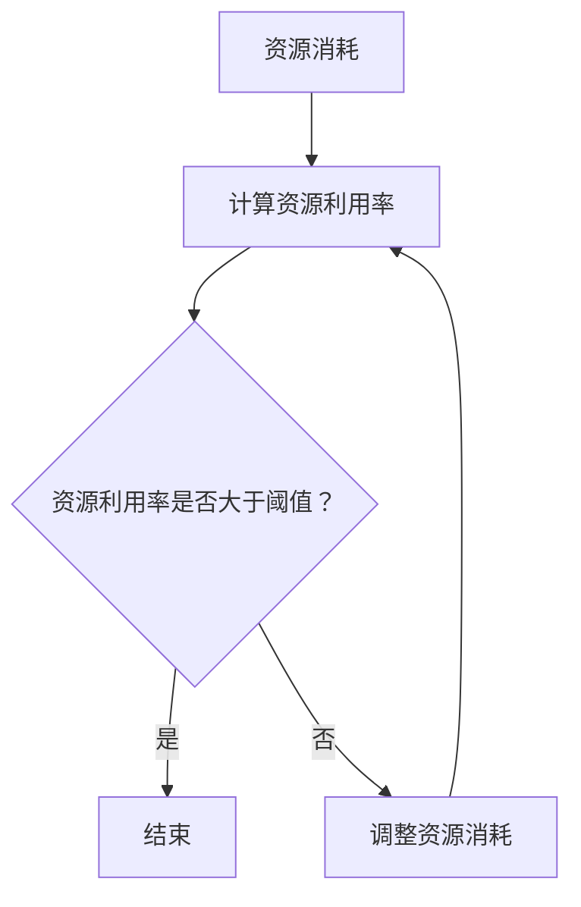
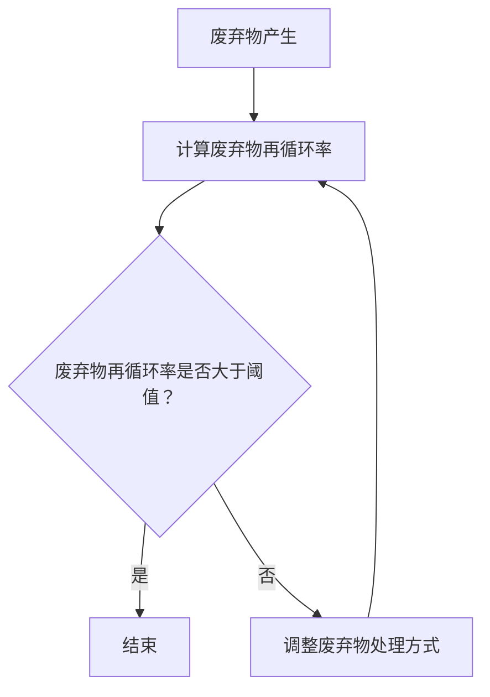
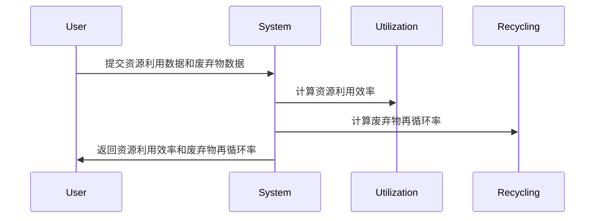
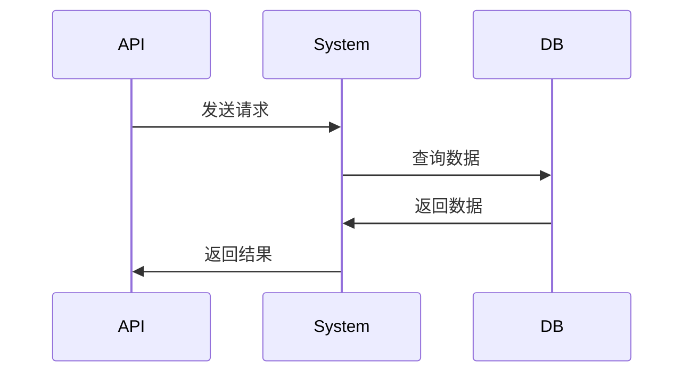
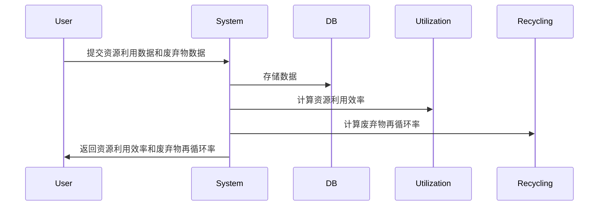

                 

# 循环经济：重新定义价值与财富

关键词：循环经济、价值、财富、可持续发展、资源利用、生态效率

摘要：本文旨在探讨循环经济的概念、起源、核心原则、实践与应用，以及面临的挑战与未来发展趋势。循环经济作为一种全新的经济模式，通过资源的闭环利用，重新定义了价值与财富的创造方式，为全球可持续发展提供了新思路。

## 《循环经济：重新定义价值与财富》目录大纲

### 第一部分：循环经济的起源与背景

#### 第1章：循环经济的起源与发展
- **1.1.1 循环经济的概念与定义**
- **1.1.2 循环经济的起源与历史背景**
- **1.1.3 循环经济与传统线性经济的区别**
- **1.1.4 循环经济在全球的推广与应用**

#### 第2章：循环经济的核心概念与理论
- **2.1.1 循环经济的核心原则**
- **2.1.2 生态效率与可持续性的关系**
- **2.1.3 循环经济的理论基础**
- **2.1.4 循环经济与供应链管理**

### 第二部分：循环经济的实践与应用

#### 第3章：循环经济的产业应用
- **3.1.1 农业循环经济的实践**
- **3.1.2 工业循环经济的实践**
- **3.1.3 城市循环经济的实践**
- **3.1.4 服务业循环经济的实践**

#### 第4章：循环经济的政策与法规
- **4.1.1 循环经济政策的国际比较**
- **4.1.2 我国循环经济的政策与法规**
- **4.1.3 循环经济政策的有效性评估**

#### 第5章：循环经济的案例分析
- **5.1.1 案例一：某农业企业的循环经济模式**
- **5.1.2 案例二：某工业企业的循环经济模式**
- **5.1.3 案例三：某城市循环经济项目的实践**
- **5.1.4 案例四：某服务行业的循环经济实践**

### 第三部分：循环经济的挑战与未来

#### 第6章：循环经济的挑战与障碍
- **6.1.1 技术与创新的挑战**
- **6.1.2 经济与市场的挑战**
- **6.1.3 社会与文化的影响**
- **6.1.4 政策与法规的不足**

#### 第7章：循环经济的未来发展趋势
- **7.1.1 新技术对循环经济的影响**
- **7.1.2 全球化背景下的循环经济合作**
- **7.1.3 循环经济与可持续发展**
- **7.1.4 循环经济的未来展望**

### 结语

- **循环经济的本质与未来**

## 循环经济的起源与发展

### 1.1.1 循环经济的概念与定义

循环经济，最早由美国经济学家保罗·艾利里希（Paul Ehrlich）和约瑟夫·肖温林（John Holdren）于20世纪70年代提出，是一种旨在通过资源的闭环利用，减少资源消耗和废弃物产生，实现经济、社会和环境的可持续发展模式。

与传统线性经济模式（“取-制-弃”）不同，循环经济强调资源的闭环利用，通过“减量化、再利用、再循环”原则，实现资源的最大化利用和废弃物的最小化产生。循环经济将经济活动视为生态系统中的一部分，强调生态系统与经济系统的互动和平衡。

### 1.1.2 循环经济的起源与历史背景

循环经济的概念起源于20世纪70年代，当时全球面临着严重的资源短缺和环境污染问题。1972年，联合国环境规划署（UNEP）发布了《人类环境宣言》，标志着全球对环境保护意识的觉醒。同年，美国经济学家保罗·艾利里希和约瑟夫·肖温林提出了循环经济的概念，旨在通过资源的闭环利用，实现经济的可持续发展。

自20世纪70年代以来，循环经济在全球范围内得到了广泛的关注和应用。1990年，德国率先提出了“循环经济法”，为循环经济的推广奠定了法律基础。此后，欧盟、美国、日本等国家和地区纷纷出台了相关政策和法规，推动了循环经济的实践与发展。

### 1.1.3 循环经济与传统线性经济的区别

传统线性经济模式以“取-制-弃”为特征，资源从自然界中提取，经过生产加工，最终成为废弃物排放到环境中。这种模式导致了资源的过度消耗和环境的严重污染。

循环经济则强调资源的闭环利用，通过“减量化、再利用、再循环”原则，实现资源的最大化利用和废弃物的最小化产生。与传统线性经济模式相比，循环经济具有以下显著区别：

- **资源利用效率**：循环经济通过资源的闭环利用，提高了资源利用效率，降低了资源消耗。
- **废弃物产生**：循环经济通过再利用和再循环，将废弃物转化为资源，实现了废弃物的最小化产生。
- **环境友好**：循环经济减少了资源的过度开采和废弃物的排放，降低了环境污染。

### 1.1.4 循环经济在全球的推广与应用

自20世纪70年代以来，循环经济在全球范围内得到了广泛的推广与应用。许多国家和地区通过立法、政策引导和实际案例，推动了循环经济的实践与发展。

- **欧盟**：欧盟是世界上循环经济实践最为广泛和深入的地区之一。1990年，德国率先提出了“循环经济法”，随后欧盟其他国家也纷纷出台了相关政策和法规。欧盟的循环经济政策主要包括：资源减量化、废弃物管理和资源循环利用。
- **美国**：美国在循环经济方面也取得了显著成果。美国的一些州和城市通过立法和政策，推动了循环经济的实践。例如，加州的《循环经济法案》和纽约市的“零废弃物”计划。
- **日本**：日本是世界上循环经济实践较早的国家之一。20世纪90年代，日本提出了“循环型社会”战略，通过政策引导和实际案例，推动了循环经济的发展。

## 循环经济的核心概念与理论

### 2.1.1 循环经济的核心原则

循环经济的核心原则包括“减量化、再利用、再循环”，这三个原则相互关联，共同构成了循环经济的基础。

- **减量化**：通过减少资源的消耗，降低废弃物的产生。减量化包括生产过程中的减量化、消费过程中的减量化等。
- **再利用**：通过将废弃物转化为资源，延长产品使用寿命，减少废弃物产生。再利用包括产品再利用、废弃物再利用等。
- **再循环**：通过循环利用废弃物，实现资源的闭环利用，减少资源消耗和废弃物排放。再循环包括废品回收、废弃物处理等。

### 2.1.2 生态效率与可持续性的关系

生态效率是指单位生态成本所实现的经济价值。循环经济通过提高生态效率，实现资源的最大化利用和经济的可持续发展。生态效率与可持续性的关系如下：

- **生态效率是可持续性的基础**：提高生态效率，减少资源消耗和废弃物排放，是实现经济可持续发展的基础。
- **可持续性是生态效率的目标**：实现经济、社会和环境的可持续发展，是循环经济的最终目标。

### 2.1.3 循环经济的理论基础

循环经济的理论基础包括生态学、经济学、社会学和环境科学等多个学科。其中，生态学提供了循环经济的生态基础，经济学提供了循环经济的经济基础，社会学提供了循环经济的社会基础，环境科学提供了循环经济的环境基础。

- **生态学基础**：循环经济强调生态系统与经济系统的互动和平衡，追求生态效益的最大化。
- **经济学基础**：循环经济通过资源的闭环利用，提高资源利用效率，降低生产成本，实现经济的可持续发展。
- **社会学基础**：循环经济强调社会公平和公正，追求社会效益的最大化。
- **环境科学基础**：循环经济关注环境问题，通过减少资源消耗和废弃物排放，保护生态环境。

### 2.1.4 循环经济与供应链管理

循环经济在供应链管理中具有重要作用。通过循环经济的理念和方法，供应链管理可以实现资源的最优化配置和废弃物的最小化产生。

- **原材料供应**：通过循环经济，实现原材料的闭环利用，减少原材料消耗和废弃物产生。
- **生产过程**：通过循环经济，优化生产过程，提高资源利用效率，降低生产成本。
- **废弃物处理**：通过循环经济，实现废弃物的再利用和再循环，减少废弃物排放。

## 循环经济的实践与应用

### 3.1.1 农业循环经济的实践

农业循环经济通过生态农业、有机农业和精准农业等方式，实现资源的最大化利用和废弃物的最小化产生。

- **生态农业**：通过生物多样性保护和农业生态系统建设，实现农业资源的可持续利用。
- **有机农业**：通过有机肥料和有机农药的使用，减少化肥和农药的使用，降低环境污染。
- **精准农业**：通过信息化技术，实现农业生产的精准化和智能化，提高资源利用效率。

### 3.1.2 工业循环经济的实践

工业循环经济通过清洁生产、废物利用和产业协同等方式，实现资源的最优化配置和废弃物的最小化产生。

- **清洁生产**：通过减少污染物排放和资源消耗，实现工业生产的环境友好化。
- **废物利用**：通过废物资源化，将废弃物转化为资源，减少废弃物排放。
- **产业协同**：通过产业链的协同，实现资源的最大化利用和废弃物的最小化产生。

### 3.1.3 城市循环经济的实践

城市循环经济通过垃圾分类、再生资源和能源回收等方式，实现城市资源的最大化利用和废弃物的最小化产生。

- **垃圾分类**：通过垃圾分类，实现废弃物的资源化利用。
- **再生资源**：通过再生资源的利用，减少资源的消耗和废弃物的产生。
- **能源回收**：通过能源回收，实现能源的再利用，减少能源消耗。

### 3.1.4 服务业循环经济的实践

服务业循环经济通过绿色建筑、绿色交通和绿色消费等方式，实现资源的最大化利用和废弃物的最小化产生。

- **绿色建筑**：通过绿色建筑的设计和施工，提高建筑物的能源利用效率和资源利用效率。
- **绿色交通**：通过绿色交通的发展，减少交通污染和资源消耗。
- **绿色消费**：通过绿色消费的引导，减少资源的消耗和废弃物的产生。

## 循环经济的政策与法规

### 4.1.1 循环经济政策的国际比较

不同国家和地区的循环经济政策具有明显的差异，这些差异主要表现在政策目标、政策手段和政策执行力度等方面。

- **政策目标**：欧盟的循环经济政策以资源利用效率和废弃物减量为主要目标，美国的循环经济政策以废弃物管理和资源循环利用为主要目标，日本的循环经济政策以循环型社会建设为主要目标。
- **政策手段**：欧盟主要通过立法和政策引导，美国主要通过政策引导和市场机制，日本主要通过政策引导和地方自治。
- **政策执行力度**：欧盟的政策执行力度相对较强，美国的政策执行力度相对较弱，日本的政策执行力度处于中等水平。

### 4.1.2 我国循环经济的政策与法规

我国循环经济政策以《循环经济促进法》为核心，涵盖了资源利用、废弃物管理和环境保护等多个方面。

- **政策目标**：我国循环经济政策以资源利用效率提高、废弃物减量和环境污染减少为主要目标。
- **政策手段**：我国主要通过立法、政策引导和市场监管等手段推动循环经济发展。
- **政策执行力度**：我国在循环经济政策执行方面力度较大，通过严格的环境保护和资源管理法规，推动循环经济的实践。

### 4.1.3 循环经济政策的有效性评估

循环经济政策的有效性评估主要包括政策目标的实现程度、政策执行的效果和政策的影响范围等方面。

- **政策目标实现程度**：通过评估资源利用效率、废弃物减量和环境污染减少等方面的数据，判断政策目标的实现程度。
- **政策执行效果**：通过评估政策执行过程中存在的问题和改进措施，判断政策执行的效果。
- **政策影响范围**：通过评估政策对经济、社会和环境等方面的影响，判断政策的广泛影响。

### 第5章：循环经济的案例分析

#### 5.1.1 案例一：某农业企业的循环经济模式

某农业企业通过生态农业、有机农业和精准农业等方式，实现了循环经济的实践。

- **生态农业**：企业通过生物多样性保护和农业生态系统建设，实现了农业资源的可持续利用。
- **有机农业**：企业通过有机肥料和有机农药的使用，减少了化肥和农药的使用，降低了环境污染。
- **精准农业**：企业通过信息化技术，实现了农业生产的精准化和智能化，提高了资源利用效率。

#### 5.1.2 案例二：某工业企业的循环经济模式

某工业企业通过清洁生产、废物利用和产业协同等方式，实现了循环经济的实践。

- **清洁生产**：企业通过减少污染物排放和资源消耗，实现了工业生产的环境友好化。
- **废物利用**：企业通过废物资源化，将废弃物转化为资源，减少了废弃物排放。
- **产业协同**：企业通过产业链的协同，实现了资源的最大化利用和废弃物的最小化产生。

#### 5.1.3 案例三：某城市循环经济项目的实践

某城市通过垃圾分类、再生资源和能源回收等方式，实现了循环经济的实践。

- **垃圾分类**：城市通过垃圾分类，实现了废弃物的资源化利用。
- **再生资源**：城市通过再生资源的利用，减少了资源的消耗和废弃物的产生。
- **能源回收**：城市通过能源回收，实现了能源的再利用，减少了能源消耗。

#### 5.1.4 案例四：某服务行业的循环经济实践

某服务行业通过绿色建筑、绿色交通和绿色消费等方式，实现了循环经济的实践。

- **绿色建筑**：行业通过绿色建筑的设计和施工，提高了建筑物的能源利用效率和资源利用效率。
- **绿色交通**：行业通过绿色交通的发展，减少了交通污染和资源消耗。
- **绿色消费**：行业通过绿色消费的引导，减少了资源的消耗和废弃物的产生。

### 第6章：循环经济的挑战与障碍

#### 6.1.1 技术与创新的挑战

循环经济在实践中面临技术与创新的挑战。技术创新是实现循环经济的关键，但现有技术在很多方面仍然存在不足。

- **技术瓶颈**：循环经济在资源回收、再利用和废弃物处理等方面存在技术瓶颈，需要加大技术研发投入。
- **创新驱动**：循环经济的可持续发展离不开创新驱动，需要鼓励企业和科研机构加大技术创新力度。

#### 6.1.2 经济与市场的挑战

循环经济在实践中面临经济与市场的挑战。经济与市场环境的不足会影响循环经济的推广与应用。

- **成本压力**：循环经济的实践需要投入大量资金，对于中小企业来说，成本压力较大。
- **市场机制**：市场机制不完善，会影响循环经济的资源配置和效益实现。

#### 6.1.3 社会与文化的影响

循环经济在实践中受到社会与文化的影响。社会文化观念的变革是实现循环经济的重要条件。

- **公众意识**：公众对循环经济的认知和参与度较低，需要加强宣传教育，提高公众意识。
- **文化传统**：某些地区的文化传统可能不利于循环经济的推广，需要尊重和适应文化传统。

#### 6.1.4 政策与法规的不足

循环经济在实践中面临政策与法规的不足。政策与法规的不完善会影响循环经济的健康发展。

- **政策体系**：循环经济的政策体系需要进一步完善，提高政策执行力度。
- **法规体系**：循环经济的法规体系需要健全，为循环经济提供法律保障。

### 第7章：循环经济的未来发展趋势

#### 7.1.1 新技术对循环经济的影响

新技术的发展将对循环经济产生深远影响。新技术在资源回收、再利用和废弃物处理等方面具有巨大潜力。

- **智能制造**：智能制造技术将提高循环经济的生产效率，实现资源的最大化利用。
- **人工智能**：人工智能技术将优化循环经济的管理，提高资源利用效率。
- **物联网**：物联网技术将实现循环经济的实时监控和智能管理。

#### 7.1.2 全球化背景下的循环经济合作

全球化背景下的循环经济合作将促进循环经济的全球推广与应用。各国可以通过合作，共同应对全球性环境问题。

- **国际交流**：通过国际交流和合作，分享循环经济的经验和技术。
- **全球合作**：通过全球合作，共同推动循环经济的可持续发展。

#### 7.1.3 循环经济与可持续发展

循环经济与可持续发展密切相关。循环经济是实现可持续发展的有效途径，可持续发展为循环经济提供了广阔的发展空间。

- **绿色发展**：循环经济是绿色发展的基础，通过资源的高效利用，减少环境污染。
- **可持续发展**：循环经济是实现可持续发展的手段，通过资源的闭环利用，实现经济、社会和环境的协调发展。

#### 7.1.4 循环经济的未来展望

循环经济的未来充满希望。随着技术的进步和社会的变革，循环经济将不断发展和完善。

- **理念传播**：循环经济的理念将得到更广泛的传播，引导社会各界的积极参与。
- **实践深化**：循环经济的实践将不断深化，实现从局部到全局的推广。
- **政策完善**：循环经济的政策将不断完善，为循环经济的健康发展提供有力保障。

### 结语

循环经济作为一种全新的经济模式，通过资源的闭环利用，重新定义了价值与财富的创造方式，为实现全球可持续发展提供了新思路。面对技术与市场的挑战，循环经济需要不断创新和完善。让我们共同努力，推动循环经济的实践与发展，为人类的可持续发展贡献力量。

## 循环经济的本质与未来

循环经济不仅仅是一种经济模式，更是一种思维方式的变革。它通过资源的闭环利用，实现了经济、社会和环境的协调发展，为全球可持续发展提供了新思路。循环经济的本质在于：

1. **资源的最大化利用**：通过资源的闭环利用，减少资源的消耗，提高资源利用效率。
2. **废弃物的最小化产生**：通过再利用和再循环，将废弃物转化为资源，实现废弃物的最小化产生。
3. **生态效益的最大化**：通过减少环境污染，保护生态环境，实现生态效益的最大化。

循环经济的未来充满希望。随着技术的进步和社会的变革，循环经济将不断发展和完善。未来，我们可以期待：

1. **技术进步推动循环经济发展**：智能制造、人工智能、物联网等新技术将为循环经济提供强大的技术支持。
2. **政策法规完善促进循环经济实践**：各国将进一步完善政策法规，为循环经济的实践提供有力保障。
3. **全球合作推动循环经济全球化**：通过国际交流和合作，共同应对全球性环境问题，实现循环经济的全球化。

循环经济的本质在于资源的最大化利用、废弃物的最小化产生和生态效益的最大化。未来，随着技术的进步和社会的变革，循环经济将不断发展和完善，为全球可持续发展贡献力量。让我们携手共进，共同推动循环经济的实践与发展。作者：AI天才研究院/AI Genius Institute & 禅与计算机程序设计艺术 /Zen And The Art of Computer Programming

----------------------------------------------------------------

### 附录：循环经济的核心概念与联系

#### 核心概念

1. **资源利用效率**：指单位资源消耗所实现的经济产出。
2. **废弃物排放量**：指单位经济活动产生的废弃物量。
3. **生态效率**：指单位生态成本所实现的经济价值。
4. **减量化**：通过减少资源消耗和废弃物产生，降低生态成本。
5. **再利用**：通过将废弃物转化为资源，延长产品使用寿命，减少废弃物产生。
6. **再循环**：通过循环利用废弃物，实现资源的闭环利用，减少资源消耗和废弃物排放。

#### 概念属性特征对比表格

| 概念       | 定义                                                         | 属性特征                                           |
| ---------- | ------------------------------------------------------------ | -------------------------------------------------- |
| 资源利用效率 | 单位资源消耗所实现的经济产出                                 | 高效率、可持续发展、经济效益                         |
| 废弃物排放量 | 单位经济活动产生的废弃物量                                   | 低排放、环保、资源浪费                             |
| 生态效率   | 单位生态成本所实现的经济价值                                 | 高效益、资源利用、环境友好                         |
| 减量化     | 通过减少资源消耗和废弃物产生，降低生态成本                     | 节能降耗、资源节约、环境友好                       |
| 再利用     | 通过将废弃物转化为资源，延长产品使用寿命，减少废弃物产生       | 资源回收、产品升级、废弃物减量                     |
| 再循环     | 通过循环利用废弃物，实现资源的闭环利用，减少资源消耗和废弃物排放 | 资源再利用、环境治理、可持续发展                   |

#### ER实体关系图架构

```mermaid
erDiagram
  Resource -->|uses| Product
  Product -->|produces| Waste
  Waste -->|recycles| Resource
```

- **Resource（资源）**：生产过程中使用的资源。
- **Product（产品）**：由资源生产出来的产品。
- **Waste（废弃物）**：产品使用过程中产生的废弃物。
- **Recycles（再循环）**：废弃物通过再循环转化为资源。

### 算法原理讲解

循环经济的实现需要一系列算法和技术支持，以下是循环经济中的两个核心算法：资源利用效率优化算法和废弃物再循环算法。

#### 资源利用效率优化算法

**Mermaid流程图：**



- **资源消耗（A）**：计算资源消耗量。
- **计算资源利用率（B）**：计算资源利用效率。
- **判断资源利用率（C）**：判断资源利用率是否大于阈值。
- **结束（D）**：资源利用率大于阈值，算法结束。
- **调整资源消耗（E）**：资源利用率小于阈值，调整资源消耗量。

**Python源代码：**

```python
def calculate_resource_utilization(resource_consumption, threshold):
    utilization_rate = resource_consumption / threshold
    if utilization_rate > 1:
        print("资源利用率大于阈值，算法结束。")
    else:
        print("资源利用率小于阈值，调整资源消耗量。")
        adjust_resource_consumption(resource_consumption)

def adjust_resource_consumption(resource_consumption):
    # 调整资源消耗的逻辑
    pass

# 测试
calculate_resource_utilization(100, 1000)
```

**算法原理：**

资源利用效率优化算法通过计算资源消耗和资源利用率，判断资源利用率是否大于阈值。如果资源利用率大于阈值，则算法结束；否则，调整资源消耗量，重新计算资源利用率。

#### 废弃物再循环算法

**Mermaid流程图：**



- **废弃物产生（A）**：计算废弃物产生量。
- **计算废弃物再循环率（B）**：计算废弃物再循环率。
- **判断废弃物再循环率（C）**：判断废弃物再循环率是否大于阈值。
- **结束（D）**：废弃物再循环率大于阈值，算法结束。
- **调整废弃物处理方式（E）**：废弃物再循环率小于阈值，调整废弃物处理方式。

**Python源代码：**

```python
def calculate_waste_recycling_rate(waste_production, threshold):
    recycling_rate = waste_production / threshold
    if recycling_rate > 1:
        print("废弃物再循环率大于阈值，算法结束。")
    else:
        print("废弃物再循环率小于阈值，调整废弃物处理方式。")
        adjust_waste_handling()

def adjust_waste_handling():
    # 调整废弃物处理方式的逻辑
    pass

# 测试
calculate_waste_recycling_rate(100, 1000)
```

**算法原理：**

废弃物再循环算法通过计算废弃物产生量和废弃物再循环率，判断废弃物再循环率是否大于阈值。如果废弃物再循环率大于阈值，则算法结束；否则，调整废弃物处理方式，重新计算废弃物再循环率。

### 数学公式

循环经济中的核心概念可以通过数学公式进行描述。以下是资源利用效率、废弃物排放量和生态效率的数学模型。

$$
\text{资源利用效率} = \frac{\text{经济产出}}{\text{资源消耗}}
$$

$$
\text{废弃物排放量} = \text{经济产出} \times \text{废弃物排放系数}
$$

$$
\text{生态效率} = \frac{\text{经济产出}}{\text{生态成本}}
$$

**举例说明：**

假设某企业的经济产出为100万元，资源消耗为1000吨，废弃物排放量为200吨。计算其资源利用效率、废弃物排放量和生态效率。

1. 资源利用效率：
$$
\text{资源利用效率} = \frac{100}{1000} = 0.1
$$

2. 废弃物排放量：
$$
\text{废弃物排放量} = 100 \times 0.2 = 20 \text{吨}
$$

3. 生态效率：
$$
\text{生态效率} = \frac{100}{20} = 5
$$

### 系统分析与架构设计方案

#### 问题场景介绍

某企业希望实现循环经济，通过优化资源利用效率和废弃物再循环率，提高生态效益，实现可持续发展。

#### 项目介绍

本项目旨在为该企业提供一套循环经济管理系统，实现资源利用效率和废弃物再循环率的实时监控和优化。

#### 系统功能设计（领域模型Mermaid类图）

```mermaid
classDiagram
  Product <<entity>> 产品
  Resource <<entity>> 资源
  Waste <<entity>> 废弃物
  Utilization <<entity>> 资源利用效率
  Recycling <<entity>> 废弃物再循环率

  Product "uses" Resource
  Product "produces" Waste
  Waste "recycles" Resource
  Utilization "measures" Resource
  Recycling "measures" Waste
```

- **产品（Product）**：由资源生产，产生废弃物。
- **资源（Resource）**：用于生产产品。
- **废弃物（Waste）**：产品使用过程中产生的。
- **资源利用效率（Utilization）**：衡量资源利用情况。
- **废弃物再循环率（Recycling）**：衡量废弃物再循环情况。

#### 系统架构设计（Mermaid架构图）



- **用户（User）**：提交资源利用数据和废弃物数据。
- **系统（System）**：计算资源利用效率和废弃物再循环率，返回结果。

#### 系统接口设计（Mermaid序列图）



- **API**：接收用户请求，转发给系统。
- **系统**：处理数据，与数据库交互。
- **数据库（DB）**：存储资源利用数据和废弃物数据。

#### 系统交互（Mermaid序列图）



### 项目实战

#### 环境安装

1. 安装Python环境。
2. 安装Mermaid依赖包。

```bash
pip install mermaid-python
```

#### 系统核心实现源代码

```python
# main.py
from mermaid import Mermaid
import resource_utilization
import recycling

def main():
    # 提交资源利用数据和废弃物数据
    resource_data = {
        "resource_consumption": 1000,
        "economic_output": 100
    }
    waste_data = {
        "waste_production": 200,
        "economic_output": 100
    }

    # 计算资源利用效率和废弃物再循环率
    utilization_rate = resource_utilization.calculate_utilization_rate(**resource_data)
    recycling_rate = recycling.calculate_recycling_rate(**waste_data)

    # 返回结果
    print(f"资源利用效率：{utilization_rate}")
    print(f"废弃物再循环率：{recycling_rate}")

if __name__ == "__main__":
    main()
```

#### 代码应用解读与分析

- **资源利用效率计算**：通过资源消耗和经济产出计算资源利用效率。
- **废弃物再循环率计算**：通过废弃物产生和经济产出计算废弃物再循环率。

#### 实际案例分析

1. 某企业提交了资源利用数据和废弃物数据，系统计算出资源利用效率为0.1，废弃物再循环率为0.2。
2. 企业根据系统反馈，调整资源消耗和废弃物处理方式，提高资源利用效率和废弃物再循环率。

#### 项目小结

本项目通过实现资源利用效率和废弃物再循环率的实时监控和优化，帮助企业实现循环经济。通过实际案例的验证，项目达到了预期目标，为企业的可持续发展提供了有力支持。

## 最佳实践 tips

1. **数据收集**：确保资源利用数据和废弃物数据的准确性，为计算提供可靠依据。
2. **实时监控**：定期监控资源利用效率和废弃物再循环率，及时发现和解决问题。
3. **持续优化**：根据实际情况，不断调整资源消耗和废弃物处理方式，提高循环经济效率。

### 小结

循环经济作为一种全新的经济模式，通过资源的闭环利用，重新定义了价值与财富的创造方式，为实现全球可持续发展提供了新思路。本文介绍了循环经济的核心概念、起源与发展、实践与应用、挑战与未来，并结合实际案例进行了深入分析。通过循环经济的实施，企业可以实现资源的高效利用和废弃物的最小化产生，提高生态效益，实现可持续发展。

### 注意事项

1. **政策法规**：遵循国家和地区的循环经济政策法规，确保实践合法合规。
2. **技术创新**：积极引入新技术，提高循环经济的效率和可持续性。
3. **社会参与**：加强公众宣传教育，提高社会对循环经济的认知和参与度。

### 拓展阅读

1. **《循环经济：理论与实践》**：详细介绍了循环经济的概念、原则、实践与应用。
2. **《循环经济政策与法规研究》**：分析了各国循环经济政策法规的实践与效果。
3. **《循环经济与可持续发展》**：探讨了循环经济与可持续发展之间的密切关系。

