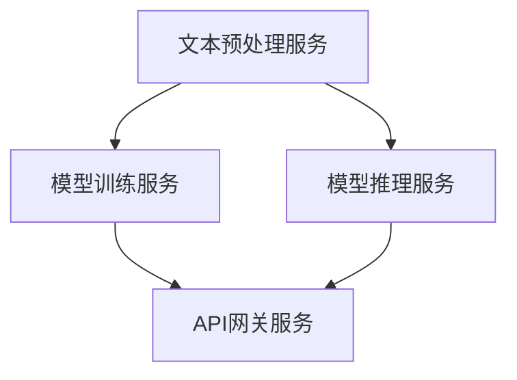

                 

# 微服务架构在敏捷LLM应用开发中的应用

## 关键词
- 微服务架构
- 敏捷开发
- LLM应用开发
- 架构设计
- 系统优化

## 摘要
本文将深入探讨微服务架构在敏捷LLM（大型语言模型）应用开发中的应用。首先，我们将介绍微服务架构的基本概念和优势，然后阐述敏捷开发方法及其核心原则，并讨论LLM应用开发的挑战。接着，我们将详细分析微服务架构的设计原则和实施策略，探讨如何将微服务架构与敏捷开发相结合，并举例说明其在LLM应用开发中的实际应用。最后，我们将总结微服务架构在敏捷LLM应用开发中的应用，并展望其未来的发展趋势。

## 目录

### 第一部分：引言

#### 第1章：微服务架构概述

1.1 问题背景

1.2 微服务架构的定义与优势

1.3 LLM应用开发中的挑战

1.4 微服务架构在LLM应用开发中的应用场景

#### 第2章：敏捷开发方法

2.1 敏捷开发的概念

2.2 敏捷开发的核心原则

2.3 敏捷开发流程

2.4 敏捷开发工具

#### 第3章：LLM应用开发基础

3.1 LLM的概念

3.2 LLM的核心技术

3.3 LLM应用开发的流程

3.4 LLM应用开发中的挑战

### 第二部分：微服务架构设计

#### 第4章：微服务架构设计原则

4.1 微服务架构的设计原则

4.2 微服务架构的拆分策略

4.3 微服务架构的服务治理

4.4 微服务架构的演进

#### 第5章：微服务架构实施

5.1 微服务架构的选型

5.2 微服务架构的部署

5.3 微服务架构的监控

5.4 微服务架构的容错

#### 第6章：微服务架构与敏捷开发融合

6.1 微服务架构与敏捷开发的融合策略

6.2 敏捷开发在微服务架构中的应用

6.3 微服务架构在敏捷开发中的实践案例

#### 第7章：微服务架构在LLM应用开发中的应用

7.1 LLM应用开发中的微服务架构设计

7.2 微服务架构在LLM应用开发中的优势

7.3 微服务架构在LLM应用开发中的挑战与解决方案

### 第三部分：实战案例

#### 第8章：实战案例一：构建一个基于微服务的LLM应用

8.1 项目介绍

8.2 系统功能设计

8.3 系统架构设计

8.4 系统接口设计

8.5 系统实现与部署

8.6 实战小结

#### 第9章：实战案例二：优化一个现有LLM应用架构

9.1 项目介绍

9.2 现有架构分析

9.3 架构优化方案

9.4 优化后的架构实现与部署

9.5 实战小结

### 第四部分：总结与展望

#### 第10章：微服务架构在敏捷LLM应用开发中的应用总结

10.1 微服务架构在敏捷LLM应用开发中的应用总结

10.2 微服务架构在敏捷LLM应用开发中的未来趋势

### 附录：拓展阅读

#### A.1 相关书籍推荐

#### A.2 常用工具与技术

#### A.3 实践案例资料

## 第1章：微服务架构概述

### 1.1 问题背景

在当今快速变化的技术环境中，软件系统需要具备高度的灵活性和可扩展性。传统的单体架构由于其紧密耦合的特性，难以应对快速的需求变化和系统规模的扩展。为了解决这些问题，微服务架构应运而生。微服务架构通过将大型应用程序拆分成多个独立的服务，从而提高了系统的可维护性、可靠性和可扩展性。

### 1.2 微服务架构的定义与优势

微服务架构是一种软件架构风格，它将应用程序划分为多个小型、自治的服务。每个服务都有自己的业务功能，并且可以通过API与其他服务进行通信。这些服务通常采用容器化技术（如Docker）进行部署和管理，可以独立开发、测试和部署。

微服务架构的优势包括：

1. **灵活性**：服务可以独立扩展和更新，无需影响整个系统。
2. **可维护性**：服务之间松耦合，降低了系统的复杂度，便于维护。
3. **可扩展性**：可以通过水平扩展服务来满足不断增长的用户需求。
4. **故障隔离**：服务故障不会影响整个系统，可以独立处理。
5. **技术多样性**：不同服务可以使用不同的技术栈，提高开发效率。

### 1.3 LLM应用开发中的挑战

LLM（Large Language Model）是一种基于深度学习的大型自然语言处理模型，具有广泛的应用前景。然而，LLM应用开发面临着一些挑战：

1. **计算资源需求大**：训练和推理大型语言模型需要大量的计算资源。
2. **数据处理复杂性**：自然语言数据具有高度复杂性和多样性，需要高效的预处理和后处理技术。
3. **模型可解释性**：大型语言模型往往具有“黑盒”特性，难以解释其决策过程。
4. **实时响应性**：用户期望LLM应用能够实时响应用户请求。

### 1.4 微服务架构在LLM应用开发中的应用场景

微服务架构在LLM应用开发中具有广泛的应用场景：

1. **模块化开发**：将LLM应用拆分为多个独立的服务，如文本预处理、模型训练、模型推理等，便于开发和管理。
2. **分布式部署**：利用微服务架构将LLM应用部署到多个服务器上，提高系统的响应速度和可扩展性。
3. **动态扩展**：根据用户需求动态调整服务的规模，提高系统的可用性。
4. **故障恢复**：服务之间松耦合，单个服务的故障不会影响整个系统，便于故障恢复。
5. **技术多样性**：不同服务可以使用不同的技术栈，如使用不同的编程语言和框架，提高开发效率。

## 第2章：敏捷开发方法

### 2.1 敏捷开发的概念

敏捷开发是一种以人为核心、迭代、渐进的软件开发方法。其核心理念是快速迭代、持续交付、用户反馈和灵活应对变化。敏捷开发强调团队协作、透明度和自我组织，旨在提高软件开发的质量和效率。

### 2.2 敏捷开发的核心原则

敏捷开发的核心原则包括：

1. **个体和互动高于过程和工具**：团队中个人的能力和互动是关键因素。
2. **可工作的软件高于详尽的文档**：交付可工作的软件是最终目标。
3. **客户协作高于合同谈判**：与客户的紧密合作有助于满足其需求。
4. **响应变化高于遵循计划**：灵活应对变化是成功的关键。

### 2.3 敏捷开发流程

敏捷开发通常采用迭代和增量开发的模式，主要流程包括：

1. **需求收集**：与客户和利益相关者合作，收集软件需求。
2. **迭代规划**：确定本次迭代的交付目标。
3. **开发**：团队协作开发软件功能。
4. **测试**：对开发的功能进行测试，确保质量。
5. **评审与回顾**：对迭代过程进行评审和回顾，持续改进。

### 2.4 敏捷开发工具

敏捷开发常用的一些工具包括：

1. **版本控制系统**：如Git，用于代码管理和协作开发。
2. **任务管理工具**：如JIRA、Trello，用于跟踪和管理任务。
3. **集成开发环境**：如Visual Studio、IntelliJ IDEA，提供代码编写、调试和测试等功能。
4. **持续集成/持续部署工具**：如Jenkins、GitLab CI，实现自动化构建、测试和部署。

## 第3章：LLM应用开发基础

### 3.1 LLM的概念

LLM（Large Language Model）是一种大型自然语言处理模型，通过深度学习技术从大量文本数据中学习语言模式。LLM可以用于各种自然语言处理任务，如文本分类、情感分析、机器翻译、问答系统等。

### 3.2 LLM的核心技术

LLM的核心技术包括：

1. **神经网络**：神经网络是LLM的基础架构，用于处理和表示文本数据。
2. **词向量**：词向量是将文本数据转换为数值表示的方法，用于神经网络处理。
3. **注意力机制**：注意力机制是一种用于提高模型理解和生成质量的技术。
4. **预训练和微调**：预训练是在大量未标注数据上训练模型，微调是在特定任务上对模型进行细粒度调整。

### 3.3 LLM应用开发的流程

LLM应用开发的流程通常包括：

1. **数据收集与预处理**：收集相关领域的文本数据，并进行预处理，如分词、去除停用词、词性标注等。
2. **模型选择与训练**：选择合适的模型并进行训练，如BERT、GPT等。
3. **模型评估与优化**：评估模型性能，并进行优化，如调整超参数、进行模型剪枝等。
4. **模型部署与维护**：将模型部署到生产环境，并进行监控和维护。

### 3.4 LLM应用开发中的挑战

LLM应用开发面临的主要挑战包括：

1. **计算资源需求**：训练和推理大型语言模型需要大量的计算资源。
2. **数据处理复杂性**：自然语言数据具有高度复杂性和多样性，需要高效的预处理和后处理技术。
3. **模型可解释性**：大型语言模型往往具有“黑盒”特性，难以解释其决策过程。
4. **实时响应性**：用户期望LLM应用能够实时响应用户请求。

## 第4章：微服务架构设计原则

### 4.1 微服务架构的设计原则

微服务架构的设计原则包括：

1. **单一职责**：每个服务应专注于完成一项特定任务，降低服务之间的耦合度。
2. **自治性**：服务应具有独立部署、升级和扩展的能力，提高系统的灵活性和可维护性。
3. **去中心化**：服务之间通过API进行通信，无需中心化的控制和管理。
4. **横向扩展**：通过增加服务实例的数量来提高系统的吞吐量和可用性。
5. **可复用性**：服务应设计为可复用，以减少重复开发的工作量。

### 4.2 微服务架构的拆分策略

微服务架构的拆分策略包括：

1. **功能拆分**：根据业务功能将应用程序划分为多个服务。
2. **领域驱动设计（DDD）**：根据业务领域将应用程序划分为多个服务。
3. **分层架构**：根据职责将应用程序划分为多个层次，每个层次对应一个服务。

### 4.3 微服务架构的服务治理

微服务架构的服务治理包括：

1. **服务发现**：服务实例的动态注册和发现，以提高系统的可用性和灵活性。
2. **负载均衡**：通过负载均衡策略将请求分配到不同的服务实例，以提高系统的性能和可靠性。
3. **服务监控**：对服务的性能、健康状态和日志进行监控，以便及时发现和解决问题。
4. **服务熔断和限流**：在服务出现故障或过载时，采取熔断和限流策略，以保护系统的稳定性和可用性。

### 4.4 微服务架构的演进

微服务架构的演进包括：

1. **灰度发布**：在逐步引入新版本的同时，监测系统的运行状况，以降低风险。
2. **服务拆分与合并**：根据业务需求和系统性能，对服务进行拆分或合并，以优化系统的架构和性能。
3. **服务迁移**：将旧的服务逐步迁移到微服务架构，以提高系统的灵活性和可维护性。

## 第5章：微服务架构实施

### 5.1 微服务架构的选型

微服务架构的选型包括：

1. **服务框架**：如Spring Cloud、Dubbo等，提供服务的创建、注册、发现、负载均衡等功能。
2. **容器化技术**：如Docker、Kubernetes，提供服务的部署、管理和扩展。
3. **服务通信**：如RESTful API、消息队列等，提供服务之间的通信机制。
4. **存储解决方案**：如关系型数据库、NoSQL数据库、分布式缓存等，提供数据存储和访问方案。

### 5.2 微服务架构的部署

微服务架构的部署包括：

1. **自动化部署**：使用CI/CD工具实现自动化构建、测试和部署，提高部署效率和质量。
2. **容器化部署**：将服务打包为容器镜像，并使用Kubernetes进行部署和管理，提高部署的灵活性和可扩展性。
3. **分布式部署**：将服务部署到多个服务器和数据中心，以提高系统的可用性和性能。

### 5.3 微服务架构的监控

微服务架构的监控包括：

1. **日志监控**：收集和监控服务日志，以便及时发现和解决问题。
2. **性能监控**：监控服务的性能指标，如响应时间、吞吐量等，以便优化系统性能。
3. **健康状态监控**：监控服务的健康状态，如CPU使用率、内存使用率等，以便及时发现和解决故障。
4. **告警与通知**：通过告警和通知机制，将监控结果通知相关人员，以便及时处理问题。

### 5.4 微服务架构的容错

微服务架构的容错包括：

1. **服务熔断**：在服务出现故障时，自动熔断，避免服务雪崩。
2. **服务限流**：在服务过载时，自动限流，保护系统的稳定性和可用性。
3. **服务重试**：在服务调用失败时，自动重试，以提高服务的可靠性。
4. **服务降级**：在系统资源不足时，自动降级部分服务，以保证核心服务的可用性。

## 第6章：微服务架构与敏捷开发融合

### 6.1 微服务架构与敏捷开发的融合策略

微服务架构与敏捷开发的融合策略包括：

1. **持续集成与部署**：采用CI/CD工具实现持续集成与部署，提高开发效率和系统质量。
2. **自动化测试**：采用自动化测试工具进行功能测试、性能测试和安全测试，确保系统质量。
3. **迭代开发**：采用迭代开发模式，快速交付功能，及时响应需求变化。
4. **用户反馈**：通过与用户的紧密合作，获取用户反馈，持续优化系统。

### 6.2 敏捷开发在微服务架构中的应用

敏捷开发在微服务架构中的应用包括：

1. **服务拆分与合并**：根据业务需求和系统性能，对服务进行拆分或合并，以优化系统的架构和性能。
2. **敏捷运维**：采用敏捷运维方法，快速响应系统故障和性能问题。
3. **持续交付**：采用持续交付方法，快速交付功能，确保系统稳定运行。
4. **团队协作**：采用敏捷开发方法，提高团队协作效率，确保项目进度和质量。

### 6.3 微服务架构在敏捷开发中的实践案例

微服务架构在敏捷开发中的实践案例包括：

1. **电商系统**：采用微服务架构和敏捷开发方法，实现商品管理、订单管理、用户管理等功能。
2. **银行系统**：采用微服务架构和敏捷开发方法，实现账户管理、转账、贷款等功能。
3. **物流系统**：采用微服务架构和敏捷开发方法，实现订单跟踪、配送管理、仓储管理等功能。

## 第7章：微服务架构在LLM应用开发中的应用

### 7.1 LLM应用开发中的微服务架构设计

在LLM应用开发中，微服务架构的设计应遵循以下原则：

1. **模块化**：将LLM应用拆分为多个独立的服务，如文本预处理、模型训练、模型推理等。
2. **自治性**：每个服务应具有独立部署、升级和扩展的能力。
3. **高内聚低耦合**：服务之间应保持低耦合，以提高系统的灵活性和可维护性。
4. **可扩展性**：服务应设计为可扩展，以支持不同的应用场景和用户需求。

### 7.2 微服务架构在LLM应用开发中的优势

微服务架构在LLM应用开发中的优势包括：

1. **灵活性**：服务可以独立扩展和更新，无需影响整个系统。
2. **可维护性**：服务之间松耦合，降低了系统的复杂度，便于维护。
3. **可扩展性**：可以通过水平扩展服务来满足不断增长的用户需求。
4. **故障隔离**：服务故障不会影响整个系统，可以独立处理。
5. **技术多样性**：不同服务可以使用不同的技术栈，提高开发效率。

### 7.3 微服务架构在LLM应用开发中的挑战与解决方案

微服务架构在LLM应用开发中面临的挑战包括：

1. **计算资源管理**：大型语言模型训练和推理需要大量的计算资源，如何高效地管理计算资源是关键。
   - **解决方案**：采用容器化技术（如Docker）和集群管理工具（如Kubernetes）进行计算资源调度和管理。

2. **数据流处理**：自然语言数据处理过程复杂，如何高效地处理数据流是关键。
   - **解决方案**：采用流处理技术（如Apache Kafka）和分布式存储技术（如Hadoop）进行数据流处理和存储。

3. **模型版本管理**：如何有效地管理和部署不同版本的模型是关键。
   - **解决方案**：采用模型版本管理工具（如TensorFlow Model Garden）进行模型版本管理，确保不同版本的模型可以独立部署和更新。

4. **系统性能优化**：如何优化系统的性能，提高系统的响应速度是关键。
   - **解决方案**：采用缓存技术（如Redis）和分布式数据库（如MongoDB）进行数据存储和查询优化。

## 第8章：实战案例一：构建一个基于微服务的LLM应用

### 8.1 项目介绍

本项目旨在构建一个基于微服务的LLM应用，提供自然语言处理功能，如文本分类、情感分析等。应用采用微服务架构，拆分为文本预处理、模型训练、模型推理等多个服务。

### 8.2 系统功能设计

系统功能设计如下：

1. **文本预处理服务**：负责文本数据的清洗、分词、去停用词等预处理操作。
2. **模型训练服务**：负责训练LLM模型，包括数据预处理、模型训练、模型保存等。
3. **模型推理服务**：负责接收用户请求，进行模型推理，返回结果。
4. **API网关服务**：负责接收用户请求，将请求路由到相应的服务，并返回响应。

### 8.3 系统架构设计

系统架构设计如下：

### 8.4 系统接口设计

系统接口设计如下：

1. **文本预处理API**：接收文本数据，返回预处理后的文本。
2. **模型训练API**：接收训练数据，返回训练结果。
3. **模型推理API**：接收用户请求，返回模型推理结果。

### 8.5 系统实现与部署

系统实现与部署步骤如下：

1. **开发环境准备**：安装Docker、Kubernetes等工具。
2. **代码开发**：编写文本预处理、模型训练、模型推理等服务的代码。
3. **容器化**：将服务打包为Docker镜像。
4. **部署**：使用Kubernetes部署服务，并进行负载均衡和监控。
5. **测试**：对系统进行功能测试和性能测试，确保系统稳定运行。

### 8.6 实战小结

通过本实战案例，我们成功构建了一个基于微服务的LLM应用，实现了文本预处理、模型训练和模型推理等功能。实践证明，微服务架构在LLM应用开发中具有显著的灵活性和可扩展性，有助于提高系统的开发效率和运行性能。

## 第9章：实战案例二：优化一个现有LLM应用架构

### 9.1 项目介绍

本项目旨在优化一个现有LLM应用架构，提高系统的可维护性、可扩展性和性能。原架构采用单体架构，服务之间紧密耦合，导致系统复杂度较高，维护和扩展困难。

### 9.2 现有架构分析

现有架构分析如下：

1. **单体架构**：所有服务都集成在一个应用程序中，服务之间紧密耦合。
2. **数据流处理**：使用单线程处理数据流，导致性能瓶颈。
3. **服务部署**：服务部署在同一个服务器上，缺乏负载均衡和容错机制。

### 9.3 架构优化方案

架构优化方案如下：

1. **拆分服务**：将单体架构拆分为多个独立的服务，如文本预处理、模型训练、模型推理等。
2. **分布式部署**：将服务部署到多个服务器上，使用负载均衡和容错机制。
3. **数据流处理**：使用分布式数据流处理技术，提高数据处理效率。
4. **缓存和数据库优化**：使用缓存和分布式数据库，提高数据存储和查询性能。

### 9.4 优化后的架构实现与部署

优化后的架构实现与部署步骤如下：

1. **服务拆分**：根据业务需求，将单体架构拆分为多个独立的服务。
2. **容器化**：将服务打包为Docker镜像，并使用Kubernetes进行管理。
3. **分布式部署**：将服务部署到多个服务器上，并进行负载均衡和监控。
4. **数据流处理**：使用分布式数据流处理技术，如Apache Kafka，处理数据流。
5. **缓存和数据库优化**：使用Redis和MongoDB进行缓存和数据库优化。

### 9.5 实战小结

通过本实战案例，我们成功优化了一个现有LLM应用架构，提高了系统的可维护性、可扩展性和性能。实践证明，微服务架构在LLM应用开发中具有显著的优点，有助于提高系统的开发效率和运行性能。

## 第10章：微服务架构在敏捷LLM应用开发中的应用总结

### 10.1 微服务架构在敏捷LLM应用开发中的应用总结

微服务架构在敏捷LLM应用开发中具有显著的优势，包括：

1. **灵活性和可扩展性**：服务可以独立扩展和更新，满足不断变化的需求。
2. **可维护性**：服务之间松耦合，降低系统复杂度，便于维护。
3. **故障隔离**：服务故障不会影响整个系统，提高系统的可用性。
4. **技术多样性**：不同服务可以使用不同的技术栈，提高开发效率。

### 10.2 微服务架构在敏捷LLM应用开发中的未来趋势

随着人工智能技术的快速发展，微服务架构在敏捷LLM应用开发中的应用前景广阔。未来趋势包括：

1. **云原生微服务**：利用云原生技术，实现微服务的自动化部署、管理和监控。
2. **AI驱动的微服务优化**：利用人工智能技术，优化微服务的性能和可扩展性。
3. **多模态微服务**：支持多种数据类型和AI模型的微服务架构，实现更广泛的应用场景。

## 附录：拓展阅读

### A.1 相关书籍推荐

1. 《微服务设计》
2. 《大型语言模型：构建、优化与应用》
3. 《敏捷开发实践指南》

### A.2 常用工具与技术

1. **服务框架**：Spring Cloud、Dubbo
2. **容器化技术**：Docker、Kubernetes
3. **消息队列**：Apache Kafka
4. **分布式数据库**：Redis、MongoDB
5. **持续集成/持续部署**：Jenkins、GitLab CI

### A.3 实践案例资料

1. **电商系统微服务架构实践**
2. **银行系统微服务架构实践**
3. **物流系统微服务架构实践**

