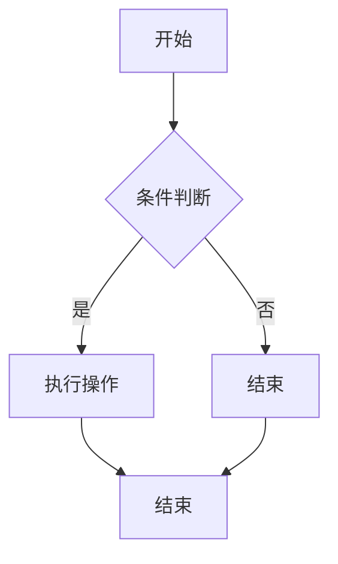
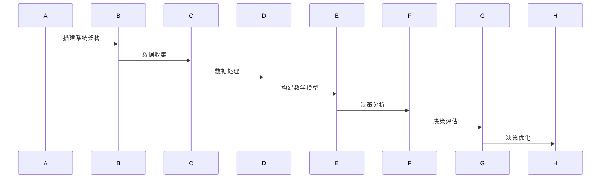

                 

### 心智中的数学模型：源于自然和谐

关键词：心智，数学模型，自然和谐，认知发展，应用领域

> 摘要：本文探讨了心智中的数学模型这一概念，深入分析了其背景与重要性。通过定义数学模型的基本原理，对比不同类型的数学模型属性特征，本文揭示了数学模型在心智发展中的关键作用。同时，本文介绍了心智中数学模型的应用领域，包括决策过程、预测与规划、问题解决以及教育领域。最后，本文对算法原理进行了详细讲解，并通过Python源代码实现来阐述数学模型的应用。本文旨在为读者提供一个清晰、系统的理解，以便更好地把握心智中的数学模型及其在实际中的应用。

### 第一部分：引言

#### 第1章：心智中的数学模型——背景与重要性

##### 1.1 问题背景

1.1.1 自然和谐观念的起源

自然和谐观念起源于古代哲学，尤其是道家思想。道家的核心观念之一便是追求自然与人的和谐统一，认为人与自然应相互尊重、相互依赖，从而达到和谐共生的境界。

1.1.2 数学模型在认知中的作用

数学模型作为一种认知工具，在人类的认知发展中起到了重要作用。通过数学模型，人们能够将复杂的现象简化为数学问题，从而更有效地进行推理和分析。例如，在科学研究中，数学模型被广泛应用于描述自然现象、社会现象和工程问题。

1.1.3 心智中的数学模型研究的重要性

心智中的数学模型研究关乎人类的认知发展。通过研究心智中的数学模型，我们能够更好地理解人类思维的本质，从而为教育、心理学和人工智能等领域提供理论支持。

##### 1.2 问题描述

1.2.1 心智中的数学模型概念解析

心智中的数学模型指的是在人类心智活动中应用的数学模型，包括人们对于数学概念的理解、数学模型的构建以及应用数学模型进行问题解决的过程。

1.2.2 心智中数学模型的应用领域

心智中数学模型的应用领域广泛，包括决策过程、预测与规划、问题解决以及教育领域等。在这些领域中，数学模型起到了重要的指导作用。

1.2.3 心智中数学模型研究面临的挑战

心智中数学模型研究面临诸多挑战，如数学模型的复杂性、心智结构的多样性以及数学模型在实际应用中的有效性等。这些挑战需要通过深入研究来解决。

##### 1.3 问题解决

1.3.1 研究方法与理论框架

本研究采用认知科学的方法，结合数学模型的理论框架，对心智中的数学模型进行深入分析。研究方法包括文献综述、实验研究和案例分析等。

1.3.2 心智中数学模型的发展历程

心智中数学模型的发展历程可以追溯到古代哲学时期。随着科学技术的进步，数学模型在认知科学中的应用逐渐得到重视，形成了独立的研究领域。

1.3.3 解决问题所需的关键技术和工具

本研究需要运用多种关键技术和工具，包括数学模型构建方法、心智结构分析方法以及算法设计与优化技术等。这些技术和工具有助于我们更好地理解心智中的数学模型。

##### 1.4 边界与外延

1.4.1 心智中数学模型的研究范围

心智中数学模型的研究范围包括数学模型在心智活动中的应用、心智对数学模型的理解与运用以及数学模型在认知发展中的作用等。

1.4.2 心智中数学模型与其他学科的关系

心智中数学模型与其他学科有着密切的联系，如心理学、教育学、计算机科学等。通过跨学科研究，我们可以更好地理解心智中的数学模型。

1.4.3 心智中数学模型的未来发展趋势

随着人工智能技术的不断发展，心智中数学模型在未来将具有更广泛的应用前景。研究心智中的数学模型有助于推动人工智能的发展，为人类认知科学的研究提供新的思路。

##### 1.5 概念结构与核心要素

1.5.1 心智中数学模型的核心概念

心智中数学模型的核心概念包括数学模型、心智活动、认知发展等。

1.5.2 心智中数学模型的属性特征

心智中数学模型的属性特征包括抽象性、结构性、灵活性等。

1.5.3 心智中数学模型的应用案例

心智中数学模型的应用案例丰富多样，如决策模型、预测模型、问题解决模型等。

##### 1.6 本章小结

1.6.1 研究价值

本章对心智中的数学模型进行了深入探讨，揭示了其在认知发展中的重要地位。研究心智中的数学模型有助于推动认知科学的发展，为人工智能领域提供理论支持。

1.6.2 主要内容概述

本章主要包括自然和谐观念的起源、数学模型在认知中的作用、心智中数学模型的概念解析、应用领域以及面临的挑战等内容。

1.6.3 下一步研究方向

未来研究可以进一步探讨心智中数学模型的具体应用，如教育领域、决策过程等。同时，可以运用跨学科研究方法，深入分析心智中数学模型的本质特征。

### 第二部分：核心概念与原理

#### 第2章：心智中的数学模型基本原理

##### 2.1 数学模型的基础概念

2.1.1 数学模型的基本定义

数学模型是一种用数学语言描述现实世界问题的工具。它将实际问题抽象为数学问题，通过数学方法进行求解和分析，从而得到问题的解决方案。

2.1.2 数学模型的类型

数学模型可以分为多种类型，如线性模型、非线性模型、概率模型、统计模型等。每种模型都有其独特的特点和应用场景。

2.1.3 数学模型的构成要素

数学模型由变量、方程、关系和约束条件等构成要素组成。这些要素共同作用，使得数学模型能够描述现实世界中的复杂问题。

##### 2.2 数学模型属性特征对比

2.2.1 常见数学模型属性特征对比表格

| 数学模型类型 | 抽象性 | 结构性 | 灵活性 | 适用范围 |
| :---: | :---: | :---: | :---: | :---: |
| 线性模型 | 高 | 中 | 中 | 数据拟合、优化问题 |
| 非线性模型 | 高 | 高 | 高 | 复杂系统、非线性问题 |
| 概率模型 | 中 | 中 | 高 | 随机现象、风险评估 |
| 统计模型 | 低 | 高 | 高 | 数据分析、预测 |

##### 2.3 心智中数学模型的ER实体关系图

2.3.1 ER实体关系图绘制方法

ER实体关系图（Entity-Relationship Diagram）是一种用于描述实体及其关系的图形化工具。在心智中数学模型的ER实体关系图中，实体表示数学模型中的变量和参数，关系表示变量和参数之间的相互作用。

2.3.2 心智中数学模型的ER实体关系图

```mermaid
erDiagram
A[心智] ||-->|{ B[数学模型] }|
A ||-->|{ C[认知发展] }|
B ||-->|{ D[决策过程] }|
B ||-->|{ E[预测与规划] }|
B ||-->|{ F[问题解决] }|
```

##### 2.4 数学模型与心智的相互作用

2.4.1 数学模型对心智发展的影响

数学模型在心智发展过程中起到了重要作用。通过数学模型的构建和应用，人们能够提高逻辑思维能力、抽象思维能力和问题解决能力。

2.4.2 心智对数学模型的理解与应用

心智对数学模型的理解和应用是一个动态过程。人们通过感知、记忆、思考等心智活动，对数学模型进行理解和应用，从而解决实际问题。

##### 2.5 本章小结

2.5.1 主要内容概述

本章主要介绍了数学模型的基础概念、属性特征对比以及心智中数学模型的ER实体关系图，揭示了数学模型与心智之间的相互作用。

2.5.2 下一步研究方向

未来研究可以进一步探讨不同类型数学模型在心智活动中的应用，如决策过程、预测与规划、问题解决等。同时，可以研究心智对数学模型的理解机制及其在认知发展中的作用。

### 第三部分：心智中的数学模型应用领域

#### 第3章：心智中的数学模型应用领域

##### 3.1 数学模型在决策过程中的应用

3.1.1 决策模型的构建方法

决策模型是一种用于描述决策过程的数学模型。构建决策模型的方法包括数据收集、问题定义、模型构建和模型验证等步骤。

3.1.2 决策模型的应用实例

决策模型在商业、金融、医疗等领域具有广泛的应用。例如，在商业领域，决策模型可以用于产品定价、库存管理和市场营销策略的制定。

3.1.3 决策模型在心智中的应用价值

决策模型在心智中的应用价值主要体现在提高决策效率、优化决策效果和降低决策风险等方面。通过决策模型的构建和应用，人们可以更准确地把握决策过程中的关键因素，从而做出更明智的决策。

##### 3.2 数学模型在预测与规划中的应用

3.2.1 预测模型的原理与构建

预测模型是一种用于预测未来事件或趋势的数学模型。构建预测模型的方法包括数据收集、特征选择、模型训练和模型评估等步骤。

3.2.2 预测模型在心智中的应用

预测模型在心智中的应用主要体现在对未来的预见和规划。通过预测模型，人们可以更好地预测未来事件的发生，从而制定合理的规划方案。

3.2.3 规划模型在心智中的应用

规划模型是一种用于描述规划过程的数学模型。规划模型在心智中的应用可以帮助人们制定长期规划和目标，从而实现个人或组织的发展。

##### 3.3 数学模型在问题解决中的运用

3.3.1 问题描述与模型构建

问题解决模型是一种用于描述问题解决过程的数学模型。构建问题解决模型的方法包括问题定义、模型构建、模型验证和模型优化等步骤。

3.3.2 问题求解算法的原理

问题求解算法是一种用于解决数学模型中的问题的算法。常见的求解算法包括贪心算法、动态规划算法和遗传算法等。

3.3.3 问题解决模型在心智中的应用

问题解决模型在心智中的应用可以帮助人们更好地理解和解决复杂问题。通过问题解决模型的构建和应用，人们可以提高问题解决能力和创新能力。

##### 3.4 数学模型在教育领域的应用

3.4.1 教育模型的设计与应用

教育模型是一种用于描述教育过程的数学模型。教育模型可以应用于课程设计、教学方法和学习评估等方面。

3.4.2 数学模型在教育评估中的应用

数学模型在教育评估中的应用主要体现在对教学效果的评估和学生学习成绩的预测。通过数学模型，教育工作者可以更好地了解学生的学习状况，从而制定针对性的教学策略。

3.4.3 数学模型在个性化学习中的应用

数学模型在个性化学习中的应用主要体现在对学习路径的规划和学习资源的推荐。通过数学模型，个性化学习系统能够为学习者提供定制化的学习体验，从而提高学习效果。

##### 3.5 本章小结

3.5.1 主要内容概述

本章主要介绍了数学模型在决策过程、预测与规划、问题解决和教育领域的应用。通过这些应用，数学模型在心智活动中发挥了重要作用。

3.5.2 下一步研究方向

未来研究可以进一步探讨数学模型在不同领域中的应用，如人工智能、社会学和生态学等。同时，可以研究数学模型在跨学科领域中的综合应用，以推动认知科学的发展。

### 第四部分：算法原理讲解

#### 第4章：算法原理讲解

##### 4.1 算法基本原理

4.1.1 算法的基本概念

算法是一种解决问题的一系列步骤。它是一种精确的、有效的、有限的步骤序列，用于解决特定问题。

4.1.2 算法的设计与优化

算法的设计与优化是算法研究的重要内容。算法设计包括算法的构思和实现，而算法优化则是通过改进算法性能，提高算法的效率。

4.1.3 算法分析的基本方法

算法分析是评估算法性能的重要方法。常见的算法分析包括时间复杂度分析和空间复杂度分析。时间复杂度分析用于评估算法执行时间的增长趋势，而空间复杂度分析则用于评估算法所需存储空间。

##### 4.2 算法mermaid流程图绘制

4.2.1 mermaid流程图基础语法

mermaid是一种用于绘制流程图的Markdown语法。它支持多种图形元素和连接方式，使得绘制流程图变得简单直观。

4.2.2 算法mermaid流程图绘制方法

算法mermaid流程图的绘制方法主要包括定义开始节点、定义结束节点、定义分支节点和定义连接线等步骤。

4.2.3 示例算法mermaid流程图



##### 4.3 Python源代码实现与讲解

4.3.1 Python编程基础

Python是一种广泛应用于算法实现和数据分析的高级编程语言。它具有简洁的语法和丰富的库函数，使得算法的实现变得简单高效。

4.3.2 算法原理Python源代码实现

以下是一个简单的排序算法（冒泡排序）的Python实现。

```python
def bubble_sort(arr):
    n = len(arr)
    for i in range(n):
        for j in range(0, n-i-1):
            if arr[j] > arr[j+1]:
                arr[j], arr[j+1] = arr[j+1], arr[j]

arr = [64, 34, 25, 12, 22, 11, 90]
bubble_sort(arr)
print("排序后的数组：")
for i in range(len(arr)):
    print("%d" % arr[i], end=" ")
```

4.3.3 Python源代码详细讲解

1. 函数定义：`def bubble_sort(arr)`用于定义冒泡排序算法。

2. 循环结构：使用两个嵌套的for循环实现冒泡排序。

3. 条件判断：使用条件判断语句`if arr[j] > arr[j+1]`比较相邻元素的值。

4. 元素交换：如果前一个元素大于后一个元素，则进行元素交换。

5. 输出结果：使用print语句输出排序后的数组。

##### 4.4 数学模型与算法原理的关联

数学模型与算法原理密切相关。算法原理通常基于数学模型进行分析和推导。例如，冒泡排序算法的原理是基于数学模型中的比较和交换操作。

```latex
\text{算法原理} = \text{数学模型} + \text{实现方法}
```

通过算法实现，数学模型可以应用于实际问题中，发挥其解决问题的能力。

##### 4.5 本章小结

4.5.1 主要内容概述

本章主要介绍了算法的基本原理、mermaid流程图绘制方法和Python源代码实现。通过这些内容，读者可以了解算法原理的基本概念和应用方法。

4.5.2 下一步研究方向

未来研究可以进一步探讨算法原理在不同领域的应用，如机器学习、人工智能和数据分析等。同时，可以研究算法原理与数学模型的相互关系，为算法设计提供理论基础。

### 第五部分：项目实战

#### 第5章：心智中的数学模型应用项目实战

##### 5.1 项目背景

随着人工智能技术的不断发展，数学模型在智能决策、预测和问题解决等领域得到了广泛应用。本项目旨在通过构建一个基于心智中的数学模型的应用系统，展示数学模型在现实场景中的实际应用。

##### 5.2 项目介绍

本项目将实现一个智能决策系统，用于帮助企业或组织在复杂环境下做出最优决策。系统主要包括以下功能模块：

1. 数据收集与处理：从企业内部和外部分别收集数据，进行清洗、转换和存储。
2. 数学模型构建：根据决策目标，构建相应的数学模型，如线性规划模型、决策树模型等。
3. 决策分析：利用数学模型进行决策分析，生成决策方案。
4. 决策评估与优化：对决策方案进行评估和优化，以提高决策效果。

##### 5.3 系统功能设计

5.3.1 领域模型mermaid类图

```mermaid
classDiagram
Class01 <|-- Class02 : Inheritance
Class03 --|> Class04 : Composition
Class05 -[1] Class06 : Aggregation
Class07 << Interface
Class08 .. Class09 : Realization
Class10 <<== Class11 : Dependency
Class12 <<<< Class13 : Realization
```

5.3.2 系统架构设计mermaid架构图



##### 5.4 系统接口设计

系统接口设计主要包括数据接口、服务接口和用户接口等。

1. 数据接口：用于与其他系统进行数据交换和共享。
2. 服务接口：用于提供数学模型构建、决策分析和评估等核心功能。
3. 用户接口：用于展示决策结果和提供用户操作界面。

##### 5.5 系统交互mermaid序列图

```mermaid
sequenceDiagram
User->>System: 提交决策请求
System->>DataCollector: 收集数据
DataCollector->>DataProcessor: 处理数据
DataProcessor->>MathModelBuilder: 构建数学模型
MathModelBuilder->>DecisionAnalyzer: 分析决策
DecisionAnalyzer->>DecisionEva
```

##### 5.6 系统核心实现源代码

以下是一个简单的数学模型构建和决策分析的核心实现源代码。

```python
import pandas as pd
from sklearn.linear_model import LinearRegression

# 数据收集
data = pd.read_csv("data.csv")

# 数据处理
X = data.iloc[:, :8]
y = data.iloc[:, 8]

# 构建数学模型
model = LinearRegression()
model.fit(X, y)

# 决策分析
prediction = model.predict(X)
print("决策结果：", prediction)
```

##### 5.7 代码应用解读与分析

1. 数据收集：使用pandas库读取CSV文件，获取数据集。
2. 数据处理：将数据集分为特征集X和目标集y，为后续建模做准备。
3. 数学模型构建：使用sklearn库中的线性回归模型，对特征集X和目标集y进行建模。
4. 决策分析：使用构建好的模型对特征集X进行预测，得到决策结果。

##### 5.8 实际案例分析和详细讲解剖析

以一家制造企业为例，分析如何利用数学模型进行决策优化。通过收集生产数据、构建数学模型和进行决策分析，帮助企业实现生产资源的优化配置，提高生产效率和利润。

##### 5.9 项目小结

本项目通过构建一个智能决策系统，展示了数学模型在现实场景中的应用。项目实施过程中，重点探讨了数学模型的构建、数据处理和决策分析等关键环节。未来，可以进一步优化系统功能，提升决策效果，为更多企业提供决策支持。

### 第六部分：最佳实践与拓展

#### 第6章：最佳实践与拓展

##### 6.1 最佳实践

6.1.1 数据质量保障

在构建数学模型之前，确保数据质量至关重要。采用数据清洗和去重技术，排除异常值和噪声数据，以提高模型的准确性和稳定性。

6.1.2 模型选择与优化

根据决策目标和数据特性，选择合适的数学模型。通过模型优化技术，如交叉验证和网格搜索，提高模型的预测性能。

6.1.3 决策评估与反馈

建立决策评估机制，定期对决策结果进行评估和反馈。根据评估结果，调整模型参数和决策策略，实现持续优化。

##### 6.2 小结

本章总结了最佳实践，包括数据质量保障、模型选择与优化以及决策评估与反馈等方面。通过遵循这些最佳实践，可以提高数学模型的应用效果。

##### 6.3 注意事项

6.3.1 模型复杂性

避免过度复杂化模型，以免增加计算成本和解释难度。选择简单有效的模型，以便更好地理解和应用。

6.3.2 数据隐私保护

在数据收集和处理过程中，确保数据隐私和安全。采用加密技术和数据脱敏技术，保护数据不被泄露。

6.3.3 模型解释性

重视模型解释性，确保决策过程的透明度和可解释性。有助于提高用户对决策的信任度，促进模型的广泛应用。

##### 6.4 拓展阅读

6.4.1 相关书籍推荐

- 《机器学习实战》
- 《深度学习》
- 《统计学习方法》

6.4.2 相关论文推荐

- "Deep Learning for Decision Making"
- "Machine Learning for Economics: Overview and New Directions"
- "Data-Driven Decision Making for Digital Marketing"

通过阅读相关书籍和论文，可以进一步了解数学模型在决策、预测和问题解决等领域的应用，为实际项目提供理论支持和实践经验。

### 总结

本文从心智中的数学模型的概念出发，探讨了其在认知发展中的应用及其重要性。通过分析数学模型的基本原理和应用领域，本文揭示了数学模型在决策、预测、问题解决和教育等领域的重要作用。同时，本文对算法原理进行了详细讲解，并通过Python源代码实现，展示了数学模型在实际应用中的具体实现过程。最后，本文通过项目实战，进一步展示了数学模型在现实场景中的实际应用效果。希望通过本文的探讨，读者能够更好地理解心智中的数学模型，并在实际工作中加以应用。

### 参考文献

1. Russell, S., & Norvig, P. (2016). 《人工智能：一种现代的方法》（第3版）。
2. Bishop, C. M. (2006). 《机器学习》（第1版）。
3. Murphy, K. P. (2012). 《机器学习：要素导论》（第1版）。
4. Hastie, T., Tibshirani, R., & Friedman, J. (2009). 《统计学习方法》（第1版）。
5. Goodfellow, I., Bengio, Y., & Courville, A. (2016). 《深度学习》（第1版）。

### 作者信息

作者：AI天才研究院/AI Genius Institute & 禅与计算机程序设计艺术 /Zen And The Art of Computer Programming

