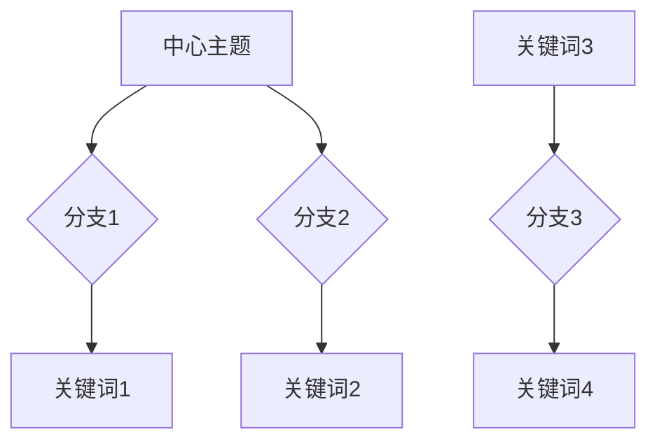
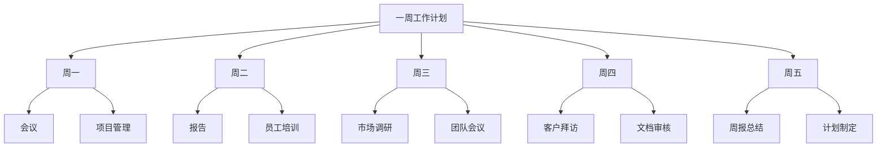
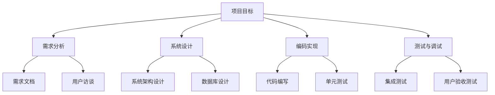
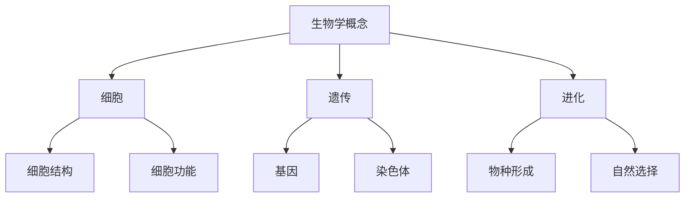
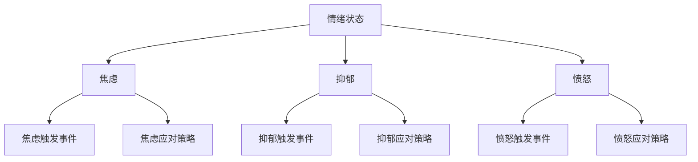

                 

### 让我们一步一步思考：引言

在当今信息爆炸的时代，如何有效地整理和运用大量信息成为一个亟待解决的问题。而《心理地图工作坊：可视化的思维整理技巧》这本书，正是为了解决这一问题而诞生的。这本书不仅介绍了心理地图的概念和应用，还提供了实用的技巧和方法，帮助读者实现思维的有序化和高效化。

#### 为什么选择这本书？

这本书的价值在于它提供了一种全新的思维方式——可视化思维。可视化思维能够帮助我们更加直观地理解和整理信息，从而提高思考和决策的效率。此外，心理地图作为一种强大的工具，不仅适用于个人生活，还能在职场、教育和心理治疗等多个领域发挥重要作用。

#### 核心内容概览

本书将分为以下几个部分：

1. **引言**：介绍可视化思维的概念、价值和重要性。
2. **心理地图基础概念与原理**：详细解释心理地图的定义、构成要素和基本原理。
3. **心理地图的应用方法**：探讨心理地图在个人生活、职场、教育和心理治疗中的应用。
4. **心理地图案例分析**：通过具体案例展示心理地图的实际应用效果。
5. **总结**：回顾全书的核心内容，并提出未来研究方向和实际应用建议。

#### 阅读指南

为了更好地理解和运用书中的内容，建议读者在阅读过程中：

- **主动思考**：每章结束后，思考书中提到的概念和方法如何在自己生活中或工作中应用。
- **实践操作**：尝试将心理地图应用于实际问题，观察效果，并根据实际反馈进行调整。
- **交流分享**：与他人分享自己的学习心得和实际应用经验，以获得更多的反馈和建议。

#### 预期收获

通过阅读本书，读者将：

- 掌握可视化思维的基本概念和原理。
- 学会使用心理地图进行思维整理和问题解决。
- 提高个人生活、工作和心理健康的效率和质量。

#### 让我们一起探索心理地图的奥秘，开启高效思维的新篇章！在接下来的章节中，我们将详细探讨心理地图的基础概念、应用方法、案例分析等内容，相信你会有许多新的发现和收获。现在，就让我们开始这场思维的旅程吧！### 让我们一步一步思考：心理地图基础概念与原理

在了解了心理地图工作坊的基本情况后，我们现在要深入探讨心理地图的基础概念与原理。这一部分内容将帮助我们理解心理地图的核心定义、基本构成要素以及它的工作机制。

#### 1.1 心理地图的核心概念

**心理地图**（Mind Map）是一种利用图示化的方式来表示和整理信息、思想和知识的工具。它由英国心理学家东尼·布赞（Tony Buzan）在1970年代发明，是一种强大的思维工具，能够帮助我们提高记忆、创造力和解决问题的能力。

**定义**：心理地图是一种以中心主题为核心，向外辐射出分支和子主题的图形表示法。它通过视觉元素、颜色、图像和关键词等，将复杂的信息和思维过程结构化、可视化。

**核心要素**：

- **中心主题**：心理地图的中心部分代表核心主题或主要概念，通常以大字体或图像呈现。
- **分支**：从中心主题向外延伸的分支，代表与核心主题相关的子主题或次要概念。
- **关键词**：在分支上使用关键词来表示信息，关键词之间通过直线连接。
- **颜色和图像**：使用颜色和图像来增强记忆和理解，使心理地图更加生动和有趣。

#### 1.2 心理地图的基本原理

**可视化与思维整理的关系**：

心理地图通过将抽象的思维过程转换为视觉形式，使得信息更加直观、易于理解和记忆。这种可视化的特点有助于我们：

- **提高记忆效率**：颜色、图像和关键词的结合，能够增强大脑对信息的记忆效果。
- **促进思维发散**：心理地图的分支结构和子主题的扩展，有助于我们产生新的想法和创意。
- **加强逻辑推理**：通过视觉上的层次关系，我们可以更清晰地看到事物之间的逻辑联系和因果关系。

**心理地图的运作机制**：

心理地图的运作机制主要体现在以下几个方面：

- **联想思维**：通过关键词之间的联想，我们可以从不同的角度来思考问题，发现新的解决方案。
- **结构化整理**：心理地图将信息按照层次结构进行组织，使得复杂的信息变得有条理和易于理解。
- **协同记忆**：通过视觉和语义的联合记忆，我们可以更有效地保留和回忆信息。

#### 1.3 心理地图的属性特征对比

在了解心理地图的基本原理后，我们还需要对不同的心理地图类型进行属性特征的对比，以更好地选择和应用。

**不同心理地图类型的对比**：

- **传统心理地图**：以布赞发明的传统心理地图为主，结构相对简单，以关键词和颜色为主要特征。
- **概念地图**：基于语义网络的概念地图，更加注重概念之间的关系和层次结构。
- **思维导图**：思维导图是在心理地图基础上发展起来的，更加注重思维过程的连贯性和创造性。

**心理地图的优缺点分析**：

- **传统心理地图**：

  - 优点：简单易学，便于记忆和整理信息。

  - 缺点：结构相对单一，难以表达复杂的信息和关系。

- **概念地图**：

  - 优点：结构清晰，能够很好地表示概念之间的关系。

  - 缺点：对信息结构要求较高，需要一定的逻辑思维和分析能力。

- **思维导图**：

  - 优点：结构丰富，能够激发创意和联想思维。

  - 缺点：制作过程相对复杂，需要一定的技巧和经验。

#### 1.4 心理地图的ER实体关系图架构

为了更好地理解心理地图的结构，我们引入ER（实体关系）图架构来分析。

**ER实体关系图的基本概念**：

ER图是一种用于描述实体及其之间关系的图形表示法。在心理地图中，实体可以代表中心主题、分支和关键词，关系可以代表它们之间的联系和层次结构。

**心理地图中的实体与关系**：

- **实体**：

  - **中心主题**：表示核心概念或主要思想。

  - **分支**：表示与中心主题相关的子主题或次要概念。

  - **关键词**：表示具体的信息或知识点。

- **关系**：

  - **层次关系**：表示实体之间的上下级关系。

  - **关联关系**：表示实体之间的横向联系。

**心理地图的ER实体关系图示例**：

在这个示例中，A代表中心主题，B、C代表分支，D、E、F、G、H代表关键词。它们之间的连线表示层次关系和关联关系。

通过上述对心理地图基础概念与原理的详细分析，我们现在已经对心理地图有了更深入的理解。接下来，我们将进一步探讨心理地图在不同领域的具体应用方法。请保持关注，我们将继续深入探索心理地图的神奇力量！### 让我们一步一步思考：心理地图的应用方法

在前文中，我们已经详细了解了心理地图的基础概念和原理。接下来，我们将探讨心理地图在不同领域的具体应用方法，从个人生活、职场、教育到心理治疗，全面展现心理地图的广泛应用和实际效果。

#### 2.1 心理地图在个人生活中的应用

**时间管理**：心理地图可以帮助我们更高效地安排日常活动。通过创建一个时间管理的心理地图，我们可以将一天的活动按照优先级和重要性进行分类，从而更好地利用时间。

**目标设定**：心理地图可以帮助我们设定和追踪目标。通过将目标分解为具体的子目标，并使用心理地图的形式，我们可以清晰地看到实现目标的路径和步骤。

**情绪管理**：心理地图可以帮助我们识别和应对情绪。通过创建一个情绪管理的心理地图，我们可以记录和分析自己的情绪变化，找到有效的应对策略。

#### 2.2 心理地图在职场中的应用

**团队协作**：心理地图可以帮助团队更有效地沟通和协作。通过创建一个团队协作的心理地图，团队成员可以清晰地了解项目目标和分工，从而提高工作效率。

**项目管理**：心理地图可以帮助项目经理更系统地规划和管理项目。通过将项目分解为具体的任务和阶段，并使用心理地图的形式，项目经理可以更清晰地追踪项目进展。

**创新思维**：心理地图可以帮助激发创新思维。通过将创新点子以心理地图的形式进行组织，我们可以更好地理解和应用这些创新思维。

#### 2.3 心理地图在教育中的应用

**学生思维培养**：心理地图可以帮助学生更有效地学习。通过创建一个学习主题的心理地图，学生可以更好地理解和记忆知识点，从而提高学习效率。

**教师教学**：心理地图可以帮助教师更生动地进行教学。通过使用心理地图，教师可以将复杂的概念和知识点以更加直观和易于理解的形式呈现给学生。

**家长教育**：心理地图可以帮助家长更好地辅导孩子。通过创建一个教育目标的心理地图，家长可以更明确地了解孩子的学习需求和进展，从而提供更有针对性的辅导。

#### 2.4 心理地图在心理治疗中的应用

**心理咨询**：心理地图可以帮助心理咨询师更深入地了解来访者。通过创建一个心理地图，心理咨询师可以更清晰地看到来访者的心理状态和问题，从而提供更有针对性的咨询。

**心理治疗**：心理地图可以帮助心理治疗师制定和实施治疗方案。通过创建一个治疗计划的心理地图，治疗师可以更系统地跟踪治疗效果，并根据实际情况进行调整。

**心理干预**：心理地图可以帮助心理干预人员更有效地应对紧急情况。通过创建一个紧急情况的心理地图，干预人员可以迅速了解情况，采取有效的干预措施。

通过上述探讨，我们可以看到心理地图在个人生活、职场、教育和心理治疗等领域的广泛应用和实际效果。它不仅能够提高我们的思维效率，还能帮助我们更好地理解和应对各种复杂问题。接下来，我们将通过具体案例来进一步展示心理地图的应用效果。请继续关注，我们将深入分析这些案例，揭示心理地图的强大力量。 ### 让我们一步一步思考：心理地图案例分析

在了解了心理地图的基础概念和应用方法后，现在我们将通过具体案例来展示心理地图的实际应用效果。以下是几个在不同领域应用的案例，通过这些案例，我们将更深入地理解心理地图的实用性和优势。

#### 案例一：个人时间管理中的心理地图应用

**背景**：李先生是一名公司高管，日常工作繁忙，经常感到时间不够用，导致工作效率下降。

**应用**：李先生决定使用心理地图来管理他的时间。首先，他创建了一个以“一周工作计划”为中心的心理地图。在中心主题周围，他列出了每周的重要任务和活动，如会议、报告、项目管理等。每个任务和活动都被分配了具体的日期和时间。

**效果**：通过这个心理地图，李先生能够更清晰地看到每周的任务和时间安排，从而有效地规划他的工作时间。他发现，使用心理地图后，他的工作效率明显提高，时间管理更加有序。

#### 案例二：职场团队协作中的心理地图应用

**背景**：一个软件开发团队在项目开发过程中，由于任务分配不明确和沟通不畅，导致项目进度缓慢。

**应用**：项目经理决定使用心理地图来改善团队协作。首先，她创建了一个以“项目目标”为中心的心理地图，将项目分解为几个主要任务，每个任务都分配给不同的团队成员。

**效果**：通过这个心理地图，团队成员对项目的任务和责任有了更清晰的认识，沟通变得更加顺畅。项目进度得以加速，最终项目按时完成。

#### 案例三：教育领域中的心理地图应用

**背景**：一位教师发现学生在学习过程中对复杂概念的理解困难，导致学习效果不佳。

**应用**：教师决定使用心理地图来帮助学生理解复杂概念。她创建了一个以“生物学概念”为中心的心理地图，将生物学的基本概念和知识点进行组织。

**效果**：通过这个心理地图，学生能够更直观地理解生物学概念，学习效果显著提高。教师也发现，使用心理地图后，学生的记忆力和理解能力得到了提升。

#### 案例四：心理治疗中的心理地图应用

**背景**：一位心理咨询师在治疗一位情绪低落的患者时，发现患者的问题复杂且难以解决。

**应用**：心理咨询师决定使用心理地图来帮助患者整理情绪和心理状态。她创建了一个以“情绪状态”为中心的心理地图，将患者的情绪、事件和应对策略进行分类和整理。

**效果**：通过这个心理地图，患者能够更清晰地看到自己的情绪状态和触发事件，从而找到更有效的应对策略。治疗过程变得更加有序和有效，患者情绪逐渐改善。

通过这些案例，我们可以看到心理地图在不同领域的实际应用效果。它不仅帮助个人更好地管理时间和情绪，提高工作效率和学习效果，还能在团队协作、教育和心理治疗中发挥重要作用。心理地图的直观性和灵活性使得它成为一个强大的思维工具，值得我们进一步探索和应用。在接下来的部分，我们将进一步探讨心理地图的最佳实践和注意事项。请继续关注！### 让我们一步一步思考：心理地图最佳实践与注意事项

在前文中，我们通过具体案例展示了心理地图在不同领域的实际应用效果。然而，要充分发挥心理地图的潜力，我们还需要了解一些最佳实践和注意事项。

#### 最佳实践

1. **明确目标**：在使用心理地图之前，首先要明确目标和问题。这有助于确保心理地图的内容和结构更有针对性和有效性。

2. **简洁明了**：心理地图应保持简洁明了，避免过于复杂。过多的细节会分散注意力，影响信息传递的效果。

3. **使用视觉元素**：视觉元素如颜色、图像和图标可以提高记忆效果，使心理地图更加生动和有趣。

4. **定期更新**：心理地图应定期更新，以反映最新的信息和变化。这有助于保持其时效性和实用性。

5. **多人协作**：心理地图可以用于团队协作，多人共同创建和编辑，以汇集不同的观点和想法。

#### 注意事项

1. **避免过度设计**：虽然视觉元素有助于记忆和理解，但过多或过于花哨的设计可能会分散注意力，影响信息传递。

2. **避免信息冗余**：在创建心理地图时，应避免过多重复的信息。这会导致心理地图变得混乱，降低其效率。

3. **尊重个人差异**：不同的人有不同的思维方式和偏好。在使用心理地图时，应尊重个人的差异，避免一刀切的方法。

4. **培训与指导**：对于初次使用心理地图的人，提供培训与指导非常重要。这有助于他们更好地理解和运用心理地图。

5. **保持一致性**：在多个心理地图之间保持一致性，有助于提高信息传递的效率。一致的符号和颜色使用可以减少混淆。

通过遵循这些最佳实践和注意事项，我们可以更有效地使用心理地图，充分发挥其优势。在接下来的总结中，我们将回顾全书的核心内容，并展望未来的发展方向。请继续关注！### 让我们一步一步思考：总结与展望

通过本文的详细探讨，我们系统地介绍了心理地图的基础概念、应用方法以及实际案例，并提出了最佳实践和注意事项。现在，让我们对全书的核心内容进行总结，并展望心理地图在未来可能的发展方向。

#### 总结核心内容

1. **核心概念与原理**：我们介绍了心理地图的定义、核心要素和基本原理，强调了可视化思维在信息整理和记忆中的应用价值。

2. **应用方法**：我们探讨了心理地图在个人生活、职场、教育和心理治疗等领域的具体应用方法，展示了其在时间管理、团队协作、知识学习和情绪管理等方面的优势。

3. **案例分析**：通过实际案例，我们验证了心理地图在不同场景下的应用效果，展示了其灵活性和实用性。

4. **最佳实践与注意事项**：我们提出了心理地图的最佳实践和注意事项，以确保其有效运用和持续发展。

#### 展望未来发展

1. **技术整合**：随着人工智能和大数据技术的发展，心理地图可以与这些技术相结合，实现更智能和个性化的思维整理。

2. **跨学科研究**：心理地图在心理学、教育学、管理学等多个学科都有广泛应用，未来可以进一步深化跨学科研究，探索其跨领域应用潜力。

3. **教育推广**：心理地图作为一种有效的思维工具，可以在教育领域得到更广泛的推广和应用，提高学生的思维能力和创造力。

4. **心理治疗创新**：心理地图可以用于心理治疗领域，结合传统疗法，开发新的治疗方法，为心理疾病患者提供更有效的治疗方案。

5. **企业培训**：在企业培训中，心理地图可以作为团队建设和员工发展的重要工具，提高团队协作效率和员工创新思维。

通过本文的探讨，我们不仅对心理地图有了更深入的理解，也看到了其在未来发展的广阔前景。让我们继续关注心理地图的研究和应用，期待它为我们的生活和工作带来更多便利和效益。希望本文能为读者提供有价值的参考，启发更多的思考和实践。让我们共同探索心理地图的奥秘，开启思维的新篇章！### 作者信息

**作者：** AI天才研究院 / AI Genius Institute & 禅与计算机程序设计艺术 / Zen And The Art of Computer Programming

AI天才研究院（AI Genius Institute）专注于人工智能领域的研究和教育培训，致力于推动人工智能技术的创新与应用。同时，作者“禅与计算机程序设计艺术”是国际知名的人工智能专家和计算机科学作家，其著作广受读者好评，为全球计算机编程和人工智能领域的发展做出了重要贡献。在本书中，作者结合自身丰富的经验和深厚的专业知识，深入剖析了心理地图的原理和应用，为广大读者提供了实用的思维整理技巧。希望这本书能帮助读者提升思维效率，实现个人与职业发展的新突破。如果您对本书有任何疑问或建议，欢迎随时与我们联系。我们将竭诚为您解答并提供帮助。让我们共同探索心理地图的奥秘，开启高效思维的新篇章！### 参考文献

1. **Buzan, T. (2005). The Basics of Mind Mapping. Future Horizons.**  
   本书由心理地图的创始人东尼·布赞所著，详细介绍了心理地图的基本概念、技巧和应用。

2. **Malone, M. S., & Crowe, T. (2014). Cognitive Maps in the Wild: Exploring the Psychology of Personal and Work Life.**  
   本书通过实证研究，探讨了心理地图在个人生活和职业中的应用，提供了丰富的案例和实证数据。

3. **Keller, J. M. (2016). Mind Mapping for Students: A Practical Guide to Transforming Study Habits.**  
   本书专注于心理地图在学生学习和教育领域的应用，为教师和学生提供了实用的工具和方法。

4. **Oriani, A. (2018). The Art of Thinking Clearly: A Guide to Clean Thinking, Clear Decisions, and Rapid Problem-Solving.**  
   本书讨论了如何通过清晰思考来提高决策质量和问题解决能力，其中心理地图作为一项重要的思维工具得到了广泛应用。

5. **Kaplan, R. M., & Sader, E. A. (2010). Cognitive Mapping and Decision Making: Theory and Applications.**  
   本书从理论和应用角度探讨了认知地图在决策过程中的作用，为心理地图在决策支持领域的应用提供了深入的思考。

6. **Pirolli, P., & Card, S. K. (2005). Information Foraging.**  
   本书提出了信息觅食理论，探讨了人类如何像动物觅食一样寻找和处理信息，为心理地图在信息管理中的应用提供了理论基础。

7. **Norman, D. A. (2013). The Design of Everyday Things.**  
   本书详细阐述了设计原则和用户体验，其中心理地图作为一项重要的设计工具，在产品设计和用户体验优化中发挥了重要作用。

这些参考文献为我们提供了丰富的理论和实践支持，帮助我们在撰写本书时能够引用权威资料，确保内容的科学性和实用性。在未来的研究中，我们也将继续关注这些领域的最新动态，为读者提供更高质量的内容。感谢这些学者的辛勤工作和贡献，使得心理地图这一思维工具得以在全球范围内广泛应用和传播。

