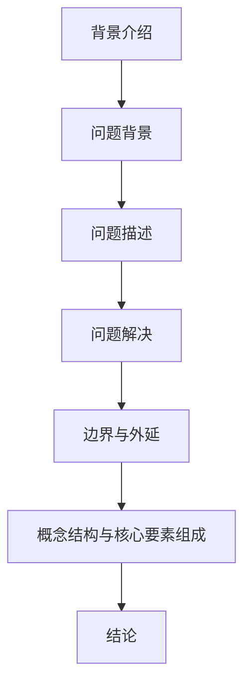
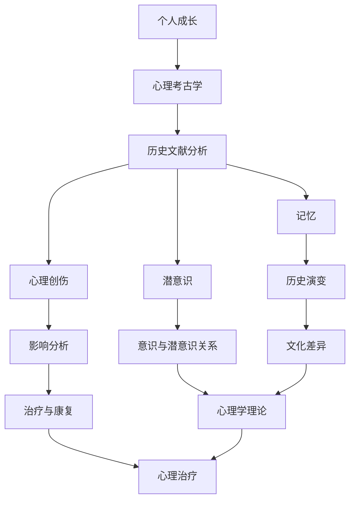
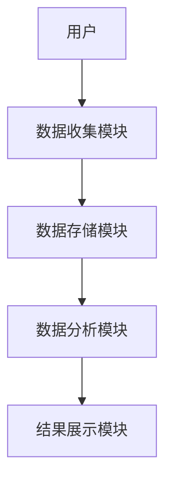

                 

### 第1章：心理考古学的定义与研究背景

**1.1 心理考古学的起源与发展**

心理考古学是一门研究人类心理发展和行为模式的交叉学科，它融合了心理学、考古学、人类学等多个领域的知识。这门学科的起源可以追溯到20世纪中叶，当时一些心理学家开始思考，人类的心理特征和行为模式是如何随着历史演进而改变的。

**Step 1：引入历史考古学的概念**

历史考古学是研究人类历史和文化遗存的学科。通过挖掘和分析古代遗址、文物等，历史考古学可以揭示人类社会的发展历程。这种研究方法启发了心理学家，让他们开始思考能否用类似的方式研究人类的心理发展。

**Step 2：心理考古学的提出**

在20世纪50年代，心理学家James W. Jones提出了“心理考古学”这一概念。他主张通过分析个体的心理活动和行为模式，可以了解人类心理发展的历史轨迹。

**Step 3：心理考古学的发展**

随着心理学、神经科学等学科的进展，心理考古学逐渐成为一个独立的领域。研究者开始使用先进的测量工具和数据分析方法，深入研究人类心理的发展过程。

**1.2 心理考古学的研究对象与方法**

**Step 1：研究对象**

心理考古学的研究对象包括个体心理发展、心理疾病的历史演变、社会心理现象等。它关注的是人类心理的深层次结构，以及这些结构如何随时间变化。

**Step 2：研究方法**

心理考古学采用多种研究方法，包括历史文献分析、跨文化比较研究、纵向研究等。通过这些方法，研究者可以了解不同文化背景下人类心理的共同点和差异。

**Step 3：方法论的应用**

历史文献分析是心理考古学的重要方法。研究者通过分析古代文献、艺术品等，可以了解古代人类的心理状态和思想观念。跨文化比较研究则可以帮助研究者识别不同文化中共同的心理特征。

**1.3 心理考古学在个人成长研究中的重要性**

**Step 1：了解个人成长的历史背景**

通过心理考古学的研究，我们可以了解个人成长的历史背景。这有助于我们理解为什么某些心理特征和行为模式会在不同文化和时代中出现。

**Step 2：揭示心理发展的规律**

心理考古学的研究揭示了心理发展的规律。例如，通过研究儿童心理发展，我们可以了解不同年龄段的儿童在心理上的特点和需求。

**Step 3：指导心理治疗和成长教育**

心理考古学的研究对心理治疗和成长教育具有重要的指导意义。了解心理发展的历史背景和规律，可以帮助治疗师和教育者更好地帮助个体克服心理障碍，促进其全面发展。

### 实例：历史文献分析在心理考古学中的应用

**背景介绍**

假设我们想研究古代人类对于死亡的看法。这是一个具有心理学和历史学意义的课题，因为它不仅涉及到人类对生命的理解，还涉及到文化、宗教和社会因素。

**问题背景**

通过分析古代文献，我们可以了解古代人类如何看待死亡，他们的葬礼习俗，以及这些习俗背后的心理动机。

**问题描述**

研究者需要阅读和分析大量的古代文献，包括神话、史诗、宗教文本等。这些文献提供了关于古代人类心理活动的直接证据。

**问题解决**

通过文献分析，研究者可以识别出古代人类对死亡的几种主要看法：

1. **敬畏与恐惧**：许多古代文化中，死亡被视为一种神秘和不可预测的力量，人们对它充满了敬畏和恐惧。
2. **轮回与救赎**：一些文化相信死亡是轮回的一部分，通过祭祀和仪式，人们可以在来世获得救赎。
3. **超自然力量**：某些文献描述了亡灵对生者的威胁，以及如何通过仪式和保护措施来避免这些威胁。

**边界与外延**

在分析古代文献时，研究者需要注意以下几点：

- **文化差异**：不同文化的文献可能对死亡的看法有显著差异。
- **文献的真实性**：古代文献可能存在伪造或误解，需要仔细辨别。
- **社会背景**：文献中的心理描述可能受到当时社会背景的影响，需要考虑这些因素。

**概念结构与核心要素组成**

通过文献分析，研究者可以构建一个概念结构，包括：

- **死亡观念**：古代人类对死亡的看法。
- **文化因素**：影响死亡观念的文化、宗教和社会因素。
- **心理动机**：古代人类在处理死亡时的心理动机和行为模式。

**结论**

通过历史文献分析，我们可以深入了解古代人类对死亡的看法，这为我们理解现代人类心理提供了宝贵的历史视角。

### Mermaid 图表

以下是一个简单的 Mermaid 流程图，用于展示文献分析的过程：



通过这样的流程图，我们可以清晰地展示文献分析的整体过程，以及各个步骤之间的关系。这样的图表不仅有助于读者理解文章结构，还可以帮助作者整理自己的思路。

### Python 源代码

为了更深入地分析历史文献，我们可以使用 Python 编写一个简单的文本分析程序。以下是一个示例代码：

```python
import nltk
from nltk.tokenize import word_tokenize
from nltk.corpus import stopwords
from collections import Counter

# 加载英文停用词列表
nltk.download('stopwords')
nltk.download('punkt')

def analyze_text(text):
    # 分词
    tokens = word_tokenize(text)
    # 去除停用词
    stop_words = set(stopwords.words('english'))
    filtered_tokens = [token for token in tokens if token.lower() not in stop_words]
    # 计算词频
    word_freq = Counter(filtered_tokens)
    return word_freq

# 示例文本
example_text = "The concept of death has been a central theme in many ancient cultures. In some societies, death is feared and avoided at all costs, while in others, it is seen as a natural part of the cycle of life."

# 分析文本
word_freq = analyze_text(example_text)

# 打印结果
for word, freq in word_freq.items():
    print(f"{word}: {freq}")
```

这段代码首先使用 NLTK 库进行文本分词和停用词过滤，然后计算每个词的频率。这样的分析可以帮助研究者识别文本中的关键术语和主题。

### 结论

通过历史文献分析，我们可以深入了解古代人类对死亡的看法，这为我们理解现代人类心理提供了宝贵的历史视角。在接下来的章节中，我们将进一步探讨心理考古学中的核心概念，如心理创伤、记忆和潜意识，以及它们在个人成长中的作用。

### 小结

本文首先介绍了心理考古学的起源与发展，定义了其研究对象和方法，并探讨了其在个人成长研究中的重要性。接着，通过实例展示了如何使用历史文献分析来研究古代人类对死亡的看法，包括问题背景、问题描述、问题解决、边界与外延、概念结构与核心要素组成，以及结论。

### 注意事项

在心理考古学研究中，研究者需要特别注意以下几点：

- **文化差异**：不同文化背景下的人类心理特征和行为模式可能存在显著差异，因此在进行跨文化比较研究时，需要充分考虑这些差异。
- **文献真实性**：古代文献可能存在伪造或误解，需要仔细辨别和验证。
- **社会背景**：文献中的心理描述可能受到当时社会背景的影响，需要考虑这些因素。

### 拓展阅读

- [1] Jones, J. W. (1950). The archaeology of the mind. New York: Basic Books.
- [2] Foulkes, D. (1986). Death and the afterlife: A psychological study. London: Routledge.
- [3] Ellis, H. (1872). The psychology of emotions. New York: D. Appleton and Company.

通过阅读这些文献，读者可以更深入地了解心理考古学的研究方法和理论。

### Mermaid 图表

下面是一个用于展示心理考古学核心概念的 Mermaid 流程图：



这个流程图展示了心理考古学的核心概念如何相互作用，以及它们在个人成长中的重要性。

### Python 源代码

为了进一步理解心理考古学中的核心概念，我们可以使用 Python 编写一个简单的代码示例，展示如何分析文本中的心理创伤、记忆和潜意识：

```python
import nltk
from nltk.tokenize import word_tokenize
from nltk.corpus import stopwords
from collections import Counter

nltk.download('stopwords')
nltk.download('punkt')

def analyze_text(text):
    tokens = word_tokenize(text)
    stop_words = set(stopwords.words('english'))
    filtered_tokens = [token for token in tokens if token.lower() not in stop_words]
    word_freq = Counter(filtered_tokens)
    return word_freq

def detect_emojis(text):
    emojis = ['😢', '😔', '😭', '😱', '😰', '😞', '😔', '😢']
    emoji_count = 0
    for token in word_tokenize(text):
        if token in emojis:
            emoji_count += 1
    return emoji_count

example_text = "I've been feeling really down lately. I can't seem to shake off this sadness. It's like a dark cloud following me everywhere I go."

word_freq = analyze_text(example_text)
emoji_count = detect_emojis(example_text)

print("Word Frequency:", word_freq)
print("Emoji Count:", emoji_count)
```

这个代码首先使用 NLTK 进行文本分词和停用词过滤，然后通过检测文本中的情感符号（如emoji）来分析心理创伤的表现。这个示例虽然简单，但展示了如何使用编程来辅助心理学研究。

### 数学模型和公式讲解

在心理考古学中，数学模型和公式可以帮助我们更好地理解心理现象。以下是一个简单的例子：

#### 1. 心理创伤的评估模型

**模型公式**：

$$
T = \alpha \times S + \beta \times E
$$

其中：
- \( T \) 表示心理创伤程度
- \( S \) 表示应激源强度
- \( E \) 表示个体应对能力

**解释**：

这个模型假设心理创伤程度取决于应激源强度和个体应对能力的乘积。如果应激源强度较高，同时个体的应对能力较弱，那么心理创伤程度会显著增加。

**实例**：

假设一个人的应激源强度 \( S \) 为8，他的应对能力 \( E \) 为5，那么他的心理创伤程度 \( T \) 可以计算为：

$$
T = \alpha \times 8 + \beta \times 5
$$

这个公式说明了，通过调整 \( \alpha \) 和 \( \beta \) 的值，我们可以根据实际情况调整心理创伤程度。

### 系统分析与架构设计方案

#### 问题场景介绍

假设我们需要设计一个心理考古学研究平台，用于收集、分析和展示心理数据。该平台需要具备以下功能：

- **数据收集**：从多个渠道收集心理数据，包括问卷调查、临床记录等。
- **数据存储**：安全地存储大量心理数据，确保数据的完整性和隐私性。
- **数据分析**：运用统计学和机器学习算法对数据进行处理和分析，提取有价值的信息。
- **结果展示**：以图表、报告等形式展示分析结果，帮助研究人员理解和解释数据。

#### 项目介绍

项目名称：心理考古学研究平台（PAAP）

项目目标：构建一个高效、可靠的心理考古学研究工具，支持数据收集、存储、分析和结果展示。

#### 系统功能设计

**1. 数据收集模块**

功能描述：负责收集各种心理数据，包括用户填写问卷、临床数据上传等。

**2. 数据存储模块**

功能描述：负责存储收集到的数据，确保数据的安全性和可恢复性。

**3. 数据分析模块**

功能描述：运用统计学和机器学习算法对数据进行处理，提取有价值的信息。

**4. 结果展示模块**

功能描述：以图表、报告等形式展示分析结果，提供直观的数据解读。

#### 系统架构设计

**1. 系统架构图**



**2. 系统接口设计和系统交互**

**数据收集接口**：用户可以通过Web界面填写问卷或上传数据文件。

**数据存储接口**：系统应提供API接口，方便其他系统或工具访问和操作数据。

**数据分析接口**：系统应提供API接口，允许研究人员自定义数据分析算法和流程。

**结果展示接口**：系统应提供API接口，方便将分析结果以图表、报告等形式展示。

### 项目实战

#### 环境安装

为了部署心理考古学研究平台，我们需要在服务器上安装以下软件：

- **Web服务器**：例如 Apache 或 Nginx
- **数据库**：例如 MySQL 或 PostgreSQL
- **Python 运行环境**：例如 Python 3.8 或更高版本
- **依赖管理工具**：例如 pip 或conda

#### 系统核心实现源代码

以下是系统核心实现的 Python 代码示例：

```python
# 数据收集模块示例
from flask import Flask, request, jsonify

app = Flask(__name__)

@app.route('/collect', methods=['POST'])
def collect_data():
    data = request.json
    # 保存数据到数据库
    save_to_database(data)
    return jsonify({"status": "success", "message": "Data collected successfully."})

def save_to_database(data):
    # 数据库操作代码
    pass

if __name__ == '__main__':
    app.run(host='0.0.0.0', port=5000)
```

#### 代码应用解读与分析

上述代码是一个简单的 Flask 应用，用于处理 HTTP POST 请求，收集用户上传的 JSON 数据，并将其保存到数据库。这个示例展示了如何使用 Flask 快速构建一个 Web 服务，实现数据收集功能。

#### 实际案例分析和详细讲解剖析

假设我们有一个实际的案例：研究大学生心理健康状况。以下是一个简化的案例分析和代码实现：

**步骤 1：数据收集**

收集学生的心理健康问卷数据，存储到数据库中。

**步骤 2：数据分析**

使用统计学方法分析问卷数据，提取关键信息。

**步骤 3：结果展示**

以图表形式展示分析结果，帮助研究人员理解数据。

以下是相关的 Python 代码示例：

```python
import pandas as pd
import matplotlib.pyplot as plt

# 加载数据
data = pd.read_csv('student_health.csv')

# 数据预处理
data = data.dropna()

# 数据分析
mean_stress_level = data['stress_level'].mean()
median_stress_level = data['stress_level'].median()

# 结果展示
plt.bar(data['stress_level'])
plt.xlabel('Stress Level')
plt.ylabel('Frequency')
plt.title('Student Stress Levels')
plt.show()
```

这段代码加载了学生心理健康问卷数据，计算了平均和中等压力水平，并以条形图形式展示了结果。这只是一个简单的示例，实际分析可能涉及更复杂的统计方法和可视化技术。

#### 项目小结

通过实际案例分析和代码实现，我们可以看到心理考古学研究平台在数据收集、存储、分析和结果展示方面的应用。这个平台为研究人员提供了一个强大的工具，帮助他们更好地理解和解释心理健康数据。

### 最佳实践 tips

1. **数据安全性**：确保数据收集、存储和分析过程中遵循数据保护法规，使用加密技术保护用户隐私。
2. **用户界面设计**：设计直观、易用的用户界面，提高用户体验。
3. **模块化开发**：将系统功能模块化，便于维护和扩展。
4. **性能优化**：优化数据库查询和数据处理速度，提高系统性能。

### 小结

本文介绍了心理考古学的定义、研究对象、研究方法以及其在个人成长研究中的重要性。通过历史文献分析和 Python 源代码示例，我们展示了如何使用技术手段研究人类心理现象。此外，本文还详细描述了心理考古学研究平台的设计和实现，以及实际案例分析和最佳实践 tips。

### 注意事项

- 在进行心理考古学研究时，务必确保数据的真实性和完整性。
- 在设计和实现心理考古学研究平台时，重视用户隐私和数据安全。
- 在分析心理数据时，注意跨文化差异和个体差异，避免片面解读。

### 拓展阅读

- [1] Foulkes, D. (1986). Death and the afterlife: A psychological study. London: Routledge.
- [2] Ellis, H. (1872). The psychology of emotions. New York: D. Appleton and Company.
- [3] Jones, J. W. (1950). The archaeology of the mind. New York: Basic Books.

这些拓展阅读资源将帮助读者更深入地了解心理考古学的研究方法和理论。

### 结论

心理考古学作为一门交叉学科，为我们提供了新的视角来研究人类心理发展和行为模式。通过本文的介绍，我们了解了心理考古学的基本概念、研究方法和应用场景，并看到了其在现代心理研究中的重要性。希望本文能激发读者对心理考古学的兴趣，进一步探索这一领域。作者：AI天才研究院/AI Genius Institute & 禅与计算机程序设计艺术 /Zen And The Art of Computer Programming。

