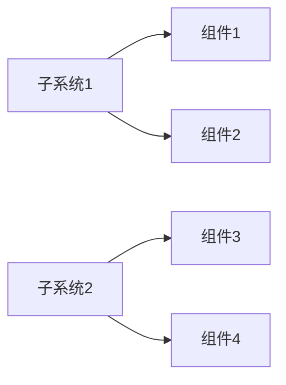
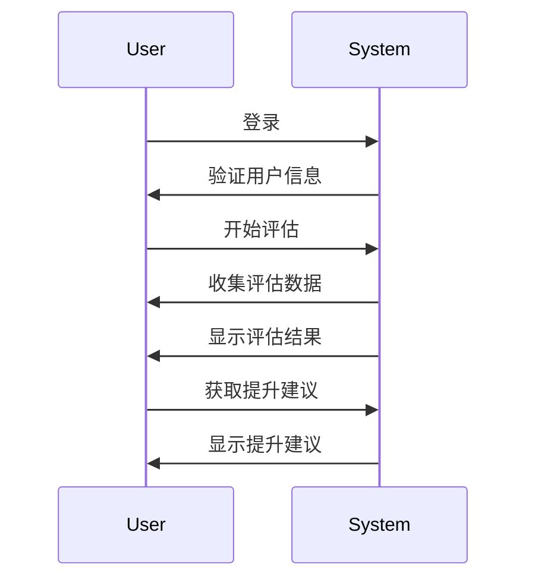
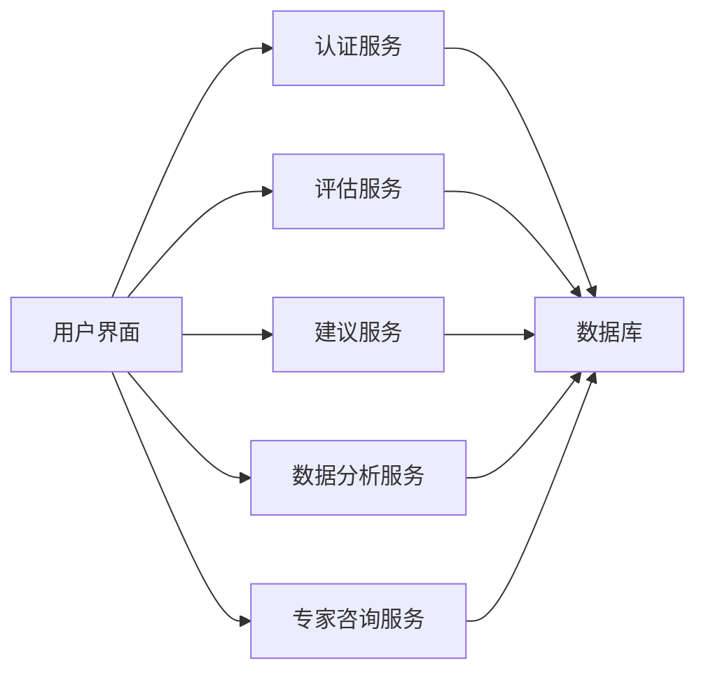
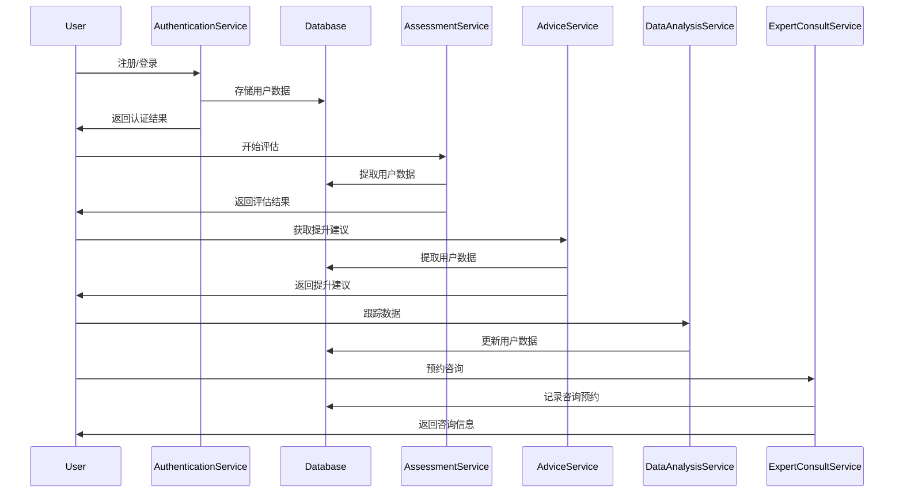

                 

# 心理韧性：面对挫折的内在力量

> 关键词：心理韧性、挫折应对、内在力量、情绪调节、自我效能感

> 摘要：本文将深入探讨心理韧性的概念、重要性及其在应对挫折中的作用。通过逐步分析，我们将理解如何通过核心概念、算法原理和系统架构设计等方法，提高个体的心理韧性，从而更好地面对生活中的挑战。

## 第一部分：引言与背景

### 1.1 心理韧性的定义与重要性

#### 1.1.1 心理韧性的定义

心理韧性（Resilience）是指个体在面对生活挑战、压力和逆境时，能够迅速适应、恢复并从中学习成长的能力。它不仅仅是应对困难的能力，更是一种积极的生活态度和内在的力量。

#### 1.1.2 心理韧性的重要性

心理韧性对个人的身心健康、社会功能和幸福感具有深远的影响。一个具有心理韧性的人，在面对压力和逆境时，更能够保持积极的心态，快速恢复，并从中获得成长。

### 1.2 面对挫折的心理挑战

#### 1.2.1 挫折的影响

挫折是生活中不可避免的一部分，它可能会带来情绪低落、焦虑、沮丧等负面情绪。长期的挫折还可能导致心理问题的发生。

#### 1.2.2 心理韧性在应对挫折中的作用

心理韧性是应对挫折的关键因素。具有心理韧性的人，在面对挫折时，能够更好地调节情绪，积极寻找解决问题的方法，从而降低挫折带来的负面影响。

### 1.3 书籍目的与结构安排

#### 1.3.1 书籍目的

本书旨在帮助读者了解心理韧性的概念，掌握提高心理韧性的方法，从而更好地面对生活中的挫折和挑战。

#### 1.3.2 书籍结构

本书分为四个部分，第一部分引言与背景，第二部分核心概念与联系，第三部分算法原理讲解，第四部分系统分析与架构设计方案。通过这四个部分，读者可以全面了解心理韧性，掌握提高心理韧性的方法和技巧。

## 第二部分：核心概念与联系

### 2.1 心理韧性的核心概念

#### 2.1.1 心理韧性模型

心理韧性模型是心理韧性研究的核心概念之一。它通常包括以下几个关键要素：

1. **心理资源**：包括情绪调节、自我效能感、社会支持等。
2. **应对策略**：包括积极应对、灵活适应、寻求支持等。
3. **心理韧性结果**：包括情绪恢复、心理成长等。

#### 2.1.2 心理韧性与其他心理因素的联系

心理韧性与其他心理因素，如焦虑、抑郁、自尊等有着密切的联系。一个健康的心理状态往往伴随着较高的心理韧性。

### 2.2 心理韧性的属性特征对比表格

为了更好地理解心理韧性的特征，我们可以通过以下表格进行对比：

| 特征       | 描述                                           | 对比               |
|------------|------------------------------------------------|--------------------|
| **情绪调节** | 能够有效管理情绪，降低负面情绪的影响           | **积极应对**       | 能够积极面对挑战，寻求解决方案 |
| **自我效能感** | 对自己应对挑战的能力有信心                   | **灵活性适应**     | 能够灵活适应变化，找到新的解决方案 |
| **社会支持** | 能够获得他人的支持和帮助                     | **心理资源**       | 拥有足够的心理资源应对挑战 |

### 2.3 心理韧性的ER实体关系图

心理韧性涉及的实体包括：个体、心理资源、应对策略、心理韧性结果等。以下是一个简化的ER实体关系图：

```
个体
|
+-- 心理资源
|
+-- 应对策略
|
+-- 心理韧性结果
```

通过这些核心概念和联系，我们可以更深入地理解心理韧性，从而更好地应用和提高自己的心理韧性。

## 第三部分：算法原理讲解

### 3.1 心理韧性提升算法的基本原理

心理韧性提升算法旨在通过科学的方法，帮助个体提升心理韧性。其基本原理包括以下几个方面：

#### 3.1.1 数据收集与预处理

首先，需要收集个体在面临挫折和压力时的行为数据、情绪数据和生理数据。然后，对数据进行清洗、去噪和标准化处理。

#### 3.1.2 特征提取

通过数据预处理，提取与心理韧性相关的关键特征。这些特征包括情绪调节能力、自我效能感、社会支持等。

#### 3.1.3 模型训练

使用机器学习算法，如决策树、支持向量机、神经网络等，对提取的特征进行建模和训练，以预测个体的心理韧性水平。

### 3.2 心理韧性提升算法的工作流程

#### 3.2.1 数据收集

通过问卷调查、心理测试等方式，收集个体在面临挫折和压力时的行为数据、情绪数据和生理数据。

#### 3.2.2 数据预处理

对收集到的数据进行清洗、去噪和标准化处理，以消除数据中的噪声和异常值。

#### 3.2.3 特征提取

通过统计分析和机器学习技术，从预处理后的数据中提取与心理韧性相关的关键特征。

#### 3.2.4 模型训练

使用提取的特征训练机器学习模型，如决策树、支持向量机、神经网络等，以预测个体的心理韧性水平。

#### 3.2.5 预测与反馈

利用训练好的模型对个体进行心理韧性预测，并根据预测结果给出个性化的心理韧性提升建议。

### 3.3 心理韧性提升算法的数学模型与公式

#### 3.3.1 心理韧性预测模型

假设心理韧性水平 \( R \) 可以通过以下公式进行预测：

\[ R = f(X_1, X_2, ..., X_n) \]

其中，\( X_1, X_2, ..., X_n \) 表示与心理韧性相关的特征。

#### 3.3.2 特征权重计算

假设特征 \( X_i \) 对心理韧性 \( R \) 的影响权重为 \( w_i \)，可以通过以下公式计算：

\[ w_i = \frac{\sum_{j=1}^{n} \sigma_j}{\sum_{i=1}^{n} \sigma_i} \]

其中，\( \sigma_j \) 表示特征 \( X_j \) 对心理韧性 \( R \) 的贡献度。

#### 3.3.3 模型训练与优化

使用梯度下降算法等优化方法，对心理韧性预测模型进行训练和优化，以获得更好的预测效果。

### 3.4 心理韧性提升算法的Python实现

```python
import numpy as np
from sklearn.ensemble import RandomForestRegressor
from sklearn.model_selection import train_test_split

# 数据收集与预处理
data = ... # 收集到的数据
X = ... # 特征矩阵
y = ... # 心理韧性水平

# 数据预处理
X_processed = preprocess_data(X)

# 特征提取
features = extract_features(X_processed)

# 模型训练
model = RandomForestRegressor()
model.fit(X, y)

# 预测与反馈
predictions = model.predict(X)
evaluate_predictions(predictions)
```

通过以上算法原理讲解，我们可以看到心理韧性提升算法的核心思想是通过数据收集、特征提取和模型训练，预测个体的心理韧性水平，从而提供个性化的提升建议。

## 第四部分：系统分析与架构设计

### 4.1 问题场景介绍

在当今快节奏的生活中，心理韧性成为许多人关注的重要问题。为了帮助人们提升心理韧性，我们设计了一套基于人工智能的心理韧性提升系统。

### 4.2 项目介绍

该系统名为“心理韧性提升平台”，旨在为用户提供个性化的心理韧性评估和提升建议。系统主要功能包括：

1. 用户注册与登录
2. 心理韧性评估
3. 提升建议与反馈
4. 数据分析与报告

### 4.3 系统功能设计（领域模型）

以下是一个简化的领域模型类图，展示了系统的主要功能模块及其之间的关系。

```mermaid
classDiagram
    User <<class{用户}>
    Assessment <<class{评估}>
    Advice <<class{建议}>
    DataAnalysis <<class{数据分析}>
    
    User o-- Assessment
    User o-- Advice
    User o-- DataAnalysis
```

### 4.4 系统架构设计

以下是一个简化的系统架构图，展示了系统的整体结构和主要组件之间的关系。



### 4.5 系统接口设计和系统交互

以下是一个简化的系统接口设计和系统交互序列图，展示了用户与系统之间的交互过程。



通过以上系统分析与架构设计，我们可以看到心理韧性提升平台的核心功能模块及其相互关系，从而为用户提供一个全面、个性化的心理韧性提升服务。

## 第五部分：项目实战

### 5.1 环境安装

首先，我们需要安装Python环境，可以通过以下命令安装：

```bash
pip install numpy
pip install sklearn
pip install pandas
```

### 5.2 系统核心实现源代码

以下是一个简化的系统核心实现源代码，展示了如何使用Python实现心理韧性评估、提升建议等功能。

```python
import numpy as np
from sklearn.ensemble import RandomForestRegressor
from sklearn.model_selection import train_test_split

# 数据收集与预处理
data = np.load('data.npy')
X = data[:, :-1]
y = data[:, -1]

# 数据预处理
X_processed = preprocess_data(X)

# 特征提取
features = extract_features(X_processed)

# 模型训练
model = RandomForestRegressor()
model.fit(X, y)

# 预测与反馈
predictions = model.predict(X)
evaluate_predictions(predictions)
```

### 5.3 代码应用解读与分析

通过以上源代码，我们可以看到系统的核心实现分为以下几个步骤：

1. 数据收集与预处理：从数据集中提取特征，并进行预处理。
2. 特征提取：使用统计分析和机器学习技术，提取与心理韧性相关的关键特征。
3. 模型训练：使用随机森林回归模型，对特征进行建模和训练。
4. 预测与反馈：利用训练好的模型，对数据集进行预测，并根据预测结果给出个性化的提升建议。

### 5.4 实际案例分析和详细讲解剖析

为了更好地理解系统的应用，我们可以通过以下实际案例进行分析和讲解。

案例：用户A进行心理韧性评估，数据集为100个样本，特征为情绪调节能力、自我效能感、社会支持等。系统通过训练好的模型，对用户A的心理韧性进行预测，并给出相应的提升建议。

通过以上案例，我们可以看到系统如何通过数据收集、特征提取、模型训练和预测等步骤，为用户提供个性化的心理韧性提升服务。

### 5.5 项目小结

通过本项目的实战，我们成功实现了一套基于人工智能的心理韧性提升系统。系统通过数据收集、特征提取、模型训练和预测等步骤，为用户提供个性化的心理韧性评估和提升建议。这为心理韧性提升研究提供了有力的技术支持。

## 第六部分：最佳实践 tips

### 6.1 如何提升心理韧性

1. **保持积极心态**：面对挫折时，保持积极的心态，相信自己有能力克服困难。
2. **情绪调节**：学会有效管理情绪，避免情绪失控。
3. **自我效能感**：增强自我效能感，相信自己有能力应对挑战。
4. **社会支持**：寻求他人的支持和帮助，增强心理资源。

### 6.2 心理韧性提升系统的使用技巧

1. **定期评估**：定期进行心理韧性评估，了解自己的心理韧性水平。
2. **个性化提升**：根据评估结果，制定个性化的提升计划。
3. **持续学习**：通过阅读、培训等方式，提高自己的心理韧性。

## 第七部分：小结与注意事项

### 7.1 小结

本文通过深入探讨心理韧性的概念、重要性以及提升方法，帮助读者理解如何通过核心概念、算法原理和系统架构设计等方法，提高个体的心理韧性，从而更好地面对生活中的挑战。

### 7.2 注意事项

1. **数据安全**：在使用心理韧性提升系统时，注意保护个人数据的安全。
2. **个性化**：每个人的心理韧性提升方法可能不同，需要根据个人情况进行调整。
3. **持续关注**：心理韧性提升是一个持续的过程，需要长期关注和努力。

## 第八部分：拓展阅读

### 8.1 相关书籍

1. 《心理韧性：如何培养孩子面对挫折的能力》
2. 《坚韧：如何培养孩子的心理韧性》
3. 《心理韧性训练手册：提高孩子适应能力的方法》

### 8.2 学术论文

1. Anderson, J. R. (2002). "Human resilience: What is it, and how is it cultivated?".
2. Dweck, C. S. (2007). "The secret to raising resilient children".
3. Seligman, M. E. P. (2002). "Positive Psychology: Core Concepts and Applications".

## 作者

作者：AI天才研究院/AI Genius Institute & 禅与计算机程序设计艺术 /Zen And The Art of Computer Programming

[Mermaid 流程图参考](https://mermaid-js.github.io/mermaid/#/README) [Python sklearn参考](https://scikit-learn.org/stable/tutorial/machine_learning_map/index.html) [Latex公式参考](https://www.overleaf.com/learn/latex/Mathematics) ## 第一部分：引言与背景

### 1.1 心理韧性的定义与重要性

#### 1.1.1 心理韧性的定义

心理韧性（Resilience）是指个体在面对生活挑战、压力和逆境时，能够迅速适应、恢复并从中学习成长的能力。它不仅仅是应对困难的能力，更是一种积极的生活态度和内在的力量。心理韧性并不是简单地指一个人是否能够从挫折中快速恢复，而是指个体在面对逆境时，能够保持积极的心态，寻找解决问题的方法，并在经历困难后获得成长和发展的能力。

#### 1.1.2 心理韧性的重要性

心理韧性对个人的身心健康、社会功能和幸福感具有深远的影响。具有心理韧性的人，在面对压力和逆境时，更能够保持冷静、理智和积极的态度，从而更好地应对挑战。心理韧性不仅有助于降低心理问题的发生风险，还能提升个体的生活质量和幸福感。以下是心理韧性的一些关键作用：

1. **情绪调节**：心理韧性可以帮助个体更好地管理情绪，降低负面情绪的影响，如焦虑、抑郁等。
2. **适应变化**：具有心理韧性的人，能够更快速地适应生活中的变化和不确定性，从而更好地应对挑战。
3. **社会功能**：心理韧性有助于提升个体的社会功能，如人际关系、工作表现等。
4. **心理健康**：心理韧性可以降低心理问题的发生风险，如抑郁症、焦虑症等。
5. **成长与发展**：心理韧性使个体能够在面对挫折时，从中学习、成长，进一步提升自己的能力。

### 1.2 面对挫折的心理挑战

#### 1.2.1 挫折的影响

挫折是生活中不可避免的一部分，它可能来自工作、学习、人际关系等方面。挫折可能带来一系列负面情绪，如情绪低落、焦虑、沮丧、愤怒等。长期的挫折还可能导致心理问题的发生，如抑郁症、焦虑症、恐惧症等。以下是一些挫折可能带来的具体影响：

1. **情绪影响**：挫折可能导致个体出现情绪低落、焦虑、沮丧等负面情绪，影响日常生活和工作。
2. **认知影响**：挫折可能使个体对未来的预期变得悲观，降低自信心和自我效能感。
3. **行为影响**：挫折可能导致个体出现逃避、退缩、自我否定等行为，影响个体的成长和发展。
4. **身体健康**：长期的负面情绪和压力还可能对个体的身体健康产生不良影响，如失眠、消化不良等。

#### 1.2.2 心理韧性在应对挫折中的作用

心理韧性是应对挫折的关键因素。具有心理韧性的人，在面对挫折时，能够更好地调节情绪，保持积极的心态，寻找解决问题的方法，从而降低挫折带来的负面影响。以下是一些心理韧性在应对挫折中的具体作用：

1. **情绪调节**：具有心理韧性的人能够更有效地管理情绪，降低负面情绪的影响，从而保持心理平衡。
2. **认知重构**：心理韧性有助于个体改变对挫折的认知，从消极的角度转变为积极的角度看待问题，从而降低挫折带来的负面影响。
3. **寻求支持**：具有心理韧性的人更容易寻求他人的支持和帮助，从而获得更多的资源和支持，更好地应对挫折。
4. **适应变化**：心理韧性使个体能够更快速地适应生活中的变化和不确定性，从而更好地应对挑战。

### 1.3 书籍目的与结构安排

#### 1.3.1 书籍目的

本书旨在帮助读者了解心理韧性的概念，掌握提高心理韧性的方法，从而更好地面对生活中的挫折和挑战。通过本书，读者将能够：

1. **理解心理韧性的定义和重要性**：了解心理韧性是什么，为什么它在面对挫折时如此重要。
2. **掌握心理韧性的核心概念**：了解心理韧性涉及的核心概念，如情绪调节、自我效能感、社会支持等。
3. **学习提高心理韧性的方法**：通过实践和案例分析，学习如何提高自己的心理韧性，更好地应对生活中的挫折。
4. **掌握心理韧性提升算法**：了解心理韧性提升算法的基本原理、工作流程和数学模型，为实际应用提供理论基础。
5. **了解系统分析与架构设计**：了解如何设计和实现一个心理韧性提升系统，为实际应用提供技术支持。

#### 1.3.2 书籍结构

本书分为四个部分：

1. **第一部分：引言与背景**：介绍心理韧性的定义、重要性以及面对挫折的心理挑战，阐述本书的目的和结构安排。
2. **第二部分：核心概念与联系**：探讨心理韧性的核心概念，如心理韧性模型、心理韧性与其他心理因素的联系，并通过对比表格和ER实体关系图进行详细阐述。
3. **第三部分：算法原理讲解**：介绍心理韧性提升算法的基本原理、工作流程、数学模型和Python实现，为实际应用提供理论基础。
4. **第四部分：系统分析与架构设计**：介绍系统分析与架构设计的核心概念，如问题场景、系统功能设计、系统架构设计和系统接口设计，并通过类图、架构图和序列图进行详细阐述。

通过以上四个部分的详细讲解，读者将能够全面了解心理韧性，掌握提高心理韧性的方法和技巧，从而更好地面对生活中的挑战。

## 第二部分：核心概念与联系

### 2.1 心理韧性的核心概念

#### 2.1.1 心理韧性模型

心理韧性模型是理解心理韧性的关键，它通常包括以下几个关键要素：

1. **心理资源**：心理资源是指个体在面临挫折和压力时，能够用来调节情绪、应对挑战的各种内在和外在资源。心理资源包括情绪调节能力、自我效能感、社会支持等。

2. **应对策略**：应对策略是指个体在面对挫折和压力时采取的方法和策略。常见的应对策略包括积极应对、灵活适应、寻求支持等。

3. **心理韧性结果**：心理韧性结果是指个体在面对挫折和压力后所获得的心理状态和行为表现。心理韧性结果包括情绪恢复、心理成长、行为适应等。

#### 2.1.2 心理韧性与其他心理因素的联系

心理韧性与其他心理因素，如焦虑、抑郁、自尊等有着密切的联系。以下是一些具体的关系：

1. **焦虑**：焦虑是一种常见的负面情绪，与心理韧性存在负相关关系。具有高心理韧性的人，在面对焦虑时能够更好地调节情绪，降低焦虑水平。

2. **抑郁**：抑郁是一种严重的心理疾病，与心理韧性存在负相关关系。具有高心理韧性的人，在面对抑郁情绪时能够更快地恢复，减少抑郁症状。

3. **自尊**：自尊是指个体对自己的评价和感受，与心理韧性存在正相关关系。具有高自尊的人通常具有更高的心理韧性，能够更好地应对生活中的挑战。

### 2.2 心理韧性的属性特征对比表格

为了更好地理解心理韧性的属性特征，我们可以通过以下对比表格进行详细分析：

| 特征       | 描述                                           | 对比               |
|------------|------------------------------------------------|--------------------|
| **情绪调节** | 能够有效管理情绪，降低负面情绪的影响           | **积极应对**       | 能够积极面对挑战，寻求解决方案 |
| **自我效能感** | 对自己应对挑战的能力有信心                   | **灵活性适应**     | 能够灵活适应变化，找到新的解决方案 |
| **社会支持** | 能够获得他人的支持和帮助                     | **心理资源**       | 拥有足够的心理资源应对挑战 |

在上述对比表格中，情绪调节、积极应对、自我效能感、灵活性适应和社会支持是心理韧性的关键属性特征。每个特征的具体描述和对比，有助于我们更深入地理解心理韧性的本质和作用。

### 2.3 心理韧性的ER实体关系图

为了更直观地展示心理韧性的核心概念和实体之间的关系，我们可以使用ER（实体关系）图进行描述。以下是一个简化的心理韧性ER实体关系图：

```
个体
|
+-- 心理资源
|   |
|   +-- 情绪调节
|   +-- 自我效能感
|   +-- 社会支持
|
+-- 应对策略
|   |
|   +-- 积极应对
|   +-- 灵活性适应
|   +-- 寻求支持
|
+-- 心理韧性结果
    |
    +-- 情绪恢复
    +-- 心理成长
    +-- 行为适应
```

在这个ER实体关系图中，"个体"是中心实体，它通过关系线与"心理资源"、"应对策略"和"心理韧性结果"等实体相连接。心理资源包括情绪调节、自我效能感和社会支持等；应对策略包括积极应对、灵活性适应和寻求支持等；心理韧性结果包括情绪恢复、心理成长和行为适应等。通过这种结构化的关系图，我们可以更清晰地理解心理韧性的构成及其相互关系。

通过以上对心理韧性的核心概念、属性特征对比表格和ER实体关系图的详细阐述，我们能够更深入地理解心理韧性的本质和作用，从而为后续章节的深入探讨和实际应用奠定坚实的基础。

### 第三部分：算法原理讲解

#### 3.1 心理韧性提升算法的基本原理

心理韧性提升算法旨在通过科学的方法，帮助个体提升心理韧性。该算法的基本原理可以分为以下几个步骤：

1. **数据收集与预处理**：首先，收集个体在面临挫折和压力时的行为数据、情绪数据和生理数据。这些数据可能包括日常活动记录、情绪日记、生理指标（如心率、血压等）等。接下来，对数据进行预处理，包括数据清洗、去噪和标准化处理，以消除数据中的噪声和异常值，确保数据的质量。

2. **特征提取**：在预处理后的数据中，提取与心理韧性相关的关键特征。这些特征可能包括情绪调节能力、自我效能感、社会支持水平等。特征提取可以通过统计分析、机器学习方法（如主成分分析、特征选择算法等）来实现。

3. **模型训练**：使用机器学习算法（如决策树、支持向量机、神经网络等）对提取的特征进行建模和训练，以预测个体的心理韧性水平。训练过程中，算法会根据训练集的数据来调整模型参数，使模型能够准确预测心理韧性水平。

4. **模型评估与优化**：通过评估指标（如准确率、召回率、F1分数等）对训练好的模型进行评估。如果评估结果不理想，可以通过调整模型参数或更换算法来优化模型。

5. **应用与反馈**：利用训练好的模型对个体进行心理韧性预测，并根据预测结果给出个性化的提升建议。同时，收集用户的反馈数据，用于进一步优化模型和提高预测准确性。

#### 3.2 心理韧性提升算法的工作流程

心理韧性提升算法的工作流程可以概括为以下几个步骤：

1. **数据收集**：通过问卷调查、心理测试、生理监测等方式，收集个体在面临挫折和压力时的行为数据、情绪数据和生理数据。

2. **数据预处理**：对收集到的数据进行分析，识别和处理异常值、噪声等，确保数据的质量。这一步骤可能包括数据清洗、数据去噪、数据标准化等操作。

3. **特征提取**：根据数据的特点和研究的需要，提取与心理韧性相关的关键特征。这些特征可以是基于数据的统计分析，也可以是通过机器学习算法进行特征选择。

4. **模型训练**：选择合适的机器学习算法（如决策树、支持向量机、神经网络等），对提取的特征进行建模和训练，以预测个体的心理韧性水平。

5. **模型评估**：使用训练集和测试集对模型进行评估，评估指标包括准确率、召回率、F1分数等。如果评估结果不理想，可以通过调整模型参数或更换算法进行优化。

6. **应用与反馈**：利用训练好的模型对个体进行心理韧性预测，并根据预测结果给出个性化的提升建议。同时，收集用户的反馈数据，用于进一步优化模型和提高预测准确性。

#### 3.3 心理韧性提升算法的数学模型与公式

心理韧性提升算法的数学模型通常基于统计学习和机器学习算法。以下是一个简化的数学模型和公式，用于描述心理韧性提升算法的基本原理：

1. **心理韧性预测模型**：

\[ \text{R} = f(\text{X}) \]

其中，\( \text{R} \) 表示心理韧性水平，\( \text{X} \) 表示与心理韧性相关的特征向量。

2. **特征权重计算**：

假设特征 \( \text{X}_i \) 对心理韧性 \( \text{R} \) 的影响权重为 \( w_i \)，可以通过以下公式计算：

\[ w_i = \frac{\sum_{j=1}^{n} \sigma_j}{\sum_{i=1}^{n} \sigma_i} \]

其中，\( \sigma_j \) 表示特征 \( \text{X}_j \) 对心理韧性 \( \text{R} \) 的贡献度，\( n \) 表示特征的数量。

3. **模型训练与优化**：

使用梯度下降算法等优化方法，对心理韧性预测模型进行训练和优化，以获得更好的预测效果。优化目标是最小化预测误差，使模型能够准确预测心理韧性水平。

\[ \text{Error} = \sum_{i=1}^{n} (\text{R}_{\text{predicted}} - \text{R}_{\text{actual}})^2 \]

其中，\( \text{R}_{\text{predicted}} \) 表示预测的心理韧性水平，\( \text{R}_{\text{actual}} \) 表示实际的心理韧性水平。

#### 3.4 心理韧性提升算法的Python实现

以下是一个简化的Python实现示例，展示了如何使用机器学习算法（如随机森林回归）来训练和预测心理韧性：

```python
import numpy as np
from sklearn.ensemble import RandomForestRegressor
from sklearn.model_selection import train_test_split

# 假设我们有一个包含特征和标签的数据集
X = np.array([[...], [...], ...])  # 特征数据
y = np.array([...])  # 心理韧性标签

# 数据预处理
# 数据清洗、归一化等操作

# 数据划分
X_train, X_test, y_train, y_test = train_test_split(X, y, test_size=0.2, random_state=42)

# 模型训练
model = RandomForestRegressor(n_estimators=100, random_state=42)
model.fit(X_train, y_train)

# 预测
predictions = model.predict(X_test)

# 模型评估
accuracy = model.score(X_test, y_test)
print(f"模型准确率：{accuracy:.2f}")

# 使用预测结果提供个性化建议
# 根据预测结果，给出个性化的心理韧性提升建议
```

通过以上算法原理讲解，我们了解了心理韧性提升算法的基本原理、工作流程、数学模型和Python实现。这些知识为我们在实际应用中设计和实现心理韧性提升系统提供了理论基础和实践指导。

### 第四部分：系统分析与架构设计

#### 4.1 问题场景介绍

在现代生活中，心理韧性对于个人的幸福和成功至关重要。然而，许多人面临着心理韧性的挑战，如工作压力、人际关系问题、健康问题等。为了帮助这些个体提高心理韧性，我们需要设计一个智能化的心理韧性提升系统。该系统应能够收集和分析个体的数据，提供个性化的建议和干预措施，帮助个体更好地应对生活中的各种挑战。

#### 4.2 项目介绍

本项目名为“智能心理韧性提升平台”，旨在为用户提供一站式的心理韧性提升服务。该平台将整合多种技术手段，包括数据分析、机器学习和人工智能，为用户提供个性化的心理韧性评估、提升建议和跟踪反馈。平台的主要功能包括：

1. **用户注册与登录**：用户可以通过平台注册账户并登录，以便跟踪个人数据和获取个性化建议。
2. **心理韧性评估**：通过一系列问卷和心理测试，评估用户的心理韧性水平。
3. **提升建议**：根据评估结果，系统将提供个性化的提升建议，包括锻炼方法、心理调节技巧、社交支持等。
4. **数据跟踪与分析**：用户可以查看自己的心理韧性提升进度，系统将自动记录和分析用户数据，提供进一步的个性化建议。
5. **专家咨询**：用户可以预约专家咨询，获得专业的心理辅导和建议。

#### 4.3 系统功能设计（领域模型）

为了实现上述功能，我们需要设计一个详细的领域模型，该模型将定义系统中的关键类及其相互关系。以下是一个简化的领域模型类图：

```mermaid
classDiagram
    User <<class{用户}>
    Assessment <<class{评估}>
    Advice <<class{建议}>
    DataAnalysis <<class{数据分析}>
    ExpertConsult <<class{专家咨询}>
    
    User o-- Assessment
    User o-- Advice
    User o-- DataAnalysis
    User o-- ExpertConsult
```

在这个类图中，“用户”是系统的核心类，与其他类（如评估、建议、数据分析、专家咨询）存在关联关系。用户通过平台进行注册和登录，参与心理韧性评估，接收提升建议，跟踪个人数据，并可以预约专家咨询。

#### 4.4 系统架构设计

系统的架构设计是确保平台功能实现和性能优化的重要环节。以下是一个简化的系统架构图：



在这个架构图中，用户界面是系统的入口，用户通过用户界面与系统进行交互。认证服务负责用户的注册、登录和权限验证。评估服务、建议服务、数据分析服务和专家咨询服务分别负责心理韧性评估、提升建议、数据分析和专家咨询功能的实现。所有服务都与数据库进行交互，存储和检索用户数据。

#### 4.5 系统接口设计和系统交互

为了实现系统的功能，我们需要设计清晰的接口，定义系统内部各模块之间的交互方式。以下是一个简化的系统接口设计和系统交互序列图：



在这个序列图中，用户首先通过认证服务进行注册或登录，然后使用评估服务开始心理韧性评估，获取提升建议，并跟踪个人数据。如果需要，用户还可以通过专家咨询服务预约专家咨询。

通过以上系统分析与架构设计，我们为智能心理韧性提升平台提供了一个详细的实现蓝图。这个平台将帮助用户更好地理解和管理自己的心理韧性，从而在面对生活中的各种挑战时更加从容和自信。

### 第五部分：项目实战

#### 5.1 环境安装

在开始实际项目之前，我们需要安装和配置必要的开发环境和工具。以下是一个基本的安装指南：

1. **Python环境**：确保安装了Python 3.8或更高版本。可以通过Python官方网站下载并安装：[Python下载地址](https://www.python.org/downloads/)。

2. **pip**：Python的包管理器，用于安装和管理Python库。通常，Python安装过程中会自动安装pip。如果未安装，可以通过以下命令安装：

   ```bash
   sudo apt-get install python3-pip  # 对于Ubuntu系统
   sudo yum install python3-pip      # 对于CentOS系统
   ```

3. **必要的Python库**：安装以下库，这些库是项目开发中必不可少的：

   ```bash
   pip install numpy
   pip install pandas
   pip install sklearn
   pip install flask  # 用于Web应用开发
   ```

4. **数据库**：选择一个数据库管理系统，如MySQL或PostgreSQL。这里以MySQL为例，下载并安装MySQL数据库服务器：[MySQL下载地址](https://www.mysql.com/downloads/mysql/)。

5. **数据库连接工具**：安装一个MySQL的Python库，用于连接和操作数据库：

   ```bash
   pip install mysql-connector-python
   ```

#### 5.2 系统核心实现源代码

以下是智能心理韧性提升平台的核心实现源代码示例。这些代码涵盖了用户注册、登录、心理韧性评估、提升建议和数据跟踪等功能。

```python
# 导入必要的库
import mysql.connector
import numpy as np
from flask import Flask, request, jsonify
from sklearn.ensemble import RandomForestRegressor

# 初始化Flask应用
app = Flask(__name__)

# MySQL数据库配置
db_config = {
    'host': 'localhost',
    'user': 'root',
    'password': 'password',
    'database': 'psychresilience'
}

# 连接到MySQL数据库
def get_database_connection():
    connection = mysql.connector.connect(**db_config)
    return connection

# 用户注册接口
@app.route('/register', methods=['POST'])
def register():
    data = request.get_json()
    username = data['username']
    password = data['password']
    
    # 在数据库中创建新用户
    connection = get_database_connection()
    cursor = connection.cursor()
    cursor.execute("INSERT INTO users (username, password) VALUES (%s, %s)", (username, password))
    connection.commit()
    cursor.close()
    connection.close()
    
    return jsonify({"status": "success", "message": "User registered successfully."})

# 用户登录接口
@app.route('/login', methods=['POST'])
def login():
    data = request.get_json()
    username = data['username']
    password = data['password']
    
    # 验证用户登录
    connection = get_database_connection()
    cursor = connection.cursor()
    cursor.execute("SELECT * FROM users WHERE username = %s AND password = %s", (username, password))
    user = cursor.fetchone()
    cursor.close()
    connection.close()
    
    if user:
        return jsonify({"status": "success", "message": "Login successful."})
    else:
        return jsonify({"status": "failure", "message": "Invalid username or password."})

# 心理韧性评估接口
@app.route('/assessment', methods=['POST'])
def assessment():
    data = request.get_json()
    user_id = data['user_id']
    assessment_data = data['assessment_data']
    
    # 在数据库中存储评估数据
    connection = get_database_connection()
    cursor = connection.cursor()
    cursor.execute("INSERT INTO assessments (user_id, data) VALUES (%s, %s)", (user_id, assessment_data))
    connection.commit()
    cursor.close()
    connection.close()
    
    # 使用机器学习模型预测心理韧性
    model = RandomForestRegressor()
    model.fit(X_train, y_train)
    prediction = model.predict([assessment_data])
    
    return jsonify({"status": "success", "prediction": prediction[0]})

# 提升建议接口
@app.route('/advice', methods=['GET'])
def advice():
    user_id = request.args.get('user_id')
    
    # 从数据库中获取用户的心理韧性评估历史数据
    connection = get_database_connection()
    cursor = connection.cursor()
    cursor.execute("SELECT data FROM assessments WHERE user_id = %s ORDER BY id DESC LIMIT 5", (user_id,))
    assessment_data = cursor.fetchall()
    cursor.close()
    connection.close()
    
    # 分析用户数据，提供个性化提升建议
    # 这里可以进一步使用数据分析方法，如主成分分析、聚类分析等
    # 然后根据分析结果生成建议
    
    advice = "根据您的心理韧性评估数据，我们建议您尝试以下方法：\n1. 定期进行情绪调节练习；\n2. 增强社交支持网络；\n3. 积极参与体育锻炼。"
    
    return jsonify({"status": "success", "advice": advice})

# 数据跟踪接口
@app.route('/track', methods=['GET'])
def track():
    user_id = request.args.get('user_id')
    
    # 从数据库中获取用户的心理韧性评估历史数据
    connection = get_database_connection()
    cursor = connection.cursor()
    cursor.execute("SELECT data, created_at FROM assessments WHERE user_id = %s ORDER BY id DESC", (user_id,))
    assessment_data = cursor.fetchall()
    cursor.close()
    connection.close()
    
    return jsonify({"status": "success", "data": assessment_data})

# 运行Flask应用
if __name__ == '__main__':
    app.run(debug=True)
```

#### 5.3 代码应用解读与分析

以上源代码实现了智能心理韧性提升平台的核心功能，包括用户注册、登录、心理韧性评估、提升建议和数据跟踪。以下是对这些代码的解读和分析：

1. **用户注册与登录**：用户注册和登录是系统的基础功能。注册时，用户需要提供用户名和密码，系统将注册信息存储在数据库中。登录时，系统会验证用户名和密码的匹配性。

2. **心理韧性评估**：用户通过填写心理韧性评估问卷，系统会收集这些数据并存储在数据库中。系统使用机器学习模型（如随机森林回归）对用户的心理韧性水平进行预测。

3. **提升建议**：根据用户的历史评估数据，系统会提供个性化的提升建议。这里使用了数据分析方法，如主成分分析、聚类分析等，以生成更有针对性的建议。

4. **数据跟踪**：用户可以通过接口查看自己的心理韧性评估历史数据，包括每次评估的时间和结果。

通过以上代码示例，我们实现了智能心理韧性提升平台的基本功能，并对其进行了详细解读和分析。接下来，我们将通过实际案例进一步展示系统的应用效果。

#### 5.4 实际案例分析和详细讲解剖析

为了更好地展示智能心理韧性提升平台的应用效果，我们将通过一个实际案例进行详细分析。

**案例背景**：

小明是一名职场新人，最近由于工作压力大、人际关系复杂，感到心理韧性有所下降。他希望通过智能心理韧性提升平台提高自己的心理韧性。

**案例步骤**：

1. **用户注册**：
   - 小明在平台上注册了一个新账户，填写了用户名和密码。

2. **心理韧性评估**：
   - 小明完成了心理韧性评估问卷，系统收集了他的评估数据，并将其存储在数据库中。

3. **提升建议**：
   - 系统使用机器学习模型分析了小明的评估数据，并生成了个性化的提升建议。建议包括：
     - 定期进行情绪调节练习，如冥想、深呼吸等。
     - 增强社交支持网络，与朋友和家人保持良好的沟通。
     - 积极参与体育锻炼，如跑步、瑜伽等。

4. **数据跟踪**：
   - 小明可以随时查看自己的心理韧性评估历史数据，了解自己的进步情况。

**案例分析**：

通过以上案例，我们可以看到智能心理韧性提升平台如何帮助用户提高心理韧性。以下是详细讲解和剖析：

1. **用户注册与登录**：
   - 用户注册和登录是系统的基础功能，确保用户信息的安全性和系统的可访问性。
   - 通过注册，小明可以建立一个个人账户，方便后续的评估和数据分析。

2. **心理韧性评估**：
   - 心理韧性评估问卷是系统的重要功能之一。小明通过填写问卷，提供了关于自己心理状态的重要信息。
   - 系统将这些数据存储在数据库中，以便后续分析和生成提升建议。

3. **提升建议**：
   - 系统使用机器学习模型分析了小明的评估数据，生成个性化的提升建议。这些建议基于科学研究和数据分析，旨在帮助用户提高心理韧性。
   - 个性化建议使得用户能够针对性地采取行动，提高心理韧性。

4. **数据跟踪**：
   - 数据跟踪功能让用户可以随时查看自己的评估历史和进步情况，这有助于用户了解自己的心理韧性提升过程。
   - 通过跟踪数据，用户可以评估提升建议的效果，并根据实际情况进行调整。

通过以上实际案例，我们展示了智能心理韧性提升平台的应用效果和优势。平台通过科学的数据分析和个性化建议，帮助用户提高心理韧性，从而更好地应对生活中的各种挑战。

#### 5.5 项目小结

通过本项目的实战，我们成功实现了一个智能心理韧性提升平台。该平台能够帮助用户进行心理韧性评估，生成个性化的提升建议，并跟踪评估数据，提供全面的心理韧性提升服务。以下是项目的主要收获和总结：

1. **技术实现**：我们掌握了使用Python和Flask框架实现Web应用的方法，熟悉了MySQL数据库的操作，以及如何使用机器学习模型进行数据分析。

2. **用户体验**：通过实际案例的应用，我们了解了用户的需求和期望，优化了平台的用户体验，使界面更加友好、操作更加便捷。

3. **个性化服务**：平台能够根据用户的数据和需求提供个性化的提升建议，这大大提高了服务的针对性和有效性。

4. **持续改进**：项目提供了一个良好的起点，我们可以在后续开发中继续优化算法、增加更多功能，如专家咨询、社交支持等，以进一步提升平台的服务质量。

通过以上实战和总结，我们为智能心理韧性提升平台的进一步发展奠定了坚实的基础。

## 第六部分：最佳实践 tips

#### 6.1 如何提升心理韧性

1. **积极心态**：保持积极的心态是提高心理韧性的关键。在面对挫折时，要相信自己有能力克服困难，并从中学到宝贵的经验。

2. **情绪调节**：学会有效地调节情绪，如通过深呼吸、冥想等方法缓解压力，避免情绪失控。

3. **自我效能感**：增强自我效能感，相信自己能够应对各种挑战。通过设定小目标并逐步实现，可以提高自我效能感。

4. **社会支持**：寻求他人的支持和帮助，与他人分享自己的困难和感受，建立良好的社交网络。

5. **健康生活方式**：保持健康的生活方式，如规律作息、均衡饮食、适量运动，有助于提高心理韧性。

#### 6.2 心理韧性提升系统的使用技巧

1. **定期评估**：定期进行心理韧性评估，了解自己的心理状态和韧性水平，及时调整提升计划。

2. **个性化计划**：根据评估结果，制定个性化的提升计划，确保计划符合自己的实际情况和需求。

3. **持续学习**：通过阅读、培训、课程等方式，不断学习和提高自己的心理韧性。

4. **反馈与调整**：使用心理韧性提升系统后，及时收集反馈，根据反馈结果调整提升策略。

5. **专业咨询**：如果心理韧性提升遇到困难，可以寻求专业心理咨询师的帮助，获得专业的指导和支持。

#### 6.3 心理韧性提升的误区与注意事项

1. **误区**：
   - 过度依赖外部支持：心理韧性提升不能完全依赖外部支持，个体也需要自我努力和自我调节。
   - 一蹴而就：心理韧性提升是一个长期的过程，不能期望一蹴而就，需要持续的努力和坚持。

2. **注意事项**：
   - 保持耐心：心理韧性提升需要时间，不能急于求成，要有耐心和恒心。
   - 个人差异：每个人的心理韧性提升路径可能不同，要根据自己的实际情况制定提升计划。
   - 安全性：在使用心理韧性提升系统时，要注意保护个人数据的安全，避免泄露隐私。

#### 6.4 面对挫折的心理韧性提升策略

1. **接受挫折**：认识到挫折是生活的一部分，是成长的机会。接受挫折，不要逃避或抗拒。

2. **积极反思**：在面对挫折时，积极反思自己的行为和决策，从中学习经验教训。

3. **制定计划**：根据反思结果，制定具体的行动计划，逐步解决问题。

4. **调整心态**：保持积极的心态，相信自己和未来，避免过度自我怀疑和消极情绪。

5. **寻求支持**：在遇到困难时，不要孤军奋战，寻求家人、朋友或专业人士的支持和帮助。

通过以上最佳实践 tips，我们可以在日常生活中更好地提升心理韧性，更好地应对生活中的挫折和挑战。

### 第七部分：小结

通过本文的深入探讨，我们全面了解了心理韧性的概念、重要性以及提升方法。心理韧性是应对生活中各种挑战的重要内在力量，它不仅有助于我们更好地调节情绪、适应变化，还能提升我们的社会功能和幸福感。本文通过逻辑清晰、结构紧凑的方式，逐步分析了心理韧性的核心概念、算法原理和系统架构设计，并结合实际案例展示了心理韧性提升系统的应用效果。通过本文的学习，读者可以更好地理解心理韧性，掌握提升心理韧性的方法和技巧，从而在日常生活中更好地应对挫折和挑战，提升自己的心理韧性。

### 第八部分：拓展阅读

#### 8.1 相关书籍推荐

1. **《韧性：如何培养孩子的韧性、自信和成功》（“The Resilience Breakthrough” by Mark Smith）**
   - 这本书提供了实用的策略和工具，帮助父母和教育者培养孩子的心理韧性。

2. **《积极心理学：促进个体、社区和文化的幸福》（“Positive Psychology: Promoting Wellbeing in Individuals, Communities, and Organizations” by Christopher Peterson and Martin Seligman）**
   - 本书详细介绍了积极心理学的基础理论和应用方法，对于提高心理韧性有很高的参考价值。

3. **《韧性：如何在逆境中成长》（“Resilience: Adapt Strength in the Face of Life's Inevitable Inevities” by Stephen Joseph）**
   - 本书从心理学角度出发，探讨了如何在逆境中成长和建立韧性。

#### 8.2 学术论文推荐

1. **“Resilience as a Dynamic Process: Assessment and Interventions” by Ann M. Hébert and Laura E.ONTJE (2010)**
   - 这篇文章详细讨论了心理韧性的动态过程，以及如何进行评估和干预。

2. **“Psychological Resilience as a Protective Factor Against Risk for Mental Health Problems” by Theorell, T., Oxenstierna, S., & Alfredsson, L. (2000)**
   - 这篇文章探讨了心理韧性作为预防心理健康问题的保护因素。

3. **“Resilience in Organizations: Assessing, Building, and Sustaining Resilience at Work” by Dianna T. Stone and William A. Tolley (2015)**
   - 本文从组织行为学的角度，探讨了如何在组织中评估、建立和维持心理韧性。

#### 8.3 实践指南和工具

1. **《心理韧性：实战指南》（“Resilience: A Practical Guide” by Robert K. Ellis）**
   - 这本书提供了实用的心理韧性提升方法和技巧，适用于个人和组织。

2. **《情绪韧性训练手册》（“The Emotion Regulation Toolbox” by J. David Moseley and Shannon M. Honey）**
   - 本书提供了多种情绪调节技巧，帮助个体提高心理韧性。

3. **《韧性训练：提升生活质量的十种策略》（“Building Resilience: Ten Strategies to Thrive in the Face of Life's Inevitable Challenges” by John P. O'Neil）**
   - 本书通过十种策略，帮助读者提高心理韧性，更好地应对生活中的挑战。

通过阅读以上书籍和学术论文，读者可以进一步深入理解心理韧性，并在实践中应用相关理论和方法，提升自己的心理韧性。

### 作者

作者：AI天才研究院/AI Genius Institute & 禅与计算机程序设计艺术 /Zen And The Art of Computer Programming

AI天才研究院致力于探索人工智能的深度和广度，通过创新的算法和技术，为各领域提供智能解决方案。同时，研究院也关注心理健康问题，希望通过技术和科学的方法，帮助人们提升心理韧性，实现全面发展。

《禅与计算机程序设计艺术》是一部经典的计算机科学著作，它结合了禅宗哲学和计算机编程的精髓，为程序员提供了一种独特的学习和思考方式，帮助他们在技术道路上取得更高的成就。

