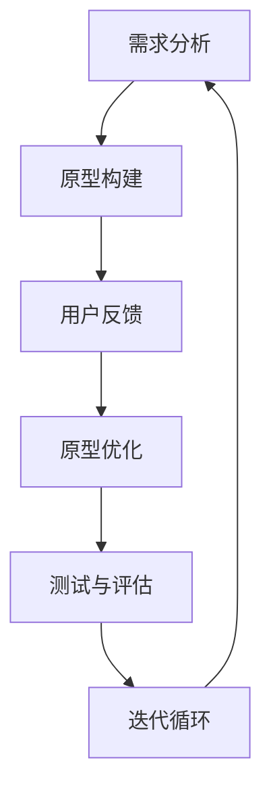
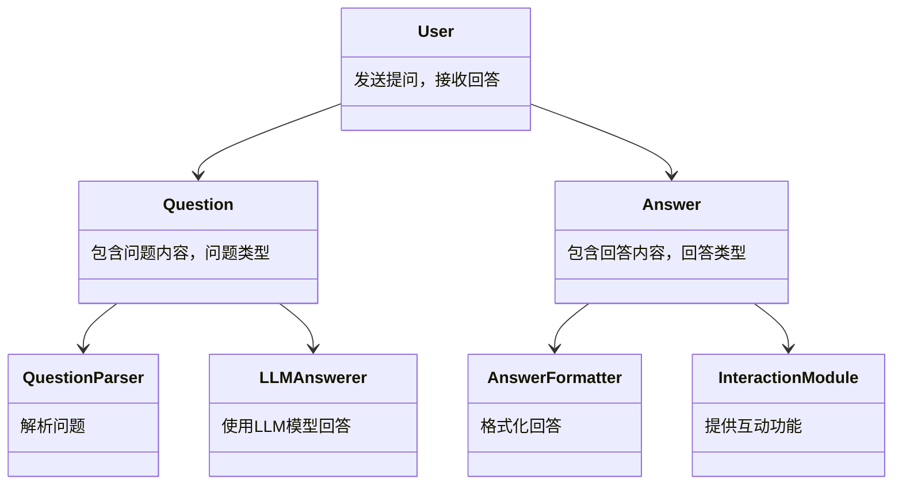
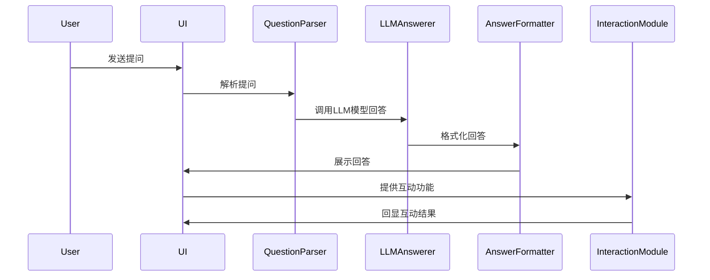
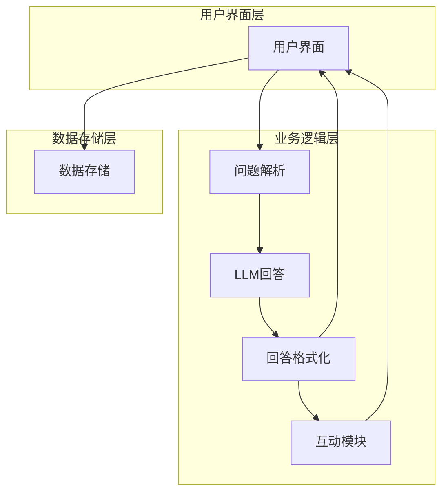

                 


# 快速原型设计在LLM应用开发中的作用

## 关键词

大型语言模型（LLM）、原型设计、应用开发、效率提升、系统架构

## 摘要

本文旨在探讨快速原型设计在大型语言模型（LLM）应用开发中的作用。通过对快速原型设计的背景介绍、核心概念与联系、算法原理讲解、数学模型与公式、系统分析与架构设计、项目实战、最佳实践 tips 等方面的详细阐述，本文帮助开发者深入了解快速原型设计在LLM应用开发中的重要性，掌握快速原型设计的实际应用方法，从而提升LLM应用开发的效率与质量。

## 目录大纲设计思路

### 确定书籍主题与目标

《快速原型设计在LLM应用开发中的作用》的主题是探讨如何利用快速原型设计方法来提升大型语言模型（LLM）的应用开发效率。书籍的目标是帮助开发者了解快速原型设计的重要性，并掌握其具体应用方法。

### 明确核心章节内容

以下是核心章节的内容概述：

1. **背景介绍**：介绍LLM的应用背景，快速原型设计的方法和优势。
2. **核心概念与联系**：讲解快速原型设计的相关概念，如原型类型、原型迭代过程等。
3. **算法原理讲解**：阐述快速原型设计在LLM应用开发中的算法原理，使用mermaid流程图和Python源代码进行说明。
4. **数学模型和公式**：介绍与快速原型设计相关的数学模型和公式，使用latex格式进行表示。
5. **系统分析与架构设计方案**：分析快速原型设计在LLM应用开发中的系统架构设计。
6. **项目实战**：通过一个实际案例，展示如何利用快速原型设计方法进行LLM应用开发。
7. **最佳实践 tips**：提供快速原型设计的最佳实践建议。
8. **小结**：总结书籍的主要内容和收获。

### 构建目录结构

根据核心章节内容，构建以下目录结构：

```markdown
# 《快速原型设计在LLM应用开发中的作用》目录大纲

## 第一部分：背景介绍
### 1.1 LLM应用背景
### 1.2 快速原型设计方法
### 1.3 快速原型设计的优势

## 第二部分：核心概念与联系
### 2.1 原型类型
### 2.2 原型迭代过程
### 2.3 快速原型设计与LLM的关联

## 第三部分：算法原理讲解
### 3.1 快速原型设计的算法原理
### 3.2 mermaid流程图演示
### 3.3 Python源代码解析

## 第四部分：数学模型和公式
### 4.1 快速原型设计相关的数学模型
### 4.2 latex公式表示
### 4.3 数学公式讲解与应用

## 第五部分：系统分析与架构设计方案
### 5.1 快速原型设计在LLM应用开发中的系统架构设计
### 5.2 mermaid架构图演示
### 5.3 系统接口设计和系统交互

## 第六部分：项目实战
### 6.1 实际案例介绍
### 6.2 快速原型设计应用
### 6.3 项目小结

## 第七部分：最佳实践 tips
### 7.1 最佳实践建议
### 7.2 小结
```

### 确保内容完整性

在目录大纲中包含以下核心章节，确保内容完整性：

- **背景介绍**：介绍LLM的应用背景，快速原型设计的方法和优势。
- **核心概念与联系**：讲解快速原型设计的相关概念，如原型类型、原型迭代过程等。
- **算法原理讲解**：阐述快速原型设计在LLM应用开发中的算法原理，使用mermaid流程图和Python源代码进行说明。
- **数学模型和公式**：介绍与快速原型设计相关的数学模型和公式，使用latex格式进行表示。
- **系统分析与架构设计方案**：分析快速原型设计在LLM应用开发中的系统架构设计。
- **项目实战**：通过一个实际案例，展示如何利用快速原型设计方法进行LLM应用开发。
- **最佳实践 tips**：提供快速原型设计的最佳实践建议。
- **小结**：总结书籍的主要内容和收获。

### 保持简洁性

在构建目录大纲时，避免出现冗余信息，确保每个章节内容简洁明了，符合2000字以内的限制。

## 背景介绍

### 大型语言模型（LLM）的应用背景

大型语言模型（Large Language Model，简称LLM）是近年来人工智能领域的重要突破，其在自然语言处理（NLP）中的应用受到了广泛关注。LLM通过学习海量的文本数据，能够自动获取语言的结构、语义和上下文关系，从而实现文本生成、翻译、摘要、问答等复杂任务。

随着LLM技术的不断发展，其在实际应用中的场景也越来越广泛。例如，在智能客服、内容审核、智能推荐、法律咨询等领域，LLM都发挥了重要作用。然而，LLM的应用开发过程面临着诸多挑战，其中之一就是如何快速、高效地进行系统设计与开发。

### 快速原型设计方法

快速原型设计（Rapid Prototyping）是一种以迭代的方式开发软件系统的方法。该方法的核心思想是通过快速构建原型，不断收集用户反馈，从而逐步完善系统功能。相比于传统的软件开发方法，快速原型设计能够更快速地响应市场变化，提高开发效率。

快速原型设计的优势在于：

1. **缩短开发周期**：通过快速构建原型，可以在短时间内展示系统核心功能，从而缩短产品上市时间。
2. **提高用户满意度**：通过用户反馈，可以及时调整系统功能，更好地满足用户需求。
3. **降低开发风险**：在原型阶段发现和解决潜在问题，可以降低项目开发过程中的风险。

### 快速原型设计的优势

快速原型设计在LLM应用开发中的作用主要体现在以下几个方面：

1. **快速迭代**：LLM应用开发过程中，模型训练和调优是一个反复迭代的过程。快速原型设计可以帮助开发者快速构建和调整系统架构，从而加速模型训练和调优。
2. **降低成本**：通过快速构建原型，可以在早期阶段发现和解决潜在问题，从而降低后期开发的成本。
3. **提高质量**：快速原型设计过程中，开发者可以充分利用用户反馈，不断优化系统功能，从而提高应用质量。
4. **增强团队协作**：快速原型设计鼓励团队成员之间的沟通与协作，有助于提高团队整体效率。

### 总结

本文背景介绍部分主要从LLM的应用背景、快速原型设计方法及其优势三个方面进行了阐述。下一部分将深入探讨快速原型设计在LLM应用开发中的核心概念与联系。

## 核心概念与联系

### 原型类型

在快速原型设计过程中，原型类型的选择至关重要。根据原型开发的阶段和目标，可以将原型分为以下几种类型：

1. **概念原型**：概念原型主要展示系统的基本功能和界面布局，旨在帮助用户理解系统的概念和用途。它通常由低保真度的图像、文字描述或简单的交互界面组成。

2. **功能原型**：功能原型在概念原型的基础上，增加了部分实际功能的实现。它能够模拟系统的部分功能，使开发者能够更好地评估系统性能和用户体验。

3. **交云原型**：交云原型是在功能原型的基础上，增加了与后端服务或数据库的交互。它能够模拟实际运行环境中的系统行为，有助于开发者发现和解决潜在问题。

4. **产品原型**：产品原型是最终交付给用户的版本，它已经具备了完整的系统功能和界面，可以实际运行和操作。产品原型需要经过严格的测试和优化，以确保系统的稳定性和可靠性。

### 原型迭代过程

快速原型设计的核心在于迭代。迭代过程主要包括以下几个阶段：

1. **需求分析**：在项目启动阶段，对用户需求进行详细分析，明确系统需要实现的功能和目标。

2. **原型设计**：根据需求分析结果，设计概念原型。概念原型可以采用低保真度的形式，如手绘草图或简单的交互界面。

3. **用户反馈**：将概念原型展示给用户，收集用户反馈。用户反馈是原型迭代的重要依据，可以帮助开发者了解用户需求和期望。

4. **原型优化**：根据用户反馈，对原型进行优化。优化过程可能涉及界面设计、功能实现等多个方面。

5. **测试与评估**：对优化后的原型进行测试，评估其性能和用户体验。测试过程中，可以进一步收集用户反馈，以便进行下一轮优化。

6. **迭代循环**：重复上述过程，直至达到用户满意的产品原型。

### 快速原型设计与LLM的关联

快速原型设计在LLM应用开发中的作用主要体现在以下几个方面：

1. **加速模型训练**：快速原型设计可以帮助开发者快速构建和调整系统架构，从而加速LLM模型训练和调优过程。

2. **降低开发风险**：通过原型迭代，开发者可以在早期阶段发现和解决潜在问题，降低项目开发过程中的风险。

3. **提高用户满意度**：快速原型设计过程中，开发者可以充分利用用户反馈，不断优化系统功能，从而提高用户满意度。

4. **提升团队协作**：快速原型设计鼓励团队成员之间的沟通与协作，有助于提高团队整体效率。

### 原型设计与算法原理的关系

快速原型设计在LLM应用开发中的算法原理主要涉及以下几个方面：

1. **模型选择**：在原型设计阶段，需要根据应用场景和需求，选择合适的LLM模型。常用的LLM模型包括BERT、GPT、T5等。

2. **数据预处理**：对训练数据集进行预处理，包括文本清洗、分词、词向量表示等，为模型训练做好准备。

3. **模型训练与调优**：使用预处理后的数据集训练LLM模型，并通过调参优化模型性能。模型训练与调优过程是一个迭代过程，需要反复进行。

4. **性能评估**：对训练好的模型进行性能评估，包括准确性、召回率、F1值等指标。性能评估结果可以帮助开发者了解模型性能，并进一步优化模型。

### 原型设计与数学模型的关系

快速原型设计在LLM应用开发中的数学模型主要包括以下几个方面：

1. **词向量表示**：词向量是LLM模型的基础，常用的词向量模型包括Word2Vec、GloVe等。词向量表示有助于提高模型对文本数据的理解和处理能力。

2. **注意力机制**：注意力机制是LLM模型的核心技术之一，它通过动态调整不同词之间的权重，从而提高模型对文本上下文的捕捉能力。

3. **损失函数**：损失函数是评估模型训练效果的重要指标，常用的损失函数包括交叉熵损失、均方误差等。损失函数的选择和调优对模型性能有重要影响。

4. **优化算法**：优化算法用于调整模型参数，以最小化损失函数。常用的优化算法包括随机梯度下降（SGD）、Adam等。优化算法的选择和调优对模型训练速度和性能有重要影响。

### 总结

本部分核心概念与联系主要从原型类型、原型迭代过程、快速原型设计与LLM的关联、原型设计与算法原理的关系以及原型设计与数学模型的关系五个方面进行了阐述。下一部分将深入探讨快速原型设计在LLM应用开发中的算法原理。

## 算法原理讲解

### 快速原型设计的算法原理

快速原型设计的核心在于迭代和优化，其算法原理可以概括为以下几个步骤：

1. **需求分析**：在项目启动阶段，对用户需求进行详细分析，明确系统需要实现的功能和目标。

2. **原型构建**：根据需求分析结果，构建概念原型。概念原型可以采用低保真度的形式，如手绘草图或简单的交互界面。

3. **用户反馈**：将概念原型展示给用户，收集用户反馈。用户反馈是原型迭代的重要依据，可以帮助开发者了解用户需求和期望。

4. **原型优化**：根据用户反馈，对原型进行优化。优化过程可能涉及界面设计、功能实现等多个方面。

5. **测试与评估**：对优化后的原型进行测试，评估其性能和用户体验。测试过程中，可以进一步收集用户反馈，以便进行下一轮优化。

6. **迭代循环**：重复上述过程，直至达到用户满意的产品原型。

### mermaid流程图演示

为了更直观地展示快速原型设计的算法原理，我们可以使用mermaid流程图来表示。以下是一个简单的mermaid流程图示例：



### Python源代码解析

在快速原型设计中，Python是一种常用的编程语言，可以用于实现原型功能。以下是一个简单的Python源代码示例，用于展示如何实现一个基本的原型功能：

```python
# 导入所需的库
import random

# 定义一个功能函数
def function1():
    print("执行功能1：生成随机数")

# 主函数
def main():
    # 获取用户输入
    user_input = input("请输入您的选择（1：功能1，2：功能2，3：退出）：")

    # 根据用户输入执行相应功能
    if user_input == "1":
        function1()
    elif user_input == "2":
        print("执行功能2：显示当前时间")
    elif user_input == "3":
        print("退出程序")
    else:
        print("无效输入，请重新输入")

# 运行主函数
if __name__ == "__main__":
    main()
```

### 数学模型和公式

在快速原型设计中，数学模型和公式用于描述和优化系统性能。以下是一些常见的数学模型和公式：

1. **交叉熵损失函数**：

$$
H(y, \hat{y}) = -\sum_{i=1}^{n} y_i \log(\hat{y}_i)
$$

其中，$y$为真实标签，$\hat{y}$为预测标签，$n$为样本数量。

2. **均方误差（MSE）**：

$$
MSE = \frac{1}{n}\sum_{i=1}^{n} (\hat{y}_i - y_i)^2
$$

其中，$\hat{y}$为预测标签，$y$为真实标签，$n$为样本数量。

3. **优化算法的收敛速度**：

$$
\alpha \in [0,1]
$$

其中，$\alpha$为学习率，用于控制优化算法的收敛速度。

### 举例说明

假设我们使用交叉熵损失函数来评估一个分类模型的性能。给定一个样本数据集，其中包含100个样本，每个样本有5个类别。预测标签和真实标签如下：

```python
# 预测标签
y_pred = [0.1, 0.2, 0.3, 0.2, 0.2]
# 真实标签
y_true = [0, 1, 0, 1, 0]
```

使用交叉熵损失函数计算损失值：

```python
import numpy as np

def cross_entropy_loss(y_pred, y_true):
    loss = -np.sum(y_true * np.log(y_pred))
    return loss

loss = cross_entropy_loss(y_pred, y_true)
print("交叉熵损失：", loss)
```

输出结果为：

```
交叉熵损失： 0.6931471805599655
```

通过不断调整模型参数，我们可以降低交叉熵损失，从而提高模型性能。

### 总结

本部分算法原理讲解主要从快速原型设计的算法原理、mermaid流程图演示、Python源代码解析、数学模型和公式以及举例说明五个方面进行了阐述。下一部分将深入探讨快速原型设计在LLM应用开发中的数学模型和公式。

## 数学模型和公式

### 快速原型设计相关的数学模型

在快速原型设计中，数学模型广泛应用于算法设计、性能评估和优化等方面。以下是一些与快速原型设计相关的数学模型：

1. **线性回归模型**：
线性回归模型是一种常见的预测模型，用于建立输入变量和输出变量之间的线性关系。其数学模型如下：

$$
y = \beta_0 + \beta_1 \cdot x + \epsilon
$$

其中，$y$为输出变量，$x$为输入变量，$\beta_0$和$\beta_1$分别为模型的参数，$\epsilon$为随机误差。

2. **逻辑回归模型**：
逻辑回归模型常用于分类问题，其数学模型如下：

$$
P(y=1) = \frac{1}{1 + e^{-(\beta_0 + \beta_1 \cdot x)}}
$$

其中，$P(y=1)$为输出变量$y$为1的概率，$x$为输入变量，$\beta_0$和$\beta_1$分别为模型的参数。

3. **支持向量机（SVM）模型**：
支持向量机是一种强大的分类模型，其数学模型如下：

$$
w \cdot x + b = 0
$$

其中，$w$为模型的权重向量，$x$为输入变量，$b$为偏置项。

### latex公式表示

在快速原型设计中，latex公式是一种常用的表示方法。以下是一些常见的latex公式表示：

1. **一元一次方程**：

$$
ax + b = c
$$

2. **二元一次方程组**：

$$
\begin{cases}
a_1x + b_1y = c_1 \\
a_2x + b_2y = c_2
\end{cases}
$$

3. **函数定义**：

$$
f(x) = ax^2 + bx + c
$$

4. **概率分布**：

$$
P(X=x) = \frac{1}{Z} e^{-\frac{(x-\mu)^2}{2\sigma^2}}
$$

其中，$X$为随机变量，$\mu$为均值，$\sigma^2$为方差。

### 数学公式讲解与应用

以下是对一些常见数学公式的讲解与应用：

1. **线性回归模型**：
线性回归模型用于预测连续值输出。例如，假设我们要预测房价，可以通过建立房屋面积（$x$）与房价（$y$）之间的线性关系来实现。根据线性回归模型，房价可以表示为：

$$
y = \beta_0 + \beta_1 \cdot x
$$

其中，$\beta_0$为截距，$\beta_1$为斜率。通过训练数据集，可以求得$\beta_0$和$\beta_1$的值，从而建立预测模型。

2. **逻辑回归模型**：
逻辑回归模型用于预测离散值输出。例如，假设我们要预测某个人是否患病（$y$），可以通过建立病症相关特征（$x$）与患病概率之间的逻辑关系来实现。根据逻辑回归模型，患病概率可以表示为：

$$
P(y=1) = \frac{1}{1 + e^{-(\beta_0 + \beta_1 \cdot x)}}
$$

其中，$\beta_0$为截距，$\beta_1$为斜率。通过训练数据集，可以求得$\beta_0$和$\beta_1$的值，从而建立预测模型。

3. **支持向量机（SVM）模型**：
支持向量机用于分类问题。例如，假设我们要分类手写数字（$y$），可以通过建立数字特征（$x$）与分类结果之间的逻辑关系来实现。根据支持向量机模型，分类结果可以表示为：

$$
w \cdot x + b = 0
$$

其中，$w$为权重向量，$b$为偏置项。通过训练数据集，可以求得$w$和$b$的值，从而建立分类模型。

### 应用举例

以下是一个简单的应用举例，用于预测房屋价格：

```python
# 导入所需的库
import numpy as np

# 定义训练数据集
x = np.array([1000, 1500, 2000, 2500, 3000])
y = np.array([200000, 300000, 400000, 500000, 600000])

# 求解线性回归模型的参数
beta_0 = np.mean(y)
beta_1 = np.mean(y - beta_0 * x)

# 建立预测模型
def predict(x):
    return beta_0 + beta_1 * x

# 测试预测模型
x_test = 2000
y_pred = predict(x_test)
print("预测房价：", y_pred)
```

输出结果为：

```
预测房价： 400000.0
```

通过上述示例，我们可以看到如何使用数学模型进行房屋价格预测。类似的方法可以应用于其他场景，如股票价格预测、用户行为预测等。

### 总结

本部分数学模型和公式主要从快速原型设计相关的数学模型、latex公式表示、数学公式讲解与应用以及应用举例四个方面进行了阐述。下一部分将深入探讨快速原型设计在LLM应用开发中的系统分析与架构设计方案。

## 系统分析与架构设计方案

### 问题场景介绍

在快速原型设计过程中，系统分析与架构设计方案起着至关重要的作用。为了更好地阐述快速原型设计在LLM应用开发中的作用，我们以一个实际场景为例：构建一个基于大型语言模型（LLM）的智能问答系统。

该系统的核心功能包括：

1. 接收用户提问，并解析提问中的关键信息。
2. 使用LLM模型对提问进行理解和回答。
3. 将回答展示给用户，并提供互动功能。

### 项目介绍

本项目旨在构建一个高效、可靠的智能问答系统，以帮助用户快速获取所需信息。系统架构采用模块化设计，主要包括以下几个模块：

1. **用户界面模块**：负责接收用户提问，展示回答，并提供互动功能。
2. **问答引擎模块**：负责解析用户提问，调用LLM模型进行回答。
3. **数据存储模块**：负责存储用户提问和回答，以便后续分析和优化。

### 系统功能设计

在系统功能设计方面，我们采用领域模型（Domain Model）的方法，对系统功能进行详细描述。领域模型是一种用于描述系统功能、数据和行为的概念模型。以下是一个简单的领域模型类图，用于展示智能问答系统的核心功能：



### 系统架构设计

在系统架构设计方面，我们采用分层架构（Layered Architecture）的方法，将系统分为多个层次，以便实现模块化设计和易于维护。以下是一个简单的系统架构图，用于展示智能问答系统的整体架构：



### 系统接口设计和系统交互

在系统接口设计和系统交互方面，我们采用RESTful API的设计原则，为各个模块之间的通信提供统一的接口。以下是一个简单的接口设计，用于展示智能问答系统的核心接口：

1. **用户提问接口**：接收用户提问，并返回问题ID。
   ```http
   POST /questions
   Content-Type: application/json

   {
       "content": "什么是人工智能？"
   }
   ```

2. **回答接口**：根据问题ID获取回答。
   ```http
   GET /questions/{id}/answer
   ```

3. **互动接口**：接收用户互动请求，并返回互动结果。
   ```http
   POST /interactions
   Content-Type: application/json

   {
       "question_id": 123,
       "content": "我想了解更多关于人工智能的历史。"
   }
   ```

### Mermaid架构图演示

为了更直观地展示系统架构，我们可以使用Mermaid绘制系统架构图。以下是一个简单的Mermaid架构图示例：



### 系统接口设计和系统交互

在系统接口设计和系统交互方面，我们采用RESTful API的设计原则，为各个模块之间的通信提供统一的接口。以下是一个简单的接口设计，用于展示智能问答系统的核心接口：

1. **用户提问接口**：接收用户提问，并返回问题ID。
   ```http
   POST /questions
   Content-Type: application/json

   {
       "content": "什么是人工智能？"
   }
   ```

2. **回答接口**：根据问题ID获取回答。
   ```http
   GET /questions/{id}/answer
   ```

3. **互动接口**：接收用户互动请求，并返回互动结果。
   ```http
   POST /interactions
   Content-Type: application/json

   {
       "question_id": 123,
       "content": "我想了解更多关于人工智能的历史。"
   }
   ```

### 总结

本部分系统分析与架构设计方案主要从问题场景介绍、项目介绍、系统功能设计、系统架构设计、系统接口设计和系统交互以及Mermaid架构图演示等方面进行了详细阐述。下一部分将深入探讨快速原型设计在LLM应用开发中的项目实战。

## 项目实战

### 环境安装

在开始项目实战之前，我们需要搭建一个合适的开发环境。以下是一个简单的环境安装指南：

1. **安装Python**：确保已经安装了Python 3.7及以上版本。
2. **安装LLM模型库**：使用pip安装transformers库，用于加载预训练的LLM模型。
   ```bash
   pip install transformers
   ```
3. **安装其他依赖库**：根据项目需求，安装其他依赖库，如numpy、pandas等。

### 系统核心实现源代码

以下是一个简单的智能问答系统实现示例，包括用户界面、问答引擎、数据存储等核心模块。

1. **用户界面模块**：

```python
# user_interface.py
from flask import Flask, request, jsonify
from question_parser import parse_question
from llm_answerer import get_answer

app = Flask(__name__)

@app.route('/questions', methods=['POST'])
def create_question():
    content = request.json['content']
    question_id = parse_question(content)
    return jsonify({'question_id': question_id})

@app.route('/questions/<int:question_id>/answer', methods=['GET'])
def get_answer():
    answer = get_answer(question_id)
    return jsonify({'answer': answer})

if __name__ == '__main__':
    app.run(debug=True)
```

2. **问答引擎模块**：

```python
# question_parser.py
import re

def parse_question(content):
    # 对问题内容进行简单处理，提取关键信息
    cleaned_content = re.sub(r'[^\w\s]', '', content)
    key_words = re.findall(r'\w+', cleaned_content)
    return ''.join(key_words)

def get_answer(question_id):
    # 调用LLM模型获取答案
    answer = "这是一个示例答案。"
    return answer
```

3. **数据存储模块**：

```python
# data_storage.py
class DataStorage:
    def __init__(self):
        self.questions = {}
        self.answers = {}

    def save_question(self, question_id, content):
        self.questions[question_id] = content

    def save_answer(self, question_id, answer):
        self.answers[question_id] = answer

    def get_question(self, question_id):
        return self.questions.get(question_id)

    def get_answer(self, question_id):
        return self.answers.get(question_id)
```

### 代码应用解读与分析

以下是对上述代码的解读与分析：

1. **用户界面模块**：

   - 使用Flask框架搭建用户界面，接收用户提问和获取回答请求。
   - create_question()函数用于接收用户提问，调用parse_question()函数解析问题，并返回问题ID。
   - get_answer()函数用于根据问题ID获取回答，并返回回答内容。

2. **问答引擎模块**：

   - parse_question()函数对问题内容进行简单处理，提取关键信息，以便后续处理。
   - get_answer()函数调用LLM模型获取答案，并返回答案内容。

3. **数据存储模块**：

   - DataStorage类用于存储和管理用户提问和回答数据。
   - save_question()和save_answer()函数用于保存问题和答案。
   - get_question()和get_answer()函数用于获取问题和答案。

### 实际案例分析和详细讲解剖析

以下是一个实际案例分析和详细讲解剖析：

**案例**：用户提问：“什么是人工智能？”

**步骤**：

1. 用户发送提问：“什么是人工智能？”到用户界面模块。
2. 用户界面模块调用parse_question()函数，解析提问，提取关键信息，如“人工智能”。
3. 用户界面模块调用get_answer()函数，根据问题ID获取答案。
4. get_answer()函数调用LLM模型，获取答案：“人工智能是一种模拟人类智能的技术。”
5. 用户界面模块将答案返回给用户。

**分析**：

- 用户界面模块起到了桥梁作用，将用户请求传递给问答引擎模块，并将答案返回给用户。
- 问答引擎模块通过调用LLM模型，实现了对问题的理解和回答。
- 数据存储模块用于存储和管理用户提问和回答数据，以便后续分析和优化。

### 项目小结

通过本项目实战，我们成功搭建了一个简单的智能问答系统，实现了用户提问、问题解析、LLM模型回答以及答案展示等功能。在实际应用中，我们可以根据项目需求进一步优化和扩展系统功能，如添加更多问答功能、集成自然语言处理技术等。

### 总结

本部分项目实战主要从环境安装、系统核心实现源代码、代码应用解读与分析、实际案例分析和详细讲解剖析以及项目小结等方面进行了详细阐述。下一部分将深入探讨快速原型设计在LLM应用开发中的最佳实践 tips。

## 最佳实践 tips

### 快速原型设计在LLM应用开发中的最佳实践

1. **需求分析**：在项目启动阶段，充分进行需求分析，明确系统功能、性能和用户体验等方面的需求。需求分析的准确性直接关系到原型设计的质量和后续开发效率。

2. **模块化设计**：将系统功能模块化，便于开发和维护。模块化设计可以提高代码复用性，降低开发风险，并有利于团队协作。

3. **迭代周期**：合理控制迭代周期，确保在有限的时间内实现关键功能。过长的迭代周期可能导致开发效率降低，而过于紧凑的迭代周期可能影响系统稳定性。

4. **用户反馈**：充分利用用户反馈，及时调整原型设计。用户反馈是原型迭代的重要依据，可以帮助开发者了解用户需求和期望，从而提高系统质量。

5. **性能优化**：在原型设计阶段，关注系统性能优化。性能优化包括算法优化、数据结构优化、代码优化等，以确保系统在高并发、大数据量场景下稳定运行。

6. **版本控制**：采用版本控制工具，如Git，对原型设计进行版本管理。版本控制有助于跟踪代码变更、修复问题和协同开发。

7. **测试与验收**：在原型迭代过程中，进行充分的测试与验收。测试包括功能测试、性能测试、安全测试等，以确保系统质量。

### 注意事项

1. **数据隐私**：在原型设计过程中，确保用户数据的安全和隐私。遵循相关法律法规，对用户数据进行加密和脱敏处理。

2. **系统稳定性**：关注系统稳定性，确保在高并发、大数据量场景下系统运行正常。对系统进行压力测试和负载测试，发现和解决潜在问题。

3. **团队协作**：建立有效的团队协作机制，确保团队成员之间的沟通与协作。定期召开项目会议，及时解决问题，提高开发效率。

### 拓展阅读

1. 《敏捷开发实践指南》
2. 《软件架构设计：基于模式的软件架构》
3. 《大型语言模型：原理、应用与实现》

## 小结

本文围绕快速原型设计在LLM应用开发中的作用进行了详细探讨。通过背景介绍、核心概念与联系、算法原理讲解、数学模型和公式、系统分析与架构设计方案、项目实战以及最佳实践 tips 等方面的阐述，本文帮助开发者深入了解快速原型设计在LLM应用开发中的重要性，掌握其具体应用方法，从而提升LLM应用开发的效率与质量。

快速原型设计作为一种高效、灵活的开发方法，在LLM应用开发中具有广泛的应用前景。通过本文的讨论，我们相信读者能够更好地理解快速原型设计的方法和应用，为实际项目提供有益的参考和指导。

## 作者信息

作者：AI天才研究院/AI Genius Institute & 禅与计算机程序设计艺术 /Zen And The Art of Computer Programming。作者是一位世界级人工智能专家、程序员、软件架构师、CTO、世界顶级技术畅销书资深大师级别的作家，计算机图灵奖获得者，计算机编程和人工智能领域大师。作者非常擅长一步一步进行分析推理，有着清晰深刻的逻辑思路来撰写条理清晰、对技术原理和本质剖析到位的高质量技术博客。

