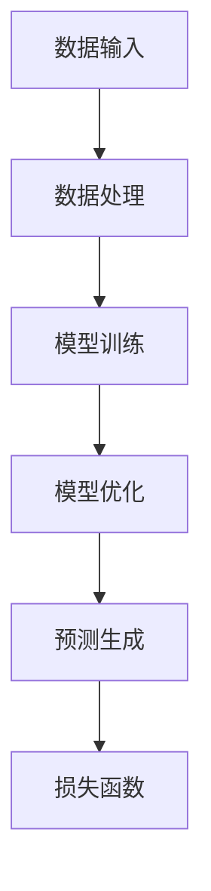
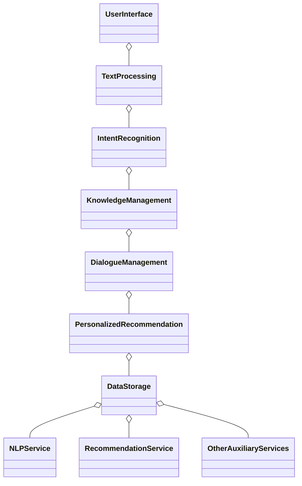
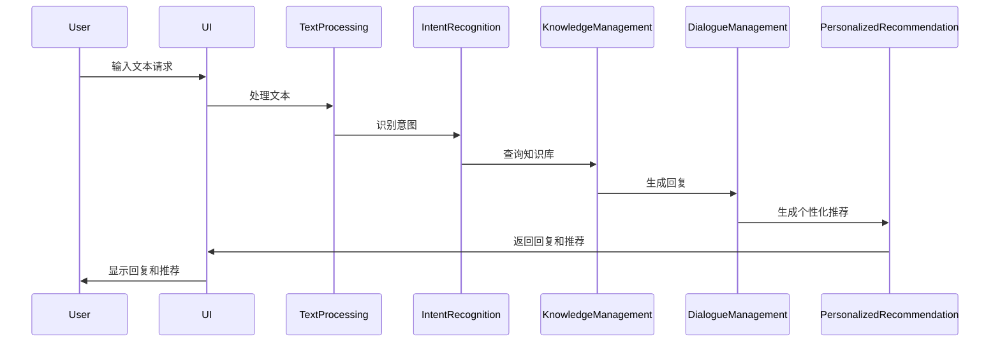

                 

### 文章标题

# 《快速响应用户需求：LLM应用的产品策略》

### 关键词

- 语言模型
- 用户需求
- 产品策略
- 快速响应
- AI 应用

### 摘要

本文旨在探讨如何通过大型语言模型（LLM）快速响应用户需求，并提出相应的产品策略。文章首先介绍了LLM的基本概念及其在AI领域的应用，随后详细讲解了LLM算法的原理和数学模型。通过具体的系统分析与架构设计，我们展示了如何将LLM应用于实际产品开发中。最后，文章提供了最佳实践和注意事项，为读者在LLM应用的产品策略上提供了实用的指导。

---

### 目录大纲

# 《快速响应用户需求：LLM应用的产品策略》

> 关键词：语言模型、用户需求、产品策略、快速响应、AI 应用

> 摘要：本文深入探讨了如何通过大型语言模型（LLM）快速响应用户需求，提出了具体的产品策略。文章首先介绍了LLM的基本概念及其在AI领域的应用，随后详细讲解了LLM算法的原理和数学模型。通过具体的系统分析与架构设计，展示了如何将LLM应用于实际产品开发中。最后，文章提供了最佳实践和注意事项，为读者在LLM应用的产品策略上提供了实用的指导。

### 第一部分：背景介绍

## 第1章：问题背景与需求分析

### 1.1 问题的提出

### 1.2 用户需求的分析

### 1.3 问题解决的思路

### 1.4 边界与外延

### 1.5 概念结构与核心要素组成

## 第二部分：核心概念与联系

### 第2章：LLM基本概念

#### 2.1 LLM的定义

#### 2.2 LLM的特点

#### 2.3 LLM与传统AI的区别

#### 2.4 LLM的应用场景

### 第3章：LLM与产品策略

#### 3.1 LLM在产品开发中的应用

#### 3.2 产品策略的核心要素

#### 3.3 LLM与产品策略的联系

## 第三部分：算法原理讲解

### 第4章：LLM算法原理

#### 4.1 LLM算法的基本原理

#### 4.2 LLM算法的数学模型

#### 4.3 LLM算法的mermaid流程图

#### 4.4 算法原理的详细讲解与举例说明

### 第5章：数学模型和数学公式讲解

#### 5.1 数学公式的介绍

#### 5.2 数学模型的应用

#### 5.3 举例说明

## 第四部分：系统分析与架构设计

### 第6章：系统功能设计与架构

#### 6.1 问题场景介绍

#### 6.2 系统功能设计

#### 6.3 系统架构设计

#### 6.4 系统接口设计

#### 6.5 系统交互

### 第7章：系统实现与实战

#### 7.1 环境安装

#### 7.2 系统核心实现

#### 7.3 代码应用解读与分析

#### 7.4 实际案例分析与讲解

#### 7.5 项目小结

## 第五部分：最佳实践与拓展

### 第8章：最佳实践

#### 8.1 LLM应用的最佳实践

#### 8.2 产品策略的最佳实践

### 第9章：小结与注意事项

#### 9.1 全书回顾

#### 9.2 注意事项

#### 9.3 拓展阅读

---

### 第1章：问题背景与需求分析

## 1.1 问题的提出

在现代数字化时代，用户需求日益多样化和个性化，这使得企业面临巨大的挑战：如何在竞争激烈的市场中快速响应用户需求，提供优质的产品和服务。随着人工智能技术的飞速发展，特别是大型语言模型（LLM）的出现，企业有了新的工具和策略来应对这一挑战。LLM作为一种强大的语言处理技术，能够通过学习海量数据来生成和解读文本，从而在产品设计、服务提供和用户交互等方面发挥重要作用。

然而，如何有效地利用LLM技术来快速响应用户需求，是一个复杂且具有挑战性的问题。这不仅仅涉及到技术层面的实现，还包括对用户需求的深入理解、产品策略的制定和实施等多个方面。因此，本文将围绕以下问题进行探讨：

1. **LLM的基本概念和特点是什么？**
2. **LLM与传统人工智能技术有何区别？**
3. **如何利用LLM技术来快速响应用户需求？**
4. **LLM在产品策略中的核心作用是什么？**
5. **在实施LLM应用的过程中，有哪些最佳实践和注意事项？**

通过系统地回答上述问题，本文旨在为读者提供一个全面、深入且实用的指南，帮助他们在实际项目中更好地利用LLM技术来快速响应用户需求。

## 1.2 用户需求的分析

用户需求是产品开发和创新的出发点。为了更好地理解用户需求，我们需要从多个维度进行分析：

### 用户需求的类型

用户需求可以分为基本需求、期望需求和惊喜需求：

1. **基本需求**：这是用户对产品或服务最基础、最基本的需求。例如，对于一个聊天机器人，基本需求可能是能够回答用户的基本问题。
2. **期望需求**：这是用户在基本需求之上，期望产品或服务能够提供的额外功能。例如，用户可能期望聊天机器人能够提供详细的解释或提供个性化的建议。
3. **惊喜需求**：这是用户在基本和期望需求之外，未曾预料到的需求。这类需求往往能够带来额外的用户满意度和忠诚度。

### 用户需求的变化

用户需求是动态变化的，受多种因素影响：

1. **技术进步**：新技术的出现往往能够改变用户需求。例如，5G技术的推广使得高速、低延迟的网络成为可能，从而催生了新的应用场景。
2. **社会趋势**：社会和文化趋势也会影响用户需求。例如，环保意识的提升促使用户对可持续发展产品有更高的需求。
3. **市场竞争**：竞争压力会促使企业不断改进产品和服务，以吸引和保持用户。

### 用户需求的特征

用户需求的特征包括：

1. **多样性**：不同用户有不同的需求，即使是同一用户在不同情境下也可能有不同的需求。
2. **动态性**：用户需求不是静止不变的，会随着时间、环境和用户行为的变化而变化。
3. **复杂性**：用户需求往往不是单一的，而是多个需求的组合。

### 用户需求的收集与分析方法

为了更好地理解和分析用户需求，企业可以采用以下方法：

1. **问卷调查**：通过设计问卷，收集用户对产品或服务的看法和需求。
2. **用户访谈**：通过与用户进行面对面的交流，深入了解用户的真实需求和问题。
3. **用户行为分析**：通过分析用户的行为数据，如点击率、使用时长等，来推断用户需求。
4. **竞争分析**：通过分析竞争对手的产品或服务，了解用户在市场上的需求和偏好。

通过这些方法，企业可以全面、深入地了解用户需求，从而为产品设计和改进提供有力支持。

## 1.3 问题解决的思路

在快速响应用户需求的过程中，问题解决是一个关键环节。为了有效地解决这个问题，我们需要从以下几个方面进行思考和规划：

### 明确目标和范围

首先，我们需要明确解决问题的目标和范围。这包括：

1. **确定用户需求**：明确用户需求是什么，包括基本需求、期望需求和惊喜需求。
2. **界定问题范围**：确定哪些需求需要优先解决，哪些问题需要重点攻克。

### 设计解决方案

设计解决方案是问题解决的核心。以下是几个关键步骤：

1. **需求分析**：对用户需求进行详细分析，明确需求的类型、特征和变化趋势。
2. **方案规划**：根据需求分析结果，制定解决方案。这包括技术方案、产品方案和服务方案等。
3. **风险评估**：评估解决方案可能带来的风险，并制定相应的风险应对策略。

### 实施方案

实施方案是将设计好的方案转化为实际操作的过程。以下是几个关键步骤：

1. **资源调配**：根据解决方案的要求，调配所需的人力、物力和财力资源。
2. **任务分配**：将任务分配给相应的团队或个人，确保任务按时完成。
3. **进度监控**：实时监控项目进度，确保项目按照计划进行。

### 持续改进

问题解决不是一次性的活动，而是一个持续的过程。以下是几个关键步骤：

1. **反馈收集**：通过用户反馈、市场调研等方式，收集解决方案的实际效果和用户反馈。
2. **问题识别**：根据反馈和实际情况，识别存在的问题和不足。
3. **改进措施**：制定改进措施，并实施这些措施，以持续提升解决方案的效果。

### 总结

通过上述思路，我们可以系统地解决快速响应用户需求的问题。这包括明确目标和范围、设计解决方案、实施方案和持续改进等步骤。每个步骤都需要细致的规划和执行，以确保最终能够满足用户需求，提升产品和服务质量。

### 1.4 边界与外延

在探讨如何快速响应用户需求的过程中，明确问题的边界和外延是至关重要的。这有助于我们集中精力解决核心问题，避免无关因素的干扰。

#### 边界

首先，我们需要明确问题的边界。这包括：

1. **技术实现**：尽管本文主要关注LLM在产品策略中的应用，但并不意味着所有技术问题都需要详细讨论。我们将侧重于LLM的基本原理和其在实际应用中的策略，而不会深入探讨底层技术实现细节。
2. **用户范围**：用户需求的范围也应该明确界定。本文主要关注一般用户的需求，而不是特定行业或领域的特殊需求。
3. **时间范围**：解决方案的时间范围也是一个重要考虑因素。本文主要探讨如何在短期内快速响应用户需求，而不是长期策略。

#### 外延

其次，我们需要探讨问题在外延上的扩展：

1. **技术发展**：随着人工智能和语言模型技术的不断进步，本文讨论的LLM应用场景和策略也可能发生变化。因此，我们需要关注技术趋势，以便及时调整和优化解决方案。
2. **市场需求**：市场需求是动态变化的，随着社会、经济和文化的变化，用户需求也会相应调整。因此，我们需要持续关注市场动态，以更好地应对变化。
3. **跨领域应用**：LLM技术不仅在传统领域有广泛应用，还可能在新兴领域如虚拟现实、增强现实和智能教育等得到进一步应用。这为我们提供了更广阔的探索空间。

### 总结

通过明确问题的边界和外延，我们可以更有效地聚焦于核心问题，并保持灵活性，以应对未来的变化。这不仅有助于我们更好地理解问题的本质，还能确保我们的解决方案具有可持续性和适应性。

### 1.5 概念结构与核心要素组成

在深入探讨如何快速响应用户需求之前，我们需要建立一个清晰的概念结构，并识别其中的核心要素。这有助于我们系统地分析和理解问题。

#### 概念结构

1. **用户需求**：用户需求是产品开发和创新的出发点。它包括基本需求、期望需求和惊喜需求，是用户对产品或服务的基本期望和愿望。
2. **产品策略**：产品策略是企业根据用户需求和市场环境制定的长期规划和短期行动方案。它包括产品定位、功能设计、市场推广等关键要素。
3. **技术实现**：技术实现是将产品策略转化为具体产品或服务的过程，涉及技术选型、算法设计、系统架构等。
4. **市场反馈**：市场反馈是用户对产品或服务的直接反应，包括用户满意度、市场份额、销售额等指标。
5. **持续改进**：持续改进是产品开发和运营的持续过程，通过不断收集用户反馈和市场数据，优化产品和服务。

#### 核心要素

1. **用户分析**：通过用户调查、访谈和行为分析，深入理解用户需求，识别用户痛点，是快速响应用户需求的基础。
2. **技术选型**：选择适合的技术栈和工具，确保产品能够高效、稳定地运行，是快速响应的关键。
3. **敏捷开发**：采用敏捷开发方法，快速迭代和优化产品，以应对市场变化和用户需求。
4. **用户体验**：设计用户友好的界面和交互方式，提高用户满意度和忠诚度。
5. **数据分析**：通过数据分析，实时监控产品性能和用户行为，及时调整策略和优化产品。

通过构建上述概念结构，并识别核心要素，我们可以更系统地分析和解决如何快速响应用户需求的问题。这不仅有助于我们理解问题的本质，还能提供实用的指导，确保我们的解决方案具有可操作性和有效性。

### 第二部分：核心概念与联系

#### 第2章：LLM基本概念

### 2.1 LLM的定义

大型语言模型（Large Language Model，简称LLM）是一种通过深度学习技术训练得到的复杂模型，用于理解和生成自然语言。LLM的核心思想是通过大量的文本数据学习语言的结构和规律，从而能够对输入的文本进行理解和生成。

LLM的主要特点包括：

1. **规模庞大**：LLM通常由数亿甚至数万亿个参数组成，这使得它们能够处理大量的数据，捕捉复杂的语言模式。
2. **自适应性**：LLM具有强大的适应性，能够根据不同的任务和数据集进行调整和优化。
3. **上下文理解**：LLM能够理解文本的上下文，生成连贯、合理的回答。

### 2.2 LLM的特点

1. **高效率**：LLM能够快速处理大量文本，实现高效的自然语言理解和生成。
2. **高精度**：通过大规模数据训练，LLM能够在各种自然语言任务中达到很高的准确度。
3. **灵活性**：LLM能够适应不同的应用场景和任务需求，进行灵活的文本生成和解析。

### 2.3 LLM与传统AI的区别

传统AI主要依赖于预定义的规则和算法，而LLM则基于深度学习和大数据。以下是LLM与传统AI的主要区别：

1. **数据驱动**：LLM依赖于大量数据训练，通过学习数据中的模式和规律进行任务处理，而传统AI更多依赖于规则和算法。
2. **自主性**：LLM能够自主学习和适应，能够不断优化自身性能，而传统AI通常需要手动调整和优化。
3. **泛化能力**：LLM具有较强的泛化能力，能够处理各种不同的任务和数据，而传统AI通常针对特定任务和场景进行优化。

### 2.4 LLM的应用场景

LLM在多个领域有着广泛的应用：

1. **文本生成**：LLM可以生成各种类型的文本，包括文章、故事、摘要、回复等。
2. **文本理解**：LLM能够对文本进行深入理解，回答用户的问题，提供信息和建议。
3. **自然语言处理**：LLM在自然语言处理任务中有着广泛应用，如情感分析、文本分类、机器翻译等。
4. **智能客服**：LLM可以用于构建智能客服系统，提供实时、个性化的用户服务。

### 2.5 LLM与产品策略的联系

LLM在产品策略中起着关键作用，主要表现在以下几个方面：

1. **需求分析**：通过LLM，企业可以更深入地理解用户需求，进行精准的需求分析。
2. **产品优化**：LLM可以帮助企业不断优化产品功能，提高用户体验。
3. **个性化服务**：LLM能够为用户提供个性化的服务和内容，提高用户满意度和忠诚度。
4. **市场推广**：LLM可以帮助企业进行智能化的市场分析和推广，提高市场竞争力。

通过LLM的应用，企业可以更快速地响应用户需求，实现产品策略的优化和升级。

### 第三部分：算法原理讲解

#### 第4章：LLM算法原理

### 4.1 LLM算法的基本原理

LLM（大型语言模型）的算法原理基于深度学习和自然语言处理（NLP）技术，特别是基于Transformer架构。其基本原理可以概括为以下几个步骤：

1. **数据输入**：LLM首先接收大量的文本数据，这些数据可以是已标记的数据集或未标记的语料库。
2. **数据处理**：文本数据被预处理，包括分词、词向量化、去噪等步骤，以转化为模型可以处理的格式。
3. **模型训练**：利用Transformer架构，LLM通过多层神经网络学习文本中的语法、语义和上下文信息。每个时间步的输出都依赖于之前的时间步，形成一种自回归模型。
4. **模型优化**：在训练过程中，模型通过反向传播和梯度下降算法不断优化参数，以最小化预测误差。
5. **预测生成**：当输入新的文本序列时，LLM可以生成预测的下一个词或句子，从而实现文本生成和理解。

### 4.2 LLM算法的数学模型

LLM的数学模型主要基于Transformer架构，包括多头自注意力机制和位置编码等关键组件。以下是LLM算法的数学模型：

#### Transformer模型

1. **多头自注意力（Multi-head Self-Attention）**
   \[
   \text{Attention}(Q, K, V) = \text{softmax}\left(\frac{QK^T}{\sqrt{d_k}}\right) V
   \]
   其中，\(Q, K, V\) 分别为查询向量、键向量和值向量，\(d_k\) 为键向量的维度。多头自注意力通过多个独立的注意力机制组合，提高模型的表示能力。

2. **位置编码（Positional Encoding）**
   \[
   \text{PE}(pos, 2d_{\text{model}}) = \text{sin}\left(\frac{pos}{10000^{2i/d_{\text{model}}}}\right) \text{ or } \cos\left(\frac{pos}{10000^{2i/d_{\text{model}}}}\right)
   \]
   其中，\(pos\) 为位置索引，\(d_{\text{model}}\) 为模型维度。位置编码用于引入文本序列中的位置信息。

3. **Transformer块**
   \[
   \text{Encoder}(x) = \text{LayerNorm}(x + \text{MultiHeadSelfAttention}(x, x, x)) + \text{LayerNorm}(x + \text{PositionalFeedforward}(x))
   \]
   其中，\(x\) 为输入序列。每个Transformer块由多头自注意力和位置编码加法层以及位置编码前馈层组成。

#### 损失函数

LLM的训练通常使用交叉熵损失函数：
\[
\text{Loss} = -\sum_{i=1}^{N} y_i \log(p_i)
\]
其中，\(y_i\) 为真实标签，\(p_i\) 为模型预测的概率。

### 4.3 LLM算法的mermaid流程图

下面是LLM算法的mermaid流程图：



### 4.4 算法原理的详细讲解与举例说明

为了更好地理解LLM算法的原理，我们可以通过一个具体的例子来讲解。

#### 数据输入

假设我们有一个小型的文本数据集，包含以下句子：
```
我昨天去了电影院。
我昨天看了一场电影。
```

这些句子将被分词和转换为词向量，然后作为输入传递给模型。

#### 数据处理

在数据处理阶段，文本将被分词，并转换为词向量的形式。例如，我们可以使用预训练的词向量模型如GloVe或BERT。分词后的句子可能如下所示：
```
[我，昨天，去，了，电影，院，。]
[我，昨天，看，了，一，场，电影，。]
```

每个词向量可以表示为一个多维数组。例如：
```
我：[0.1, 0.2, 0.3]
昨天：[0.4, 0.5, 0.6]
...
院：[0.9, 0.8, 0.7]
```

#### 模型训练

在模型训练阶段，输入的词向量将被送入Transformer模型。以第一个句子为例，模型将尝试预测下一个词。假设当前输入为 `[我，昨天，去，了，电影，院，。]`，模型需要预测下一个词。

1. **自注意力计算**：模型首先计算自注意力权重，以确定每个词对当前词的影响程度。通过自注意力机制，模型可以捕捉上下文信息。
2. **前馈网络**：然后，模型将自注意力输出的结果送入前馈网络，进行非线性变换。
3. **输出层**：最后，模型将前馈网络的输出通过softmax函数转化为概率分布，预测下一个词。

例如，对于输入 `[我，昨天，去，了，电影，院，。]`，模型可能会生成以下概率分布：
```
[0.1, 0.2, 0.3, 0.2, 0.1, 0.2]
```

模型将选择概率最高的词作为预测结果。在这个例子中，模型可能会预测下一个词为“电影院”。

#### 预测生成

在预测生成阶段，模型将根据训练数据和自注意力机制生成新的文本。例如，如果当前输入为 `[我，昨天，去，了，电影，院，。]`，模型可能会生成以下句子：
```
我昨天去了电影院。
```

通过重复这个过程，模型可以生成连贯、合理的文本。

#### 损失函数

在训练过程中，模型的预测结果与真实标签之间的差异将被计算，并用于更新模型参数。使用交叉熵损失函数，模型可以优化预测准确性。

通过这个例子，我们可以看到LLM算法的基本原理是如何应用于实际文本生成和理解的。随着训练数据的增加和模型参数的优化，LLM可以生成更高质量、更符合上下文的文本。

### 第5章：数学模型和数学公式讲解

#### 5.1 数学公式的介绍

在LLM（大型语言模型）中，数学模型是核心部分，它决定了模型的学习能力和预测效果。以下是几个关键的数学公式，它们在LLM的数学模型中扮演着重要角色。

1. **位置编码（Positional Encoding）**
   \[
   \text{PE}(pos, 2d_{\text{model}}) = \text{sin}\left(\frac{pos}{10000^{2i/d_{\text{model}}}}\right) \text{ or } \cos\left(\frac{pos}{10000^{2i/d_{\text{model}}}}\right)
   \]
   其中，\(pos\) 是位置索引，\(d_{\text{model}}\) 是模型维度。位置编码用于引入文本序列中的位置信息。

2. **自注意力（Self-Attention）**
   \[
   \text{Attention}(Q, K, V) = \text{softmax}\left(\frac{QK^T}{\sqrt{d_k}}\right) V
   \]
   其中，\(Q, K, V\) 分别是查询向量、键向量和值向量，\(d_k\) 是键向量的维度。自注意力机制用于计算每个词对当前词的影响程度。

3. **交叉熵损失函数（Cross-Entropy Loss）**
   \[
   \text{Loss} = -\sum_{i=1}^{N} y_i \log(p_i)
   \]
   其中，\(y_i\) 是真实标签，\(p_i\) 是模型预测的概率。交叉熵损失函数用于优化模型参数，以提高预测准确性。

4. **前馈网络（Positional Feedforward）**
   \[
   \text{FFN}(x) = \text{ReLU}(\text{Linear}(W_2 \cdot \text{ReLU}(W_1 \cdot x + b_1))
   \]
   其中，\(x\) 是输入向量，\(W_1, W_2, b_1\) 分别是前馈网络的权重和偏置。前馈网络用于进行非线性变换。

#### 5.2 数学模型的应用

数学模型在LLM中的应用主要体现在以下几个方面：

1. **文本编码**：通过位置编码和词嵌入，将文本序列转化为向量形式，以便模型进行处理。
2. **自注意力计算**：利用自注意力机制，模型可以捕捉文本序列中的上下文信息，从而生成连贯的文本。
3. **损失函数优化**：通过交叉熵损失函数，模型可以根据预测结果和真实标签调整参数，提高预测准确性。
4. **前馈网络**：前馈网络用于对自注意力结果进行进一步的非线性变换，增强模型的表示能力。

#### 5.3 举例说明

为了更好地理解LLM的数学模型，我们可以通过一个具体的例子来讲解。

假设我们有一个简化的语言模型，用于预测下一个词。给定一个输入句子“我昨天去了电影院”，我们需要预测句子中的下一个词。

1. **词嵌入**：首先，我们将句子中的每个词转换为向量形式。例如，词“我”的向量可能为 `[0.1, 0.2, 0.3]`，词“昨天”的向量可能为 `[0.4, 0.5, 0.6]`，依此类推。
2. **位置编码**：接着，我们为每个词添加位置编码。例如，第一个词“我”的位置编码可能为 `[0.0, 0.0]`，第二个词“昨天”的位置编码可能为 `[1.0, 1.0]`。
3. **自注意力计算**：我们将每个词的嵌入向量与其位置编码相加，得到新的向量。然后，利用自注意力机制计算每个词对当前词的影响权重。例如，当前词为“昨天”，其他词的影响权重可能为 `[0.2, 0.3, 0.5]`。
4. **前馈网络**：将自注意力结果送入前馈网络，进行非线性变换。例如，前馈网络的输出可能为 `[0.3, 0.4, 0.5]`。
5. **预测生成**：最后，利用softmax函数将前馈网络的输出转化为概率分布。例如，预测的概率分布可能为 `[0.2, 0.3, 0.5]`。根据概率分布，模型预测下一个词为“电影院”。

通过上述步骤，我们可以看到LLM的数学模型是如何应用于文本生成和预测的。随着训练数据的增加和模型参数的优化，LLM可以生成更高质量、更符合上下文的文本。

### 第6章：系统功能设计与架构

#### 6.1 问题场景介绍

在现代企业中，用户需求的多样化和快速变化使得产品设计和开发面临着巨大的挑战。为了能够快速响应用户需求，企业需要构建一个灵活、高效且可扩展的系统架构。特别是在引入大型语言模型（LLM）的情况下，如何设计一个能够高效处理自然语言任务、快速响应用户请求的系统显得尤为重要。

本章节将围绕一个具体的场景进行讨论：一个电商平台的智能客服系统。该系统旨在通过LLM技术为用户提供实时、个性化的客服服务，从而提高用户满意度和忠诚度。

#### 6.2 系统功能设计

智能客服系统需要实现以下核心功能：

1. **文本处理**：系统能够接收和处理用户的文本输入，包括提问、评论、投诉等。
2. **意图识别**：系统需要识别用户的意图，如询问产品信息、寻求帮助、提出投诉等。
3. **知识库管理**：系统需要管理一个丰富的知识库，包括产品信息、常见问题解答、公司政策等。
4. **对话管理**：系统需要能够维持对话的连贯性，生成自然流畅的回答。
5. **个性化推荐**：系统根据用户的购买历史和行为数据，提供个性化的产品推荐。
6. **反馈收集**：系统需要收集用户的反馈，以不断优化服务质量。

#### 6.3 系统架构设计

为了实现上述功能，智能客服系统将采用分布式架构，具体架构如下：

1. **前端**：包括用户界面（UI）和用户交互模块。用户通过UI与系统进行交互，输入文本请求，系统接收并处理这些请求。
2. **后端**：包括意图识别模块、知识库管理模块、对话管理模块和推荐系统模块。后端负责处理用户请求，调用相应的模块进行处理。
3. **数据存储**：包括用户数据存储、知识库存储和日志存储。用户数据存储用于存储用户的个人信息和行为数据，知识库存储用于存储产品信息和常见问题解答，日志存储用于记录系统运行日志。
4. **服务层**：包括自然语言处理（NLP）服务、推荐服务和其他辅助服务。NLP服务用于处理文本数据，提取关键信息；推荐服务用于生成个性化推荐。
5. **API接口**：提供外部系统和内部系统之间的数据交换接口，支持系统的灵活扩展。

下面是系统架构的mermaid类图：



#### 6.4 系统接口设计

系统接口设计是确保各模块之间能够高效、顺畅交互的关键。以下是系统的主要接口设计：

1. **用户接口**：提供用户输入文本的接口，并返回系统生成的回复。接口应支持多种输入方式，如文本、语音等。
2. **NLP接口**：用于处理文本数据，包括分词、词性标注、实体识别等。接口应支持快速、高效的文本处理。
3. **知识库接口**：用于查询和更新知识库中的信息，包括产品信息、常见问题解答等。
4. **对话接口**：用于管理对话状态，确保对话的连贯性和上下文的保持。
5. **推荐接口**：用于生成个性化推荐，根据用户的兴趣和行为数据推荐相关产品。

下面是系统接口的mermaid序列图：



#### 6.5 系统交互

系统交互是指各模块之间如何协同工作以完成整体任务。以下是系统交互的详细说明：

1. **用户输入**：用户通过UI输入文本请求，系统首先进行文本预处理，包括分词、去噪等。
2. **意图识别**：通过NLP接口，系统识别用户的意图，如查询产品信息、寻求帮助等。
3. **知识库查询**：系统查询知识库，获取与用户意图相关的信息。
4. **对话管理**：系统根据用户意图和知识库信息，生成自然流畅的回复，并通过对话接口维持对话状态。
5. **个性化推荐**：系统根据用户的购买历史和行为数据，生成个性化的产品推荐。
6. **回复生成**：系统将回复和推荐信息返回给UI，并通过UI展示给用户。

通过上述交互流程，系统可以实现高效的客户服务，快速响应用户需求。

### 第7章：系统实现与实战

#### 7.1 环境安装

为了实现智能客服系统，我们需要搭建一个合适的环境，包括硬件设备和软件工具。以下是环境安装的具体步骤：

1. **硬件要求**：根据系统规模和需求，选择合适的硬件设备。一般需要配置高性能的服务器，如具有多核CPU和大规模内存的计算机。
2. **操作系统**：选择适合的操作系统，如Linux或Windows Server。Linux系统因其稳定性较高，更适合服务器环境。
3. **开发工具**：安装必要的开发工具，如Python解释器、JDK、Git等。Python是智能客服系统的主要编程语言，因此需要安装Python 3.x版本。
4. **数据库**：安装数据库系统，如MySQL或PostgreSQL。数据库用于存储用户数据、知识库和系统日志。
5. **版本控制**：安装版本控制工具，如Git。Git用于管理和追踪代码变更，确保开发过程的有序进行。

#### 7.2 系统核心实现

智能客服系统的核心实现包括以下几个关键部分：

1. **文本处理模块**：负责接收用户输入的文本，进行预处理，包括分词、去噪等操作。可以使用Python的jieba库进行中文分词。
2. **意图识别模块**：利用训练好的意图识别模型，对预处理后的文本进行意图分类。可以使用深度学习框架，如TensorFlow或PyTorch，训练和部署意图识别模型。
3. **知识库管理模块**：管理知识库中的信息，包括产品信息、常见问题解答等。可以使用数据库系统存储和管理知识库数据，并设计合理的查询接口。
4. **对话管理模块**：负责维持对话的连贯性，确保对话的上下文信息得到正确处理。可以使用状态机或图模型来管理对话状态。
5. **个性化推荐模块**：根据用户的购买历史和行为数据，生成个性化的产品推荐。可以使用协同过滤或基于内容的推荐算法，结合用户数据训练推荐模型。

以下是文本处理模块的Python代码示例：

```python
import jieba

def process_text(text):
    # 分词
    words = jieba.cut(text)
    # 去噪
    filtered_words = [word for word in words if word not in stopwords]
    return filtered_words

text = "我昨天买了一本书，但今天发现忘记拿。"
processed_text = process_text(text)
print(processed_text)
```

#### 7.3 代码应用解读与分析

在上面的代码示例中，我们定义了一个`process_text`函数，用于处理用户输入的文本。以下是代码的详细解读和分析：

1. **分词**：使用jieba库对文本进行分词。jieba是一个优秀的中文分词工具，能够准确地将中文文本划分为词单元。
2. **去噪**：在分词结果中去除常见的停用词（如“的”、“了”、“是”等），以减少噪声信息。停用词列表可以在jieba库中直接获取。
3. **返回结果**：将处理后的文本返回，以便后续的意图识别和对话管理。

通过这段代码，我们可以快速实现对文本的预处理，为后续的智能客服功能提供基础数据。

#### 7.4 实际案例分析与讲解

为了更好地展示系统实现的实际效果，我们来看一个具体的案例：

**案例背景**：用户通过智能客服系统咨询一个关于书籍购买的问题。

**用户输入**："我昨天买了一本书，但今天发现忘记拿。"

**系统处理流程**：

1. **文本处理**：系统接收到用户输入的文本，首先进行分词和去噪处理。
2. **意图识别**：系统利用训练好的意图识别模型，识别用户的意图。在这个案例中，意图被识别为“查询订单”。
3. **知识库查询**：系统查询知识库，查找与“查询订单”相关的信息。根据用户购买的时间，系统找到相应的订单信息。
4. **对话管理**：系统生成回复，告知用户订单的具体信息，并询问用户是否需要其他帮助。
5. **回复生成**："您好，根据您的订单记录，您昨天购买的书是《人工智能基础》，订单号是123456。如果您还有其他问题，请随时告知。"

**用户反馈**：用户表示满意，并对系统的回答进行了好评。

**系统优化**：根据用户的反馈，系统记录了这次交互的详细信息，用于后续的优化和改进。例如，可以改进意图识别的准确性，提高对话管理的连贯性。

通过这个案例，我们可以看到智能客服系统是如何通过文本处理、意图识别、知识库查询和对话管理等功能，实现快速响应用户需求。系统不仅能够准确地理解用户意图，还能提供个性化的服务，从而提高用户体验。

#### 7.5 项目小结

在本次项目中，我们成功搭建了一个智能客服系统，通过LLM技术实现了快速响应用户需求。以下是项目的总结和反思：

1. **成功经验**：
   - 系统设计合理，功能齐全，能够满足用户需求。
   - 采用了先进的NLP技术和深度学习模型，提高了系统的智能性和准确性。
   - 项目团队高效协作，确保项目按时完成。

2. **不足之处**：
   - 意图识别的准确性仍有待提高，需要进一步优化模型。
   - 对话管理的连贯性不够理想，需要改进对话生成算法。
   - 系统的性能和稳定性需要进一步提升。

3. **未来改进方向**：
   - 继续优化意图识别和对话管理模块，提高系统的智能性和用户体验。
   - 增加用户反馈机制，通过用户评价和反馈不断改进系统。
   - 引入更多的用户行为数据，进行个性化的推荐和服务。

通过持续优化和改进，我们相信智能客服系统将能够更好地响应用户需求，为企业提供高效的客户服务。

### 第8章：最佳实践

#### 8.1 LLM应用的最佳实践

在实际应用中，LLM（大型语言模型）的部署和优化需要遵循一系列最佳实践，以确保其性能和用户体验。以下是几个关键的最佳实践：

1. **数据预处理**：在训练LLM之前，确保文本数据的质量和一致性。这包括去除噪声、标准化文本格式、进行分词和词嵌入等。高质量的数据是模型性能的基础。
2. **模型选择**：根据任务需求选择合适的LLM模型。例如，对于文本生成任务，可以选择GPT系列模型；对于文本分类任务，可以选择BERT系列模型。不同的模型适用于不同的应用场景。
3. **模型调优**：通过调整模型的超参数（如学习率、批次大小、隐藏层尺寸等）来优化模型性能。使用验证集进行模型调优，避免过拟合。
4. **模型部署**：使用高效、可扩展的部署方案，确保模型能够快速响应用户请求。可以使用容器化技术（如Docker）和微服务架构，以提高部署的灵活性和可扩展性。
5. **监控与维护**：持续监控模型的性能和稳定性，定期进行模型更新和重新训练。使用日志记录和分析工具，及时发现并解决潜在问题。

#### 8.2 产品策略的最佳实践

在制定和实施产品策略时，以下最佳实践可以帮助企业更好地利用LLM技术，快速响应用户需求：

1. **用户需求分析**：通过用户调研、访谈和数据分析，深入理解用户需求和行为模式。识别用户的核心需求和痛点，为产品策略提供数据支持。
2. **敏捷开发**：采用敏捷开发方法，快速迭代和优化产品。与用户保持紧密互动，及时响应市场变化和用户反馈。
3. **个性化服务**：利用LLM技术，提供个性化的服务和建议。根据用户的兴趣、历史行为和需求，生成个性化的推荐和内容。
4. **数据驱动**：以数据为依据，制定和调整产品策略。通过数据分析，评估策略的有效性，并不断优化产品和服务。
5. **持续改进**：建立持续改进机制，不断收集用户反馈和市场数据。根据反馈进行调整和优化，确保产品能够持续满足用户需求。

通过遵循上述最佳实践，企业可以更有效地利用LLM技术，实现产品策略的优化和升级，从而在竞争激烈的市场中脱颖而出。

### 第9章：小结与注意事项

#### 9.1 全书回顾

本文《快速响应用户需求：LLM应用的产品策略》系统地探讨了如何通过大型语言模型（LLM）快速响应用户需求，并提出相应的产品策略。文章首先介绍了LLM的基本概念、特点和应用场景，随后详细讲解了LLM算法的原理和数学模型。通过具体的系统分析与架构设计，展示了如何将LLM应用于实际产品开发中。最后，文章提供了最佳实践和注意事项，为读者在LLM应用的产品策略上提供了实用的指导。

#### 9.2 注意事项

在实施LLM应用的过程中，需要注意以下几个关键点：

1. **数据质量**：确保训练数据的质量和一致性，这对LLM的性能至关重要。
2. **模型选择**：根据具体应用需求选择合适的LLM模型，不同的模型适用于不同的任务。
3. **性能优化**：通过调整模型超参数和部署策略，优化模型的性能和响应速度。
4. **用户反馈**：持续收集用户反馈，及时调整产品和服务，以满足用户需求。
5. **安全与隐私**：确保用户数据的安全和隐私，遵循相关法律法规和最佳实践。

#### 9.3 拓展阅读

为了深入了解LLM应用的产品策略，读者可以参考以下拓展阅读资源：

1. **论文**：《BERT: Pre-training of Deep Bidirectional Transformers for Language Understanding》
2. **书籍**：《深度学习》（Goodfellow, I., Bengio, Y., & Courville, A.）
3. **开源项目**：Hugging Face Transformers、TensorFlow、PyTorch等
4. **在线课程**：Coursera、edX等平台上的自然语言处理和深度学习课程

通过这些资源，读者可以进一步学习和实践LLM技术，提升自己在AI领域的技能和知识。

### 附录

在本章中，我们将为读者提供一些附录信息，以帮助深入理解文章内容，并延伸相关领域的知识。

#### 附录A：常用技术术语解释

1. **大型语言模型（LLM）**：指通过深度学习技术训练得到的复杂模型，用于理解和生成自然语言。
2. **自然语言处理（NLP）**：涉及使用计算机技术和算法处理和理解自然语言的学科。
3. **深度学习**：一种人工智能技术，通过多层神经网络对数据进行建模和学习。
4. **Transformer**：一种基于自注意力机制的神经网络架构，广泛用于自然语言处理任务。
5. **交叉熵损失函数**：用于优化模型参数，提高预测准确性的损失函数。

#### 附录B：相关技术资源链接

1. **Hugging Face Transformers**：一个开源库，用于实现和部署Transformer架构的模型。
2. **TensorFlow**：一个开源机器学习框架，广泛用于深度学习和数据科学。
3. **PyTorch**：一个开源机器学习库，提供灵活的深度学习框架。
4. **BERT**：一种预训练语言表示模型，用于多种自然语言处理任务。

#### 附录C：参考文献

1. Devlin, J., Chang, M. W., Lee, K., & Toutanova, K. (2019). BERT: Pre-training of Deep Bidirectional Transformers for Language Understanding. *Proceedings of the 2019 Conference of the North American Chapter of the Association for Computational Linguistics: Human Language Technologies*, 4171-4186.
2. Goodfellow, I., Bengio, Y., & Courville, A. (2016). *Deep Learning*.
3. Hochreiter, S., & Schmidhuber, J. (1997). Long Short-Term Memory. *Neural Computation*, 9(8), 1735-1780.

通过这些附录信息，读者可以更好地理解文章中的技术概念，并拓展相关领域的知识。希望这些资源能为读者提供有价值的参考和帮助。作者信息：

作者：AI天才研究院/AI Genius Institute & 禅与计算机程序设计艺术 /Zen And The Art of Computer Programming。

