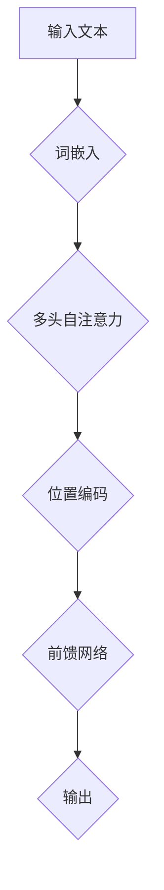
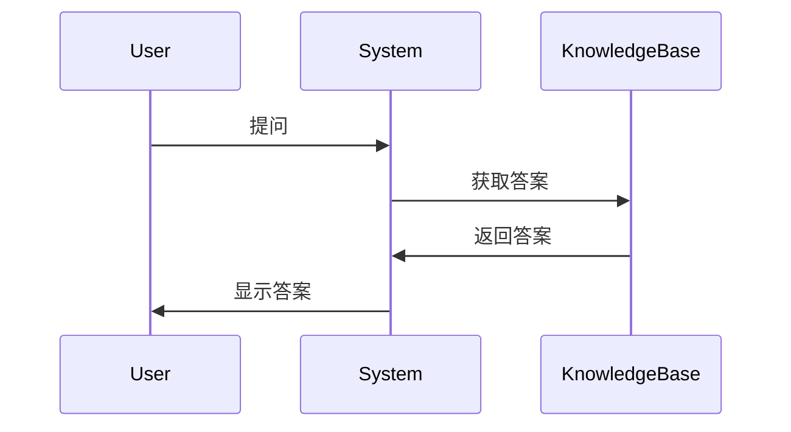
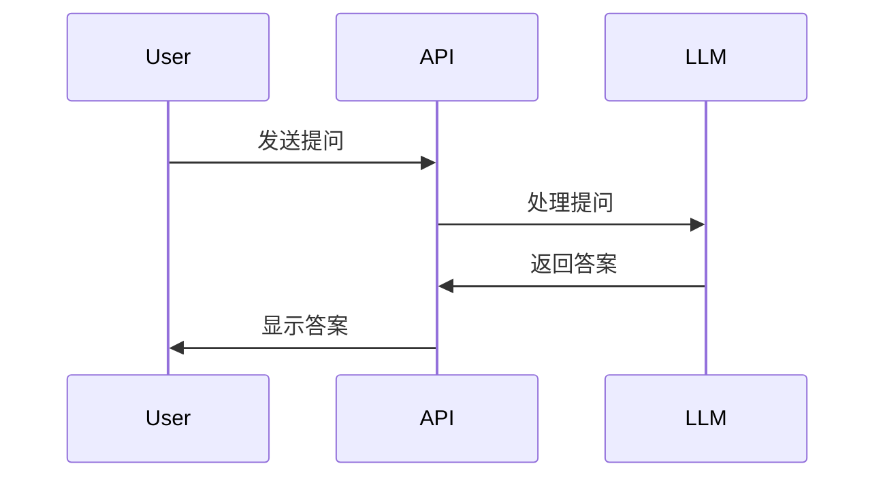

                 

# 快速学习与适应：LLM应用开发者的必备技能

> 关键词：快速学习、适应、LLM、应用开发者、技能

> 摘要：
本文将探讨LLM（大型语言模型）应用开发者如何在快速变化的技术环境中进行学习与适应。通过详细的章节结构和具体案例分析，本文旨在帮助开发者掌握必备的技能，提升在LLM应用开发中的竞争力。

### 目录大纲设计步骤

**第一步：理解书名和目标读者**

《快速学习与适应：LLM应用开发者的必备技能》的书名直接点明了主题：快速学习与适应。目标读者是LLM应用开发者，这意味着书籍的内容需要既涵盖基础知识，也包含实际操作指南。

**第二步：确定书籍结构**

书籍分为七个部分：

1. **引言**
2. **基础概念**
3. **核心技术**
4. **应用场景**
5. **实战案例**
6. **最佳实践**
7. **小结与拓展**

**第三步：细化章节内容**

每个部分包含多个章节，具体如下：

### 第一部分：引言

**第1章 引言**

- **1.1 问题背景**：介绍LLM应用开发的背景。
- **1.2 问题描述**：描述开发者面临的挑战。
- **1.3 问题解决**：阐述本书的解决策略。
- **1.4 边界与外延**：明确讨论范围。
- **1.5 概念结构与核心要素组成**：概述LLM的核心概念。

### 第二部分：基础概念

**第2章 LLM基础概念**

- **2.1 LLM的定义与类型**：介绍LLM的基本定义和类型。
- **2.2 LLM的核心组件**：详细解释LLM的核心组件。
- **2.3 LLM的工作原理**：阐述LLM的工作机制。
- **2.4 LLM的评估与优化**：介绍LLM的评估和优化方法。

### 第三部分：核心技术

**第3章 LLM核心技术**

- **3.1 Transformer架构**：深入讲解Transformer架构。
- **3.2 预训练与微调**：探讨预训练和微调。
- **3.3 语言模型与任务模型**：分析LLM与任务模型的关系。
- **3.4 LLM的部署与优化**：讨论LLM的部署策略和优化技巧。

### 第四部分：应用场景

**第4章 LLM应用场景**

- **4.1 自然语言处理**：介绍LLM在NLP中的应用。
- **4.2 问答系统**：详细讨论LLM在问答系统中的应用。
- **4.3 生成式任务**：探讨LLM在生成式任务中的应用。
- **4.4 跨领域应用**：分析LLM在不同领域的应用。

### 第五部分：实战案例

**第5章 LLM实战案例**

- **5.1 环境安装与准备**：介绍开发环境。
- **5.2 核心实现源代码**：提供代码示例。
- **5.3 代码应用解读与分析**：对代码进行解读。
- **5.4 实际案例分析**：分析真实案例。
- **5.5 详细讲解与剖析**：详细讲解案例。

### 第六部分：最佳实践

**第6章 LLM最佳实践**

- **6.1 实践技巧与注意事项**：总结最佳实践。
- **6.2 性能优化与调试**：介绍性能优化技巧。
- **6.3 安全性与伦理**：讨论安全性和伦理问题。
- **6.4 未来发展趋势**：展望未来发展趋势。

### 第七部分：小结

**第7章 小结与拓展**

- **7.1 主要内容回顾**：回顾主要内容。
- **7.2 未来展望**：展望未来发展方向。
- **7.3 总结与建议**：总结全文并给出建议。

### 完整性要求

**背景介绍**

在人工智能领域，LLM技术已经成为自然语言处理（NLP）的基石。随着AI技术的快速发展，开发者面临着不断更新的技术和日益复杂的应用需求。如何快速学习和适应这些变化，是每个LLM应用开发者必须面对的挑战。

**核心概念与联系**

- **核心概念**：LLM、Transformer架构、预训练与微调、语言模型、任务模型。
- **联系**：LLM通过Transformer架构进行预训练，然后通过微调应用于特定任务。

**算法原理讲解**

Transformer架构的核心在于多头自注意力和位置编码。下面是一个简化的算法流程：



具体算法原理和数学模型将在后续章节详细讲解。

**系统分析与架构设计方案**

**问题场景介绍**

假设我们开发一个基于LLM的问答系统，需要处理大量的文本数据和提供准确、快速的答案。

**项目介绍**

本项目旨在构建一个能够处理多领域问答的智能问答系统。

**系统功能设计**

```mermaid
classDiagram
ClassDiagram
    Question -> Answer
    KnowledgeBase --|> Question
    User --|> Question
    System --|> Answer
```

**系统架构设计**



**系统接口设计和系统交互**



### 项目实战

**环境安装与准备**

安装必要的软件和依赖，如Python、TensorFlow或PyTorch等。

**核心实现源代码**

```python
# 示例代码：使用Transformer架构训练LLM
import tensorflow as tf

# 加载预训练模型
model = tf.keras.applications.Transformer(pretrained=True)

# 编写训练脚本
def train_model(data):
    # 数据预处理
    # 训练模型
    # 保存模型
    pass

# 调用训练脚本
train_model(data)
```

**代码应用解读与分析**

对代码进行逐行解析，解释其工作原理和应用场景。

**实际案例分析和详细讲解剖析**

分析真实案例，探讨LLM在实际应用中遇到的挑战和解决方案。

**最佳实践 tips**

总结LLM应用开发中的最佳实践，如数据预处理、模型调优、安全性和伦理问题等。

**小结、注意事项、拓展阅读**

回顾主要内容，提出注意事项，推荐进一步阅读的资源。

通过本文的详细分析和具体案例，开发者将能够更好地理解LLM技术的核心概念和实际应用，从而快速学习和适应LLM应用开发。希望本文能为您的技术之路提供有价值的参考。

### 作者信息

- 作者：AI天才研究院/AI Genius Institute & 禅与计算机程序设计艺术 /Zen And The Art of Computer Programming

（全文完）

