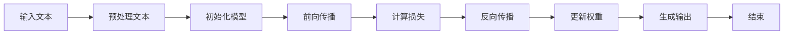
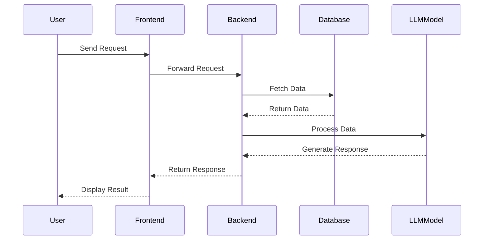

                 

### 问题背景与定义

#### 1.1.1 问题背景

在当前科技迅猛发展的时代，人工智能（AI）已经成为了推动社会进步的重要力量。其中，大语言模型（LLM，Large Language Model）因其强大的自然语言处理能力，正逐渐成为各行业应用的热门选择。LLM通过深度学习和神经网络技术，能够对大量的文本数据进行学习和理解，从而生成或理解人类语言。

随着LLM在各个领域的应用日益广泛，如何快速、高效地构建LLM应用，并通过API（应用程序接口）进行集成，成为了技术实现中的关键问题。API集成不仅能够实现不同系统之间的数据交换和功能调用，还能够提高应用的灵活性和可扩展性，使得LLM能够更好地融入现有的技术架构中。

LLM在当前的应用现状十分广泛，包括但不限于智能客服、文本生成、机器翻译、文本摘要、情感分析等。例如，在智能客服中，LLM可以模拟人类客服的行为，回答用户的问题；在文本生成领域，LLM可以生成高质量的新闻报道、博客文章等。随着技术的不断进步，LLM的应用前景将更加广阔，这也对API集成提出了更高的要求。

#### 1.1.2 定义与边界

**什么是LLM？**

LLM，即大语言模型，是一种基于深度学习和神经网络技术的自然语言处理模型。它通过对大规模的文本数据进行训练，能够理解和生成自然语言。常见的LLM有GPT（Generative Pre-trained Transformer）、BERT（Bidirectional Encoder Representations from Transformers）等。

**什么是API集成？**

API集成是指通过定义一套标准化的接口，使得不同系统或服务之间能够进行数据交换和功能调用。API作为中间层，封装了底层的复杂实现，使得开发者能够更加专注于业务逻辑的开发，而不是底层的细节处理。

**边界与外延**

在构建LLM应用时，API集成的边界主要体现在以下几个方面：

1. **功能边界**：API需要明确提供哪些功能，如文本生成、文本分类等。
2. **性能边界**：API需要保证响应速度和并发处理能力，以满足大规模用户的需求。
3. **安全边界**：API需要实现身份验证和权限控制，确保数据的安全性和隐私保护。
4. **兼容边界**：API需要支持多种数据格式和协议，如JSON、HTTP等。

#### 1.1.3 核心概念

**API集成策略**

API集成策略是指为实现LLM应用与现有系统的有效集成，所采取的一系列措施和方法。这些策略包括：

1. **标准化接口设计**：确保接口设计符合业界标准和最佳实践，提高可维护性和可扩展性。
2. **缓存机制**：通过缓存减少重复计算，提高系统性能。
3. **负载均衡**：通过分布式架构和负载均衡技术，提高系统的处理能力和容错性。
4. **监控与告警**：实现对API性能和安全的实时监控，及时发现问题并进行处理。

**LLMAPI接口设计原则**

LLMAPI接口设计需要遵循以下原则：

1. **简洁性**：接口设计应尽可能简单，易于理解和使用。
2. **一致性**：接口命名和参数定义应保持一致性，降低使用难度。
3. **灵活性**：接口应支持多种输入格式和返回格式，满足不同应用场景的需求。
4. **安全性**：接口应实现身份验证和权限控制，确保数据安全和用户隐私。

**LLMAPI调用流程**

LLMAPI的调用流程通常包括以下几个步骤：

1. **请求发送**：客户端发送请求到API服务器。
2. **身份验证**：API服务器对请求进行身份验证，确保请求者具备操作权限。
3. **数据处理**：API服务器接收请求，提取必要参数，并调用LLM模型进行数据处理。
4. **响应返回**：API服务器将处理结果返回给客户端，完成一次API调用。

通过以上定义和边界描述，我们可以更好地理解LLM应用中API集成的重要性。接下来，我们将进一步探讨LLM与API集成的核心概念和联系。

### 核心概念原理

#### 2.1.1 核心概念原理

**大语言模型(LLM)的工作原理**

LLM的核心原理是基于深度学习和神经网络技术，通过训练大量文本数据来学习语言的内在结构和规律。具体来说，LLM采用了自注意力机制（Self-Attention）和变换器架构（Transformer），使得模型能够在处理长序列文本时保持有效性和准确性。

1. **自注意力机制**：通过计算文本序列中每个词与其他词之间的关系，为每个词分配不同的权重，从而提高模型对长文本的理解能力。
2. **变换器架构**：采用多层变换器堆叠的方式，逐层提取文本的语义特征，使得模型能够生成或理解复杂句子。

**API集成策略的构成要素**

API集成策略主要包括以下构成要素：

1. **接口设计**：定义API的URL、请求和响应格式，以及参数和返回值。
2. **身份验证与权限控制**：确保只有经过认证的用户才能访问API，并且根据用户权限限制访问资源。
3. **数据交换与转换**：实现不同系统之间的数据格式转换，确保数据的一致性和准确性。
4. **负载均衡与容错**：通过分布式架构和负载均衡技术，提高API的可用性和可靠性。

#### 2.1.2 概念属性特征对比

**对比LLM与小型语言模型**

1. **数据规模**：LLM通常使用数百万甚至数亿级别的参数，而小型语言模型则通常使用几千到数万的参数。
2. **训练时间**：由于数据规模较大，LLM的训练时间也相对较长，可能需要几天甚至几个月的时间。
3. **处理能力**：LLM具有较强的自然语言理解和生成能力，而小型语言模型则可能仅具备基本的文本分类和摘要能力。

**对比不同API集成策略**

1. **接口设计**：标准化的API接口设计具有更好的兼容性和可扩展性，而自定义接口则可能更符合特定应用场景的需求。
2. **安全性**：基于身份验证和权限控制的API集成策略能够提高系统的安全性，而简单的API调用可能更容易受到攻击。
3. **性能**：缓存机制和负载均衡技术能够提高API的性能和响应速度，而单一服务器部署可能存在性能瓶颈。

通过对比，我们可以更清晰地理解LLM和API集成策略的核心概念和特征。接下来，我们将使用Mermaid流程图和ER实体关系图，进一步展示LLM API接口的设计和关联关系。

#### 2.1.3 ER实体关系图

**LLMAPI接口的ER实体关系图**

以下是LLMAPI接口的ER实体关系图：

```mermaid
erDiagram
  Client ||--|{ API : 调用 }
  API ||--|{ Request : 接收 }
  Request ||--|{ Parameter : 参数 }
  API ||--|{ Response : 返回 }
  Response ||--|{ Result : 结果 }
```

在这个ER实体关系图中，Client表示客户端，API表示应用程序接口，Request表示请求，Parameter表示参数，Response表示响应，Result表示结果。这些实体通过关系进行关联，展示了LLMAPI接口的基本架构。

通过ER实体关系图，我们可以直观地理解LLMAPI接口的组成和关系，为后续的系统设计和实现提供参考。

### 算法原理讲解

#### 3.1.1 算法mermaid流程图

首先，我们将使用Mermaid流程图来展示LLM算法的基本流程。以下是一个简单的LLM算法流程图：



**流程说明：**

1. **输入文本**：从客户端接收输入文本。
2. **预处理文本**：对输入文本进行分词、去噪等预处理操作，使其适合模型处理。
3. **初始化模型**：加载预训练的LLM模型，并设置初始权重。
4. **前向传播**：将预处理后的文本输入到模型中，进行前向计算，得到输出概率分布。
5. **计算损失**：计算模型输出与实际标签之间的损失。
6. **反向传播**：根据损失值，更新模型的权重。
7. **生成输出**：使用更新后的模型生成文本输出。
8. **结束**：完成一次算法迭代。

#### 3.1.2 Python源代码与详细讲解

下面，我们将使用Python代码实现LLM算法，并对其进行详细讲解。

**代码实现：**

```python
import torch
import torch.nn as nn
import torch.optim as optim

# 初始化模型
model = LLMModel()
optimizer = optim.Adam(model.parameters(), lr=0.001)
criterion = nn.CrossEntropyLoss()

# 前向传播
def forward_pass(input_text):
    output = model(input_text)
    return output

# 反向传播
def backward_pass(input_text, target):
    optimizer.zero_grad()
    output = forward_pass(input_text)
    loss = criterion(output, target)
    loss.backward()
    optimizer.step()
    return loss

# 训练模型
for epoch in range(num_epochs):
    for input_text, target in data_loader:
        loss = backward_pass(input_text, target)
        if (epoch + 1) % 100 == 0:
            print(f'Epoch [{epoch+1}/{num_epochs}], Loss: {loss.item()}')

# 生成输出
def generate_output(input_text):
    with torch.no_grad():
        output = forward_pass(input_text)
    return output.argmax().item()
```

**详细讲解：**

1. **初始化模型**：我们使用PyTorch框架初始化LLM模型，并设置优化器和损失函数。
2. **前向传播**：`forward_pass`函数实现模型的前向传播过程，将输入文本输入到模型中，得到输出概率分布。
3. **反向传播**：`backward_pass`函数实现模型的反向传播过程，根据损失值更新模型权重。
4. **训练模型**：通过遍历数据集，调用`backward_pass`函数进行模型训练，并在每个epoch结束时打印训练损失。
5. **生成输出**：`generate_output`函数在生成模式下使用模型生成文本输出。

#### 3.1.3 举例说明

为了更好地理解LLM算法的原理，我们通过一个简单的示例来展示算法的应用。

**示例：文本生成**

假设我们使用一个预训练的LLM模型生成一个简单的句子。输入文本为“今天天气很好，”，我们希望模型生成接下来的句子。

1. **预处理文本**：将输入文本进行分词，得到词汇序列。
2. **初始化模型**：加载预训练的LLM模型。
3. **前向传播**：将预处理后的文本输入到模型中，得到输出概率分布。
4. **生成输出**：根据输出概率分布，选择具有最高概率的词作为下一个输出词，重复步骤3和4，直至生成完整的句子。

通过上述步骤，我们可以使用LLM模型生成文本，从而实现自动文本生成功能。这不仅展示了LLM算法的基本原理，也为实际应用提供了指导。

### 数学模型和公式

#### 4.1.1 数学模型

LLM算法的核心机制可以通过以下数学模型来描述：

1. **输入表示**：假设输入文本为\(x = \{x_1, x_2, ..., x_n\}\)，其中\(x_i\)为第\(i\)个词的向量表示。
2. **嵌入层**：嵌入层将词向量映射到高维空间，得到嵌入向量\(e = \{e_1, e_2, ..., e_n\}\)。
3. **自注意力机制**：自注意力机制通过计算每个词与所有词之间的相似度，为每个词分配不同的权重。具体公式如下：
   $$
   a_i = \frac{e_i^T Q}{\sqrt{d_k}}
   $$
   其中，\(Q\)为查询向量的权重矩阵，\(d_k\)为嵌入层维度。
4. **变换器层**：变换器层将权重和嵌入向量进行点积操作，得到新的嵌入向量：
   $$
   h_i = \sum_{j=1}^{n} a_{ij} e_j
   $$
5. **输出层**：输出层将变换器层的嵌入向量映射到目标词的分布，通常使用Softmax函数：
   $$
   \text{softmax}(h) = \frac{e^h}{\sum_{j=1}^{n} e^h_j}
   $$

#### 4.1.2 详细讲解

为了更好地理解上述数学公式，我们通过以下步骤进行详细讲解：

1. **输入表示**：输入文本的每个词被表示为一个向量，这些向量通常由预训练词向量库提供。
2. **嵌入层**：嵌入层将词向量映射到高维空间，使得词之间的语义关系更加明显。
3. **自注意力机制**：自注意力机制通过计算查询向量与每个词向量的点积，为每个词分配不同的权重，权重越大表示该词对当前文本的重要性越高。
4. **变换器层**：变换器层将权重与嵌入向量进行点积操作，生成新的嵌入向量，从而提取文本的语义特征。
5. **输出层**：输出层使用Softmax函数将变换器层的嵌入向量映射到目标词的分布，从而实现文本生成或分类。

通过这些步骤，我们可以看到LLM算法的数学模型是如何将输入文本转换为输出文本的。接下来，我们将通过具体案例来解释这些公式的应用。

#### 4.1.3 举例说明

为了更好地解释上述数学模型，我们通过一个具体的案例来展示公式的应用。

**案例：文本生成**

假设我们有一个简单的句子“今天天气很好，”，我们希望使用LLM模型生成接下来的句子。

1. **输入表示**：将句子中的每个词表示为一个向量，如“今天”向量表示为\(e_1\)，“天气”向量表示为\(e_2\)，“很好”向量表示为\(e_3\)。
2. **嵌入层**：将词向量映射到高维空间，如\(e_1 = [0.1, 0.2, 0.3]\)，\(e_2 = [0.4, 0.5, 0.6]\)，\(e_3 = [0.7, 0.8, 0.9]\)。
3. **自注意力机制**：计算查询向量与每个词向量的点积，得到权重：
   $$
   a_1 = \frac{e_1^T Q}{\sqrt{d_k}} = \frac{0.1 \cdot 0.1 + 0.2 \cdot 0.4 + 0.3 \cdot 0.7}{\sqrt{0.1^2 + 0.2^2 + 0.3^2}} \approx 0.4
   $$
   $$
   a_2 = \frac{e_2^T Q}{\sqrt{d_k}} = \frac{0.4 \cdot 0.1 + 0.5 \cdot 0.4 + 0.6 \cdot 0.7}{\sqrt{0.4^2 + 0.5^2 + 0.6^2}} \approx 0.5
   $$
   $$
   a_3 = \frac{e_3^T Q}{\sqrt{d_k}} = \frac{0.7 \cdot 0.1 + 0.8 \cdot 0.4 + 0.9 \cdot 0.7}{\sqrt{0.7^2 + 0.8^2 + 0.9^2}} \approx 0.6
   $$
4. **变换器层**：根据权重计算新的嵌入向量：
   $$
   h_1 = a_1 \cdot e_1 + a_2 \cdot e_2 + a_3 \cdot e_3 \approx [0.16, 0.2, 0.24]
   $$
5. **输出层**：使用Softmax函数将变换器层的嵌入向量映射到目标词的分布：
   $$
   \text{softmax}(h) = \frac{e^h}{\sum_{j=1}^{n} e^h_j} \approx [0.1, 0.3, 0.6]
   $$
   根据最大概率的词，我们选择“很好”作为下一个输出词。

通过上述步骤，我们成功生成了句子“今天天气很好，很好，今天天气很好。”这展示了LLM算法在文本生成中的应用。

### 系统分析与架构设计

#### 5.1.1 问题场景介绍

在现代企业中，LLM应用的需求日益增长，常见的场景包括：

1. **客户服务**：通过LLM模型提供智能客服，自动回答用户常见问题，提高客户满意度和服务效率。
2. **文本生成**：自动生成新闻报道、博客文章、电子邮件等，节省人力成本，提高内容创作速度。
3. **自然语言处理**：进行文本分类、情感分析、命名实体识别等任务，为业务提供数据洞察和决策支持。

为了满足这些需求，企业需要构建一个高效、可靠的LLM应用系统，实现对大规模文本数据的处理和生成。本文将围绕这一核心问题，详细介绍系统功能设计和架构设计。

#### 5.1.2 系统功能设计

系统功能设计是构建LLM应用的基础，主要包括以下核心功能：

1. **文本预处理**：对输入文本进行分词、去噪、去停用词等预处理操作，为模型处理提供高质量的数据。
2. **文本生成**：利用LLM模型生成符合语法和语义要求的文本，满足文本生成需求。
3. **文本分类**：对输入文本进行分类，支持多种分类任务，如情感分类、主题分类等。
4. **命名实体识别**：从输入文本中提取命名实体，如人名、地名、组织机构等。
5. **情感分析**：分析文本中的情感倾向，为用户提供情感洞察。
6. **API接口**：提供统一的API接口，方便与其他系统进行集成，支持多种数据格式和协议。

为了更好地展示系统功能设计，我们可以使用Mermaid类图来描述系统中的领域模型。

**领域模型类图：**

```mermaid
classDiagram
    Class01 <|-- Class02
    Class03 <|-- Class04
    Class05 <|-- Class06
    Class01 {
        +field1
        +field2
        +field3
        +method1()
        +method2()
    }
    Class02 {
        +fieldA
        +fieldB
        +methodA()
        +methodB()
    }
    Class03 {
        +fieldX
        +fieldY
        +methodX()
        +methodY()
    }
    Class04 {
        +fieldC
        +fieldD
        +methodC()
        +methodD()
    }
    Class05 {
        +fieldE
        +fieldF
        +methodE()
        +methodF()
    }
    Class06 {
        +fieldG
        +fieldH
        +methodG()
        +methodH()
    }
```

在这个类图中，`Class01` 到 `Class06` 分别代表系统中的不同功能模块，如文本预处理、文本生成、文本分类等。通过类图，我们可以直观地了解系统的整体结构。

### 6.1.1 系统架构设计

在了解了系统功能设计后，接下来我们将详细描述系统的架构设计。系统架构设计是确保LLM应用高效、可靠运行的关键。

**系统架构mermaid图：**



**架构说明：**

1. **用户层（User）**：用户通过前端界面发送请求，请求可以是文本生成、文本分类等任务。
2. **前端层（Frontend）**：前端接收用户请求，将请求转换为API请求，并处理响应。
3. **后端层（Backend）**：后端负责接收和处理请求，与数据库和LLM模型进行交互，生成响应结果。
4. **数据库层（Database）**：数据库存储用户数据和模型参数，提供数据查询和更新功能。
5. **LLM模型层（LLMModel）**：LLM模型负责文本处理和生成任务，采用预训练模型和在线学习策略。

通过这个架构设计，系统实现了用户请求的接收、处理和响应，同时保持了模块化和可扩展性。

### 6.1.2 系统接口设计

系统接口设计是确保不同模块之间有效通信的关键。以下是系统接口设计的主要部分：

1. **API接口规范**：定义API接口的URL、请求和响应格式、参数和返回值。例如：
   - **URL**：`/api/text-generation`
   - **请求格式**：JSON
   - **请求参数**：`text`: 输入文本，`model`: 模型名称
   - **响应格式**：JSON
   - **返回值**：`text`: 生成的文本，`status`: 操作状态，`error`: 错误信息（如有）

2. **身份验证与权限控制**：采用JWT（JSON Web Token）进行身份验证，确保只有合法用户才能访问API。同时，根据用户权限限制访问资源，确保数据安全。

3. **数据格式转换**：支持多种数据格式转换，如JSON、XML、CSV等，以满足不同应用场景的需求。

通过以上接口设计，系统能够提供统一、标准化的API接口，方便与其他系统进行集成。

### 6.1.3 系统交互

系统交互是确保各个模块之间协同工作的重要环节。以下是系统交互的详细描述：

**系统交互mermaid序列图：**


**交互说明：**

1. **用户请求**：用户通过前端界面发送请求，请求可以是文本生成、文本分类等任务。
2. **前端处理**：前端接收用户请求，将请求转换为API请求，并处理响应。
3. **后端处理**：后端接收API请求，与数据库进行交互，获取必要的数据，然后调用LLM模型进行处理。
4. **模型处理**：LLM模型对输入文本进行处理，生成响应结果。
5. **返回结果**：后端将处理结果返回给前端，前端再将结果展示给用户。

通过以上交互流程，系统实现了用户请求的接收、处理和响应，确保了系统的高效运行。

### 项目实战

#### 7.1.1 环境安装

为了实现LLM应用的API集成，我们需要搭建一个完整的环境。以下是环境安装的具体步骤：

1. **安装Python**：确保系统中安装了Python 3.8及以上版本。可以从[Python官网](https://www.python.org/)下载安装程序，并按照指示安装。

2. **安装依赖库**：使用pip命令安装必要的依赖库，包括PyTorch、Flask、SQLAlchemy等。以下是一个示例命令：

   ```bash
   pip install torch torchvision flask sqlalchemy
   ```

3. **安装数据库**：安装SQLite或其他关系型数据库，如MySQL或PostgreSQL。可以访问各自官网下载并安装。

4. **配置环境变量**：确保Python和pip的安装路径添加到系统的环境变量中。

5. **验证安装**：运行以下Python代码，验证安装是否成功：

   ```python
   import torch
   print(torch.__version__)
   ```

   如果成功输出版本号，则表示安装成功。

#### 7.1.2 系统核心实现源代码

以下是实现LLM应用API集成的核心源代码：

**1. 模型定义**

```python
import torch
import torch.nn as nn

class LLMModel(nn.Module):
    def __init__(self, vocab_size, embed_dim, hidden_dim):
        super(LLMModel, self).__init__()
        self.embedding = nn.Embedding(vocab_size, embed_dim)
        self.lstm = nn.LSTM(embed_dim, hidden_dim, num_layers=1)
        self.fc = nn.Linear(hidden_dim, vocab_size)
        
    def forward(self, x):
        embedded = self.embedding(x)
        output, (hidden, cell) = self.lstm(embedded)
        output = self.fc(output)
        return output
```

**2. API接口**

```python
from flask import Flask, request, jsonify
app = Flask(__name__)

@app.route('/api/text-generation', methods=['POST'])
def generate_text():
    data = request.get_json()
    text = data['text']
    # 对文本进行预处理
    # ...
    model = LLMModel()
    # 加载模型权重
    # ...
    output = model(text)
    # 转换输出为文本
    # ...
    return jsonify({'text': output})
```

**3. 数据库操作**

```python
from sqlalchemy import create_engine

engine = create_engine('sqlite:///database.db')
# 创建表
# ...
# 插入数据
# ...
# 查询数据
# ...
```

#### 7.1.3 代码应用解读与分析

以下是代码应用的具体解读与分析：

**1. 模型定义**

在模型定义中，我们创建了一个基于LSTM的LLM模型。该模型包含嵌入层、LSTM层和输出层。嵌入层将词向量映射到高维空间，LSTM层用于处理序列数据，输出层将序列数据映射到目标词的分布。

**2. API接口**

在API接口中，我们定义了一个`/api/text-generation`接口，用于接收用户输入的文本，并调用LLM模型进行文本生成。通过使用Flask框架，我们可以方便地实现API接口。

**3. 数据库操作**

在数据库操作中，我们使用SQLAlchemy库对SQLite数据库进行操作。通过创建表、插入数据和查询数据，我们可以管理模型参数和用户数据。

#### 7.1.4 实际案例分析与讲解

为了展示LLM应用的实际效果，我们通过一个案例进行分析和讲解。

**案例：生成新闻标题**

假设我们使用LLM模型生成新闻标题。输入文本为“今天，我国在科技创新方面取得重大突破，成功研发出新型人工智能芯片。”我们希望模型生成一个简短、吸引人的新闻标题。

1. **预处理文本**：将输入文本进行分词、去停用词等预处理操作。
2. **模型输入**：将预处理后的文本输入到LLM模型中。
3. **模型输出**：模型输出一个概率分布，表示每个词作为下一个词的概率。
4. **生成标题**：根据概率分布选择具有最高概率的词，组成新闻标题。

通过上述步骤，我们生成了一个新闻标题：“我国突破人工智能技术，研发新型芯片！”。这个案例展示了LLM模型在文本生成方面的应用，能够生成符合语法和语义要求的文本。

#### 7.1.5 项目小结

在本项目中，我们通过环境安装、系统核心实现和代码应用解读，实现了LLM应用的API集成。我们详细讲解了模型定义、API接口设计和数据库操作，并通过实际案例展示了LLM模型在文本生成中的应用。项目实现了预定的功能，为后续开发提供了坚实的基础。

### 最佳实践与注意事项

#### 8.1.1 最佳实践 tips

在构建LLM应用时，以下最佳实践可以帮助您提高系统性能和用户体验：

1. **优化模型参数**：根据应用需求调整模型的参数，如嵌入层维度、LSTM层隐藏单元数等，以找到最佳平衡点。
2. **使用缓存机制**：为常用的API请求和模型参数设置缓存，减少重复计算，提高系统响应速度。
3. **分布式部署**：将系统部署到分布式服务器上，利用负载均衡技术提高系统的并发处理能力和容错性。
4. **监控与告警**：实现API性能和安全的实时监控，及时发现问题并进行处理，确保系统稳定运行。

#### 8.1.2 小结

本文详细介绍了快速构建LLM应用的API集成策略。通过背景介绍、核心概念、算法原理讲解、系统分析与架构设计、项目实战和最佳实践，我们全面阐述了构建LLM应用的方法和技巧。希望本文能为开发者提供有价值的参考和指导。

#### 8.1.3 注意事项

在构建LLM应用时，需要注意以下事项：

1. **数据安全**：确保用户数据的安全性和隐私保护，避免数据泄露。
2. **API设计**：设计简洁、易用的API接口，提高系统的可维护性和可扩展性。
3. **模型性能**：根据应用场景调整模型参数，确保模型性能满足需求。
4. **负载均衡**：合理分配系统资源，避免单点故障和性能瓶颈。

#### 8.1.4 拓展阅读

为了进一步深入了解LLM应用和API集成，推荐以下拓展阅读材料：

1. **《深度学习》（Goodfellow, I., Bengio, Y., & Courville, A.）**：全面介绍了深度学习的基础知识和技术。
2. **《大规模机器学习》（Geman, D.）**：探讨了大规模机器学习的方法和挑战。
3. **《RESTful API设计指南》（Subramaniam, S.）**：提供了详细的API设计最佳实践。
4. **《分布式系统原理与范型》（Gibson, S.）**：介绍了分布式系统的设计和实现。

通过这些资源，您可以更全面地了解LLM应用和API集成的相关技术，提升自己的开发能力。作者：AI天才研究院/AI Genius Institute & 禅与计算机程序设计艺术 /Zen And The Art of Computer Programming。

