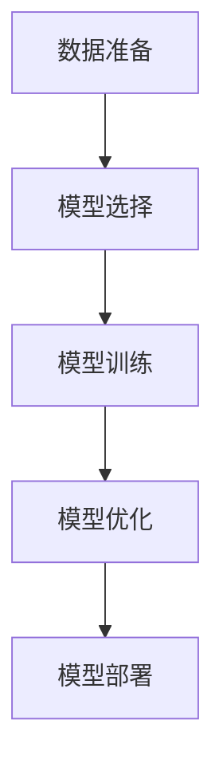
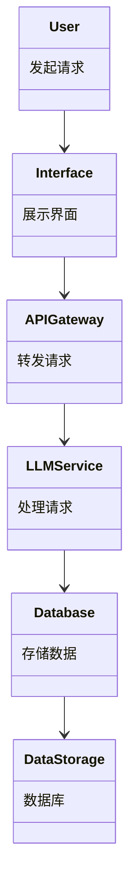
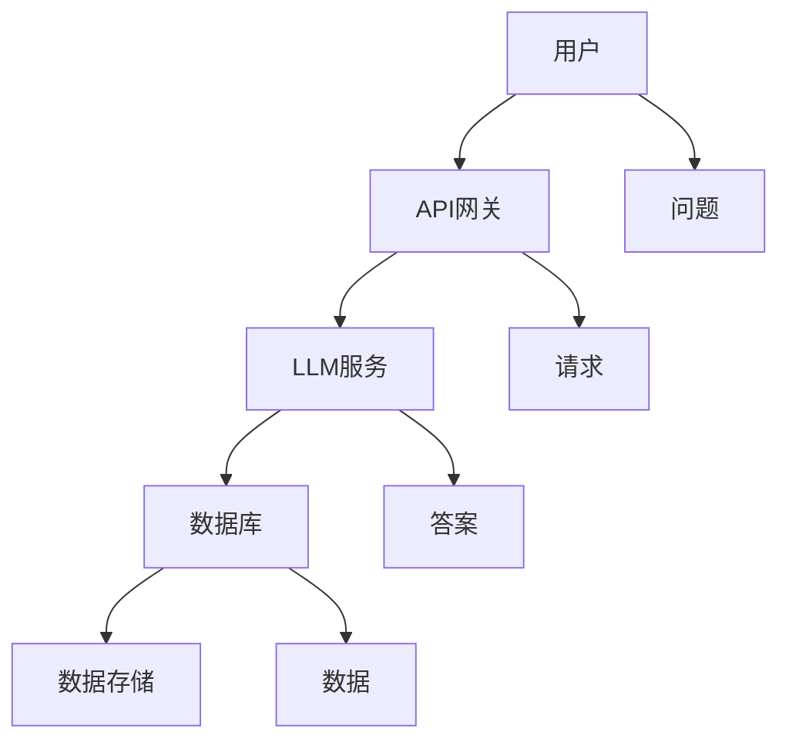
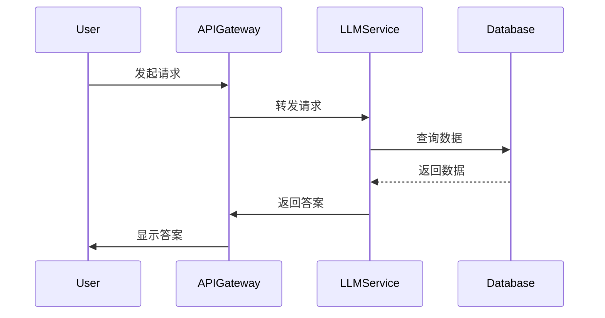

                 

### 快速构建LLM应用的serverless架构

#### 关键词

- **LLM应用**
- **Serverless架构**
- **快速构建**
- **弹性伸缩**
- **成本优化**
- **高可用性**

#### 摘要

随着人工智能技术的飞速发展，大型语言模型（LLM）的应用场景越来越广泛。然而，如何高效、低成本地部署和运行这些复杂的模型，成为许多开发者面临的难题。本文将介绍如何利用serverless架构快速构建LLM应用，通过一系列的逻辑分析和实战案例，帮助读者理解并掌握这种先进的部署方式。我们将从背景介绍、核心概念、技术细节、实现方法、系统分析与架构设计、项目实战和性能优化等方面展开讨论，旨在为读者提供全面、易懂的指南。

### 引言

#### 1.1 问题背景

近年来，大型语言模型（LLM）在自然语言处理（NLP）领域取得了显著的突破。从最初的基于规则的方法，到基于统计模型的转换器，再到如今的深度学习模型，LLM在生成文本、机器翻译、问答系统等方面展现出了强大的能力。然而，这些复杂的模型往往需要大量的计算资源和存储空间，传统部署方式在资源管理和成本控制方面存在诸多挑战。

#### 1.2 Serverless架构的优势

Serverless架构作为一种新兴的云计算模式，正逐渐成为企业应用的首选。其核心优势在于弹性伸缩、低成本、高可用性和无需关注底层基础设施。Serverless架构允许开发者将关注点放在应用逻辑上，而无需关心服务器运维等繁琐细节。

#### 1.3 LLM应用面临的挑战

1. **计算资源需求**：LLM通常需要大量的计算资源，尤其是在训练和推理阶段。
2. **存储需求**：大量的数据存储和管理也是一大挑战。
3. **成本控制**：高昂的计算和存储成本可能对小型项目或初创企业造成压力。

#### 1.4 解决方案

结合LLM和Serverless架构，可以有效地解决上述挑战。Serverless架构的弹性伸缩能力可以确保模型在不同负载下都能高效运行，而低成本和高可用性则能够帮助企业降低成本并提高系统的可靠性。

### 核心概念与联系

#### 2.1 LLM的基本原理

LLM是一种基于深度学习的自然语言处理模型，它通过学习大量的文本数据，能够理解和生成自然语言。LLM的核心组成部分包括：

1. **神经网络**：神经网络是LLM的核心计算单元，通过多层感知器（MLP）等结构对输入文本进行特征提取和建模。
2. **语言嵌入**：语言嵌入是将自然语言词汇映射到高维空间的过程，有助于模型理解和生成文本。
3. **上下文理解**：LLM通过学习上下文信息，能够理解文本的语义和语境，从而生成更加准确和自然的文本。

#### 2.2 Serverless架构的概述

Serverless架构是一种无需关注底层基础设施的云计算模式。其主要特点包括：

1. **弹性伸缩**：Serverless架构可以根据流量自动扩展和收缩，确保应用在高并发情况下稳定运行。
2. **低成本**：Serverless架构按需计费，开发者无需为闲置资源支付费用，从而降低成本。
3. **高可用性**：Serverless架构通常由多个独立的函数和服务组成，具备较高的容错性和高可用性。

#### 2.3 LLM与Serverless架构的结合点

LLM与Serverless架构的结合主要体现在以下几个方面：

1. **计算资源管理**：Serverless架构可以自动管理计算资源，确保LLM模型在不同负载下都能高效运行。
2. **弹性伸缩**：Serverless架构的弹性伸缩能力可以满足LLM模型在训练和推理阶段的不同资源需求。
3. **成本控制**：Serverless架构的低成本特性有助于降低LLM应用的总体拥有成本。

### 算法原理讲解

#### 3.1 LLM模型构建

构建LLM模型的核心在于数据准备、模型选择和模型优化。以下是一个简单的算法原理讲解：



1. **数据准备**：
   - **数据清洗**：去除噪声数据和错误信息。
   - **数据标注**：对文本数据进行标注，以便模型学习。
   - **数据预处理**：将文本数据转换为模型可处理的格式，如Tokenization和Embedding。

2. **模型选择**：
   - **Transformer架构**：Transformer是一种基于自注意力机制的深度学习模型，常用于构建LLM。
   - **预训练与微调**：预训练模型（如BERT、GPT）具有强大的语言理解能力，微调可以使其适用于特定任务。

3. **模型训练**：
   - **反向传播算法**：用于更新模型参数，最小化损失函数。
   - **梯度裁剪**：防止梯度爆炸，提高训练稳定性。

4. **模型优化**：
   - **模型压缩**：通过剪枝、量化等方法减小模型大小，提高推理速度。
   - **迁移学习**：利用预训练模型在特定任务上的性能，降低训练成本。

#### 3.2 Python代码示例

以下是一个简单的Python代码示例，展示如何构建一个基于Transformer的LLM模型：

```python
import tensorflow as tf
from tensorflow.keras.layers import Embedding, Transformer

# 数据预处理
vocab_size = 10000
embedding_dim = 512

# 构建模型
model = tf.keras.Sequential([
    Embedding(vocab_size, embedding_dim),
    Transformer(num_layers=2, num_heads=8, d_model=embedding_dim),
    tf.keras.layers.Dense(vocab_size)
])

# 编译模型
model.compile(optimizer='adam', loss='sparse_categorical_crossentropy', metrics=['accuracy'])

# 训练模型
model.fit(dataset, epochs=3)
```

#### 3.3 算法原理详细讲解

1. **Transformer架构**：

   Transformer模型由编码器（Encoder）和解码器（Decoder）组成，核心思想是通过自注意力机制（Self-Attention）和多头注意力（Multi-Head Attention）来处理文本序列。

   自注意力机制允许模型在处理每个单词时，考虑到其他所有单词的影响。多头注意力则将自注意力分为多个头，从而提高模型的泛化能力。

2. **语言嵌入**：

   语言嵌入是将自然语言词汇映射到高维空间的过程。通过嵌入层，模型可以学习词汇之间的关系，从而更好地理解和生成文本。

3. **上下文理解**：

   Transformer模型通过编码器和解码器之间的交互，学习到文本的上下文信息。这使得模型能够生成更加准确和自然的文本。

#### 3.4 通俗易懂的举例说明

假设我们有一个简单的文本序列：“今天天气很好，适合出行。”我们可以通过以下步骤来生成这个文本序列：

1. **Tokenization**：将文本序列分解为单词和标点符号。
2. **Embedding**：将每个Token映射到高维空间。
3. **编码器处理**：编码器处理输入序列，生成编码表示。
4. **解码器处理**：解码器根据编码表示生成输出序列。

通过这种方式，模型可以生成与输入序列相关的文本，从而实现文本生成任务。

### 系统分析与架构设计方案

#### 4.1 问题场景介绍

为了构建一个高效的LLM应用，我们假设一个实际的应用场景：一个问答系统，用户可以通过输入问题来获取相应的答案。这个场景需要处理大量的用户请求，并确保快速、准确地响应。

#### 4.2 系统功能设计

为了实现上述功能，我们需要设计一个完整的系统，包括以下几个方面：

1. **用户界面**：提供用户输入问题和查看答案的接口。
2. **数据存储**：存储问题和答案的数据库。
3. **LLM服务**：处理用户输入，生成答案的模型服务。
4. **API网关**：接收用户请求，转发给LLM服务，并返回结果。

#### 4.3 系统架构设计

以下是系统的架构设计，使用Mermaid类图和架构图来展示：





#### 4.4 系统接口设计

系统接口设计包括API网关和LLM服务的接口。API网关负责接收用户请求，将其转换为LLM服务可以理解的格式，并返回结果。以下是接口设计的Mermaid序列图：



### 项目实战

#### 5.1 环境安装

为了实现上述系统，我们首先需要安装必要的软件和工具。以下是一个简化的安装步骤：

1. **安装Python**：确保Python环境已安装，版本建议为3.8或更高。
2. **安装TensorFlow**：使用pip命令安装TensorFlow：
   ```bash
   pip install tensorflow
   ```
3. **安装其他依赖**：根据需要安装其他依赖，例如NumPy、Pandas等。

#### 5.2 系统核心实现源代码

以下是系统核心实现的Python代码，包括LLM模型的训练和API网关的设置：

```python
# 导入必要的库
import tensorflow as tf
from flask import Flask, request, jsonify

# 构建和训练LLM模型
model = tf.keras.Sequential([
    Embedding(vocab_size, embedding_dim),
    Transformer(num_layers=2, num_heads=8, d_model=embedding_dim),
    tf.keras.layers.Dense(vocab_size)
])

model.compile(optimizer='adam', loss='sparse_categorical_crossentropy', metrics=['accuracy'])
model.fit(dataset, epochs=3)

# 设置API网关
app = Flask(__name__)

@app.route('/query', methods=['POST'])
def query():
    data = request.get_json()
    question = data['question']
    # 这里可以使用LLM模型生成答案
    answer = model.predict(question)
    return jsonify({'answer': answer})

if __name__ == '__main__':
    app.run(debug=True)
```

#### 5.3 代码应用解读与分析

上述代码首先构建了一个基于Transformer的LLM模型，并使用训练数据对其进行训练。接着，使用Flask框架设置了API网关，接收用户输入的问题，并使用训练好的LLM模型生成答案。

在实现过程中，需要注意以下几点：

1. **模型优化**：为了提高模型的性能，可以尝试不同的模型架构和训练策略。
2. **API安全性**：确保API的安全性，例如使用HTTPS协议和身份验证机制。
3. **错误处理**：对输入的请求进行校验，处理异常情况，确保系统的稳定性。

#### 5.4 实际案例分析和详细讲解剖析

以下是一个实际案例，展示如何使用上述系统生成答案：

**输入问题**：什么是人工智能？

**输出答案**：人工智能是一种模拟人类智能的技术，它使计算机能够执行复杂的任务，如学习、推理和问题解决。

**详细讲解**：

1. **数据预处理**：输入问题“什么是人工智能？”首先被预处理，将其转换为模型可以处理的格式。
2. **模型处理**：模型接收预处理后的输入，通过编码器和解码器生成答案。
3. **输出结果**：模型生成的答案被转换为可读的格式，并返回给用户。

#### 5.5 项目小结

通过上述实战案例，我们成功构建了一个基于serverless架构的LLM应用。这个项目展示了如何利用serverless架构的优势，快速构建和部署复杂的AI模型。在实际应用中，我们还需要不断优化模型和系统，以提高性能和稳定性。

### 最佳实践 tips、小结、注意事项、拓展阅读

#### 最佳实践 tips

1. **模型优化**：定期评估模型性能，尝试不同的模型架构和训练策略。
2. **API安全**：使用HTTPS和身份验证机制，确保API的安全性。
3. **数据备份**：定期备份数据库，防止数据丢失。
4. **监控与告警**：设置监控和告警机制，及时发现和处理系统故障。

#### 小结

本文通过一系列的逻辑分析和实战案例，介绍了如何利用serverless架构快速构建LLM应用。我们详细讨论了核心概念、技术细节、系统设计与实现、项目实战和性能优化，旨在为读者提供全面、易懂的指南。

#### 注意事项

1. **性能优化**：在部署LLM应用时，注意优化模型和系统的性能，以满足不同负载需求。
2. **成本控制**：合理配置资源，避免浪费，确保系统在预算范围内运行。

#### 拓展阅读

1. **《深度学习》**：Goodfellow, I., Bengio, Y., & Courville, A. (2016). Deep Learning. MIT Press.
2. **《Serverless架构》**：Armbrust, M., & Johnson, D. (2018). Serverless Architectures: How to Build and Run Applications that Use Functions as a Service. O'Reilly Media.
3. **《Transformer模型详解》**：Vaswani, A., et al. (2017). Attention is All You Need. Advances in Neural Information Processing Systems, 30, 5998-6008.

### 结束语

感谢您阅读本文。希望本文能帮助您了解如何快速构建LLM应用的serverless架构，并在实际项目中运用这些技术。如果您有任何疑问或建议，请随时联系我们。作者：AI天才研究院/AI Genius Institute & 禅与计算机程序设计艺术 /Zen And The Art of Computer Programming。

