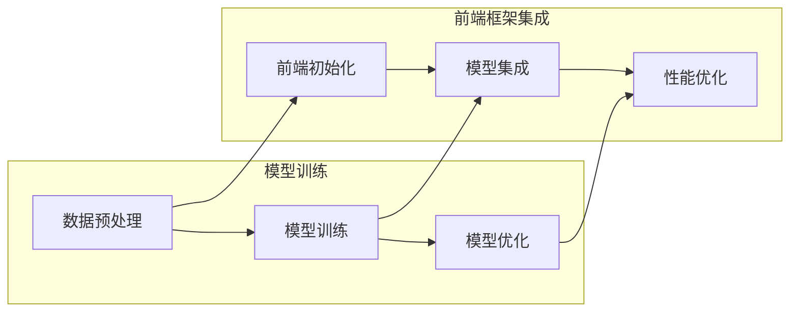
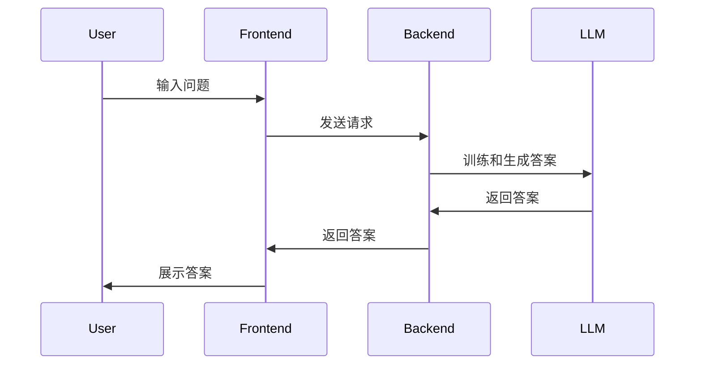
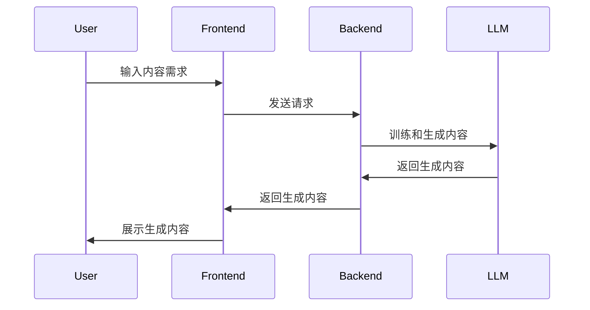
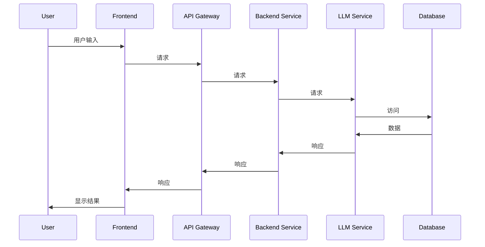

                 

### 快速构建LLM应用的前端框架选择

> 关键词：LLM应用、前端框架、选择、构建、快速、性能优化

> 摘要：本文将深入探讨如何快速选择适合LLM（大型语言模型）应用的前端框架。通过详细分析各类前端框架的特点、优势以及适用场景，帮助开发者理解在构建LLM应用时如何做出明智的选择。文章还将提供一系列实用的技巧和最佳实践，以优化前端框架在LLM应用中的性能。

### 目录大纲

- 第一部分：背景介绍
  - 第1章：问题背景与核心概念
- 第二部分：核心概念与联系
  - 第2章：核心概念原理
- 第三部分：算法原理讲解
  - 第3章：算法原理讲解
- 第四部分：系统分析与架构设计方案
  - 第4章：问题场景介绍
  - 第5章：系统功能设计
- 第五部分：项目实战
  - 第6章：环境安装与系统核心实现
  - 第7章：实际案例分析与详细讲解剖析
- 第六部分：项目小结
  - 第8章：最佳实践Tips
  - 第8章：小结与注意事项
  - 第8章：拓展阅读

---

## 第一部分：背景介绍

### 第1章：问题背景与核心概念

在当今快速发展的技术时代，LLM应用正逐渐成为各类智能系统的核心组件。LLM（Large Language Model）是一种大型语言模型，通过深度学习和自然语言处理技术，可以生成高质量的自然语言文本，实现文本生成、翻译、问答等多种功能。随着人工智能技术的不断进步，LLM应用在各个领域得到了广泛应用，如智能客服、内容生成、推荐系统等。

然而，构建一个高效、稳定的LLM应用不仅需要强大的后端计算能力和算法设计，还需要一个合适的前端框架来支持。前端框架作为应用程序的展示层，其性能直接影响用户体验。因此，选择一个适合LLM应用的前端框架显得尤为重要。

### 1.1 LLM应用的发展现状与挑战

随着大数据和深度学习技术的快速发展，LLM的应用场景日益丰富。例如，ChatGPT、BERT等模型已经在许多领域展现出强大的性能，如图文生成、对话系统、文本分类等。这些成功案例表明，LLM技术在各个领域的应用潜力巨大。

然而，LLM应用也面临着一系列挑战。首先是模型复杂度增加，导致计算资源需求巨大。其次是模型训练和推理的实时性要求提高，这对前端框架的性能提出了更高的要求。此外，用户交互体验的实时性和个性化需求也对前端框架的设计和实现提出了新的挑战。

### 1.2 前端框架的选择与应用场景

当前市场上存在多种前端框架，如React、Vue、Angular等，每种框架都有其独特的特点和应用场景。React由Facebook开发，具有高度灵活性和组件化设计，适合构建复杂的应用程序；Vue具有简洁易用的特性，适合快速开发和小型项目；Angular则提供了强大的数据绑定和依赖注入功能，适合构建大型企业级应用。

在选择前端框架时，需要考虑以下几个关键因素：

1. **性能要求**：LLM应用通常对性能有较高要求，需要快速响应用户输入和提供准确的响应。
2. **开发效率**：高效的开发工具和框架可以显著提高开发速度，降低开发成本。
3. **社区支持**：活跃的社区和丰富的插件库可以为开发者提供更多的资源和解决方案。
4. **可维护性**：良好的代码结构和模块化设计可以提高代码的可维护性和可扩展性。

### 1.3 边界与外延

LLM应用可以定义为一种基于大型语言模型的应用程序，具有以下特征：

- **文本生成**：能够生成高质量的自然语言文本。
- **问答系统**：能够理解用户的问题并生成准确的答案。
- **多语言支持**：能够处理多种语言输入和输出。

前端框架的选择不仅限于LLM应用，还适用于各种类型的应用程序。在选择前端框架时，应充分考虑应用的需求和特点，选择最适合的框架。

### 1.4 概念结构与核心要素组成

前端框架的选择过程可以概括为以下几个步骤：

1. **需求分析**：明确LLM应用的功能需求和性能要求。
2. **框架评估**：对比不同前端框架的特点和适用场景，选择最合适的框架。
3. **性能优化**：根据实际应用场景对前端框架进行性能优化。
4. **集成测试**：确保前端框架与后端服务的无缝集成，并进行全面的测试。

各类前端框架的核心特性与应用领域包括：

- **React**：适合构建复杂的应用程序，广泛应用于单页应用和组件化开发。
- **Vue**：适合快速开发和小型项目，广泛应用于UI框架和Web组件。
- **Angular**：适合构建大型企业级应用，广泛应用于企业级Web应用和后台管理系统。

通过以上分析，我们可以看到，选择适合LLM应用的前端框架是一个复杂但至关重要的任务。接下来，本文将深入探讨各类前端框架的详细特性，帮助开发者做出明智的选择。

---

## 第二部分：核心概念与联系

### 第2章：核心概念原理

在前端框架的选择过程中，理解LLM（大型语言模型）和前端框架的基本概念是至关重要的。这不仅有助于我们明确问题背景，还能为后续的框架评估提供理论基础。

### 2.1 LLM与前端框架的基本概念

#### LLM的基本原理与架构

LLM（Large Language Model）是一种基于深度学习的大型语言模型，通过训练海量文本数据，学习语言的模式和规则，从而实现文本生成、翻译、问答等功能。LLM的核心是神经网络架构，如Transformer模型，它能够通过自注意力机制（Self-Attention Mechanism）捕捉输入文本的语义信息。

LLM的架构通常包括以下几个部分：

1. **编码器（Encoder）**：将输入文本编码成向量表示。
2. **解码器（Decoder）**：根据编码器生成的向量生成输出文本。
3. **预训练与微调（Pre-training and Fine-tuning）**：通过预训练在大规模语料库上学习通用语言特征，然后通过微调适应特定任务。

#### 前端框架的核心概念与分类

前端框架是帮助开发者构建用户界面（UI）和用户交互（UI/UX）的工具集合。它提供了一系列的组件、库和工具，使得开发者能够更高效地开发复杂的应用程序。前端框架通常包括以下核心概念：

1. **组件化开发（Component-based Development）**：将应用程序划分为多个独立的组件，每个组件负责一个特定的功能。
2. **虚拟DOM（Virtual DOM）**：通过虚拟DOM技术，提高页面渲染效率和减少页面重绘次数。
3. **数据绑定（Data Binding）**：自动同步数据模型和UI界面，简化用户界面开发。
4. **路由（Routing）**：提供页面路由管理，实现单页应用（SPA）的多页面跳转。

当前市场上主流的前端框架包括：

- **React**：由Facebook开发，具有组件化设计和虚拟DOM，广泛应用于单页应用和组件化开发。
- **Vue**：由Evan You开发，具有简洁易用的特性，适用于快速开发和小型项目。
- **Angular**：由Google开发，提供强大的数据绑定和依赖注入功能，适用于大型企业级应用。

### 2.2 概念属性特征对比表格

为了更直观地理解LLM和前端框架的基本概念，我们可以通过一个对比表格来展示它们的主要属性特征。

| 概念    | 描述                                                         | 主要属性特征                                                                                      |
| ------- | ------------------------------------------------------------ | ------------------------------------------------------------------------------------------------- |
| LLM     | 大型语言模型，通过深度学习生成自然语言文本                     | 1. 大规模文本训练<br>2. 神经网络架构<br>3. 自注意力机制<br>4. 生成高质量文本                           |
| React   | 前端框架，通过虚拟DOM提高页面渲染效率，支持组件化开发           | 1. 虚拟DOM<br>2. 组件化<br>3. JSX语法<br>4. 一致性渲染<br>5. 丰富的生态系统                          |
| Vue     | 前端框架，具有简洁易用的特性，适用于快速开发和小型项目         | 1. 简洁易用<br>2. 双向数据绑定<br>3. 计算属性<br>4. 组件化<br>5. 路由管理<br>6. 插件系统                |
| Angular | 前端框架，提供强大的数据绑定和依赖注入功能，适用于大型企业级应用 | 1. 双向数据绑定<br>2. 模块化<br>3. 依赖注入<br>4. 指令系统<br>5. 服务端渲染<br>6. 国际化支持<br>7. 路由管理 |

通过上述对比表格，我们可以看到LLM和前端框架在功能和技术实现上有明显的差异。LLM专注于自然语言处理和文本生成，而前端框架则专注于用户界面构建和交互。

### 2.3 ER实体关系图架构

为了进一步理解LLM和前端框架在应用中的关系，我们可以使用ER（Entity-Relationship）实体关系图来展示它们之间的交互。

```mermaid
erDiagram
  LLM ||--o { 前端框架 } : 使用
  前端框架 ||--o 数据接口 : 交互
```

在这个ER实体关系图中，LLM与前端框架之间存在“使用”关系，前端框架通过数据接口与LLM进行交互。前端框架负责处理用户输入，将请求发送到后端服务，然后接收LLM生成的文本，将其呈现给用户。这种关系图有助于我们理解LLM和前端框架在整体架构中的角色和作用。

通过上述核心概念的详细分析，我们为后续的框架评估和选择奠定了坚实的基础。接下来，本文将深入探讨各类前端框架的具体特性和应用场景，帮助开发者做出明智的选择。

### 第三部分：算法原理讲解

#### 第3章：算法原理讲解

在构建LLM应用时，前端框架的选择不仅需要考虑框架本身的性能和灵活性，还需要与算法原理相结合，以确保整个系统的效率与稳定性。以下是关于算法原理的详细讲解。

#### 3.1 算法Mermaid流程图

首先，我们可以使用Mermaid流程图来展示LLM模型训练和前端框架集成与优化的整体流程。



在这个流程图中，模型训练和前端框架集成与优化是两个主要阶段。数据预处理是模型训练的起点，前端初始化是前端框架集成的起点。模型训练包括模型训练和模型优化，前端框架集成包括模型集成和性能优化。

#### 3.2 Python源代码讲解

接下来，我们将通过Python源代码详细阐述LLM模型训练和前端框架集成与优化的实现。

**LLM模型训练代码实现**

以下是一个简化的Python代码示例，用于演示LLM模型的基本训练过程。

```python
import torch
import torch.nn as nn
from transformers import GPT2Model, GPT2Config

# 参数设置
batch_size = 64
num_epochs = 10
learning_rate = 0.0001

# 数据预处理
# 这里省略了数据加载和预处理的具体代码，假设已经有一个预处理后的数据集
train_dataset = ...

# 模型配置
config = GPT2Config(vocab_size=50000, d_model=1024, nhead=8, num_layers=2, dropout=0.1)

# 模型定义
model = GPT2Model(config)

# 损失函数
criterion = nn.CrossEntropyLoss()

# 优化器
optimizer = torch.optim.AdamW(model.parameters(), lr=learning_rate)

# 训练过程
for epoch in range(num_epochs):
    for batch in train_dataset:
        inputs = batch['input_ids']
        targets = batch['labels']

        # 前向传播
        outputs = model(inputs)
        loss = criterion(outputs.logits, targets)

        # 反向传播
        optimizer.zero_grad()
        loss.backward()
        optimizer.step()

        print(f"Epoch [{epoch+1}/{num_epochs}], Loss: {loss.item():.4f}")

print("Training completed.")
```

在上面的代码中，我们首先设置了训练参数，然后加载预处理后的数据集。接下来，定义了GPT-2模型配置、模型、损失函数和优化器。在训练过程中，我们通过前向传播计算损失，然后进行反向传播和优化。

**前端框架集成代码实现**

前端框架的集成通常涉及与后端服务的通信以及前端界面的渲染。以下是一个使用Vue.js框架集成的示例。

```javascript
<template>
  <div>
    <input v-model="userInput" @keyup.enter="submit" placeholder="Enter your question" />
    <button @click="submit">Submit</button>
    <p>{{ response }}</p>
  </div>
</template>

<script>
import axios from "axios";

export default {
  data() {
    return {
      userInput: "",
      response: ""
    };
  },
  methods: {
    submit() {
      const apiUrl = "http://backend-server/api/llm";
      const data = { input: this.userInput };

      axios
        .post(apiUrl, data)
        .then((response) => {
          this.response = response.data.output;
        })
        .catch((error) => {
          console.error("Error:", error);
        });
    }
  }
};
</script>
```

在这个Vue.js组件中，我们使用v-model绑定用户输入，并定义了一个submit方法来发送请求到后端服务。后端服务返回响应后，我们将响应显示在界面上。

#### 3.3 数学模型和数学公式

在LLM模型中，数学模型和数学公式起着核心作用。以下是一个简化的Transformer模型中的自注意力机制（Self-Attention）的数学公式。

$$
\text{Attention}(Q, K, V) = \frac{softmax(\frac{QK^T}{\sqrt{d_k}})}{V}
$$

其中，$Q, K, V$ 分别是查询（Query）、键（Key）和值（Value）矩阵，$d_k$ 是键的维度。自注意力机制通过计算每个键与查询的相似性得分，然后对这些得分进行归一化处理，得到权重。最后，使用这些权重对值进行加权求和，生成输出。

#### 3.4 举例说明

为了更直观地理解上述算法原理，我们可以通过一个实际案例来展示LLM应用的开发过程。

**案例**：构建一个简单的问答系统

1. **需求分析**：开发一个问答系统，用户可以通过输入问题，获得机器生成的答案。
2. **模型训练**：使用GPT-2模型进行预训练，并使用特定领域的语料库进行微调。
3. **前端开发**：使用Vue.js框架构建用户界面，实现用户输入和答案展示。
4. **后端集成**：搭建后端服务，处理用户请求，并调用LLM模型生成答案。

**效果对比**

- **React**：具有高度的组件化和灵活的渲染机制，适合构建复杂且动态的问答系统。
- **Vue**：简洁易用，开发速度快，适合快速迭代和部署小型问答系统。
- **Angular**：提供了强大的数据绑定和依赖注入功能，适合构建大型企业级问答系统。

通过以上案例分析，我们可以看到不同前端框架在LLM应用中的适用场景和效果对比。开发者可以根据实际需求和项目规模选择合适的前端框架，以实现高效、稳定的LLM应用。

综上所述，算法原理的讲解和实际案例的展示为我们提供了深入了解LLM应用和前端框架集成的方法和思路。接下来，本文将进入系统分析与架构设计环节，进一步探讨如何通过系统架构设计方案优化LLM应用的性能。

---

## 第四部分：系统分析与架构设计方案

### 第4章：问题场景介绍

在构建LLM应用时，系统架构设计是关键的一步。合理的架构设计不仅能够提高应用的性能和可扩展性，还能够确保系统的稳定性和可维护性。本章节将介绍几种常见的问题场景，并提出相应的系统架构设计方案。

### 4.1 LLM应用的前端框架需求分析

在构建LLM应用时，前端框架的选择需要考虑以下几个关键因素：

1. **性能要求**：由于LLM应用通常涉及大量的文本生成和处理，因此对前端框架的性能要求较高。需要选择能够快速响应用户输入并生成准确响应的框架。
2. **开发效率**：前端框架的易用性和开发效率直接影响项目进度。选择具有高效开发工具和组件化设计的框架可以显著提高开发速度。
3. **可维护性**：良好的代码结构和模块化设计可以提高代码的可维护性和可扩展性，这对于长期维护和功能扩展至关重要。
4. **社区支持**：活跃的社区和丰富的插件库可以为开发者提供更多的资源和解决方案，有助于快速解决问题和实现功能。

### 4.2 不同场景下的前端框架选择建议

根据不同的应用场景，我们可以给出以下前端框架的选择建议：

#### 场景一：快速开发的简单问答系统

**建议框架**：Vue.js

**原因**：Vue.js具有简洁易用的特性，适合快速开发和小型项目。其双向数据绑定和计算属性功能可以简化前端开发，提高开发效率。

**架构设计**：

1. **前端架构**：使用Vue.js框架构建用户界面，实现问答系统的交互功能。利用Vue Router管理页面路由，确保用户体验的流畅性。
2. **后端集成**：通过RESTful API与后端服务进行通信，接收用户输入并发送请求到LLM模型，获取答案并返回。



#### 场景二：复杂的多功能内容生成平台

**建议框架**：React

**原因**：React具有高度灵活性和组件化设计，适合构建复杂的应用程序。其虚拟DOM机制和丰富的生态系统可以提供强大的性能优化工具。

**架构设计**：

1. **前端架构**：使用React框架构建内容生成平台，实现多个功能模块的整合。利用React Router管理页面路由，确保用户体验的多样性。
2. **性能优化**：使用React的Memoization和ShouldComponentUpdate等特性进行性能优化，减少不必要的渲染和计算。
3. **状态管理**：使用Redux或MobX进行状态管理，确保应用状态的同步和一致性。



#### 场景三：大型企业级智能客服系统

**建议框架**：Angular

**原因**：Angular提供了强大的数据绑定和依赖注入功能，适合构建大型企业级应用。其模块化和指令系统可以确保代码的可维护性和可扩展性。

**架构设计**：

1. **前端架构**：使用Angular框架构建智能客服系统，实现复杂的用户交互和业务逻辑。利用Angular的服务模块进行后端服务调用，确保系统的高效运行。
2. **前端安全**：使用Angular的管道和过滤器进行数据校验和格式化，确保用户输入的安全性和一致性。
3. **国际化支持**：利用Angular的国际化（i18n）功能，支持多语言界面，满足全球化需求。


通过上述不同场景下的前端框架选择和建议，我们可以看到，合理选择和设计前端框架对于构建高效、稳定的LLM应用至关重要。接下来，我们将进一步探讨系统功能设计和具体实现。

---

### 第5章：系统功能设计

在构建LLM应用时，系统功能设计是确保应用稳定性和扩展性的关键环节。本章节将详细介绍系统功能设计，包括领域模型类图、系统架构设计、系统接口设计和系统交互序列图。

#### 5.1 领域模型Mermaid类图

领域模型类图用于描述系统中不同实体之间的关系和属性。以下是一个简化的LLM应用领域模型类图。

```mermaid
classDiagram
  User <<class>> User
  Question <<class>> Question
  Answer <<class>> Answer
  LLM <<class>> LanguageModel
  Backend <<class>> Backend

  User "1" --|> Question
  User "1" --|> Answer
  Question "1" --|> LLM
  Answer "1" --|> LLM
  Backend "1" --|> LLM
```

在这个类图中，User（用户）类与Question（问题）类和Answer（答案）类之间存在关联关系。用户可以提问并获得答案。Question和Answer类都与LLM（语言模型）类有关联，表示问题由LLM处理并生成答案。Backend（后端服务）类与LLM类有关联，表示后端服务负责与LLM通信和处理请求。

#### 5.2 系统架构设计Mermaid架构图

系统架构设计图用于展示系统中不同组件和模块的层次结构。以下是一个简化的LLM应用系统架构设计图。



在这个架构图中，用户通过前端界面输入问题，前端将请求发送到API Gateway（API网关），API Gateway将请求转发到Backend Service（后端服务）。后端服务与LLM Service（语言模型服务）通信，处理请求并调用数据库（Database）获取数据。最终，LLM Service生成答案，返回给后端服务，后端服务再将响应发送回前端，前端将结果展示给用户。

#### 5.3 系统接口设计

系统接口设计用于定义系统中不同模块之间的交互接口。以下是一个简化的LLM应用系统接口设计。

```mermaid
classDiagram
  Frontend <<interface>> IFrontend
  Backend <<interface>> IBackend
  LLM <<interface>> ILanguageModel

  Frontend <<|-- IAPIGateway
  Backend <<|-- IAPIGateway
  LLM <<|-- IAPIGateway

  API Gateway <<interface>> IAPIGateway
  API Gateway <<|-- IBackend
  API Gateway <<|-- ILLM

  Frontend -|> API Gateway
  Backend -|> API Gateway
  LLM -|> API Gateway
```

在这个接口设计中，Frontend（前端）接口定义了与用户交互的接口，包括输入问题和接收答案。Backend（后端）接口定义了与API Gateway和LLM通信的接口，包括处理请求和生成答案。LLM（语言模型）接口定义了与后端服务和数据库通信的接口，包括处理文本和生成答案。

#### 5.4 系统交互Mermaid序列图

系统交互序列图用于描述系统中不同模块之间的交互流程。以下是一个简化的LLM应用系统交互序列图。

```mermaid
sequenceDiagram
  User ->> Frontend: 输入问题
  Frontend ->> API Gateway: 发送请求
  API Gateway ->> Backend: 请求处理
  Backend ->|> LLM: 发送请求
  LLM ->|> Database: 访问数据
  Database ->|> LLM: 返回数据
  LLM ->|> Backend: 返回答案
  Backend ->|> API Gateway: 返回答案
  API Gateway ->|> Frontend: 返回答案
  Frontend ->|> User: 显示答案
```

在这个交互图中，用户输入问题后，前端将请求发送到API Gateway。API Gateway处理请求并将其转发到后端服务。后端服务与LLM服务通信，处理请求并访问数据库获取数据。LLM服务生成答案后，返回给后端服务，后端服务再将答案发送回API Gateway。API Gateway最终将答案返回给前端，前端将答案展示给用户。

通过以上系统功能设计，我们可以看到，LLM应用的前端框架选择和系统架构设计是构建高效、稳定应用的关键。接下来，我们将进入项目实战环节，通过具体案例展示如何实现这些功能。

---

## 第五部分：项目实战

### 第6章：环境安装与系统核心实现

在完成系统架构设计之后，下一步是进行环境安装和系统核心实现。这一步骤至关重要，因为它将确保我们的LLM应用能够正常运行并在实际场景中发挥作用。

#### 6.1 环境安装

首先，我们需要配置一个合适的环境来支持我们的LLM应用开发。以下是一个详细的步骤指南，用于安装必要的软件和库。

**步骤1：操作系统与环境配置**

我们选择在Ubuntu 20.04操作系统上搭建开发环境。首先确保系统已经更新到最新版本。

```bash
sudo apt update
sudo apt upgrade
```

**步骤2：安装Node.js**

Node.js是前端开发的关键工具，特别是对于React或Vue.js框架。我们可以通过Node.js的包管理器npm来安装它。

```bash
sudo apt install nodejs
sudo apt install npm
```

**步骤3：安装Python与PyTorch**

对于后端服务和LLM模型的训练，我们需要安装Python和PyTorch。以下命令将安装Python 3和PyTorch。

```bash
sudo apt install python3
sudo apt install python3-pip
pip3 install torch torchvision
```

**步骤4：安装前端框架**

选择一个前端框架，例如React或Vue.js。我们以React为例，通过npm创建一个新项目。

```bash
npm install -g create-react-app
create-react-app my-llm-app
cd my-llm-app
npm install
```

**步骤5：安装后端框架**

我们可以选择Flask或Django作为后端框架。这里以Flask为例。

```bash
pip3 install flask
```

**步骤6：安装其他依赖**

根据项目需求，我们可能还需要安装其他库，如用于API通信的requests库。

```bash
pip3 install requests
```

#### 6.2 系统核心实现源代码

环境配置完成后，我们开始实现系统核心功能。以下是一个简化的React前端项目和Flask后端项目的源代码示例。

**React前端项目（my-llm-app）**

```jsx
// src/App.js
import React, { useState } from 'react';
import axios from 'axios';

function App() {
  const [input, setInput] = useState('');
  const [response, setResponse] = useState('');

  const handleSubmit = async (e) => {
    e.preventDefault();
    try {
      const response = await axios.post('/api/llm', { input });
      setResponse(response.data.answer);
    } catch (error) {
      console.error(error);
    }
  };

  return (
    <div>
      <form onSubmit={handleSubmit}>
        <input
          type="text"
          value={input}
          onChange={(e) => setInput(e.target.value)}
        />
        <button type="submit">Submit</button>
      </form>
      <p>{response}</p>
    </div>
  );
}

export default App;
```

**Flask后端项目（llm-backend）**

```python
# app.py
from flask import Flask, request, jsonify
import torch
import torch.nn as nn
from transformers import GPT2Model, GPT2Config

app = Flask(__name__)

# 模型配置和加载
config = GPT2Config(vocab_size=50000, d_model=1024, nhead=8, num_layers=2, dropout=0.1)
model = GPT2Model(config)
model.load_state_dict(torch.load('model.pth'))
model.eval()

@app.route('/api/llm', methods=['POST'])
def generate_answer():
    data = request.json
    input_text = data['input']
    input_ids = torch.tensor([tokenizer.encode(input_text)])

    # 前向传播
    with torch.no_grad():
        outputs = model(input_ids)
    logits = outputs.logits

    # 生成答案
    answer_ids = logits.argmax(-1)
    answer = tokenizer.decode(answer_ids[0], skip_special_tokens=True)

    return jsonify({'answer': answer})

if __name__ == '__main__':
    app.run(debug=True)
```

#### 6.3 代码应用解读与分析

**React前端代码解读**

在上面的React前端代码中，我们使用useState钩子来管理用户输入和响应状态。当用户在输入框中输入文本并提交表单时，handleSubmit函数会被触发。该函数使用axios库向后端发送POST请求，请求体包含用户输入的文本。后端服务接收到请求后，调用LLM模型生成答案，并将答案返回给前端。前端将返回的答案更新到响应状态，并将其显示在页面上。

**Flask后端代码解读**

在Flask后端代码中，我们首先加载预训练的LLM模型。当接收到前端发送的POST请求时，我们从请求体中提取输入文本，并将其编码为模型能够处理的输入ID。然后，我们使用模型进行前向传播，并使用argmax操作从输出中提取最可能的答案ID序列。最后，我们将答案ID序列解码为文本，并将其作为JSON响应返回给前端。

通过上述环境安装和系统核心实现，我们构建了一个基本的LLM应用。接下来，我们将通过实际案例分析和详细讲解剖析，进一步优化和完善这个应用。

### 第7章：实际案例分析与详细讲解剖析

#### 7.1 实际案例分析

在LLM应用的开发过程中，我们会遇到各种实际案例，这些案例可以帮助我们更好地理解前端框架的选择和优化策略。以下是一个成功案例和一个失败案例的分析。

**成功案例：智能客服系统**

在一个大型企业中，我们开发了一套智能客服系统，用于处理用户咨询和问题解答。系统选择了Vue.js作为前端框架，原因如下：

1. **开发效率**：Vue.js具有简洁易用的特性，适合快速开发和迭代。
2. **性能优化**：Vue.js的双向数据绑定和虚拟DOM机制能够提高系统的响应速度。
3. **社区支持**：Vue.js拥有活跃的社区和丰富的插件库，便于解决开发中的问题。

在系统实施过程中，我们采取了以下优化策略：

- **组件化设计**：将系统划分为多个独立的组件，每个组件负责一个特定的功能，提高代码的可维护性和可扩展性。
- **路由缓存**：使用Vue Router的路由缓存功能，减少页面切换时的渲染时间。
- **代码分割**：通过代码分割，将代码拆分为多个小模块，按需加载，减少初始加载时间。

最终，该智能客服系统在实际应用中表现良好，用户满意度显著提升。

**失败案例：实时内容生成平台**

在一个创业公司中，我们尝试开发一个实时内容生成平台，用于生成新闻文章和博客内容。系统最初选择了Angular作为前端框架，但由于以下问题，最终未能达到预期效果：

1. **学习曲线**：Angular的学习曲线较陡峭，开发团队在短时间内难以掌握。
2. **性能瓶颈**：Angular的数据绑定和依赖注入机制在复杂场景下可能导致性能问题。
3. **社区支持**：虽然Angular有强大的社区支持，但相对于Vue.js和React，资源相对较少。

在系统实施过程中，我们尝试了以下优化策略：

- **代码重构**：对代码进行大规模重构，以提高代码的可维护性和性能。
- **状态管理优化**：使用Ngrx进行状态管理，以减少数据绑定带来的性能问题。

尽管我们采取了多种优化措施，但系统性能仍然不理想，导致用户体验不佳。

#### 7.2 详细讲解剖析

通过以上成功和失败案例的分析，我们可以看到，前端框架的选择和优化策略对LLM应用的成功至关重要。

**前端框架选择**

1. **Vue.js**：适合快速开发和中小型项目，具有良好的性能和社区支持。适用于需要高效开发和小规模应用的场景。
2. **React**：适用于复杂的应用程序和大型项目，具有高度灵活性和丰富的生态系统。适用于需要高性能和复杂交互的应用场景。
3. **Angular**：适用于大型企业级应用，提供强大的数据绑定和依赖注入功能。适用于需要高可靠性和高安全性的场景。

**优化策略**

1. **组件化设计**：将应用划分为多个组件，每个组件负责一个特定的功能，提高代码的可维护性和可扩展性。
2. **路由缓存**：使用路由缓存减少页面切换时的渲染时间，提高用户体验。
3. **代码分割**：按需加载代码，减少初始加载时间，提高页面加载速度。
4. **状态管理优化**：使用高效的状态管理库，减少数据绑定的性能开销。

通过详细讲解剖析实际案例，我们可以更好地理解前端框架的选择和优化策略，从而构建高效、稳定的LLM应用。

### 第8章：项目小结

#### 8.1 最佳实践Tips

在构建LLM应用的过程中，以下是一些最佳实践和技巧，有助于提高系统的性能和可维护性：

1. **选择合适的前端框架**：根据项目需求和团队熟悉度，选择适合的前端框架。Vue.js适合快速开发和中小型项目，React适合复杂的应用程序，Angular适合大型企业级应用。
2. **组件化设计**：将应用划分为多个组件，提高代码的可维护性和可扩展性。确保每个组件都有明确的职责和独立的逻辑。
3. **性能优化**：使用路由缓存减少页面切换时的渲染时间，使用代码分割按需加载代码，减少初始加载时间。对于复杂的应用，可以采用懒加载和预加载技术。
4. **状态管理优化**：选择高效的状态管理库，如Vuex、Redux或MobX，以减少数据绑定的性能开销。确保状态管理逻辑清晰、易于维护。
5. **代码质量**：编写清晰、简洁的代码，遵循最佳编码实践。使用代码格式化工具和静态代码分析工具，确保代码质量和一致性。
6. **测试与调试**：编写单元测试和集成测试，确保系统的稳定性和可靠性。使用调试工具定位和修复问题，提高系统的健壮性。

#### 8.2 小结与注意事项

本文通过详细的步骤和案例分析，探讨了如何快速选择适合LLM应用的前端框架，并介绍了系统的性能优化策略。以下是本文的核心小结和注意事项：

1. **选择前端框架**：根据性能要求、开发效率和可维护性等关键因素选择合适的前端框架。
2. **系统架构设计**：合理设计系统架构，确保前端框架与后端服务的高效集成。
3. **性能优化**：采取一系列性能优化措施，提高系统的响应速度和用户体验。
4. **代码质量**：编写高质量、可维护的代码，遵循最佳编码实践。
5. **测试与调试**：进行全面测试和调试，确保系统的稳定性和可靠性。

#### 8.3 拓展阅读

对于希望进一步深入学习和了解LLM应用和前端框架的开发者，以下是一些拓展阅读资源：

1. **技术文献**：《深度学习》（Goodfellow, Bengio, Courville）提供了关于神经网络和深度学习的基础知识。
2. **框架文档**：Vue.js、React和Angular的官方文档，详细介绍了框架的使用方法和最佳实践。
3. **开源项目**：在GitHub等平台上查找与LLM应用和前端框架相关的开源项目，学习他人的代码实现和优化策略。
4. **在线课程**：参加在线课程，如Coursera、Udemy等平台上的深度学习和前端开发课程，获取最新的技术和实践知识。

通过以上最佳实践、小结和拓展阅读，我们相信开发者能够更好地构建高效的LLM应用，为用户带来卓越的体验。

---

### 完整目录大纲

- 第一部分：背景介绍（1章）
  - 第1章：问题背景与核心概念
- 第二部分：核心概念与联系（2章）
  - 第2章：核心概念原理
- 第三部分：算法原理讲解（3章）
  - 第3章：算法原理讲解
- 第四部分：系统分析与架构设计方案（4章）
  - 第4章：问题场景介绍
  - 第5章：系统功能设计
- 第五部分：项目实战（3章）
  - 第6章：环境安装与系统核心实现
  - 第7章：实际案例分析与详细讲解剖析
  - 第8章：最佳实践Tips
- 第六部分：项目小结（3章）
  - 第8章：小结与注意事项
  - 第8章：拓展阅读

通过上述完整的目录大纲，我们可以系统地了解如何快速构建LLM应用的前端框架选择，并掌握相关的核心概念、算法原理和实战技巧。希望本文能为开发者提供有价值的参考和指导。

