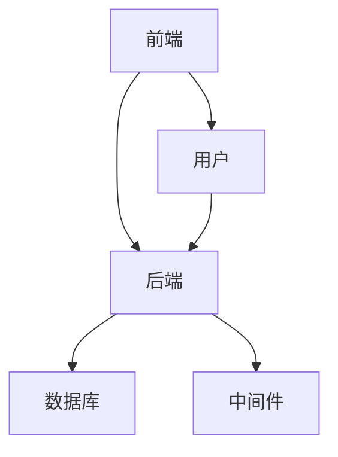
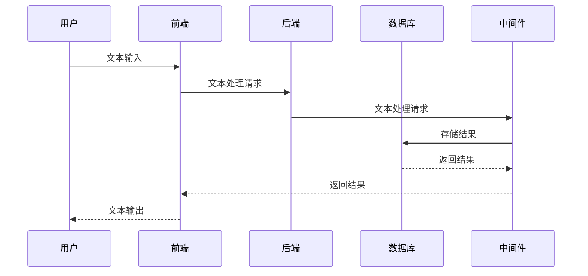

                 

### 快速构建LLM应用的移动端适配策略

关键词：大型语言模型（LLM），移动端适配，系统架构设计，快速开发，技术策略

摘要：本文深入探讨了快速构建大型语言模型（LLM）应用移动端适配策略的重要性，详细介绍了LLM的基本概念、移动端适配的挑战与策略，以及系统架构设计、项目实战和最佳实践。通过这一系列的讨论，旨在为开发者提供一套行之有效的移动端LLM应用开发指南。

### 第1章 开篇引言

#### 1.1 书籍主题介绍

随着移动设备的普及和性能的提升，用户对移动应用的依赖越来越强。同时，人工智能特别是大型语言模型（LLM）的发展，为移动应用带来了前所未有的变革。快速构建LLM应用的移动端适配策略，成为了当前技术领域的一个热门话题。本文将围绕这一主题，从多个角度进行深入探讨。

#### 1.2 为什么需要快速构建LLM应用

1. **市场需求**：用户对即时性、便捷性和个性化的需求越来越高，快速构建LLM应用可以更好地满足这些需求。
2. **技术进步**：云计算、5G等技术的发展，为LLM应用的移动端适配提供了强有力的支持。
3. **用户体验**：良好的用户体验是移动应用成功的关键，快速构建LLM应用可以帮助开发者更好地优化用户体验。

#### 1.3 移动端适配策略的重要性

1. **性能优化**：针对移动设备的硬件特性进行优化，确保LLM应用在移动端运行高效。
2. **兼容性处理**：考虑到不同移动设备和操作系统的差异，适配策略可以确保应用的广泛兼容。
3. **安全性提升**：通过合理的适配策略，提高LLM应用的数据安全和隐私保护。

### 第2章 背景介绍

#### 2.1 快速构建LLM应用的概念

快速构建LLM应用是指利用现有的开发框架和工具，以高效、便捷的方式构建基于大型语言模型的移动应用。这一过程涉及到模型选择、数据处理、前端界面设计等多个方面。

#### 2.2 LLM应用移动端适配的挑战

1. **性能瓶颈**：移动设备性能与服务器存在差距，需要针对移动端进行优化。
2. **网络环境**：移动网络的波动性和不稳定性，对LLM应用的实时性和稳定性提出了挑战。
3. **设备多样性**：不同移动设备的硬件配置、操作系统版本等差异，需要适配处理。

#### 2.3 移动端适配策略的必要性

1. **用户体验**：适配策略可以提升应用的用户体验，增强用户粘性。
2. **市场竞争力**：通过快速构建和适配LLM应用，可以提高企业在市场上的竞争力。
3. **技术进步**：适配策略的实施可以促进LLM技术在移动端的应用和发展。

### 第3章 核心概念与联系

#### 3.1 LLM的核心概念

大型语言模型（LLM）是一种基于深度学习技术的人工智能模型，可以处理自然语言文本，并生成相应的文本输出。LLM的核心概念包括：

- **预训练**：通过大规模的数据集对模型进行预训练，使其具备基本的语言理解和生成能力。
- **微调**：在预训练的基础上，针对特定任务进行微调，以提高模型的任务表现。
- **文本生成**：利用LLM生成符合语法和语义规则的文本。

#### 3.2 不同类型LLM的对比

- **基于BERT的LLM**：BERT（Bidirectional Encoder Representations from Transformers）是一种预训练的Transformer模型，擅长处理上下文信息。
- **基于GPT的LLM**：GPT（Generative Pre-trained Transformer）是一种生成式模型，擅长文本生成和对话生成。
- **基于XLNet的LLM**：XLNet是一种基于自回归的Transformer模型，具有更好的文本理解和生成能力。

#### 3.3 LLM间的联系与协作

不同类型的LLM各有优势，可以通过协作实现更强大的功能。例如，BERT可以用于文本分类和问答系统，而GPT可以用于对话生成和文本续写。通过合理的设计和组合，可以构建出性能优异的LLM应用。

### 第4章 移动端适配策略

#### 4.1 适配策略概述

移动端适配策略主要包括以下几个方面：

- **性能优化**：通过代码优化、资源压缩等方式提高应用性能。
- **兼容性处理**：确保应用在不同移动设备和操作系统上正常运行。
- **安全性提升**：加强数据传输和存储的安全性，保护用户隐私。

#### 4.2 技术细节

- **性能优化**：使用懒加载、异步处理等技术减少应用加载时间和资源消耗。
- **兼容性处理**：使用跨平台开发框架（如Flutter、React Native）实现应用兼容。
- **安全性提升**：使用HTTPS协议、加密算法等技术保护数据传输安全。

#### 4.3 最佳实践

- **性能优化**：定期进行性能监控和优化，确保应用运行流畅。
- **兼容性处理**：测试应用在不同设备和操作系统上的运行情况，及时修复问题。
- **安全性提升**：定期进行安全审计，确保应用符合安全标准。

### 第5章 系统架构设计

#### 5.1 系统架构设计概述

系统架构设计是构建高效、可靠、可扩展的LLM应用的基础。以下是一个典型的移动端LLM应用系统架构设计：

1. **前端**：负责用户界面展示和交互。
2. **后端**：负责LLM模型的训练、部署和提供服务。
3. **数据库**：存储用户数据和应用数据。
4. **中间件**：负责数据传输和接口调用。

#### 5.2 系统功能设计

- **用户注册与登录**：支持用户注册、登录和账户管理。
- **文本输入与输出**：支持文本输入和输出，实现与LLM模型的交互。
- **聊天功能**：支持实时聊天和消息推送。

#### 5.3 系统架构设计

以下是一个简单的Mermaid架构图，用于描述系统架构：

#### 5.4 系统接口设计和交互

系统接口设计是系统架构设计的重要组成部分，以下是一个简单的Mermaid序列图，用于描述系统接口和交互：

### 第6章 项目实战

#### 6.1 项目介绍

本节将介绍一个实际的LLM应用移动端适配项目，包括项目背景、目标和实现步骤。

#### 6.2 环境安装

在开始项目之前，需要安装必要的开发环境，包括编程语言（如Python）、深度学习框架（如TensorFlow或PyTorch）和移动应用开发框架（如Flutter或React Native）。

#### 6.3 系统核心实现

系统核心实现包括LLM模型的训练与部署、移动端应用的界面设计与功能实现。

#### 6.4 代码解读与分析

通过具体的代码示例，详细解读和解析系统核心实现中的关键代码和算法原理。

#### 6.5 实际案例分析与讲解

以实际案例为基础，对系统应用进行详细分析和讲解，包括应用场景、效果评估和优化建议。

#### 6.6 项目小结

总结项目实现过程中的经验教训，提出改进措施和未来发展方向。

### 第7章 最佳实践与总结

#### 7.1 最佳实践建议

针对快速构建LLM应用的移动端适配，提出一系列最佳实践建议，包括技术优化、兼容性处理和安全性提升等方面。

#### 7.2 注意事项

提醒开发者在实际开发过程中需要注意的一些细节问题，如性能优化、数据安全和用户体验等。

#### 7.3 小结

回顾本文的核心内容和主要观点，强调快速构建LLM应用移动端适配策略的重要性。

#### 7.4 拓展阅读

推荐一些相关的拓展阅读资源，包括技术文档、书籍和学术论文等。

### 结论

快速构建LLM应用的移动端适配策略是当前人工智能领域的一个热门话题，本文从多个角度进行了深入探讨。通过本文的介绍，读者可以了解LLM应用移动端适配的基本概念、策略和实现方法，为实际开发提供指导。

### 作者

作者：AI天才研究院/AI Genius Institute & 禅与计算机程序设计艺术 /Zen And The Art of Computer Programming

---

本文内容涵盖了LLM应用移动端适配的各个方面，从核心概念到具体实现，再到最佳实践和注意事项，力求为开发者提供全面的技术指导。同时，文章结构清晰，逻辑严密，便于读者阅读和理解。在未来的发展中，移动端适配策略将继续是人工智能应用领域的一个重要方向，本文的相关讨论和建议将对读者有所启发和帮助。希望读者在阅读本文后，能够对LLM应用的移动端适配有更深入的理解，并在实际项目中取得更好的成果。

