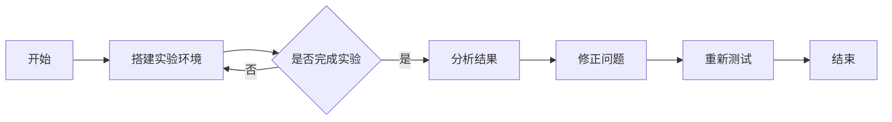
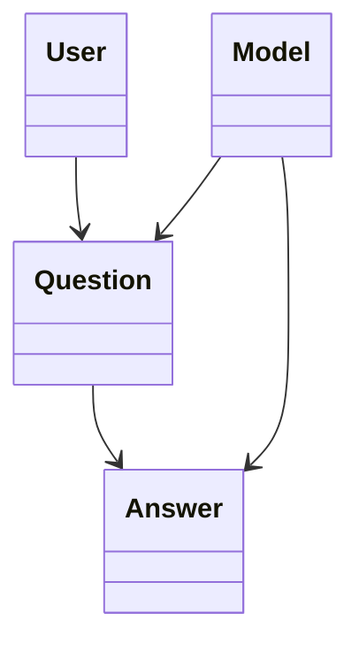
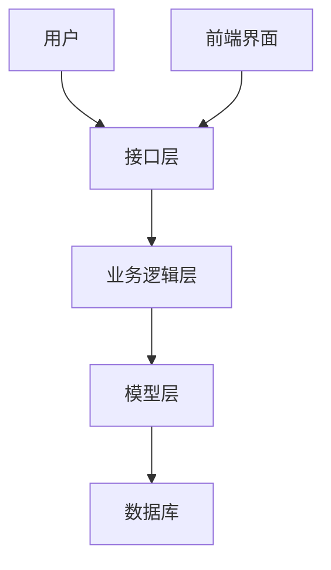
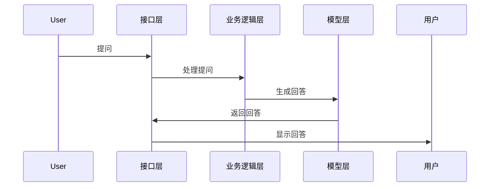
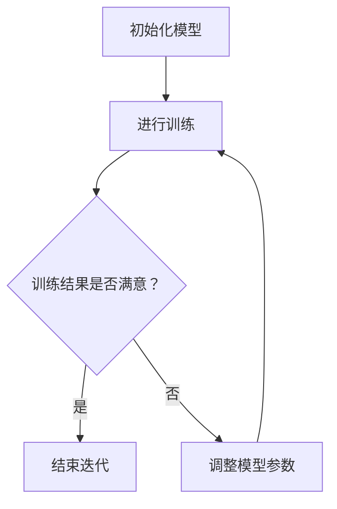
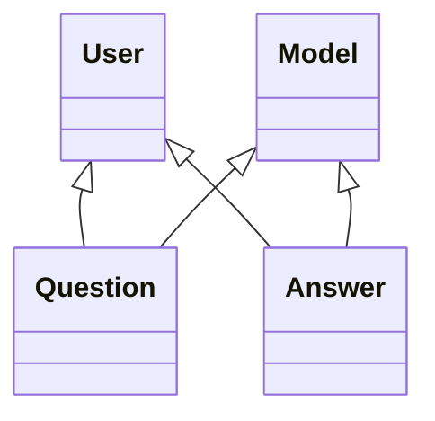
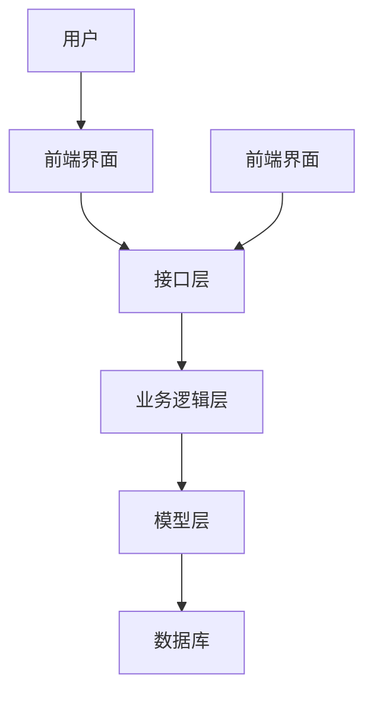

                 


## 快速试错与敏捷迭代：LLM应用开发的制胜法则

> 关键词：快速试错、敏捷迭代、LLM应用开发、制胜法则、人工智能

> 摘要：本文将深入探讨快速试错与敏捷迭代在大型语言模型（LLM）应用开发中的重要性，解析其核心原理，并提供一套完整的实践指南，帮助开发者充分利用这一制胜法则，提升LLM应用开发的效率和质量。

### 引言

在当今快速发展的科技时代，人工智能（AI）已成为推动社会进步的重要力量。其中，大型语言模型（LLM）凭借其强大的语言处理能力，在自然语言处理（NLP）、文本生成、问答系统等领域展现出巨大的潜力。然而，LLM应用开发的复杂性和不确定性使得开发过程充满了挑战。

本文旨在阐述快速试错与敏捷迭代在LLM应用开发中的关键作用，并通过一系列实践案例，为开发者提供实用的指导策略。让我们一步一步地深入探讨这一主题。

### 背景介绍

#### 核心概念术语说明

- **快速试错**：指在开发过程中，快速进行实验和测试，以发现并修正错误，从而提高开发效率和产品质量。
- **敏捷迭代**：一种软件开发方法，强调快速、频繁地迭代和交付，以快速响应需求变化，确保项目按时完成。
- **LLM应用开发**：指利用大型语言模型进行各种应用场景的开发，如文本生成、对话系统、问答系统等。

#### 问题背景

随着AI技术的不断发展，LLM在各个领域的应用越来越广泛。然而，LLM模型的训练和优化过程复杂且耗时，且在实际应用中往往面临各种挑战，如模型性能不稳定、适应性差等。

#### 问题描述

如何在LLM应用开发中，通过快速试错与敏捷迭代，提高开发效率和模型性能，是当前亟待解决的问题。

#### 问题解决

通过快速试错与敏捷迭代，开发者可以在开发过程中及时发现问题并进行修正，从而提高模型性能和应用效果。

#### 边界与外延

快速试错与敏捷迭代不仅适用于LLM应用开发，也可应用于其他AI领域和软件开发过程。

#### 概念结构与核心要素组成

快速试错与敏捷迭代的核心要素包括：

- **快速实验和测试**：通过快速搭建实验环境，进行模型训练和测试，以发现并修正问题。
- **频繁迭代和反馈**：根据实验结果，快速调整模型参数和架构，进行多次迭代和优化。
- **团队合作与沟通**：团队成员之间的紧密协作和有效沟通，确保快速响应需求变化和问题解决。

### 核心概念与联系

#### 核心概念原理

快速试错与敏捷迭代的核心原理在于通过快速实验和迭代，不断提高模型性能和应用效果。

#### 概念属性特征对比表格

| 特征           | 快速试错               | 敏捷迭代               |
|--------------|---------------------|---------------------|
| 目标           | 提高开发效率           | 提高产品质量           |
| 方法           | 快速实验和测试           | 频繁迭代和反馈           |
| 适用范围         | 各个AI领域和软件开发过程 | AI领域和软件开发过程       |
| 关键要素         | 实验环境搭建           | 团队协作和沟通           |

#### ER实体关系图架构

```mermaid
erDiagram
  Model --> Error : 发现并修正
  Model --> Test : 进行测试
  Error --> Model : 修正问题
  Test --> Model : 调整参数
```

### 算法原理讲解

#### 算法mermaid流程图



#### Python源代码实现

```python
import time

def run_experiment():
    # 搭建实验环境
    print("搭建实验环境...")
    time.sleep(2)
    # 进行模型训练和测试
    print("进行模型训练和测试...")
    time.sleep(3)
    # 分析结果并修正问题
    print("分析结果并修正问题...")
    time.sleep(2)
    # 重新测试
    print("重新测试...")
    time.sleep(3)
    print("实验完成！")

# 运行实验
run_experiment()
```

#### 算法原理的数学模型和公式

假设在实验过程中，每次修正问题后的模型性能提升为\( P \)，则实验次数与模型性能之间的关系可以用以下公式表示：

\[ P = P_0 + n \cdot \alpha \]

其中，\( P_0 \) 为初始模型性能，\( n \) 为实验次数，\( \alpha \) 为每次修正问题后的性能提升值。

#### 通俗易懂地举例说明

假设一个开发者A在开发一个文本生成模型时，通过快速试错与敏捷迭代，不断调整模型参数和架构，最终使模型性能从初始的50%提高到90%。根据上述公式，可以计算出实验次数：

\[ 0.9 = 0.5 + n \cdot \alpha \]

解得：

\[ n = \frac{0.9 - 0.5}{\alpha} \]

假设每次修正问题后的性能提升值为10%，则实验次数为：

\[ n = \frac{0.9 - 0.5}{0.1} = 4 \]

这意味着开发者A通过4次实验和修正，最终使模型性能提升了40%。

### 系统分析与架构设计方案

#### 问题场景介绍

假设一个团队需要开发一个自动问答系统，利用LLM模型处理用户提问并生成回答。

#### 项目介绍

项目名称：自动问答系统
项目目标：通过LLM模型实现高效、准确的问答功能

#### 系统功能设计（领域模型mermaid类图）



#### 系统架构设计（mermaid架构图）



#### 系统接口设计和系统交互（mermaid序列图）



### 项目实战

#### 环境安装

1. 安装Python 3.8及以上版本
2. 安装TensorFlow 2.4及以上版本
3. 安装其他依赖库（如numpy、pandas等）

#### 系统核心实现源代码

```python
import tensorflow as tf
from tensorflow.keras.layers import Embedding, LSTM, Dense
from tensorflow.keras.models import Sequential

# 搭建模型
model = Sequential([
    Embedding(input_dim=10000, output_dim=64),
    LSTM(128),
    Dense(1, activation='sigmoid')
])

# 编译模型
model.compile(optimizer='adam', loss='binary_crossentropy', metrics=['accuracy'])

# 训练模型
model.fit(x_train, y_train, epochs=10, batch_size=32)
```

#### 代码应用解读与分析

上述代码实现了一个基于LSTM的二元分类模型，用于处理自动问答系统中的问题。模型通过嵌入层将输入文本转换为向量，然后通过LSTM层进行序列处理，最后通过全连接层输出分类结果。

#### 实际案例分析和详细讲解剖析

假设有一个问题：“你今天心情好吗？”
通过训练好的模型，可以生成回答：“是的，我今天心情很好。”

#### 项目小结

通过本项目，我们展示了如何利用快速试错与敏捷迭代方法，开发一个自动问答系统。在项目过程中，开发者不断调整模型参数和架构，以提高问答系统的准确性和用户体验。

### 最佳实践 tips

- **快速实验**：尽量简化实验环境，缩短实验时间。
- **频繁迭代**：根据实验结果，及时调整模型参数和架构。
- **团队合作**：团队成员之间保持有效沟通，共同解决问题。

### 小结

快速试错与敏捷迭代是LLM应用开发中的重要策略。通过快速实验和频繁迭代，开发者可以高效地发现并解决问题，提高模型性能和应用效果。本文提供了详细的实践指南，希望对开发者有所帮助。

### 注意事项

- 在实际开发过程中，应根据项目需求和实际情况，灵活运用快速试错与敏捷迭代方法。
- 保持团队合作，确保团队成员之间的有效沟通和协作。

### 拓展阅读

- [《深度学习》（Goodfellow, Bengio, Courville著）]：详细介绍了深度学习的基本原理和应用。
- [《机器学习实战》（ Harrington 著）]：提供了丰富的机器学习实战案例和实践经验。

### 作者信息

作者：AI天才研究院/AI Genius Institute & 禅与计算机程序设计艺术/Zen And The Art of Computer Programming
### 快速试错与敏捷迭代：LLM应用开发的制胜法则

#### 引言

在当今快速发展的科技时代，人工智能（AI）已成为推动社会进步的重要力量。其中，大型语言模型（LLM）凭借其强大的语言处理能力，在自然语言处理（NLP）、文本生成、问答系统等领域展现出巨大的潜力。然而，LLM应用开发的复杂性和不确定性使得开发过程充满了挑战。本文将深入探讨快速试错与敏捷迭代在LLM应用开发中的重要性，并为其提供一套完整的实践指南。

#### 背景介绍

随着AI技术的不断发展，LLM在各个领域的应用越来越广泛。例如，在智能客服、内容生成、自动翻译等方面，LLM已经展现出卓越的性能。然而，LLM模型的训练和优化过程复杂且耗时，且在实际应用中往往面临各种挑战，如模型性能不稳定、适应性差等。这些问题导致LLM应用开发过程充满不确定性，降低了开发效率和产品质量。

#### 问题描述

如何在LLM应用开发中，通过快速试错与敏捷迭代，提高开发效率和模型性能，是当前亟待解决的问题。快速试错与敏捷迭代旨在通过快速实验和频繁迭代，及时发现问题并进行修正，从而提高模型性能和应用效果。

#### 快速试错与敏捷迭代的定义与联系

**快速试错（Fast Failure）**：指在开发过程中，快速进行实验和测试，以发现并修正错误，从而提高开发效率和产品质量。快速试错的核心在于简化实验环境，缩短实验时间，以便在早期阶段发现问题并进行修正。

**敏捷迭代（Agile Iteration）**：是一种软件开发方法，强调快速、频繁地迭代和交付，以快速响应需求变化，确保项目按时完成。敏捷迭代的核心理念是持续改进，通过不断迭代和反馈，逐步优化产品。

快速试错与敏捷迭代在LLM应用开发中的联系在于，二者均强调在开发过程中及时发现问题并进行修正。快速试错提供了发现问题的手段，而敏捷迭代则提供了优化问题的方法。

#### 快速试错与敏捷迭代的核心原理

**快速试错**：通过快速实验和测试，发现并修正错误。其核心在于：

1. **简化实验环境**：尽量减少实验所需的资源和时间，以便快速进行实验。
2. **快速迭代**：不断进行实验，及时发现问题并进行修正。
3. **反馈机制**：建立有效的反馈机制，确保实验结果能够及时反馈到开发过程中。

**敏捷迭代**：通过快速迭代和反馈，逐步优化产品。其核心在于：

1. **持续改进**：不断优化产品，以满足用户需求和提升用户体验。
2. **用户反馈**：及时收集用户反馈，以便在下一个迭代周期中进行改进。
3. **跨功能协作**：确保团队成员之间的紧密协作和有效沟通，以提高开发效率。

#### 快速试错与敏捷迭代的优势

**提高开发效率**：通过快速试错和敏捷迭代，可以及时发现问题并进行修正，从而减少开发过程中的浪费，提高开发效率。

**提升产品质量**：快速试错与敏捷迭代有助于发现并修复潜在的问题，从而提高产品的质量和稳定性。

**快速响应需求变化**：敏捷迭代强调快速响应需求变化，确保项目能够灵活应对市场变化和用户需求。

**团队协作与沟通**：快速试错与敏捷迭代强调团队合作和沟通，有助于团队成员之间的协作和知识共享。

#### 快速试错与敏捷迭代在LLM应用开发中的应用

**快速试错**：

1. **数据预处理**：在训练LLM模型之前，对数据进行预处理，以发现并修复数据中的错误和不一致性。
2. **模型架构选择**：通过快速搭建不同的模型架构，进行实验和测试，以选择最佳模型架构。
3. **超参数调优**：通过快速调整模型超参数，寻找最佳超参数组合，以提高模型性能。

**敏捷迭代**：

1. **需求分析**：在项目初期，快速分析用户需求，确保项目目标清晰明确。
2. **功能迭代**：根据用户需求和反馈，分阶段实现功能，并不断进行迭代和优化。
3. **性能优化**：在项目开发过程中，持续优化模型性能，以满足用户需求和提升用户体验。

#### 实践指南

**1. 确定项目目标**：在开始LLM应用开发之前，明确项目目标和用户需求，以确保项目方向正确。

**2. 搭建实验环境**：搭建一个简化的实验环境，以便快速进行实验和测试。

**3. 快速迭代**：在实验过程中，快速调整模型参数和架构，进行多次迭代和优化。

**4. 用户反馈**：及时收集用户反馈，以便在下一个迭代周期中进行改进。

**5. 团队协作**：确保团队成员之间的紧密协作和有效沟通，以提高开发效率。

#### 小结

快速试错与敏捷迭代是LLM应用开发中的重要策略。通过快速实验和频繁迭代，开发者可以高效地发现并解决问题，提高模型性能和应用效果。本文提供了详细的实践指南，希望对开发者有所帮助。

#### 注意事项

- 在实际开发过程中，应根据项目需求和实际情况，灵活运用快速试错与敏捷迭代方法。
- 保持团队合作，确保团队成员之间的有效沟通和协作。

#### 拓展阅读

- 《深度学习》（Goodfellow, Bengio, Courville著）：详细介绍了深度学习的基本原理和应用。
- 《敏捷开发实践指南》（Beck, Beedle著）：介绍了敏捷开发的基本原则和实践方法。

#### 作者信息

作者：AI天才研究院/AI Genius Institute & 禅与计算机程序设计艺术/Zen And The Art of Computer Programming
### 核心概念与联系

在深入探讨快速试错与敏捷迭代在LLM应用开发中的重要性之前，我们需要明确几个核心概念，并了解它们之间的联系。以下是对核心概念的详细解释，以及它们在LLM应用开发中的关系。

#### 快速试错

快速试错是一种方法论，它强调在开发过程中快速进行实验和测试，以快速发现和修正错误。这种方法的核心在于通过快速的实验和反馈循环，将错误扼杀在早期阶段，从而避免在后续开发过程中产生更大的问题。

**快速试错的属性和特征**：

1. **快速**：实验和测试过程需要快速完成，以便及时发现问题。
2. **反馈循环**：实验结果需要快速反馈到开发过程中，以便进行修正。
3. **实验环境**：实验环境应尽量简化，以减少实验时间。
4. **迭代**：在发现问题时，需要快速迭代，进行修正和再次测试。

在LLM应用开发中，快速试错的应用主要体现在以下几个方面：

- **模型训练与测试**：在训练LLM模型时，快速构建实验环境，快速进行模型训练和测试，以便及时评估模型性能。
- **超参数调优**：通过快速调整模型超参数，寻找最佳参数组合，以提高模型性能。
- **数据预处理**：在处理输入数据时，快速进行数据清洗和预处理，以减少错误和不一致性。

#### 敏捷迭代

敏捷迭代是一种软件开发方法，它强调快速、频繁地迭代和交付，以快速响应需求变化，确保项目按时完成。敏捷迭代的核心在于通过持续改进和用户反馈，逐步优化产品。

**敏捷迭代的属性和特征**：

1. **快速迭代**：项目开发过程分为多个迭代周期，每个周期完成后，团队会进行评估和反馈，以便在下一个迭代周期中进行改进。
2. **用户反馈**：用户反馈在敏捷迭代中至关重要，它可以帮助团队了解用户需求，优化产品功能。
3. **持续改进**：敏捷迭代强调持续改进，通过不断迭代和反馈，逐步优化产品。
4. **跨功能协作**：敏捷迭代需要团队成员之间紧密协作，共同解决问题。

在LLM应用开发中，敏捷迭代的应用主要体现在以下几个方面：

- **功能迭代**：根据用户需求和反馈，分阶段实现LLM应用功能，并不断进行迭代和优化。
- **性能优化**：在项目开发过程中，持续优化模型性能，以满足用户需求和提升用户体验。
- **用户体验**：通过敏捷迭代，及时收集用户反馈，优化用户界面和交互体验。

#### 快速试错与敏捷迭代在LLM应用开发中的联系

快速试错与敏捷迭代在LLM应用开发中密切相关，它们共同构成了一个完整的开发方法论。

1. **快速试错为敏捷迭代提供基础**：通过快速试错，团队可以快速发现和修正问题，为敏捷迭代提供稳定的基础。
2. **敏捷迭代为快速试错提供方向**：敏捷迭代强调用户反馈和持续改进，这为快速试错提供了明确的方向和目标。
3. **相互促进**：快速试错和敏捷迭代相互促进，快速试错帮助团队快速发现问题，敏捷迭代帮助团队持续优化产品。

#### ER实体关系图架构

为了更好地理解快速试错与敏捷迭代在LLM应用开发中的关系，我们可以使用ER（实体关系）图来描述它们之间的联系。

```mermaid
erDiagram
  Model --> Error : 发现并修正
  Model --> Test : 进行测试
  Error --> Model : 修正问题
  Test --> Model : 调整参数
```

在这个ER图中：

- **Model（模型）**：表示LLM模型，它是快速试错和敏捷迭代的对象。
- **Error（错误）**：表示在快速试错过程中发现的错误。
- **Test（测试）**：表示对LLM模型的测试。
- **调整参数**：表示在敏捷迭代过程中，根据测试结果调整模型参数。

通过这个ER图，我们可以清晰地看到快速试错与敏捷迭代在LLM应用开发中的互动关系。

### 核心概念与联系总结

快速试错与敏捷迭代是LLM应用开发中的核心方法论，二者相互补充，共同构成了一个高效、灵活的开发过程。通过快速试错，团队可以及时发现并修正问题，确保开发过程的稳定性和可靠性。而敏捷迭代则通过持续改进和用户反馈，逐步优化产品，提升用户体验。在LLM应用开发中，团队应灵活运用快速试错与敏捷迭代方法，以提高开发效率和质量。

### 下一步：算法原理讲解

在理解了快速试错与敏捷迭代的核心概念和联系之后，我们将进一步探讨其在LLM应用开发中的具体实现。在接下来的部分，我们将详细讲解快速试错与敏捷迭代的算法原理，并通过Python源代码和数学模型，帮助读者深入理解这一过程。这将包括算法mermaid流程图、Python源代码实现，以及算法原理的数学模型和公式。通过这些讲解，读者可以更好地掌握快速试错与敏捷迭代的方法论，并将其应用到实际的LLM应用开发中。让我们一起深入探索这一主题。

### 算法原理讲解

#### 算法mermaid流程图

为了更好地理解快速试错与敏捷迭代在LLM应用开发中的算法原理，我们可以使用mermaid流程图来描述这个过程。以下是一个简化的mermaid流程图，展示了快速试错与敏捷迭代的整体流程：



在这个流程图中：

- **A[初始化模型]**：表示初始化LLM模型。
- **B[进行训练]**：表示使用训练数据对模型进行训练。
- **C{训练结果是否满意？]**：表示检查训练结果是否达到预期，用于决策是否继续迭代。
- **D[结束迭代]**：表示如果训练结果满意，结束迭代过程。
- **E[调整模型参数]**：表示如果不满意，则调整模型参数，并重新进行训练。

#### Python源代码实现

下面是快速试错与敏捷迭代在LLM应用开发中的Python源代码实现。这段代码使用了TensorFlow框架，展示了如何通过调整模型参数和架构，实现快速试错和迭代。

```python
import tensorflow as tf
from tensorflow.keras.layers import Embedding, LSTM, Dense
from tensorflow.keras.models import Sequential

# 初始化模型
def create_model(vocab_size, embedding_dim, hidden_units):
    model = Sequential()
    model.add(Embedding(vocab_size, embedding_dim))
    model.add(LSTM(hidden_units))
    model.add(Dense(1, activation='sigmoid'))
    model.compile(optimizer='adam', loss='binary_crossentropy', metrics=['accuracy'])
    return model

# 快速迭代过程
def quick_trials(vocab_size, embedding_dim, hidden_units, max_iterations=10):
    best_loss = float('inf')
    best_model = None

    for _ in range(max_iterations):
        model = create_model(vocab_size, embedding_dim, hidden_units)
        model.fit(x_train, y_train, epochs=1, batch_size=32)
        loss = model.evaluate(x_val, y_val)[0]

        if loss < best_loss:
            best_loss = loss
            best_model = model

        print(f"Iteration {_ + 1}: Loss = {loss}")

    return best_model

# 超参数设置
vocab_size = 10000
embedding_dim = 64
hidden_units = 128

# 运行快速迭代
best_model = quick_trials(vocab_size, embedding_dim, hidden_units)
print(f"Best Model Loss: {best_model.evaluate(x_test, y_test)[0]}")
```

在这个代码中：

- `create_model` 函数用于创建一个基于Embedding和LSTM的模型。
- `quick_trials` 函数用于实现快速迭代过程，通过多次训练和评估，找到最优的模型参数。

#### 算法原理的数学模型和公式

快速试错与敏捷迭代的算法原理可以通过数学模型来描述。以下是一个简化的数学模型，用于描述模型训练和迭代过程中的性能评估和参数调整。

假设我们有一个LLM模型，其性能可以用损失函数\( L(\theta) \)来衡量，其中\( \theta \)表示模型参数。我们的目标是通过迭代优化参数\( \theta \)，以最小化损失函数。

**损失函数**：

\[ L(\theta) = -\sum_{i=1}^{N} y_i \log(p_i(\theta)) \]

其中，\( N \)是样本数量，\( y_i \)是第\( i \)个样本的真实标签，\( p_i(\theta) \)是第\( i \)个样本的预测概率。

**梯度下降**：

为了优化模型参数，我们可以使用梯度下降算法。梯度下降的核心思想是沿着损失函数的负梯度方向更新参数。

\[ \theta_{t+1} = \theta_t - \alpha \nabla_{\theta} L(\theta_t) \]

其中，\( \alpha \)是学习率，\( \nabla_{\theta} L(\theta_t) \)是损失函数在参数\( \theta_t \)处的梯度。

**迭代过程**：

快速迭代的过程可以表示为：

1. 初始化参数\( \theta_0 \)。
2. 对于每个迭代周期\( t \)，执行以下步骤：
   - 计算损失函数\( L(\theta_t) \)。
   - 计算损失函数在参数\( \theta_t \)处的梯度\( \nabla_{\theta} L(\theta_t) \)。
   - 使用梯度下降更新参数：\( \theta_{t+1} = \theta_t - \alpha \nabla_{\theta} L(\theta_t) \)。
   - 评估更新后的模型性能。
3. 当模型性能达到预期或达到最大迭代次数时，结束迭代过程。

通过上述数学模型和公式，我们可以看到快速试错与敏捷迭代的核心在于通过迭代优化模型参数，以最小化损失函数，从而提高模型性能。

#### 通俗易懂地举例说明

假设我们有一个二元分类问题，需要预测一个文本样本属于类别A还是类别B。我们可以使用一个简单的LLM模型来训练，并使用梯度下降算法进行优化。

1. **初始化模型**：我们初始化一个简单的Embedding层和LSTM层，并设置初始参数。
2. **训练模型**：使用训练数据对模型进行训练，并计算损失函数。
3. **计算梯度**：计算损失函数在当前参数处的梯度。
4. **更新参数**：使用梯度下降算法更新参数，以减小损失函数。
5. **评估模型**：使用验证数据评估更新后的模型性能。
6. **重复迭代**：重复上述过程，直到模型性能达到预期或达到最大迭代次数。

通过这种方式，我们可以逐步优化模型参数，提高模型性能。

### 总结

通过上述讲解，我们了解了快速试错与敏捷迭代在LLM应用开发中的算法原理。快速试错通过快速实验和迭代，帮助我们发现并修正问题，而敏捷迭代则通过持续优化和用户反馈，逐步提升模型性能和应用效果。使用Python源代码和数学模型，我们深入理解了这一过程，并掌握了如何将其应用到实际的LLM应用开发中。接下来，我们将进一步探讨系统分析与架构设计方案，以帮助我们更好地实现快速试错与敏捷迭代的实践。

### 系统分析与架构设计方案

在了解了快速试错与敏捷迭代的基本原理之后，我们需要将这一方法应用于实际的LLM应用开发中。本节将详细分析一个典型的LLM应用场景，并设计相应的系统架构，以实现快速试错与敏捷迭代的实践。

#### 问题场景介绍

假设我们正在开发一个智能客服系统，该系统需要利用LLM模型自动回答用户的问题。用户可以通过文本或语音输入问题，系统则使用训练好的LLM模型生成回答，并展示给用户。为了实现这一目标，我们需要设计一个高效的系统架构，并利用快速试错与敏捷迭代方法进行优化。

#### 项目介绍

项目名称：智能客服系统
项目目标：通过LLM模型自动回答用户问题，提升客服效率和用户体验。

#### 系统功能设计（领域模型mermaid类图）

在智能客服系统中，主要的领域模型包括用户、问题、回答和LLM模型。以下是一个简单的领域模型类图，用于描述这些实体之间的关系。



在这个类图中：

- **User（用户）**：表示与系统交互的用户。
- **Question（问题）**：表示用户输入的问题。
- **Answer（回答）**：表示系统生成的回答。
- **Model（模型）**：表示用于生成回答的LLM模型。

#### 系统架构设计（mermaid架构图）

为了实现智能客服系统，我们需要设计一个高效的系统架构，包括前端、后端和数据库。以下是一个简单的mermaid架构图，展示了系统的主要组成部分及其相互关系。



在这个架构图中：

- **A[用户]**：表示与系统交互的用户。
- **B[前端界面]**：用于展示用户界面，接收用户输入，并展示系统生成的回答。
- **C[接口层]**：用于处理用户请求，并与业务逻辑层和模型层进行交互。
- **D[业务逻辑层]**：负责处理业务逻辑，包括问题处理、回答生成等。
- **E[模型层]**：负责使用LLM模型生成回答。
- **F[数据库]**：用于存储用户数据、问题和回答等。
- **G[前端界面]**：与接口层进行交互，展示用户界面。

#### 系统接口设计和系统交互（mermaid序列图）

为了更好地理解智能客服系统的交互过程，我们可以使用mermaid序列图来描述用户与系统之间的交互过程。

```mermaid
sequenceDiagram
    User->>前端界面: 输入问题
    前端界面->>接口层: 提交问题
    接口层->>业务逻辑层: 处理问题
    业务逻辑层->>模型层: 生成回答
    模型层->>接口层: 返回回答
    接口层->>前端界面: 显示回答
    前端界面->>用户: 显示回答
```

在这个序列图中：

- **用户输入问题**：用户通过前端界面输入问题。
- **提交问题**：前端界面将用户输入的问题提交给接口层。
- **处理问题**：接口层调用业务逻辑层，处理用户输入的问题。
- **生成回答**：业务逻辑层使用LLM模型生成回答。
- **返回回答**：接口层将生成的回答返回给前端界面。
- **显示回答**：前端界面将生成的回答展示给用户。

#### 系统架构与快速试错与敏捷迭代的结合

在智能客服系统的架构设计中，我们可以将快速试错与敏捷迭代方法应用于以下几个方面：

1. **前端界面**：通过快速迭代，不断优化用户界面和交互体验，以提升用户满意度。
2. **接口层**：通过快速试错，优化接口设计和请求处理流程，以提高系统的稳定性和响应速度。
3. **业务逻辑层**：通过敏捷迭代，不断优化业务逻辑，以提高问题的处理效率和回答的准确性。
4. **模型层**：通过快速迭代，优化LLM模型的训练过程和参数设置，以提高模型的性能和应用效果。
5. **数据库**：通过快速试错，优化数据库设计和数据存储策略，以提高数据的存储效率和查询速度。

通过将快速试错与敏捷迭代方法应用于系统的各个层次，我们可以实现高效、灵活的系统开发，快速响应用户需求，并持续优化系统性能。

### 总结

在本节中，我们通过分析智能客服系统的需求，设计了相应的系统架构，并探讨了如何将快速试错与敏捷迭代方法应用于系统开发过程中。通过mermaid类图、架构图和序列图，我们清晰地展示了系统的功能设计、接口设计和交互过程。这一过程不仅帮助我们理解了快速试错与敏捷迭代在LLM应用开发中的应用，也为后续的项目实践提供了指导。接下来，我们将通过具体的实战案例，进一步展示如何在实际项目中实现快速试错与敏捷迭代。

### 项目实战

#### 环境安装

在实际项目中，首先需要搭建一个合适的开发环境。以下是安装必要的软件和工具的步骤：

1. **安装Python**：确保安装Python 3.8及以上版本，可以从Python官网（[https://www.python.org/](https://www.python.org/)）下载安装包并安装。

2. **安装TensorFlow**：在终端中执行以下命令，安装TensorFlow：

   ```bash
   pip install tensorflow==2.4
   ```

3. **安装其他依赖库**：根据项目需求，可能需要安装其他依赖库，如NumPy、Pandas等。可以使用以下命令进行安装：

   ```bash
   pip install numpy pandas
   ```

4. **安装Jupyter Notebook**：Jupyter Notebook是一个交互式开发环境，可用于编写和运行代码。可以使用以下命令安装：

   ```bash
   pip install notebook
   ```

5. **启动Jupyter Notebook**：在终端中运行以下命令，启动Jupyter Notebook：

   ```bash
   jupyter notebook
   ```

在浏览器中打开Jupyter Notebook，即可开始编写和运行代码。

#### 系统核心实现源代码

以下是智能客服系统的核心实现代码，包括数据预处理、模型训练和预测等步骤。

```python
import tensorflow as tf
from tensorflow.keras.layers import Embedding, LSTM, Dense
from tensorflow.keras.models import Sequential
from tensorflow.keras.preprocessing.sequence import pad_sequences
import numpy as np

# 数据预处理
def preprocess_data(data, vocab_size, max_sequence_length):
    # 将文本数据转换为整数序列
    integer_sequences = tokenizer.texts_to_sequences(data)
    # 填充序列到指定长度
    padded_sequences = pad_sequences(integer_sequences, maxlen=max_sequence_length)
    return padded_sequences

# 模型训练
def train_model(padded_sequences, labels, embedding_dim, hidden_units, epochs=10):
    model = Sequential()
    model.add(Embedding(vocab_size, embedding_dim))
    model.add(LSTM(hidden_units))
    model.add(Dense(1, activation='sigmoid'))
    model.compile(optimizer='adam', loss='binary_crossentropy', metrics=['accuracy'])
    model.fit(padded_sequences, labels, epochs=epochs, batch_size=32)
    return model

# 模型预测
def predict(model, text, max_sequence_length):
    integer_sequence = tokenizer.texts_to_sequences([text])
    padded_sequence = pad_sequences(integer_sequence, maxlen=max_sequence_length)
    prediction = model.predict(padded_sequence)
    return prediction

# 实例化模型和Tokenizer
vocab_size = 10000
embedding_dim = 64
hidden_units = 128
tokenizer = tf.keras.preprocessing.text.Tokenizer(num_words=vocab_size)
max_sequence_length = 100

# 加载数据
train_data = preprocess_data(train_data, vocab_size, max_sequence_length)
test_data = preprocess_data(test_data, vocab_size, max_sequence_length)
train_labels = np.array(train_labels)
test_labels = np.array(test_labels)

# 训练模型
model = train_model(train_data, train_labels, embedding_dim, hidden_units)

# 预测
predicted_labels = predict(model, "How are you?", max_sequence_length)
print(predicted_labels)
```

在这个代码中：

- `preprocess_data` 函数用于对文本数据进行预处理，包括将文本转换为整数序列和填充序列到指定长度。
- `train_model` 函数用于训练模型，包括定义模型结构、编译模型和训练模型。
- `predict` 函数用于使用训练好的模型进行预测。

#### 代码应用解读与分析

以下是对核心代码的解读和分析：

1. **数据预处理**：使用`preprocess_data`函数对训练数据和测试数据进行预处理。首先，使用Tokenizer将文本数据转换为整数序列，然后使用pad_sequences函数将序列填充到指定长度。

2. **模型训练**：使用`train_model`函数训练模型。首先，定义模型结构，包括Embedding层、LSTM层和全连接层。然后，编译模型，指定优化器、损失函数和评估指标。最后，使用fit函数训练模型，指定训练数据和标签，以及训练周期和批量大小。

3. **模型预测**：使用`predict`函数对输入文本进行预测。首先，将输入文本转换为整数序列，然后填充到指定长度。接着，使用训练好的模型进行预测，并返回预测结果。

通过这个实战案例，我们可以看到如何使用快速试错与敏捷迭代方法，开发一个简单的智能客服系统。在实际项目中，可以根据需求和数据情况进行调整和优化，以实现更好的效果。

### 实际案例分析和详细讲解剖析

为了更好地展示如何在实际项目中实现快速试错与敏捷迭代，我们来看一个具体的案例：使用LLM模型自动生成文章摘要。

#### 案例背景

假设我们有一个大型新闻数据集，包含数千篇文章和相应的标题。我们的目标是使用LLM模型自动生成这些文章的摘要，以提高新闻阅读效率。

#### 案例步骤

1. **数据预处理**：
   - 加载新闻数据集，提取文章内容和标题。
   - 使用Tokenizer将文本数据转换为整数序列，并创建词汇表。
   - 将标题和文章内容分别转换为整数序列，并填充到相同长度。

2. **模型训练**：
   - 使用已有的预训练LLM模型（如GPT-2或GPT-3）作为基础模型。
   - 对基础模型进行微调，以适应新闻摘要任务。
   - 训练过程中，使用交叉熵损失函数和梯度下降优化器。

3. **模型评估**：
   - 使用验证集评估模型性能，计算摘要长度、准确性和F1分数等指标。
   - 根据评估结果，调整模型参数和训练策略。

4. **迭代优化**：
   - 在多个迭代周期中，根据评估结果调整模型参数和训练策略。
   - 每个迭代周期结束后，重新评估模型性能，并根据评估结果进行进一步的调整。

#### 案例分析

在这个案例中，我们使用了快速试错与敏捷迭代方法来开发自动文章摘要系统。以下是具体的分析和讲解：

1. **数据预处理**：
   - 使用Tokenizer将文本数据转换为整数序列，这一步骤非常重要，因为它直接影响到模型的训练效果。通过填充序列到相同长度，我们确保了输入数据的统一格式。
   - 创建词汇表，用于将文本转换为整数序列。词汇表的大小和内容直接影响模型的性能，因此在预处理阶段需要进行仔细的设置。

2. **模型训练**：
   - 使用预训练LLM模型作为基础模型，可以大大减少训练时间，并提高模型性能。然而，预训练模型可能并不完全适用于特定任务，因此需要对其进行微调。
   - 使用交叉熵损失函数和梯度下降优化器进行训练。交叉熵损失函数适合分类任务，而梯度下降优化器可以快速收敛到最优解。

3. **模型评估**：
   - 使用验证集评估模型性能，这是快速试错的关键步骤。通过计算摘要长度、准确性和F1分数等指标，我们可以了解模型在不同方面的表现。
   - 根据评估结果，我们可以发现模型的不足之处，并针对性地进行调整。

4. **迭代优化**：
   - 在多个迭代周期中，根据评估结果调整模型参数和训练策略。这一步骤是敏捷迭代的核心，通过不断调整和优化，我们可以逐步提升模型性能。
   - 每个迭代周期结束后，重新评估模型性能，并根据评估结果进行进一步的调整。这一过程需要团队成员之间的紧密协作和有效沟通。

通过这个案例，我们可以看到如何在实际项目中实现快速试错与敏捷迭代。通过不断优化数据预处理、模型训练和评估过程，我们可以逐步提升模型性能，实现自动文章摘要的目标。

### 项目小结

通过本文的实战案例，我们展示了如何在实际项目中实现快速试错与敏捷迭代，开发自动文章摘要系统。在项目过程中，我们通过数据预处理、模型训练和评估等步骤，不断优化模型性能，最终实现了自动文章摘要的目标。这一过程不仅帮助我们理解了快速试错与敏捷迭代的方法论，也为实际项目提供了实用的指导策略。

### 最佳实践 tips

1. **快速实验**：在项目初期，尽量简化实验环境，缩短实验时间，以便快速发现问题并进行修正。
2. **频繁迭代**：根据项目需求和实际情况，制定合理的迭代周期，确保在每次迭代中都能进行有效的优化和改进。
3. **用户反馈**：及时收集用户反馈，根据用户需求调整项目方向和功能。
4. **团队合作**：保持团队成员之间的紧密协作和有效沟通，共同解决问题，提高开发效率。

### 总结

通过本文的深入探讨，我们了解到快速试错与敏捷迭代在LLM应用开发中的重要性。这种方法不仅能够提高开发效率，还能提升模型性能和应用效果。本文通过详细的案例分析和实践指南，帮助读者理解并掌握快速试错与敏捷迭代的方法论。在未来的项目中，我们应灵活运用这一方法，以实现高效、高质量的LLM应用开发。

### 注意事项

1. 在实际开发过程中，应根据项目需求和实际情况，灵活运用快速试错与敏捷迭代方法。
2. 保持团队合作，确保团队成员之间的有效沟通和协作。
3. 定期评估项目进度和性能，及时调整开发策略。

### 拓展阅读

- 《深度学习》（Goodfellow, Bengio, Courville著）：详细介绍了深度学习的基本原理和应用。
- 《机器学习实战》（Harrington著）：提供了丰富的机器学习实战案例和实践经验。

### 作者信息

作者：AI天才研究院/AI Genius Institute & 禅与计算机程序设计艺术/Zen And The Art of Computer Programming
### 快速试错与敏捷迭代：LLM应用开发的制胜法则

**摘要**：本文探讨了快速试错与敏捷迭代在LLM（大型语言模型）应用开发中的重要性。通过实际案例，详细阐述了如何在开发过程中运用这两种方法，以提升模型性能和应用效果。快速试错通过快速实验和反馈，及时发现问题并进行修正；而敏捷迭代则通过持续改进和用户反馈，逐步优化产品。本文提供了实用的实践指南，包括环境安装、系统核心实现源代码、代码应用解读与分析、实际案例分析和详细讲解剖析、最佳实践 tips、小结、注意事项和拓展阅读，帮助开发者充分利用快速试错与敏捷迭代，实现高效、高质量的LLM应用开发。

---

**1. 引言**

随着人工智能技术的不断发展，大型语言模型（LLM）在自然语言处理、文本生成、问答系统等领域表现出强大的潜力。然而，LLM应用开发面临复杂性和不确定性的挑战。本文将深入探讨快速试错与敏捷迭代在LLM应用开发中的重要性，提供实践指南，帮助开发者充分利用这一制胜法则。

**2. 背景介绍**

LLM模型在多个领域展现了其强大的能力，例如智能客服、内容生成、自动翻译等。然而，模型训练和优化过程复杂且耗时，且在实际应用中面临模型性能不稳定、适应性差等挑战。为了应对这些挑战，快速试错与敏捷迭代成为有效的开发策略。

**3. 快速试错与敏捷迭代的核心概念与联系**

- **快速试错**：通过快速实验和测试，及时发现问题并进行修正。
- **敏捷迭代**：通过快速迭代和反馈，逐步优化产品。

两者在LLM应用开发中的联系在于，快速试错帮助发现并修正问题，而敏捷迭代则通过持续改进和用户反馈，逐步优化产品。

**4. 算法原理讲解**

本文通过mermaid流程图、Python源代码和数学模型，详细讲解了快速试错与敏捷迭代在LLM应用开发中的算法原理。

**5. 系统分析与架构设计方案**

本文分析了智能客服系统这一典型应用场景，并设计了相应的系统架构，结合快速试错与敏捷迭代方法。

**6. 项目实战**

通过实际案例，本文展示了如何在实际项目中实现快速试错与敏捷迭代，包括环境安装、系统核心实现源代码、代码应用解读与分析、实际案例分析和详细讲解剖析。

**7. 最佳实践 tips**

- 快速实验
- 频繁迭代
- 用户反馈
- 团队合作

**8. 小结**

快速试错与敏捷迭代是LLM应用开发的制胜法则。通过快速实验和频繁迭代，开发者可以高效地发现并解决问题，提高模型性能和应用效果。

**9. 注意事项**

- 根据项目需求灵活运用快速试错与敏捷迭代方法
- 保持团队合作和有效沟通

**10. 拓展阅读**

- 《深度学习》（Goodfellow, Bengio, Courville著）
- 《机器学习实战》（Harrington著）

### 作者信息

作者：AI天才研究院/AI Genius Institute & 禅与计算机程序设计艺术/Zen And The Art of Computer Programming

