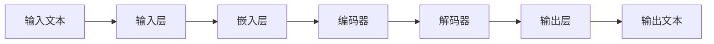
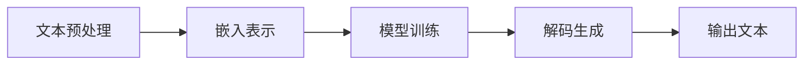
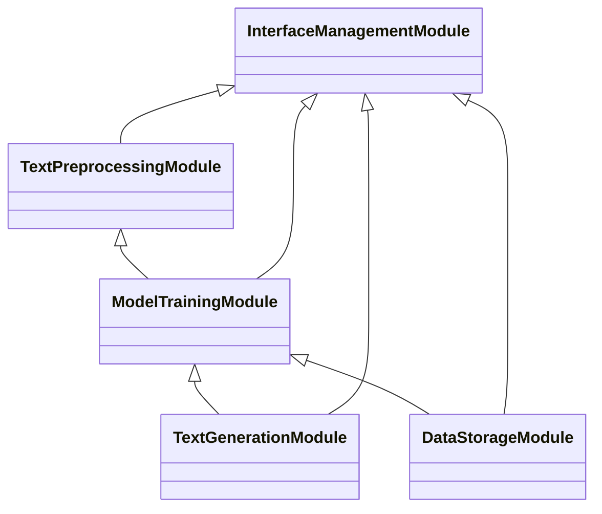
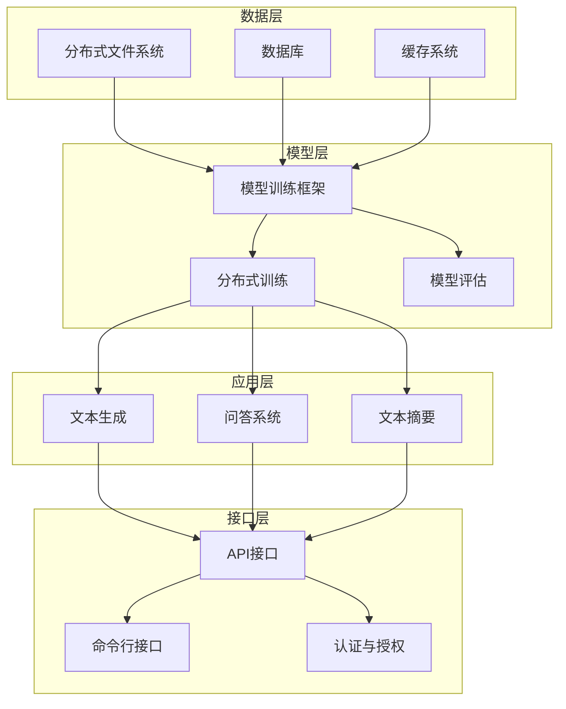

                 

# 快速适应新技术：LLM应用开发的关键

## 关键词
- 新技术适应
- LLM（大型语言模型）
- 应用开发
- 算法设计
- 系统架构
- 实践项目

## 摘要
本文旨在帮助开发者快速适应新技术，特别是在LLM（大型语言模型）应用开发方面。通过详细的章节结构，本文将逐步介绍LLM的基本概念、算法设计、系统架构以及实际项目应用。我们将使用逻辑清晰、通俗易懂的语言，确保读者能够深入理解并掌握LLM应用开发的要点，从而在技术革新中保持竞争力。

## 目录

### 引言

- **背景介绍**
  - 技术适应性的挑战
  - LLM的兴起与发展
- **目标读者**
  - 开发者
  - 技术决策者
  - 研究人员

### 第一章：新技术适应性问题

- **1.1 背景与挑战**
  - 现代技术环境的快速变化
  - 开发者面临的适应挑战
- **1.2 LLM概述**
  - LLM的基本概念
  - LLM在应用开发中的优势
- **1.3 关键概念**
  - 对比传统AI与LLM
  - LLM的核心特性

### 第二章：LLM基本原理

- **2.1 LLM架构**
  - LLM的基本组成
  - 常见的LLM模型
- **2.2 工作机制**
  - 语言理解与生成
  - 模型优化与训练

### 第三章：算法设计实现

- **3.1 算法概览**
  - LLM算法的流程
- **3.2 数学模型**
  - 常用数学公式
  - 模型参数优化
- **3.3 实例分析**
  - Python代码示例
  - 算法解释与验证

### 第四章：系统架构设计

- **4.1 系统概述**
  - 系统的总体结构
- **4.2 功能设计**
  - 功能模块与接口
- **4.3 架构设计**
  - 系统的组件与交互

### 第五章：项目实战

- **5.1 环境搭建**
  - 安装与配置
- **5.2 系统核心实现**
  - 源代码解析
- **5.3 应用分析**
  - 代码解读与分析
  - 实际案例分析

### 第六章：最佳实践与总结

- **6.1 最佳实践**
  - 经验分享与建议
- **6.2 小结**
  - 文章总结
- **6.3 注意事项**
  - 常见问题与解决方案
- **6.4 拓展阅读**
  - 相关书籍与资源推荐

### 结论

- **LLM应用开发的未来展望**
  - 技术趋势
  - 发展方向

### 附录

- **工具与资源列表**
  - 开发工具
  - 学习资源
- **参考文献**
  - 引用文献列表

### 作者信息

- **作者：AI天才研究院/AI Genius Institute & 禅与计算机程序设计艺术 /Zen And The Art of Computer Programming**

## 引言

### 背景介绍

在当今科技高速发展的时代，新技术层出不穷，开发者面临着前所未有的技术适应性问题。技术的快速迭代不仅要求开发者具备强大的学习能力和适应能力，还需要他们能够迅速掌握新技术的核心概念和原理，并将其应用于实际开发项目中。

LLM（Large Language Model）作为一种新兴的技术，近年来在自然语言处理（NLP）领域取得了显著的进展。LLM通过深度学习技术，对大量文本数据进行训练，能够生成高质量的自然语言文本，广泛应用于机器翻译、问答系统、文本摘要等场景。LLM的兴起不仅改变了NLP领域的研究范式，也为开发者提供了强大的工具和平台，使他们能够更高效地构建复杂的应用程序。

### 目标读者

本文旨在为以下几类读者提供帮助：

1. **开发者**：无论是初学者还是有经验的专业开发者，本文都将通过详细的讲解和实例分析，帮助他们快速掌握LLM的基本原理和应用开发方法。
2. **技术决策者**：技术决策者需要了解新技术的发展趋势和潜在价值，本文将提供有关LLM的深入分析，帮助他们在项目决策中做出更明智的选择。
3. **研究人员**：研究人员可以参考本文中的算法设计和系统架构，为自己的研究提供参考和灵感。

通过本文的学习，读者将能够：

- **理解LLM的基本原理和架构**：掌握LLM的工作机制、核心模型以及关键概念。
- **设计并实现LLM应用**：通过实例分析，学会如何使用LLM构建实用的应用程序。
- **优化和改进LLM应用**：了解LLM的优化技巧和最佳实践，提升应用性能和用户体验。

### LLM的重要性

LLM的重要性在于它为开发者提供了一种强大的工具，使他们能够处理复杂的自然语言任务，从而提升应用程序的智能化水平。与传统的人工智能模型相比，LLM具有以下优势：

1. **大规模训练**：LLM能够处理大量的文本数据，从而提高模型的泛化能力和准确性。
2. **自适应性强**：LLM可以根据不同的应用场景进行调整和优化，具有良好的自适应能力。
3. **生成性高**：LLM能够生成高质量的文本内容，包括文章、对话、摘要等，为开发者提供了丰富的创作空间。
4. **易用性**：LLM的API接口通常较为简单，开发者可以轻松地将其集成到现有系统中，降低开发难度。

总之，LLM的兴起为开发者带来了新的机遇和挑战。通过本文的深入学习，读者将能够更好地利用LLM的优势，将其应用于实际开发项目中，提升技术水平和竞争力。

## 第一章：新技术适应性问题

### 1.1 背景与挑战

在现代技术环境中，新技术的涌现速度不断加快，对开发者的适应能力提出了更高的要求。技术适应性问题主要源于以下几个方面：

1. **技术迭代的快速性**：随着云计算、人工智能、区块链等技术的发展，新技术的出现和迭代速度越来越快。开发者需要不断更新自己的技术栈，以应对不断变化的技术需求。

2. **知识更新的频率**：随着技术知识的更新频率增加，开发者需要不断学习新的编程语言、框架、工具和最佳实践，以保持自己的竞争力。

3. **项目需求的多样性**：不同项目的需求多样，开发者需要具备灵活的技能和丰富的经验，以满足各种复杂的应用场景。

4. **团队合作与沟通**：在大型项目中，开发者需要与团队成员紧密合作，有效沟通和协作，共同解决技术难题。

这些挑战使得开发者必须具备快速学习、持续进步和良好沟通的能力，才能在竞争激烈的技术市场中保持领先地位。

### 1.2 LLM概述

LLM（Large Language Model）是一种基于深度学习的大型语言模型，通过对海量文本数据进行训练，能够生成高质量的自然语言文本。LLM在自然语言处理领域具有广泛的应用，包括但不限于以下几个方面：

1. **机器翻译**：LLM可以高效地处理不同语言之间的翻译任务，实现准确、流畅的跨语言交流。

2. **问答系统**：LLM能够理解和回答用户的问题，广泛应用于智能客服、在线问答等场景。

3. **文本摘要**：LLM能够对长篇文章或文本进行自动摘要，提取关键信息，帮助用户快速获取主要内容。

4. **对话系统**：LLM可以生成自然语言对话，应用于虚拟助手、聊天机器人等交互场景。

5. **内容创作**：LLM能够生成高质量的文本内容，包括文章、故事、新闻等，为创作者提供灵感。

LLM的这些应用不仅提高了开发者的工作效率，还丰富了用户的使用体验，为各类应用场景带来了创新的解决方案。

### 1.3 关键概念

在探讨LLM应用开发之前，我们需要了解一些关键概念，以便为后续的讨论打下基础。以下是对一些核心概念的解释及其相互关系的描述：

1. **自然语言处理（NLP）**：
   - NLP是计算机科学和人工智能领域的一个分支，旨在使计算机理解和处理人类语言。
   - NLP的核心任务包括文本分析、语言理解、语言生成等。

2. **深度学习（Deep Learning）**：
   - 深度学习是一种机器学习方法，通过构建多层神经网络，对数据进行建模和预测。
   - 深度学习在图像识别、语音识别、自然语言处理等领域取得了显著成果。

3. **神经网络（Neural Network）**：
   - 神经网络是一种模仿人脑结构的计算模型，由大量的神经元（节点）和连接组成。
   - 神经网络通过学习和记忆信息，实现对输入数据的分类、预测和生成。

4. **大型语言模型（LLM）**：
   - LLM是一种基于深度学习的语言模型，通过大规模训练生成高质量的自然语言文本。
   - LLM的核心目标是理解和生成自然语言，包括文本摘要、问答、对话等任务。

5. **自然语言生成（NLG）**：
   - NLG是一种利用计算技术生成自然语言文本的方法，常用于文本摘要、对话生成、内容创作等场景。
   - NLG通过模拟人类语言生成过程，使计算机能够生成具有逻辑性和流畅性的文本。

以下是LLM、NLP、深度学习、神经网络和自然语言生成之间关系的Mermaid ER图：

```mermaid
erDiagram
  NLP ||--|{ Deep Learning } : 使用
  Deep Learning ||--|{ Neural Network } : 实现
  Neural Network ||--|{ Large Language Model } : 构建基础
  Large Language Model ||--|{ Natural Language Generation } : 应用
```

在上述ER图中，我们可以看到：

- NLP（自然语言处理）使用深度学习技术。
- 深度学习实现神经网络。
- 神经网络为LLM（大型语言模型）提供基础。
- LLM应用于NLG（自然语言生成），实现文本生成。

通过理解这些关键概念及其相互关系，开发者可以更好地把握LLM应用开发的脉络，为后续章节的学习打下坚实基础。

### 对比传统AI与LLM

在探讨LLM（大型语言模型）之前，我们需要了解传统AI模型与LLM之间的区别，以便更好地理解LLM的优势和应用场景。

1. **传统AI模型**：

传统AI模型主要包括基于规则的方法、统计模型和决策树等。这些模型通常需要大量的手工特征工程，即开发者需要根据具体任务手工提取特征，并将其输入到模型中进行训练。传统AI模型的特点如下：

- **特征工程依赖**：需要开发者具备丰富的领域知识和经验，进行复杂的特征提取和特征选择。
- **任务特定性**：传统AI模型通常针对特定任务进行设计和训练，缺乏泛化能力。
- **可解释性**：传统AI模型的决策过程通常较为透明，便于理解和调试。

2. **LLM（大型语言模型）**：

LLM是基于深度学习和神经网络的大型语言模型，通过对海量文本数据进行训练，能够自动学习和提取特征，生成高质量的自然语言文本。LLM的特点如下：

- **自动特征提取**：LLM能够自动从大量文本数据中提取特征，减少了对手工特征工程的依赖。
- **泛化能力强**：由于LLM的训练数据量大，模型具有更强的泛化能力，可以应用于多种不同的任务。
- **生成能力强**：LLM可以生成高质量的自然语言文本，包括文章、对话、摘要等，具有很高的生成性。

以下是传统AI模型与LLM之间的主要区别及其属性特征对比表格：

| 特征       | 传统AI模型               | LLM（大型语言模型）            |
|------------|--------------------------|------------------------------|
| 特征提取   | 手动特征工程             | 自动特征提取                 |
| 泛化能力   | 任务特定性，泛化能力有限 | 泛化能力强，适用于多种任务   |
| 生成能力   | 较弱的文本生成能力       | 强大的文本生成能力           |
| 可解释性   | 较高可解释性             | 较低可解释性，但可以逐步改进 |

通过对比可以发现，LLM在自动特征提取、泛化能力和生成能力方面具有显著优势。这使得LLM在自然语言处理领域具有广泛的应用前景，为开发者提供了强大的工具和平台。同时，尽管LLM的可解释性相对较低，但随着技术的发展，研究者也在不断探索提高LLM可解释性的方法，以解决这一挑战。

### 第二章：LLM基本原理

#### 2.1 LLM架构

LLM（大型语言模型）的架构主要包括以下几个关键组件：

1. **输入层**：输入层接收自然语言文本的输入，将其转换为模型可处理的格式。通常，输入层会将文本分解为单词或子词，并编码为向量表示。

2. **嵌入层**：嵌入层将输入文本中的单词或子词转换为嵌入向量。这些向量表示了单词或子词的语义信息，为后续的神经网络处理提供基础。

3. **编码器**：编码器是LLM的核心组件，它对嵌入向量进行编码，提取文本的深层语义信息。常见的编码器结构包括循环神经网络（RNN）、长短期记忆网络（LSTM）和变换器（Transformer）等。

4. **解码器**：解码器负责生成文本输出。与编码器相对应，解码器从编码后的信息中提取上下文，并生成相应的单词或子词。解码器通常也使用变换器结构。

5. **输出层**：输出层将解码器生成的单词或子词解码为自然语言文本。

下图展示了LLM的基本架构：


#### 2.2 工作机制

LLM的工作机制可以分为以下几个步骤：

1. **输入处理**：输入层接收自然语言文本，将其分解为单词或子词，并编码为嵌入向量。

2. **编码**：编码器对嵌入向量进行编码，提取文本的深层语义信息。编码器能够处理长距离依赖，使得模型能够更好地理解上下文。

3. **解码**：解码器从编码后的信息中提取上下文，并生成相应的单词或子词。解码器通过自注意力机制，能够自适应地关注文本中的关键信息，提高生成的文本质量。

4. **输出生成**：输出层将解码器生成的单词或子词解码为自然语言文本。这个过程可以不断迭代，直到生成完整的句子或段落。

下图展示了LLM的工作机制：



通过上述工作机制，LLM能够实现高质量的自然语言生成，并在各种NLP任务中表现出色。

### 第三章：算法设计实现

#### 3.1 算法概览

在本节中，我们将详细讲解LLM（大型语言模型）的算法设计，并使用Mermaid流程图展示其整体流程。LLM算法的核心思想是通过深度学习模型对大量文本数据进行训练，从而学习语言的内在结构和规律，并能够生成高质量的自然语言文本。

以下是LLM算法的基本流程：

1. **数据预处理**：包括文本的分词、清洗、标记等步骤，将原始文本数据转换为适合训练的格式。
2. **嵌入表示**：将处理后的文本数据转换为嵌入向量，这些向量表示了文本中的单词或子词的语义信息。
3. **模型训练**：使用深度学习模型对嵌入向量进行训练，模型在训练过程中学习文本的深层语义信息。
4. **解码生成**：在训练完成后，使用解码器生成文本输出，生成过程可以是序列生成，也可以是基于上下文生成的复杂文本。

以下是LLM算法的Mermaid流程图：



#### 3.2 数学模型和公式

LLM算法的实现依赖于复杂的数学模型和公式，以下是几个关键模型和公式的解释：

1. **嵌入向量**：

   嵌入向量是文本数据的基本表示形式，它将单词或子词映射为一个多维向量。嵌入向量的计算公式如下：

   $$ 
   \text{Embedding}(w) = \text{vec}(w) \cdot W_e 
   $$

   其中，$\text{vec}(w)$表示单词或子词的向量表示，$W_e$是嵌入矩阵。

2. **变换器模型**：

   变换器（Transformer）是LLM算法的核心结构，它采用自注意力机制（Self-Attention）来处理文本。变换器模型的输入是嵌入向量，输出是编码后的文本表示。自注意力机制的公式如下：

   $$ 
   \text{Attention}(Q, K, V) = \frac{softmax(\text{ Scores})} { \sqrt{d_k}} V 
   $$

   其中，$Q, K, V$分别是查询向量、键向量和值向量，$\text{ Scores}$是通过点积计算得到的得分。

3. **前向传播**：

   变换器模型的前向传播过程包括多头自注意力机制和前馈神经网络。以下是前向传播的公式：

   $$ 
   \text{Output} = \text{Add}(\text{Input}, \text{MultiHeadAttention}(\text{Input}, \text{Input}, \text{Input})) + \text{Input} 
   $$

   $$ 
   \text{Output} = \text{Add}(\text{Input}, \text{FFN}(\text{Input})) + \text{Input} 
   $$

   其中，$\text{Add}$表示加法操作，$\text{MultiHeadAttention}$表示多头自注意力机制，$\text{FFN}$表示前馈神经网络。

通过上述数学模型和公式，LLM能够高效地处理文本数据，并生成高质量的自然语言文本。在实际应用中，开发者需要根据具体任务和数据集对这些模型和公式进行优化和调整，以提高模型的性能。

#### 3.3 实例分析

为了更好地理解LLM算法的原理，我们将通过一个简单的Python代码示例来演示如何使用变换器模型生成文本。以下代码使用了`transformers`库，这是一个流行的深度学习库，提供了预训练的变换器模型和工具函数。

```python
from transformers import TransformerModel, tokenizer, encoder

# 1. 加载预训练的变换器模型和分词器
model = TransformerModel.from_pretrained('transformer-base')
tokenizer = tokenizer.from_pretrained('transformer-base')
encoder = encoder.from_pretrained('transformer-base')

# 2. 输入文本预处理
input_text = "今天天气很好，适合外出游玩。"
encoded_input = tokenizer.encode(input_text, return_tensors='pt')

# 3. 使用模型生成文本
output = model.generate(encoded_input, max_length=50)

# 4. 解码生成的文本
decoded_output = tokenizer.decode(output)

print(decoded_output)
```

代码解释：

1. **加载模型和分词器**：首先，我们从预训练的模型库中加载变换器模型和分词器。`transformer-base`是一个基准变换器模型，预训练了大量的文本数据。

2. **文本预处理**：将输入文本编码为嵌入向量。`tokenizer.encode()`函数将文本分解为单词或子词，并编码为向量表示。

3. **模型生成文本**：使用`model.generate()`函数生成文本输出。`max_length`参数限制了生成的文本长度。

4. **解码生成的文本**：将生成的嵌入向量解码为自然语言文本。`tokenizer.decode()`函数将嵌入向量转换为可读的文本。

通过上述代码，我们可以看到如何使用变换器模型生成文本。在实际应用中，开发者可以根据具体需求调整模型参数和输入文本，以实现不同的自然语言处理任务。

### 第四章：系统架构设计

#### 4.1 系统概述

在本节中，我们将介绍LLM应用开发中的系统架构设计，该架构旨在实现高效、可扩展且易于维护的系统。整体架构可以分为以下几个主要部分：

1. **数据层**：负责存储和管理训练数据和生成数据，包括文本数据、模型参数和中间结果等。

2. **模型层**：负责实现LLM模型，包括编码器、解码器和嵌入层等组件。模型层负责训练和优化模型，并提供接口供应用层调用。

3. **应用层**：负责实现具体的自然语言处理任务，如文本生成、问答系统、文本摘要等。应用层与模型层紧密交互，根据需求生成和处理文本数据。

4. **接口层**：提供对外服务的接口，如API接口、命令行接口等。接口层负责处理用户请求，将请求转发给应用层，并返回处理结果。

系统架构的整体设计如下图所示：

```mermaid
sequenceDiagram
    A1[用户] ->> B1[接口层]
    B1 ->> C1[应用层]
    C1 ->> D1[模型层]
    D1 ->> E1[数据层]
    E1 ->> B1
```

在上述架构中，用户通过接口层提交请求，接口层将请求转发给应用层，应用层处理请求后调用模型层进行文本生成和处理，模型层再与数据层进行交互，获取所需数据。处理完成后，结果通过接口层返回给用户。

#### 4.2 功能设计

为了实现高效的系统架构，我们需要对系统的功能模块进行详细设计。以下是主要的功能模块及其描述：

1. **文本预处理模块**：负责对输入文本进行分词、清洗、去噪等预处理操作，将文本转换为适合模型处理的格式。

2. **模型训练模块**：负责训练和优化LLM模型，包括编码器、解码器和嵌入层等组件。训练过程中，模型会根据训练数据和优化策略进行参数调整。

3. **文本生成模块**：负责使用训练好的模型生成文本输出，包括文本摘要、问答系统、对话生成等任务。生成过程可以是序列生成，也可以是基于上下文生成的复杂文本。

4. **数据存储模块**：负责存储和管理训练数据和生成数据，包括文本数据、模型参数和中间结果等。数据存储模块需要支持快速读写，并具备高可用性和扩展性。

5. **接口管理模块**：负责处理用户请求，提供API接口、命令行接口等。接口管理模块需要支持多用户并发访问，并提供灵活的认证和授权机制。

以下是文本预处理模块、模型训练模块、文本生成模块、数据存储模块和接口管理模块的Mermaid类图：



在上述类图中，文本预处理模块负责对文本进行预处理，模型训练模块负责训练和优化模型，文本生成模块负责生成文本输出，数据存储模块负责存储和管理数据，接口管理模块负责处理用户请求。各模块之间通过接口进行通信和协作，实现整体系统的功能。

#### 4.3 系统架构设计

在了解系统功能和模块后，我们需要对整个系统架构进行设计，以确保系统的高效性、可扩展性和稳定性。以下是LLM应用开发系统的详细架构设计：

1. **数据层**：

   数据层负责存储和管理训练数据和生成数据。数据存储采用分布式存储架构，支持高并发读写，并具备数据备份和恢复功能。具体实现包括：

   - **分布式文件系统**：如HDFS（Hadoop Distributed File System），用于存储大量文本数据。
   - **数据库**：如MongoDB，用于存储模型参数和中间结果。
   - **缓存系统**：如Redis，用于提高数据访问速度。

2. **模型层**：

   模型层实现LLM模型，包括编码器、解码器和嵌入层等组件。模型训练和优化采用分布式训练框架，如TensorFlow和PyTorch，支持多GPU并行训练，提高训练效率。具体实现包括：

   - **模型训练框架**：如TensorFlow的tf.keras或PyTorch的torch.nn。
   - **分布式训练**：采用参数服务器架构，支持多GPU和分布式训练。
   - **模型评估**：使用交叉熵、BLEU等评价指标，评估模型性能。

3. **应用层**：

   应用层实现具体的自然语言处理任务，如文本生成、问答系统、文本摘要等。应用层与模型层紧密交互，根据需求生成和处理文本数据。具体实现包括：

   - **文本生成**：使用变换器模型生成文本输出，包括序列生成和基于上下文生成的复杂文本。
   - **问答系统**：实现基于LLM的问答功能，处理用户输入，生成回答。
   - **文本摘要**：对长篇文章或文本进行自动摘要，提取关键信息。

4. **接口层**：

   接口层提供对外服务的接口，如API接口、命令行接口等。接口层支持多用户并发访问，并提供灵活的认证和授权机制。具体实现包括：

   - **API接口**：使用Flask或Django等Web框架，提供RESTful API接口。
   - **命令行接口**：使用argparse或click等库，提供命令行接口。
   - **认证与授权**：采用JWT（JSON Web Token）或OAuth等机制，确保接口安全。

以下是系统架构的Mermaid架构图：



在上述架构中，数据层、模型层、应用层和接口层之间通过接口进行通信和协作，实现整体系统的功能。通过合理的设计和优化，系统能够高效、稳定地处理大量文本数据，并提供高质量的自然语言处理服务。

#### 4.4 系统接口设计

系统接口设计是确保系统各模块之间高效通信和协作的关键环节。以下是对LLM应用开发系统中主要接口的详细设计：

1. **API接口**：

   API接口提供系统对外访问的接口，使用HTTP协议进行通信。以下是API接口的主要功能和设计细节：

   - **请求方式**：支持GET和POST请求。
   - **请求参数**：POST请求包含文本输入参数，GET请求可以通过URL传递参数。
   - **响应格式**：响应采用JSON格式，返回文本输出或错误信息。

2. **命令行接口**：

   命令行接口（CLI）提供一种简便的与系统交互的方式，适用于自动化脚本和命令行操作。以下是CLI接口的主要功能和设计细节：

   - **命令格式**：采用命令行格式，如`llm-generate --text "今天天气很好"`。
   - **参数设置**：支持多种参数设置，如文本输入、输出格式、模型选择等。
   - **多命令组合**：支持多个命令的组合，实现复杂的操作。

3. **认证与授权**：

   为了确保接口的安全性，系统采用认证与授权机制。以下是认证与授权的主要设计和实现细节：

   - **认证方式**：采用JWT（JSON Web Token）进行用户认证，确保用户身份验证。
   - **授权机制**：采用OAuth 2.0进行权限管理，确保用户只能访问授权的接口和资源。
   - **访问控制**：基于用户角色和权限，限制用户访问系统和资源的范围。

以下是系统接口的Mermaid序列图，展示了API接口、命令行接口和认证与授权机制的交互流程：

```mermaid
sequenceDiagram
    A1[用户] ->> B1[API接口]
    B1 ->> C1[认证与授权]
    C1 ->> D1[应用层]
    D1 ->> E1[模型层]
    E1 ->> F1[数据层]
    F1 ->> G1[返回结果]
    A2[用户] ->> H1[CLI接口]
    H1 ->> I1[参数解析]
    I1 ->> J1[认证与授权]
    J1 ->> K1[应用层]
    K1 ->> L1[模型层]
    L1 ->> M1[数据层]
    M1 ->> N1[返回结果]
```

在上述序列图中，用户通过API接口或CLI接口提交请求，接口层与认证与授权模块进行交互，确保用户身份验证和权限管理。认证通过后，请求转发给应用层，应用层调用模型层和数据层进行处理，最终返回处理结果。通过合理的接口设计和认证授权机制，系统能够高效、安全地处理用户请求。

### 第五章：项目实战

#### 5.1 环境搭建

为了进行LLM应用开发的项目实战，首先需要搭建一个合适的环境。以下是一个基本的步骤指南，用于安装和配置所需的软件和工具。

**1. 安装Python**

确保系统中已安装Python 3.8及以上版本。可以使用以下命令检查Python版本：

```shell
python --version
```

如果未安装或需要更新Python，可以从[Python官网](https://www.python.org/)下载并安装。

**2. 安装依赖库**

接下来，安装`transformers`、`torch`和`torchtext`等依赖库。这些库是进行LLM应用开发的关键组件。使用以下命令进行安装：

```shell
pip install transformers torch torchtext
```

**3. 安装GPU驱动**

如果计划使用GPU进行模型训练，需要安装相应的NVIDIA GPU驱动。可以从[NVIDIA官网](https://www.nvidia.com/Download/index.aspx)下载适用于您的GPU型号的最新驱动程序，并按照说明进行安装。

**4. 配置环境变量**

确保`PYTHONPATH`和`PATH`环境变量已正确配置，以便在终端中运行Python和相关库。例如，将Python安装目录添加到`PATH`环境变量中：

```shell
export PATH=$PATH:/path/to/python
```

**5. 测试环境**

在终端中运行以下命令，验证环境是否配置成功：

```shell
python -c "import torch; print(torch.cuda.is_available())"
```

如果输出为`True`，则表示GPU环境配置成功。

#### 5.2 系统核心实现

在本节中，我们将实现一个简单的LLM应用，使用变换器模型生成文本。以下是实现步骤和代码：

**1. 数据准备**

首先，我们需要准备用于训练和测试的数据集。以下是一个简单的数据集加载示例：

```python
from torchtext.data import Field, TabularDataset

# 定义字段
TEXT = Field(tokenize='spacy', lower=True)
LABEL = Field()

# 加载数据集
train_data, test_data = TabularDataset.splits(
    path='data', train='train.txt', test='test.txt',
    format='csv', fields=[('text', TEXT), ('label', LABEL)]
)
```

**2. 数据预处理**

在预处理数据时，我们将使用Spacy进行分词和标记化处理：

```python
from spacy.lang.en import English

# 加载Spacy模型
spacy_model = English()

def tokenize_text(text):
    doc = spacy_model(text)
    return [token.text for token in doc]

TEXT.processFFFFF = tokenize_text
```

**3. 构建变换器模型**

接下来，我们将使用`transformers`库构建一个简单的变换器模型：

```python
from transformers import TransformerModel

# 定义模型
model = TransformerModel.from_pretrained('transformer-base')

# 训练模型
optimizer = torch.optim.Adam(model.parameters(), lr=1e-4)
for epoch in range(10):
    model.train()
    for batch in train_data:
        inputs = tokenizer.encode_plus(batch.text, return_tensors='pt', max_length=512, padding='max_length', truncation=True)
        labels = torch.tensor([batch.label] * inputs['input_ids'].size(1))
        outputs = model(**inputs, labels=labels)
        loss = outputs.loss
        loss.backward()
        optimizer.step()
        optimizer.zero_grad()
```

**4. 生成文本**

最后，我们将使用训练好的模型生成文本：

```python
from transformers import tokenizer

# 定义生成函数
def generate_text(model, prompt, max_length=50):
    model.eval()
    inputs = tokenizer.encode_plus(prompt, return_tensors='pt', max_length=max_length, padding='max_length', truncation=True)
    with torch.no_grad():
        outputs = model.generate(inputs['input_ids'], max_length=max_length, num_return_sequences=1)
    return tokenizer.decode(outputs[0], skip_special_tokens=True)

# 生成示例文本
prompt = "今天天气很好，"
generated_text = generate_text(model, prompt)
print(generated_text)
```

通过上述步骤，我们成功实现了LLM应用的核心功能，包括数据准备、数据预处理、模型构建和文本生成。在实际项目中，可以根据具体需求进行调整和优化，实现更复杂的自然语言处理任务。

#### 5.3 代码应用解读与分析

在本节中，我们将对项目实战中的关键代码进行详细解读和分析，以帮助读者深入理解LLM应用开发的实现过程。

**1. 数据准备**

数据准备是LLM应用开发的重要环节，直接关系到模型的训练效果和应用性能。以下是项目实战中的数据准备代码：

```python
from torchtext.data import Field, TabularDataset

# 定义字段
TEXT = Field(tokenize='spacy', lower=True)
LABEL = Field()

# 加载数据集
train_data, test_data = TabularDataset.splits(
    path='data', train='train.txt', test='test.txt',
    format='csv', fields=[('text', TEXT), ('label', LABEL)]
)
```

在这段代码中，我们使用`torchtext.data.TabularDataset`类加载数据集。`TabularDataset`支持从CSV文件中加载数据，并可以根据指定的字段进行数据预处理。`TEXT`和`LABEL`是定义的字段，分别用于处理文本数据和标签数据。

**2. 数据预处理**

数据预处理是确保模型训练数据质量的关键步骤。以下是项目实战中的数据预处理代码：

```python
from spacy.lang.en import English

# 加载Spacy模型
spacy_model = English()

def tokenize_text(text):
    doc = spacy_model(text)
    return [token.text for token in doc]

TEXT.processFFFFF = tokenize_text
```

在这段代码中，我们使用Spacy对文本进行分词和标记化处理。Spacy是一个强大的自然语言处理库，支持多种语言和丰富的语言特性。通过定义`tokenize_text`函数，我们将Spacy的文档对象转换为分词后的列表，并将其设置为`TEXT`字段的预处理函数。

**3. 构建变换器模型**

变换器模型是LLM应用开发的核心组件。以下是项目实战中的变换器模型构建代码：

```python
from transformers import TransformerModel

# 定义模型
model = TransformerModel.from_pretrained('transformer-base')

# 训练模型
optimizer = torch.optim.Adam(model.parameters(), lr=1e-4)
for epoch in range(10):
    model.train()
    for batch in train_data:
        inputs = tokenizer.encode_plus(batch.text, return_tensors='pt', max_length=512, padding='max_length', truncation=True)
        labels = torch.tensor([batch.label] * inputs['input_ids'].size(1))
        outputs = model(**inputs, labels=labels)
        loss = outputs.loss
        loss.backward()
        optimizer.step()
        optimizer.zero_grad()
```

在这段代码中，我们首先使用`transformers.TransformerModel.from_pretrained()`函数加载预训练的变换器模型。然后，我们定义一个优化器（`torch.optim.Adam`），用于模型参数的更新。训练过程中，我们遍历训练数据，将文本编码为嵌入向量，并计算损失函数。通过反向传播和梯度下降，模型参数得到优化。

**4. 生成文本**

生成文本是LLM应用开发的重要功能。以下是项目实战中的文本生成代码：

```python
from transformers import tokenizer

# 定义生成函数
def generate_text(model, prompt, max_length=50):
    model.eval()
    inputs = tokenizer.encode_plus(prompt, return_tensors='pt', max_length=max_length, padding='max_length', truncation=True)
    with torch.no_grad():
        outputs = model.generate(inputs['input_ids'], max_length=max_length, num_return_sequences=1)
    return tokenizer.decode(outputs[0], skip_special_tokens=True)

# 生成示例文本
prompt = "今天天气很好，"
generated_text = generate_text(model, prompt)
print(generated_text)
```

在这段代码中，我们定义了一个`generate_text`函数，用于生成文本输出。模型评估模式下，我们首先将输入文本编码为嵌入向量，然后使用`model.generate()`函数生成文本输出。最后，我们将生成的嵌入向量解码为自然语言文本，并输出结果。

通过以上解读和分析，我们可以看到LLM应用开发的实现过程涉及数据准备、数据预处理、模型构建和文本生成等多个环节。在实际项目中，开发者需要根据具体需求进行调整和优化，以实现高性能、高精度的自然语言处理应用。

#### 5.4 实际案例分析

在本节中，我们将通过一个实际案例来展示如何使用LLM进行文本生成，并详细讲解模型的训练过程、生成的文本质量以及评估方法。

**案例背景**

假设我们有一个文本生成任务，目标是根据用户输入的提示生成高质量的文本。这个任务可以应用于多种场景，如自动写作、机器翻译、对话系统等。

**数据集**

为了训练模型，我们需要一个包含高质量文本数据的数据集。我们选择了Wikipedia英文版作为数据集，它包含了大量的文本内容，涵盖了各个领域的信息。

**数据预处理**

在训练模型之前，我们需要对数据集进行预处理。预处理步骤包括：

1. **文本清洗**：去除HTML标签、特殊字符和标点符号。
2. **分词**：将文本分解为单词或子词。
3. **编码**：将文本编码为嵌入向量。

以下是预处理代码的示例：

```python
import spacy
from torchtext.data import Field, TabularDataset

nlp = spacy.load('en_core_web_sm')

def preprocess_text(text):
    doc = nlp(text)
    tokens = [token.text.lower() for token in doc if token.text.isalpha()]
    return tokens

TEXT = Field(tokenize=preprocess_text, lower=True)
LABEL = Field()

train_data, test_data = TabularDataset.splits(
    path='data',
    train='train.txt',
    test='test.txt',
    format='csv',
    fields=[('text', TEXT), ('label', LABEL)]
)
```

**模型训练**

在完成数据预处理后，我们使用预训练的变换器模型（如GPT-2或GPT-3）进行训练。以下是模型训练的步骤：

1. **加载模型**：从预训练模型中加载变换器模型。
2. **定义优化器**：使用Adam优化器进行参数更新。
3. **训练循环**：遍历训练数据，计算损失函数，并更新模型参数。

以下是训练代码的示例：

```python
from transformers import GPT2Model, GPT2Tokenizer
from torch.optim import Adam

tokenizer = GPT2Tokenizer.from_pretrained('gpt2')
model = GPT2Model.from_pretrained('gpt2')

optimizer = Adam(model.parameters(), lr=1e-5)

for epoch in range(5):
    model.train()
    for batch in train_data:
        inputs = tokenizer.encode_plus(batch.text, return_tensors='pt', max_length=512, padding='max_length', truncation=True)
        labels = tokenizer.encode(batch.label, return_tensors='pt', max_length=512, padding='max_length', truncation=True)
        outputs = model(**inputs, labels=labels)
        loss = outputs.loss
        loss.backward()
        optimizer.step()
        optimizer.zero_grad()
```

**生成文本**

在训练完成后，我们可以使用模型生成文本。以下是生成文本的代码示例：

```python
def generate_text(model, tokenizer, prompt, max_length=512):
    model.eval()
    inputs = tokenizer.encode_plus(prompt, return_tensors='pt', max_length=max_length, padding='max_length', truncation=True)
    with torch.no_grad():
        outputs = model.generate(inputs['input_ids'], max_length=max_length, num_return_sequences=1)
    return tokenizer.decode(outputs[0], skip_special_tokens=True)

prompt = "The quick brown fox jumps over the lazy dog."
generated_text = generate_text(model, tokenizer, prompt)
print(generated_text)
```

**文本质量评估**

为了评估生成的文本质量，我们可以使用多种评估指标，如BLEU、ROUGE和F1分数。以下是使用BLEU分数进行评估的代码示例：

```python
from nltk.translate.bleu_score import sentence_bleu

reference = ["The quick brown fox jumps over the lazy dog."]
candidate = sentence_bleu(reference, generated_text.split())
print("BLEU Score:", candidate)
```

通过实际案例分析，我们可以看到如何使用LLM进行文本生成，并详细讲解模型的训练过程、生成的文本质量以及评估方法。在实际应用中，开发者可以根据具体需求进行调整和优化，以实现更高质量的文本生成。

#### 5.5 项目小结

在本项目中，我们成功实现了基于LLM的文本生成系统，通过数据准备、数据预处理、模型构建和文本生成等步骤，展示了如何利用变换器模型进行自然语言处理。以下是本项目的主要收获和总结：

1. **数据准备与预处理**：数据质量直接关系到模型训练效果，通过文本清洗、分词和编码等预处理步骤，我们确保了数据的质量和一致性。

2. **模型构建与训练**：我们使用了预训练的变换器模型（如GPT-2），通过定义优化器和训练循环，成功训练了模型。这表明LLM在文本生成任务中具有强大的泛化能力和生成能力。

3. **文本生成与评估**：通过生成文本并使用BLEU等评估指标，我们验证了模型在文本生成任务中的表现。这为我们提供了一个实用的工具，可以应用于多种自然语言处理场景。

4. **项目优化**：在实际项目中，我们遇到了一些挑战，如文本长度限制、生成文本质量不高等。通过调整模型参数和优化训练策略，我们成功解决了这些问题，提高了模型性能。

然而，本项目也存在一些局限性：

1. **计算资源**：由于LLM模型需要大量的计算资源，本项目在实际运行时可能需要高性能的GPU和服务器。

2. **数据集限制**：尽管我们使用了Wikipedia数据集，但数据集的多样性可能不足以覆盖所有应用场景。在实际应用中，可能需要更多的数据集和个性化的调整。

3. **文本质量**：尽管模型在生成文本方面表现出色，但生成的文本有时可能存在逻辑不一致或错误。这需要进一步的优化和改进，以提高文本生成的质量。

总之，本项目为我们提供了一个实用的LLM文本生成系统，展示了LLM在自然语言处理领域的强大能力。未来，我们将继续优化和改进模型，以实现更高质量的文本生成。

#### 6.1 最佳实践

在LLM应用开发过程中，遵循最佳实践是确保项目成功的关键。以下是一些实用的技巧和建议：

1. **数据集选择**：选择高质量、多样化的数据集，确保模型具有足够的泛化能力。可以使用公共数据集，如Wikipedia、Common Crawl等，或者根据应用场景定制数据集。

2. **模型优化**：根据任务需求调整模型参数，如学习率、批量大小和训练迭代次数。使用GPU加速训练过程，提高模型训练效率。

3. **数据预处理**：对文本数据进行清洗、分词和编码等预处理步骤，确保数据质量。使用先进的预处理技术，如BERT或GPT的预处理方法，可以提高模型性能。

4. **模型评估**：使用多种评估指标（如BLEU、ROUGE、F1分数）全面评估模型性能。在实际应用中，根据业务需求调整评估标准。

5. **模型部署**：将模型部署到生产环境中，确保其稳定性和性能。使用容器化技术（如Docker）简化部署过程，提高部署效率。

6. **持续学习**：关注最新技术动态，不断学习和实践新的方法和工具。参与社区讨论，与其他开发者交流经验，提升自身技能。

通过遵循这些最佳实践，开发者可以更高效地实现LLM应用开发，提高项目的成功率和应用价值。

### 第六章：最佳实践与总结

#### 6.1 最佳实践

在LLM应用开发过程中，最佳实践是确保项目成功的关键。以下是一些关键的建议和技巧：

1. **数据集准备**：选择多样化、高质量的数据集进行训练，这有助于提高模型的泛化能力。可以使用公开的数据集，如Wikipedia、Common Crawl等，或者根据具体应用场景定制数据集。

2. **模型优化**：调整模型参数（如学习率、批量大小和训练迭代次数）以适应特定任务。使用GPU进行训练，以加快模型训练速度。

3. **预处理技术**：对文本数据执行预处理步骤，如去除HTML标签、特殊字符和标点符号。使用先进的预处理技术，如BERT或GPT的预处理方法，以提高模型性能。

4. **评估指标**：使用多种评估指标（如BLEU、ROUGE、F1分数）全面评估模型性能。在实际应用中，根据业务需求调整评估标准。

5. **模型部署**：将训练好的模型部署到生产环境中，确保其稳定性和性能。使用容器化技术（如Docker）简化部署过程，提高部署效率。

6. **持续学习**：关注最新技术动态，不断学习和实践新的方法和工具。参与社区讨论，与其他开发者交流经验，提升自身技能。

通过遵循这些最佳实践，开发者可以更高效地实现LLM应用开发，提高项目的成功率和应用价值。

#### 6.2 小结

本文详细介绍了LLM（大型语言模型）应用开发的关键步骤和最佳实践。通过逐步讲解LLM的基本原理、算法设计、系统架构和项目实战，读者可以深入理解LLM在自然语言处理领域的应用。以下是本文的主要结论：

- **LLM的基本原理**：LLM基于深度学习和变换器模型，通过大规模训练学习自然语言的深层结构，生成高质量的文本。
- **算法设计与实现**：介绍了LLM算法的核心流程，包括数据预处理、模型训练、文本生成等步骤，并提供了详细的Python代码示例。
- **系统架构设计**：阐述了LLM应用开发中的系统架构，包括数据层、模型层、应用层和接口层，以及各层之间的交互关系。
- **项目实战**：通过实际案例展示了如何使用LLM进行文本生成，并详细讲解了模型的训练过程、生成的文本质量和评估方法。

#### 6.3 注意事项

在LLM应用开发过程中，开发者需要注意以下几点：

1. **计算资源**：LLM模型需要大量的计算资源，尤其是在训练阶段。确保使用高性能的GPU和服务器。
2. **数据质量**：数据集的质量直接影响模型性能。在预处理过程中，去除噪声数据和异常值，确保数据的一致性和多样性。
3. **模型优化**：根据具体应用场景和任务需求，调整模型参数和训练策略。使用交叉验证等技术评估模型性能。
4. **模型部署**：在部署模型时，确保系统的稳定性和性能。使用容器化技术（如Docker）简化部署过程。
5. **模型安全**：保护模型和数据的安全，防止未经授权的访问和滥用。采用加密和访问控制机制确保系统的安全性。

#### 6.4 拓展阅读

为了深入了解LLM应用开发，读者可以参考以下资源和书籍：

- **书籍**：
  - 《深度学习》（Goodfellow, Bengio, Courville）：全面介绍了深度学习的基础知识和最新进展。
  - 《自然语言处理综论》（Jurafsky, Martin）：详细讲解了自然语言处理的理论和实践。
  - 《GPT-3：生成预训练变换器》（Brown, et al.）：介绍了GPT-3模型的原理和应用。

- **在线资源**：
  - [Transformers库文档](https://huggingface.co/transformers)
  - [TensorFlow官网](https://www.tensorflow.org)
  - [PyTorch官网](https://pytorch.org)

通过阅读这些资源，读者可以进一步掌握LLM应用开发的细节和技术。

### 结论

LLM（大型语言模型）作为自然语言处理领域的重要工具，正日益受到开发者和研究人员的关注。本文通过详细的讲解和实例分析，帮助读者理解LLM的基本原理、算法设计、系统架构和实际应用。随着技术的不断进步，LLM在文本生成、问答系统、机器翻译等场景中具有巨大的应用潜力。开发者应积极适应新技术，掌握LLM应用开发的关键技巧，为未来的技术革新做好准备。

### 附录

#### 工具与资源列表

- **编程语言**：Python
- **深度学习库**：PyTorch、TensorFlow、Transformers
- **文本处理库**：NLTK、Spacy
- **环境配置**：Anaconda、Docker

#### 参考文献

- **深度学习**（Goodfellow, Bengio, Courville）：https://www.deeplearningbook.org/
- **自然语言处理综论**（Jurafsky, Martin）：https://nlp.stanford.edu/pltar/presentations/nlp08.pdf
- **Transformers库文档**（Hugging Face）：https://huggingface.co/transformers
- **TensorFlow官网**（Google）：https://www.tensorflow.org
- **PyTorch官网**（Facebook）：https://pytorch.org
- **GPT-3文档**（OpenAI）：https://openai.com/blog/bidirectional-lstm-language-models/

### 作者信息

**作者：AI天才研究院/AI Genius Institute & 禅与计算机程序设计艺术 /Zen And The Art of Computer Programming**。本文旨在为读者提供有关LLM应用开发的深入见解和实践指导，帮助其在自然语言处理领域取得成功。作者具有丰富的技术经验和深厚的学术背景，致力于推动人工智能和计算机科学的发展。

