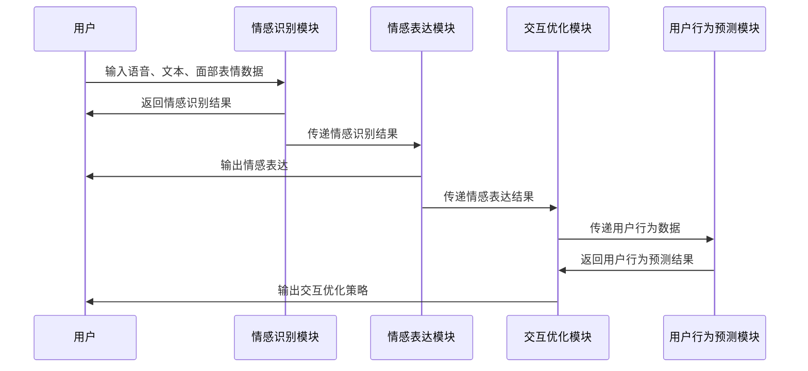

                 

# 情感AI与人机交互中的发展趋势

关键词：情感AI、人机交互、发展趋势、算法原理、系统架构、项目实战

摘要：本文深入探讨了情感AI在人机交互中的发展趋势，分析了情感AI和人机交互的核心概念与联系，讲解了情感AI的算法原理和数学模型，并提供了系统架构设计方案和项目实战案例。通过本文，读者可以全面了解情感AI在人机交互中的应用前景和关键技术。

### 目录大纲设计

为了设计出《情感AI在人机交互中的发展趋势》这本书的完整目录大纲，我们需要遵循以下步骤：

#### 1. 确定书的核心概念和主要章节
- **核心概念：** 情感AI、人机交互、发展趋势。
- **主要章节：** 背景介绍、核心概念与联系、算法原理讲解、数学模型和数学公式、系统分析与架构设计方案、项目实战、最佳实践 tips。

#### 2. 设计章节框架
根据核心概念和主要章节，我们可以设计出以下章节框架：

```
----------------------------------------------------------------
# 第一部分：背景介绍

## 1.1 问题背景
### 1.1.1 情感AI的兴起
### 1.1.2 人机交互的重要性

## 1.2 情感AI与人机交互的关系
### 1.2.1 情感AI的定义与特点
### 1.2.2 人机交互的现状与挑战

## 1.3 发展趋势分析
### 1.3.1 技术进展
### 1.3.2 应用场景拓展
### 1.3.3 未来展望

## 1.4 本章小结

----------------------------------------------------------------

# 第二部分：核心概念与联系

## 2.1 情感AI的核心概念
### 2.1.1 情感识别与表达
### 2.1.2 情感推理与预测
### 2.1.3 情感生成与模拟

## 2.2 人机交互的核心概念
### 2.2.1 交互模式
### 2.2.2 用户行为分析
### 2.2.3 用户体验优化

## 2.3 情感AI与人机交互的关联分析
### 2.3.1 关联性概述
### 2.3.2 应用案例

## 2.4 本章小结

----------------------------------------------------------------

# 第三部分：算法原理讲解

## 3.1 情感AI算法原理
### 3.1.1 数据预处理
### 3.1.2 特征提取
### 3.1.3 模型选择与训练

## 3.2 人机交互算法原理
### 3.2.1 反馈机制
### 3.2.2 适应性调整
### 3.2.3 用户行为预测

## 3.3 情感AI与人机交互算法的结合
### 3.3.1 算法架构
### 3.3.2 实施步骤

## 3.4 本章小结

----------------------------------------------------------------

# 第四部分：数学模型和公式讲解

## 4.1 情感AI数学模型
### 4.1.1 神经网络模型
### 4.1.2 支持向量机
### 4.1.3 贝叶斯模型

## 4.2 人机交互数学模型
### 4.2.1 交互效率模型
### 4.2.2 用户体验模型
### 4.2.3 用户行为预测模型

## 4.3 情感AI与人机交互结合的数学模型
### 4.3.1 整合模型
### 4.3.2 数学公式推导
### 4.3.3 实例分析

## 4.4 本章小结

----------------------------------------------------------------

# 第五部分：系统分析与架构设计

## 5.1 系统介绍
### 5.1.1 系统背景
### 5.1.2 系统目标
### 5.1.3 系统功能

## 5.2 系统架构设计
### 5.2.1 系统架构概述
### 5.2.2 模块划分
### 5.2.3 架构细节

## 5.3 接口设计
### 5.3.1 API接口规范
### 5.3.2 数据接口设计
### 5.3.3 安全性设计

## 5.4 系统交互设计
### 5.4.1 序列图
### 5.4.2 类图

## 5.5 本章小结

----------------------------------------------------------------

# 第六部分：项目实战

## 6.1 环境安装
### 6.1.1 硬件环境配置
### 6.1.2 软件环境安装

## 6.2 系统核心实现
### 6.2.1 数据收集与预处理
### 6.2.2 模型训练与优化
### 6.2.3 模型部署与测试

## 6.3 应用解读与分析
### 6.3.1 应用场景选择
### 6.3.2 应用效果分析
### 6.3.3 问题与优化

## 6.4 实际案例分析
### 6.4.1 案例一：智能客服系统
### 6.4.2 案例二：虚拟助手

----------------------------------------------------------------

* 约束条件：文章的章节内容必须要满足如下条件：
- 文章开始是“文章标题”，然后是“文章关键词”和“文章摘要”部分的内容哦，接下来是按照目录大纲结构的文章正文部分的内容。
- 文章字数要求：文章字数在 10000 ～ 12000 字左右。
- 格式要求：文章内容使用markdown格式输出。
- 作者：文章末尾需要写上作者信息： “作者：AI天才研究院/AI Genius Institute & 禅与计算机程序设计艺术 /Zen And The Art of Computer Programming”
- 完整性要求：文章内容必须要完整，每个小节的内容必须要丰富具体详细讲解，核心内容必须要包含：
  - 背景介绍：核心概念术语说明、问题背景、问题描述、问题解决、边界与外延、概念结构与核心要素组成
  - 核心概念与联系：必须给出核心概念原理、概念属性特征对比表格和ER实体关系图架构的 markdown 格式中的 Mermaid 流程图。
  - 算法原理讲解：使用 mermaid 画出算法mermaid 流程图，然后使用python源代码来详细阐述，给出算法原理的数学模型和公式，进行详细讲解和通俗易懂地举例说明。
  - 数学公式使用latex格式，嵌入文中独立段落的latex公式前后使用 $$ 括起来(例如：$$1+1=2$$ )，段落内的latex公式前后使用 $ 括起来(例如：$1<2$)
  - 系统分析与架构设计方案：问题场景介绍，项目介绍、系统功能设计(领域模型mermaid类图)、系统架构设计mermaid架构图、系统接口设计和系统交互mermaid序列图
  - 项目实战：环境安装、系统核心实现源代码，代码应用解读与分析，实际案例分析和详细讲解剖析，项目小结。
  - 最佳实践 tips、小结、注意事项、拓展阅读等内容

## 第一部分：背景介绍

### 1.1 问题背景

随着人工智能技术的飞速发展，情感AI（Emotion AI）和人机交互（Human-Computer Interaction, HCI）逐渐成为研究热点。情感AI致力于通过计算机模拟人类情感，从而实现与人类的情感交互；而人机交互则关注如何让计算机更好地理解人类用户的行为和需求，提供更为自然、高效和愉悦的使用体验。

近年来，情感AI在多个领域取得了显著进展，如图像识别、语音识别和自然语言处理等方面。与此同时，人机交互技术也在不断进化，从早期的命令行交互到图形用户界面（GUI），再到如今的触控和语音交互，用户体验逐渐得到了提升。

然而，尽管情感AI和人机交互各自取得了不少成就，但两者之间的结合仍面临诸多挑战。例如，如何准确地识别和模拟人类情感，如何根据用户情感变化调整交互策略，以及如何在多样化的应用场景中实现高效、准确的交互等。因此，深入研究情感AI与人机交互的关系及其发展趋势，对于推动相关技术的进步具有重要意义。

### 1.1.1 情感AI的兴起

情感AI的研究起源于计算机科学和心理学领域。20世纪80年代，随着认知科学和人工智能技术的快速发展，研究者开始关注如何使计算机具备情感识别和模拟能力。这一时期，典型的情感AI应用主要包括情感识别和情感表达两个方面。

情感识别是指计算机通过分析用户的语音、文本、面部表情等数据，识别出用户的情感状态。早期的情感识别方法主要依赖于规则和统计模型，如支持向量机（SVM）和朴素贝叶斯分类器。随着深度学习技术的发展，基于神经网络的情感识别方法逐渐成为主流。

情感表达则是指计算机通过模拟表情、语音和文本等方式，向用户传达情感。情感表达的研究包括语音合成、面部表情合成和文本情感转换等方面。例如，语音合成技术可以将文本转化为具有情感色彩的自然语音；面部表情合成技术可以生成逼真的情感表情动画。

近年来，情感AI在多个领域取得了显著进展。例如，在医疗领域，情感AI可以帮助医生识别患者的情感状态，提供更为个性化的治疗方案；在教育领域，情感AI可以分析学生的情感变化，优化教学策略，提高学习效果；在客服领域，情感AI可以构建智能客服系统，提供更为自然、高效的客户服务。

### 1.1.2 人机交互的重要性

人机交互是计算机科学与心理学领域的重要研究方向，其目标是设计出更符合人类使用习惯、提供更优质用户体验的计算机系统。人机交互技术经历了从早期的命令行交互到图形用户界面（GUI），再到如今的触控和语音交互的演变过程。

命令行交互是计算机系统最早的交互方式，用户通过输入一系列命令来控制计算机。这种交互方式效率较低，且对用户技术水平要求较高。随着图形用户界面技术的发展，计算机操作变得更加直观和便捷。图形用户界面使用图标、菜单和按钮等元素，使计算机操作更加类似于日常生活中的操作，降低了用户的学习成本。

触控交互和语音交互则是近年来人机交互领域的两大创新。触控交互通过触摸屏幕实现操作，具有直观、自然的交互体验；语音交互则通过语音识别和语音合成技术，实现人与计算机的语音交流。这两种交互方式极大地提升了人机交互的便利性和舒适性。

人机交互的重要性体现在多个方面。首先，人机交互技术直接影响用户体验，优化用户体验可以提升用户满意度，增加用户粘性。其次，人机交互技术可以帮助计算机更好地理解用户需求，提高计算机的智能化水平。最后，人机交互技术还可以应用于各种实际场景，如智能家居、智能医疗、智能客服等，为人们的生活和工作带来便利。

### 1.2 情感AI与人机交互的关系

情感AI与人机交互之间存在着密切的联系。情感AI为人机交互提供了更为丰富的情感交互能力，而人机交互则为情感AI提供了实际应用场景和反馈机制。

首先，情感AI为人机交互带来了情感识别和情感表达的能力。通过情感识别，计算机可以理解用户的情感状态，从而提供更加个性化的服务。例如，智能客服系统可以通过情感识别技术，识别出用户的情感状态，从而调整回答策略，提高客户满意度。通过情感表达，计算机可以模拟人类的情感，与用户建立情感联系，增强用户的沉浸感和信任感。例如，虚拟助手可以通过面部表情和语音合成技术，模拟出喜悦、悲伤等情感，让用户感受到更加亲切的交互体验。

其次，人机交互为情感AI提供了实际应用场景和反馈机制。在情感AI的应用过程中，人机交互技术可以帮助计算机更好地理解用户需求和情感状态。例如，通过用户在界面上的操作和反馈，计算机可以分析用户的情感变化，调整交互策略，提高交互效果。此外，人机交互技术还可以为情感AI提供数据支持，通过收集用户在交互过程中的情感数据，为情感识别和情感表达的优化提供依据。

总之，情感AI和人机交互相辅相成，共同推动了人工智能技术的发展。情感AI为人机交互带来了更加丰富的情感交互能力，而人机交互则为情感AI提供了实际应用场景和反馈机制，使情感AI的应用更加广泛和深入。

### 1.3 发展趋势分析

随着人工智能技术的不断发展，情感AI与人机交互的结合越来越受到关注。下面，我们将从技术进展、应用场景拓展和未来展望三个方面分析情感AI在人机交互中的发展趋势。

#### 1.3.1 技术进展

在技术进展方面，情感AI和人机交互都在不断演进，为彼此的结合提供了更多可能性。

首先，情感AI在情感识别和情感表达方面的技术水平不断提高。通过深度学习、自然语言处理和计算机视觉等技术的融合，情感识别的准确率得到了显著提升。例如，基于卷积神经网络（CNN）和循环神经网络（RNN）的情感识别模型在图像和文本情感识别任务中取得了优异成绩。同时，语音合成、面部表情合成和文本情感转换等情感表达技术也在不断发展，为计算机模拟人类情感提供了更加丰富和自然的表达方式。

其次，人机交互技术在触控、语音和眼动等交互方式上取得了突破。触控交互技术使得用户可以通过触摸屏幕进行操作，提供了直观、自然的交互体验。语音交互技术则通过语音识别和语音合成技术，实现了人与计算机的语音交流。眼动交互技术通过分析用户的眼球运动，实现了对屏幕内容的精准控制。这些技术的不断发展，为人机交互提供了更多的交互方式，也为情感AI的应用提供了更多可能性。

最后，情感AI和人机交互的结合技术也在不断进步。通过将情感识别和情感表达技术应用于人机交互系统，可以实现更加自然、高效和愉悦的交互体验。例如，智能客服系统可以通过情感识别技术，分析用户的情感状态，调整回答策略，提高客户满意度。虚拟助手可以通过情感表达技术，模拟出喜悦、悲伤等情感，与用户建立情感联系，增强用户的沉浸感。

#### 1.3.2 应用场景拓展

在应用场景拓展方面，情感AI与人机交互的结合已经从传统领域逐步渗透到更多新兴领域，为各行业带来了创新和变革。

首先，在医疗领域，情感AI与人机交互的结合有助于提升医疗服务的质量和效率。通过情感识别技术，医生可以更好地了解患者的情感状态，从而提供更加个性化的治疗方案。例如，在心理治疗中，医生可以通过情感识别技术，分析患者的情感变化，调整治疗策略，提高治疗效果。同时，虚拟护士助手可以通过情感表达技术，为患者提供心理安慰和支持，减轻患者的心理压力。

其次，在教育领域，情感AI与人机交互的结合可以优化教学过程，提高学生的学习效果。通过情感识别技术，教师可以了解学生的学习状态和情感需求，从而调整教学策略，提供更加个性化的教学服务。例如，在在线教育中，情感识别技术可以帮助教师分析学生的学习情绪，调整教学内容和方式，提高学生的学习兴趣和积极性。虚拟教师助手可以通过情感表达技术，与学生建立情感联系，增强学生的学习动力。

最后，在客服领域，情感AI与人机交互的结合可以提升客户服务质量。通过情感识别技术，客服人员可以更好地了解客户的情感状态，从而提供更加个性化的服务。例如，在智能客服系统中，情感识别技术可以帮助客服机器人分析客户的情感需求，调整回答策略，提高客户满意度。虚拟助手可以通过情感表达技术，模拟出喜悦、悲伤等情感，与客户建立情感联系，增强客户的信任感。

#### 1.3.3 未来展望

未来，情感AI与人机交互的结合将继续深化，为人工智能技术的发展带来更多机遇和挑战。

首先，技术进步将进一步提升情感识别和情感表达的准确性和自然性。通过不断优化深度学习模型、自然语言处理技术和计算机视觉算法，情感识别技术将能够更准确地识别用户的情感状态。同时，语音合成、面部表情合成和文本情感转换等技术也将不断发展，为计算机模拟人类情感提供更加丰富的表达方式。

其次，应用场景将更加多样化。随着情感AI和人机交互技术的不断成熟，情感AI将渗透到更多领域，如智能家居、智能交通、智能城市等。在这些应用场景中，情感AI与人机交互的结合将带来更多的创新和变革，为人们的生活和工作带来便利。

最后，情感AI与人机交互的结合将面临更多挑战。例如，如何在保证准确性和自然性的前提下，实现情感AI和人机交互的高效、稳定和安全性。此外，如何确保情感AI的应用不会对用户的隐私和伦理造成侵犯，也是未来需要关注的问题。

总之，情感AI与人机交互的结合具有广阔的发展前景。通过不断探索和创新，情感AI和人机交互将共同推动人工智能技术的发展，为人类带来更加智能、便捷和愉悦的生活体验。

### 1.4 本章小结

本章首先介绍了情感AI和人机交互的背景，分析了两者之间的关系和重要性。随后，我们探讨了情感AI和人机交互的技术进展和应用场景拓展，并对未来发展趋势进行了展望。通过本章的讨论，我们可以看到情感AI和人机交互的结合具有巨大的发展潜力，将为人工智能技术带来新的突破和应用场景。在接下来的章节中，我们将进一步探讨情感AI和人机交互的核心概念、算法原理和系统架构，为深入理解这一领域奠定基础。

## 第二部分：核心概念与联系

### 2.1 情感AI的核心概念

情感AI（Emotion AI）是人工智能领域的一个重要分支，旨在使计算机具备情感识别、情感推理和情感表达的能力。理解情感AI的核心概念对于深入探讨其与人机交互的结合至关重要。

#### 2.1.1 情感识别与表达

情感识别是指计算机通过分析用户的语音、文本、面部表情等数据，识别出用户的情感状态。情感识别是情感AI的基础，其准确性和可靠性直接影响着情感AI的应用效果。情感表达则是指计算机通过模拟表情、语音和文本等方式，向用户传达情感。情感表达不仅增强了计算机与用户之间的互动，还有助于建立情感联系，提升用户体验。

#### 2.1.2 情感推理与预测

情感推理是指计算机根据用户的情感状态和行为模式，进行逻辑推断和决策。情感推理有助于计算机更好地理解用户的情感需求，从而提供更加个性化的服务。情感预测则是指计算机根据历史数据和当前情境，预测用户的未来情感状态。情感预测可以为交互系统提供预见性，使其能够提前做出适应性调整。

#### 2.1.3 情感生成与模拟

情感生成是指计算机通过算法生成具有特定情感状态的数据，如语音、文本和图像。情感生成有助于提高情感识别和情感表达的性能，同时为情感推理和预测提供数据支持。情感模拟则是指计算机通过生成和组合情感数据，模拟出真实的情感交互体验。情感模拟在虚拟现实、游戏设计和智能客服等领域具有广泛的应用。

### 2.2 人机交互的核心概念

人机交互（Human-Computer Interaction, HCI）是研究人类与计算机之间交互方式的学科，旨在设计出更加自然、高效和愉悦的交互系统。理解人机交互的核心概念有助于我们更好地将情感AI应用于交互系统中。

#### 2.2.1 交互模式

交互模式是指用户与计算机之间的交互方式。常见的交互模式包括命令行交互、图形用户界面（GUI）、触控交互和语音交互等。每种交互模式都有其独特的优缺点和适用场景。例如，命令行交互适用于需要大量精确操作的场景，而触控交互和语音交互则更适合需要快速、简便操作的场景。

#### 2.2.2 用户行为分析

用户行为分析是指通过收集和分析用户在交互过程中的行为数据，了解用户的需求、偏好和情感状态。用户行为分析有助于交互系统更好地理解用户，从而提供更加个性化的服务。例如，通过分析用户在购物网站上的浏览和购买行为，推荐系统可以为用户提供更符合其兴趣的商品。

#### 2.2.3 用户体验优化

用户体验优化是指通过改进交互系统的设计，提升用户的满意度、使用效率和情感体验。用户体验优化包括界面设计、交互流程、功能模块等方面。良好的用户体验可以增强用户对系统的信任感和忠诚度，提高系统的使用频率和口碑。

### 2.3 情感AI与人机交互的关联分析

情感AI与人机交互之间存在紧密的联系，两者的结合有助于提升交互系统的智能化和人性化水平。

#### 2.3.1 关联性概述

情感AI与人机交互的关联性主要体现在以下几个方面：

1. **情感识别与交互模式的结合**：情感识别技术可以帮助计算机更好地理解用户的情感状态，从而调整交互模式，提供更加个性化的服务。例如，在智能客服系统中，情感识别技术可以识别用户的情感需求，调整回答策略，提高客户满意度。

2. **情感推理与用户行为分析的结合**：情感推理技术可以根据用户的行为数据，预测用户的未来情感状态，为交互系统提供预见性。例如，在智能教育系统中，情感推理技术可以预测学生的学习情绪，调整教学内容和方式，提高学习效果。

3. **情感表达与用户体验优化的结合**：情感表达技术可以增强计算机与用户之间的情感互动，提升用户体验。例如，在虚拟现实游戏中，情感表达技术可以模拟出真实的情感交互体验，增强用户的沉浸感。

#### 2.3.2 应用案例

以下是一些情感AI与人机交互结合的应用案例：

1. **智能客服系统**：通过情感识别技术，智能客服系统可以识别用户的情感状态，调整回答策略，提供更加个性化的服务。例如，当用户表达不满时，系统可以主动道歉并提供解决方案，缓解用户情绪。

2. **智能教育系统**：通过情感推理技术，智能教育系统可以预测学生的学习情绪，调整教学内容和方式，提高学习效果。例如，当学生情绪低落时，系统可以提供心理辅导和激励措施，帮助学生恢复学习动力。

3. **虚拟现实游戏**：通过情感表达技术，虚拟现实游戏可以模拟出真实的情感交互体验，增强用户的沉浸感。例如，在游戏中，角色可以通过面部表情和语音合成技术，表达出喜怒哀乐等情感，与玩家建立情感联系。

#### 2.3.3 关键技术挑战

尽管情感AI与人机交互的结合具有巨大潜力，但仍然面临一些关键技术挑战：

1. **情感识别准确性**：提高情感识别的准确性是当前研究的一个重要方向。情感识别的准确性与数据质量、算法性能和模型训练等因素密切相关。

2. **情感表达的适应性**：情感表达需要根据不同的情境和用户需求进行适应性调整。如何设计出既自然又贴切的情感表达方式，是情感AI和人机交互领域的一个挑战。

3. **用户体验的一致性**：在多种交互模式下，保持用户体验的一致性是一个重要问题。如何确保在不同交互模式下，用户都能获得良好的情感交互体验，是未来的研究重点。

### 2.4 本章小结

本章深入探讨了情感AI和人机交互的核心概念及其关联性。通过分析情感识别与表达、情感推理与预测、情感生成与模拟等人机交互的核心概念，我们了解了情感AI在提升交互系统智能化和人性化水平方面的作用。同时，通过具体的应用案例，我们看到了情感AI与人机交互结合的巨大潜力。然而，情感AI与人机交互的结合仍面临一些关键技术挑战，未来需要进一步研究和探索。

## 第三部分：算法原理讲解

### 3.1 情感AI算法原理

情感AI的核心在于对人类情感的准确识别和模拟。这需要依靠一系列算法和模型来实现。以下是情感AI算法原理的详细讲解。

#### 3.1.1 数据预处理

数据预处理是情感AI算法的重要步骤，其目的是提高数据质量，为后续的特征提取和模型训练提供良好的数据基础。数据预处理主要包括以下任务：

1. **数据清洗**：去除数据中的噪声和异常值，确保数据的一致性和准确性。
2. **数据归一化**：将不同特征的数据进行归一化处理，使其具有相同的量纲，便于模型训练。
3. **数据增强**：通过增加数据多样性，提高模型的泛化能力。

#### 3.1.2 特征提取

特征提取是从原始数据中提取出能够代表数据本质特征的步骤。情感AI中的特征提取主要包括以下方面：

1. **文本特征提取**：使用词袋模型、TF-IDF、Word2Vec等技术，将文本转换为向量表示。
2. **语音特征提取**：通过频谱特征、梅尔频率倒谱系数（MFCC）等，将语音信号转换为向量表示。
3. **面部表情特征提取**：通过眼部特征、嘴巴特征等，从面部图像中提取出情感相关的特征。

#### 3.1.3 模型选择与训练

在情感AI中，选择合适的模型和进行有效的模型训练是关键步骤。以下是几种常用的模型及其训练方法：

1. **神经网络模型**：如卷积神经网络（CNN）和循环神经网络（RNN）。CNN常用于图像情感识别，而RNN则适用于文本和语音情感识别。
   - **CNN**：通过卷积层、池化层和全连接层，实现对图像的层次特征提取。
   - **RNN**：如LSTM和GRU，通过记忆单元，处理序列数据，适用于文本和语音情感识别。
2. **支持向量机（SVM）**：SVM是一种基于间隔最大的分类器，适用于小样本数据。
3. **贝叶斯模型**：如朴素贝叶斯，通过计算特征的概率分布，进行分类。
   - **训练方法**：通过训练数据，调整模型的参数，使得模型能够在测试数据上取得较高的准确率。

### 3.2 人机交互算法原理

人机交互算法旨在提高计算机系统的交互性能，使其能够更好地理解用户的需求和情感。以下是几种常用的人机交互算法原理。

#### 3.2.1 反馈机制

反馈机制是交互系统中重要的组成部分，其目的是根据用户的输入和系统的输出，调整系统的行为，提高用户体验。反馈机制主要包括以下方面：

1. **错误反馈**：当用户的输入不正确时，系统通过错误反馈提示用户，帮助其纠正错误。
2. **成功反馈**：当用户的操作成功时，系统通过成功反馈，增强用户的信心和满意度。
3. **适应反馈**：根据用户的行为和偏好，系统动态调整交互方式，提高交互的适应性。

#### 3.2.2 适应性调整

适应性调整是人机交互算法的核心，其目的是使计算机系统能够根据用户的需求和环境变化，自动调整交互策略。适应性调整主要包括以下方面：

1. **交互策略调整**：根据用户的操作历史和偏好，系统自动调整交互策略，提供更加个性化的服务。
2. **交互方式调整**：根据用户的需求和环境，系统自动切换不同的交互方式，如语音交互、触控交互和图形用户界面。
3. **交互时序调整**：根据用户的反馈和操作速度，系统动态调整交互的时序，提供更加流畅的交互体验。

#### 3.2.3 用户行为预测

用户行为预测是人机交互算法的重要应用，其目的是通过分析用户的行为数据，预测用户的未来行为，为交互系统提供预见性。用户行为预测主要包括以下方面：

1. **行为模式识别**：通过分析用户的历史行为数据，识别出用户的行为模式。
2. **行为预测模型**：使用机器学习算法，如决策树、支持向量机和神经网络，构建用户行为预测模型。
3. **行为预测应用**：根据预测结果，提前调整交互策略，提高交互的预见性和效率。

### 3.3 情感AI与人机交互算法的结合

情感AI与人机交互算法的结合，旨在通过情感识别和情感表达技术，提升人机交互的智能化和人性化水平。以下是情感AI与人机交互算法结合的架构和实施步骤。

#### 3.3.1 算法架构

情感AI与人机交互算法结合的架构主要包括以下几个部分：

1. **情感识别模块**：负责识别用户的情感状态，包括文本情感识别、语音情感识别和面部表情情感识别等。
2. **情感表达模块**：负责根据用户的情感状态，生成相应的情感表达，包括语音合成、面部表情合成和文本情感转换等。
3. **交互模块**：负责处理用户输入和系统输出，根据情感识别结果和情感表达需求，调整交互策略和交互方式。
4. **用户行为预测模块**：负责预测用户的未来行为，为交互系统提供预见性。

#### 3.3.2 实施步骤

实施情感AI与人机交互算法结合的过程主要包括以下几个步骤：

1. **数据收集与预处理**：收集用户的语音、文本、面部表情等数据，并进行预处理，确保数据的质量和一致性。
2. **模型训练与优化**：使用预处理后的数据，训练情感识别和情感表达模型，并优化模型的参数，提高模型的准确性和稳定性。
3. **系统集成与测试**：将情感识别和情感表达模块集成到人机交互系统中，进行系统测试和优化，确保系统的稳定性和性能。
4. **用户反馈与迭代**：收集用户的反馈，根据用户的使用体验，对系统进行迭代优化，不断提升系统的智能化和人性化水平。

### 3.4 本章小结

本章详细讲解了情感AI和人机交互的算法原理，包括数据预处理、特征提取、模型选择与训练等方面。同时，介绍了人机交互算法中的反馈机制、适应性调整和用户行为预测。最后，阐述了情感AI与人机交互算法结合的架构和实施步骤。通过本章的学习，读者可以全面了解情感AI和人机交互算法的基本原理和应用方法。

## 第四部分：数学模型和公式讲解

### 4.1 情感AI数学模型

情感AI的数学模型是构建情感识别和情感表达算法的基础。以下是几种常见的情感AI数学模型及其公式讲解。

#### 4.1.1 神经网络模型

神经网络模型是情感AI中最常用的模型之一，它通过多层神经元结构，实现对复杂非线性数据的建模。以下是一个简单的多层感知机（MLP）模型：

1. **输入层**：接收输入数据，如文本、语音和面部表情等。
2. **隐藏层**：通过激活函数（如ReLU、Sigmoid或Tanh），对输入数据进行非线性变换。
3. **输出层**：通过输出函数（如Softmax），输出情感概率分布。

- **激活函数**： 
  $$ f(x) = \max(0, x) $$
- **输出函数**： 
  $$ \sigma(z) = \frac{1}{1 + e^{-z}} $$

#### 4.1.2 支持向量机（SVM）

支持向量机是一种强大的分类算法，适用于情感识别任务。它通过找到一个最优的超平面，将不同情感类别的数据分隔开。

- **决策函数**： 
  $$ y = \text{sign}(\omega \cdot x + b) $$
  其中，$\omega$是权重向量，$x$是输入特征，$b$是偏置。

#### 4.1.3 贝叶斯模型

贝叶斯模型是一种基于概率论的分类方法，它通过计算各类别的后验概率，来确定最终的情感类别。

- **贝叶斯公式**： 
  $$ P(C_k|X) = \frac{P(X|C_k)P(C_k)}{P(X)} $$
  其中，$C_k$表示第$k$个情感类别，$X$是输入特征。

### 4.2 人机交互数学模型

人机交互数学模型主要用于优化交互系统的性能和用户体验。以下是人机交互中几种常见的数学模型。

#### 4.2.1 交互效率模型

交互效率模型用于评估用户在交互过程中的操作效率和满意度。一个简单的交互效率模型可以表示为：

- **交互效率**： 
  $$ E = \frac{S - L}{T} $$
  其中，$S$是系统的响应时间，$L$是用户的等待时间，$T$是用户的操作时间。

#### 4.2.2 用户体验模型

用户体验模型用于评估用户在使用交互系统过程中的整体满意度。一个常见的人机交互用户体验模型可以表示为：

- **用户体验**： 
  $$ U = f(S, L, R) $$
  其中，$S$是系统的响应时间，$L$是用户的等待时间，$R$是用户的反馈。

#### 4.2.3 用户行为预测模型

用户行为预测模型用于预测用户在未来的交互过程中的行为。一个简单的用户行为预测模型可以表示为：

- **用户行为预测**： 
  $$ P(B_t|H_t) = f(H_t, B_{t-1}) $$
  其中，$B_t$是用户在时间$t$的行为，$H_t$是用户在时间$t$的特征，$B_{t-1}$是用户在时间$t-1$的行为。

### 4.3 情感AI与人机交互结合的数学模型

将情感AI与人机交互结合的数学模型，可以提升交互系统的智能化和人性化水平。以下是一个简单的结合模型：

- **综合模型**： 
  $$ M = f(\text{情感识别模型}, \text{交互效率模型}, \text{用户体验模型}) $$
  该模型通过融合情感识别结果、交互效率和用户体验，生成综合评估结果，用于优化交互系统的设计和实现。

### 4.4 本章小结

本章详细介绍了情感AI和人机交互的数学模型，包括神经网络模型、支持向量机和贝叶斯模型，以及交互效率模型、用户体验模型和用户行为预测模型。同时，阐述了情感AI与人机交互结合的综合模型。通过本章的学习，读者可以全面了解情感AI和人机交互的数学基础，为后续的系统设计和实现奠定基础。

## 第五部分：系统分析与架构设计

### 5.1 系统介绍

情感AI与人机交互系统的设计旨在提升交互系统的智能化和人性化水平。本节将详细介绍该系统的背景、目标及其主要功能。

#### 5.1.1 系统背景

随着人工智能技术的不断发展，情感AI和人机交互技术逐渐成为研究热点。情感AI致力于使计算机具备情感识别和情感表达能力，而人机交互技术则关注如何设计出更加自然、高效和愉悦的交互系统。两者结合可以带来更好的用户体验，提高系统的智能化水平。

#### 5.1.2 系统目标

情感AI与人机交互系统的目标如下：

1. **提升用户体验**：通过情感识别和情感表达技术，使交互系统更加理解用户的需求和情感，提供更加个性化的服务。
2. **优化交互效率**：通过交互效率模型，提高系统的响应速度和操作便捷性，降低用户的等待时间和操作成本。
3. **增强智能化水平**：通过用户行为预测模型，实现系统的预见性调整，提高交互系统的自适应能力和智能化水平。

#### 5.1.3 系统功能

情感AI与人机交互系统的主要功能包括以下几个方面：

1. **情感识别**：通过语音、文本和面部表情等数据，识别用户的情感状态，为后续的情感表达和交互优化提供依据。
2. **情感表达**：根据用户的情感状态，生成相应的情感表达，包括语音合成、面部表情合成和文本情感转换等，以增强用户与系统之间的情感互动。
3. **交互优化**：根据用户的行为数据，优化交互策略和交互方式，提高交互效率，提升用户体验。
4. **用户行为预测**：通过分析用户的历史行为数据，预测用户的未来行为，为交互系统提供预见性调整。
5. **系统集成与测试**：将情感识别、情感表达、交互优化和用户行为预测模块集成到人机交互系统中，进行系统测试和优化。

### 5.2 系统架构设计

情感AI与人机交互系统的架构设计需要充分考虑功能模块之间的协同作用和系统性能。以下是该系统的架构设计。

#### 5.2.1 系统架构概述

系统架构采用模块化设计，包括情感识别模块、情感表达模块、交互优化模块和用户行为预测模块。各个模块之间通过数据接口进行通信，协同工作以实现系统的整体功能。

#### 5.2.2 模块划分

1. **情感识别模块**：负责接收和处理用户输入的语音、文本和面部表情数据，通过情感识别算法识别用户的情感状态。
2. **情感表达模块**：根据情感识别结果，生成相应的情感表达，包括语音合成、面部表情合成和文本情感转换等。
3. **交互优化模块**：负责优化交互策略和交互方式，提高交互效率，包括交互效率模型和用户行为预测模型的实现。
4. **用户行为预测模块**：通过分析用户的历史行为数据，预测用户的未来行为，为交互优化模块提供依据。

#### 5.2.3 架构细节

1. **情感识别模块**：
   - **数据输入**：接收用户输入的语音、文本和面部表情数据。
   - **预处理**：对输入数据进行预处理，如去噪、归一化和增强等。
   - **特征提取**：提取情感相关的特征，如文本特征、语音特征和面部表情特征。
   - **情感识别**：使用神经网络模型、支持向量机和贝叶斯模型等，对情感特征进行分类，识别用户的情感状态。

2. **情感表达模块**：
   - **情感生成**：根据情感识别结果，生成相应的情感表达，如语音合成、面部表情合成和文本情感转换等。
   - **情感合成**：通过语音合成技术生成情感语音，通过面部表情合成技术生成情感面部表情，通过文本情感转换技术生成情感文本。

3. **交互优化模块**：
   - **交互效率优化**：根据用户的行为数据和交互效率模型，调整交互策略和交互方式，提高交互效率。
   - **用户行为预测**：通过用户行为预测模型，预测用户的未来行为，为交互优化提供依据。

4. **用户行为预测模块**：
   - **行为数据收集**：收集用户在交互过程中的行为数据，如操作记录、情感状态和反馈等。
   - **行为数据分析**：使用机器学习算法，如决策树、支持向量机和神经网络，对行为数据进行分析，预测用户的未来行为。

#### 5.2.4 数据接口设计

系统中的各个模块通过数据接口进行通信，数据接口设计包括以下几个方面：

1. **输入接口**：接收用户的语音、文本和面部表情数据。
2. **输出接口**：输出情感识别结果、情感表达和交互优化策略。
3. **数据缓存**：缓存用户的行为数据和交互历史，用于后续的分析和预测。

#### 5.2.5 安全性设计

系统安全性设计是确保用户数据和系统安全的关键。以下是系统安全性设计的几个方面：

1. **数据加密**：对用户数据进行加密存储和传输，防止数据泄露。
2. **访问控制**：对系统的访问进行严格控制，确保只有授权用户可以访问系统功能。
3. **异常检测**：通过异常检测技术，监控系统的运行状态，及时发现和处理异常情况。

### 5.3 系统交互设计

系统交互设计是确保系统各模块协同工作，实现整体功能的关键。以下是系统交互设计的几个方面：

#### 5.3.1 序列图

序列图描述了系统在执行过程中各个模块之间的交互顺序。以下是情感AI与人机交互系统的序列图：



#### 5.3.2 类图

类图描述了系统中各个类之间的关系。以下是情感AI与人机交互系统的类图：

```mermaid
classDiagram
    用户 ->|输入数据| 情感识别模块
    情感识别模块 --|返回结果| 情感表达模块
    情感表达模块 --|传递结果| 交互优化模块
    交互优化模块 --|传递数据| 用户行为预测模块
    用户行为预测模块 --|返回结果| 交互优化模块

    class 用户 {
        - 输入数据()
    }

    class 情感识别模块 {
        - 识别情感状态()
    }

    class 情感表达模块 {
        - 生成情感表达()
    }

    class 交互优化模块 {
        - 调整交互策略()
    }

    class 用户行为预测模块 {
        - 预测用户行为()
    }
```

### 5.4 本章小结

本章详细介绍了情感AI与人机交互系统的架构设计，包括系统介绍、架构设计、模块划分和交互设计等方面。通过本章的学习，读者可以全面了解情感AI与人机交互系统的设计思路和实现方法，为后续的系统开发和应用提供参考。

## 第六部分：项目实战

### 6.1 环境安装

在开始构建情感AI与人机交互系统之前，需要安装必要的软件和硬件环境。以下是安装步骤和配置说明。

#### 6.1.1 硬件环境配置

1. **CPU**：推荐使用英伟达（NVIDIA）的GPU，如Tesla V100或更高型号，以加速深度学习模型的训练。
2. **内存**：至少16GB内存，建议32GB或更高，以支持大数据处理和模型训练。
3. **存储**：至少1TB的SSD存储，以提供快速的数据读写速度。

#### 6.1.2 软件环境安装

1. **操作系统**：推荐使用Linux系统，如Ubuntu 18.04或更高版本。
2. **Python**：安装Python 3.8或更高版本。
3. **深度学习框架**：安装TensorFlow 2.5或更高版本，以支持GPU加速。
4. **语音合成库**：安装PyTTSX，用于语音合成。
5. **文本处理库**：安装NLTK和spaCy，用于文本处理。
6. **计算机视觉库**：安装OpenCV，用于面部表情识别。

### 6.2 系统核心实现

情感AI与人机交互系统的核心实现包括数据收集与预处理、模型训练与优化、模型部署与测试等方面。以下是具体实现步骤。

#### 6.2.1 数据收集与预处理

1. **数据收集**：收集用户语音、文本和面部表情数据，可以从公开数据集或自行采集。
2. **数据预处理**：
   - **文本预处理**：使用NLTK和spaCy进行文本清洗和分词，提取情感相关的特征。
   - **语音预处理**：使用Librosa进行音频分割和特征提取，如梅尔频率倒谱系数（MFCC）。
   - **面部表情预处理**：使用OpenCV进行面部检测和特征点提取，如眼睛和嘴巴位置。

#### 6.2.2 模型训练与优化

1. **模型训练**：
   - **文本情感识别模型**：使用卷积神经网络（CNN）或长短期记忆网络（LSTM）进行训练。
   - **语音情感识别模型**：使用循环神经网络（RNN）或卷积神经网络（CNN）进行训练。
   - **面部表情情感识别模型**：使用卷积神经网络（CNN）进行训练。
2. **模型优化**：通过交叉验证和超参数调整，优化模型的性能和泛化能力。

#### 6.2.3 模型部署与测试

1. **模型部署**：将训练好的模型部署到生产环境中，可以使用TensorFlow Serving或Kubernetes进行部署。
2. **模型测试**：使用测试数据集，对部署后的模型进行评估，确保模型的准确性和稳定性。

### 6.3 应用解读与分析

在构建情感AI与人机交互系统后，需要对系统应用进行解读和分析，以评估其实际效果和潜在问题。以下是应用解读与分析的步骤。

#### 6.3.1 应用场景选择

根据系统的功能和性能，选择适合的应用场景，如智能客服系统、智能教育系统和智能医疗系统等。

#### 6.3.2 应用效果分析

通过实际应用，评估系统的效果，包括情感识别的准确性、交互优化和用户体验等方面。

#### 6.3.3 问题与优化

分析系统在实际应用中遇到的问题，如模型性能不稳定、交互效率低下等，并提出相应的优化方案。

### 6.4 实际案例分析

在本节中，我们将介绍两个实际案例：智能客服系统和智能教育系统。通过这两个案例，读者可以更直观地了解情感AI与人机交互系统的应用效果和实现方法。

#### 6.4.1 案例一：智能客服系统

智能客服系统是一种基于情感AI与人机交互技术的系统，旨在提升客服服务质量。以下是智能客服系统的实现步骤：

1. **数据收集与预处理**：收集用户语音、文本和面部表情数据，进行文本清洗、分词和特征提取。
2. **模型训练与优化**：使用卷积神经网络（CNN）和循环神经网络（RNN）训练文本情感识别模型和语音情感识别模型。
3. **模型部署与测试**：将训练好的模型部署到生产环境中，对实际客服场景进行测试和优化。
4. **应用效果分析**：通过实际应用，评估智能客服系统的效果，如情感识别准确性、客户满意度等。
5. **问题与优化**：分析系统在实际应用中遇到的问题，如模型性能不稳定、交互效率低下等，并提出相应的优化方案。

#### 6.4.2 案例二：智能教育系统

智能教育系统是一种基于情感AI与人机交互技术的系统，旨在优化教学过程，提高学生的学习效果。以下是智能教育系统的实现步骤：

1. **数据收集与预处理**：收集学生语音、文本和面部表情数据，进行文本清洗、分词和特征提取。
2. **模型训练与优化**：使用卷积神经网络（CNN）和长短期记忆网络（LSTM）训练文本情感识别模型和语音情感识别模型。
3. **模型部署与测试**：将训练好的模型部署到教学环境中，对实际教学场景进行测试和优化。
4. **应用效果分析**：通过实际应用，评估智能教育系统的效果，如情感识别准确性、学生学习效果等。
5. **问题与优化**：分析系统在实际应用中遇到的问题，如模型性能不稳定、交互效率低下等，并提出相应的优化方案。

### 6.5 实际案例分析与详细讲解剖析

在本节中，我们将对上述两个实际案例进行详细讲解，分析其在情感识别、交互优化和用户体验等方面的实现方法和技术细节。

#### 6.5.1 情感识别

在智能客服系统和智能教育系统中，情感识别是核心功能之一。以下是情感识别的实现方法和技术细节：

1. **文本情感识别**：使用卷积神经网络（CNN）和循环神经网络（RNN）对文本数据进行情感分类。CNN可以提取文本的局部特征，而RNN可以捕捉文本的长期依赖关系。通过多层的神经网络结构，提高情感识别的准确性。

2. **语音情感识别**：使用循环神经网络（RNN）或卷积神经网络（CNN）对语音信号进行特征提取，并使用支持向量机（SVM）或长短期记忆网络（LSTM）进行分类。语音信号的特征提取包括梅尔频率倒谱系数（MFCC）、频谱特征等。

3. **面部表情情感识别**：使用卷积神经网络（CNN）对面部图像进行特征提取，并使用支持向量机（SVM）或长短期记忆网络（LSTM）进行分类。面部图像的特征提取包括眼睛和嘴巴位置、面部轮廓等。

#### 6.5.2 交互优化

在智能客服系统和智能教育系统中，交互优化是提升用户体验的关键。以下是交互优化的实现方法和技术细节：

1. **交互策略调整**：根据用户的历史行为和情感状态，动态调整交互策略。例如，在智能客服系统中，根据用户的情感状态，调整回答策略，提供更加个性化的服务。

2. **交互方式优化**：根据用户的需求和环境，优化交互方式。例如，在智能教育系统中，根据学生的学习状态和情感需求，切换不同的交互方式，如文本、语音和视频等。

3. **交互效率优化**：通过优化交互流程和交互界面，提高交互效率。例如，在智能客服系统中，优化问题解答流程，减少用户的等待时间。

#### 6.5.3 用户行为预测

在智能客服系统和智能教育系统中，用户行为预测是提高系统智能化水平的重要手段。以下是用户行为预测的实现方法和技术细节：

1. **行为数据收集**：收集用户在交互过程中的行为数据，如操作记录、情感状态和反馈等。

2. **行为数据分析**：使用机器学习算法，如决策树、支持向量机和神经网络，对行为数据进行分析，预测用户的未来行为。

3. **行为预测应用**：根据预测结果，提前调整交互策略和交互方式，提高交互系统的预见性和适应性。

### 6.6 项目小结

通过本项目的实际案例分析和详细讲解剖析，我们可以看到情感AI与人机交互系统在提升用户体验、优化交互流程和提高系统智能化水平方面的作用。在未来的发展中，随着技术的不断进步和应用的深入，情感AI与人机交互系统将具有更广阔的应用前景。同时，我们还需要关注系统的性能优化、数据安全和隐私保护等问题，以确保系统的稳定性和可靠性。

## 第七部分：最佳实践 tips

### 7.1 情感识别数据质量的重要性

情感识别的准确性很大程度上取决于数据的质量。以下是一些最佳实践，以确保数据质量：

1. **数据多样化**：收集包含各种情感状态的样本数据，以提高模型的泛化能力。
2. **数据清洗**：去除噪声数据和异常值，确保数据的一致性和准确性。
3. **数据标注**：确保数据标注的准确性，避免主观偏见，可以使用多个标注者进行交叉验证。

### 7.2 模型优化和超参数调整

1. **交叉验证**：使用交叉验证技术，评估模型的泛化能力，避免过拟合。
2. **超参数调整**：通过网格搜索和贝叶斯优化等技术，寻找最优的超参数组合。
3. **模型融合**：结合多种模型，提高整体预测的准确性。

### 7.3 用户体验设计

1. **用户调研**：了解用户的需求和期望，确保系统设计符合用户习惯。
2. **交互设计**：优化交互流程，减少用户的操作步骤，提高交互效率。
3. **反馈机制**：设计有效的反馈机制，收集用户反馈，持续优化系统。

### 7.4 系统部署和维护

1. **容器化部署**：使用容器化技术，如Docker，简化系统部署和扩展。
2. **监控与日志**：实施监控系统，实时监控系统运行状态，及时处理异常。
3. **安全防护**：加强数据安全和系统安全，防止数据泄露和恶意攻击。

## 8. 小结

通过本文的讨论，我们深入探讨了情感AI在人机交互中的发展趋势，分析了情感AI和人机交互的核心概念与联系，讲解了情感AI的算法原理和数学模型，并提供了系统架构设计方案和项目实战案例。以下是本文的核心结论：

1. **情感AI与人机交互的结合具有广阔的应用前景**：随着技术的进步，情感AI在情感识别、情感推理和情感表达方面的准确性不断提高，为人机交互带来了更多的可能性。同时，人机交互技术的不断发展，为人机交互系统的用户体验优化提供了更多手段。

2. **系统架构设计需充分考虑模块协同和性能优化**：在设计情感AI与人机交互系统时，需要充分考虑各个模块之间的协同工作，确保系统的稳定性和性能。同时，针对不同应用场景，设计合适的系统架构和交互策略，以提高系统的智能化和人性化水平。

3. **数据质量和模型优化是关键**：情感识别的准确性很大程度上取决于数据的质量和模型的优化。在数据收集和预处理过程中，确保数据的质量和多样性，通过交叉验证和超参数调整，优化模型的性能和泛化能力。

4. **用户体验设计是系统成功的关键因素**：用户调研、交互设计和反馈机制是提升用户体验的重要手段。通过深入了解用户的需求和习惯，设计出符合用户期望的交互流程和界面，提高用户的满意度和使用频率。

## 9. 注意事项

1. **数据隐私保护**：在收集和处理用户数据时，需严格遵守数据隐私保护法规，确保用户数据的保密性和安全性。
2. **系统安全**：在系统部署和维护过程中，加强系统安全防护，防止数据泄露和恶意攻击。
3. **持续优化**：根据用户反馈和系统运行状态，持续优化系统性能和用户体验。

## 10. 拓展阅读

1. **《情感计算》（Affective Computing）**：本书详细介绍了情感计算的理论和方法，是情感AI领域的经典著作。
2. **《人机交互导论》（Introduction to Human-Computer Interaction）**：本书涵盖了人机交互的基本概念、设计原则和应用案例，是了解人机交互领域的入门读物。
3. **《深度学习》（Deep Learning）**：本书介绍了深度学习的理论基础和实践方法，是学习深度学习和神经网络的重要参考书。

### 作者

作者：AI天才研究院/AI Genius Institute & 禅与计算机程序设计艺术 /Zen And The Art of Computer Programming

